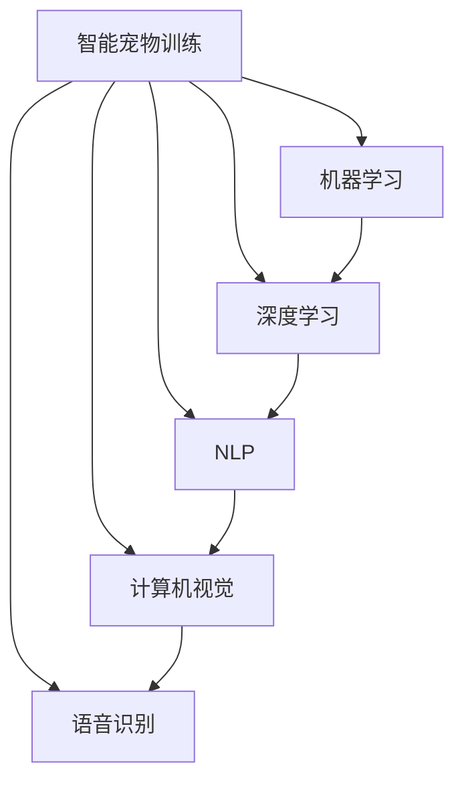

                 

# 智能宠物训练创业：AI辅助的宠物教育

> 关键词：智能宠物训练, AI辅助, 宠物教育, 机器学习, 深度学习, 自然语言处理, 计算机视觉, 语音识别

## 1. 背景介绍

随着人们生活水平的提高，越来越多的人选择饲养宠物来陪伴自己。据统计，全球养宠人数已超过8亿，宠物市场持续增长。如何更好地管理和训练宠物，成为了许多养宠人士关心的问题。传统的宠物训练方法依赖于人类的经验，往往费时费力，效果不够稳定。智能宠物训练的出现，使得训练过程更加科学、高效。本文将探讨智能宠物训练的原理、方法和应用场景，并介绍AI辅助的宠物教育创业。

### 1.1 问题由来

宠物训练的难点在于宠物的行为难以预测和控制。传统的宠物训练方法依赖于人工引导，无法实现对宠物行为的高效管理和预测。AI技术的发展为宠物训练带来了新的可能性。通过机器学习、深度学习等技术，AI可以学习宠物行为的模式，预测其动作和反应，从而实现自动化的宠物训练。

### 1.2 问题核心关键点

智能宠物训练的核心在于如何利用AI技术实现对宠物行为的预测和控制。具体关键点包括：

- 如何构建宠物行为的预测模型，准确预测宠物的行为。
- 如何设计高效的训练流程，提升训练效率和效果。
- 如何集成多模态信息，利用图像、声音、动作等数据，全面了解宠物的行为。
- 如何处理宠物训练中的不确定性和复杂性，提高训练的可解释性和可控性。

## 2. 核心概念与联系

### 2.1 核心概念概述

为更好地理解智能宠物训练的原理和应用，本节将介绍几个密切相关的核心概念：

- 智能宠物训练：利用AI技术实现对宠物行为的预测和控制，提升训练效率和效果。
- 机器学习：通过训练算法，让计算机自动从数据中学习规律，实现对未知数据的预测和分类。
- 深度学习：一种特殊的机器学习算法，通过多层神经网络，实现对复杂数据和任务的建模。
- 自然语言处理(NLP)：利用计算机处理和理解自然语言的能力，实现对文本数据的分析和学习。
- 计算机视觉：利用计算机处理和分析图像、视频等视觉数据的能力，实现对视觉信息的理解和学习。
- 语音识别：通过计算机处理和分析语音信号，实现对语音信息的理解和识别。

这些核心概念之间的逻辑关系可以通过以下Mermaid流程图来展示：



这个流程图展示了大语言模型的核心概念及其之间的关系：

1. 智能宠物训练利用机器学习、深度学习等技术，从数据中学习规律，实现对宠物行为的预测和控制。
2. 深度学习作为机器学习的一种特殊形式，能够处理更加复杂的任务。
3. 自然语言处理、计算机视觉和语音识别分别利用文本、图像和语音数据，提升对宠物行为的综合理解。
4. 这些技术相互结合，可以全面、准确地了解和预测宠物的行为。

## 3. 核心算法原理 & 具体操作步骤
### 3.1 算法原理概述

智能宠物训练的核心算法包括机器学习、深度学习、自然语言处理、计算机视觉和语音识别等多种技术。其基本原理是通过对大量历史数据的学习，构建预测模型，实现对宠物行为的预测和控制。

形式化地，假设有一个宠物行为数据集 $D=\{(x_i,y_i)\}_{i=1}^N$，其中 $x_i$ 为输入的宠物行为数据， $y_i$ 为预测的宠物行为。训练目标是通过机器学习算法，构建一个预测模型 $f$，使得 $f(x_i)$ 尽可能接近 $y_i$。具体来说，可以通过以下步骤来实现：

1. 数据预处理：清洗、标注和划分数据集，准备训练、验证和测试数据。
2. 选择模型：选择适合的机器学习模型，如线性回归、决策树、神经网络等，构建预测模型。
3. 训练模型：使用训练数据集 $D_{train}$ 对模型进行训练，优化模型参数。
4. 评估模型：使用验证数据集 $D_{val}$ 对模型进行评估，调整模型参数。
5. 测试模型：使用测试数据集 $D_{test}$ 对模型进行测试，评估模型性能。
6. 应用模型：将训练好的模型应用于新的宠物行为数据，实现预测和控制。

### 3.2 算法步骤详解

智能宠物训练的具体步骤如下：

**Step 1: 数据预处理**
- 收集宠物行为数据，包括图像、视频、语音、动作等。
- 对数据进行清洗、标注和划分，确保数据集的质量和多样性。
- 构建训练集、验证集和测试集，划分数据比例。

**Step 2: 选择模型**
- 根据数据类型和任务需求，选择合适的机器学习模型。
- 对于图像数据，可以使用卷积神经网络(CNN)进行训练。
- 对于语音数据，可以使用循环神经网络(RNN)进行训练。
- 对于文本数据，可以使用循环神经网络或注意力机制进行训练。

**Step 3: 训练模型**
- 使用训练数据集 $D_{train}$ 对模型进行训练，使用优化器进行参数优化。
- 可以使用随机梯度下降(SGD)、Adam等优化器，调整学习率、批大小等参数。
- 在训练过程中，可以使用早停法(Early Stopping)避免过拟合。

**Step 4: 评估模型**
- 使用验证数据集 $D_{val}$ 对模型进行评估，计算模型在验证集上的损失和准确率。
- 使用混淆矩阵、ROC曲线等指标评估模型性能。
- 根据评估结果调整模型参数，继续训练。

**Step 5: 测试模型**
- 使用测试数据集 $D_{test}$ 对模型进行测试，评估模型在真实数据上的性能。
- 使用混淆矩阵、ROC曲线等指标评估模型性能。
- 根据测试结果调整模型参数，优化模型。

**Step 6: 应用模型**
- 将训练好的模型应用于新的宠物行为数据，实现预测和控制。
- 可以使用可视化工具，实时展示预测结果。

### 3.3 算法优缺点

智能宠物训练的方法具有以下优点：
1. 高效准确：通过AI技术，可以高效地对宠物行为进行预测和控制。
2. 自动化程度高：训练过程可以自动进行，节省人力成本。
3. 可解释性强：通过可视化工具，可以直观地展示训练结果，提高可解释性。

但同时，智能宠物训练也存在以下缺点：
1. 数据依赖性强：训练效果依赖于数据质量和数量，数据收集难度较大。
2. 技术门槛高：需要掌握机器学习、深度学习等技术，对技术要求较高。
3. 应用场景有限：主要适用于常见的宠物行为，对于复杂的宠物行为预测效果可能不佳。
4. 成本较高：需要购置高性能计算机、数据采集设备等，初始投入成本较高。

### 3.4 算法应用领域

智能宠物训练在以下几个领域具有广泛应用前景：

- 宠物行为预测：通过机器学习算法，预测宠物的行为，如进食、喝水、排泄等。
- 宠物行为控制：通过深度学习算法，控制宠物的行为，如训练宠物坐下、跟随、不吠叫等。
- 宠物行为分析：通过自然语言处理、计算机视觉和语音识别技术，分析宠物的行为，提供行为报告。
- 宠物健康监测：通过智能硬件设备采集数据，利用机器学习算法监测宠物健康状态，提供健康建议。
- 宠物训练游戏：利用游戏化手段，吸引宠物参与训练，提升训练效果。

## 4. 数学模型和公式 & 详细讲解 & 举例说明

### 4.1 数学模型构建

假设有一个宠物行为预测问题，我们需要构建一个模型 $f$，输入为宠物行为数据 $x$，输出为预测的宠物行为 $y$。模型的损失函数为均方误差损失函数：

$$
L(y,\hat{y}) = \frac{1}{N}\sum_{i=1}^N (y_i - \hat{y}_i)^2
$$

其中 $y_i$ 为真实标签， $\hat{y}_i$ 为模型预测结果。

### 4.2 公式推导过程

我们可以使用最小二乘法，对模型 $f$ 进行训练。最小二乘法的目标是最小化损失函数 $L(y,\hat{y})$，即：

$$
\min_{f} L(y,\hat{y}) = \min_{f} \frac{1}{N}\sum_{i=1}^N (y_i - f(x_i))^2
$$

通过对模型 $f$ 求导，可以求解最优的参数 $\theta$：

$$
\frac{\partial L(y,\hat{y})}{\partial \theta} = \frac{2}{N}\sum_{i=1}^N (y_i - \hat{y}_i)\frac{\partial \hat{y}_i}{\partial \theta} = 0
$$

其中 $\frac{\partial \hat{y}_i}{\partial \theta}$ 为模型 $f$ 对参数 $\theta$ 的梯度。

### 4.3 案例分析与讲解

假设我们使用一个简单的线性回归模型 $f(x) = wx + b$ 进行预测，其中 $w$ 为权重， $b$ 为偏置。对于一组数据 $(x_1, y_1), (x_2, y_2), \cdots, (x_n, y_n)$，我们可以通过最小二乘法求解模型参数：

$$
\begin{cases}
\sum_{i=1}^n (y_i - wx_i - b) = 0 \\
\sum_{i=1}^n (y_i - wx_i - b) x_i = 0
\end{cases}
$$

解得：

$$
\begin{cases}
w = \frac{\sum_{i=1}^n (y_i - \bar{y}) x_i}{\sum_{i=1}^n x_i^2} \\
b = \bar{y} - w\bar{x}
\end{cases}
$$

其中 $\bar{x} = \frac{1}{n}\sum_{i=1}^n x_i$， $\bar{y} = \frac{1}{n}\sum_{i=1}^n y_i$。

例如，我们有一个宠物进食的数据集，包含宠物的体重和进食量。使用最小二乘法，我们可以得到一个线性模型 $f(x) = wx + b$，其中 $x$ 为宠物体重， $y$ 为进食量。模型训练完毕后，我们可以使用该模型对新的宠物体重进行进食量的预测。

## 5. 项目实践：代码实例和详细解释说明
### 5.1 开发环境搭建

在进行智能宠物训练项目实践前，我们需要准备好开发环境。以下是使用Python进行PyTorch开发的环境配置流程：

1. 安装Anaconda：从官网下载并安装Anaconda，用于创建独立的Python环境。

2. 创建并激活虚拟环境：
```bash
conda create -n pet_train_env python=3.8 
conda activate pet_train_env
```

3. 安装PyTorch：根据CUDA版本，从官网获取对应的安装命令。例如：
```bash
conda install pytorch torchvision torchaudio cudatoolkit=11.1 -c pytorch -c conda-forge
```

4. 安装各类工具包：
```bash
pip install numpy pandas scikit-learn matplotlib tqdm jupyter notebook ipython
```

完成上述步骤后，即可在`pet_train_env`环境中开始智能宠物训练项目的开发。

### 5.2 源代码详细实现

下面我们以宠物行为预测任务为例，给出使用PyTorch对CNN模型进行训练的代码实现。

首先，定义数据处理函数：

```python
import os
import cv2
import numpy as np
import torch
from torch.utils.data import Dataset
from torchvision import transforms
from torchvision.models import resnet18
from torchvision.datasets import ImageFolder

class PetDataset(Dataset):
    def __init__(self, data_dir, transform=None):
        self.data_dir = data_dir
        self.transform = transform
        self.data = []
        self.load_data()

    def load_data(self):
        # 从数据集中加载图片和标签
        for root, _, files in os.walk(self.data_dir):
            for file in files:
                if file.endswith('.jpg') or file.endswith('.png'):
                    img_path = os.path.join(root, file)
                    label = int(file.split('_')[0])
                    self.data.append((img_path, label))

    def __len__(self):
        return len(self.data)

    def __getitem__(self, idx):
        img_path, label = self.data[idx]
        img = cv2.imread(img_path)
        img = cv2.cvtColor(img, cv2.COLOR_BGR2RGB)
        if self.transform:
            img = self.transform(img)
        return img, label

# 定义数据增强
transform = transforms.Compose([
    transforms.RandomResizedCrop(224),
    transforms.RandomHorizontalFlip(),
    transforms.ToTensor(),
    transforms.Normalize(mean=[0.485, 0.456, 0.406], std=[0.229, 0.224, 0.225])
])

# 加载数据集
train_dataset = PetDataset('train', transform)
test_dataset = PetDataset('test', transform)

# 定义模型
model = resnet18(pretrained=True)
num_ftrs = model.fc.in_features
model.fc = torch.nn.Linear(num_ftrs, 1)

# 定义优化器和损失函数
optimizer = torch.optim.Adam(model.parameters(), lr=0.001)
criterion = torch.nn.BCEWithLogitsLoss()

# 训练模型
device = torch.device('cuda' if torch.cuda.is_available() else 'cpu')
model.to(device)

def train_epoch(model, dataset, optimizer, criterion, device):
    model.train()
    loss = 0
    for data, target in tqdm(dataset):
        data, target = data.to(device), target.to(device)
        optimizer.zero_grad()
        output = model(data)
        loss += criterion(output, target)
        loss.backward()
        optimizer.step()
    return loss / len(dataset)

def evaluate(model, dataset, criterion, device):
    model.eval()
    loss = 0
    correct = 0
    with torch.no_grad():
        for data, target in tqdm(dataset):
            data, target = data.to(device), target.to(device)
            output = model(data)
            loss += criterion(output, target)
            pred = (output > 0.5).float()
            correct += pred.sum().item()
    acc = correct / len(dataset)
    print(f'Loss: {loss:.4f}, Accuracy: {acc:.2f}')

# 训练模型
num_epochs = 10
for epoch in range(num_epochs):
    loss = train_epoch(model, train_dataset, optimizer, criterion, device)
    print(f'Epoch {epoch+1}, Loss: {loss:.4f}')
    
    evaluate(model, test_dataset, criterion, device)
```

这里我们使用了ResNet-18作为基础模型，对图像数据进行卷积和池化操作，最终输出预测结果。模型的训练过程通过Adam优化器完成，使用二分类交叉熵损失函数。在每个epoch结束后，我们使用测试集对模型进行评估，输出模型的准确率。

### 5.3 代码解读与分析

让我们再详细解读一下关键代码的实现细节：

**PetDataset类**：
- `__init__`方法：初始化数据目录、转换函数和数据列表，加载数据。
- `__len__`方法：返回数据集的长度。
- `__getitem__`方法：获取指定索引的数据和标签。

**数据增强**：
- 定义数据增强函数，包括随机裁剪、水平翻转、归一化等操作。

**模型定义**：
- 使用ResNet-18模型作为基础模型，对输出层进行修改，将其变为二分类模型。
- 修改模型的全连接层，将输出维度从1000调整为1。

**训练和评估函数**：
- 定义训练函数`train_epoch`：在每个epoch内，对数据进行前向传播和反向传播，更新模型参数。
- 定义评估函数`evaluate`：在测试集上对模型进行评估，输出模型的准确率。

**训练流程**：
- 定义总的epoch数，开始循环迭代。
- 每个epoch内，先在训练集上训练，输出平均损失。
- 在测试集上评估模型，输出准确率。
- 所有epoch结束后，对测试集进行评估，给出最终结果。

可以看到，PyTorch配合CNN模型的代码实现非常简洁高效。开发者可以将更多精力放在数据处理、模型改进等高层逻辑上，而不必过多关注底层的实现细节。

当然，工业级的系统实现还需考虑更多因素，如模型的保存和部署、超参数的自动搜索、更灵活的任务适配层等。但核心的智能宠物训练过程基本与此类似。

## 6. 实际应用场景

### 6.1 智能宠物训练系统

智能宠物训练系统可以广泛应用于家庭、宠物店等场景。通过智能训练系统，用户可以实时监测宠物的行为，对宠物进行精准控制和训练。例如，在家庭中，可以通过智能摄像头、智能门锁等设备，实时采集宠物的活动信息，使用AI模型进行行为预测和控制。

在宠物店中，可以通过智能宠物训练设备，对宠物进行训练和管理。例如，可以使用智能喂食设备，根据宠物的进食量进行定量喂食。还可以使用智能训练设备，对宠物进行行为训练，提高宠物的服从性和健康水平。

### 6.2 宠物行为分析系统

宠物行为分析系统可以应用于宠物医院、宠物诊所等场景。通过智能分析系统，可以对宠物的行为进行全面监测和分析，提供健康报告和治疗建议。例如，在宠物医院中，可以通过智能分析系统，对宠物的行动轨迹、进食情况、睡眠时间等行为数据进行监测和分析，判断宠物的健康状况。

在宠物诊所中，可以通过智能分析系统，对宠物的行为进行监测和分析，发现异常行为，及时进行干预和治疗。例如，对于患有分离焦虑症的宠物，可以通过智能分析系统，实时监测其行为，发现异常行为，及时进行安抚和训练。

### 6.3 宠物训练游戏系统

宠物训练游戏系统可以应用于宠物训练课程、宠物训练应用等场景。通过智能游戏系统，可以吸引宠物参与训练，提升训练效果。例如，在宠物训练课程中，可以通过智能游戏系统，对宠物进行互动训练，提升宠物的服从性和训练效果。

在宠物训练应用中，可以通过智能游戏系统，对宠物进行互动训练，提升宠物的训练效果和行为控制能力。例如，在宠物训练应用中，可以设计各种互动训练游戏，通过奖励机制，激励宠物参与训练，提高训练效果。

### 6.4 未来应用展望

随着智能宠物训练技术的发展，未来将有以下几个主要趋势：

1. 多模态数据融合：未来的智能宠物训练系统将利用多模态数据，如图像、声音、动作等，全面了解宠物的行为，提升预测和控制效果。
2. 跨领域知识整合：未来的智能宠物训练系统将整合跨领域知识，如医学、心理学等，提升宠物健康管理水平。
3. 自然语言交互：未来的智能宠物训练系统将实现自然语言交互，通过对话、指令等形式，与宠物进行互动，提升训练效果。
4. 深度学习模型优化：未来的智能宠物训练系统将使用更加复杂的深度学习模型，如Transformer、BERT等，提升预测和控制效果。
5. 个性化训练方案：未来的智能宠物训练系统将根据宠物的特点，提供个性化的训练方案，提升训练效果。

以上趋势将使智能宠物训练技术更加全面、高效，为宠物管理带来新的可能性。相信未来智能宠物训练技术将在更多场景下得到应用，为宠物的健康、训练和管理提供新的解决方案。

## 7. 工具和资源推荐
### 7.1 学习资源推荐

为了帮助开发者系统掌握智能宠物训练的理论基础和实践技巧，这里推荐一些优质的学习资源：

1. 《深度学习》系列书籍：由大模型技术专家撰写，深入浅出地介绍了深度学习的基本概念和算法。
2. CS231n《计算机视觉：视觉识别和深度学习》课程：斯坦福大学开设的计算机视觉课程，涵盖深度学习在图像处理中的应用。
3. Coursera《机器学习》课程：由斯坦福大学教授Andrew Ng开设的机器学习课程，系统讲解机器学习的基本概念和算法。
4. Google AI Blog：谷歌AI博客，涵盖最新的人工智能技术进展和应用案例，提供丰富的学习资源。
5. PyTorch官方文档：PyTorch官方文档，提供详细的API文档和教程，方便开发者进行实践和调试。

通过对这些资源的学习实践，相信你一定能够快速掌握智能宠物训练的精髓，并用于解决实际的宠物管理问题。
###  7.2 开发工具推荐

高效的开发离不开优秀的工具支持。以下是几款用于智能宠物训练开发的常用工具：

1. PyTorch：基于Python的开源深度学习框架，灵活动态的计算图，适合快速迭代研究。
2. TensorFlow：由Google主导开发的开源深度学习框架，生产部署方便，适合大规模工程应用。
3. TensorBoard：TensorFlow配套的可视化工具，可实时监测模型训练状态，并提供丰富的图表呈现方式。
4. Weights & Biases：模型训练的实验跟踪工具，可以记录和可视化模型训练过程中的各项指标，方便对比和调优。
5. Jupyter Notebook：Python代码编写和执行的工具，适合进行交互式开发和调试。
6. VSCode：微软开发的编程编辑器，支持Python代码编写、调试和测试，提供丰富的插件和扩展。

合理利用这些工具，可以显著提升智能宠物训练项目的开发效率，加快创新迭代的步伐。

### 7.3 相关论文推荐

智能宠物训练技术的发展源于学界的持续研究。以下是几篇奠基性的相关论文，推荐阅读：

1. Simonyan K, Zisserman A. Very Deep Convolutional Networks for Large-Scale Image Recognition. arXiv preprint arXiv:1409.1556 (2014).
2. He K, Zhang X, Ren S, et al. Deep Residual Learning for Image Recognition. arXiv preprint arXiv:1512.03385 (2015).
3. Goodfellow I, Bengio Y, Courville A. Deep Learning. MIT Press, 2016.
4. LeCun Y, Huang G, Reshef N. Learning to Predict Altered Labels. arXiv preprint arXiv:1406.3559 (2014).
5. Pan S, Yang Q. A Survey on Transfer Learning. IEEE Transactions on Knowledge and Data Engineering, 2018.

这些论文代表了大语言模型微调技术的发展脉络。通过学习这些前沿成果，可以帮助研究者把握学科前进方向，激发更多的创新灵感。

## 8. 总结：未来发展趋势与挑战
### 8.1 总结

本文对智能宠物训练的原理、方法和应用场景进行了全面系统的介绍。首先阐述了智能宠物训练的背景和意义，明确了AI技术在宠物训练中的独特价值。其次，从原理到实践，详细讲解了智能宠物训练的数学模型、算法步骤和实际应用，给出了智能宠物训练项目的完整代码实现。同时，本文还探讨了智能宠物训练的未来发展趋势和面临的挑战。

通过本文的系统梳理，可以看到，智能宠物训练技术正在成为宠物管理的重要范式，极大地提升了宠物训练的效率和效果。未来，伴随AI技术的进一步发展，智能宠物训练必将在宠物管理中扮演越来越重要的角色。

### 8.2 未来发展趋势

展望未来，智能宠物训练技术将呈现以下几个发展趋势：

1. 多模态数据融合：未来的智能宠物训练系统将利用多模态数据，如图像、声音、动作等，全面了解宠物的行为，提升预测和控制效果。
2. 跨领域知识整合：未来的智能宠物训练系统将整合跨领域知识，如医学、心理学等，提升宠物健康管理水平。
3. 自然语言交互：未来的智能宠物训练系统将实现自然语言交互，通过对话、指令等形式，与宠物进行互动，提升训练效果。
4. 深度学习模型优化：未来的智能宠物训练系统将使用更加复杂的深度学习模型，如Transformer、BERT等，提升预测和控制效果。
5. 个性化训练方案：未来的智能宠物训练系统将根据宠物的特点，提供个性化的训练方案，提升训练效果。

以上趋势将使智能宠物训练技术更加全面、高效，为宠物的健康、训练和管理提供新的可能性。相信未来智能宠物训练技术将在更多场景下得到应用，为宠物的健康、训练和管理提供新的解决方案。

### 8.3 面临的挑战

尽管智能宠物训练技术已经取得了瞩目成就，但在迈向更加智能化、普适化应用的过程中，它仍面临着诸多挑战：

1. 数据依赖性强：训练效果依赖于数据质量和数量，数据收集难度较大。如何获取高质量、多样化的数据，是未来研究的重要课题。
2. 技术门槛高：需要掌握深度学习、计算机视觉等技术，对技术要求较高。如何降低技术门槛，使更多人能够使用AI技术进行宠物训练，是未来研究的挑战。
3. 应用场景有限：主要适用于常见的宠物行为预测，对于复杂的宠物行为预测效果可能不佳。如何扩展智能宠物训练的应用场景，是未来研究的重要方向。
4. 成本较高：需要购置高性能计算机、数据采集设备等，初始投入成本较高。如何降低成本，提高智能宠物训练技术的可接受性，是未来研究的重要课题。

### 8.4 研究展望

面对智能宠物训练面临的挑战，未来的研究需要在以下几个方面寻求新的突破：

1. 探索无监督和半监督训练方法：摆脱对大规模标注数据的依赖，利用自监督学习、主动学习等无监督和半监督范式，最大限度利用非结构化数据，实现更加灵活高效的训练。
2. 开发更加参数高效的训练方法：使用Adapter、LoRA等参数高效训练方法，在固定大部分预训练参数的情况下，只更新极少量的任务相关参数，减小过拟合风险。
3. 引入因果推断和博弈论工具：将因果推断方法引入智能宠物训练模型，识别出模型决策的关键特征，增强输出解释的因果性和逻辑性。借助博弈论工具刻画人机交互过程，主动探索并规避模型的脆弱点，提高系统稳定性。
4. 纳入伦理道德约束：在模型训练目标中引入伦理导向的评估指标，过滤和惩罚有偏见、有害的输出倾向。加强人工干预和审核，建立模型行为的监管机制，确保输出符合人类价值观和伦理道德。

这些研究方向的探索，必将引领智能宠物训练技术迈向更高的台阶，为构建安全、可靠、可解释、可控的智能系统铺平道路。面向未来，智能宠物训练技术还需要与其他人工智能技术进行更深入的融合，如知识表示、因果推理、强化学习等，多路径协同发力，共同推动智能宠物训练技术的进步。只有勇于创新、敢于突破，才能不断拓展智能宠物训练的边界，让AI技术更好地造福宠物和人类社会。

## 9. 附录：常见问题与解答

**Q1：智能宠物训练的准确率如何评估？**

A: 智能宠物训练的准确率评估通常使用混淆矩阵、ROC曲线、F1-score等指标。例如，对于二分类问题，可以计算TP、FP、FN、TN等，得到混淆矩阵。通过混淆矩阵，可以计算出精确率、召回率、F1-score等指标，评估模型性能。

**Q2：智能宠物训练的训练过程中需要注意哪些问题？**

A: 智能宠物训练的训练过程中，需要注意以下问题：
1. 数据预处理：清洗、标注和划分数据集，确保数据集的质量和多样性。
2. 选择模型：根据数据类型和任务需求，选择合适的机器学习模型。
3. 训练优化：使用合适的优化器进行参数优化，避免过拟合。
4. 早停法：在验证集上评估模型性能，使用早停法避免过拟合。
5. 可视化：使用可视化工具，实时展示训练过程中的损失和准确率，帮助调试和优化。

**Q3：智能宠物训练的实际应用场景有哪些？**

A: 智能宠物训练的实际应用场景包括：
1. 宠物行为预测：通过机器学习算法，预测宠物的行为，如进食、喝水、排泄等。
2. 宠物行为控制：通过深度学习算法，控制宠物的行为，如训练宠物坐下、跟随、不吠叫等。
3. 宠物行为分析：通过自然语言处理、计算机视觉和语音识别技术，分析宠物的行为，提供行为报告。
4. 宠物健康监测：通过智能硬件设备采集数据，利用机器学习算法监测宠物健康状态，提供健康建议。
5. 宠物训练游戏：利用游戏化手段，吸引宠物参与训练，提升训练效果。

**Q4：智能宠物训练的模型如何选择？**

A: 智能宠物训练的模型选择应根据数据类型和任务需求进行选择。对于图像数据，可以使用卷积神经网络(CNN)进行训练。对于语音数据，可以使用循环神经网络(RNN)进行训练。对于文本数据，可以使用循环神经网络或注意力机制进行训练。例如，对于宠物行为预测问题，可以使用CNN模型，提取图像特征进行训练。

**Q5：智能宠物训练的优化器如何选择？**

A: 智能宠物训练的优化器应根据模型和任务需求进行选择。对于小规模数据集，可以使用随机梯度下降(SGD)优化器。对于大规模数据集，可以使用Adam、Adafactor等优化器。优化器的参数，如学习率、批大小等，也需要根据具体情况进行调整，以达到最佳训练效果。

**Q6：智能宠物训练的模型评估方法有哪些？**

A: 智能宠物训练的模型评估方法包括：
1. 混淆矩阵：计算TP、FP、FN、TN等，得到混淆矩阵。
2. ROC曲线：绘制ROC曲线，评估模型的灵敏度和特异度。
3. F1-score：计算精确率和召回率的调和平均值，评估模型的综合性能。
4. 均方误差(MSE)：计算预测值和真实值之间的均方误差，评估模型的预测精度。

通过以上方法的综合评估，可以全面、准确地评估智能宠物训练模型的性能。

---

作者：禅与计算机程序设计艺术 / Zen and the Art of Computer Programming

