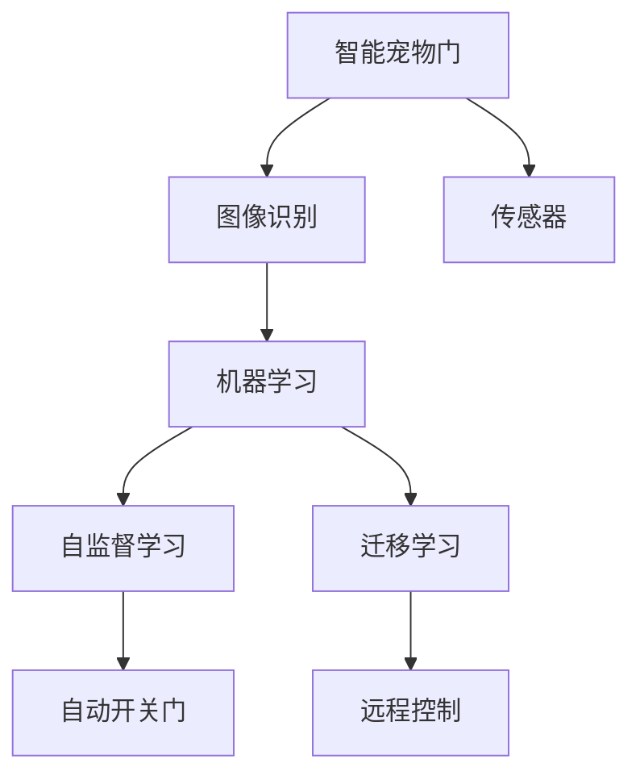

                 

# 智能宠物门创业：自动化宠物出入管理

> 关键词：智能宠物门，自动化，宠物出入管理，物联网，人工智能，机器学习

## 1. 背景介绍

随着社会的发展和人们生活水平的提高，宠物已经成为了许多家庭的重要成员。然而，宠物的出行管理问题一直困扰着众多养宠家庭，尤其是需要外出工作的养宠人士。传统的宠物门依赖于手动开关，存在诸多不便，如宠物自己开门、宠物在门口等待等。这些问题不仅影响了人们的出行效率，还可能导致宠物走失或受伤。因此，基于物联网和人工智能技术的智能宠物门应运而生，旨在为宠物出行提供更安全、更便捷、更高效的管理方式。

智能宠物门通过传感器、图像识别、机器学习等技术，实现自动开关门和远程控制等功能。其核心优势在于能够智能识别宠物的进出行为，并根据设定的规则进行响应。例如，当宠物主人离家时，智能宠物门可以自动关闭门，避免宠物外出；当宠物回家时，门可以自动打开，方便宠物进出。此外，智能宠物门还可以记录宠物的活动轨迹和出入时间，帮助主人了解宠物的生活习惯，确保宠物的安全。

## 2. 核心概念与联系

### 2.1 核心概念概述

为更好地理解智能宠物门的技术原理，本节将介绍几个密切相关的核心概念：

- **智能宠物门**：一种利用传感器、图像识别、机器学习等技术实现宠物出入自动管理的物联网设备。
- **物联网(IoT)**：通过传感器、嵌入式系统等设备，实现人与物、物与物之间的互联互通。
- **图像识别**：通过深度学习等技术，实现对图像中的对象进行自动识别和分类。
- **机器学习**：通过算法和模型，对数据进行学习和推理，实现智能化决策。
- **自监督学习**：在没有标注数据的情况下，利用数据自身的关系进行模型训练。
- **迁移学习**：将在一个任务上学到的知识迁移到另一个相关任务中，以提高模型性能。

这些核心概念之间的逻辑关系可以通过以下Mermaid流程图来展示：



这个流程图展示了她智能宠物门的核心概念及其之间的关系：

1. 智能宠物门通过传感器收集数据。
2. 图像识别技术对传感器采集的图像数据进行处理，识别出宠物的行为。
3. 机器学习算法对识别结果进行分析，并作出决策，如自动开关门。
4. 自监督学习技术可以在没有标注数据的情况下，训练模型进行图像识别。
5. 迁移学习技术可以将在其他任务上学到的知识应用到智能宠物门的识别任务中，提高识别准确率。
6. 自动开关门和远程控制功能通过机器学习模型的输出进行实现。

这些核心概念共同构成了智能宠物门的技术框架，使得宠物门的智能化程度大幅提升，用户体验得到极大改善。

## 3. 核心算法原理 & 具体操作步骤

### 3.1 算法原理概述

智能宠物门的核心算法主要基于图像识别和机器学习技术。其核心思想是通过深度学习模型对传感器采集的图像数据进行识别，判断是否为宠物，并根据设定规则自动开关门。

具体而言，智能宠物门主要由以下几个步骤组成：

1. **数据收集**：通过传感器和摄像头收集宠物的行为数据，如门前的图像、声音等。
2. **图像预处理**：对收集到的图像数据进行预处理，包括裁剪、归一化等操作。
3. **图像识别**：使用深度学习模型对预处理后的图像进行识别，判断是否为宠物。
4. **决策制定**：根据识别结果和用户设定的规则，决定是否自动开关门。
5. **门开关控制**：根据决策结果，通过控制器实现门的自动开关。

### 3.2 算法步骤详解

智能宠物门的具体算法步骤如下：

**Step 1: 数据收集**

智能宠物门通过多种传感器和摄像头收集宠物的行为数据。常见的传感器包括红外传感器、超声波传感器、声音传感器等，用于检测宠物的位置和行为。摄像头则用于采集宠物的图像数据，供深度学习模型进行识别。

**Step 2: 图像预处理**

采集到的图像数据通常需要进行预处理，以提高后续识别的准确率。预处理包括裁剪、缩放、归一化等操作，以减少噪声和提高分辨率。

**Step 3: 图像识别**

使用深度学习模型对预处理后的图像进行识别，判断是否为宠物。具体来说，可以使用常见的卷积神经网络(CNN)、目标检测模型(如Faster R-CNN、YOLO等)等深度学习模型。

**Step 4: 决策制定**

根据图像识别结果和用户设定的规则，决定是否自动开关门。例如，如果宠物主人设置了“宠物回家时自动开门”的规则，那么当模型识别出宠物回家时，门就会自动打开。

**Step 5: 门开关控制**

根据决策结果，通过控制器实现门的自动开关。控制器可以是一个简单的电机驱动装置，用于控制门的开关。

### 3.3 算法优缺点

智能宠物门通过图像识别和机器学习技术，实现了自动开关门和远程控制等功能，具有以下优点：

1. **智能化程度高**：智能宠物门能够自动识别宠物的进出行为，并根据设定规则进行响应，极大地提升了用户体验。
2. **安全性高**：智能宠物门通过机器学习模型进行决策，可以有效避免误识别和误操作，确保宠物的安全。
3. **便利性高**：用户可以通过手机App或语音助手远程控制智能宠物门，无需手动开关门，提高了出行效率。
4. **易于维护**：智能宠物门的核心算法和模型可以通过云端更新，无需用户手动维护，降低了使用成本。

同时，智能宠物门也存在一些缺点：

1. **成本较高**：智能宠物门的硬件和软件成本较高，尤其对于中小企业和个人用户来说，可能难以负担。
2. **环境适应性有限**：智能宠物门对环境光照、宠物体型等条件有一定要求，可能在一些复杂环境下无法正常工作。
3. **数据隐私问题**：智能宠物门需要收集和处理大量的宠物行为数据，可能存在数据隐私和安全性问题。

尽管存在这些缺点，但智能宠物门在提高宠物出行管理效率和安全性方面具有显著优势，具有广阔的市场前景。

### 3.4 算法应用领域

智能宠物门的算法和模型可以应用于多个领域，以下是一些典型的应用场景：

1. **家庭宠物管理**：智能宠物门可以用于家庭宠物的管理，提高宠物出行和家门的安全性，减少宠物走失或受伤的风险。
2. **宠物店管理**：宠物店可以使用智能宠物门来管理宠物的进出，提高宠物店的管理效率和服务质量。
3. **宠物寄养中心**：宠物寄养中心可以使用智能宠物门来管理宠物的进出，确保宠物在寄养期间的安全和健康。
4. **动物保护组织**：动物保护组织可以使用智能宠物门来保护流浪动物，防止它们走失或受伤。
5. **宠物行为研究**：研究人员可以使用智能宠物门来研究宠物的行为，了解宠物的生活习惯和行为规律。

## 4. 数学模型和公式 & 详细讲解 & 举例说明

### 4.1 数学模型构建

本节将使用数学语言对智能宠物门的核心算法进行更加严格的刻画。

记智能宠物门的深度学习模型为 $M_{\theta}:\mathcal{X} \rightarrow \mathcal{Y}$，其中 $\mathcal{X}$ 为输入空间，$\mathcal{Y}$ 为输出空间，$\theta \in \mathbb{R}^d$ 为模型参数。假设训练集为 $D=\{(x_i,y_i)\}_{i=1}^N, x_i \in \mathcal{X}, y_i \in \mathcal{Y}$。

定义模型 $M_{\theta}$ 在输入 $x$ 上的输出为 $\hat{y}=M_{\theta}(x) \in [0,1]$，表示样本是否为宠物的概率。真实标签 $y \in \{0,1\}$。则二分类交叉熵损失函数定义为：

$$
\ell(M_{\theta}(x),y) = -[y\log \hat{y} + (1-y)\log (1-\hat{y})]
$$

将其代入经验风险公式，得：

$$
\mathcal{L}(\theta) = -\frac{1}{N}\sum_{i=1}^N [y_i\log M_{\theta}(x_i)+(1-y_i)\log(1-M_{\theta}(x_i))]
$$

在得到损失函数的梯度后，即可带入参数更新公式，完成模型的迭代优化。重复上述过程直至收敛，最终得到适应家庭宠物管理的最优模型参数 $\theta^*$。

### 4.2 公式推导过程

以下我们以二分类任务为例，推导交叉熵损失函数及其梯度的计算公式。

假设模型 $M_{\theta}$ 在输入 $x$ 上的输出为 $\hat{y}=M_{\theta}(x) \in [0,1]$，表示样本是否为宠物的概率。真实标签 $y \in \{0,1\}$。则二分类交叉熵损失函数定义为：

$$
\ell(M_{\theta}(x),y) = -[y\log \hat{y} + (1-y)\log (1-\hat{y})]
$$

将其代入经验风险公式，得：

$$
\mathcal{L}(\theta) = -\frac{1}{N}\sum_{i=1}^N [y_i\log M_{\theta}(x_i)+(1-y_i)\log(1-M_{\theta}(x_i))]
$$

根据链式法则，损失函数对参数 $\theta_k$ 的梯度为：

$$
\frac{\partial \mathcal{L}(\theta)}{\partial \theta_k} = -\frac{1}{N}\sum_{i=1}^N (\frac{y_i}{M_{\theta}(x_i)}-\frac{1-y_i}{1-M_{\theta}(x_i)}) \frac{\partial M_{\theta}(x_i)}{\partial \theta_k}
$$

其中 $\frac{\partial M_{\theta}(x_i)}{\partial \theta_k}$ 可进一步递归展开，利用自动微分技术完成计算。

### 4.3 案例分析与讲解

假设有一个智能宠物门，采用ResNet-50作为深度学习模型。该模型已经在ImageNet数据集上进行了预训练。我们将该模型应用于智能宠物门的图像识别任务，具体步骤如下：

1. **数据收集**：智能宠物门通过摄像头采集宠物的图像数据。
2. **图像预处理**：将采集到的图像进行裁剪、归一化等预处理操作。
3. **图像识别**：将预处理后的图像输入ResNet-50模型，输出预测结果。
4. **决策制定**：根据预测结果和用户设定的规则，决定是否自动开关门。

## 5. 项目实践：代码实例和详细解释说明

### 5.1 开发环境搭建

在进行智能宠物门开发前，我们需要准备好开发环境。以下是使用Python进行TensorFlow开发的环境配置流程：

1. 安装Anaconda：从官网下载并安装Anaconda，用于创建独立的Python环境。

2. 创建并激活虚拟环境：
```bash
conda create -n petdoor-env python=3.8 
conda activate petdoor-env
```

3. 安装TensorFlow：根据CUDA版本，从官网获取对应的安装命令。例如：
```bash
conda install tensorflow tensorflow-gpu -c conda-forge
```

4. 安装各类工具包：
```bash
pip install numpy pandas scikit-learn matplotlib tqdm jupyter notebook ipython
```

完成上述步骤后，即可在`petdoor-env`环境中开始智能宠物门开发。

### 5.2 源代码详细实现

下面是智能宠物门开发的基本代码实现：

```python
import tensorflow as tf
import numpy as np
from tensorflow.keras.applications.resnet50 import ResNet50
from tensorflow.keras.layers import Dense, Input
from tensorflow.keras.models import Model

# 定义图像数据集
train_images = np.load('train_images.npy')
train_labels = np.load('train_labels.npy')

# 定义深度学习模型
input_image = Input(shape=(224, 224, 3))
base_model = ResNet50(weights='imagenet', include_top=False, input_shape=(224, 224, 3))
x = base_model(input_image)
x = Dense(256, activation='relu')(x)
x = Dense(1, activation='sigmoid')(x)
model = Model(input_image, x)

# 编译模型
model.compile(optimizer=tf.keras.optimizers.Adam(learning_rate=0.001),
              loss=tf.keras.losses.BinaryCrossentropy(),
              metrics=['accuracy'])

# 训练模型
model.fit(train_images, train_labels, batch_size=32, epochs=10, validation_split=0.2)

# 保存模型
model.save('petdoor_model.h5')
```

### 5.3 代码解读与分析

让我们再详细解读一下关键代码的实现细节：

**模型定义**：
- `Input`层用于定义输入的图像数据，尺寸为$(224, 224, 3)$。
- `ResNet50`层用于加载预训练的ResNet-50模型，`include_top=False`表示不包括顶部全连接层，只保留特征提取部分。
- `Dense`层用于定义全连接层，增加模型输出维度。
- `Model`层用于将输入、特征提取和全连接层进行组合，得到最终的深度学习模型。

**模型编译**：
- `optimizer`用于定义优化器，这里选择Adam优化器，学习率为0.001。
- `loss`用于定义损失函数，这里选择二分类交叉熵损失函数。
- `metrics`用于定义评价指标，这里选择准确率。

**模型训练**：
- `fit`方法用于训练模型，`train_images`和`train_labels`为训练数据集，`batch_size`为批次大小，`epochs`为训练轮数，`validation_split`为验证集的比例。

**模型保存**：
- `save`方法用于保存训练好的模型，便于后续部署和微调。

## 6. 实际应用场景

### 6.1 智能宠物门系统

智能宠物门系统通常由多个硬件组件和软件模块组成，主要包括：

1. **摄像头**：用于采集宠物的图像数据。
2. **传感器**：用于检测宠物的位置和行为，如红外传感器、超声波传感器、声音传感器等。
3. **控制器**：用于控制门的开关，通常是一个简单的电机驱动装置。
4. **中央处理器**：用于处理传感器和摄像头采集的数据，并进行图像识别和决策。
5. **云端服务**：用于保存和管理用户数据，支持远程控制和系统升级。

智能宠物门系统的工作流程如下：

1. **数据收集**：通过摄像头和传感器采集宠物的图像和行为数据。
2. **数据处理**：将传感器和摄像头采集的数据进行处理，包括图像预处理和行为识别。
3. **决策制定**：根据处理后的数据，使用深度学习模型进行图像识别和行为判断，并根据用户设定的规则进行决策。
4. **门开关控制**：根据决策结果，通过控制器实现门的自动开关。
5. **用户交互**：通过App或语音助手，用户可以远程控制智能宠物门，并进行系统设置。

### 6.2 家庭宠物管理

智能宠物门系统可以用于家庭宠物的管理，具体场景如下：

1. **宠物回家自动开门**：当宠物主人回家时，智能宠物门会自动打开，方便宠物回家。
2. **宠物外出自动关门**：当宠物主人离家时，智能宠物门会自动关闭，避免宠物外出。
3. **远程控制**：用户可以通过手机App或语音助手，远程控制智能宠物门，确保宠物安全。
4. **行为记录**：智能宠物门可以记录宠物的活动轨迹和出入时间，帮助主人了解宠物的生活习惯。

### 6.3 宠物店管理

宠物店可以使用智能宠物门来管理宠物的进出，具体场景如下：

1. **自动开关门**：当宠物进入或离开宠物店时，智能宠物门会自动开关门，提高管理效率。
2. **行为记录**：智能宠物门可以记录宠物的行为，帮助宠物店管理宠物。
3. **远程控制**：宠物店主可以通过手机App或语音助手，远程控制智能宠物门，确保宠物安全。
4. **用户交互**：用户可以通过App或语音助手，进行系统设置和管理。

### 6.4 宠物寄养中心

宠物寄养中心可以使用智能宠物门来管理宠物的进出，具体场景如下：

1. **自动开关门**：当宠物进入或离开寄养中心时，智能宠物门会自动开关门，提高管理效率。
2. **行为记录**：智能宠物门可以记录宠物的行为，帮助宠物寄养中心管理宠物。
3. **远程控制**：宠物寄养中心的工作人员可以通过手机App或语音助手，远程控制智能宠物门，确保宠物安全。
4. **用户交互**：宠物寄养中心的用户可以通过App或语音助手，进行系统设置和管理。

## 7. 工具和资源推荐

### 7.1 学习资源推荐

为了帮助开发者系统掌握智能宠物门的技术基础和实践技巧，这里推荐一些优质的学习资源：

1. **TensorFlow官方文档**：TensorFlow作为主流的深度学习框架，其官方文档提供了详尽的API说明和示例代码，适合初学者快速上手。
2. **Keras官方文档**：Keras是一个高级的深度学习框架，提供了易用的API，适合快速构建和调试深度学习模型。
3. **《深度学习》书籍**：Ian Goodfellow等人编写的《深度学习》一书，是深度学习领域的经典之作，适合深入理解深度学习原理和算法。
4. **《机器学习实战》书籍**：Peter Harrington等人编写的《机器学习实战》一书，提供了大量的代码示例，适合快速实践机器学习算法。
5. **Coursera机器学习课程**：由Andrew Ng教授主讲的Coursera机器学习课程，是机器学习领域的经典课程，适合系统学习机器学习原理和实践。

通过对这些资源的学习实践，相信你一定能够快速掌握智能宠物门的技术精髓，并用于解决实际的宠物管理问题。

### 7.2 开发工具推荐

高效的开发离不开优秀的工具支持。以下是几款用于智能宠物门开发的常用工具：

1. **TensorFlow**：基于Python的深度学习框架，提供了易用的API和丰富的工具，适合快速构建和调试深度学习模型。
2. **Keras**：基于TensorFlow的高级深度学习框架，提供了易用的API和丰富的工具，适合快速构建和调试深度学习模型。
3. **PyTorch**：基于Python的深度学习框架，提供了灵活的计算图和易用的API，适合快速构建和调试深度学习模型。
4. **Jupyter Notebook**：一个交互式的代码编辑器，适合快速实验和调试代码。
5. **Google Colab**：谷歌提供的在线Jupyter Notebook环境，免费提供GPU/TPU算力，适合快速实验和调试代码。

合理利用这些工具，可以显著提升智能宠物门开发和优化的效率，加快创新迭代的步伐。

### 7.3 相关论文推荐

智能宠物门技术的快速发展得益于学界的持续研究。以下是几篇奠基性的相关论文，推荐阅读：

1. **《深度学习》论文**：Ian Goodfellow等人撰写的深度学习经典论文，奠定了深度学习的基本框架和方法。
2. **《ImageNet Large Scale Visual Recognition Challenge》论文**：Alex Krizhevsky等人撰写的ImageNet大规模视觉识别挑战论文，展示了深度学习在图像识别任务上的卓越性能。
3. **《ResNet：Deep Residual Learning for Image Recognition》论文**：Kaiming He等人撰写的ResNet论文，展示了深度残差网络在图像识别任务上的卓越性能。
4. **《Faster R-CNN: Towards Real-Time Object Detection with Region Proposal Networks》论文**：Shaoqing Ren等人撰写的Faster R-CNN论文，展示了目标检测模型在图像识别任务上的卓越性能。
5. **《YOLO: You Only Look Once》论文**：Joseph Redmon等人撰写的YOLO论文，展示了实时目标检测模型在图像识别任务上的卓越性能。

这些论文代表了大语言模型微调技术的发展脉络。通过学习这些前沿成果，可以帮助研究者把握学科前进方向，激发更多的创新灵感。

## 8. 总结：未来发展趋势与挑战

### 8.1 总结

本文对智能宠物门创业中自动化宠物出入管理的核心算法进行了全面系统的介绍。首先阐述了智能宠物门系统的发展背景和意义，明确了其核心算法的基本原理和操作步骤。其次，从原理到实践，详细讲解了深度学习模型在图像识别和决策制定中的应用，给出了智能宠物门开发的基本代码实现。同时，本文还广泛探讨了智能宠物门在家庭宠物管理、宠物店管理、宠物寄养中心等多个领域的应用前景，展示了其广阔的市场潜力。此外，本文精选了智能宠物门开发的学习资源，力求为开发者提供全方位的技术指引。

通过本文的系统梳理，可以看到，智能宠物门系统通过深度学习模型和物联网技术，实现了自动开关门和远程控制等功能，极大地提高了宠物出行管理的智能化水平，提升了用户体验。未来，伴随深度学习技术的不断进步，智能宠物门系统的性能和应用范围还将进一步提升，为宠物出行管理带来革命性的变革。

### 8.2 未来发展趋势

展望未来，智能宠物门技术将呈现以下几个发展趋势：

1. **智能化程度更高**：未来智能宠物门系统将更加智能化，能够自动识别更多种类的宠物，识别率更高，决策更加准确。
2. **环境适应性更强**：智能宠物门系统将具备更好的环境适应能力，能够适应不同光照条件和复杂环境，提高使用可靠性。
3. **远程控制更便捷**：智能宠物门系统将支持更多的远程控制方式，如语音助手、智能音箱等，提高用户使用的便捷性。
4. **安全性更高**：智能宠物门系统将具备更高的安全性，能够防止宠物走失、走失或受伤，保障宠物的生命安全。
5. **成本更低**：随着技术的发展和规模化的生产，智能宠物门系统的成本将逐步降低，使其更易于普及。

这些趋势将进一步提升智能宠物门系统的性能和用户体验，使其在宠物出行管理领域发挥更大的作用。

### 8.3 面临的挑战

尽管智能宠物门技术已经取得了瞩目成就，但在迈向更加智能化、普适化应用的过程中，仍面临诸多挑战：

1. **成本问题**：智能宠物门系统的硬件和软件成本较高，对于中小企业和个人用户来说，可能难以负担。
2. **环境适应性有限**：智能宠物门系统对环境光照、宠物体型等条件有一定要求，可能在一些复杂环境下无法正常工作。
3. **数据隐私问题**：智能宠物门系统需要收集和处理大量的宠物行为数据，可能存在数据隐私和安全性问题。
4. **技术复杂度高**：智能宠物门系统涉及深度学习、计算机视觉、物联网等多个技术领域，技术复杂度较高，开发难度较大。
5. **用户习惯改变**：智能宠物门系统需要用户进行系统设置和管理，可能会改变用户的宠物管理习惯，增加使用门槛。

尽管存在这些挑战，但智能宠物门系统在提高宠物出行管理效率和安全性方面具有显著优势，具有广阔的市场前景。

### 8.4 研究展望

面对智能宠物门技术所面临的挑战，未来的研究需要在以下几个方面寻求新的突破：

1. **降低成本**：开发更高效、更廉价的智能宠物门系统，使其更易于普及。
2. **提高环境适应性**：研究更智能的深度学习模型和传感器技术，提高智能宠物门系统在复杂环境下的性能。
3. **保障数据隐私**：研究数据加密、隐私保护等技术，保障宠物行为数据的安全。
4. **简化用户设置**：开发更易用、更智能的系统界面和用户体验设计，降低用户设置的门槛。
5. **支持多种宠物管理**：研究支持更多种类的宠物管理方法，如识别不同种类的宠物，自动设置门禁规则等。

这些研究方向的探索，将进一步提升智能宠物门系统的性能和用户体验，使其在宠物出行管理领域发挥更大的作用。

## 9. 附录：常见问题与解答

**Q1：智能宠物门系统的工作原理是什么？**

A: 智能宠物门系统的工作原理主要基于深度学习模型和物联网技术。其核心思想是通过摄像头和传感器收集宠物的行为数据，使用深度学习模型对数据进行识别和分析，并根据用户设定的规则进行决策，控制门的开关。

**Q2：智能宠物门系统如何保障宠物安全？**

A: 智能宠物门系统通过深度学习模型进行图像识别和行为判断，可以有效识别宠物的进出行为，并根据用户设定的规则进行响应。例如，当宠物主人离家时，智能宠物门会自动关闭门，避免宠物外出；当宠物回家时，门会自动打开，方便宠物进出。此外，智能宠物门还可以记录宠物的活动轨迹和出入时间，帮助主人了解宠物的生活习惯，确保宠物的安全。

**Q3：智能宠物门系统如何处理复杂环境？**

A: 智能宠物门系统对环境光照、宠物体型等条件有一定要求，可能在一些复杂环境下无法正常工作。为了解决这些问题，可以采用以下方法：
1. 使用更高分辨率的摄像头，捕捉更多细节信息。
2. 使用更多的传感器，如红外传感器、声音传感器等，捕捉更全面的行为信息。
3. 优化深度学习模型，使其具备更好的环境适应能力。

**Q4：智能宠物门系统如何使用云端服务？**

A: 智能宠物门系统可以通过云端服务保存和管理用户数据，支持远程控制和系统升级。具体来说，云端服务可以包括：
1. 用户数据保存：将智能宠物门采集的宠物行为数据保存到云端，方便用户随时查看和管理。
2. 远程控制：用户可以通过手机App或语音助手，远程控制智能宠物门，确保宠物安全。
3. 系统升级：通过云端服务，用户可以获取最新的智能宠物门系统更新和升级包，确保系统性能和安全。

**Q5：智能宠物门系统如何处理误识别问题？**

A: 智能宠物门系统可能存在误识别问题，导致误开关门，影响宠物安全。为了解决这个问题，可以采用以下方法：
1. 使用多种传感器，如摄像头、声音传感器、红外传感器等，多维度获取宠物的行为信息，提高识别准确率。
2. 优化深度学习模型，使其具备更好的鲁棒性和泛化能力，提高识别准确率。
3. 引入人工干预机制，当系统识别出错时，可以通过人工确认进行手动开关门，提高系统可靠性。

通过以上方法的综合应用，可以有效提升智能宠物门系统的性能和用户体验，确保宠物出行管理的安全性和可靠性。

---

作者：禅与计算机程序设计艺术 / Zen and the Art of Computer Programming

