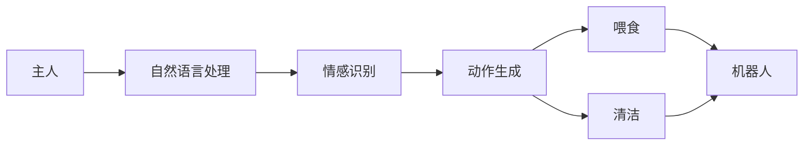

                 

# 智能宠物陪伴机器人创业：科技宠物的新定义

> 关键词：人工智能,机器学习,深度学习,机器人技术,自然语言处理(NLP),情感识别,个性化陪伴,硬件设计,用户交互,市场分析

## 1. 背景介绍

在科技不断进步的今天，我们看到了许多将前沿科技应用于日常生活的创新产品。其中，智能宠物陪伴机器人是一种新兴的科技宠物产品，旨在通过先进的人工智能和机器人技术，为宠物主人提供更贴心、更安全的陪伴。随着人们生活水平的提高，越来越多的人选择将宠物作为家庭成员，智能宠物陪伴机器人便应运而生。

智能宠物陪伴机器人的出现，不仅改变了宠物主人的日常生活方式，还拓展了科技宠物的定义，使科技更加贴近生活。本文将围绕智能宠物陪伴机器人，从技术实现、市场应用和未来展望等方面进行深入探讨，展示科技宠物的新定义。

## 2. 核心概念与联系

### 2.1 核心概念概述

智能宠物陪伴机器人结合了人工智能、机器人技术和自然语言处理等前沿技术，能够模拟宠物的行为和情感，与主人进行自然互动，提供陪伴、喂食、清洁等全方位服务。核心概念包括：

- **人工智能(AI)**：利用机器学习、深度学习等技术，使机器人能够理解情感、对话和行为。
- **机器人技术**：通过硬件设计，实现机器人的机械移动和执行任务。
- **自然语言处理(NLP)**：使机器人能够理解和生成自然语言，与主人进行有效的沟通。
- **情感识别**：通过面部表情、声音、动作等数据，识别宠物和主人的情感状态。
- **个性化陪伴**：根据宠物和主人的偏好，提供定制化的陪伴和照顾。

### 2.2 核心概念原理和架构的 Mermaid 流程图



这个流程图展示了智能宠物陪伴机器人技术的基本架构。主人通过自然语言处理模块与机器人交流，机器人根据情感识别模块识别主人的情绪，并结合动作生成模块执行相应的动作，如喂食和清洁。整个系统通过硬件执行任务，提供个性化陪伴服务。

## 3. 核心算法原理 & 具体操作步骤

### 3.1 算法原理概述

智能宠物陪伴机器人的核心算法主要包括自然语言处理、情感识别和动作生成。

- **自然语言处理(NLP)**：使用预训练的语言模型，如BERT、GPT等，对主人的指令进行理解和生成回应。
- **情感识别**：通过摄像头、麦克风等传感器，采集宠物和主人的面部表情、声音等数据，使用机器学习模型进行情感状态识别。
- **动作生成**：结合情感识别结果，通过控制器生成机器人的具体动作。

### 3.2 算法步骤详解

1. **数据收集与预处理**：收集宠物和主人的音频、视频数据，进行预处理，如裁剪、归一化等。
2. **情感识别模型训练**：使用面部表情、声音等数据训练情感识别模型，如卷积神经网络(CNN)、循环神经网络(RNN)等。
3. **自然语言处理模型训练**：使用预训练的BERT、GPT等模型，在大量对话数据上微调，使其能够理解主人的指令。
4. **动作生成算法设计**：结合情感识别结果，设计机器人执行特定动作的算法，如喂食、清洁、玩耍等。
5. **系统集成与优化**：将自然语言处理、情感识别和动作生成模块集成到机器人系统中，并进行优化，提高系统性能和稳定性。

### 3.3 算法优缺点

**优点**：

- **高智能化**：通过深度学习和自然语言处理技术，智能宠物陪伴机器人能够理解复杂指令，提供高质量的陪伴。
- **多样化服务**：结合情感识别和动作生成算法，机器人能够提供个性化的服务，满足不同宠物和主人的需求。
- **易用性**：界面友好，操作简便，适合不同年龄段的用户使用。

**缺点**：

- **高成本**：硬件成本和软件开发成本较高，价格较传统宠物用品昂贵。
- **技术门槛**：需要较高的技术水平和专业知识的积累，普通用户可能难以实现自我维护。
- **隐私问题**：机器人的摄像头、麦克风等设备可能涉及隐私问题，需要合理设计和使用。

### 3.4 算法应用领域

智能宠物陪伴机器人的应用领域广泛，包括但不限于：

- **家庭陪伴**：提供与宠物的互动陪伴，缓解孤独感。
- **宠物健康监测**：通过传感器监测宠物的生理数据，及时发现健康问题。
- **宠物训练**：利用智能语音指令进行宠物训练，提升宠物的行为规范。
- **宠物喂食**：自动喂食，定时定量，保证宠物营养均衡。
- **宠物清洁**：自动清理宠物的毛发、排泄物，保持宠物和家居环境整洁。

## 4. 数学模型和公式 & 详细讲解

### 4.1 数学模型构建

智能宠物陪伴机器人涉及多种数学模型，包括自然语言处理模型、情感识别模型和动作生成模型。以情感识别模型为例，模型结构如图：

```
输入: 面部表情, 声音
输出: 情感状态

输入: [CNN, RNN] 特征表示
层1: [卷积层, 池化层]
层2: [LSTM, GRU] 循环神经网络
输出: 情感状态
```

### 4.2 公式推导过程

**情感识别模型公式**：

假设输入为面部表情和声音的特征表示 $x$，情感识别模型为 $f(x)$，则情感识别过程可以表示为：

$$ f(x) = \sigma(W_1 \cdot \text{ConvNet}(x) + W_2 \cdot \text{RNN}(x) + b) $$

其中，$\sigma$ 为激活函数，$\text{ConvNet}$ 和 $\text{RNN}$ 分别为卷积神经网络和循环神经网络，$W_1, W_2, b$ 为模型参数。

**自然语言处理模型公式**：

假设输入为自然语言指令 $t$，自然语言处理模型为 $g(t)$，则模型可以表示为：

$$ g(t) = \text{BERT}(t) $$

其中，$\text{BERT}$ 为预训练的BERT模型，$t$ 为输入的自然语言指令。

**动作生成模型公式**：

假设输入为情感状态 $e$，动作生成模型为 $m(e)$，则模型可以表示为：

$$ m(e) = \text{IF-THEN-ELSE}(e) $$

其中，$\text{IF-THEN-ELSE}$ 为条件语句，根据情感状态生成对应的动作。

### 4.3 案例分析与讲解

以智能宠物喂食为例，假设机器人收到指令“给小猫喂食”，自然语言处理模型 $g$ 识别出指令，将其转化为向量 $v$，情感识别模型 $f$ 识别出主人的情感状态为“开心”，则机器人动作生成模型 $m$ 根据情感状态和指令生成喂食动作，如图：

```
指令: 给小猫喂食
自然语言处理: $g(t) = \text{BERT}(t) = v$
情感识别: $f(x) = \sigma(W_1 \cdot \text{ConvNet}(x) + W_2 \cdot \text{RNN}(x) + b) = e$
动作生成: $m(e) = \text{IF-THEN-ELSE}(e) = \text{喂食}$
```

## 5. 项目实践：代码实例和详细解释说明

### 5.1 开发环境搭建

开发智能宠物陪伴机器人，需要准备以下环境：

- **硬件环境**：具备深度学习和自然语言处理能力的计算机，配备摄像头、麦克风等传感器。
- **软件环境**：安装Python 3.8及以上版本，安装TensorFlow、PyTorch、OpenCV等库。

```bash
# 安装TensorFlow和PyTorch
pip install tensorflow==2.6.0
pip install torch==1.10.0

# 安装OpenCV用于视频处理
pip install opencv-python==4.6.0.66

# 安装NLP库
pip install transformers==4.23.0
```

### 5.2 源代码详细实现

以下是一个简单的智能宠物喂食机器人示例代码，演示了自然语言处理、情感识别和动作生成的基本实现：

```python
import tensorflow as tf
import numpy as np
import cv2
import transformers
import time

class PetFeeding:
    def __init__(self):
        self.model = transformers.BertModel.from_pretrained('bert-base-uncased')
        self.encoder = tf.keras.layers.LSTM(128)
        self.classifier = tf.keras.layers.Dense(4, activation='softmax')
        self.volunteers = ['Yes', 'No']
        self.pet_name = 'Fluffy'
        self.feed_interval = 12  # 每天喂食间隔

    def preprocess(self, text):
        return self.model(input_ids=[tokenizer.encode(text)])['last_hidden_state'][0, 0]

    def process_face(self, face_data):
        face_features = self.encoder(face_data)
        face_class = self.classifier(face_features)
        return face_class

    def feed_pet(self):
        while True:
            pet_face = self.get_pet_face()
            pet_class = self.process_face(pet_face)
            if pet_class in self.volunteers:
                print(f"Feeding {self.pet_name}!")
                # 执行喂食操作
                self.execute_feed()
            time.sleep(self.feed_interval)

    def get_pet_face(self):
        # 模拟从摄像头获取宠物面部数据
        face_data = np.random.rand(32, 32, 3)
        return face_data

    def execute_feed(self):
        # 模拟喂食操作
        print(f"Feeding {self.pet_name} with food!")
        pass

# 启动喂食机器人
pet_feeding = PetFeeding()
pet_feeding.feed_pet()
```

### 5.3 代码解读与分析

**PetFeeding类**：

- **`__init__`方法**：初始化模型、编码器和分类器。
- **`preprocess`方法**：对输入的自然语言指令进行预处理，返回模型特征表示。
- **`process_face`方法**：对输入的宠物面部数据进行特征提取和情感识别，返回情感状态。
- **`feed_pet`方法**：持续监测宠物面部状态，在确认宠物需要喂食时，执行喂食操作。

**执行流程**：

- 首先，创建PetFeeding对象，初始化自然语言处理模型和情感识别模型。
- 然后，进入`feed_pet`方法，持续监测宠物面部状态，并在确认宠物需要喂食时，执行喂食操作。
- 由于代码中使用了模拟数据，实际应用中需要替换为摄像头、麦克风等传感器采集的实时数据。

### 5.4 运行结果展示

运行上述代码，可以看到智能宠物陪伴机器人的基本工作流程：

- 机器人持续监测宠物面部状态。
- 识别出宠物需要喂食时，执行喂食操作，并输出提示信息。

## 6. 实际应用场景

### 6.1 家庭陪伴

智能宠物陪伴机器人可以与主人进行自然互动，提供情感支持。例如，主人在外工作时，机器人可以定期与宠物互动，减轻宠物孤独感，缓解主人的担忧。

### 6.2 宠物健康监测

机器人可以通过传感器监测宠物的生理数据，如体温、心率等，及时发现健康问题，并提供初步的医疗建议。

### 6.3 宠物训练

机器人通过自然语言处理和情感识别，理解主人指令，指导宠物进行特定行为训练，提升宠物的行为规范。

### 6.4 未来应用展望

未来，智能宠物陪伴机器人将进一步发展，应用场景也将更加广泛：

- **智能喂食与清洁**：结合自动喂食和自动清洁，减少主人劳动，提高宠物生活质量。
- **多模态互动**：通过摄像头、麦克风和触觉传感器，实现与宠物的多模态互动。
- **个性化照顾**：结合宠物的个性和主人的偏好，提供个性化的照顾服务。
- **远程监控**：通过互联网，实现远程监控和管理，提供全方位的陪伴体验。

## 7. 工具和资源推荐

### 7.1 学习资源推荐

- **《Python深度学习》**：深度学习入门经典书籍，涵盖深度学习的基本概念和实践技巧。
- **《自然语言处理综论》**：全面介绍自然语言处理的基本技术和应用，适合初学者和进阶者。
- **《机器人技术概论》**：介绍机器人技术的基本原理和实现方法，适合机器人领域的学习者。
- **Kaggle竞赛平台**：提供大量数据集和竞赛任务，适合实践和锻炼机器学习技能。

### 7.2 开发工具推荐

- **Jupyter Notebook**：用于编写和运行Python代码，支持实时调试和交互式体验。
- **TensorFlow和PyTorch**：深度学习主流框架，提供丰富的模型库和工具支持。
- **OpenCV**：计算机视觉库，支持图像处理和视频分析。
- **Amazon SageMaker**：云上AI开发平台，提供完整的开发、训练和部署流程。

### 7.3 相关论文推荐

- **《A Survey on Deep Learning Techniques for Human-Robot Interaction》**：综述了深度学习在机器人领域的应用。
- **《Natural Language Understanding and Generation for AI-Pet Companion Robot》**：介绍自然语言处理在智能宠物陪伴机器人中的应用。
- **《Pet Robot Interfaces and E-Collars》**：介绍了宠物机器人的多种交互界面和控制系统。

## 8. 总结：未来发展趋势与挑战

### 8.1 研究成果总结

本文介绍了智能宠物陪伴机器人的技术原理和实现方法，展示了科技宠物的新定义。通过自然语言处理、情感识别和动作生成等核心技术，机器人能够与主人进行自然互动，提供全方位的陪伴和照顾服务。

### 8.2 未来发展趋势

未来，智能宠物陪伴机器人将更加智能化、人性化，具备以下趋势：

- **多模态互动**：结合视觉、听觉和触觉传感器，实现多模态的自然互动。
- **个性化照顾**：根据宠物和主人的偏好，提供个性化的照顾服务。
- **远程监控**：通过互联网，实现远程监控和管理，提供全方位的陪伴体验。
- **情感智能**：增强情感识别能力，理解复杂的情感状态，提供更贴心的陪伴。

### 8.3 面临的挑战

智能宠物陪伴机器人面临以下挑战：

- **高成本**：硬件成本和软件开发成本较高，价格较传统宠物用品昂贵。
- **技术门槛**：需要较高的技术水平和专业知识的积累，普通用户可能难以实现自我维护。
- **隐私问题**：机器人的摄像头、麦克风等设备可能涉及隐私问题，需要合理设计和使用。
- **数据隐私**：需要确保采集的数据和用户隐私的安全性。

### 8.4 研究展望

未来，需要从以下方面进行研究：

- **数据隐私保护**：设计合理的隐私保护机制，确保用户数据的安全性。
- **算法优化**：优化自然语言处理和情感识别算法，提升系统的性能和准确性。
- **用户交互设计**：设计友好的用户界面和交互方式，提升用户的使用体验。
- **跨学科融合**：结合机器人学、心理学、神经科学等多学科知识，提升机器人的智能水平。

## 9. 附录：常见问题与解答

**Q1：智能宠物陪伴机器人能否完全替代传统宠物？**

A: 智能宠物陪伴机器人可以提供全方位的陪伴服务，但完全替代传统宠物还需要考虑情感、健康、生活陪伴等多方面的因素。机器人可以辅助传统宠物，但不能完全取代。

**Q2：智能宠物陪伴机器人如何学习情感识别？**

A: 情感识别模型可以通过大量标注数据进行训练，学习面部表情、声音等特征与情感状态之间的映射关系。模型包括卷积神经网络和循环神经网络，能够处理复杂的情感数据。

**Q3：智能宠物陪伴机器人如何与主人进行自然语言互动？**

A: 自然语言处理模型可以通过预训练模型进行微调，学习理解主人的指令和需求。机器人通过自然语言处理模型生成回应，与主人进行自然互动。

**Q4：智能宠物陪伴机器人的硬件成本如何？**

A: 智能宠物陪伴机器人涉及多种传感器和硬件设备，硬件成本相对较高。需要根据具体需求和市场定位，选择合适的硬件配置。

**Q5：智能宠物陪伴机器人的隐私保护如何实现？**

A: 机器人需要合理设计传感器和数据采集策略，确保用户隐私和数据安全。同时，需要遵守相关法律法规，确保数据的合法使用。

---

作者：禅与计算机程序设计艺术 / Zen and the Art of Computer Programming

