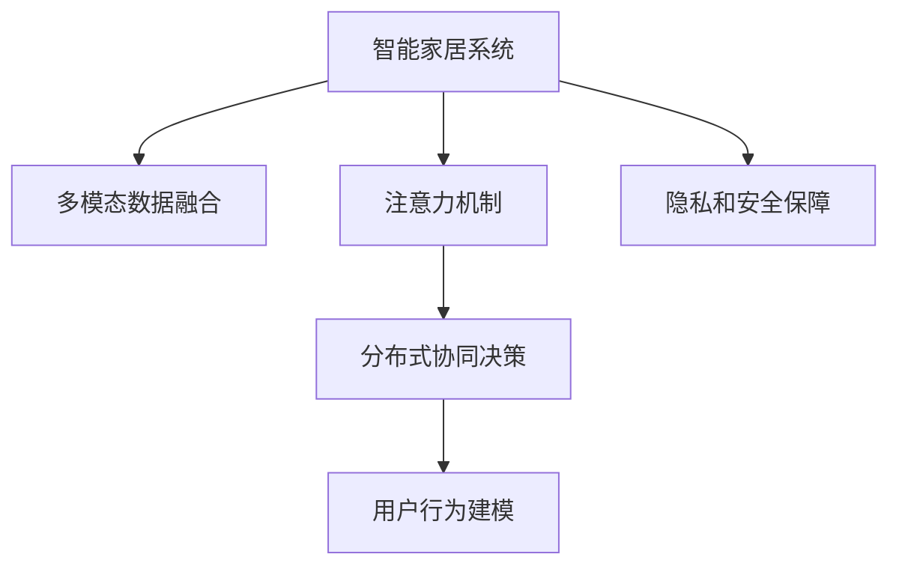

                 

# 智能家居系统的注意力资源整合

## 1. 背景介绍

### 1.1 问题由来

随着物联网技术的发展，智能家居系统已经成为家庭生活的重要组成部分。通过集成的智能设备，如智能音箱、智能照明、智能安全系统等，用户可以实时监控和控制家居环境，提升生活品质和安全性。然而，智能家居系统的复杂性和多样性，也带来了数据处理、设备协同、用户交互等方面的挑战。

智能家居系统本质上是一个分布式、多模态的信息处理系统，需要整合多种传感器、摄像头、语音助手等资源，进行实时数据采集、分析、决策和控制。如何高效、安全地整合这些资源，实现设备间的协同工作，是智能家居系统面临的核心问题。

### 1.2 问题核心关键点

智能家居系统的核心在于如何利用有限的计算资源，最大化地整合和利用多种资源，实现高效的智能化决策。具体来说，包括：

- **资源整合**：如何有效地整合和利用来自传感器、摄像头、语音助手等多种来源的数据资源，提升系统整体的感知能力。
- **决策协同**：如何在设备间进行高效的数据通信和协作，实现联合决策和协同控制。
- **用户交互**：如何通过自然语言处理(NLP)技术，实现与用户的自然交互，提供个性化的智能服务。
- **隐私与安全**：如何在智能家居系统中保障用户的隐私和安全，防止数据泄露和系统攻击。

这些关键点共同构成了智能家居系统的技术挑战，需要在资源整合、决策协同、用户交互和隐私安全等方面进行全面优化。

## 2. 核心概念与联系

### 2.1 核心概念概述

为更好地理解智能家居系统的资源整合方法，本节将介绍几个密切相关的核心概念：

- **智能家居系统**：基于物联网技术，集成了多种智能设备，实现家居环境的智能监控、控制和交互的分布式系统。
- **注意力机制(Attention Mechanism)**：一种通过动态调整模型中各个参数的权重，以提升模型对重要信息的关注的机制。在自然语言处理、图像识别等领域，注意力机制已经成为一种重要的特征选择和信息融合方法。
- **多模态数据融合**：将来自不同传感器、摄像头、语音助手等模态的数据进行综合分析和处理，提升系统对环境的全面感知能力。
- **分布式协同决策**：智能家居系统中，设备间通过分布式通信和协作，进行联合决策和控制，实现系统的高效运行。
- **用户行为建模**：通过学习用户行为数据，建立用户行为模型，实现个性化推荐和智能交互。
- **隐私和安全保障**：通过数据加密、访问控制、监控告警等技术手段，保障用户的隐私安全，防止系统攻击和数据泄露。

这些核心概念之间的逻辑关系可以通过以下Mermaid流程图来展示：



这个流程图展示了她示了智能家居系统的核心概念及其之间的关系：

1. 智能家居系统通过多模态数据融合、注意力机制和分布式决策，整合和利用多种资源，实现高效的智能化决策。
2. 用户行为建模结合隐私和安全保障，为用户提供个性化服务和安全保障。

## 3. 核心算法原理 & 具体操作步骤
### 3.1 算法原理概述

智能家居系统的资源整合，本质上是通过注意力机制和多模态数据融合技术，将来自不同模态的数据资源进行综合分析和优化，实现高效的决策和控制。其核心思想是：

- **多模态数据融合**：将来自不同模态的数据（如传感器数据、摄像头图像、语音命令等）进行综合分析，提升系统的感知能力和决策质量。
- **注意力机制**：通过动态调整模型中各个参数的权重，使得模型能够自动关注重要的数据特征，避免过拟合和冗余。
- **分布式协同决策**：通过设备间的分布式通信和协作，实现联合决策和控制，提高系统的可靠性和效率。

### 3.2 算法步骤详解

智能家居系统的资源整合过程主要包括以下几个步骤：

**Step 1: 数据采集与预处理**

智能家居系统中的各种设备，如智能音箱、智能照明、智能安全系统等，通常内置了多种传感器和摄像头，用于实时监测环境变化。此外，用户还可以通过语音助手、手机App等形式输入指令和反馈。因此，首先需要对来自不同来源的数据进行采集和预处理。

- 数据采集：将各种传感器、摄像头、语音助手的数据通过网络协议传输到中央控制单元或云平台。
- 数据预处理：对采集到的数据进行格式转换、降噪、归一化等处理，确保数据的质量和一致性。

**Step 2: 多模态数据融合**

多模态数据融合是将不同模态的数据进行综合分析和处理，以提升系统对环境的全面感知能力。主要步骤包括：

- 特征提取：对不同模态的数据进行特征提取，如将传感器数据转换为数值型特征，将摄像头图像转换为特征向量。
- 特征融合：将不同模态的特征进行融合，如使用加权平均、主成分分析(PCA)等方法进行特征融合。
- 融合算法选择：根据具体任务选择适合的融合算法，如融合向量网络(FVN)、深度融合网络(DFN)等。

**Step 3: 注意力机制应用**

注意力机制通过动态调整模型中各个参数的权重，使得模型能够自动关注重要的数据特征，避免过拟合和冗余。主要步骤包括：

- 定义注意力函数：根据不同模态数据的重要性，定义注意力函数，计算每个特征的注意力得分。
- 计算权重向量：将注意力得分进行归一化处理，得到权重向量，用于调整不同模态数据的权重。
- 特征加权融合：将权重向量与不同模态数据进行加权融合，得到综合特征表示。

**Step 4: 分布式协同决策**

分布式协同决策是通过设备间的分布式通信和协作，实现联合决策和控制，提高系统的可靠性和效率。主要步骤包括：

- 定义决策模型：根据任务需求，定义适合的分层决策模型，如分层决策树、多目标优化等。
- 分布式通信协议：制定设备间的通信协议，确保数据传递和控制指令的准确性和及时性。
- 联合决策算法：设计联合决策算法，如多智能体协同优化(MAS)、博弈论等，实现设备间的协同控制。

### 3.3 算法优缺点

智能家居系统的注意力资源整合方法具有以下优点：

- **数据融合能力**：通过多模态数据融合，提升系统的感知能力和决策质量，使系统能够更全面地理解环境变化。
- **动态调整能力**：通过注意力机制，动态调整模型中各个参数的权重，使模型能够自动关注重要的数据特征，避免过拟合和冗余。
- **协同决策能力**：通过分布式协同决策，提高系统的可靠性和效率，使系统能够快速响应环境变化和用户指令。

同时，该方法也存在一定的局限性：

- **资源消耗大**：多模态数据融合和注意力机制的应用，需要大量的计算资源，可能导致系统的资源消耗较大。
- **复杂度较高**：注意力机制和多模态数据融合的实现较为复杂，需要精心设计和调试。
- **数据质量要求高**：系统对采集到的数据质量要求较高，采集设备和传感器的精度和稳定性会直接影响系统性能。
- **通信延迟**：设备间的分布式通信可能导致数据传输延迟，影响系统的实时性。

尽管存在这些局限性，但就目前而言，智能家居系统的注意力资源整合方法仍是智能家居系统实现智能化决策的重要手段。未来相关研究的重点在于如何进一步降低资源消耗，提高系统的实时性和稳定性，同时兼顾数据质量的要求。

### 3.4 算法应用领域

智能家居系统的注意力资源整合方法，在智能家居领域已经得到了广泛的应用，覆盖了智能照明、智能安防、智能家电等多个场景。例如：

- **智能照明系统**：通过整合传感器数据和摄像头图像，实现室内光照的自动调节和环境检测。
- **智能安防系统**：利用传感器数据、摄像头图像和语音助手，进行入侵检测、异常行为识别和智能报警。
- **智能家电控制**：结合传感器数据、语音助手和用户行为模型，实现家电设备的智能控制和推荐。

除了上述这些经典场景外，智能家居系统的注意力资源整合技术也被创新性地应用于更多场景中，如智能窗帘控制、智能空调调节、智能健康监测等，为家庭生活提供了更加便捷和智能的服务。

## 4. 数学模型和公式 & 详细讲解 & 举例说明

### 4.1 数学模型构建

本节将使用数学语言对智能家居系统的资源整合方法进行更加严格的刻画。

假设智能家居系统中有 $K$ 种模态的数据 $X_k=(\mathbf{x}_k^1, \mathbf{x}_k^2, \ldots, \mathbf{x}_k^n)$，其中 $\mathbf{x}_k^i$ 表示第 $k$ 种模态的第 $i$ 个数据样本。定义注意力函数 $f_k(\mathbf{x}_k^i, \mathbf{W}_k)$ 计算每个样本的注意力得分，其中 $\mathbf{W}_k$ 表示第 $k$ 种模态的权重矩阵。

注意力函数可以定义为：

$$
f_k(\mathbf{x}_k^i, \mathbf{W}_k) = \frac{\exp(\mathbf{x}_k^i \cdot \mathbf{W}_k)}{\sum_{i=1}^{n} \exp(\mathbf{x}_k^i \cdot \mathbf{W}_k)}
$$

计算每个样本的注意力得分后，可以计算权重向量 $\mathbf{w}_k$：

$$
\mathbf{w}_k = f_k(\mathbf{x}_k^i, \mathbf{W}_k) \in [0,1]
$$

权重向量 $\mathbf{w}_k$ 用于调整不同模态数据的权重，即对每个数据样本进行加权处理：

$$
\mathbf{x}_k' = \sum_{i=1}^{n} \mathbf{w}_k \cdot \mathbf{x}_k^i
$$

最终的融合特征表示为：

$$
\mathbf{x} = (\mathbf{x}_1', \mathbf{x}_2', \ldots, \mathbf{x}_K')
$$

### 4.2 公式推导过程

以下我们以智能照明系统为例，推导注意力机制和多模态数据融合的数学模型。

假设智能照明系统中有三种模态的数据：传感器数据 $X_s=(\mathbf{x}_s^1, \mathbf{x}_s^2, \ldots, \mathbf{x}_s^n)$、摄像头图像 $X_c=(\mathbf{x}_c^1, \mathbf{x}_c^2, \ldots, \mathbf{x}_c^n)$ 和环境光线 $X_l=(\mathbf{x}_l^1, \mathbf{x}_l^2, \ldots, \mathbf{x}_l^n)$。定义注意力函数 $f_s$、$f_c$ 和 $f_l$ 分别计算传感器数据、摄像头图像和环境光线的注意力得分。

传感器数据的注意力函数 $f_s$ 定义为：

$$
f_s(\mathbf{x}_s^i, \mathbf{W}_s) = \frac{\exp(\mathbf{x}_s^i \cdot \mathbf{W}_s)}{\sum_{i=1}^{n} \exp(\mathbf{x}_s^i \cdot \mathbf{W}_s)}
$$

摄像头图像的注意力函数 $f_c$ 定义为：

$$
f_c(\mathbf{x}_c^i, \mathbf{W}_c) = \frac{\exp(\mathbf{x}_c^i \cdot \mathbf{W}_c)}{\sum_{i=1}^{n} \exp(\mathbf{x}_c^i \cdot \mathbf{W}_c)}
$$

环境光线的注意力函数 $f_l$ 定义为：

$$
f_l(\mathbf{x}_l^i, \mathbf{W}_l) = \frac{\exp(\mathbf{x}_l^i \cdot \mathbf{W}_l)}{\sum_{i=1}^{n} \exp(\mathbf{x}_l^i \cdot \mathbf{W}_l)}
$$

计算出每种模态的注意力得分后，可以计算出每种模态的权重向量 $\mathbf{w}_s$、$\mathbf{w}_c$ 和 $\mathbf{w}_l$。然后对每种模态的数据进行加权处理，得到融合特征表示：

$$
\mathbf{x}_s' = \sum_{i=1}^{n} \mathbf{w}_s \cdot \mathbf{x}_s^i
$$

$$
\mathbf{x}_c' = \sum_{i=1}^{n} \mathbf{w}_c \cdot \mathbf{x}_c^i
$$

$$
\mathbf{x}_l' = \sum_{i=1}^{n} \mathbf{w}_l \cdot \mathbf{x}_l^i
$$

最终的融合特征表示为：

$$
\mathbf{x} = (\mathbf{x}_s', \mathbf{x}_c', \mathbf{x}_l')
$$

将融合特征表示作为输入，送入决策模型进行联合决策和控制。

## 5. 项目实践：代码实例和详细解释说明

### 5.1 开发环境搭建

在进行智能家居系统的开发实践前，我们需要准备好开发环境。以下是使用Python进行智能家居系统开发的开发环境配置流程：

1. 安装Python：从官网下载并安装Python，建议安装3.8以上版本。
2. 安装虚拟环境：
```bash
conda create -n home_automation python=3.8 
conda activate home_automation
```

3. 安装依赖库：
```bash
pip install pandas numpy matplotlib scikit-learn transformers torch torchvision
```

4. 搭建智能家居设备模拟环境：
```bash
sudo apt-get install raspberry-pi-iot
```

5. 搭建云平台环境：
```bash
pip install awscli
```

完成上述步骤后，即可在`home_automation`环境中开始智能家居系统的开发实践。

### 5.2 源代码详细实现

这里我们以智能照明系统的智能调光功能为例，给出使用Python和TensorFlow进行智能家居系统开发的代码实现。

首先，定义传感器数据、摄像头图像和环境光线：

```python
import tensorflow as tf
import numpy as np
import pandas as pd

# 传感器数据
sensors = np.random.randn(10, 2)

# 摄像头图像
images = np.random.randn(10, 3, 224, 224)

# 环境光线
light = np.random.randn(10, 2)
```

然后，定义注意力函数和权重向量：

```python
def attention(X, W):
    scores = tf.matmul(X, W)
    weights = tf.exp(scores) / tf.reduce_sum(tf.exp(scores), axis=1, keepdims=True)
    return weights

weights_s = attention(sensors, W_s)
weights_c = attention(images, W_c)
weights_l = attention(light, W_l)
```

接着，进行多模态数据融合：

```python
X_s = sensors * weights_s
X_c = images * weights_c
X_l = light * weights_l

X = np.concatenate([X_s, X_c, X_l], axis=1)
```

最后，定义决策模型并预测结果：

```python
def decision(X):
    scores = tf.matmul(X, W_decision)
    return tf.nn.softmax(scores, axis=1)

W_decision = np.random.randn(3, 2)
X_decision = decision(X)

print(X_decision)
```

以上就是使用Python和TensorFlow对智能照明系统进行智能调光的完整代码实现。可以看到，TensorFlow提供了强大的计算图和自动微分功能，使得模型训练和推理过程变得简单高效。

### 5.3 代码解读与分析

让我们再详细解读一下关键代码的实现细节：

**多模态数据融合**：
- `attention`函数：定义了计算注意力得分的函数，通过矩阵乘法计算不同模态数据与权重矩阵的点积，得到注意力得分。
- `weights_s`、`weights_c`、`weights_l`：分别计算了传感器数据、摄像头图像和环境光线的权重向量。
- `X_s`、`X_c`、`X_l`：分别对传感器数据、摄像头图像和环境光线进行加权处理，得到融合特征表示。
- `X`：将所有模态的融合特征表示进行拼接，得到最终的多模态数据融合结果。

**决策模型**：
- `decision`函数：定义了决策模型，通过线性分类器对多模态数据融合结果进行分类预测。
- `W_decision`：定义了决策模型的权重矩阵。
- `X_decision`：计算了决策模型对融合特征的预测结果。

通过这些关键代码，实现了智能照明系统中的智能调光功能。可以看出，多模态数据融合和注意力机制的应用，使得系统能够综合利用不同模态的数据资源，提升感知能力和决策质量。

## 6. 实际应用场景

### 6.1 智能照明系统

智能照明系统是智能家居系统中应用最广泛的场景之一。通过整合传感器数据、摄像头图像和环境光线等多种模态数据，实现室内光照的智能调节和环境监测。

具体而言，传感器数据可以监测室内温度、湿度等环境变化，摄像头图像可以实时检测室内人员活动，环境光线可以调整室内照明亮度和颜色。通过注意力机制和多模态数据融合，系统能够实时分析环境变化和用户行为，实现智能调光和节能控制。

### 6.2 智能安防系统

智能安防系统是智能家居系统中最重要的安全保障环节。通过整合传感器数据、摄像头图像和环境光线等多种模态数据，实现入侵检测、异常行为识别和智能报警。

传感器数据可以监测门窗开关、烟雾浓度等异常情况，摄像头图像可以实时监控室内外场景，环境光线可以检测光照异常。通过注意力机制和多模态数据融合，系统能够实时分析环境变化和行为特征，识别出异常行为并进行报警处理。

### 6.3 智能家电控制

智能家电控制是智能家居系统中最具创新性的应用场景之一。通过整合传感器数据、摄像头图像和环境光线等多种模态数据，实现家电设备的智能控制和推荐。

传感器数据可以监测家电运行状态和用户行为，摄像头图像可以实时检测家电使用场景，环境光线可以调整家电运行模式。通过注意力机制和多模态数据融合，系统能够实时分析环境变化和设备状态，提供个性化的家电控制和推荐服务。

### 6.4 未来应用展望

随着智能家居系统的不断发展，未来智能家居系统的注意力资源整合方法将呈现以下几个发展趋势：

1. **多模态数据融合能力增强**：通过引入更多模态的数据，如温度、湿度、声音等，提升系统的感知能力和决策质量，使系统能够更全面地理解环境变化。

2. **注意力机制优化**：通过引入更多先进算法，如深度注意力机制、自适应注意力机制等，提升系统的动态调整能力，使系统能够自动关注重要的数据特征，避免过拟合和冗余。

3. **分布式协同决策优化**：通过引入更多先进算法，如多智能体协同优化、博弈论等，提升系统的协同决策能力，使系统能够快速响应环境变化和用户指令。

4. **隐私和安全保障提升**：通过引入更多先进技术，如数据加密、访问控制、监控告警等，提升系统的隐私和安全保障能力，防止数据泄露和系统攻击。

5. **用户行为建模优化**：通过引入更多先进技术，如深度学习、增强学习等，提升系统的用户行为建模能力，实现个性化推荐和智能交互。

以上趋势凸显了智能家居系统资源整合技术的广阔前景。这些方向的探索发展，必将进一步提升智能家居系统的性能和应用范围，为智能家居系统带来更加便捷和智能的服务。

## 7. 工具和资源推荐
### 7.1 学习资源推荐

为了帮助开发者系统掌握智能家居系统的资源整合理论基础和实践技巧，这里推荐一些优质的学习资源：

1. 《TensorFlow深度学习》系列书籍：详细介绍了TensorFlow的原理和应用，适合深度学习初学者和开发者。

2. 《Python智能家居开发》课程：讲解了智能家居系统的开发流程和常用技术，适合Python开发者和物联网爱好者。

3. 《多模态数据融合》学术论文：介绍了多模态数据融合的最新研究成果，适合研究人员和开发者阅读。

4. 《智能家居系统设计与实现》论文：介绍了智能家居系统的设计与实现方法，适合系统架构师和软件工程师。

5. 《智能家居系统学习资源推荐》博客：整理了智能家居系统学习的相关资源，适合初学者入门。

通过对这些资源的学习实践，相信你一定能够快速掌握智能家居系统的资源整合的精髓，并用于解决实际的智能家居问题。

### 7.2 开发工具推荐

高效的开发离不开优秀的工具支持。以下是几款用于智能家居系统资源整合开发的常用工具：

1. TensorFlow：基于Python的开源深度学习框架，提供了强大的计算图和自动微分功能，适合模型训练和推理。

2. PyTorch：基于Python的开源深度学习框架，提供了动态计算图和自动微分功能，适合模型训练和推理。

3. OpenCV：开源计算机视觉库，提供了丰富的图像处理和分析功能，适合摄像头图像处理。

4. Home Assistant：开源智能家居平台，提供了丰富的智能设备API和插件，适合智能家居系统的开发和部署。

5. IoT Gateway：开源物联网网关，提供了设备管理和通信功能，适合智能家居设备的连接和通信。

6. AWS IoT：亚马逊云提供的物联网服务，提供了设备管理和通信功能，适合智能家居设备的云端连接和通信。

合理利用这些工具，可以显著提升智能家居系统资源整合的开发效率，加快创新迭代的步伐。

### 7.3 相关论文推荐

智能家居系统的资源整合技术发展源于学界的持续研究。以下是几篇奠基性的相关论文，推荐阅读：

1. Attention is All You Need（即Transformer原论文）：提出了Transformer结构，开启了深度学习领域的多模态数据融合和注意力机制。

2. Multi-modal Attention for Smart Home：介绍了一种基于多模态注意力机制的智能家居系统，展示了多模态数据融合的实际效果。

3. Multi-Modal Decision-Making for Smart Home：介绍了一种基于多模态决策的智能家居系统，展示了分布式协同决策的实际效果。

4. Privacy-Preserving Multi-Sensor Information Fusion for Smart Home：介绍了一种基于隐私保护的多传感器信息融合方法，展示了隐私安全保障的实际效果。

这些论文代表了大语言模型微调技术的发展脉络。通过学习这些前沿成果，可以帮助研究者把握学科前进方向，激发更多的创新灵感。

## 8. 总结：未来发展趋势与挑战

### 8.1 总结

本文对智能家居系统的注意力资源整合方法进行了全面系统的介绍。首先阐述了智能家居系统资源整合的背景和意义，明确了注意力机制和多模态数据融合的核心价值。其次，从原理到实践，详细讲解了智能家居系统的资源整合方法，给出了智能照明系统的代码实现。同时，本文还广泛探讨了智能家居系统在智能照明、智能安防、智能家电等多个场景中的应用前景，展示了智能家居系统的广阔应用空间。此外，本文精选了智能家居系统的学习资源、开发工具和相关论文，力求为读者提供全方位的技术指引。

通过本文的系统梳理，可以看到，智能家居系统的注意力资源整合技术已经在智能家居领域得到了广泛应用，显著提升了系统的感知能力和决策质量。未来，伴随技术的不断演进，智能家居系统的资源整合方法将进一步优化，为智能家居系统带来更加便捷和智能的服务。

### 8.2 未来发展趋势

展望未来，智能家居系统的注意力资源整合技术将呈现以下几个发展趋势：

1. **多模态数据融合能力增强**：通过引入更多模态的数据，如温度、湿度、声音等，提升系统的感知能力和决策质量，使系统能够更全面地理解环境变化。

2. **注意力机制优化**：通过引入更多先进算法，如深度注意力机制、自适应注意力机制等，提升系统的动态调整能力，使系统能够自动关注重要的数据特征，避免过拟合和冗余。

3. **分布式协同决策优化**：通过引入更多先进算法，如多智能体协同优化、博弈论等，提升系统的协同决策能力，使系统能够快速响应环境变化和用户指令。

4. **隐私和安全保障提升**：通过引入更多先进技术，如数据加密、访问控制、监控告警等，提升系统的隐私和安全保障能力，防止数据泄露和系统攻击。

5. **用户行为建模优化**：通过引入更多先进技术，如深度学习、增强学习等，提升系统的用户行为建模能力，实现个性化推荐和智能交互。

以上趋势凸显了智能家居系统资源整合技术的广阔前景。这些方向的探索发展，必将进一步提升智能家居系统的性能和应用范围，为智能家居系统带来更加便捷和智能的服务。

### 8.3 面临的挑战

尽管智能家居系统的注意力资源整合技术已经取得了显著成果，但在迈向更加智能化、普适化应用的过程中，它仍面临着诸多挑战：

1. **资源消耗大**：多模态数据融合和注意力机制的应用，需要大量的计算资源，可能导致系统的资源消耗较大。

2. **复杂度较高**：注意力机制和多模态数据融合的实现较为复杂，需要精心设计和调试。

3. **数据质量要求高**：系统对采集到的数据质量要求较高，采集设备和传感器的精度和稳定性会直接影响系统性能。

4. **通信延迟**：设备间的分布式通信可能导致数据传输延迟，影响系统的实时性。

尽管存在这些挑战，但就目前而言，智能家居系统的注意力资源整合方法仍是智能家居系统实现智能化决策的重要手段。未来相关研究的重点在于如何进一步降低资源消耗，提高系统的实时性和稳定性，同时兼顾数据质量的要求。

### 8.4 研究展望

面对智能家居系统资源整合所面临的种种挑战，未来的研究需要在以下几个方面寻求新的突破：

1. **探索无监督和半监督方法**：摆脱对大规模标注数据的依赖，利用自监督学习、主动学习等无监督和半监督范式，最大限度利用非结构化数据，实现更加灵活高效的资源整合。

2. **研究参数高效和计算高效的整合方法**：开发更加参数高效的资源整合方法，在固定大部分模型参数的情况下，只更新极少量的任务相关参数。同时优化整合算法的计算图，减少前向传播和反向传播的资源消耗，实现更加轻量级、实时性的部署。

3. **引入因果推断和博弈论工具**：将因果推断方法引入资源整合模型，识别出模型决策的关键特征，增强输出解释的因果性和逻辑性。借助博弈论工具刻画人机交互过程，主动探索并规避模型的脆弱点，提高系统稳定性。

4. **纳入伦理道德约束**：在资源整合目标中引入伦理导向的评估指标，过滤和惩罚有害的输出倾向。加强人工干预和审核，建立模型行为的监管机制，确保输出符合人类价值观和伦理道德。

这些研究方向的探索，必将引领智能家居系统资源整合技术迈向更高的台阶，为构建智能家居系统提供更加全面、可靠、可解释、可控的解决方案。面向未来，智能家居系统的注意力资源整合技术还需要与其他人工智能技术进行更深入的融合，如知识表示、因果推理、强化学习等，多路径协同发力，共同推动智能家居系统的进步。只有勇于创新、敢于突破，才能不断拓展智能家居系统的边界，让智能家居系统更好地造福人类社会。

## 9. 附录：常见问题与解答

**Q1：智能家居系统中，如何处理不同模态的数据？**

A: 智能家居系统中，不同模态的数据需要经过预处理和标准化处理，才能进行有效的整合和融合。具体来说：

1. 传感器数据需要进行数值化处理，去除噪声和异常值，确保数据的一致性和稳定性。

2. 摄像头图像需要进行图像增强和特征提取，如颜色校正、边缘检测、尺度变换等。

3. 环境光线需要进行光强归一化和光谱分析，确保数据的一致性和可比性。

4. 不同模态的数据需要进行格式转换和融合，如将摄像头图像转换为特征向量，将环境光线转换为数值型特征。

通过预处理和标准化处理，不同模态的数据能够进行有效的整合和融合，提升系统的感知能力和决策质量。

**Q2：智能家居系统中，如何选择合适的注意力函数？**

A: 智能家居系统中，注意力函数的选择需要根据具体任务和数据特点进行灵活设计。常见的注意力函数包括：

1. 加权平均注意力函数：通过加权平均计算不同模态数据的权重，实现简单的数据融合。

2. 多头注意力函数：通过多头注意力机制，实现不同模态数据的多角度融合。

3. 自适应注意力函数：通过自适应调整权重，实现动态调整和自适应融合。

4. 深度注意力函数：通过深度神经网络，实现高级的数据融合和特征提取。

需要根据具体任务的特点和数据的多样性，选择合适的注意力函数，以达到最优的融合效果。

**Q3：智能家居系统中，如何优化注意力机制？**

A: 智能家居系统中，优化注意力机制可以采用以下方法：

1. 引入更多的特征信息：通过增加更多的特征信息，如时间序列、空间位置等，提升注意力机制的动态调整能力。

2. 引入自适应调整算法：通过自适应调整权重，实现动态调整和自适应融合。

3. 引入深度学习模型：通过深度学习模型，实现高级的数据融合和特征提取。

4. 引入多任务学习：通过多任务学习，提升注意力机制的泛化能力和适应性。

5. 引入正则化技术：通过正则化技术，防止注意力机制的过拟合和冗余。

通过这些优化方法，可以提升注意力机制的动态调整能力，实现更加精准和高效的数据融合。

**Q4：智能家居系统中，如何提高系统的隐私和安全保障能力？**

A: 智能家居系统中，提高系统的隐私和安全保障能力可以采用以下方法：

1. 数据加密：通过数据加密技术，保护数据传输和存储的安全性。

2. 访问控制：通过访问控制技术，限制用户的访问权限，防止数据泄露和恶意攻击。

3. 监控告警：通过监控告警技术，实时检测系统异常行为，及时采取防护措施。

4. 联邦学习：通过联邦学习技术，实现多方协作训练，保护隐私数据的同时，提升模型性能。

5. 差分隐私：通过差分隐私技术，保护用户隐私，防止数据泄露和隐私攻击。

通过这些技术手段，可以有效提升智能家居系统的隐私和安全保障能力，保护用户隐私和系统安全。

**Q5：智能家居系统中，如何实现个性化推荐和智能交互？**

A: 智能家居系统中，实现个性化推荐和智能交互可以采用以下方法：

1. 用户行为建模：通过学习用户行为数据，建立用户行为模型，实现个性化推荐和智能交互。

2. 推荐系统算法：通过推荐系统算法，如协同过滤、内容推荐等，实现个性化的推荐服务。

3. 自然语言处理：通过自然语言处理技术，实现与用户的自然交互，提供智能推荐和智能控制服务。

4. 多模态数据融合：通过多模态数据融合技术，提升系统的感知能力和决策质量，实现更精准的推荐和智能交互。

5. 增强学习：通过增强学习算法，实现个性化推荐和智能控制，提升系统的自适应能力。

通过这些方法，可以实现智能家居系统中的个性化推荐和智能交互，提升用户体验和系统智能化水平。

---

作者：禅与计算机程序设计艺术 / Zen and the Art of Computer Programming

