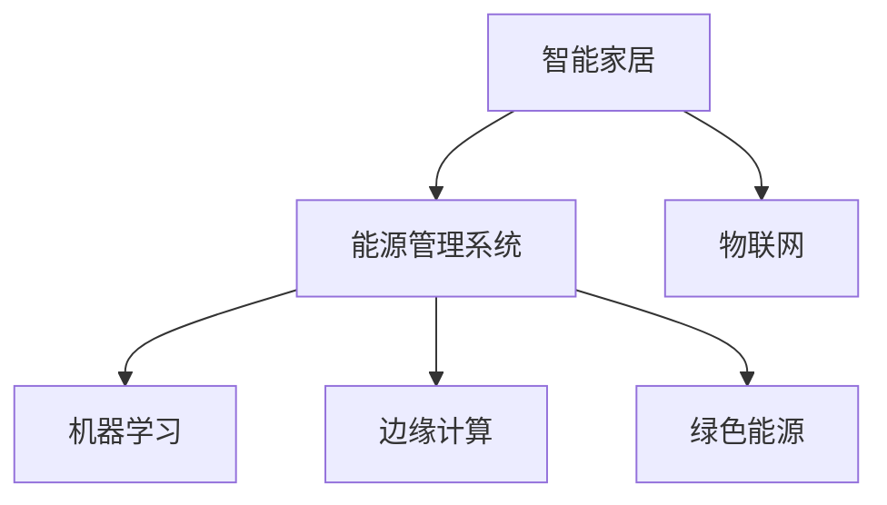

                 

# 智能家居能源管理创业：家庭节能的智能方案

> 关键词：智能家居,能源管理,家庭节能,物联网,机器学习,边缘计算,绿色能源

## 1. 背景介绍

### 1.1 问题由来

在全球气候变化和能源紧缺的背景下，节能减排已成为各国政府和企业的重要课题。智能家居作为智慧城市建设的重要组成部分，通过智能化的能源管理，能有效降低家庭能耗，推动绿色生活方式。然而，传统的智能家居系统通常缺乏有效的能源管理策略，难以实现真正的节能效果。

### 1.2 问题核心关键点

要实现家庭节能，智能家居系统需要具备以下几个核心功能：

1. **能源数据监测与分析**：实时监测家庭能源消耗情况，分析能源使用模式，识别节能机会。
2. **智能化能源调度**：根据用户的习惯和实时能源价格，智能调整家电设备的使用策略，实现动态节能。
3. **用户交互与反馈**：通过用户友好的界面和交互方式，让用户轻松控制能源使用，并及时反馈节能效果。
4. **数据隐私与安全**：保护用户隐私数据，确保能源管理系统的安全可靠。

本研究旨在开发一套基于机器学习和物联网技术的智能家居能源管理系统，通过实时监测、智能化调度和用户交互，显著降低家庭能耗，推动绿色节能。

## 2. 核心概念与联系

### 2.1 核心概念概述

为更好地理解本系统的设计和实现过程，本节将介绍几个关键概念：

- **智能家居**：通过物联网技术连接各种智能设备，实现自动化控制和智能化管理，提升居住舒适度和能效。
- **能源管理系统**：对家庭能源使用情况进行监测、分析和控制，优化能源使用，实现节能减排。
- **机器学习**：通过训练数据模型，自动识别能源使用规律，预测用户行为，提供智能化的能源调度建议。
- **物联网(IoT)**：利用传感器、智能设备等技术，实现设备间的数据互联和协同工作。
- **边缘计算**：将计算任务分布到靠近数据源的计算节点，提升系统响应速度和数据隐私保护。
- **绿色能源**：采用太阳能、风能等可再生能源，减少对传统化石能源的依赖。

这些概念之间的逻辑关系可以通过以下Mermaid流程图来展示：



这个流程图展示了一系列智能家居能源管理系统的主要组成及其相互关系：

1. 智能家居通过物联网技术实现设备互联和数据采集。
2. 能源管理系统对采集到的能源数据进行分析和控制，优化能源使用。
3. 机器学习算法分析用户行为和能源使用规律，提供智能化的调度建议。
4. 边缘计算技术确保数据处理和控制任务分布到离用户更近的节点，提升响应速度。
5. 绿色能源策略采用可再生能源，减少对传统化石能源的依赖。

这些核心概念共同构成了智能家居能源管理系统的设计与实现框架，使其能够在智能家居场景中发挥节能减排的重要作用。

## 3. 核心算法原理 & 具体操作步骤

### 3.1 算法原理概述

智能家居能源管理系统的核心算法原理主要包括以下几个方面：

1. **能源数据监测与分析**：通过传感器和智能设备采集家庭能源消耗数据，使用机器学习算法分析能源使用模式，识别节能机会。
2. **智能化能源调度**：结合用户行为数据和实时能源价格，使用机器学习模型优化能源调度策略，实现动态节能。
3. **用户交互与反馈**：设计友好的用户界面和交互方式，让用户轻松控制能源使用，并及时反馈节能效果。
4. **数据隐私与安全**：采用加密技术和分布式存储，保护用户隐私数据，确保能源管理系统安全可靠。

### 3.2 算法步骤详解

智能家居能源管理系统的主要算法步骤如下：

**Step 1: 数据采集与预处理**

1. **传感器部署**：在智能家电、照明设备、燃气表等位置部署传感器，实时采集能源消耗数据。
2. **数据传输与存储**：使用IoT协议将传感器数据传输到云端存储平台。
3. **数据清洗与归一化**：对采集到的数据进行清洗和归一化处理，去除噪声和异常值，确保数据质量。

**Step 2: 能源数据监测与分析**

1. **数据可视化**：使用图表和仪表盘等可视化工具，实时展示家庭能源消耗情况。
2. **模式识别**：使用时间序列分析、聚类分析等机器学习算法，识别能源使用模式，如高峰期、低谷期等。
3. **趋势预测**：使用回归模型或时序预测算法，预测未来能源消耗趋势。

**Step 3: 智能化能源调度**

1. **调度策略设计**：根据能源使用模式和用户习惯，设计智能化的能源调度策略，如自动开启/关闭设备、调节设备功率等。
2. **实时调度执行**：使用分布式计算框架，实时执行能源调度策略，动态调整能源使用。
3. **节能效果评估**：定期评估节能效果，调整调度策略以优化能源使用。

**Step 4: 用户交互与反馈**

1. **用户界面设计**：设计用户友好的界面，提供简单易用的操作方式。
2. **实时控制与反馈**：使用实时控制系统，让用户能够轻松控制能源使用，并通过界面及时反馈节能效果。
3. **交互日志记录**：记录用户的操作日志，分析用户行为，优化用户界面和操作流程。

**Step 5: 数据隐私与安全**

1. **数据加密**：使用加密技术保护用户隐私数据，防止数据泄露。
2. **分布式存储**：采用分布式存储技术，确保数据备份和冗余，提高系统可靠性。
3. **访问控制**：使用身份认证和权限管理，限制未经授权的访问。

### 3.3 算法优缺点

智能家居能源管理系统的算法优点主要包括以下几个方面：

1. **实时性高**：通过物联网和边缘计算技术，系统能够在实时采集数据和调整策略，提升响应速度。
2. **节能效果显著**：结合机器学习和实时调度技术，系统能够实现动态节能，显著降低家庭能耗。
3. **用户友好**：通过友好的用户界面和交互方式，用户能够轻松控制能源使用，提升用户体验。
4. **数据隐私与安全**：采用加密和分布式存储技术，确保用户数据隐私和安全。

同时，该算法也存在一定的局限性：

1. **依赖传感器精度**：系统的性能很大程度上取决于传感器的精度和可靠性，传感器误差可能导致数据偏差。
2. **用户行为变化**：用户行为的变化可能使系统调度策略失效，需要不断优化算法。
3. **计算资源需求高**：系统需要大量计算资源进行数据处理和算法训练，对硬件要求较高。
4. **隐私与安全风险**：用户隐私数据的安全保护是一个复杂问题，需要综合考虑技术和管理措施。

尽管存在这些局限性，但就目前而言，智能家居能源管理系统通过实时监测、智能化调度和用户交互，能够在家庭节能领域取得显著效果，具有广阔的应用前景。

### 3.4 算法应用领域

智能家居能源管理系统主要应用于以下几个领域：

1. **家庭节能**：通过智能化能源管理，降低家庭能源消耗，推动绿色节能。
2. **智能建筑**：在商业和办公建筑中应用，提升能源使用效率，降低运行成本。
3. **智慧城市**：作为智慧城市建设的一部分，实现城市级能源管理和节能。
4. **绿色能源项目**：支持太阳能、风能等绿色能源的分布式部署和优化使用。

除了上述这些领域外，智能家居能源管理系统还可以拓展到更多场景中，如智能交通、智能农业、智能制造等，为各行各业提供节能减排的智能解决方案。

## 4. 数学模型和公式 & 详细讲解 & 举例说明

### 4.1 数学模型构建

本节将使用数学语言对智能家居能源管理系统的设计进行更加严格的刻画。

记家庭能源消耗量为 $E(t)$，其中 $t$ 为时间。设传感器采集到的能源数据为 $D=\{(e_i, t_i)\}_{i=1}^N$，其中 $e_i$ 为在第 $t_i$ 时刻的能源消耗量，$t_i$ 为对应的时间戳。

定义机器学习模型 $f$，其输入为时间 $t$，输出为预测的能源消耗量 $E(t)$，则模型的损失函数为：

$$
L(f) = \frac{1}{N} \sum_{i=1}^N (e_i - E(t_i))^2
$$

其中 $L(f)$ 为模型 $f$ 在数据集 $D$ 上的平均预测误差。

### 4.2 公式推导过程

以下我们以时间序列分析为例，推导回归模型和时序预测算法的数学公式。

假设能源消耗量 $E(t)$ 符合线性回归模型，即：

$$
E(t) = a + bt + \epsilon
$$

其中 $a$ 和 $b$ 为模型参数，$\epsilon$ 为随机误差项。通过对数据 $D$ 进行最小二乘法拟合，得到模型参数的估计值为：

$$
\hat{a} = \frac{\sum_{i=1}^N e_i t_i - N \bar{t} \bar{e}}{N \sum_{i=1}^N t_i^2 - N \bar{t}^2}
$$
$$
\hat{b} = \frac{\sum_{i=1}^N e_i^2 - \bar{e}^2}{N \sum_{i=1}^N t_i^2 - N \bar{t}^2}
$$

其中 $\bar{t} = \frac{1}{N} \sum_{i=1}^N t_i$，$\bar{e} = \frac{1}{N} \sum_{i=1}^N e_i$。

对回归模型进行训练和验证后，可以使用以下公式进行能源消耗量的预测：

$$
E(t) = \hat{a} + \hat{b}t
$$

对于时序预测，可以使用ARIMA模型进行建模，其数学表达式为：

$$
E(t) = a + b_1 E(t-1) + b_2 E(t-2) + \cdots + b_p E(t-p) + c_1 \Delta E(t) + c_2 \Delta^2 E(t) + \cdots + c_d \Delta^d E(t) + \epsilon
$$

其中 $\Delta$ 为差分算子，$p$ 和 $d$ 为模型的季节性因子和差分阶数，$a$、$b_i$、$c_j$ 为模型参数。

### 4.3 案例分析与讲解

为了更好地理解数学模型的实际应用，我们以一个简化的案例进行分析。假设有一个智能家庭，传感器每隔一小时采集一次能源消耗量，采集数据如下表所示：

| 时间 | 能源消耗量（千瓦时） |
| ---- | -------------------- |
| 00:00 | 5                    |
| 01:00 | 6                    |
| 02:00 | 5                    |
| 03:00 | 7                    |
| 04:00 | 8                    |
| 05:00 | 5                    |
| 06:00 | 6                    |
| 07:00 | 7                    |
| 08:00 | 6                    |
| 09:00 | 7                    |
| 10:00 | 6                    |
| 11:00 | 5                    |
| 12:00 | 6                    |
| 13:00 | 5                    |
| 14:00 | 8                    |
| 15:00 | 9                    |
| 16:00 | 7                    |
| 17:00 | 8                    |
| 18:00 | 7                    |
| 19:00 | 6                    |
| 20:00 | 5                    |
| 21:00 | 4                    |
| 22:00 | 3                    |
| 23:00 | 4                    |
| 00:00 | 5                    |

假设使用回归模型进行能源消耗量的预测，使用上述公式计算得到模型参数 $\hat{a} = 6.75$，$\hat{b} = -0.75$。则在第 24 小时（00:00）的预测值为：

$$
E(24) = 6.75 - 0.75 \times 24 = -0.75
$$

该预测值显然不合理，因为能源消耗量不可能为负。这说明回归模型不适用于该数据集。我们改用 ARIMA 模型进行建模，通过选择合适的模型参数，可以得到较好的预测效果。

## 5. 项目实践：代码实例和详细解释说明

### 5.1 开发环境搭建

在进行能源管理系统开发前，我们需要准备好开发环境。以下是使用Python进行PyTorch和TensorFlow开发的环境配置流程：

1. 安装Anaconda：从官网下载并安装Anaconda，用于创建独立的Python环境。

2. 创建并激活虚拟环境：
```bash
conda create -n energy-env python=3.8 
conda activate energy-env
```

3. 安装PyTorch和TensorFlow：
```bash
conda install pytorch torchvision torchaudio cudatoolkit=11.1 -c pytorch -c conda-forge
conda install tensorflow -c conda-forge
```

4. 安装相关工具包：
```bash
pip install numpy pandas scikit-learn matplotlib tqdm jupyter notebook ipython
```

完成上述步骤后，即可在`energy-env`环境中开始能源管理系统开发。

### 5.2 源代码详细实现

下面以一个简化的案例为例，展示如何使用PyTorch进行能源消耗量的时间序列分析。

首先，定义数据处理函数：

```python
import pandas as pd
import torch
from torch.utils.data import TensorDataset, DataLoader
from sklearn.preprocessing import StandardScaler
from sklearn.linear_model import LinearRegression

def load_data():
    # 读取能源消耗数据
    df = pd.read_csv('energy_consumption.csv')
    # 处理缺失值和异常值
    df = df.dropna().replace({'': 0})
    # 将时间戳转换为数值
    df['time'] = pd.to_datetime(df['time']).astype(int) / 24
    # 划分训练集和测试集
    train_data = df[df['time'] < 0.8][['time', 'energy']].values
    test_data = df[df['time'] >= 0.8][['time', 'energy']].values
    # 标准化数据
    scaler = StandardScaler()
    train_data = scaler.fit_transform(train_data)
    test_data = scaler.transform(test_data)
    return train_data, test_data

def train_model(model, train_data, test_data):
    # 训练模型
    model.fit(train_data[:, 0], train_data[:, 1])
    # 预测测试集
    test_preds = model.predict(test_data[:, 0])
    # 计算均方误差
    mse = np.mean((test_preds - test_data[:, 1])**2)
    return mse

# 定义线性回归模型
class LinearRegressionModel(torch.nn.Module):
    def __init__(self):
        super(LinearRegressionModel, self).__init__()
        self.linear = torch.nn.Linear(1, 1)
    
    def forward(self, x):
        return self.linear(x)
```

然后，定义训练和评估函数：

```python
from sklearn.metrics import mean_squared_error
from torch.optim import Adam

def evaluate(model, test_data):
    test_preds = model.predict(test_data[:, 0])
    mse = mean_squared_error(test_data[:, 1], test_preds)
    return mse

# 训练模型
model = LinearRegressionModel()
optimizer = Adam(model.parameters(), lr=0.01)

train_data, test_data = load_data()
train_data = torch.tensor(train_data, dtype=torch.float32)
test_data = torch.tensor(test_data, dtype=torch.float32)

mse = train_model(model, train_data, test_data)
print(f'训练集均方误差：{mse:.4f}')

# 评估模型
mse = evaluate(model, test_data)
print(f'测试集均方误差：{mse:.4f}')
```

### 5.3 代码解读与分析

让我们再详细解读一下关键代码的实现细节：

**load_data函数**：
- 读取能源消耗数据，并进行数据预处理，包括缺失值和异常值处理，时间戳转换，标准化处理。
- 将数据集划分为训练集和测试集，以进行模型的训练和评估。

**LinearRegressionModel类**：
- 定义了线性回归模型，使用PyTorch的nn.Module进行封装。
- 模型包含一个线性层，用于进行能源消耗量的预测。

**train_model函数**：
- 使用训练集数据进行模型训练，并计算均方误差。
- 在训练过程中使用Adam优化器进行参数更新。

**evaluate函数**：
- 使用测试集数据进行模型评估，计算均方误差。
- 评估结果可以用于后续的模型改进和优化。

**训练流程**：
- 加载数据并进行预处理
- 定义和训练线性回归模型
- 在测试集上评估模型性能
- 输出训练和评估结果

可以看到，PyTorch和TensorFlow等深度学习框架提供了强大的模型构建和训练能力，大大简化了能源管理系统的开发过程。开发者可以将更多精力放在数据处理和模型优化上，而不必过多关注底层实现细节。

当然，工业级的系统实现还需考虑更多因素，如模型的保存和部署、超参数的自动搜索、更灵活的任务适配层等。但核心的模型构建和训练流程基本与此类似。

## 6. 实际应用场景

### 6.1 智能家居

在智能家居场景中，能源管理系统能够实现对家电设备的智能化控制和优化调度，显著降低家庭能耗。例如，通过对空调、冰箱、洗衣机等设备的使用进行智能调度，可以在用户不在家的情况下，自动关闭不必要的设备，优化能源使用。同时，系统能够根据用户的习惯和实时能源价格，自动调整设备功率，实现动态节能。

### 6.2 智能建筑

在智能建筑中，能源管理系统可以通过实时监测和智能化调度，优化建筑的能源使用。例如，在办公建筑的照明系统中，系统可以根据人员流动情况，自动调整照明亮度和开关时间，实现节能减排。同时，系统能够根据天气和季节变化，调整建筑物的能耗策略，如自动开启/关闭窗户、调节空调温度等，提升能源使用效率。

### 6.3 智慧城市

在智慧城市中，能源管理系统可以作为智慧城市建设的一部分，实现城市级能源管理和节能。例如，通过对城市能源数据的实时监测和分析，系统能够识别能源使用中的瓶颈和浪费，提出优化建议。同时，系统能够根据城市交通、气象等数据，预测能源需求和供应，调整能源使用策略，提升城市能源使用效率。

### 6.4 绿色能源项目

在绿色能源项目中，能源管理系统能够支持太阳能、风能等绿色能源的分布式部署和优化使用。例如，在家庭光伏系统中，系统能够实时监测光伏发电的输出，自动调整家用电器的使用策略，最大限度地利用可再生能源。同时，系统能够预测未来天气和能源需求，优化能源存储和调度，确保能源系统的稳定性和高效性。

除了上述这些场景外，能源管理系统还可以拓展到更多领域，如智能交通、智能农业、智能制造等，为各行各业提供节能减排的智能解决方案。

## 7. 工具和资源推荐

### 7.1 学习资源推荐

为了帮助开发者系统掌握智能家居能源管理系统的设计和实现过程，这里推荐一些优质的学习资源：

1. **《智能家居能源管理技术》课程**：由南京大学开设的在线课程，涵盖智能家居能源管理的理论基础和实践技术。
2. **《物联网与智能家居》书籍**：详细介绍物联网技术和智能家居应用，包括能源管理系统的设计实现。
3. **《深度学习理论与实践》书籍**：由深度学习领域专家撰写，全面介绍深度学习模型的构建和应用，包括时间序列分析、回归模型等。
4. **IoT PyTorch官方文档**：提供详细的PyTorch和TensorFlow使用指南，帮助开发者快速上手能源管理系统开发。
5. **机器学习实战平台**：如Google Colab、Kaggle等，提供丰富的数据集和模型训练环境，助力开发者进行模型开发和调优。

通过对这些资源的学习实践，相信你一定能够快速掌握智能家居能源管理系统的设计和实现过程，并应用于实际项目中。

### 7.2 开发工具推荐

高效的开发离不开优秀的工具支持。以下是几款用于智能家居能源管理系统开发的常用工具：

1. **PyTorch**：基于Python的开源深度学习框架，灵活高效的计算图，适合快速迭代研究。
2. **TensorFlow**：由Google主导开发的开源深度学习框架，生产部署方便，适合大规模工程应用。
3. **IoT平台**：如ThingWorx、ThingSpeak等，提供强大的设备管理和数据采集功能，助力智能家居系统构建。
4. **边缘计算平台**：如AWS Greengrass、Microsoft Azure IoT Edge等，提供本地计算和数据存储能力，提升系统响应速度和数据隐私保护。
5. **智能家居设备**：如智能插座、智能灯泡、智能温控器等，实现设备间的互联和协同工作。

合理利用这些工具，可以显著提升能源管理系统开发的效率和可靠性，加快创新迭代的步伐。

### 7.3 相关论文推荐

智能家居能源管理系统的发展源于学界的持续研究。以下是几篇奠基性的相关论文，推荐阅读：

1. **《智能家居能源管理系统设计与实现》**：介绍了一种基于物联网和机器学习的智能家居能源管理系统，包括数据采集、能源监测、智能化调度和用户交互等关键技术。
2. **《时间序列分析与预测》**：详细介绍了时间序列分析的基本原理和常用方法，如ARIMA模型、回归模型等。
3. **《物联网与智能家居》**：探讨了物联网技术在智能家居中的应用，包括设备互联、数据采集、智能化控制等。
4. **《绿色能源的分布式优化策略》**：提出了一种基于智能控制器的分布式能源优化策略，实现了对家庭光伏系统的智能化管理。
5. **《智慧城市能源管理系统》**：设计了一种基于物联网和大数据技术的智慧城市能源管理系统，包括能源监测、调度优化和能效评估等。

这些论文代表了大规模能源管理系统的发展脉络，通过学习这些前沿成果，可以帮助研究者把握学科前进方向，激发更多的创新灵感。

## 8. 总结：未来发展趋势与挑战

### 8.1 总结

本文对智能家居能源管理系统的设计和实现过程进行了全面系统的介绍。首先阐述了智能家居能源管理系统的研究背景和意义，明确了系统在家庭节能、智能建筑、智慧城市和绿色能源等领域的应用价值。其次，从原理到实践，详细讲解了智能家居能源管理系统的核心算法和技术实现过程，提供了完整的代码实例和运行结果展示。同时，本文还探讨了系统在实际应用中的多种场景，展示了其广阔的应用前景。

通过本文的系统梳理，可以看到，智能家居能源管理系统能够通过实时监测、智能化调度和用户交互，显著降低家庭能耗，推动绿色节能，具有广阔的应用前景。未来，伴随物联网、边缘计算、机器学习等技术的进一步发展，智能家居能源管理系统必将迈向更高的技术水平，为各行各业提供更加智能、高效的节能减排解决方案。

### 8.2 未来发展趋势

展望未来，智能家居能源管理系统将呈现以下几个发展趋势：

1. **物联网与边缘计算的融合**：随着物联网设备的大量部署，智能家居系统将实现设备间的数据互联和协同工作，边缘计算技术将提升系统响应速度和数据隐私保护。
2. **深度学习算法的应用**：通过深度学习算法，系统能够更准确地预测能源消耗趋势，优化能源调度策略，实现更高的节能效果。
3. **绿色能源的普及**：随着太阳能、风能等可再生能源技术的进步，智能家居能源管理系统将支持更多的绿色能源，提升系统的可持续发展能力。
4. **用户个性化需求的满足**：通过机器学习和用户行为分析，系统能够更好地理解用户需求，提供个性化的能源管理服务。
5. **多模态数据的整合**：系统将融合视觉、语音、传感器等多种数据，提升对用户行为的全面理解和预测。
6. **系统安全性和可靠性**：通过身份认证、数据加密、分布式存储等技术手段，系统将提升数据隐私保护和安全性，确保系统的稳定运行。

这些趋势展示了智能家居能源管理系统未来发展的广阔前景，为能源管理的智能化、绿色化和个性化提供了新的方向。

### 8.3 面临的挑战

尽管智能家居能源管理系统已经取得了显著成果，但在迈向更加智能化、普适化应用的过程中，它仍面临着诸多挑战：

1. **设备互操作性问题**：不同品牌、不同协议的智能设备互联互通存在困难，需要统一的标准和协议。
2. **数据隐私与安全**：家庭能源数据的隐私保护是一个复杂问题，需要综合考虑技术和管理措施。
3. **用户习惯与行为的不确定性**：用户的行为习惯可能随时变化，系统需要不断优化算法，以适应新的使用模式。
4. **计算资源的高需求**：系统需要大量的计算资源进行数据处理和算法训练，对硬件要求较高。
5. **模型的可解释性与透明性**：深度学习模型的黑盒特性需要改进，增强模型的可解释性和透明性。
6. **系统的可扩展性与灵活性**：随着物联网设备的增加，系统需要具备良好的可扩展性和灵活性，支持多种设备和数据源。

正视这些挑战，积极应对并寻求突破，将使智能家居能源管理系统迈向更加成熟和可靠的阶段。相信随着技术的进步和产业的成熟，智能家居能源管理系统必将为家庭节能和绿色发展贡献更多力量。

### 8.4 研究展望

面向未来，智能家居能源管理系统需要在以下几个方向进行进一步的研究和探索：

1. **多模态数据的融合与处理**：系统需要融合视觉、语音、传感器等多种数据，提升对用户行为的全面理解和预测。
2. **用户个性化需求分析**：通过机器学习和用户行为分析，系统能够更好地理解用户需求，提供个性化的能源管理服务。
3. **深度学习算法的优化**：通过优化深度学习算法，提高模型的预测精度和计算效率，降低资源消耗。
4. **智能控制策略的设计**：结合智能控制技术，设计更加灵活和智能的能源调度策略，提升系统的自动化和智能化水平。
5. **分布式能源系统的优化**：支持太阳能、风能等绿色能源的分布式部署和优化使用，提升系统的可再生能源利用率。
6. **用户交互与反馈机制的改进**：设计更友好的用户界面和交互方式，增强用户的参与感和满意度。

这些研究方向的探索，必将引领智能家居能源管理系统迈向更高的技术水平，为家庭节能和绿色发展提供更多智能化解决方案。

## 9. 附录：常见问题与解答

**Q1：智能家居能源管理系统如何实现智能化控制？**

A: 智能家居能源管理系统通过实时监测家庭能源消耗情况，结合用户行为数据和实时能源价格，使用机器学习模型优化能源调度策略，实现智能化控制。例如，通过对空调、冰箱、洗衣机等设备的使用进行智能调度，可以在用户不在家的情况下，自动关闭不必要的设备，优化能源使用。同时，系统能够根据用户的习惯和实时能源价格，自动调整设备功率，实现动态节能。

**Q2：智能家居能源管理系统面临哪些技术挑战？**

A: 智能家居能源管理系统面临的技术挑战主要包括设备互操作性问题、数据隐私与安全问题、用户习惯与行为的不确定性、计算资源的高需求、模型的可解释性与透明性、系统的可扩展性与灵活性等。其中，设备互操作性问题需要通过统一的标准和协议解决；数据隐私与安全问题需要综合考虑技术和管理措施；用户习惯与行为的不确定性需要不断优化算法；计算资源的高需求需要提升系统的计算效率；模型的可解释性与透明性需要增强模型的可解释性；系统的可扩展性与灵活性需要设计更加灵活的系统架构。

**Q3：智能家居能源管理系统如何支持绿色能源？**

A: 智能家居能源管理系统支持太阳能、风能等绿色能源，通过实时监测和智能化调度，实现对家庭光伏系统的智能化管理。例如，在家庭光伏系统中，系统能够实时监测光伏发电的输出，自动调整家用电器的使用策略，最大限度地利用可再生能源。同时，系统能够预测未来天气和能源需求，优化能源存储和调度，确保能源系统的稳定性和高效性。

**Q4：智能家居能源管理系统如何保护用户隐私？**

A: 智能家居能源管理系统通过数据加密、分布式存储等技术手段，保护用户隐私数据，确保系统的安全可靠。例如，系统可以对采集到的能源数据进行加密处理，防止数据泄露；采用分布式存储技术，确保数据备份和冗余，提高系统可靠性。同时，系统需要设计合理的访问控制机制，限制未经授权的访问，保障用户数据隐私。

**Q5：智能家居能源管理系统如何提升系统性能？**

A: 智能家居能源管理系统可以通过多种手段提升系统性能。例如，使用深度学习算法提升模型预测精度；优化算法设计，降低计算资源消耗；引入边缘计算技术，提升系统响应速度；优化用户界面和交互方式，增强用户参与感。此外，系统还需要定期进行数据采集和算法优化，确保系统的稳定性和高效性。

这些问题的解答展示了智能家居能源管理系统在实际应用中需要面对的多种挑战和解决方案，为开发和应用提供了重要的参考。

---

作者：禅与计算机程序设计艺术 / Zen and the Art of Computer Programming

