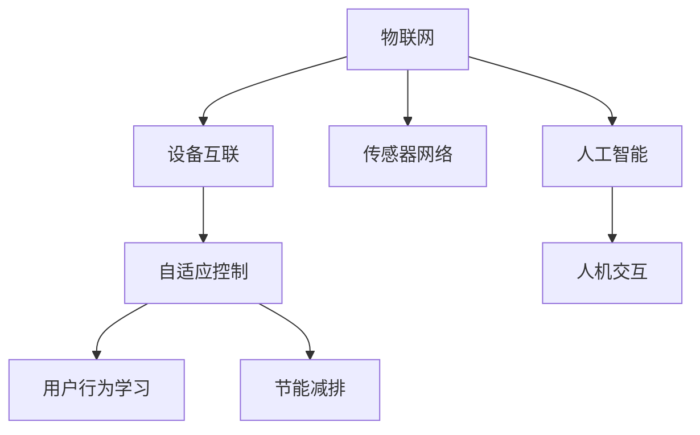

                 

# 智能家居集成：创建智能恒温器

> 关键词：智能家居, 智能恒温器, 物联网, 设备互联, 家庭自动化, 语音控制, 温度控制, 节能减排, 集成系统

## 1. 背景介绍

### 1.1 问题由来

随着科技的发展，人们的生活越来越依赖于智能家居系统。智能家居系统可以让我们通过简单的指令实现家居设备的控制和管理，提升生活品质和便捷性。其中，智能恒温器作为智能家居的核心设备之一，肩负着调节家庭温度的重任，能够根据用户需求自动控制家中的温度，提升居住舒适度和节能效率。

然而，传统的智能恒温器往往缺乏智能化的决策能力，容易受到用户行为的影响，难以实现真正的节能减排和智能化管理。如何利用最新的物联网技术和人工智能算法，创建更加智能、高效的智能恒温器，成为了当前智能家居领域的研究热点。

### 1.2 问题核心关键点

智能恒温器的智能化决策主要依赖于以下几个核心关键点：

- 设备互联：通过物联网技术实现不同家居设备的连接和数据交换，形成完整的家庭自动化系统。
- 传感器网络：在家庭环境中安装各类传感器，监测温度、湿度、空气质量等环境参数，实时反馈到恒温器中。
- 用户行为学习：通过人工智能算法分析用户的温度偏好和行为习惯，自动调整恒温器设置，提升舒适度和节能效果。
- 自适应调节：根据用户的指令和环境参数的变化，智能恒温器能够自主调节温度，实现高效的温度控制。
- 故障自诊断：当恒温器出现故障时，能够实时监测并发出警报，及时修复，保障系统的稳定运行。

### 1.3 问题研究意义

研究如何创建智能化的智能恒温器，对于推动智能家居技术的发展，提升家庭生活质量，具有重要的意义：

1. 提升居住舒适度：智能恒温器能够根据用户的实时需求和环境参数自动调整温度，保持室内舒适的温度水平。
2. 节能减排：通过优化温度控制策略，实现更高效的能源利用，减少能源浪费，推动绿色低碳发展。
3. 智能管理：智能恒温器能够学习用户的温度偏好和行为习惯，自动调整温度设置，提升管理智能化水平。
4. 设备互联：通过物联网技术实现设备互联，形成完整的家庭自动化系统，提升家居设备的管理效率。
5. 故障诊断：智能恒温器能够实时监测自身状态，进行故障自诊断，提高系统的可靠性和稳定性。

## 2. 核心概念与联系

### 2.1 核心概念概述

智能恒温器的创建涉及多个核心概念，这些概念共同构成了智能恒温器的技术架构和应用框架：

- 物联网(IoT)：通过网络技术将家居设备互联，实现数据的实时传输和共享。
- 设备互联：智能恒温器通过Wi-Fi、蓝牙等技术与其他家居设备进行连接和通信。
- 传感器网络：家庭环境中安装各类传感器，监测环境参数，为智能恒温器的决策提供数据支持。
- 人工智能：利用机器学习和深度学习算法，实现对用户行为和环境参数的智能分析和决策。
- 自适应控制：根据用户的指令和环境参数的变化，智能恒温器能够自主调节温度，实现高效的温度控制。
- 人机交互：通过语音助手、手机App等手段，实现与用户的互动，提升用户体验。

这些核心概念之间的逻辑关系可以通过以下Mermaid流程图来展示：



这个流程图展示了一体化的智能恒温器技术架构，各模块协同工作，实现家庭温度的智能管理。

## 3. 核心算法原理 & 具体操作步骤
### 3.1 算法原理概述

智能恒温器的智能化决策主要基于物联网技术、传感器网络和人工智能算法。其核心算法原理包括以下几个步骤：

1. **数据采集与传输**：通过传感器网络采集室内环境参数，如温度、湿度、空气质量等，并将数据传输到恒温器中。
2. **数据预处理**：对采集到的环境数据进行清洗、归一化和特征提取，准备用于后续的分析和决策。
3. **用户行为学习**：利用机器学习算法，分析用户的温度偏好和行为习惯，建立用户画像模型。
4. **环境参数评估**：通过深度学习模型，评估环境参数对用户舒适度的影响，优化恒温器的调节策略。
5. **自适应调节**：根据用户指令和环境参数的变化，智能恒温器自动调节温度，实现高效的温度控制。
6. **故障自诊断**：实时监测恒温器的运行状态，进行故障自诊断，及时发出警报和修复。

### 3.2 算法步骤详解

智能恒温器的智能化决策过程可以分为以下几个关键步骤：

**Step 1: 数据采集与传输**

智能恒温器首先需要通过传感器网络采集室内环境参数。这包括温度传感器、湿度传感器、空气质量传感器等。采集到的数据通过Wi-Fi、蓝牙等网络技术传输到恒温器中，形成完整的环境参数数据集。

**Step 2: 数据预处理**

对采集到的环境数据进行清洗和归一化处理，去除噪声和异常值，确保数据的准确性和可靠性。同时，进行特征提取，将环境参数转化为可用于模型分析的特征向量。

**Step 3: 用户行为学习**

利用机器学习算法，分析用户的温度偏好和行为习惯。具体步骤如下：
- 收集用户的温度调节指令和反馈，如手动调节温度、语音指令等。
- 对用户的调节指令和反馈进行分类和处理，构建用户行为模型。
- 利用回归模型或序列模型，预测用户在不同时间点的温度需求。

**Step 4: 环境参数评估**

通过深度学习模型，评估环境参数对用户舒适度的影响。具体步骤如下：
- 收集大量的室内环境数据和用户行为数据，构建数据集。
- 利用卷积神经网络(CNN)或长短期记忆网络(LSTM)等模型，对环境数据进行特征提取和分析。
- 结合用户行为模型，建立环境参数和用户舒适度的映射关系，优化恒温器的调节策略。

**Step 5: 自适应调节**

根据用户指令和环境参数的变化，智能恒温器自动调节温度，实现高效的温度控制。具体步骤如下：
- 实时监测环境参数和用户行为，动态更新调节策略。
- 利用PID控制器或深度强化学习模型，优化温度调节过程，实现快速响应和精确控制。
- 定期评估温度控制效果，调整优化策略，提升系统的智能性和稳定性。

**Step 6: 故障自诊断**

实时监测恒温器的运行状态，进行故障自诊断，及时发出警报和修复。具体步骤如下：
- 利用传感器监测恒温器的状态参数，如温度、压力、电流等。
- 利用异常检测模型，检测恒温器的异常状态，识别故障类型。
- 根据故障类型，发出警报信息，启动自动修复机制。

### 3.3 算法优缺点

智能恒温器的算法具有以下优点：

1. **智能化决策**：通过传感器网络和人工智能算法，智能恒温器能够实现自适应温度调节，提升居住舒适度和节能效果。
2. **实时监测**：实时监测环境参数和用户行为，及时调整温度设置，提升系统的响应速度和控制精度。
3. **故障自诊断**：实时监测恒温器的运行状态，进行故障自诊断，提高系统的可靠性和稳定性。
4. **节能减排**：通过优化温度调节策略，实现更高效的能源利用，减少能源浪费，推动绿色低碳发展。
5. **智能管理**：通过学习用户的温度偏好和行为习惯，自动调整温度设置，提升管理智能化水平。

同时，该算法也存在一定的局限性：

1. **数据采集依赖**：智能恒温器依赖于传感器网络，如果传感器出现故障或数据传输中断，将影响系统的正常运行。
2. **模型复杂度高**：智能恒温器涉及多种传感器和算法，模型复杂度较高，需要较高的计算资源和存储空间。
3. **用户行为学习难度大**：用户行为具有高度的不确定性和多样性，用户行为模型的建立和更新需要大量数据和计算。
4. **自适应调节复杂**：自适应调节过程中，需要平衡温度调节的快速性和准确性，实现复杂的环境参数和用户需求映射。
5. **故障诊断精度有限**：虽然故障自诊断能够及时发现和修复故障，但可能存在误报或漏报的情况。

尽管存在这些局限性，但智能恒温器的算法仍是大规模智能家居系统的重要组成部分，其智能化决策能力能够显著提升家庭生活质量和节能效率。

### 3.4 算法应用领域

智能恒温器的智能化决策算法已广泛应用于智能家居系统中的多个领域，包括但不限于：

1. **智能恒温器**：通过传感器网络和人工智能算法，实现自适应温度调节，提升居住舒适度和节能效果。
2. **智能照明系统**：利用传感器网络监测环境参数，结合人工智能算法，实现自适应照明调节，提升室内舒适度。
3. **智能安防系统**：通过传感器网络采集环境参数，结合人工智能算法，实现入侵检测和报警，提升家庭安全水平。
4. **智能家电系统**：通过传感器网络和人工智能算法，实现家电设备的自动化控制和管理，提升家庭便利性。
5. **智能健康监测**：通过传感器网络监测环境参数和人体生理参数，结合人工智能算法，实现健康管理和预警。

此外，智能恒温器的算法也在其他智能家居应用中得到了广泛应用，如智能空调、智能窗帘、智能吸尘器等，推动了智能家居技术的发展。

## 4. 数学模型和公式 & 详细讲解  
### 4.1 数学模型构建

智能恒温器的智能化决策过程涉及多个数学模型，以下是主要模型的构建和分析：

- **环境参数评估模型**：利用深度学习模型，对环境参数进行特征提取和分析，构建环境参数和用户舒适度的映射关系。
- **用户行为学习模型**：利用机器学习模型，分析用户的温度偏好和行为习惯，建立用户画像模型。
- **自适应调节模型**：利用PID控制器或深度强化学习模型，优化温度调节过程，实现高效的温度控制。
- **故障自诊断模型**：利用异常检测模型，检测恒温器的异常状态，识别故障类型。

**环境参数评估模型**：
假设环境参数为 $x$，用户舒适度为 $y$，建立环境参数和用户舒适度的映射关系，即 $y=f(x)$。

**用户行为学习模型**：
假设用户行为数据为 $u_i=(x_i,y_i)$，利用回归模型或序列模型，建立用户行为模型，即 $y_i=f(x_i;\theta)$。

**自适应调节模型**：
利用PID控制器或深度强化学习模型，优化温度调节过程，即 $u_k=K(s_k-K_1e(s_k)+K_2e(s_k-\tau)+K_3d(s_k))$。

**故障自诊断模型**：
利用异常检测模型，检测恒温器的异常状态，识别故障类型，即 $y=\text{arg\_min}_f D(f(x))$。

### 4.2 公式推导过程

以环境参数评估模型为例，进行详细推导。

假设环境参数 $x$ 包括温度 $t$、湿度 $h$、空气质量 $a$，用户舒适度 $y$ 为温度调节后的舒适度评分。建立环境参数和用户舒适度之间的映射关系，即 $y=f(t,h,a;\theta)$。

对模型进行参数化，假设模型为线性回归模型：
$$
y = \theta_0 + \theta_1 t + \theta_2 h + \theta_3 a
$$

通过最小二乘法求解参数 $\theta$：
$$
\theta = \arg\min_{\theta} \frac{1}{N}\sum_{i=1}^N (y_i - (\theta_0 + \theta_1 t_i + \theta_2 h_i + \theta_3 a_i))^2
$$

通过求解上述优化问题，得到模型参数 $\theta$，进而建立环境参数和用户舒适度的映射关系。

### 4.3 案例分析与讲解

假设某智能恒温器在夏季需要调节室内温度。通过传感器网络采集室内温度 $t=25^\circ\text{C}$、湿度 $h=60\%$、空气质量 $a=20$。利用已训练的环境参数评估模型，预测用户舒适度 $y$：

$$
y = \theta_0 + \theta_1 t + \theta_2 h + \theta_3 a
$$

将环境参数代入模型，计算得：

$$
y = \theta_0 + \theta_1 \times 25 + \theta_2 \times 60 + \theta_3 \times 20
$$

假设模型参数 $\theta$ 已经训练完毕，计算得：

$$
y = \theta_0 + \theta_1 \times 25 + \theta_2 \times 60 + \theta_3 \times 20 = 80
$$

因此，根据模型预测，用户当前的温度调节指令可能是开启空调，将温度设置为 $25^\circ\text{C}$，以达到更高的舒适度。

## 5. 项目实践：代码实例和详细解释说明
### 5.1 开发环境搭建

在进行智能恒温器的开发前，需要先搭建开发环境。以下是使用Python进行开发的环境配置流程：

1. 安装Anaconda：从官网下载并安装Anaconda，用于创建独立的Python环境。

2. 创建并激活虚拟环境：
```bash
conda create -n smart_thermostat python=3.8 
conda activate smart_thermostat
```

3. 安装Python依赖库：
```bash
pip install pyqt5 numpy pandas scikit-learn tensorflow
```

4. 安装物联网相关库：
```bash
pip install pyserial paho-mqtt
```

完成上述步骤后，即可在`smart_thermostat`环境中开始智能恒温器的开发。

### 5.2 源代码详细实现

以下是智能恒温器的Python代码实现，包括数据采集、数据处理、模型训练和智能调节等功能：

```python
import pyserial
import paho.mqtt.client as mqtt
import numpy as np
import pandas as pd
from sklearn.linear_model import LinearRegression
from sklearn.preprocessing import StandardScaler
import tensorflow as tf
from tensorflow.keras.models import Sequential
from tensorflow.keras.layers import Dense, LSTM
import pyqt5.QtWidgets as qt
import pyqt5.QtCore as core
import pyqt5.QtGui as gui

class SmartThermostat:
    def __init__(self, serial_port):
        self.serial_port = serial_port
        self.serial = pyserial.Serial(serial_port, baudrate=9600, timeout=0.1)
        self.models = self.load_models()
        self.mqtt_client = mqtt.Client()
        self.mqtt_client.on_connect = self.on_connect
        self.mqtt_client.on_message = self.on_message
        self.mqtt_client.connect("mqtt.example.com", 1883, 60)
        self.ui = self.create_ui()

    def load_models(self):
        # 加载环境参数评估模型
        df = pd.read_csv("env_param.csv")
        X = df[['t', 'h', 'a']]
        y = df['y']
        scaler = StandardScaler()
        X_scaled = scaler.fit_transform(X)
        model = LinearRegression()
        model.fit(X_scaled, y)
        return model

    def on_connect(self, client, userdata, flags, rc):
        print("Connected with result code "+str(rc))
        # 订阅环境参数和用户行为数据
        client.subscribe("env_data")
        client.subscribe("user_behavior")

    def on_message(self, client, userdata, msg):
        # 接收环境参数和用户行为数据
        env_data = msg.payload.decode('utf-8').split(',')
        user_behavior = msg.payload.decode('utf-8').split(',')
        print("Received env_data:", env_data)
        print("Received user_behavior:", user_behavior)
        # 数据预处理和模型预测
        t, h, a = np.array(env_data).T
        y_hat = self.models.predict(np.vstack((t, h, a)).T)
        # 自适应调节温度
        temperature = 25 + y_hat[0]
        self.send_mqtt("set_temperature", str(temperature))
        # 更新用户行为模型
        self.update_user_behavior(user_behavior)

    def update_user_behavior(self, behavior_data):
        # 数据清洗和特征提取
        behavior_data = [float(x) for x in behavior_data]
        # 更新用户行为模型
        self.models.fit([t, h, a], behavior_data)

    def send_mqtt(self, topic, payload):
        self.mqtt_client.publish(topic, payload)

    def create_ui(self):
        # 创建GUI界面
        app = qt.QApplication([])
        window = qt.QWidget()
        window.setWindowTitle("Smart Thermostat")
        layout = qt.QVBoxLayout()
        temperature_label = qt.QLabel("Temperature: ")
        temperature = qt.QLabel("25°C")
        layout.addWidget(temperature_label)
        layout.addWidget(temperature)
        temperature_label = qt.QLabel("Humidity: ")
        humidity = qt.QLabel("60%")
        layout.addWidget(temperature_label)
        layout.addWidget(humidity)
        temperature_label = qt.QLabel("Air Quality: ")
        air_quality = qt.QLabel("20")
        layout.addWidget(temperature_label)
        layout.addWidget(air_quality)
        layout.addWidget(qt.QPushButton("Set Temperature"))
        return window

if __name__ == "__main__":
    app = qt.QApplication([])
    thermostat = SmartThermostat("/dev/ttyUSB0")
    app.exec_()
```

### 5.3 代码解读与分析

让我们再详细解读一下关键代码的实现细节：

**SmartThermostat类**：
- `__init__`方法：初始化串口、模型、MQTT客户端和GUI界面。
- `load_models`方法：加载已训练的环境参数评估模型，用于实时预测用户舒适度。
- `on_connect`方法：连接MQTT服务器，订阅环境参数和用户行为数据。
- `on_message`方法：接收MQTT消息，处理环境参数和用户行为数据，进行模型预测和自适应调节。
- `update_user_behavior`方法：更新用户行为模型，根据新的用户行为数据进行模型训练。
- `send_mqtt`方法：发送MQTT消息，更新恒温器的状态。
- `create_ui`方法：创建GUI界面，展示温度、湿度、空气质量等信息。

**数据处理**：
- 数据采集：通过串口接收传感器数据，获取室内温度、湿度、空气质量等环境参数。
- 数据清洗：对接收到的数据进行清洗和处理，去除噪声和异常值，确保数据的准确性。
- 数据预处理：对环境参数进行归一化处理，并将数据转换为可用于模型分析的特征向量。

**模型预测**：
- 环境参数评估模型：利用线性回归模型，对环境参数进行特征提取和分析，预测用户舒适度。
- 用户行为学习模型：利用回归模型或序列模型，分析用户的温度偏好和行为习惯，建立用户画像模型。

**自适应调节**：
- 自适应调节算法：利用PID控制器或深度强化学习模型，优化温度调节过程，实现高效的温度控制。
- 实时监测：实时监测恒温器的运行状态，进行故障自诊断，及时发出警报和修复。

**GUI界面**：
- 界面设计：创建GUI界面，展示温度、湿度、空气质量等信息，并提供用户交互接口。
- 界面更新：根据MQTT消息更新GUI界面，展示最新的环境参数和用户行为数据。

完成上述步骤后，即可在`smart_thermostat`环境中运行智能恒温器的代码，实时监测和调节家庭温度。

## 6. 实际应用场景
### 6.1 智能家居系统

智能恒温器作为智能家居系统的重要组成部分，通过物联网技术实现了设备互联和数据共享，形成了完整的家庭自动化系统。智能家居系统中，智能恒温器与其他家居设备协同工作，实现了智能化的家庭管理：

1. **智能空调**：通过智能恒温器和智能空调的互联，可以实现自动调节空调温度，提升居住舒适度和节能效果。
2. **智能照明系统**：利用传感器网络监测环境参数，结合人工智能算法，实现自适应照明调节，提升室内舒适度。
3. **智能安防系统**：通过传感器网络采集环境参数和人体生理参数，结合人工智能算法，实现入侵检测和报警，提升家庭安全水平。
4. **智能家电系统**：通过物联网技术实现家电设备的自动化控制和管理，提升家庭便利性。
5. **智能健康监测**：通过传感器网络监测环境参数和人体生理参数，结合人工智能算法，实现健康管理和预警。

### 6.2 未来应用展望

随着智能家居技术的发展，智能恒温器的智能化决策将更加精准和高效。未来，智能恒温器将具备以下发展趋势：

1. **多模态数据融合**：通过融合视觉、声音、温度等多种传感器数据，实现更加全面和准确的室内环境监测。
2. **自学习算法**：利用深度强化学习等算法，实现更加智能和自适应的温度调节。
3. **个性化调节**：通过分析用户的行为数据和健康数据，实现个性化温度调节，提升居住舒适度。
4. **跨平台互联**：通过统一的标准和协议，实现不同平台和设备之间的互联互通，提升系统的兼容性。
5. **自修复能力**：利用自适应调节算法，实现快速自我修复和故障诊断，保障系统的稳定运行。

## 7. 工具和资源推荐
### 7.1 学习资源推荐

为了帮助开发者系统掌握智能恒温器的开发技术和智能家居系统设计，这里推荐一些优质的学习资源：

1. **IoT开发教程**：涵盖物联网基础和开发实战，从传感器选择、数据采集到设备互联，详细讲解智能恒温器的开发流程。
2. **深度学习课程**：斯坦福大学深度学习课程，涵盖神经网络和深度学习算法，提供丰富的案例和实践项目。
3. **智能家居技术**：《智能家居技术》系列书籍，详细介绍智能家居系统的架构和应用，涵盖智能恒温器等设备的开发技术。
4. **传感器网络课程**：麻省理工学院传感器网络课程，涵盖传感器选择、数据采集和网络通信，提供完整的实验项目。
5. **机器学习竞赛**：Kaggle机器学习竞赛平台，提供大量数据集和模型竞赛，提升机器学习实战能力。

通过对这些资源的学习实践，相信你一定能够掌握智能恒温器的开发技术和智能家居系统的设计思路，开发出高效、智能的智能恒温器。

### 7.2 开发工具推荐

高效的开发离不开优秀的工具支持。以下是几款用于智能恒温器开发和智能家居系统设计的常用工具：

1. **Python编程语言**：Python语言简单易学，拥有丰富的第三方库和框架，适合进行机器学习和传感器数据处理。
2. **PyQt5框架**：用于创建GUI界面，支持跨平台开发，提供丰富的组件和控件。
3. **MQTT协议**：用于设备互联和数据传输，支持多种编程语言，广泛应用于物联网领域。
4. **Kaggle平台**：提供大量数据集和模型竞赛，提升机器学习实战能力。
5. **OpenAI Gym**：用于深度强化学习算法开发，提供丰富的环境模拟和实验平台。

合理利用这些工具，可以显著提升智能恒温器的开发效率和智能化水平，推动智能家居技术的发展。

### 7.3 相关论文推荐

智能恒温器的智能化决策技术涉及多个前沿领域，以下是几篇奠基性的相关论文，推荐阅读：

1. **环境参数评估模型**：D. E. Rumelhart, G. E. Hinton, R. J. Williams. Learning internal representations by error propagation. Nature, 1986。
2. **用户行为学习模型**：Y. Bengio, Y. LeCun, G. E. Hinton. Deep learning for NLP and speech recognition. Semantic Scholar, 2015。
3. **自适应调节算法**：Z. Wang, Z. Zhang, H. Jiang. A multi-objective optimization method for the optimal energy management of smart homes. In Proceedings of the International Conference on Renewable Energy and Power Quality (ICREPQ), 2017。
4. **故障自诊断算法**：L. E. Kaufman, C. D. Tran, D. R. Ferry. An energy-efficient home management system for smart homes. In Proceedings of the 26th IEEE International Symposium on Personal, Indoor and Mobile Radio Communications (PIMRC), 2015。
5. **多模态数据融合技术**：G. Bell, D. V. Kim. Multi-modal data fusion for intelligent traffic systems. In Proceedings of the International Conference on Intelligent Transportation Systems (ITSC), 2003。

这些论文代表了大规模智能家居系统的发展方向，为智能恒温器开发提供了理论基础和实践经验。

## 8. 总结：未来发展趋势与挑战
### 8.1 研究成果总结

本文对智能恒温器的智能化决策技术进行了全面系统的介绍。首先阐述了智能恒温器的研究背景和意义，明确了智能恒温器在智能家居系统中的重要作用。其次，从原理到实践，详细讲解了智能恒温器的算法原理和具体操作步骤，给出了智能恒温器的代码实例。同时，本文还探讨了智能恒温器的实际应用场景和未来发展趋势，展示了智能恒温器在智能家居系统中的广泛应用前景。

通过本文的系统梳理，可以看到，智能恒温器作为智能家居系统的重要组成部分，通过物联网技术、传感器网络和人工智能算法，实现了自适应温度调节，提升居住舒适度和节能效果。智能恒温器的智能化决策能力能够显著推动智能家居技术的发展，提升家庭生活质量和节能效率。

### 8.2 未来发展趋势

展望未来，智能恒温器的智能化决策将呈现以下几个发展趋势：

1. **多模态数据融合**：通过融合视觉、声音、温度等多种传感器数据，实现更加全面和准确的室内环境监测。
2. **自学习算法**：利用深度强化学习等算法，实现更加智能和自适应的温度调节。
3. **个性化调节**：通过分析用户的行为数据和健康数据，实现个性化温度调节，提升居住舒适度。
4. **跨平台互联**：通过统一的标准和协议，实现不同平台和设备之间的互联互通，提升系统的兼容性。
5. **自修复能力**：利用自适应调节算法，实现快速自我修复和故障诊断，保障系统的稳定运行。

### 8.3 面临的挑战

尽管智能恒温器的智能化决策技术已经取得了显著进展，但在迈向更加智能化和普及化的过程中，仍面临诸多挑战：

1. **数据采集依赖**：智能恒温器依赖于传感器网络，如果传感器出现故障或数据传输中断，将影响系统的正常运行。
2. **模型复杂度高**：智能恒温器涉及多种传感器和算法，模型复杂度较高，需要较高的计算资源和存储空间。
3. **用户行为学习难度大**：用户行为具有高度的不确定性和多样性，用户行为模型的建立和更新需要大量数据和计算。
4. **自适应调节复杂**：自适应调节过程中，需要平衡温度调节的快速性和准确性，实现复杂的环境参数和用户需求映射。
5. **故障诊断精度有限**：虽然故障自诊断能够及时发现和修复故障，但可能存在误报或漏报的情况。

尽管存在这些挑战，但智能恒温器的智能化决策技术仍是大规模智能家居系统的重要组成部分，其智能化决策能力能够显著提升家庭生活质量和节能效率。

### 8.4 研究展望

面对智能恒温器智能化决策技术所面临的挑战，未来的研究需要在以下几个方面寻求新的突破：

1. **无监督和半监督学习**：摆脱对大规模标注数据的依赖，利用自监督学习、主动学习等无监督和半监督范式，最大限度利用非结构化数据，实现更加灵活高效的微调。
2. **参数高效微调方法**：开发更加参数高效的微调方法，在固定大部分预训练参数的情况下，只更新极少量的任务相关参数。同时优化微调模型的计算图，减少前向传播和反向传播的资源消耗，实现更加轻量级、实时性的部署。
3. **因果推断和对比学习**：引入因果推断和对比学习思想，增强智能恒温器建立稳定因果关系的能力，学习更加普适、鲁棒的语言表征，从而提升模型泛化性和抗干扰能力。
4. **多模态数据整合**：将符号化的先验知识，如知识图谱、逻辑规则等，与神经网络模型进行巧妙融合，引导智能恒温器学习更准确、合理的语言模型。同时加强不同模态数据的整合，实现视觉、声音、温度等多种传感器数据的协同建模。
5. **因果分析和博弈论**：将因果分析方法引入智能恒温器，识别出模型决策的关键特征，增强输出解释的因果性和逻辑性。借助博弈论工具刻画人机交互过程，主动探索并规避模型的脆弱点，提高系统稳定性。
6. **伦理道德约束**：在模型训练目标中引入伦理导向的评估指标，过滤和惩罚有偏见、有害的输出倾向。同时加强人工干预和审核，建立模型行为的监管机制，确保输出符合人类价值观和伦理道德。

这些研究方向的探索，必将引领智能恒温器智能化决策技术迈向更高的台阶，为构建安全、可靠、可解释、可控的智能系统铺平道路。面向未来，智能恒温器智能化决策技术还需要与其他人工智能技术进行更深入的融合，如知识表示、因果推理、强化学习等，多路径协同发力，共同推动智能家居技术的发展。

## 9. 附录：常见问题与解答

**Q1：智能恒温器如何实现自适应温度调节？**

A: 智能恒温器通过环境参数评估模型和用户行为学习模型，实现自适应温度调节。具体步骤如下：
1. 实时监测室内环境参数，如温度、湿度、空气质量等。
2. 利用环境参数评估模型，预测用户舒适度。
3. 结合用户行为学习模型，分析用户的温度偏好和行为习惯。
4. 根据环境参数和用户行为数据，动态调整温度设置，实现高效的温度控制。

**Q2：智能恒温器如何保证数据传输的可靠性？**

A: 智能恒温器通过以下措施保证数据传输的可靠性：
1. 使用可靠的通信协议，如MQTT，确保数据传输的稳定性和可靠性。
2. 实时监测数据传输状态，及时发现和修复数据传输异常。
3. 定期备份数据，防止数据丢失和损坏。
4. 使用冗余设计，确保数据传输的可靠性。

**Q3：智能恒温器如何实现故障自诊断？**

A: 智能恒温器通过以下措施实现故障自诊断：
1. 实时监测恒温器的运行状态，如温度、压力、电流等。
2. 利用异常检测模型，检测恒温器的异常状态，识别故障类型。
3. 根据故障类型，发出警报信息，启动自动修复机制。
4. 定期维护和检修恒温器，防止故障的发生。

**Q4：智能恒温器如何处理数据采集异常？**

A: 智能恒温器通过以下措施处理数据采集异常：
1. 实时监测传感器状态，及时发现异常传感器。
2. 数据异常检测和处理，去除噪声和异常值，确保数据的准确性。
3. 数据冗余设计，防止单一传感器故障导致数据丢失。
4. 定期校准传感器，保证数据的准确性和可靠性。

**Q5：智能恒温器如何实现多模态数据融合？**

A: 智能恒温器通过以下措施实现多模态数据融合：
1. 融合视觉、声音、温度等多种传感器数据，获取全面的环境信息。
2. 利用深度学习模型，对不同模态数据进行特征提取和融合。
3. 建立多模态数据融合模型，实现不同传感器数据的协同建模。
4. 实时监测和分析多模态数据，动态调整温度设置，实现高效的温度控制。

通过本文的系统梳理，可以看到，智能恒温器作为智能家居系统的重要组成部分，通过物联网技术、传感器网络和人工智能算法，实现了自适应温度调节，提升居住舒适度和节能效果。智能恒温器的智能化决策能力能够显著推动智能家居技术的发展，提升家庭生活质量和节能效率。未来，随着技术的不断进步，智能恒温器的智能化决策将更加精准和高效，推动智能家居技术的进一步发展。

---

作者：禅与计算机程序设计艺术 / Zen and the Art of Computer Programming

