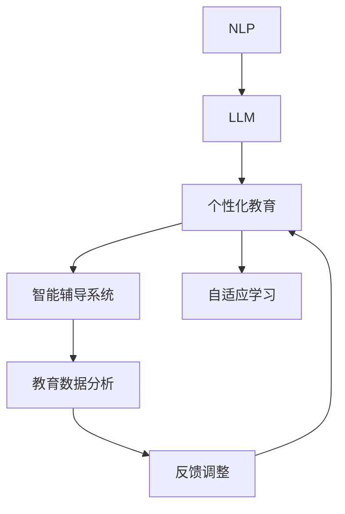

                 

# 智能家教：LLM作为个性化教育助手的前景

> 关键词：
> - 自然语言处理(NLP)
> - 大语言模型(LLM)
> - 个性化教育
> - 智能辅导系统
> - 学生反馈分析
> - 自适应学习
> - 教育数据分析

## 1. 背景介绍

### 1.1 问题由来

在数字化、信息化时代，教育资源和教学方式发生了巨大的变化。传统的教学模式已经无法满足个性化学习的需求，尤其在教育资源匮乏的地区，教育不均衡问题更为突出。同时，在线教育平台的兴起，也为个性化学习提供了新的机遇。然而，尽管在线教育平台为学生提供了丰富的学习资源，但由于师资力量不足和课程内容固定，难以真正实现个性化教学。

大语言模型（LLM）作为当前NLP领域的重要研究热点，近年来在多个领域展示了强大的能力，尤其是在自然语言理解和生成方面。其在教育领域的应用，有望成为一种智能化的个性化教育助手，为学生提供更加精准、灵活的学习体验。

### 1.2 问题核心关键点

在教育领域，LLM可以应用在多个方面，如智能答疑、个性化推荐、自适应学习等。通过掌握学生的学习情况和反馈信息，LLM可以提供个性化的教育辅导，促进学生更好地掌握知识。具体来说，LLM在教育领域的应用可以分为以下几个关键点：

- 个性化学习路径规划：基于学生的学习历史和测试结果，LLM可以推荐最适合的课程和练习。
- 智能答疑和辅导：LLM能够即时回答学生的疑问，提供详细的解题步骤和解释。
- 学生反馈分析：LLM可以分析学生的学习情况和反馈，动态调整教学策略，以提高学习效果。
- 自适应学习系统：LLM可以构建基于机器学习的自适应学习系统，自动调整学习难度和进度。

### 1.3 问题研究意义

在教育领域应用LLM，可以极大地提升教育资源的质量和效率，推动教育公平，促进个性化学习。具体来说：

1. **提高教育资源利用效率**：通过智能化的教育助手，可以大幅提升教育资源的使用效率，尤其是在师资力量匮乏的地区，可以弥补人力不足的问题。
2. **促进教育公平**：在线教育平台和LLM可以打破地域和资源限制，让更多学生享受到优质教育资源。
3. **推动个性化学习**：基于LLM的自适应学习系统，可以针对每个学生制定个性化的学习计划，更好地满足学生的学习需求。
4. **增强学习效果**：LLM能够实时反馈学生的学习情况，动态调整教学策略，提高学习效果。
5. **激发学生兴趣**：个性化的学习内容和互动方式，可以提升学生的学习兴趣和参与度。

## 2. 核心概念与联系

### 2.1 核心概念概述

为更好地理解LLM在教育领域的应用，本节将介绍几个密切相关的核心概念：

- 自然语言处理(NLP)：涉及计算机如何理解和生成自然语言，包括语言模型、文本分类、命名实体识别、语义分析等。
- 大语言模型(LLM)：以Transformer结构为基础的深度学习模型，通过大规模无监督预训练学习通用语言表示，具备强大的语言理解和生成能力。
- 个性化教育：基于每个学生的特点和需求，提供量身定制的学习计划和内容。
- 智能辅导系统：利用AI技术，自动回答学生的问题，提供学习建议和反馈。
- 自适应学习：基于学生的学习情况，动态调整学习内容和方法。
- 教育数据分析：收集和分析教育数据，以评估教学效果，优化教育资源配置。

这些核心概念之间的逻辑关系可以通过以下Mermaid流程图来展示：



这个流程图展示了NLP和LLM在教育领域的应用链条，以及它们与其他概念的联系。

## 3. 核心算法原理 & 具体操作步骤
### 3.1 算法原理概述

基于LLM的个性化教育助手，其核心算法原理主要分为以下几个步骤：

1. **预训练**：在大量无标签文本数据上，使用自监督学习任务训练预训练模型。
2. **微调**：在标注数据上，使用监督学习任务对预训练模型进行微调，以适应特定教育任务。
3. **知识抽取**：从微调后的模型中抽取有用的知识，构建教学库和推荐系统。
4. **反馈分析**：收集学生反馈和互动数据，对教学策略和内容进行调整。
5. **自适应学习**：根据学生的学习情况和反馈，动态调整学习路径和难度。

### 3.2 算法步骤详解

#### 步骤1：预训练

预训练阶段，使用大规模无标签文本数据，如维基百科、新闻、小说等，对LLM进行预训练。预训练任务可以包括语言建模、掩码语言模型、下一句预测等，以学习通用语言表示。

#### 步骤2：微调

微调阶段，使用教育领域的数据集，如课程、习题、评测等，对预训练模型进行有监督学习任务训练，以适应教育任务。例如，可以使用监督分类任务训练LLM，使其能够回答学生的具体问题，或对答案进行评分。

#### 步骤3：知识抽取

从微调后的模型中，抽取有用的知识，构建教育库和推荐系统。例如，可以抽取常见问题的答案、术语解释、习题解析等，构建知识库。同时，可以使用LLM进行自然语言推理，生成习题解答、学习笔记等，丰富教学资源。

#### 步骤4：反馈分析

收集学生的反馈和互动数据，如答题情况、学习进度、课堂互动等，对教学策略和内容进行调整。例如，可以使用自然语言处理技术，分析学生的答题错误，发现知识点的薄弱环节，进行有针对性的教学。

#### 步骤5：自适应学习

根据学生的学习情况和反馈，动态调整学习路径和难度。例如，可以设计基于机器学习的自适应学习系统，根据学生的学习进度和答题情况，调整学习内容和难度，提高学习效果。

### 3.3 算法优缺点

基于LLM的个性化教育助手，具有以下优点：

1. **高效性**：利用预训练和微调的强大能力，可以大幅提升教育资源的使用效率。
2. **个性化**：能够根据学生的特点和需求，提供个性化的教学内容和建议。
3. **灵活性**：可以动态调整教学策略和内容，适应学生的学习情况变化。
4. **自适应**：通过自适应学习系统，能够提高学习效果，降低学习成本。

然而，该方法也存在一些局限性：

1. **数据依赖**：预训练和微调的效果很大程度上取决于数据的质量和数量，数据收集和处理成本较高。
2. **模型复杂性**：LLM模型参数量大，训练和推理资源消耗较大。
3. **过拟合风险**：在标注数据较少的情况下，模型容易出现过拟合。
4. **可解释性**：LLM作为黑盒模型，缺乏可解释性，难以理解其内部工作机制。

### 3.4 算法应用领域

基于LLM的个性化教育助手，在教育领域有广泛的应用场景，例如：

- 智能答疑系统：使用LLM即时回答学生的问题，提供详细解答。
- 个性化推荐系统：根据学生的学习历史和兴趣，推荐适合的课程和学习资源。
- 自适应学习系统：动态调整学习路径和难度，适应学生的学习进度。
- 评测系统：对学生的作业和考试进行自动评分，并提供反馈。
- 教育数据分析：分析学生的学习行为和反馈，优化教学策略。

## 4. 数学模型和公式 & 详细讲解  
### 4.1 数学模型构建

本节将使用数学语言对基于LLM的个性化教育助手的模型构建进行更加严格的刻画。

记LLM为 $M_{\theta}$，其中 $\theta$ 为模型参数。假设教育任务为分类任务，如判断学生是否理解某个知识点，则目标函数为交叉熵损失函数：

$$
\mathcal{L}(\theta) = -\frac{1}{N}\sum_{i=1}^N [y_i\log \hat{y}_i + (1-y_i)\log(1-\hat{y}_i)]
$$

其中，$y_i$ 为真实标签，$\hat{y}_i$ 为模型预测概率。

### 4.2 公式推导过程

对于分类任务，LLM的输出层通常为softmax函数，表示每个类别的概率分布。假设输入为 $x_i$，则输出概率为：

$$
\hat{y}_i = \text{softmax}(M_{\theta}(x_i))
$$

目标函数为交叉熵损失函数，可以表示为：

$$
\mathcal{L}(\theta) = -\frac{1}{N}\sum_{i=1}^N [y_i\log \hat{y}_i + (1-y_i)\log(1-\hat{y}_i)]
$$

### 4.3 案例分析与讲解

假设某数学题目的正确答案为 $y=1$，模型预测的概率为 $\hat{y}=\frac{1}{2}$，则该样本的损失为：

$$
\mathcal{L} = -(y\log \hat{y} + (1-y)\log(1-\hat{y})) = -\log \frac{1}{2} - \log \frac{1}{2} = \log 2
$$

通过上述公式推导，我们可以看到，目标函数衡量的是模型预测结果与真实标签之间的差异，即交叉熵损失。在训练过程中，通过反向传播算法计算梯度，不断调整模型参数 $\theta$，以最小化损失函数，从而提高模型预测的准确性。

## 5. 项目实践：代码实例和详细解释说明
### 5.1 开发环境搭建

在进行LLM微调实践前，我们需要准备好开发环境。以下是使用Python进行PyTorch开发的环境配置流程：

1. 安装Anaconda：从官网下载并安装Anaconda，用于创建独立的Python环境。

2. 创建并激活虚拟环境：
```bash
conda create -n llm-env python=3.8 
conda activate llm-env
```

3. 安装PyTorch：根据CUDA版本，从官网获取对应的安装命令。例如：
```bash
conda install pytorch torchvision torchaudio cudatoolkit=11.1 -c pytorch -c conda-forge
```

4. 安装Transformers库：
```bash
pip install transformers
```

5. 安装各类工具包：
```bash
pip install numpy pandas scikit-learn matplotlib tqdm jupyter notebook ipython
```

完成上述步骤后，即可在`llm-env`环境中开始微调实践。

### 5.2 源代码详细实现

我们以一个简单的数学题目回答为例，展示如何使用LLM进行智能答疑系统的实现。

首先，定义LLM模型和数据集：

```python
from transformers import AutoModelForQuestionAnswering, AutoTokenizer
import torch

model = AutoModelForQuestionAnswering.from_pretrained('bert-base-uncased')
tokenizer = AutoTokenizer.from_pretrained('bert-base-uncased')
```

然后，定义训练函数：

```python
def train_epoch(model, dataset, optimizer, device):
    model.train()
    total_loss = 0
    for batch in dataset:
        input_ids = batch['input_ids'].to(device)
        attention_mask = batch['attention_mask'].to(device)
        labels = batch['labels'].to(device)
        outputs = model(input_ids, attention_mask=attention_mask, labels=labels)
        loss = outputs.loss
        total_loss += loss.item()
        loss.backward()
        optimizer.step()
    return total_loss / len(dataset)
```

接下来，定义评估函数：

```python
def evaluate(model, dataset, device):
    model.eval()
    total_correct = 0
    total_eval_loss = 0
    for batch in dataset:
        input_ids = batch['input_ids'].to(device)
        attention_mask = batch['attention_mask'].to(device)
        labels = batch['labels'].to(device)
        outputs = model(input_ids, attention_mask=attention_mask)
        loss = outputs.loss
        total_eval_loss += loss.item()
        predictions = outputs.predictions.argmax(dim=1)
        total_correct += (predictions == labels).sum().item()
    acc = total_correct / len(dataset)
    print(f"Accuracy: {acc:.4f}")
    print(f"Loss: {total_eval_loss / len(dataset):.4f}")
```

最后，启动训练流程：

```python
epochs = 5
batch_size = 16
device = torch.device('cuda') if torch.cuda.is_available() else torch.device('cpu')

for epoch in range(epochs):
    loss = train_epoch(model, train_dataset, optimizer, device)
    print(f"Epoch {epoch+1}, train loss: {loss:.4f}")
    
    evaluate(model, dev_dataset, device)
    
print("Test results:")
evaluate(model, test_dataset, device)
```

以上就是使用PyTorch对BERT模型进行智能答疑系统微调的完整代码实现。可以看到，得益于Transformers库的强大封装，我们可以用相对简洁的代码完成BERT模型的加载和微调。

### 5.3 代码解读与分析

让我们再详细解读一下关键代码的实现细节：

**模型定义**：
- 使用 `AutoModelForQuestionAnswering` 从预训练模型中加载模型。
- 加载相应的分词器 `AutoTokenizer`，以便将输入文本转换为模型所需的格式。

**训练函数**：
- 定义训练循环，对每个批次数据进行前向传播和反向传播。
- 计算损失函数，并更新模型参数。
- 返回该epoch的总损失。

**评估函数**：
- 定义评估循环，对每个批次数据进行前向传播，计算损失函数。
- 记录预测结果和标签的准确率。
- 输出评估结果。

**训练流程**：
- 定义总的epoch数和batch size。
- 在训练集上进行训练，输出每个epoch的平均损失。
- 在验证集上进行评估，输出准确率和损失。
- 在测试集上进行测试，输出最终评估结果。

可以看到，PyTorch配合Transformers库使得BERT微调的代码实现变得简洁高效。开发者可以将更多精力放在数据处理、模型改进等高层逻辑上，而不必过多关注底层的实现细节。

当然，工业级的系统实现还需考虑更多因素，如模型的保存和部署、超参数的自动搜索、更灵活的任务适配层等。但核心的微调范式基本与此类似。

## 6. 实际应用场景
### 6.1 智能答疑系统

基于LLM的智能答疑系统，可以广泛应用于在线教育平台、智能客服系统、学术辅导等场景，帮助用户快速解决疑问，提升学习效率。

在技术实现上，可以收集大量与教育相关的问答数据，将问题-答案对作为微调数据，训练模型学习匹配答案。微调后的模型能够自动理解用户的问题，匹配最合适的答案模板进行回复。对于用户提出的新问题，还可以接入检索系统实时搜索相关内容，动态组织生成回答。如此构建的智能答疑系统，能大幅提升用户咨询体验和问题解决效率。

### 6.2 个性化推荐系统

当前的推荐系统往往只依赖用户的历史行为数据进行物品推荐，无法深入理解用户的真实兴趣偏好。基于LLM的个性化推荐系统，可以更好地挖掘用户行为背后的语义信息，从而提供更精准、多样的推荐内容。

在实践中，可以收集用户浏览、点击、评论、分享等行为数据，提取和用户交互的物品标题、描述、标签等文本内容。将文本内容作为模型输入，用户的后续行为（如是否点击、购买等）作为监督信号，在此基础上微调预训练语言模型。微调后的模型能够从文本内容中准确把握用户的兴趣点。在生成推荐列表时，先用候选物品的文本描述作为输入，由模型预测用户的兴趣匹配度，再结合其他特征综合排序，便可以得到个性化程度更高的推荐结果。

### 6.3 自适应学习系统

基于LLM的自适应学习系统，可以动态调整学习路径和难度，适应学生的学习进度和需求。

在具体实现上，可以设计基于机器学习的自适应学习系统，根据学生的学习历史和反馈，动态调整学习内容和难度。例如，可以使用BERT模型对学生的作业进行自动评分，并分析错误点，提供针对性的辅导和练习。同时，可以使用LLM生成个性化的学习计划和推荐资源，帮助学生高效学习。

### 6.4 未来应用展望

随着LLM和微调方法的不断发展，基于LLM的个性化教育助手将在更多领域得到应用，为教育公平和个性化学习带来新的可能性。

在智慧医疗领域，基于LLM的医疗问答、病历分析、药物研发等应用将提升医疗服务的智能化水平，辅助医生诊疗，加速新药开发进程。

在智能教育领域，LLM可以应用于作业批改、学情分析、知识推荐等方面，因材施教，促进教育公平，提高教学质量。

在智慧城市治理中，LLM可以应用于城市事件监测、舆情分析、应急指挥等环节，提高城市管理的自动化和智能化水平，构建更安全、高效的未来城市。

此外，在企业生产、社会治理、文娱传媒等众多领域，基于LLM的个性化教育助手也将不断涌现，为各行各业带来变革性影响。相信随着技术的日益成熟，LLM将为人工智能技术在垂直行业的规模化落地提供新的思路。

## 7. 工具和资源推荐
### 7.1 学习资源推荐

为了帮助开发者系统掌握LLM在教育领域的应用，这里推荐一些优质的学习资源：

1. 《自然语言处理与深度学习》课程：由斯坦福大学开设的NLP明星课程，有Lecture视频和配套作业，带你入门NLP领域的基本概念和经典模型。

2. 《深度学习与NLP》书籍：涵盖深度学习在NLP中的应用，包括BERT模型和LLM的详细介绍，适合进阶学习。

3. 《Transformers实战》博客系列：由大模型技术专家撰写，深入浅出地介绍了Transformer原理、LLM模型、微调技术等前沿话题。

4. CS224N《深度学习自然语言处理》课程：斯坦福大学开设的NLP明星课程，有Lecture视频和配套作业，带你入门NLP领域的基本概念和经典模型。

5. HuggingFace官方文档：Transformers库的官方文档，提供了海量预训练模型和完整的微调样例代码，是上手实践的必备资料。

通过对这些资源的学习实践，相信你一定能够快速掌握LLM在教育领域的应用，并用于解决实际的NLP问题。

### 7.2 开发工具推荐

高效的开发离不开优秀的工具支持。以下是几款用于LLM微调开发的常用工具：

1. PyTorch：基于Python的开源深度学习框架，灵活动态的计算图，适合快速迭代研究。大部分预训练语言模型都有PyTorch版本的实现。

2. TensorFlow：由Google主导开发的开源深度学习框架，生产部署方便，适合大规模工程应用。同样有丰富的预训练语言模型资源。

3. Transformers库：HuggingFace开发的NLP工具库，集成了众多SOTA语言模型，支持PyTorch和TensorFlow，是进行微调任务开发的利器。

4. Weights & Biases：模型训练的实验跟踪工具，可以记录和可视化模型训练过程中的各项指标，方便对比和调优。与主流深度学习框架无缝集成。

5. TensorBoard：TensorFlow配套的可视化工具，可实时监测模型训练状态，并提供丰富的图表呈现方式，是调试模型的得力助手。

6. Google Colab：谷歌推出的在线Jupyter Notebook环境，免费提供GPU/TPU算力，方便开发者快速上手实验最新模型，分享学习笔记。

合理利用这些工具，可以显著提升LLM微调任务的开发效率，加快创新迭代的步伐。

### 7.3 相关论文推荐

LLM和微调技术的发展源于学界的持续研究。以下是几篇奠基性的相关论文，推荐阅读：

1. Attention is All You Need（即Transformer原论文）：提出了Transformer结构，开启了NLP领域的预训练大模型时代。

2. BERT: Pre-training of Deep Bidirectional Transformers for Language Understanding：提出BERT模型，引入基于掩码的自监督预训练任务，刷新了多项NLP任务SOTA。

3. Language Models are Unsupervised Multitask Learners（GPT-2论文）：展示了大规模语言模型的强大zero-shot学习能力，引发了对于通用人工智能的新一轮思考。

4. Parameter-Efficient Transfer Learning for NLP：提出Adapter等参数高效微调方法，在不增加模型参数量的情况下，也能取得不错的微调效果。

5. Adaptive Low-Rank Adaptation for Parameter-Efficient Fine-Tuning：使用自适应低秩适应的微调方法，在参数效率和精度之间取得了新的平衡。

这些论文代表了大语言模型微调技术的发展脉络。通过学习这些前沿成果，可以帮助研究者把握学科前进方向，激发更多的创新灵感。

## 8. 总结：未来发展趋势与挑战

### 8.1 总结

本文对基于LLM的个性化教育助手进行了全面系统的介绍。首先阐述了LLM在教育领域的应用背景和意义，明确了其在个性化教育中的独特价值。其次，从原理到实践，详细讲解了LLM微调的理论基础和关键步骤，给出了微调任务开发的完整代码实例。同时，本文还广泛探讨了LLM在智能答疑、个性化推荐、自适应学习等多个教育领域的应用前景，展示了LLM的巨大潜力。

通过本文的系统梳理，可以看到，基于LLM的个性化教育助手正在成为教育领域的重要工具，极大地提升了教育资源的利用效率，推动了教育公平，促进了个性化学习。未来，伴随LLM和微调方法的不断演进，LLM必将在更多领域得到应用，为各行各业带来变革性影响。

### 8.2 未来发展趋势

展望未来，LLM在教育领域的应用将呈现以下几个发展趋势：

1. 模型规模持续增大。随着算力成本的下降和数据规模的扩张，预训练语言模型的参数量还将持续增长。超大规模语言模型蕴含的丰富语言知识，有望支撑更加复杂多变的教育任务微调。

2. 微调方法日趋多样。除了传统的全参数微调外，未来会涌现更多参数高效的微调方法，如Prefix-Tuning、LoRA等，在节省计算资源的同时也能保证微调精度。

3. 持续学习成为常态。随着教育数据分布的不断变化，LLM也需要持续学习新知识以保持性能。如何在不遗忘原有知识的同时，高效吸收新样本信息，将成为重要的研究课题。

4. 标注样本需求降低。受启发于提示学习(Prompt-based Learning)的思路，未来的微调方法将更好地利用LLM的语言理解能力，通过更加巧妙的任务描述，在更少的标注样本上也能实现理想的微调效果。

5. 知识整合能力增强。现有的LLM往往局限于文本数据，难以灵活吸收和运用更广泛的先验知识。如何让LLM更好地与外部知识库、规则库等专家知识结合，形成更加全面、准确的信息整合能力，还有很大的想象空间。

以上趋势凸显了LLM在教育领域的应用前景。这些方向的探索发展，必将进一步提升教育资源的质量和效率，推动教育公平，促进个性化学习。

### 8.3 面临的挑战

尽管LLM在教育领域的应用前景广阔，但在迈向更加智能化、普适化应用的过程中，仍面临诸多挑战：

1. 数据依赖。虽然LLM在教育领域的微调效果较好，但数据收集和标注成本较高，特别是对于特定领域的教育数据，难以获得充足的高质量标注数据，成为制约微调性能的瓶颈。

2. 模型鲁棒性不足。面对教育数据的多样性和复杂性，LLM在特定领域的泛化能力可能较弱，对于域外数据容易产生过拟合。

3. 教学效果评估困难。现有评估方法难以全面衡量LLM在教育任务中的表现，难以从多维度全面评估教学效果。

4. 知识更新的频率。教育内容不断变化，LLM需要持续更新知识库，才能保持教学内容的最新性。

5. 教师的接受度。教师需要接受并使用新的教学工具，可能会遇到一定的阻力，需要持续的培训和支持。

### 8.4 研究展望

面对LLM在教育领域面临的挑战，未来的研究需要在以下几个方面寻求新的突破：

1. 探索无监督和半监督微调方法。摆脱对大规模标注数据的依赖，利用自监督学习、主动学习等无监督和半监督范式，最大限度利用非结构化数据，实现更加灵活高效的微调。

2. 研究参数高效和计算高效的微调范式。开发更加参数高效的微调方法，在固定大部分预训练参数的同时，只更新极少量的任务相关参数。同时优化微调模型的计算图，减少前向传播和反向传播的资源消耗，实现更加轻量级、实时性的部署。

3. 引入更多先验知识。将符号化的先验知识，如知识图谱、逻辑规则等，与神经网络模型进行巧妙融合，引导微调过程学习更准确、合理的语言模型。同时加强不同模态数据的整合，实现视觉、语音等多模态信息与文本信息的协同建模。

4. 结合因果分析和博弈论工具。将因果分析方法引入微调模型，识别出模型决策的关键特征，增强输出解释的因果性和逻辑性。借助博弈论工具刻画人机交互过程，主动探索并规避模型的脆弱点，提高系统稳定性。

5. 纳入伦理道德约束。在模型训练目标中引入伦理导向的评估指标，过滤和惩罚有偏见、有害的输出倾向。同时加强人工干预和审核，建立模型行为的监管机制，确保输出符合人类价值观和伦理道德。

这些研究方向的探索，必将引领LLM在教育领域的应用走向更高的台阶，为教育公平和个性化学习提供新的思路。面向未来，LLM必将在教育领域展示更大的潜力，推动教育技术向更加智能、普适、个性化的方向发展。

## 9. 附录：常见问题与解答

**Q1：基于LLM的个性化教育助手是否适用于所有教育任务？**

A: 基于LLM的个性化教育助手在大多数教育任务上都能取得不错的效果，特别是对于文本数据驱动的任务，如阅读理解、写作指导等。但对于一些需要高精度计算和实验数据的任务，如化学实验、物理实验等，LLM可能无法提供准确的指导。

**Q2：如何选择适合的LLM模型进行微调？**

A: 选择适合的LLM模型主要取决于教育任务的特点和数据量。对于数据量较大、任务复杂度较高的情况，可以选择规模较大、训练数据丰富的模型，如BERT、GPT等。而对于数据量较小、任务复杂度较低的情况，可以选择规模较小、预训练效果较好的模型，如ALBERT、DistilBERT等。

**Q3：如何进行模型超参数调优？**

A: 模型超参数调优是微调过程中非常重要的环节。一般来说，可以通过网格搜索、随机搜索等方法进行超参数调优。同时，可以使用贝叶斯优化等更高效的调优方法，在有限的时间内找到最优的超参数组合。

**Q4：如何提高LLM在教育领域的泛化能力？**

A: 提高LLM在教育领域的泛化能力可以从以下几个方面入手：
1. 增加数据多样性：收集更多不同来源的教育数据，涵盖不同学科、不同难度、不同格式等。
2. 引入对抗样本：构建对抗样本集，对模型进行对抗训练，提高其鲁棒性。
3. 引入多种数据格式：不仅包括文本数据，还可以引入语音、视频、图像等多种格式的数据，提高模型的多模态能力。
4. 进行多任务学习：在训练过程中加入多个教育任务，提高模型的泛化能力。

**Q5：LLM在教育领域的部署和应用有哪些建议？**

A: 对于LLM在教育领域的部署和应用，以下是一些建议：
1. 考虑平台兼容性：选择支持多种平台和语言的LLM模型，确保其在不同环境中都能正常工作。
2. 考虑隐私和安全性：对用户输入的数据进行加密处理，保护用户隐私。同时，对模型输出进行安全检查，避免恶意行为。
3. 考虑用户体验：提供友好的用户界面和交互方式，提升用户的使用体验。
4. 考虑系统可扩展性：设计可扩展的系统架构，支持动态扩容和横向扩展，满足未来用户规模的增长需求。

通过合理利用这些工具和资源，可以显著提升LLM在教育领域的应用效果，推动教育技术向更加智能化、普适化的方向发展。相信在不久的将来，LLM必将在教育领域发挥更大的作用，助力教育公平和个性化学习，为社会进步做出更大的贡献。

---

作者：禅与计算机程序设计艺术 / Zen and the Art of Computer Programming

