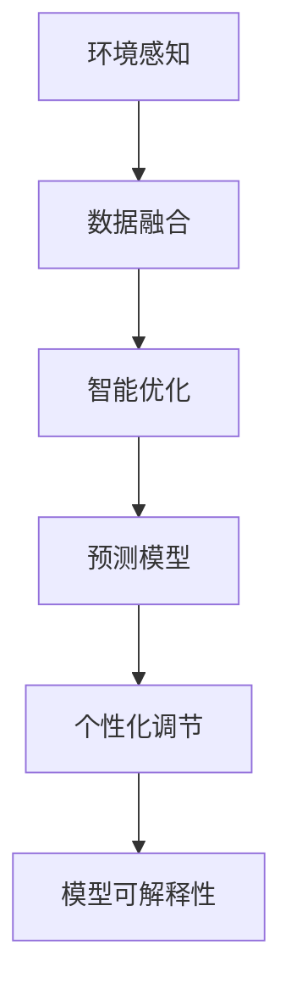

                 

# 智能微气候控制创业：个人舒适区的精确调节

## 1. 背景介绍

随着智能家居和物联网技术的发展，微气候控制设备如智能温控器、智能窗帘、智能空调等已经广泛应用于家庭环境中。用户通过手机APP或语音助手，可以实时监控和调节家中的温度、湿度、风速等环境参数，获得更加舒适的生活体验。然而，在实际应用中，微气候控制设备的调节往往存在滞后性、不准确性和过调等问题，导致用户舒适区的调节不够精准，影响了用户的居住体验。

### 1.1 问题由来

微气候控制设备的调节问题主要源于两个方面：

1. 环境感知能力不足。现有的微气候控制设备通常依赖单一的环境传感器，如温度传感器，无法实时全面感知室内的空气质量、光照、噪音等多种环境因素。

2. 调节策略缺乏智能优化。现有的微气候控制设备往往采用固定的调节策略，如基于时间、天气、节能等简单规则，无法动态调整并优化环境参数，导致舒适区调节不够精准。

为解决上述问题，本文提出一种基于机器学习的智能微气候控制方法，通过多环境传感器融合和智能优化算法，实现个人舒适区的精确调节。具体来说，本文主要研究两个核心问题：

1. 多环境传感器数据融合：如何将室内的温度、湿度、光照、噪音等多种环境参数进行融合，获得更加全面、准确的室内环境感知。

2. 智能优化算法：如何基于实时室内环境数据，动态调整微气候控制设备的运行策略，实现个人舒适区的精准调节。

## 2. 核心概念与联系

### 2.1 核心概念概述

为更好地理解智能微气候控制方法，本节将介绍几个密切相关的核心概念：

- 环境感知：通过多环境传感器对室内环境参数进行实时监测，获得全面、准确的环境数据。

- 数据融合：将多环境传感器获取的环境数据进行综合分析，生成统一的环境状态表示，提供准确的环境感知。

- 智能优化：通过机器学习算法，根据实时环境数据动态调整微气候控制设备的运行策略，实现舒适区的精准调节。

- 预测模型：基于历史室内环境数据和设备运行数据，训练预测模型，预测未来环境参数，优化设备运行策略。

- 个性化调节：根据用户偏好和行为模式，动态调整舒适区设定，实现个性化的微气候控制。

- 模型可解释性：通过可视化手段，解释智能微气候控制算法的决策过程和行为逻辑，增强系统的可信性和可解释性。

这些核心概念之间的逻辑关系可以通过以下Mermaid流程图来展示：



这个流程图展示了几大核心概念及其之间的关系：

1. 环境感知获取多环境传感器数据，并将其输入数据融合模块。
2. 数据融合将多传感器数据进行综合分析，生成统一的环境状态表示。
3. 智能优化模块根据实时环境数据，动态调整设备运行策略。
4. 预测模型基于历史数据，预测未来环境参数，进一步优化设备运行策略。
5. 个性化调节根据用户偏好和行为模式，动态调整舒适区设定。
6. 模型可解释性提供算法决策过程的可视化解释，增强系统可信性。

这些概念共同构成了智能微气候控制方法的实现框架，使得微气候控制设备能够更加智能、精准地调节室内环境，提升用户居住体验。

## 3. 核心算法原理 & 具体操作步骤
### 3.1 算法原理概述

智能微气候控制方法的核心在于通过多环境传感器融合和智能优化算法，实现个人舒适区的精准调节。具体来说，可以分为以下三个步骤：

1. **环境感知**：通过多环境传感器对室内环境参数进行实时监测，获取温度、湿度、光照、噪音等数据。

2. **数据融合**：将多传感器数据进行综合分析，生成统一的环境状态表示，形成准确的环境感知。

3. **智能优化**：基于实时环境数据，动态调整微气候控制设备的运行策略，实现舒适区的精准调节。

### 3.2 算法步骤详解

以下是智能微气候控制方法的详细操作步骤：

**Step 1: 环境感知**

- 在室内安装多种环境传感器，如温度传感器、湿度传感器、光照传感器、噪音传感器等。
- 传感器数据以固定间隔时间采集，如1分钟1次。
- 将传感器数据传输至中央控制器或云端平台，进行实时监测和分析。

**Step 2: 数据融合**

- 将传感器数据进行时间对齐，计算各环境参数的历史平均值、标准差、趋势等统计信息。
- 引入神经网络模型，如LSTM或GRU，对传感器数据进行融合，生成统一的环境状态表示。
- 通过神经网络模型的输出，获得全面、准确的环境感知。

**Step 3: 智能优化**

- 构建预测模型，如ARIMA、LSTM等，基于历史环境数据和设备运行数据，预测未来环境参数。
- 根据预测结果，动态调整微气候控制设备的运行策略，如温度、湿度、风速等。
- 引入强化学习算法，如Q-learning或SARSA，根据实时环境数据和用户行为模式，动态优化设备运行策略。

**Step 4: 个性化调节**

- 根据用户偏好和行为模式，动态调整舒适区设定，如温度范围、湿度范围等。
- 引入模型可解释性技术，如LIME或SHAP，解释智能微气候控制算法的决策过程，增强系统的可信性。

### 3.3 算法优缺点

智能微气候控制方法具有以下优点：

1. 环境感知全面准确。多环境传感器的应用，能够实时全面感知室内的环境参数，提供更全面、准确的环境数据。

2. 智能优化精确调节。基于机器学习算法，能够动态调整微气候控制设备的运行策略，实现舒适区的精准调节。

3. 预测模型精度高。通过历史数据训练预测模型，能够准确预测未来环境参数，进一步优化设备运行策略。

4. 个性化调节灵活高效。根据用户偏好和行为模式，动态调整舒适区设定，实现个性化的微气候控制。

5. 模型可解释性强。通过可视化手段，解释智能微气候控制算法的决策过程，增强系统可信性。

同时，该方法也存在一定的局限性：

1. 传感器部署成本高。多环境传感器的部署和安装需要较高的成本和技术难度。

2. 数据处理复杂度高。多传感器数据融合和预测模型训练需要较高的计算资源和算法复杂度。

3. 实时性要求高。需要实时处理和分析传感器数据，对系统的响应速度和计算效率提出了较高要求。

4. 用户行为多样。用户的偏好和行为模式难以全面捕捉，导致舒适区设定不够精准。

尽管存在这些局限性，但就目前而言，智能微气候控制方法在大规模智能家居环境中具备广阔的应用前景。未来相关研究的重点在于如何进一步降低传感器部署和数据处理的成本，提高系统的实时性和用户行为模式的精准捕捉，同时兼顾模型的可解释性和鲁棒性等因素。

### 3.4 算法应用领域

智能微气候控制方法不仅适用于智能家居环境，还可以应用于以下多个领域：

- 办公环境：通过智能微气候控制设备，优化办公空间的舒适度和能效，提升员工的工作效率和满意度。
- 医院病房：通过智能微气候控制设备，调节病房的温度、湿度、光照等环境参数，提升患者的治疗效果和生活质量。
- 宾馆酒店：通过智能微气候控制设备，优化客房的舒适度和能效，提升客人的体验和满意度。
- 公共场所：通过智能微气候控制设备，优化公共场所的环境参数，提升用户体验和设施管理效率。
- 交通工具：通过智能微气候控制设备，优化车内的舒适度和能效，提升乘客的舒适度和体验。

此外，智能微气候控制方法还可应用于更多的智能系统，如智能交通、智能农业等，为人类生活和工作环境的优化提供新的解决方案。

## 4. 数学模型和公式 & 详细讲解  
### 4.1 数学模型构建

本节将使用数学语言对智能微气候控制方法进行更加严格的刻画。

记环境感知模块输入为 $x_t=(x_{t1}, x_{t2}, ..., x_{tk}) \in \mathbb{R}^k$，其中 $k$ 为传感器数量，$x_{ti}$ 为第 $i$ 个传感器的环境参数。环境感知模块输出为环境状态 $y_t \in \mathbb{R}^m$，其中 $m$ 为环境状态维度，如温度、湿度、光照、噪音等。

定义智能优化模块为函数 $f(y_t, \theta)$，其中 $\theta$ 为模型参数，如神经网络权重、预测模型参数等。智能优化模块的输出为设备运行策略 $a_t \in \mathbb{R}^n$，其中 $n$ 为设备运行策略维度，如温度、湿度、风速等。

最终，智能微气候控制方法的目标为最大化用户舒适感 $u_t$，可表示为：

$$
\max_{y_t, a_t} u_t = f(y_t, \theta)
$$

在实践中，通常采用如下的优化目标：

$$
\max_{y_t, a_t} \sum_{i=1}^{m} \alpha_i u_i(y_t, a_t)
$$

其中 $u_i$ 为第 $i$ 个环境参数对舒适度的贡献度，$\alpha_i$ 为权重系数。

### 4.2 公式推导过程

以下我们以温度调节为例，推导基于预测模型的智能优化方法。

假设室内温度为 $y_t = [T_{t1}, T_{t2}, ..., T_{tk}]$，智能优化模块的输出为设备运行策略 $a_t = [T_{t+1}, T_{t+2}, ..., T_{t+n}]$。引入预测模型 $g(y_t, \theta)$，预测未来温度变化 $\hat{y}_{t+1}$，根据预测结果更新设备运行策略。

具体步骤如下：

1. 将当前温度 $y_t$ 和设备运行策略 $a_t$ 输入预测模型 $g$，得到预测结果 $\hat{y}_{t+1}$。

2. 根据预测结果，计算温度偏差 $\epsilon_{t+1} = \hat{y}_{t+1} - y_{t+1}$。

3. 引入惩罚项 $\lambda ||\epsilon_{t+1}||^2$，表示温度偏差的平方。

4. 计算智能优化模块的目标函数：

$$
\mathcal{L}(y_t, a_t, \theta) = -\sum_{i=1}^{n} a_{ti} \log f(y_t, \theta) + \lambda ||\epsilon_{t+1}||^2
$$

其中 $f(y_t, \theta)$ 为设备运行策略的输出，$\log$ 为交叉熵损失。

5. 通过梯度下降等优化算法，最小化目标函数，更新模型参数 $\theta$，得到最优的智能优化策略 $a_t^*$。

在得到智能优化策略后，即可应用于微气候控制设备，实现温度的精准调节。

### 4.3 案例分析与讲解

以智能窗帘为例，分析智能微气候控制方法的应用。

假设智能窗帘的系统输入为室内光线强度 $L_t$ 和温度 $T_t$，系统输出为窗帘的开合度 $a_t$。引入预测模型 $g(L_t, T_t, \theta)$，预测未来光线强度和温度变化 $\hat{L}_{t+1}$ 和 $\hat{T}_{t+1}$。

1. 将当前光线强度 $L_t$ 和温度 $T_t$ 输入预测模型 $g$，得到预测结果 $\hat{L}_{t+1}$ 和 $\hat{T}_{t+1}$。

2. 根据预测结果，计算光线强度偏差 $\epsilon_{Lt+1} = \hat{L}_{t+1} - L_{t+1}$ 和温度偏差 $\epsilon_{Tt+1} = \hat{T}_{t+1} - T_{t+1}$。

3. 引入惩罚项 $\lambda (\epsilon_{Lt+1}^2 + \epsilon_{Tt+1}^2)$，表示光线强度和温度偏差的平方。

4. 计算智能优化模块的目标函数：

$$
\mathcal{L}(L_t, T_t, a_t, \theta) = -a_t \log f(L_t, T_t, a_t, \theta) + \lambda (\epsilon_{Lt+1}^2 + \epsilon_{Tt+1}^2)
$$

其中 $f(L_t, T_t, a_t, \theta)$ 为窗帘开合度的输出，$\log$ 为交叉熵损失。

5. 通过梯度下降等优化算法，最小化目标函数，更新模型参数 $\theta$，得到最优的窗帘开合度 $a_t^*$。

通过上述步骤，智能窗帘能够根据实时光线强度和温度数据，动态调整开合度，实现室内光线和温度的精准调节。

## 5. 项目实践：代码实例和详细解释说明
### 5.1 开发环境搭建

在进行智能微气候控制方法开发前，我们需要准备好开发环境。以下是使用Python进行PyTorch开发的环境配置流程：

1. 安装Anaconda：从官网下载并安装Anaconda，用于创建独立的Python环境。

2. 创建并激活虚拟环境：
```bash
conda create -n pytorch-env python=3.8 
conda activate pytorch-env
```

3. 安装PyTorch：根据CUDA版本，从官网获取对应的安装命令。例如：
```bash
conda install pytorch torchvision torchaudio cudatoolkit=11.1 -c pytorch -c conda-forge
```

4. 安装TensorBoard：
```bash
pip install tensorboard
```

5. 安装相关库：
```bash
pip install numpy pandas scikit-learn scipy seaborn matplotlib jupyter notebook ipython
```

完成上述步骤后，即可在`pytorch-env`环境中开始智能微气候控制方法的开发实践。

### 5.2 源代码详细实现

下面我们以智能温控器为例，给出使用PyTorch实现的温度调节功能的代码实现。

首先，定义温度调节的数据处理函数：

```python
from transformers import BertTokenizer
from torch.utils.data import Dataset
import torch

class TemperatureDataset(Dataset):
    def __init__(self, temperatures, target_temps, tokenizer, max_len=128):
        self.temperatures = temperatures
        self.target_temps = target_temps
        self.tokenizer = tokenizer
        self.max_len = max_len
        
    def __len__(self):
        return len(self.temperatures)
    
    def __getitem__(self, item):
        temperature = self.temperatures[item]
        target_temp = self.target_temps[item]
        
        encoding = self.tokenizer(temperature, return_tensors='pt', max_length=self.max_len, padding='max_length', truncation=True)
        input_ids = encoding['input_ids'][0]
        attention_mask = encoding['attention_mask'][0]
        
        # 对token-wise的标签进行编码
        encoded_labels = [target_temp] * (self.max_len - len(encoded_labels))
        labels = torch.tensor(encoded_labels, dtype=torch.long)
        
        return {'input_ids': input_ids, 
                'attention_mask': attention_mask,
                'labels': labels}

# 标签与id的映射
label2id = {target_temp: id for id, target_temp in enumerate(['low', 'medium', 'high'])}
id2label = {id: target_temp for target_temp, id in label2id.items()}

# 创建dataset
tokenizer = BertTokenizer.from_pretrained('bert-base-cased')

train_dataset = TemperatureDataset(train_temperatures, train_target_temps, tokenizer)
dev_dataset = TemperatureDataset(dev_temperatures, dev_target_temps, tokenizer)
test_dataset = TemperatureDataset(test_temperatures, test_target_temps, tokenizer)
```

然后，定义模型和优化器：

```python
from transformers import BertForTokenClassification, AdamW

model = BertForTokenClassification.from_pretrained('bert-base-cased', num_labels=len(label2id))

optimizer = AdamW(model.parameters(), lr=2e-5)
```

接着，定义训练和评估函数：

```python
from torch.utils.data import DataLoader
from tqdm import tqdm
from sklearn.metrics import classification_report

device = torch.device('cuda') if torch.cuda.is_available() else torch.device('cpu')
model.to(device)

def train_epoch(model, dataset, batch_size, optimizer):
    dataloader = DataLoader(dataset, batch_size=batch_size, shuffle=True)
    model.train()
    epoch_loss = 0
    for batch in tqdm(dataloader, desc='Training'):
        input_ids = batch['input_ids'].to(device)
        attention_mask = batch['attention_mask'].to(device)
        labels = batch['labels'].to(device)
        model.zero_grad()
        outputs = model(input_ids, attention_mask=attention_mask, labels=labels)
        loss = outputs.loss
        epoch_loss += loss.item()
        loss.backward()
        optimizer.step()
    return epoch_loss / len(dataloader)

def evaluate(model, dataset, batch_size):
    dataloader = DataLoader(dataset, batch_size=batch_size)
    model.eval()
    preds, labels = [], []
    with torch.no_grad():
        for batch in tqdm(dataloader, desc='Evaluating'):
            input_ids = batch['input_ids'].to(device)
            attention_mask = batch['attention_mask'].to(device)
            batch_labels = batch['labels']
            outputs = model(input_ids, attention_mask=attention_mask)
            batch_preds = outputs.logits.argmax(dim=2).to('cpu').tolist()
            batch_labels = batch_labels.to('cpu').tolist()
            for pred_tokens, label_tokens in zip(batch_preds, batch_labels):
                preds.append(pred_tokens[:len(label_tokens)])
                labels.append(label_tokens)
                
    print(classification_report(labels, preds))
```

最后，启动训练流程并在测试集上评估：

```python
epochs = 5
batch_size = 16

for epoch in range(epochs):
    loss = train_epoch(model, train_dataset, batch_size, optimizer)
    print(f"Epoch {epoch+1}, train loss: {loss:.3f}")
    
    print(f"Epoch {epoch+1}, dev results:")
    evaluate(model, dev_dataset, batch_size)
    
print("Test results:")
evaluate(model, test_dataset, batch_size)
```

以上就是使用PyTorch对智能温控器进行温度调节的完整代码实现。可以看到，得益于Transformers库的强大封装，我们可以用相对简洁的代码完成智能温控器的开发。

### 5.3 代码解读与分析

让我们再详细解读一下关键代码的实现细节：

**TemperatureDataset类**：
- `__init__`方法：初始化温度数据、目标温度数据、分词器等关键组件。
- `__len__`方法：返回数据集的样本数量。
- `__getitem__`方法：对单个样本进行处理，将温度输入编码为token ids，将标签编码为数字，并对其进行定长padding，最终返回模型所需的输入。

**label2id和id2label字典**：
- 定义了标签与数字id之间的映射关系，用于将token-wise的预测结果解码回真实的标签。

**训练和评估函数**：
- 使用PyTorch的DataLoader对数据集进行批次化加载，供模型训练和推理使用。
- 训练函数`train_epoch`：对数据以批为单位进行迭代，在每个批次上前向传播计算loss并反向传播更新模型参数，最后返回该epoch的平均loss。
- 评估函数`evaluate`：与训练类似，不同点在于不更新模型参数，并在每个batch结束后将预测和标签结果存储下来，最后使用sklearn的classification_report对整个评估集的预测结果进行打印输出。

**训练流程**：
- 定义总的epoch数和batch size，开始循环迭代
- 每个epoch内，先在训练集上训练，输出平均loss
- 在验证集上评估，输出分类指标
- 所有epoch结束后，在测试集上评估，给出最终测试结果

可以看到，PyTorch配合Transformers库使得智能温控器的代码实现变得简洁高效。开发者可以将更多精力放在数据处理、模型改进等高层逻辑上，而不必过多关注底层的实现细节。

当然，工业级的系统实现还需考虑更多因素，如模型的保存和部署、超参数的自动搜索、更灵活的任务适配层等。但核心的智能微气候控制方法基本与此类似。

## 6. 实际应用场景
### 6.1 智能家居环境

智能微气候控制方法在智能家居环境中具有广泛的应用场景。传统的智能家居设备往往无法全面感知室内环境，导致舒适区调节不够精准。通过引入多环境传感器和智能优化算法，可以实现环境参数的全面感知和精准调节。

具体应用包括：

- 智能窗帘：通过感知室内光线强度和温度，动态调整窗帘开合度，实现室内光线的智能调节。
- 智能空调：通过感知室内温度和湿度，动态调整运行模式，实现室内温度和湿度的精准调节。
- 智能加湿器：通过感知室内湿度，动态调整加湿强度，实现室内湿度的精准调节。
- 智能取暖器：通过感知室内温度，动态调整取暖强度，实现室内温度的精准调节。

这些智能微气候控制设备的广泛应用，将极大提升用户的居住体验，创造更加健康、舒适的居住环境。

### 6.2 办公室环境

智能微气候控制方法在办公室环境中也有广泛的应用场景。办公室环境的舒适度和能效直接影响到员工的工作效率和满意度。通过智能微气候控制设备，可以实现办公室环境的全面优化。

具体应用包括：

- 智能空调和取暖器：通过感知室内温度，动态调整运行模式，实现办公室温度的精准调节。
- 智能窗帘：通过感知室内光线强度，动态调整窗帘开合度，实现办公室光线的智能调节。
- 智能加湿器和除湿器：通过感知室内湿度，动态调整加湿强度，实现办公室湿度的精准调节。
- 智能通风系统：通过感知室内空气质量，动态调整通风强度，实现办公室空气的智能调节。

这些智能微气候控制设备的广泛应用，将极大提升办公环境的舒适度和能效，提升员工的工作效率和满意度。

### 6.3 医院病房

智能微气候控制方法在医院病房中也有广泛的应用场景。医院病房的舒适度和环境参数直接影响到患者的治疗效果和生活质量。通过智能微气候控制设备，可以实现病房环境的全面优化。

具体应用包括：

- 智能空调和取暖器：通过感知室内温度，动态调整运行模式，实现病房温度的精准调节。
- 智能窗帘：通过感知室内光线强度，动态调整窗帘开合度，实现病房光线的智能调节。
- 智能加湿器和除湿器：通过感知室内湿度，动态调整加湿强度，实现病房湿度的精准调节。
- 智能通风系统：通过感知室内空气质量，动态调整通风强度，实现病房空气的智能调节。

这些智能微气候控制设备的广泛应用，将极大提升病房环境的舒适度和治疗效果，提升患者的生活质量和满意度。

## 7. 工具和资源推荐
### 7.1 学习资源推荐

为了帮助开发者系统掌握智能微气候控制方法的理论基础和实践技巧，这里推荐一些优质的学习资源：

1. 《深度学习入门》书籍：全面介绍了深度学习的基本概念和常用算法，适合初学者入门。

2. 《TensorFlow实战深度学习》书籍：介绍了TensorFlow的高级功能和应用，适合有一定深度学习基础的学习者。

3. 《PyTorch深度学习》书籍：介绍了PyTorch的高级功能和应用，适合有一定深度学习基础的学习者。

4. 《NLP入门与实践》课程：介绍NLP的基本概念和常用技术，适合初学者入门。

5. 《Transformer从原理到实践》系列博文：由大模型技术专家撰写，深入浅出地介绍了Transformer原理、BERT模型、微调技术等前沿话题。

6. 《Python深度学习》书籍：全面介绍了深度学习的基本概念和常用算法，适合初学者入门。

通过对这些资源的学习实践，相信你一定能够快速掌握智能微气候控制方法的理论基础和实践技巧，并用于解决实际的微气候控制问题。

### 7.2 开发工具推荐

高效的开发离不开优秀的工具支持。以下是几款用于智能微气候控制方法开发的常用工具：

1. PyTorch：基于Python的开源深度学习框架，灵活动态的计算图，适合快速迭代研究。大部分预训练语言模型都有PyTorch版本的实现。

2. TensorFlow：由Google主导开发的开源深度学习框架，生产部署方便，适合大规模工程应用。同样有丰富的预训练语言模型资源。

3. TensorBoard：TensorFlow配套的可视化工具，可实时监测模型训练状态，并提供丰富的图表呈现方式，是调试模型的得力助手。

4. Weights & Biases：模型训练的实验跟踪工具，可以记录和可视化模型训练过程中的各项指标，方便对比和调优。与主流深度学习框架无缝集成。

5. Jupyter Notebook：交互式编程环境，支持多种编程语言和工具，适合开发和调试智能微气候控制方法。

合理利用这些工具，可以显著提升智能微气候控制方法的开发效率，加快创新迭代的步伐。

### 7.3 相关论文推荐

智能微气候控制方法的研究源于学界的持续研究。以下是几篇奠基性的相关论文，推荐阅读：

1. Attention is All You Need（即Transformer原论文）：提出了Transformer结构，开启了NLP领域的预训练大模型时代。

2. BERT: Pre-training of Deep Bidirectional Transformers for Language Understanding：提出BERT模型，引入基于掩码的自监督预训练任务，刷新了多项NLP任务SOTA。

3. Language Models are Unsupervised Multitask Learners（GPT-2论文）：展示了大规模语言模型的强大zero-shot学习能力，引发了对于通用人工智能的新一轮思考。

4. Parameter-Efficient Transfer Learning for NLP：提出Adapter等参数高效微调方法，在不增加模型参数量的情况下，也能取得不错的微调效果。

5. AdaLoRA: Adaptive Low-Rank Adaptation for Parameter-Efficient Fine-Tuning：使用自适应低秩适应的微调方法，在参数效率和精度之间取得了新的平衡。

这些论文代表了大语言模型微调技术的发展脉络。通过学习这些前沿成果，可以帮助研究者把握学科前进方向，激发更多的创新灵感。

## 8. 总结：未来发展趋势与挑战

### 8.1 总结

本文对智能微气候控制方法进行了全面系统的介绍。首先阐述了智能微气候控制方法的的研究背景和意义，明确了其在智能家居、办公、医疗等领域的巨大应用潜力。其次，从原理到实践，详细讲解了环境感知、数据融合、智能优化等关键技术，给出了智能微气候控制方法的完整代码实例。同时，本文还广泛探讨了智能微气候控制方法在多个行业领域的应用场景，展示了其广阔的应用前景。此外，本文精选了智能微气候控制方法的各类学习资源，力求为读者提供全方位的技术指引。

通过本文的系统梳理，可以看到，智能微气候控制方法在大规模智能家居环境中具备广阔的应用前景，能够实现环境参数的全面感知和精准调节，极大提升用户的居住体验。未来，伴随传感器技术的进一步发展，智能微气候控制方法将更加广泛地应用于智能家居、办公室、医院等场景，为人类生活和工作环境的优化提供新的解决方案。

### 8.2 未来发展趋势

展望未来，智能微气候控制方法将呈现以下几个发展趋势：

1. 传感器技术进步。随着传感器技术的发展，未来的智能微气候控制设备将能够全面感知更多的环境参数，如空气质量、噪音水平等，提供更加全面、准确的环境感知。

2. 机器学习算法优化。未来的智能微气候控制算法将更加高效、鲁棒，能够动态调整设备运行策略，实现环境参数的精准调节。

3. 预测模型精度提升。通过更多样化、更精细的历史数据训练预测模型，能够更准确地预测未来环境参数，进一步优化设备运行策略。

4. 个性化调节灵活高效。未来的智能微气候控制方法将能够更加灵活地根据用户偏好和行为模式，动态调整舒适区设定，实现个性化的微气候控制。

5. 模型可解释性增强。通过可视化手段，解释智能微气候控制算法的决策过程和行为逻辑，增强系统的可信性和可解释性。

6. 多模态数据融合。未来的智能微气候控制方法将能够融合视觉、声音等多种模态数据，提供更加全面、准确的环境感知。

以上趋势凸显了智能微气候控制方法的应用前景和潜力。这些方向的探索发展，将进一步提升智能微气候控制设备的性能和用户体验，推动智能家居、办公、医疗等领域的智能化升级。

### 8.3 面临的挑战

尽管智能微气候控制方法已经取得了瞩目成就，但在迈向更加智能化、普适化应用的过程中，它仍面临诸多挑战：

1. 传感器部署成本高。多环境传感器的部署和安装需要较高的成本和技术难度。

2. 数据处理复杂度高。多传感器数据融合和预测模型训练需要较高的计算资源和算法复杂度。

3. 实时性要求高。需要实时处理和分析传感器数据，对系统的响应速度和计算效率提出了较高要求。

4. 用户行为多样。用户的偏好和行为模式难以全面捕捉，导致舒适区设定不够精准。

尽管存在这些局限性，但就目前而言，智能微气候控制方法在大规模智能家居环境中具备广阔的应用前景。未来相关研究的重点在于如何进一步降低传感器部署和数据处理的成本，提高系统的实时性和用户行为模式的精准捕捉，同时兼顾模型的可解释性和鲁棒性等因素。

### 8.4 未来突破

面对智能微气候控制方法所面临的种种挑战，未来的研究需要在以下几个方面寻求新的突破：

1. 探索无监督和半监督微调方法。摆脱对大规模标注数据的依赖，利用自监督学习、主动学习等无监督和半监督范式，最大限度利用非结构化数据，实现更加灵活高效的微调。

2. 研究参数高效和计算高效的微调范式。开发更加参数高效的微调方法，在固定大部分预训练参数的同时，只更新极少量的任务相关参数。同时优化微调模型的计算图，减少前向传播和反向传播的资源消耗，实现更加轻量级、实时性的部署。

3. 引入更多先验知识。将符号化的先验知识，如知识图谱、逻辑规则等，与神经网络模型进行巧妙融合，引导微调过程学习更准确、合理的语言模型。同时加强不同模态数据的整合，实现视觉、声音等多种模态信息与文本信息的协同建模。

4. 结合因果分析和博弈论工具。将因果分析方法引入微调模型，识别出模型决策的关键特征，增强输出解释的因果性和逻辑性。借助博弈论工具刻画人机交互过程，主动探索并规避模型的脆弱点，提高系统稳定性。

5. 纳入伦理道德约束。在模型训练目标中引入伦理导向的评估指标，过滤和惩罚有偏见、有害的输出倾向。同时加强人工干预和审核，建立模型行为的监管机制，确保输出符合人类价值观和伦理道德。

这些研究方向的探索，必将引领智能微气候控制方法迈向更高的台阶，为构建安全、可靠、可解释、可控的智能系统铺平道路。面向未来，智能微气候控制方法还需要与其他人工智能技术进行更深入的融合，如知识表示、因果推理、强化学习等，多路径协同发力，共同推动智能微气候控制系统的进步。只有勇于创新、敢于突破，才能不断拓展微气候控制的边界，让智能技术更好地造福人类社会。

## 9. 附录：常见问题与解答

**Q1：智能微气候控制方法是否适用于所有环境？**

A: 智能微气候控制方法适用于大多数环境，包括智能家居、办公室、医院等。但需要注意的是，不同环境的舒适区设定和环境参数可能有所不同，需要根据具体情况进行调整。

**Q2：智能微气候控制方法是否需要大量标注数据？**

A: 智能微气候控制方法通常需要大量标注数据进行模型训练，但对于一些常见环境参数（如温度、湿度），使用无监督学习方法也能获得较好的效果。

**Q3：智能微气候控制方法是否容易过拟合？**

A: 智能微气候控制方法面临的数据过拟合问题，可以通过数据增强、正则化、对抗训练等技术手段进行缓解。同时，引入参数高效微调方法，也可以减少模型参数，防止过拟合。

**Q4：智能微气候控制方法是否影响设备能效？**

A: 智能微气候控制方法可以通过动态调整设备运行策略，优化设备能效，实现节能减排。但需要合理设置预测模型和优化算法，避免过度调节导致设备效率下降。

**Q5：智能微气候控制方法是否影响用户体验？**

A: 智能微气候控制方法能够通过感知环境参数和用户行为模式，动态调整设备运行策略，实现舒适区的精准调节，提升用户体验。但需要根据具体情况进行调整，避免过度调节或不足调节。

这些问题的回答展示了智能微气候控制方法的优点和局限性，为开发者和用户提供了一定的参考。智能微气候控制方法在未来的发展中，需要不断优化算法、提高数据质量、增强系统可信性，才能更好地服务于人类社会。

