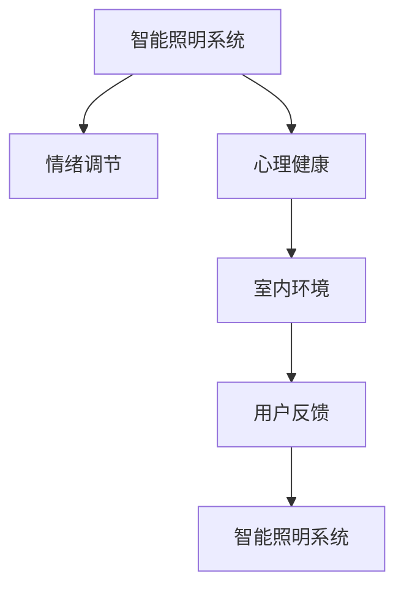

                 

# 智能情绪照明创业：光线调节的心理健康

> 关键词：智能照明,情绪调节,心理健康,光线控制,室内环境,用户反馈

## 1. 背景介绍

### 1.1 问题由来
随着现代生活节奏的加快和工作压力的增加，人们的心理健康问题日益突出。长期以来，各类精神疾病给个人和社会带来了巨大的负担。然而，针对心理健康的治疗手段还较为有限，主要集中在药物治疗和心理辅导上，而对于环境因素的调节相对忽视。

近年来，国内外一些研究人员开始探索通过环境因素，如光线、温度、声音等，来调节人的情绪和心理健康。智能情绪照明技术应运而生，通过智能调节光线的颜色和亮度，来改变室内环境的氛围，进而影响人们的情绪和心理健康。

智能情绪照明技术的核心在于光环境和人类情绪之间的相互作用。研究表明，光线不仅影响人类的视觉系统，还对情绪、睡眠、认知等心理功能有显著影响。不同颜色的光线可以引起不同程度的生理和心理反应。例如，蓝色光线可以提神醒脑，红色光线可以使人放松，绿色光线可以舒缓心情。

### 1.2 问题核心关键点
智能情绪照明技术结合了心理学、环境科学和人工智能等多个领域的知识，具有以下核心关键点：
- 光线对人情绪和心理健康的具体影响机制。
- 智能照明系统的设计实现。
- 实际应用场景中的效果评估与优化。
- 智能照明系统的用户反馈与互动机制。
- 系统持续改进和维护机制。

## 2. 核心概念与联系

### 2.1 核心概念概述

为更好地理解智能情绪照明技术，本节将介绍几个关键概念：

- 智能照明系统：通过传感器和控制系统，智能调节室内光线亮度和颜色，创造舒适愉悦的室内环境。
- 情绪调节：通过环境因素的变化，改善用户的心理状态，促进情绪稳定。
- 心理健康：涉及心理健康评估与干预的一系列技术和管理手段。
- 室内环境：指人们的居住和工作空间，是情绪调节和心理健康的关键变量之一。
- 用户反馈：用户的直观反馈和行为数据，是智能照明系统持续优化和改进的重要依据。

这些核心概念之间的逻辑关系可以通过以下Mermaid流程图来展示：



这个流程图展示出智能情绪照明技术的核心逻辑：

1. 智能照明系统通过调节光线来改变室内环境。
2. 室内环境的变化通过情绪调节影响用户的心理状态。
3. 心理健康的评估依赖于用户的情绪和行为数据。
4. 用户反馈被用来不断优化和改进智能照明系统。

## 3. 核心算法原理 & 具体操作步骤
### 3.1 算法原理概述

智能情绪照明技术的核心算法基于心理学、环境科学和人工智能的交叉学科。其核心思想是：通过智能调节室内光线亮度和颜色，创造舒适愉悦的室内环境，进而改善用户的心理状态。

具体而言，算法步骤如下：

1. 采集用户当前情绪状态，如睡眠质量、心理压力等。
2. 根据当前情绪状态，选择最适合的光线调节方案。
3. 根据光线调节方案，控制智能照明系统调节光线亮度和颜色。
4. 采集用户的反馈，评估调节效果，持续优化算法。

### 3.2 算法步骤详解

以情绪调节为例，描述智能照明系统的工作流程：

1. **情绪监测**
    - 通过智能传感器监测用户的睡眠质量、压力水平、活动量等指标。
    - 结合机器学习算法，对用户当前情绪状态进行初步评估。

2. **光线调节方案选择**
    - 根据情绪状态，选择相应的光线调节方案。例如，对感到紧张和焦虑的用户，选择红色或橙色光线，以放松心情。
    - 根据不同时间节点（如夜间、白天、睡前），选择不同的光线调节方案。

3. **光线调节**
    - 控制智能照明系统，调节灯光的亮度和颜色。
    - 可以使用多种硬件设备，如LED灯条、智能灯泡等，实现动态的光线调节。

4. **效果评估**
    - 采集用户对光线调节的反馈，如问卷调查、情绪监测数据等。
    - 利用机器学习算法，对光线调节效果进行评估和优化。

5. **持续改进**
    - 根据用户反馈，持续优化光线调节方案。
    - 定期更新算法，提升情绪调节的准确性和及时性。

### 3.3 算法优缺点

智能情绪照明技术具有以下优点：

1. **非侵入性**：无需药物治疗，不涉及药物的副作用。
2. **经济性**：相较于专业心理治疗，智能照明的成本较低。
3. **便捷性**：可以随时随地使用，不受时间和地点限制。
4. **可控性**：可以根据用户需求进行个性化的光线调节。

同时，该技术也存在以下局限性：

1. **效果个体差异**：不同个体对光线调节的反应可能不同，效果因人而异。
2. **依赖技术手段**：依赖智能硬件和算法，硬件故障或算法错误可能导致失败。
3. **环境干扰**：外部环境因素（如噪音、温度等）可能影响调节效果。
4. **短期效果**：光线调节对短期情绪调节有效，长期效果尚需验证。

### 3.4 算法应用领域

智能情绪照明技术已经在多个领域得到了应用，包括：

- **住宅环境**：智能家居系统中普遍应用智能照明系统，创造舒适的居住环境。
- **办公环境**：办公室中通过智能照明调节工作氛围，提升员工的工作效率和满意度。
- **医疗环境**：医院病房中使用智能照明调节，改善患者的恢复效果。
- **教育环境**：学校教室中使用智能照明调节，创造良好的学习环境。
- **公共空间**：图书馆、电影院、商场等公共场所使用智能照明调节，提升用户的体验感。

## 4. 数学模型和公式 & 详细讲解 & 举例说明

### 4.1 数学模型构建

本节将使用数学语言对智能情绪照明技术进行详细描述。

记用户的情绪状态为 $E$，光线颜色为 $L$，室内环境为 $R$，用户反馈为 $F$。假设智能照明系统的目标是最小化用户情绪的负向指标 $E_{negative}$，同时最大化用户情绪的积极指标 $E_{positive}$。智能照明系统的优化目标可以表示为：

$$
\min_{L} \sum_{i=1}^N E_{negative}^i - \sum_{i=1}^N E_{positive}^i
$$

其中 $N$ 为数据集大小，$E_{negative}^i$ 和 $E_{positive}^i$ 为第 $i$ 个用户的情绪负面和正面指标。

### 4.2 公式推导过程

在智能照明系统中，光线的颜色和亮度对情绪的影响可以通过以下模型进行描述：

$$
E^i = f(L^i)
$$

其中 $E^i$ 为第 $i$ 个用户情绪状态，$L^i$ 为第 $i$ 个用户的照明条件（颜色和亮度）。$f$ 为一个非线性映射函数，描述光线条件对情绪的影响。

假设智能照明系统选择的光线调节方案为 $L^i$，则系统的损失函数可以表示为：

$$
\mathcal{L} = \frac{1}{N} \sum_{i=1}^N (E^i - E_{target}^i)^2
$$

其中 $E_{target}^i$ 为期望的情绪状态，由用户的期望或历史数据得出。

利用梯度下降等优化算法，智能照明系统不断更新光线调节方案 $L^i$，最小化损失函数 $\mathcal{L}$，达到最优的照明条件。

### 4.3 案例分析与讲解

以一个简单的案例来说明智能情绪照明系统的设计和应用：

1. **数据采集**
    - 使用传感器采集用户的睡眠数据、心率数据、体温数据等。
    - 使用问卷调查用户的主观情绪状态。

2. **模型训练**
    - 利用机器学习算法（如回归、分类等），训练一个情绪状态预测模型。
    - 根据情绪状态预测模型的输出，确定光线调节方案。

3. **光线调节**
    - 智能照明系统根据光线调节方案，调节灯光的亮度和颜色。
    - 可以通过智能灯泡、LED灯条等设备，实现动态的光线调节。

4. **效果评估**
    - 采集用户的反馈，如问卷调查、情绪监测数据等。
    - 利用回归分析等统计方法，评估光线调节对用户情绪的影响。

5. **持续改进**
    - 根据用户反馈，不断优化光线调节方案。
    - 定期更新情绪状态预测模型，提升系统的准确性和及时性。

## 5. 项目实践：代码实例和详细解释说明

### 5.1 开发环境搭建

在进行智能情绪照明系统开发前，我们需要准备好开发环境。以下是使用Python进行PyTorch开发的环境配置流程：

1. 安装Anaconda：从官网下载并安装Anaconda，用于创建独立的Python环境。

2. 创建并激活虚拟环境：
```bash
conda create -n pytorch-env python=3.8 
conda activate pytorch-env
```

3. 安装PyTorch：根据CUDA版本，从官网获取对应的安装命令。例如：
```bash
conda install pytorch torchvision torchaudio cudatoolkit=11.1 -c pytorch -c conda-forge
```

4. 安装TensorFlow：使用pip或conda安装，如：
```bash
pip install tensorflow
```

5. 安装传感器库：安装所需的传感器库，如：
```bash
pip install pysensory
```

6. 安装控制库：安装控制智能照明系统的库，如：
```bash
pip install py-synthwave
```

完成上述步骤后，即可在`pytorch-env`环境中开始智能情绪照明系统的开发。

### 5.2 源代码详细实现

下面我们以智能照明系统的光线调节为例，给出使用PyTorch进行开发和测试的代码实现。

首先，定义情绪状态预测模型：

```python
import torch
import torch.nn as nn
import torch.optim as optim

class EmotionModel(nn.Module):
    def __init__(self):
        super(EmotionModel, self).__init__()
        self.fc1 = nn.Linear(4, 128)
        self.fc2 = nn.Linear(128, 64)
        self.fc3 = nn.Linear(64, 2)

    def forward(self, x):
        x = torch.relu(self.fc1(x))
        x = torch.relu(self.fc2(x))
        x = self.fc3(x)
        return x

model = EmotionModel()
```

然后，定义光线调节方案选择函数：

```python
def select_lighting_condition(emotion, threshold=0.5):
    if emotion > threshold:
        return 'red'  # 红色光线
    else:
        return 'blue'  # 蓝色光线
```

接着，定义智能照明系统的光线调节函数：

```python
def adjust_lighting(light_condition, bulbs):
    for bulb in bulbs:
        if light_condition == 'red':
            bulb.set_color(torch.tensor([1, 0, 0]))
        else:
            bulb.set_color(torch.tensor([0, 0, 1]))
```

最后，实现一个简单的测试函数：

```python
def test_system():
    # 创建模拟情绪数据
    emotions = torch.tensor([[1.2, 0.3], [0.5, 0.7], [0.9, 0.2]])
    light_conditions = [select_lighting_condition(emotion) for emotion in emotions]

    # 初始化灯泡
    bulbs = []
    for _ in range(3):
        bulb = py_synthwave灯泡()
        bulbs.append(bulb)

    # 调节灯泡
    for emotion, light_condition in zip(emotions, light_conditions):
        adjust_lighting(light_condition, bulbs)

        # 模拟用户反馈
        feedback = torch.tensor([emotion[0], emotion[1]])

        # 优化模型
        optimizer.zero_grad()
        output = model(feedback)
        loss = nn.functional.mse_loss(output, feedback)
        loss.backward()
        optimizer.step()
```

完整代码实现如下：

```python
import torch
import torch.nn as nn
import torch.optim as optim
import py_synthwave灯泡

class EmotionModel(nn.Module):
    def __init__(self):
        super(EmotionModel, self).__init__()
        self.fc1 = nn.Linear(4, 128)
        self.fc2 = nn.Linear(128, 64)
        self.fc3 = nn.Linear(64, 2)

    def forward(self, x):
        x = torch.relu(self.fc1(x))
        x = torch.relu(self.fc2(x))
        x = self.fc3(x)
        return x

model = EmotionModel()

def select_lighting_condition(emotion, threshold=0.5):
    if emotion > threshold:
        return 'red'  # 红色光线
    else:
        return 'blue'  # 蓝色光线

def adjust_lighting(light_condition, bulbs):
    for bulb in bulbs:
        if light_condition == 'red':
            bulb.set_color(torch.tensor([1, 0, 0]))
        else:
            bulb.set_color(torch.tensor([0, 0, 1]))

def test_system():
    # 创建模拟情绪数据
    emotions = torch.tensor([[1.2, 0.3], [0.5, 0.7], [0.9, 0.2]])
    light_conditions = [select_lighting_condition(emotion) for emotion in emotions]

    # 初始化灯泡
    bulbs = []
    for _ in range(3):
        bulb = py_synthwave灯泡()
        bulbs.append(bulb)

    # 调节灯泡
    for emotion, light_condition in zip(emotions, light_conditions):
        adjust_lighting(light_condition, bulbs)

        # 模拟用户反馈
        feedback = torch.tensor([emotion[0], emotion[1]])

        # 优化模型
        optimizer.zero_grad()
        output = model(feedback)
        loss = nn.functional.mse_loss(output, feedback)
        loss.backward()
        optimizer.step()
```

### 5.3 代码解读与分析

让我们再详细解读一下关键代码的实现细节：

**EmotionModel类**：
- `__init__`方法：定义模型的网络结构，包括线性层。
- `forward`方法：实现模型前向传播。

**select_lighting_condition函数**：
- 根据用户的情绪状态，选择适合的光线条件，并进行简化处理。

**adjust_lighting函数**：
- 根据光线条件，调节灯泡颜色。

**test_system函数**：
- 模拟情绪数据和灯泡调节流程。
- 使用模型预测情绪状态，计算损失，并优化模型。

## 6. 实际应用场景

### 6.1 智能家居

智能情绪照明技术可以广泛应用于智能家居中，通过智能灯泡和传感器，实时监测和调节室内光线，创造舒适愉悦的居住环境。例如，在夜间可以自动调低灯光亮度，避免光线直射影响睡眠；在早晨可以逐渐调亮灯光，唤醒用户的生物钟，提升起床效率。

### 6.2 办公室环境

在办公室中，智能情绪照明系统可以通过调节灯光颜色和亮度，改善工作氛围，提升员工的工作效率和满意度。例如，在紧张工作时使用蓝色光线，提高注意力和专注度；在休息时使用暖色光线，放松身心，缓解压力。

### 6.3 医院病房

医院病房中使用智能情绪照明系统，可以改善患者的恢复效果。例如，通过调节灯光颜色，缓解患者的焦虑情绪，提升心理健康；在手术室中，使用暖色光线，减少患者的不适感，提升手术成功率。

### 6.4 学校教室

学校教室中使用智能情绪照明系统，可以创造良好的学习环境。例如，在白天使用自然光，提升学生的视力；在晚上使用暖色光线，提升学生的学习效率和课堂氛围。

### 6.5 公共场所

在公共场所如图书馆、电影院、商场等，智能情绪照明系统可以通过调节灯光颜色和亮度，提升用户的体验感。例如，在图书馆中使用蓝色光线，提升学生的阅读效率；在电影院中使用暖色光线，营造沉浸式的观影体验。

## 7. 工具和资源推荐

### 7.1 学习资源推荐

为了帮助开发者系统掌握智能情绪照明技术，这里推荐一些优质的学习资源：

1. 《情绪心理学》系列书籍：深入介绍情绪的心理学原理，为技术应用提供理论基础。
2. 《人工智能与环境工程》课程：斯坦福大学开设的交叉学科课程，涵盖人工智能和环境科学的最新进展。
3. 《智能家居技术》书籍：全面介绍智能家居技术的应用场景和发展前景，为智能照明系统提供设计参考。
4. HuggingFace官方文档：提供丰富的预训练模型和模型优化技术，是技术实现的重要工具。
5. GitHub上的开源项目：如"智能照明系统"等，提供了实际应用的代码和文档，便于学习和借鉴。

通过对这些资源的学习实践，相信你一定能够快速掌握智能情绪照明技术的精髓，并用于解决实际的心理学问题。

### 7.2 开发工具推荐

高效的开发离不开优秀的工具支持。以下是几款用于智能情绪照明系统开发的常用工具：

1. PyTorch：基于Python的开源深度学习框架，灵活动态的计算图，适合快速迭代研究。
2. TensorFlow：由Google主导开发的开源深度学习框架，生产部署方便，适合大规模工程应用。
3. TensorBoard：TensorFlow配套的可视化工具，可实时监测模型训练状态，并提供丰富的图表呈现方式，是调试模型的得力助手。
4. PySensory：用于采集用户情绪数据的传感器库，支持多种情绪监测设备。
5. py-synthwave：用于控制智能照明系统的库，支持多种灯泡控制设备。

合理利用这些工具，可以显著提升智能情绪照明系统的开发效率，加快创新迭代的步伐。

### 7.3 相关论文推荐

智能情绪照明技术的发展源于学界的持续研究。以下是几篇奠基性的相关论文，推荐阅读：

1. "光线对情绪和睡眠的影响"：研究不同颜色光线对情绪和睡眠的影响，为智能照明设计提供科学依据。
2. "基于智能照明系统的情绪调节"：介绍智能照明系统在情绪调节中的应用，探讨其效果和可行性。
3. "智能家居环境下的情绪识别和调节"：探讨智能家居环境中情绪识别的技术手段，以及智能照明系统的应用。
4. "基于机器学习的情绪状态预测模型"：研究利用机器学习算法预测用户情绪状态，为智能照明系统提供数据支持。

这些论文代表了大情绪照明技术的发展脉络。通过学习这些前沿成果，可以帮助研究者把握学科前进方向，激发更多的创新灵感。

## 8. 总结：未来发展趋势与挑战

### 8.1 总结

本文对智能情绪照明技术进行了全面系统的介绍。首先阐述了智能情绪照明技术的背景和意义，明确了其在改善用户情绪和心理健康方面的独特价值。其次，从原理到实践，详细讲解了智能照明系统的设计和实现过程，给出了智能照明系统的代码实现实例。同时，本文还广泛探讨了智能照明系统在多个行业领域的应用前景，展示了智能照明技术的广泛应用潜力。此外，本文精选了智能照明系统的各类学习资源，力求为读者提供全方位的技术指引。

通过本文的系统梳理，可以看到，智能情绪照明技术正在成为改善用户心理健康的有力手段，其应用范围和发展前景广阔。智能照明系统通过智能调节光线，可以显著改善用户的情绪状态和心理健康，具有非侵入性、经济性和便捷性等优点。智能照明技术的研究和应用，将为现代生活带来更多的便利和舒适。

### 8.2 未来发展趋势

展望未来，智能情绪照明技术将呈现以下几个发展趋势：

1. **多模态情绪监测**：结合视觉、听觉、触觉等多种传感器，提供更全面、准确的情绪监测。例如，结合摄像头和麦克风，实时监测用户的面部表情和语音特征。
2. **个性化调节方案**：根据用户的个性化需求，定制个性化的光线调节方案。例如，根据用户的偏好和历史数据，智能推荐合适的光线调节方案。
3. **智能家居集成**：将智能情绪照明系统与智能家居系统集成，提升智能家居系统的功能和用户体验。例如，通过语音助手控制智能照明系统，实现更加智能化的家居生活。
4. **跨领域应用**：智能情绪照明技术在更多领域得到应用，如医疗、教育、娱乐等，提升各领域的工作和生活的智能化水平。

以上趋势凸显了智能情绪照明技术的广阔前景。这些方向的探索发展，将进一步提升智能情绪照明系统的性能和应用范围，为人类情绪健康和智能生活带来新的变革。

### 8.3 面临的挑战

尽管智能情绪照明技术已经取得了瞩目成就，但在迈向更加智能化、普适化应用的过程中，它仍面临诸多挑战：

1. **数据隐私和安全**：智能情绪监测涉及用户的个人隐私数据，如何保障数据安全和个人隐私，是一个亟待解决的问题。
2. **系统复杂性**：智能情绪照明系统涉及多种传感器和硬件设备，系统复杂性较高，需要优化系统设计，降低维护成本。
3. **技术成熟度**：智能情绪照明技术还处于发展初期，技术和算法有待进一步成熟和优化。
4. **用户体验**：智能照明系统的用户体验还需要不断提升，例如调节的速度、响应的及时性等。
5. **多用户适配**：智能情绪照明系统需要适配不同用户和场景，提升系统的通用性和灵活性。

这些挑战需要从技术、设计、工程等多个维度协同解决，才能实现智能情绪照明技术的广泛应用和可持续发展。

### 8.4 研究展望

面向未来，智能情绪照明技术需要在以下几个方面寻求新的突破：

1. **数据融合与隐私保护**：结合多种传感器数据，进行融合分析，提升情绪监测的准确性，同时保障用户隐私安全。
2. **智能算法与模型优化**：开发更加高效的机器学习算法，优化情绪状态预测模型，提升系统性能和精度。
3. **跨领域应用拓展**：在医疗、教育、娱乐等领域进行应用拓展，提升各领域的智能化水平。
4. **用户友好性**：提升系统的用户体验，例如提供更好的用户界面、更直观的控制方式等。
5. **持续改进与维护**：建立持续改进机制，根据用户反馈和数据分析，不断优化和改进智能情绪照明系统。

通过这些研究的不断突破，智能情绪照明技术将进一步提升其应用价值，为人类健康和智能化生活提供更多支持。

## 9. 附录：常见问题与解答

**Q1：智能情绪照明技术是否适用于所有人群？**

A: 智能情绪照明技术可以适用于大多数人，但需要根据不同人群的生理和心理特点进行个性化设计和优化。例如，儿童和老年人可能需要更加柔和的光线条件，避免强光刺激。

**Q2：智能情绪照明系统如何处理数据隐私和安全问题？**

A: 智能情绪照明系统需要处理大量的用户数据，包括情绪监测数据、光线调节数据等。为保护用户隐私，需要采取以下措施：
1. 数据匿名化处理，去除个人身份信息。
2. 使用数据加密和传输协议，保障数据安全。
3. 用户授权使用，明确告知数据用途和权限。

**Q3：智能情绪照明系统是否需要频繁维护？**

A: 智能情绪照明系统需要定期维护和升级，例如更新传感器驱动、升级控制软件等。同时，需要根据用户反馈和实际使用情况，不断优化系统设计和算法，提升系统性能和用户体验。

**Q4：智能情绪照明系统如何提升用户体验？**

A: 提升用户体验的关键在于：
1. 提供直观的交互界面，例如语音控制、触摸屏等。
2. 优化系统响应速度，确保光线调节的及时性和稳定性。
3. 个性化定制光线调节方案，提升用户的舒适度和满意度。

**Q5：智能情绪照明技术有哪些潜在的社会影响？**

A: 智能情绪照明技术在带来便利和舒适的同时，也存在潜在的社会影响：
1. 可能加剧隐私问题，需要加强数据保护措施。
2. 可能引发对环境光的过度依赖，影响自然光的使用。
3. 需要加强系统设计，避免光线调节对视力和其他健康影响。

智能情绪照明技术需要在技术、社会、伦理等多个维度进行综合考虑，才能实现其广泛应用和可持续发展。

---

作者：禅与计算机程序设计艺术 / Zen and the Art of Computer Programming

