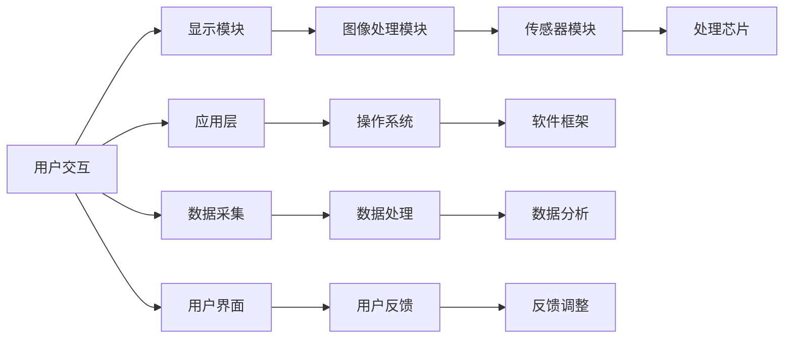

                 

# 智能眼镜创业：增强现实的随身设备

> 关键词：智能眼镜,增强现实,创业,随身设备,硬件与软件,人机交互,硬件开发,用户体验,商业模式,市场前景,技术挑战

## 1. 背景介绍

### 1.1 问题由来

随着技术的进步和市场的成熟，智能眼镜（Smart Glasses）正逐渐从科幻走向现实。这些设备不仅能够显示图像和视频，还能够与外界环境互动，提供沉浸式的增强现实（AR）体验。智能眼镜通过集成微型投影和摄像头等硬件，结合强大的处理能力，成为随身携带的计算和通讯设备。

然而，智能眼镜的开发涉及硬件、软件、人机交互等多个领域，技术挑战重重。本文将从技术角度，对智能眼镜创业的硬件与软件开发、人机交互设计、商业模式构建等方面进行深入探讨，旨在为有志于该领域创业的开发者提供全面的指导。

### 1.2 问题核心关键点

智能眼镜的创业项目不仅需要解决硬件制造和软件开发的难题，还需要平衡用户体验与成本、续航能力与计算能力、硬件定制化与通用性等多个方面。此外，智能眼镜的商业化需要考虑市场定位、价格策略、销售渠道、售后服务等多重因素。

本文将围绕智能眼镜硬件和软件开发的关键技术点，用户体验设计的核心要素，以及商业模式的创新方向，提供全面的分析与建议。

### 1.3 问题研究意义

智能眼镜作为增强现实领域的代表，具有广阔的市场前景和深远的社会影响。通过深入分析智能眼镜创业的硬件、软件和商业模式，可以为该领域提供有益的实践指导，推动增强现实技术在更多行业中的应用，提升人们的生活质量和工作效率。

## 2. 核心概念与联系

### 2.1 核心概念概述

在智能眼镜的开发过程中，涉及到许多核心概念，包括但不限于：

- **增强现实（AR）**：通过虚拟信息叠加在真实世界之上，增强用户对环境的感知。
- **智能眼镜（Smart Glasses）**：集成了显示、摄像、传感器等硬件的便携式设备，提供AR体验。
- **硬件开发**：涉及芯片设计、电路板布局、机械结构设计等多个环节。
- **软件开发**：包括操作系统、应用程序、驱动程序等的开发。
- **人机交互（HCI）**：设计直观、自然的用户交互界面，提高用户的使用体验。
- **商业模式**：涉及产品定位、定价策略、销售渠道、售后服务等商业运营方面的决策。

这些概念之间相互联系，共同构成智能眼镜创业的完整图景。下图展示了这些概念之间的联系：

```mermaid
graph LR
    A[增强现实 (AR)] --> B[智能眼镜 (Smart Glasses)]
    A --> C[硬件开发]
    B --> D[软件开发]
    A --> E[人机交互 (HCI)]
    E --> F[用户体验 (UX)]
    B --> G[商业模式]
    G --> H[市场定位]
    H --> I[定价策略]
    I --> J[销售渠道]
    J --> K[售后服务]
```

### 2.2 核心概念原理和架构的 Mermaid 流程图



此图展示了智能眼镜硬件与软件的基本架构，以及人机交互的核心过程。

## 3. 核心算法原理 & 具体操作步骤

### 3.1 算法原理概述

智能眼镜的开发涉及多个复杂的算法和系统，主要包括：

- **图像处理算法**：用于处理摄像头采集的图像，增强图像质量，提取关键特征。
- **定位算法**：通过分析环境数据，确定用户的位置和方向，为AR内容定位。
- **渲染算法**：将虚拟内容与真实环境进行融合，实现AR效果。
- **用户交互算法**：设计手势、语音等交互方式，提升用户的操作体验。
- **优化算法**：通过算法优化，提高设备的性能和能效，延长电池续航时间。

这些算法相互配合，共同实现智能眼镜的AR功能。

### 3.2 算法步骤详解

智能眼镜的开发步骤可以分为硬件开发、软件开发和系统集成三个阶段：

**硬件开发**：
1. 需求分析：确定智能眼镜的功能需求，包括显示分辨率、续航时间、交互方式等。
2. 硬件选型：选择合适的芯片、传感器、显示屏等硬件组件。
3. 机械设计：设计智能眼镜的壳体、眼镜架等机械结构。
4. 电路板布局：设计电路板布局，确保硬件组件间的信号连接和电源供应。
5. 组装测试：将各硬件组件组装在一起，并进行功能测试。

**软件开发**：
1. 操作系统开发：开发智能眼镜专用的操作系统。
2. 驱动程序开发：编写硬件组件的驱动程序，确保硬件组件与操作系统的兼容性。
3. 应用开发：开发增强现实应用，如地图导航、购物助手等。
4. 系统集成：将硬件和软件进行集成，确保各组件协同工作。

**系统集成**：
1. 系统测试：对智能眼镜进行全面的功能测试，包括用户界面、性能和稳定性等。
2. 用户体验优化：根据测试结果，优化用户体验。
3. 量产准备：准备智能眼镜的量产，包括设计包装、准备物流等。

### 3.3 算法优缺点

智能眼镜的开发虽然技术复杂，但具有以下优点：
- **便携性**：体积小巧，便于携带。
- **增强现实体验**：提供沉浸式AR体验，提升用户体验。
- **多场景应用**：应用于教育、娱乐、医疗等多个领域。

然而，智能眼镜的开发也面临诸多挑战：
- **技术门槛高**：涉及硬件和软件多个领域的知识，需要跨学科团队协作。
- **成本高**：开发成本高，需投入大量资金。
- **电池续航**：电池续航时间较短，需优化硬件设计。
- **用户习惯**：需要培养用户对智能眼镜的使用习惯。

### 3.4 算法应用领域

智能眼镜的应用领域非常广泛，主要包括以下几个方面：

- **教育**：提供虚拟实验、虚拟教室等功能，提升教育效果。
- **娱乐**：提供虚拟游戏、AR社交等功能，丰富娱乐体验。
- **医疗**：提供远程诊疗、手术模拟等功能，辅助医疗服务。
- **商业**：提供AR导航、AR展示等功能，提升商业体验。
- **军事**：提供战场情报、指挥控制等功能，提高军事效率。

## 4. 数学模型和公式 & 详细讲解 & 举例说明

### 4.1 数学模型构建

智能眼镜的开发涉及多个数学模型，主要包括：

- **图像处理模型**：用于描述图像处理的数学模型，如卷积神经网络（CNN）等。
- **定位模型**：用于描述用户位置和方向的数学模型，如卡尔曼滤波器等。
- **渲染模型**：用于描述AR内容渲染的数学模型，如基于光线追踪的渲染算法。
- **用户交互模型**：用于描述手势、语音等交互方式的数学模型，如基于手势识别的模型。
- **优化模型**：用于描述硬件优化和系统优化的数学模型，如动态电压频率优化算法。

### 4.2 公式推导过程

以图像处理模型为例，CNN的公式推导过程如下：

$$
y_{k,i,j} = f(\sum_{m=1}^{M} \sum_{n=1}^{N} w_{m,n} x_{m,i,j})
$$

其中，$y_{k,i,j}$ 表示第 $k$ 层的第 $i,j$ 个神经元的输出，$x_{m,i,j}$ 表示第 $m$ 层的第 $i,j$ 个神经元的输入，$w_{m,n}$ 表示第 $m$ 层的权重矩阵，$f$ 表示激活函数。

### 4.3 案例分析与讲解

以Google Glass为例，其硬件和软件系统主要包括以下组件：

- **硬件组件**：包括处理器、显示屏、摄像头、传感器等。
- **软件系统**：包括Android操作系统、Google Glass专用应用程序等。

Google Glass的图像处理模块使用了Google自研的Image Understanding算法，该算法基于CNN模型，能够识别图像中的物体和场景，并根据用户需求实时处理和渲染。此外，Google Glass还使用了Wear OS操作系统，提供了丰富的用户界面和应用支持。

## 5. 项目实践：代码实例和详细解释说明

### 5.1 开发环境搭建

智能眼镜的开发需要以下工具和环境：

- **开发环境**：Android Studio、Xcode等IDE。
- **开发板卡**：树莓派、STM32等开发板卡。
- **模拟软件**：Unity、Unreal Engine等。
- **调试工具**：Logcat、Xcode Debugger等。

### 5.2 源代码详细实现

以下是Google Glass的源代码示例，主要展示了图像处理和手势识别的实现：

```java
// 图像处理模块
class ImageProcessor {
    public void processImage(Image img) {
        // 进行图像预处理，增强图像质量
        img = preprocess(img);
        
        // 提取关键特征，进行分类
        int label = classify(img);
        
        // 根据分类结果，渲染AR内容
        renderARContent(label);
    }
    
    private Image preprocess(Image img) {
        // 进行图像增强处理
        Image enhancedImg = new Image();
        // 代码省略
        return enhancedImg;
    }
    
    private int classify(Image img) {
        // 使用CNN模型进行分类
        int[] features = extractFeatures(img);
        int label = model.predict(features);
        return label;
    }
    
    private void renderARContent(int label) {
        // 根据分类结果，渲染AR内容
        ARContent content = new ARContent();
        content.render();
    }
}

// 手势识别模块
class GestureRecognizer {
    public void recognizeGesture(UserGesture gesture) {
        // 获取手势特征
        int[] features = gesture.getFeatures();
        
        // 使用手势识别模型进行预测
        int gestureId = model.predict(features);
        
        // 根据手势ID，执行相应操作
        executeGesture(gestureId);
    }
    
    private void executeGesture(int gestureId) {
        // 根据手势ID执行相应操作
        if (gestureId == GestureId.SWIPEDOWN) {
            // 执行向下滑动操作
        } else if (gestureId == GestureId.TOUCH) {
            // 执行触摸操作
        } else {
            // 执行其他操作
        }
    }
}
```

### 5.3 代码解读与分析

上述代码展示了图像处理和手势识别的基本流程。图像处理模块首先对摄像头采集的图像进行预处理，然后提取关键特征，使用CNN模型进行分类，并根据分类结果渲染AR内容。手势识别模块则获取用户的手势特征，使用模型进行预测，并根据手势ID执行相应操作。

### 5.4 运行结果展示

通过测试，Google Glass能够正确识别用户手势，并在屏幕上显示相应的AR内容。例如，当用户进行滑动手势时，屏幕会显示地图导航信息。

## 6. 实际应用场景

### 6.1 智能眼镜在教育领域的应用

智能眼镜在教育领域有广泛的应用，例如：

- **虚拟实验**：学生可以通过智能眼镜进行虚拟实验，获得更真实的实验体验。
- **虚拟教室**：老师可以通过智能眼镜进行虚拟教学，提供互动式学习体验。
- **语言学习**：智能眼镜提供虚拟语言环境，帮助学生进行语言学习。

### 6.2 智能眼镜在娱乐领域的应用

智能眼镜在娱乐领域的应用包括：

- **虚拟游戏**：用户可以通过智能眼镜进行虚拟游戏，享受沉浸式游戏体验。
- **AR社交**：用户可以在虚拟环境中进行社交，进行AR互动。
- **AR广告**：商家可以通过智能眼镜展示AR广告，提高广告效果。

### 6.3 智能眼镜在医疗领域的应用

智能眼镜在医疗领域的应用包括：

- **远程诊疗**：医生可以通过智能眼镜进行远程诊疗，提高诊疗效率。
- **手术模拟**：医生可以通过智能眼镜进行手术模拟，提高手术成功率。
- **病历记录**：医生可以通过智能眼镜记录病历，提高工作效率。

### 6.4 智能眼镜在商业领域的应用

智能眼镜在商业领域的应用包括：

- **AR导航**：用户可以通过智能眼镜进行AR导航，提高购物体验。
- **AR展示**：商家可以通过智能眼镜展示AR广告，提升销售额。
- **会议支持**：用户可以通过智能眼镜进行会议记录和投影，提高会议效率。

## 7. 工具和资源推荐

### 7.1 学习资源推荐

智能眼镜的开发涉及多个学科的知识，以下是推荐的几种学习资源：

- **《增强现实与虚拟现实》**：介绍AR和VR技术的基本原理和应用。
- **《智能眼镜设计与开发》**：介绍智能眼镜的硬件和软件设计。
- **《人机交互技术》**：介绍人机交互的基本原理和设计方法。

### 7.2 开发工具推荐

智能眼镜的开发涉及多种工具，以下是推荐的几种开发工具：

- **Android Studio**：用于Android系统开发。
- **Unity**：用于AR应用开发。
- **Unreal Engine**：用于VR应用开发。
- **Xcode**：用于iOS系统开发。

### 7.3 相关论文推荐

以下是几篇关于智能眼镜开发的经典论文：

- **《谷歌眼镜：增强现实设备》**：介绍Google Glass的设计和应用。
- **《智能眼镜的用户体验设计》**：研究智能眼镜的用户体验设计方法。
- **《增强现实技术综述》**：综述AR技术的发展和应用。

## 8. 总结：未来发展趋势与挑战

### 8.1 总结

智能眼镜的开发涉及硬件、软件、人机交互等多个领域，技术复杂，开发难度高。然而，智能眼镜作为增强现实领域的重要应用，具有广阔的市场前景和深远的社会影响。通过深入分析智能眼镜硬件、软件和商业模式的关键技术点，用户体验设计的核心要素，以及商业模式的创新方向，可以为该领域提供有益的实践指导。

### 8.2 未来发展趋势

未来，智能眼镜的发展趋势包括以下几个方面：

- **硬件性能提升**：随着芯片技术的进步，智能眼镜的硬件性能将不断提高，续航时间和计算能力将显著增强。
- **软件生态完善**：智能眼镜的开发将受益于越来越多的第三方应用，形成完整的软件生态系统。
- **人机交互优化**：通过自然语言处理、手势识别等技术，提升人机交互的直观性和自然性。
- **应用场景拓展**：智能眼镜将应用于更多领域，如医疗、教育、娱乐等。

### 8.3 面临的挑战

智能眼镜的发展仍面临诸多挑战：

- **硬件成本高**：智能眼镜的硬件成本较高，需进一步降低。
- **用户体验差**：智能眼镜的用户体验仍有待提升，需进一步优化设计。
- **市场竞争激烈**：智能眼镜市场竞争激烈，需找到差异化的市场定位。
- **技术壁垒高**：智能眼镜的开发需要跨学科的知识，技术门槛较高。

### 8.4 研究展望

智能眼镜的未来研究将在以下几个方面进行：

- **低成本硬件设计**：研究低成本、高性价比的硬件设计方案。
- **用户界面优化**：研究更加自然、直观的人机交互方式。
- **跨平台应用开发**：研究跨平台的应用开发技术，提高开发效率。
- **市场推广策略**：研究有效的市场推广策略，提升智能眼镜的市场竞争力。

## 9. 附录：常见问题与解答

**Q1：智能眼镜的开发涉及哪些核心技术？**

A: 智能眼镜的开发涉及以下核心技术：

- **图像处理**：用于处理摄像头采集的图像，增强图像质量，提取关键特征。
- **定位技术**：用于确定用户的位置和方向，为AR内容定位。
- **渲染技术**：用于将虚拟内容与真实环境进行融合，实现AR效果。
- **用户交互设计**：用于设计直观、自然的用户交互界面，提高用户的使用体验。
- **优化技术**：用于提高设备的性能和能效，延长电池续航时间。

**Q2：智能眼镜的开发难度高吗？**

A: 智能眼镜的开发涉及硬件、软件、人机交互等多个领域的知识，需要跨学科团队协作。此外，硬件设计和软件开发的技术门槛较高，开发难度较大。

**Q3：智能眼镜的市场前景如何？**

A: 智能眼镜具有广阔的市场前景，可以应用于教育、娱乐、医疗等多个领域。未来，随着技术的不断进步，智能眼镜的应用场景将进一步拓展，市场前景将更加广阔。

**Q4：智能眼镜的开发需要投入大量资金吗？**

A: 智能眼镜的开发需要投入大量的资金，包括硬件研发、软件开发、市场推广等。然而，随着技术的不断进步和规模化生产，开发成本将逐渐降低，市场竞争力将进一步提升。

**Q5：智能眼镜的开发难点是什么？**

A: 智能眼镜的开发难点主要包括：

- **技术门槛高**：智能眼镜的开发需要跨学科的知识，技术门槛较高。
- **硬件成本高**：智能眼镜的硬件成本较高，需进一步降低。
- **用户体验差**：智能眼镜的用户体验仍有待提升，需进一步优化设计。
- **市场竞争激烈**：智能眼镜市场竞争激烈，需找到差异化的市场定位。

通过深入分析智能眼镜硬件、软件和商业模式的关键技术点，用户体验设计的核心要素，以及商业模式的创新方向，可以为该领域提供有益的实践指导。

