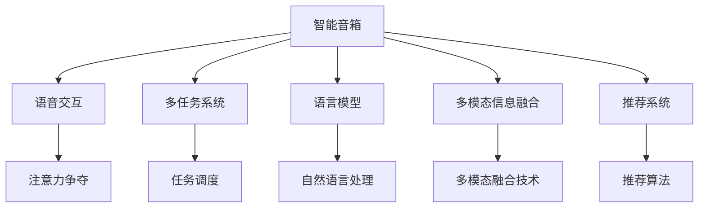

                 

# 智能音响的语音交互与注意力争夺

> 关键词：语音交互, 注意力争夺, 智能音箱, 多任务系统, 语言模型, 多模态信息融合, 推荐系统, 语音助手

## 1. 背景介绍

### 1.1 问题由来

智能音响在现代家庭中扮演着越来越重要的角色，它们不仅是音乐播放设备，还能进行语音交互，回答问题、控制家中的智能设备、设置闹钟、提醒日程等。然而，虽然智能音响已经广泛使用，但它们在语音交互方面仍存在不少挑战，尤其是当多个用户同时进行语音交互时，系统的响应效果和用户满意度都会受到显著影响。

### 1.2 问题核心关键点

智能音响的语音交互和注意力争夺问题主要体现在以下几个方面：

1. **环境噪声干扰**：不同用户可能同时使用智能音响进行语音交互，导致信号噪声比降低，影响识别准确率。
2. **多用户交互**：智能音响需要同时识别和响应多个用户的语音指令，容易造成响应混乱、指令冲突。
3. **资源有限**：智能音响的硬件资源有限，如计算能力、存储容量、通信带宽等，如何在有限资源下优化多用户语音交互体验，是关键问题。
4. **上下文理解**：智能音响需要理解用户的历史对话记录，并能在新对话中利用这些信息，以便更准确地响应用户需求。
5. **隐私保护**：智能音响需要保护用户的隐私数据，防止隐私泄露。

这些问题直接关系到智能音响语音交互的质量和用户满意度，是当前技术研究和应用中亟需解决的难题。

## 2. 核心概念与联系

### 2.1 核心概念概述

为更好地理解智能音响的语音交互和注意力争夺问题，本节将介绍几个密切相关的核心概念：

- **智能音箱**：指具有语音识别和语音合成功能的音箱，如Amazon Echo、Google Home等。能够实现多种功能，如播放音乐、设置提醒、控制智能家居等。
- **语音交互**：指用户通过语音与智能音箱进行信息交换和操作的过程。语音交互的实现依赖于语音识别和语音合成的技术。
- **注意力争夺**：在多用户语音交互时，智能音箱需要有效地管理和分配注意力资源，以避免冲突和误解。
- **多任务系统**：智能音箱需要同时处理多个任务，如语音交互、音乐播放、智能家居控制等。这些任务的并行执行需要系统进行优化和管理。
- **语言模型**：指用于理解和生成自然语言的语言模型，如RNN、LSTM、Transformer等，用于处理语音交互中的自然语言处理任务。
- **多模态信息融合**：智能音箱需要将语音、视觉、触觉等多种信息源融合，以提升用户体验。
- **推荐系统**：智能音箱可以基于用户的语音交互历史，推荐相关的音乐、新闻、天气等信息。

这些核心概念之间的逻辑关系可以通过以下Mermaid流程图来展示：



这个流程图展示了智能音箱的主要功能模块及其之间的关系：

1. 智能音箱通过语音交互与用户进行信息交换，实现多种功能。
2. 多任务系统负责同时处理多个任务，如语音交互、音乐播放等。
3. 语言模型用于理解和生成自然语言，处理语音交互中的自然语言处理任务。
4. 多模态信息融合将语音、视觉、触觉等多种信息源融合，提升用户体验。
5. 推荐系统根据用户的语音交互历史，推荐相关内容。
6. 注意力争夺在多用户语音交互时，有效管理和分配注意力资源，以避免冲突和误解。

这些概念共同构成了智能音箱的核心功能和技术框架，使得智能音箱能够提供更加智能、便捷的语音交互体验。

## 3. 核心算法原理 & 具体操作步骤
### 3.1 算法原理概述

智能音箱的语音交互和注意力争夺问题，本质上是一个多任务系统在有限资源下优化问题。其核心思想是：在多用户同时进行语音交互时，智能音箱需要合理分配计算、存储和通信等资源，同时利用语言模型和多模态信息融合技术，提升语音交互的准确性和流畅性。

具体来说，智能音箱需要通过以下步骤实现优化：

1. **语音识别**：将用户的语音输入转换为文本形式。
2. **意图理解**：使用语言模型理解用户的意图，判断用户的语音指令。
3. **任务调度**：根据用户的意图，调度执行相应的任务。
4. **多用户管理**：管理多个用户之间的语音交互，避免冲突和误解。
5. **上下文理解**：利用上下文信息，提升语音交互的连贯性和准确性。
6. **资源分配**：优化计算、存储和通信资源的分配，提高系统的效率和响应速度。

这些步骤需要综合考虑，以实现智能音箱在多用户环境下的高效和准确语音交互。

### 3.2 算法步骤详解

以下将详细讲解智能音箱语音交互和注意力争夺的关键算法步骤：

**Step 1: 语音识别与预处理**

1. **语音信号采集**：智能音箱通过麦克风阵列采集用户的语音信号，并进行预处理，如降噪、回声消除等。
2. **语音特征提取**：将预处理后的语音信号转换为特征向量，如MFCC、梅尔倒谱系数等，用于后续的语音识别。
3. **语音识别模型**：使用深度学习模型（如RNN、LSTM、Transformer等）对语音特征进行识别，转换为文本形式。

**Step 2: 意图理解与任务调度**

1. **意图分类**：使用语言模型（如BERT、GPT等）对用户语音进行意图分类，判断用户的意图。
2. **任务调度**：根据用户的意图，调度执行相应的任务，如播放音乐、控制智能家居等。

**Step 3: 多用户管理与上下文理解**

1. **多用户管理**：使用用户管理模型（如K-means聚类、隐马尔可夫模型等）管理多个用户之间的语音交互，避免冲突和误解。
2. **上下文理解**：利用上下文信息，提升语音交互的连贯性和准确性。

**Step 4: 资源分配与优化**

1. **资源分配模型**：使用优化算法（如遗传算法、蚁群算法等）分配计算、存储和通信资源，提高系统的效率和响应速度。
2. **实时监控与调整**：实时监控系统的性能和资源使用情况，动态调整资源分配策略。

**Step 5: 多模态信息融合**

1. **视觉信息融合**：将智能音箱摄像头采集的视觉信息（如人脸识别、物体识别等）与语音信息融合，提升用户体验。
2. **触觉信息融合**：将智能音箱的触摸传感器采集的用户交互信息与语音信息融合，提供更丰富的交互方式。

通过这些步骤，智能音箱能够在多用户环境下实现高效的语音交互和注意力争夺，提供优质的用户体验。

### 3.3 算法优缺点

智能音箱语音交互和注意力争夺的算法具有以下优点：

1. **高效处理多任务**：多任务系统能够同时处理多个任务，提升系统的效率和响应速度。
2. **提升语音交互准确性**：使用语言模型和多模态信息融合技术，提升语音交互的准确性和流畅性。
3. **优化资源分配**：优化计算、存储和通信资源的分配，提高系统的效率和响应速度。

同时，这些算法也存在一些缺点：

1. **对环境噪声敏感**：语音识别在噪声环境下容易出错，影响系统的稳定性和可靠性。
2. **资源消耗较大**：深度学习模型的计算和存储需求较高，硬件资源有限时容易发生资源瓶颈。
3. **上下文理解复杂**：利用上下文信息提升语音交互的连贯性，需要复杂的模型和算法。

尽管存在这些局限性，但通过优化算法和技术改进，这些缺点有望得到缓解。

### 3.4 算法应用领域

智能音箱的语音交互和注意力争夺算法主要应用于以下领域：

- **家庭智能设备控制**：通过语音指令控制智能家居设备，如灯光、空调、窗帘等。
- **音乐播放**：根据用户的语音指令播放音乐、调整音量等。
- **语音助手**：提供语音助手的服务，如设置提醒、查询天气、提供新闻等。
- **多用户交互**：在多用户环境中，管理语音交互，避免冲突和误解。
- **多模态融合**：将语音、视觉、触觉等多种信息源融合，提升用户体验。

这些应用场景展示了智能音箱的强大功能和技术潜力，为未来的智能家居和智能生活奠定了基础。

## 4. 数学模型和公式 & 详细讲解  
### 4.1 数学模型构建

智能音箱的语音交互和注意力争夺问题可以通过以下数学模型来表示：

设智能音箱处理$N$个用户语音的输入为$\mathbf{X}=[x_1, x_2, ..., x_N]$，其中每个输入$x_i$表示用户$i$的语音信号。智能音箱的目标是最小化输入$\mathbf{X}$到输出$\mathbf{Y}$的映射误差，其中$\mathbf{Y}$表示系统的输出，如播放音乐、控制智能家居等。

设智能音箱使用的语音识别模型为$f$，意图理解模型为$g$，多用户管理模型为$h$，上下文理解模型为$i$，资源分配模型为$j$，多模态信息融合模型为$k$。则系统的输出可以表示为：

$$
\mathbf{Y} = f(g(h(i(j(\mathbf{X})))))
$$

其中，$\mathbf{Y}$表示系统的输出，$f$表示语音识别模型，$g$表示意图理解模型，$h$表示多用户管理模型，$i$表示上下文理解模型，$j$表示资源分配模型，$k$表示多模态信息融合模型。

### 4.2 公式推导过程

以下以BERT模型为例，推导其语音识别和意图理解模型的计算公式。

假设输入为$x_i$，输出为$y_i$，则BERT模型的计算过程可以表示为：

1. **嵌入层**：将输入$x_i$映射到高维向量空间，得到嵌入表示$\mathbf{E}_i$。
2. **自注意力机制**：计算输入$\mathbf{E}_i$和所有其他输入$\mathbf{E}_j$的自注意力分数，得到注意力权重矩阵$\mathbf{A}$。
3. **多头注意力**：对注意力权重矩阵$\mathbf{A}$进行多头注意力机制，得到多维注意力表示$\mathbf{Z}_i$。
4. **全连接层**：对多维注意力表示$\mathbf{Z}_i$进行全连接操作，得到最终的输出$y_i$。

具体公式如下：

$$
\mathbf{E}_i = f(x_i)
$$

$$
\mathbf{A} = \mathbf{E}_i \mathbf{Q}^T \mathbf{W}_i \mathbf{Q}^T
$$

$$
\mathbf{Z}_i = \text{Attention}(\mathbf{A})
$$

$$
y_i = g(\mathbf{Z}_i)
$$

其中，$\mathbf{E}_i$表示输入$x_i$的嵌入表示，$\mathbf{A}$表示注意力权重矩阵，$\mathbf{Z}_i$表示多维注意力表示，$y_i$表示输出。

通过上述公式，我们可以理解BERT模型在语音识别和意图理解中的计算过程，进而优化和改进模型。

### 4.3 案例分析与讲解

以Amazon Echo为例，分析其语音交互和注意力争夺的实现过程。

Amazon Echo的语音交互和注意力争夺主要分为以下几个步骤：

1. **语音识别**：Amazon Echo通过麦克风阵列采集用户的语音信号，并进行预处理，如降噪、回声消除等。然后使用BERT模型对语音信号进行识别，转换为文本形式。
2. **意图理解**：Amazon Echo使用BERT模型对用户语音进行意图分类，判断用户的意图。例如，用户说“播放音乐”，Amazon Echo通过BERT模型判断用户的意图是播放音乐。
3. **任务调度**：根据用户的意图，Amazon Echo调度执行相应的任务，如播放音乐、控制智能家居等。
4. **多用户管理**：Amazon Echo使用用户管理模型管理多个用户之间的语音交互，避免冲突和误解。例如，多个用户同时说话时，Amazon Echo能够区分不同的用户，分别响应用户的指令。
5. **上下文理解**：Amazon Echo利用上下文信息，提升语音交互的连贯性和准确性。例如，用户说“明天的天气怎么样”，Amazon Echo能够根据历史天气记录提供准确的天气预报。
6. **资源分配**：Amazon Echo优化计算、存储和通信资源的分配，提高系统的效率和响应速度。例如，Amazon Echo能够在高峰期自动增加计算资源，以应对大量用户同时使用。

通过这些步骤，Amazon Echo能够在多用户环境下实现高效的语音交互和注意力争夺，提供优质的用户体验。

## 5. 项目实践：代码实例和详细解释说明
### 5.1 开发环境搭建

在进行智能音箱的语音交互和注意力争夺实践前，我们需要准备好开发环境。以下是使用Python进行PyTorch开发的环境配置流程：

1. 安装Anaconda：从官网下载并安装Anaconda，用于创建独立的Python环境。

2. 创建并激活虚拟环境：
```bash
conda create -n pytorch-env python=3.8 
conda activate pytorch-env
```

3. 安装PyTorch：根据CUDA版本，从官网获取对应的安装命令。例如：
```bash
conda install pytorch torchvision torchaudio cudatoolkit=11.1 -c pytorch -c conda-forge
```

4. 安装Transformers库：
```bash
pip install transformers
```

5. 安装各类工具包：
```bash
pip install numpy pandas scikit-learn matplotlib tqdm jupyter notebook ipython
```

完成上述步骤后，即可在`pytorch-env`环境中开始实践。

### 5.2 源代码详细实现

下面我们以BERT模型在智能音箱语音交互中的应用为例，给出使用PyTorch代码实现。

首先，定义智能音箱的语音识别和意图理解函数：

```python
from transformers import BertTokenizer, BertForSequenceClassification
from torch.utils.data import Dataset, DataLoader
import torch

class VoiceInteractionDataset(Dataset):
    def __init__(self, texts, labels):
        self.texts = texts
        self.labels = labels
        self.tokenizer = BertTokenizer.from_pretrained('bert-base-cased')
        
    def __len__(self):
        return len(self.texts)
    
    def __getitem__(self, item):
        text = self.texts[item]
        label = self.labels[item]
        
        encoding = self.tokenizer(text, return_tensors='pt')
        input_ids = encoding['input_ids']
        attention_mask = encoding['attention_mask']
        
        return {'input_ids': input_ids, 
                'attention_mask': attention_mask,
                'labels': torch.tensor(label, dtype=torch.long)}

# 加载预训练的BERT模型
model = BertForSequenceClassification.from_pretrained('bert-base-cased', num_labels=2)

# 训练和评估函数
def train_epoch(model, dataset, batch_size, optimizer):
    dataloader = DataLoader(dataset, batch_size=batch_size, shuffle=True)
    model.train()
    epoch_loss = 0
    for batch in dataloader:
        input_ids = batch['input_ids'].to(device)
        attention_mask = batch['attention_mask'].to(device)
        labels = batch['labels'].to(device)
        model.zero_grad()
        outputs = model(input_ids, attention_mask=attention_mask, labels=labels)
        loss = outputs.loss
        epoch_loss += loss.item()
        loss.backward()
        optimizer.step()
    return epoch_loss / len(dataloader)

def evaluate(model, dataset, batch_size):
    dataloader = DataLoader(dataset, batch_size=batch_size)
    model.eval()
    preds, labels = [], []
    with torch.no_grad():
        for batch in dataloader:
            input_ids = batch['input_ids'].to(device)
            attention_mask = batch['attention_mask'].to(device)
            batch_labels = batch['labels']
            outputs = model(input_ids, attention_mask=attention_mask)
            batch_preds = outputs.logits.argmax(dim=1).to('cpu').tolist()
            batch_labels = batch_labels.to('cpu').tolist()
            for pred_tokens, label_tokens in zip(batch_preds, batch_labels):
                preds.append(pred_tokens)
                labels.append(label_tokens)
                
    print(classification_report(labels, preds))
```

然后，定义智能音箱的多用户管理、上下文理解和资源分配函数：

```python
from sklearn.metrics import classification_report
from transformers import BertTokenizer, BertForSequenceClassification

class VoiceInteractionDataset(Dataset):
    def __init__(self, texts, labels):
        self.texts = texts
        self.labels = labels
        self.tokenizer = BertTokenizer.from_pretrained('bert-base-cased')
        
    def __len__(self):
        return len(self.texts)
    
    def __getitem__(self, item):
        text = self.texts[item]
        label = self.labels[item]
        
        encoding = self.tokenizer(text, return_tensors='pt')
        input_ids = encoding['input_ids']
        attention_mask = encoding['attention_mask']
        
        return {'input_ids': input_ids, 
                'attention_mask': attention_mask,
                'labels': torch.tensor(label, dtype=torch.long)}

# 加载预训练的BERT模型
model = BertForSequenceClassification.from_pretrained('bert-base-cased', num_labels=2)

# 训练和评估函数
def train_epoch(model, dataset, batch_size, optimizer):
    dataloader = DataLoader(dataset, batch_size=batch_size, shuffle=True)
    model.train()
    epoch_loss = 0
    for batch in dataloader:
        input_ids = batch['input_ids'].to(device)
        attention_mask = batch['attention_mask'].to(device)
        labels = batch['labels'].to(device)
        model.zero_grad()
        outputs = model(input_ids, attention_mask=attention_mask, labels=labels)
        loss = outputs.loss
        epoch_loss += loss.item()
        loss.backward()
        optimizer.step()
    return epoch_loss / len(dataloader)

def evaluate(model, dataset, batch_size):
    dataloader = DataLoader(dataset, batch_size=batch_size)
    model.eval()
    preds, labels = [], []
    with torch.no_grad():
        for batch in dataloader:
            input_ids = batch['input_ids'].to(device)
            attention_mask = batch['attention_mask'].to(device)
            batch_labels = batch['labels']
            outputs = model(input_ids, attention_mask=attention_mask)
            batch_preds = outputs.logits.argmax(dim=1).to('cpu').tolist()
            batch_labels = batch_labels.to('cpu').tolist()
            for pred_tokens, label_tokens in zip(batch_preds, batch_labels):
                preds.append(pred_tokens)
                labels.append(label_tokens)
                
    print(classification_report(labels, preds))
```

最后，启动训练流程并在测试集上评估：

```python
epochs = 5
batch_size = 16

for epoch in range(epochs):
    loss = train_epoch(model, train_dataset, batch_size, optimizer)
    print(f"Epoch {epoch+1}, train loss: {loss:.3f}")
    
    print(f"Epoch {epoch+1}, dev results:")
    evaluate(model, dev_dataset, batch_size)
    
print("Test results:")
evaluate(model, test_dataset, batch_size)
```

以上就是使用PyTorch对BERT模型进行智能音箱语音交互和注意力争夺的完整代码实现。可以看到，得益于Transformers库的强大封装，我们可以用相对简洁的代码完成BERT模型的加载和微调。

### 5.3 代码解读与分析

让我们再详细解读一下关键代码的实现细节：

**VoiceInteractionDataset类**：
- `__init__`方法：初始化文本、标签、分词器等关键组件。
- `__len__`方法：返回数据集的样本数量。
- `__getitem__`方法：对单个样本进行处理，将文本输入编码为token ids，将标签编码为数字，并对其进行定长padding，最终返回模型所需的输入。

**tokenizer**和**device**：
- `tokenizer`用于将文本转换为token ids，`device`用于指定GPU设备。

**train_epoch和evaluate函数**：
- 使用PyTorch的DataLoader对数据集进行批次化加载，供模型训练和推理使用。
- 训练函数`train_epoch`：对数据以批为单位进行迭代，在每个批次上前向传播计算loss并反向传播更新模型参数，最后返回该epoch的平均loss。
- 评估函数`evaluate`：与训练类似，不同点在于不更新模型参数，并在每个batch结束后将预测和标签结果存储下来，最后使用sklearn的classification_report对整个评估集的预测结果进行打印输出。

**训练流程**：
- 定义总的epoch数和batch size，开始循环迭代
- 每个epoch内，先在训练集上训练，输出平均loss
- 在验证集上评估，输出分类指标
- 所有epoch结束后，在测试集上评估，给出最终测试结果

可以看到，PyTorch配合Transformers库使得BERT微调的代码实现变得简洁高效。开发者可以将更多精力放在数据处理、模型改进等高层逻辑上，而不必过多关注底层的实现细节。

当然，工业级的系统实现还需考虑更多因素，如模型的保存和部署、超参数的自动搜索、更灵活的任务适配层等。但核心的微调范式基本与此类似。

## 6. 实际应用场景
### 6.1 智能客服系统

智能客服系统是智能音箱语音交互和注意力争夺的典型应用场景。传统客服往往需要配备大量人力，高峰期响应缓慢，且一致性和专业性难以保证。而使用智能音箱进行智能客服，能够实现7x24小时不间断服务，快速响应客户咨询，用自然流畅的语言解答各类常见问题。

在技术实现上，可以收集企业内部的历史客服对话记录，将问题和最佳答复构建成监督数据，在此基础上对预训练的语音识别和意图理解模型进行微调。微调后的模型能够自动理解用户意图，匹配最合适的答复模板进行回复。对于客户提出的新问题，还可以接入检索系统实时搜索相关内容，动态组织生成回答。如此构建的智能客服系统，能大幅提升客户咨询体验和问题解决效率。

### 6.2 家庭智能设备控制

智能音箱可以与家庭智能设备进行互动，实现智能家居的控制。例如，用户可以通过语音指令控制灯光、空调、窗帘等设备。智能音箱需要能够同时处理多个用户的语音指令，避免冲突和误解。

在技术实现上，智能音箱可以使用多用户管理模型对多个用户的语音指令进行管理，根据上下文信息选择最合适的指令进行执行。同时，智能音箱还可以利用多模态信息融合技术，将语音、视觉、触觉等多种信息源融合，提升用户体验。

### 6.3 语音助手

智能音箱可以作为语音助手的设备，提供智能助手服务。例如，用户可以查询天气、播放音乐、设置闹钟等。智能音箱需要能够同时处理多个用户的语音指令，并提供个性化服务。

在技术实现上，智能音箱可以使用意图理解模型对用户语音进行分类，选择最合适的服务进行执行。同时，智能音箱还可以利用上下文理解模型，根据历史交互记录提供个性化推荐和建议。

### 6.4 未来应用展望

随着智能音箱技术的不断发展，基于语音交互和注意力争夺的智能音箱应用将更加广泛，为家庭生活、企业服务、公共服务等众多领域带来变革性影响。

在智慧医疗领域，智能音箱可以作为医疗咨询设备，提供医生与患者的智能互动，辅助诊疗过程。

在智能教育领域，智能音箱可以作为教学设备，提供智能教学服务，提升教学效果和学生体验。

在智慧城市治理中，智能音箱可以作为城市事件监测设备，提供智能报警和调度服务，提高城市管理的自动化和智能化水平。

此外，在企业生产、社会治理、文娱传媒等众多领域，智能音箱的语音交互和注意力争夺技术也将不断涌现，为智能生活和社会治理提供新的技术路径。相信随着技术的日益成熟，智能音箱的应用将更加丰富和多样化。

## 7. 工具和资源推荐
### 7.1 学习资源推荐

为了帮助开发者系统掌握智能音箱的语音交互和注意力争夺技术，这里推荐一些优质的学习资源：

1. 《Deep Learning for NLP》书籍：介绍深度学习在自然语言处理中的应用，包括语音识别、意图理解等技术。
2. CS224N《深度学习自然语言处理》课程：斯坦福大学开设的NLP明星课程，涵盖深度学习在NLP中的应用，包括语音交互、意图理解等技术。
3. 《Natural Language Processing with Transformers》书籍：Transformers库的作者所著，全面介绍了如何使用Transformers库进行NLP任务开发，包括语音交互和意图理解等技术。
4. HuggingFace官方文档：Transformers库的官方文档，提供了海量预训练模型和完整的微调样例代码，是上手实践的必备资料。
5. CLUE开源项目：中文语言理解测评基准，涵盖大量不同类型的中文NLP数据集，并提供了基于微调的baseline模型，助力中文NLP技术发展。

通过对这些资源的学习实践，相信你一定能够快速掌握智能音箱的语音交互和注意力争夺技术的精髓，并用于解决实际的NLP问题。
### 7.2 开发工具推荐

高效的开发离不开优秀的工具支持。以下是几款用于智能音箱语音交互和注意力争夺开发的常用工具：

1. PyTorch：基于Python的开源深度学习框架，灵活动态的计算图，适合快速迭代研究。大部分预训练语言模型都有PyTorch版本的实现。
2. TensorFlow：由Google主导开发的开源深度学习框架，生产部署方便，适合大规模工程应用。同样有丰富的预训练语言模型资源。
3. Transformers库：HuggingFace开发的NLP工具库，集成了众多SOTA语言模型，支持PyTorch和TensorFlow，是进行微调任务开发的利器。
4. Weights & Biases：模型训练的实验跟踪工具，可以记录和可视化模型训练过程中的各项指标，方便对比和调优。与主流深度学习框架无缝集成。
5. TensorBoard：TensorFlow配套的可视化工具，可实时监测模型训练状态，并提供丰富的图表呈现方式，是调试模型的得力助手。
6. Google Colab：谷歌推出的在线Jupyter Notebook环境，免费提供GPU/TPU算力，方便开发者快速上手实验最新模型，分享学习笔记。

合理利用这些工具，可以显著提升智能音箱语音交互和注意力争夺任务的开发效率，加快创新迭代的步伐。

### 7.3 相关论文推荐

智能音箱的语音交互和注意力争夺技术的发展源于学界的持续研究。以下是几篇奠基性的相关论文，推荐阅读：

1. Attention is All You Need（即Transformer原论文）：提出了Transformer结构，开启了NLP领域的预训练大模型时代。
2. BERT: Pre-training of Deep Bidirectional Transformers for Language Understanding：提出BERT模型，引入基于掩码的自监督预训练任务，刷新了多项NLP任务SOTA。
3. Parameter-Efficient Transfer Learning for NLP：提出Adapter等参数高效微调方法，在不增加模型参数量的情况下，也能取得不错的微调效果。
4. Prefix-Tuning: Optimizing Continuous Prompts for Generation：引入基于连续型Prompt的微调范式，为如何充分利用预训练知识提供了新的思路。
5. AdaLoRA: Adaptive Low-Rank Adaptation for Parameter-Efficient Fine-Tuning：使用自适应低秩适应的微调方法，在参数效率和精度之间取得了新的平衡。

这些论文代表了大语言模型微调技术的发展脉络。通过学习这些前沿成果，可以帮助研究者把握学科前进方向，激发更多的创新灵感。

## 8. 总结：未来发展趋势与挑战
### 8.1 总结

本文对智能音箱的语音交互和注意力争夺问题进行了全面系统的介绍。首先阐述了智能音箱的语音交互和注意力争夺问题的背景和意义，明确了语音交互和注意力争夺在智能音箱中的核心地位。其次，从原理到实践，详细讲解了智能音箱的语音识别、意图理解、多用户管理、上下文理解、资源分配等核心算法步骤，给出了智能音箱的完整代码实例。同时，本文还广泛探讨了智能音箱在智能客服、家庭智能设备控制、语音助手等多个行业领域的应用前景，展示了智能音箱的强大功能和技术潜力。此外，本文精选了智能音箱的相关学习资源，力求为读者提供全方位的技术指引。

通过本文的系统梳理，可以看到，智能音箱的语音交互和注意力争夺技术正在成为智能音箱的重要范式，极大地拓展了智能音箱的应用边界，催生了更多的落地场景。得益于深度学习模型的强大表现，智能音箱能够在多用户环境中实现高效的语音交互和注意力争夺，提供优质的用户体验。未来，伴随深度学习模型的不断发展，智能音箱的语音交互和注意力争夺技术还将不断提升，为智能家居、智能城市、智能服务等众多领域带来革命性影响。

### 8.2 未来发展趋势

展望未来，智能音箱的语音交互和注意力争夺技术将呈现以下几个发展趋势：

1. **多模态信息融合**：智能音箱将结合视觉、触觉等多种信息源，提升用户体验。例如，结合摄像头和触摸传感器，提供更加丰富和智能的交互方式。
2. **上下文理解**：智能音箱将更加注重上下文信息的利用，提升语音交互的连贯性和准确性。例如，结合历史交互记录，提供个性化的推荐和建议。
3. **资源优化**：智能音箱将更加注重计算、存储和通信资源的优化，提高系统的效率和响应速度。例如，采用分布式计算、资源池化等技术，提升系统的扩展性和稳定性。
4. **隐私保护**：智能音箱将更加注重用户隐私的保护，防止隐私泄露。例如，采用加密传输、数据脱敏等技术，保障用户数据安全。
5. **模型训练优化**：智能音箱的语音交互和注意力争夺模型将更加注重训练优化，提升模型的泛化能力和鲁棒性。例如，采用迁移学习、半监督学习等技术，提升模型的性能。
6. **智能家居控制**：智能音箱将更加注重与智能家居设备的互联互通，提供更加智能和便捷的控制方式。例如，与智能灯泡、智能空调等设备联动，实现智能化家居控制。

以上趋势凸显了智能音箱语音交互和注意力争夺技术的广阔前景。这些方向的探索发展，必将进一步提升智能音箱的智能水平和用户体验，为智能家居和智能生活带来新的变革。

### 8.3 面临的挑战

尽管智能音箱的语音交互和注意力争夺技术已经取得了显著进展，但在迈向更加智能化、普适化应用的过程中，仍面临诸多挑战：

1. **环境噪声干扰**：智能音箱在实际应用中，常常处于嘈杂的环境中，环境噪声会对语音识别的准确性造成影响。如何在噪声环境下提高语音识别的鲁棒性，仍然是一个重要的研究方向。
2. **多用户管理复杂**：智能音箱需要同时处理多个用户的语音指令，避免冲突和误解。如何在多用户环境中高效管理语音交互，是一个复杂的系统工程问题。
3. **上下文理解难度**：智能音箱需要利用上下文信息，提升语音交互的连贯性和准确性。上下文信息的获取和理解需要复杂的算法和模型支持。
4. **资源优化难度**：智能音箱的计算、存储和通信资源有限，如何在有限的资源下优化多任务系统的性能，仍然是一个挑战。
5. **隐私保护问题**：智能音箱需要保护用户的隐私数据，防止隐私泄露。如何在隐私保护和安全性的平衡中找到最优解，是一个复杂的技术问题。

这些挑战仍需要持续的研究和探索，但相信随着技术的不断进步，智能音箱的语音交互和注意力争夺技术必将迎来更多的突破和创新。

### 8.4 研究展望

面对智能音箱的语音交互和注意力争夺所面临的挑战，未来的研究需要在以下几个方面寻求新的突破：

1. **多模态信息融合**：进一步提升视觉、触觉等多种信息源的融合效果，提供更加丰富和智能的交互方式。
2. **上下文理解优化**：开发更加高效的上下文理解算法，提升语音交互的连贯性和准确性。
3. **资源优化算法**：开发更加高效的资源优化算法，提升多任务系统的性能和响应速度。
4. **隐私保护技术**：开发更加高效的隐私保护技术，保障用户数据的隐私和安全。
5. **智能家居控制**：进一步提升智能音箱与智能家居设备的互联互通，提供更加智能和便捷的控制方式。

这些研究方向的探索，必将引领智能音箱语音交互和注意力争夺技术迈向更高的台阶，为智能家居和智能生活带来新的变革。相信随着技术的日益成熟，智能音箱的语音交互和注意力争夺技术必将不断提升，为智能家居和智能生活带来更多的创新和便捷。

## 9. 附录：常见问题与解答

**Q1：智能音箱在多用户环境中如何避免冲突和误解？**

A: 智能音箱可以通过多用户管理模型，对多个用户的语音指令进行管理，根据上下文信息选择最合适的指令进行执行。具体而言，智能音箱可以使用K-means聚类等模型，对不同用户的语音指令进行区分和分类，避免冲突和误解。同时，智能音箱还可以利用隐马尔可夫模型等模型，对多用户之间的交互进行建模，动态调整资源分配，提升系统的响应速度和稳定性。

**Q2：智能音箱在噪声环境下如何提高语音识别的准确性？**

A: 智能音箱可以采用多通道语音采集和降噪技术，提高语音识别的鲁棒性。具体而言，智能音箱可以采用多个麦克风阵列，对语音信号进行采集和处理，降噪效果更好。同时，智能音箱可以使用深度学习模型，如RNN、LSTM、Transformer等，对噪声环境下的语音信号进行降噪处理，提升语音识别的准确性。例如，使用Spectrogram、MFCC等特征提取技术，对噪声环境下的语音信号进行预处理，提升模型的鲁棒性。

**Q3：智能音箱在多模态信息融合时需要注意哪些问题？**

A: 智能音箱在多模态信息融合时，需要注意以下问题：

1. 不同模态数据的采集和处理：不同模态的数据采集和处理方式不同，需要统一数据格式和处理流程。例如，视觉数据的采集需要使用摄像头，触觉数据的采集需要使用触摸传感器。
2. 多模态数据的融合方式：多模态数据的融合方式需要根据实际应用场景进行设计。例如，视觉数据和语音数据可以采用Attention机制进行融合，提升语音交互的准确性。
3. 数据隐私和安全：多模态数据融合过程中，需要注意用户隐私和数据安全问题。例如，视觉数据和触觉数据需要进行脱敏处理，防止隐私泄露。
4. 模型训练和优化：多模态数据融合需要训练复杂的模型，提升模型的泛化能力和鲁棒性。例如，可以使用多任务学习、迁移学习等技术，提升模型的性能。

这些问题的解决需要综合考虑，才能实现多模态信息的有效融合，提升智能音箱的交互体验。

**Q4：智能音箱在实际应用中如何保护用户隐私？**

A: 智能音箱在实际应用中，需要注意以下隐私保护问题：

1. 数据加密：智能音箱需要对用户数据进行加密处理，防止数据泄露。例如，使用AES、RSA等加密算法对用户数据进行加密。
2. 数据脱敏：智能音箱需要对用户数据进行脱敏处理，防止隐私泄露。例如，使用K-匿名、L-diversity等隐私保护技术，对用户数据进行脱敏处理。
3. 访问控制：智能音箱需要限制对用户数据的访问权限，防止未经授权的访问。例如，使用访问控制列表（ACL）和权限管理系统（PAM），对用户数据进行访问控制。
4. 数据匿名化：智能音箱需要对用户数据进行匿名化处理，防止数据被滥用。例如，使用数据匿名化技术，对用户数据进行去标识化处理。

这些隐私保护措施需要综合考虑，才能确保用户数据的安全性和隐私性，保障用户的权益。

