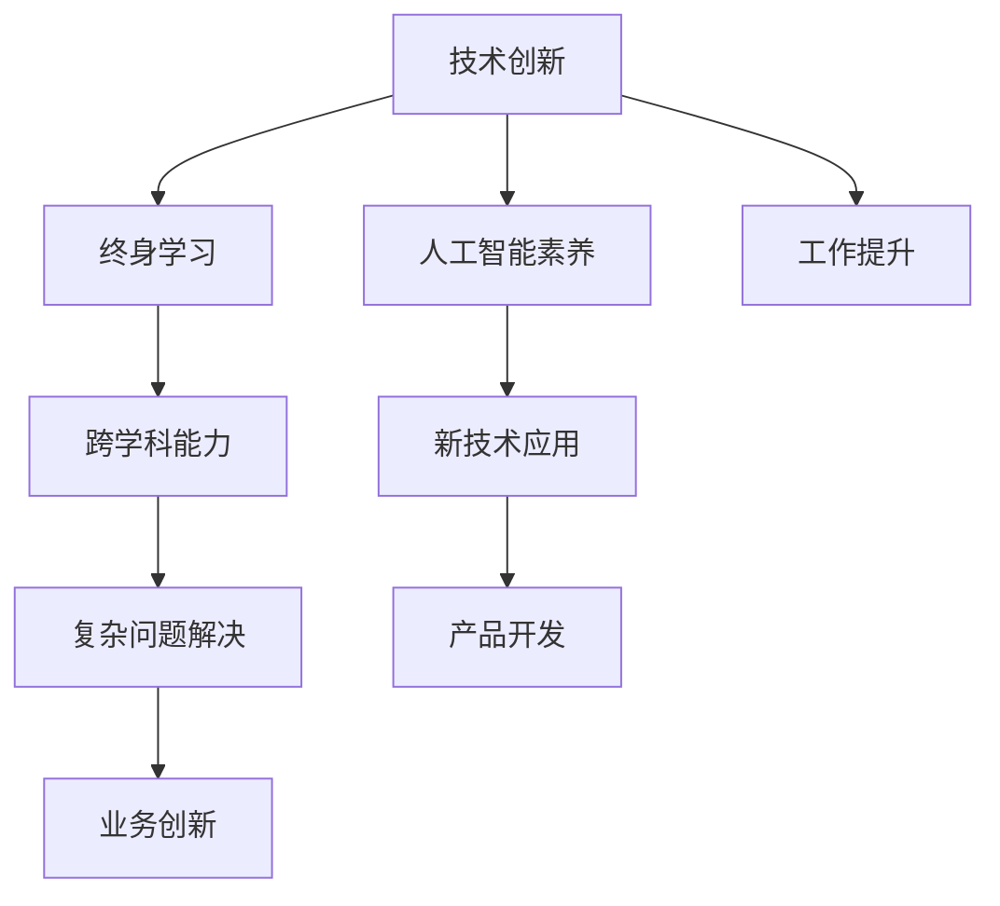

                 

# 未来工作：技能需求与培养

> 关键词：技能需求, 技术创新, 终身学习, 跨学科, 人工智能

## 1. 背景介绍

### 1.1 问题由来
随着人工智能技术的飞速发展，尤其是深度学习和大数据的广泛应用，未来工作的环境和要求发生了巨大变化。技术的革新不断催生出新的职业岗位，同时，对现有岗位的技能要求也在不断提升。如何在变化莫测的技术浪潮中保持竞争力，成为一个重要的议题。

### 1.2 问题核心关键点
未来工作技能需求的核心关键点主要包括：
- **技术创新**：掌握新兴技术如人工智能、大数据、区块链等，并具备创新思维和解决复杂问题的能力。
- **终身学习**：在快速变化的技术环境中，持续学习新技术，保持知识和技能的更新。
- **跨学科能力**：具备跨领域知识，能够综合运用不同学科的技术和理论。
- **人工智能素养**：理解人工智能的基本原理和应用场景，能够设计、开发和优化人工智能系统。

### 1.3 问题研究意义
研究和分析未来工作技能需求及其培养，对于个体职业发展、企业人才储备和教育体系改革都具有重要意义：
- **个体发展**：帮助个人明确技术发展方向，制定学习计划，提升核心竞争力。
- **企业人才**：指导企业识别和培养关键技术人才，提升整体技术水平和创新能力。
- **教育改革**：推动教育体系向终身学习和跨学科教育转型，培养适应未来社会需求的人才。

## 2. 核心概念与联系

### 2.1 核心概念概述

要理解未来工作的技能需求及其培养，首先需要明晰几个关键概念：

- **技术创新**：指在新技术、新方法、新工具的应用和开发中展现出的创新能力。
- **终身学习**：指个体持续地、有计划地、系统性地学习新知识和技能，以适应不断变化的工作环境和市场需求。
- **跨学科能力**：指能够综合运用不同学科的知识和技能，解决复杂问题，并形成跨领域合作的能力。
- **人工智能素养**：指对人工智能技术的基本了解和应用能力，包括理解其工作原理、应用场景和伦理挑战。

这些概念之间的联系可以通过以下Mermaid流程图来展示：



这个流程图展示了一系列概念之间的联系：技术创新推动个体持续学习，终身学习提升跨学科能力，跨学科能力增强人工智能素养，而人工智能素养支持新技术的应用和复杂问题的解决，最终促进业务创新和产品开发。

## 3. 核心算法原理 & 具体操作步骤

### 3.1 算法原理概述

未来工作技能需求的培养，其核心算法原理可归纳为以下三个方面：
1. **个性化学习路径的构建**：利用推荐系统技术，根据个体的学习历史、兴趣和能力，推荐个性化的学习内容。
2. **跨学科知识的融合**：通过多学科的知识图谱和跨学科课程的设计，帮助学习者形成系统的跨学科知识体系。
3. **持续评估与反馈**：利用学习分析技术，实时评估学习者的学习进度和效果，提供及时反馈，调整学习计划。

### 3.2 算法步骤详解

基于上述原理，未来工作技能培养的算法步骤主要包括以下几个方面：

**Step 1: 数据收集与预处理**
- 收集个体的学习历史、兴趣、能力、知识结构等数据。
- 进行数据清洗和预处理，确保数据的准确性和完整性。

**Step 2: 个性化学习路径构建**
- 使用协同过滤、内容推荐等技术，构建个性化的学习路径。
- 根据学习者的学习进度和效果，动态调整推荐内容，优化学习路径。

**Step 3: 跨学科知识融合**
- 设计和实施跨学科课程，涵盖多个学科的知识和技能。
- 利用知识图谱技术，帮助学习者理解不同学科之间的关联和应用场景。

**Step 4: 持续评估与反馈**
- 使用学习分析工具，实时监测学习者的学习行为和效果。
- 根据评估结果，提供个性化反馈，调整学习策略和内容。

### 3.3 算法优缺点

未来工作技能培养的算法具有以下优点：
1. **个性化高效**：通过个性化的学习路径和内容推荐，最大化学习效率。
2. **跨学科融合**：帮助学习者形成系统的跨学科知识体系，提升综合能力。
3. **持续改进**：实时评估和反馈机制，确保学习效果的最大化。

同时，也存在以下缺点：
1. **数据隐私**：收集和处理个人数据可能涉及隐私问题，需确保数据安全。
2. **技术复杂**：需要高级的数据分析和推荐系统技术，技术门槛较高。
3. **资源消耗**：持续的评估和反馈需要大量计算资源，可能影响系统性能。

### 3.4 算法应用领域

未来工作技能培养的算法已在多个领域得到了广泛应用，如：
- **教育培训**：在线教育平台、企业培训系统等，帮助学习者个性化学习。
- **职业发展**：职业规划平台、技能提升课程等，帮助职场人士提升技能。
- **人力资源管理**：员工学习管理系统、人才评估工具等，提升企业人才储备和培养效率。

## 4. 数学模型和公式 & 详细讲解 & 举例说明

### 4.1 数学模型构建

未来工作技能培养的数学模型构建，主要涉及推荐系统、知识图谱和学习分析三个方面：

- **推荐系统模型**：
  - 协同过滤：基于用户和项目相似度进行推荐，公式为：
    $$
    p(i|u) = \frac{e^{\hat{r}_{ui}}}{\sum_{j=1}^{n} e^{\hat{r}_{uj}}}
    $$
  - 内容推荐：利用内容特征进行推荐，公式为：
    $$
    p(i|u) = \frac{e^{\sum_{j=1}^{d} \alpha_j a_j \times b_j}}{\sum_{j=1}^{d} e^{\sum_{j=1}^{d} \alpha_j a_j \times b_j}}
    $$

- **知识图谱模型**：
  - 本体论：构建领域知识图谱，描述实体和关系的本体论模型。
  - 推理机制：利用图谱进行实体和关系推理，提升跨学科知识的融合。

- **学习分析模型**：
  - 学习行为分析：分析学习者的行为数据，提取学习特征。
  - 效果评估：利用评估指标，如学习进度、知识掌握度、技能提升等，评估学习效果。

### 4.2 公式推导过程

以协同过滤为例，推荐系统公式推导如下：
1. 假设用户 $u$ 对项目 $i$ 的评分 $r_{ui}$ 可表示为：
   $$
   r_{ui} = \theta_u \cdot X_i + \varepsilon_{ui}
   $$
   其中 $\theta_u$ 和 $X_i$ 分别为用户和项目的特征向量，$\varepsilon_{ui}$ 为误差项。
2. 利用训练数据 $D$ 求解用户-项目相似度 $\hat{r}_{ui}$，公式为：
   $$
   \hat{r}_{ui} = \theta_u \cdot X_i
   $$
3. 利用 $\hat{r}_{ui}$ 进行推荐，公式为：
   $$
   p(i|u) = \frac{e^{\hat{r}_{ui}}}{\sum_{j=1}^{n} e^{\hat{r}_{uj}}}
   $$

### 4.3 案例分析与讲解

以企业培训系统的个性化学习路径构建为例，分析如下：

**案例背景**：某大型企业希望通过培训系统提升员工的技能水平。

**解决方案**：
1. 收集员工的学习历史、工作表现、能力评估等数据。
2. 利用协同过滤和内容推荐技术，为每位员工构建个性化的学习路径，涵盖其核心岗位技能和公司业务需求。
3. 引入跨学科课程，涵盖数据科学、项目管理、人工智能等领域，帮助员工形成系统的跨学科知识体系。
4. 实时监测员工的学习进度和效果，提供个性化反馈，调整学习路径和内容。

**效果评估**：
1. 通过学习效果评估指标，如学习进度、知识掌握度、技能提升等，衡量培训系统的效果。
2. 定期进行员工满意度调查，了解员工对培训系统的反馈和建议。

## 5. 项目实践：代码实例和详细解释说明

### 5.1 开发环境搭建

在进行项目实践前，我们需要准备好开发环境。以下是使用Python进行PyTorch开发的环境配置流程：

1. 安装Anaconda：从官网下载并安装Anaconda，用于创建独立的Python环境。
2. 创建并激活虚拟环境：
```bash
conda create -n pytorch-env python=3.8 
conda activate pytorch-env
```
3. 安装PyTorch：根据CUDA版本，从官网获取对应的安装命令。例如：
```bash
conda install pytorch torchvision torchaudio cudatoolkit=11.1 -c pytorch -c conda-forge
```
4. 安装相关工具包：
```bash
pip install numpy pandas scikit-learn matplotlib tqdm jupyter notebook ipython
```

完成上述步骤后，即可在`pytorch-env`环境中开始项目实践。

### 5.2 源代码详细实现

以下是一个使用PyTorch实现推荐系统的代码实例：

```python
import torch
from torch import nn
from torch.utils.data import DataLoader
from torch.nn import functional as F
from sklearn.metrics import accuracy_score

# 定义推荐模型
class RecommendationModel(nn.Module):
    def __init__(self, n_users, n_items, n_features):
        super(RecommendationModel, self).__init__()
        self.user_fm = nn.Embedding(n_users, n_features)
        self.item_fm = nn.Embedding(n_items, n_features)
        self.interaction = nn.Linear(n_features, 1)

    def forward(self, user_ids, item_ids):
        user_feats = self.user_fm(user_ids)
        item_feats = self.item_fm(item_ids)
        interaction_feats = self.interaction(user_feats + item_feats)
        scores = torch.sigmoid(interaction_feats)
        return scores

# 加载数据集
users = [1, 2, 3, 4, 5]
items = [1, 2, 3, 4, 5]
ratings = [[5, 4, 1, 5, 2], [4, 2, 3, 1, 5], [1, 5, 4, 2, 3], [3, 1, 2, 5, 4], [2, 3, 1, 4, 5]]
user_ids, item_ids = torch.tensor(users).long(), torch.tensor(items).long()
ratings = torch.tensor(ratings).float()

# 构建模型和优化器
model = RecommendationModel(len(users), len(items), 5)
optimizer = torch.optim.Adam(model.parameters(), lr=0.001)

# 训练模型
def train(model, optimizer, data_loader, n_epochs):
    for epoch in range(n_epochs):
        for user_ids, item_ids in data_loader:
            scores = model(user_ids, item_ids)
            loss = F.binary_cross_entropy(scores, ratings)
            optimizer.zero_grad()
            loss.backward()
            optimizer.step()

# 测试模型
def test(model, data_loader):
    correct = 0
    total = 0
    with torch.no_grad():
        for user_ids, item_ids in data_loader:
            scores = model(user_ids, item_ids)
            _, predicted = scores.max(dim=1)
            total += ratings.size(0)
            correct += (predicted == ratings).float().sum().item()
    return accuracy_score(ratings, predicted)

# 创建数据集
dataset = torch.utils.data.TensorDataset(user_ids, item_ids, ratings)
dataloader = DataLoader(dataset, batch_size=8, shuffle=True)

# 训练模型
train(model, optimizer, dataloader, 10)

# 测试模型
print(f"Accuracy: {test(model, dataloader):.2f}")
```

### 5.3 代码解读与分析

让我们再详细解读一下关键代码的实现细节：

**RecommendationModel类**：
- `__init__`方法：定义模型的结构，包括用户特征嵌入层、物品特征嵌入层和交互层。
- `forward`方法：实现前向传播，计算模型的输出分数。

**train和test函数**：
- `train`函数：循环迭代训练模型，计算损失函数并反向传播更新参数。
- `test`函数：在测试集上评估模型的准确率。

**数据集构建**：
- 使用TensorDataset封装数据，方便进行批量加载。
- 使用DataLoader对数据进行批处理，确保模型可以高效地处理大量数据。

以上代码实例展示了如何使用PyTorch实现推荐系统的基本流程。开发者可以根据实际需求，进一步扩展和优化模型结构，引入更多复杂的技术，如知识图谱、深度学习等。

## 6. 实际应用场景

### 6.1 智能教育

智能教育是未来工作技能培养的重要应用场景。通过推荐系统、跨学科课程和学习分析技术，智能教育平台能够为学习者提供个性化、系统化的学习路径，提升学习效果。

具体而言，智能教育平台可以：
- 收集学生的学习历史、兴趣、能力等数据，构建个性化的学习路径。
- 提供跨学科课程，涵盖多个学科的知识和技能，提升学习者的综合能力。
- 实时监测学习进度和效果，提供个性化反馈，调整学习策略和内容。

### 6.2 企业培训

企业培训系统能够帮助企业识别和培养关键技术人才，提升整体技术水平和创新能力。

具体应用包括：
- 通过推荐系统，为员工推荐个性化的培训课程，提升技能水平。
- 引入跨学科课程，帮助员工形成系统的跨学科知识体系。
- 实时评估员工的学习进度和效果，提供个性化反馈，调整培训策略。

### 6.3 职业发展平台

职业发展平台通过推荐系统、跨学科课程和学习分析技术，帮助职场人士提升技能，实现职业发展。

具体应用包括：
- 收集用户的职业发展需求、学习历史、兴趣等数据，构建个性化的学习路径。
- 提供跨学科课程，涵盖不同领域的技能和知识，提升用户的综合能力。
- 实时监测用户的学习进度和效果，提供个性化反馈，调整学习策略。

### 6.4 未来应用展望

未来，基于推荐系统、知识图谱和学习分析的个性化技能培养将进一步普及。新技术和新方法的应用，将使得技能培养更加高效、智能和个性化。

具体展望包括：
- 多模态学习：融合视觉、听觉等多模态数据，提升学习效果。
- 自适应学习：根据学习者的反馈和表现，动态调整学习内容，提升学习效率。
- 在线协作：促进学习者之间的互动和合作，提升学习效果和体验。

## 7. 工具和资源推荐

### 7.1 学习资源推荐

为了帮助开发者系统掌握未来工作技能培养的理论基础和实践技巧，这里推荐一些优质的学习资源：

1. 《深度学习》系列书籍：由多位领域专家合著，全面介绍了深度学习的基本概念、算法和应用。
2. 《人工智能素养》在线课程：涵盖人工智能的基本原理、应用场景和伦理挑战，适合初学者和专业人士学习。
3. 《推荐系统》课程：由斯坦福大学开设的推荐系统课程，系统讲解了推荐系统的理论基础和实践技巧。
4. 《跨学科学习》课程：由麻省理工学院开设的跨学科课程，涵盖不同领域的知识和技术，适合有志于跨学科学习的人士。

### 7.2 开发工具推荐

高效的开发离不开优秀的工具支持。以下是几款用于未来工作技能培养开发的常用工具：

1. Jupyter Notebook：一个强大的交互式编程环境，适合进行数据分析和模型训练。
2. TensorBoard：TensorFlow配套的可视化工具，可实时监测模型训练状态，并提供丰富的图表呈现方式。
3. PyTorch：基于Python的开源深度学习框架，灵活动态的计算图，适合快速迭代研究。
4. Weights & Biases：模型训练的实验跟踪工具，可以记录和可视化模型训练过程中的各项指标。
5. Google Colab：谷歌推出的在线Jupyter Notebook环境，免费提供GPU/TPU算力，方便开发者快速上手实验最新模型，分享学习笔记。

### 7.3 相关论文推荐

未来工作技能培养的研究源于学界的持续研究。以下是几篇奠基性的相关论文，推荐阅读：

1. Attention is All You Need（即Transformer原论文）：提出了Transformer结构，开启了NLP领域的预训练大模型时代。
2. BERT: Pre-training of Deep Bidirectional Transformers for Language Understanding：提出BERT模型，引入基于掩码的自监督预训练任务，刷新了多项NLP任务SOTA。
3. Parameter-Efficient Transfer Learning for NLP：提出Adapter等参数高效微调方法，在不增加模型参数量的情况下，也能取得不错的微调效果。
4. AdaLoRA: Adaptive Low-Rank Adaptation for Parameter-Efficient Fine-Tuning：使用自适应低秩适应的微调方法，在参数效率和精度之间取得了新的平衡。
5. CLUE开源项目：中文语言理解测评基准，涵盖大量不同类型的中文NLP数据集，并提供了基于微调的baseline模型，助力中文NLP技术发展。

这些论文代表了大语言模型微调技术的发展脉络。通过学习这些前沿成果，可以帮助研究者把握学科前进方向，激发更多的创新灵感。

## 8. 总结：未来发展趋势与挑战

### 8.1 总结

本文对未来工作技能培养的方法进行了全面系统的介绍。首先阐述了未来工作技能需求的核心关键点，明确了技术创新、终身学习、跨学科能力和人工智能素养的重要意义。其次，从原理到实践，详细讲解了推荐系统、知识图谱和学习分析技术的算法步骤和具体实现，给出了详细的代码实例。同时，本文还广泛探讨了技能培养在教育、企业、职业发展等多个行业领域的应用前景，展示了技能培养范式的巨大潜力。

通过本文的系统梳理，可以看到，未来工作技能培养技术正在成为教育和企业培训的重要范式，极大地提升了学习效率和效果。得益于推荐系统、知识图谱和学习分析等技术的不断进步，未来技能培养必将变得更加高效、智能和个性化。

### 8.2 未来发展趋势

展望未来，未来工作技能培养技术将呈现以下几个发展趋势：

1. **智能化和自动化**：通过智能推荐系统、自适应学习等技术，提升技能培养的智能化水平，实现个性化的学习路径和内容。
2. **跨学科融合**：利用知识图谱和跨学科课程，帮助学习者形成系统的跨学科知识体系，提升综合能力。
3. **多模态学习**：融合视觉、听觉等多模态数据，提升学习效果和用户体验。
4. **持续评估与反馈**：实时监测学习进度和效果，提供个性化反馈，调整学习策略和内容。
5. **在线协作与互动**：促进学习者之间的互动和合作，提升学习效果和体验。
6. **自适应学习**：根据学习者的反馈和表现，动态调整学习内容和策略，提升学习效率。

这些趋势凸显了未来工作技能培养技术的广阔前景。这些方向的探索发展，必将进一步提升技能培养的效率和效果，为学习者提供更好的学习体验，推动社会的智能化转型。

### 8.3 面临的挑战

尽管未来工作技能培养技术已经取得了瞩目成就，但在迈向更加智能化、普适化应用的过程中，它仍面临着诸多挑战：

1. **数据隐私**：收集和处理个人数据可能涉及隐私问题，需确保数据安全。
2. **技术复杂**：需要高级的数据分析和推荐系统技术，技术门槛较高。
3. **资源消耗**：持续的评估和反馈需要大量计算资源，可能影响系统性能。
4. **跨学科知识整合**：不同学科之间的知识整合存在挑战，需要更多的技术和教育支持。
5. **技能应用实践**：如何将理论知识和技能应用于实际工作场景，还需更多的实践和经验积累。

### 8.4 研究展望

面对未来工作技能培养面临的挑战，未来的研究需要在以下几个方面寻求新的突破：

1. **技术创新与突破**：开发更加高效、智能的推荐系统和学习分析算法，提升技能培养的智能化和自动化水平。
2. **跨学科知识整合**：利用知识图谱和跨学科课程，帮助学习者形成系统的跨学科知识体系，提升综合能力。
3. **多模态学习**：融合视觉、听觉等多模态数据，提升学习效果和用户体验。
4. **持续评估与反馈**：实时监测学习进度和效果，提供个性化反馈，调整学习策略和内容。
5. **在线协作与互动**：促进学习者之间的互动和合作，提升学习效果和体验。
6. **自适应学习**：根据学习者的反馈和表现，动态调整学习内容和策略，提升学习效率。

这些研究方向将推动未来工作技能培养技术的不断进步，为构建更加智能化、普适化的学习环境奠定基础。通过多路径协同发力，我们相信未来工作技能培养技术必将为学习者提供更加丰富、高效、个性化的学习体验。

## 9. 附录：常见问题与解答

**Q1：未来工作技能培养是否适用于所有职业？**

A: 未来工作技能培养方法在大多数职业领域都有适用性，尤其适合需要持续学习、技能更新的岗位。但对于一些技能高度依赖特定领域知识和经验的工作，可能需要结合领域特定的方法和技术进行改进。

**Q2：如何选择合适的学习资源？**

A: 选择合适的学习资源需要考虑自身的职业背景、兴趣和学习目标。可以参考相关的课程、书籍、论文等资源，同时结合实际工作需求进行筛选。可以利用在线学习平台如Coursera、Udacity等，获取推荐的学习资源。

**Q3：未来工作技能培养的技术门槛高吗？**

A: 未来工作技能培养技术的确有一定的技术门槛，需要掌握推荐系统、知识图谱、学习分析等技术。可以通过自学、培训、参与项目等方式，逐步积累相关知识和技术。

**Q4：如何应对数据隐私问题？**

A: 数据隐私是未来工作技能培养中需要重点关注的问题。应采取数据加密、匿名化处理、访问控制等措施，确保数据的安全性和隐私保护。同时，建立透明的数据使用政策，向学习者解释数据的使用目的和范围。

**Q5：如何评估学习效果？**

A: 学习效果的评估可以从多个维度进行，如学习进度、知识掌握度、技能提升等。可以使用各种评估工具和指标，如测试题、项目评估、学习日志等，结合学习者的反馈进行综合评估。

---

作者：禅与计算机程序设计艺术 / Zen and the Art of Computer Programming

