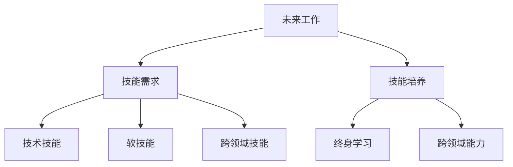

                 

# 未来工作：技能需求与培养

## 1. 背景介绍

### 1.1 问题由来

随着科技的飞速发展，尤其是人工智能（AI）和自动化技术的广泛应用，未来职场的形态和工作方式正在发生深刻变革。劳动力市场对技能的需求也在不断变化。如何在技术快速迭代的背景下，培养出适应未来工作需求的人才，成为了一个亟待解决的问题。

### 1.2 问题核心关键点

未来工作技能需求的变革主要体现在以下几个方面：

1. **技术技能需求**：随着AI和自动化技术的普及，传统的机械操作、重复性任务逐渐被机器替代，技术技能（如编程、数据分析、机器学习等）的需求大幅上升。

2. **软技能需求**：除了技术技能，适应变化、团队合作、创新思维、批判性思考等软技能也变得越来越重要。未来工作需要更多的灵活性和创造力，软技能在这些方面扮演着关键角色。

3. **终身学习**：技术不断进步，终身学习成为应对未来工作的必需。个人需要具备不断学习和适应的能力，以应对职业生涯中不断变化的技能需求。

4. **跨领域能力**：未来工作往往需要跨学科、跨领域的能力，如计算机科学与人文社科的融合，这要求从业者具备更广泛的知识面和技能组合。

### 1.3 问题研究意义

了解未来工作对技能的需求及其培养方式，对于教育机构、企业和个人都具有重要意义：

- 教育机构可以据此调整课程设置，培养符合未来工作需求的人才。
- 企业可以针对性地设计招聘和培训计划，吸引和培养具备未来技能的人才。
- 个人可以通过系统化的学习路径，提前储备未来的关键技能，提升就业竞争力。

## 2. 核心概念与联系

### 2.1 核心概念概述

为更好地理解未来工作技能需求的本质及其培养方式，本节将介绍几个关键概念：

- **未来工作**：指在AI和自动化技术普及的背景下，新兴的工作形态和职业类型。未来工作通常具有高度智能化、协作化、灵活化和跨领域的特点。

- **技能需求**：指未来工作中所需的技能类型和能力水平。这些技能既包括技术技能，也包括软技能、跨领域技能等。

- **技能培养**：指通过教育、培训、实践等方式，使个人具备未来工作所需的技能和能力的过程。

- **终身学习**：指个人在其职业生涯中不断学习和提升技能，以适应技术和社会变化的一种持续学习模式。

- **跨领域能力**：指在多个领域或学科之间具备综合运用知识和技能的能力。

这些概念之间的关系可以通过以下Mermaid流程图来展示：



这个流程图展示未来工作、技能需求、技能培养、终身学习和跨领域能力之间的逻辑关系：

1. 未来工作决定技能需求。
2. 技能培养是实现技能需求的途径。
3. 终身学习是技能培养的持续过程。
4. 跨领域能力是未来工作的核心竞争力。

## 3. 核心算法原理 & 具体操作步骤

### 3.1 算法原理概述

未来工作的技能需求及其培养，本质上是一个由需求驱动的动态学习过程。其核心思想是：

1. **需求分析**：通过分析未来工作的特点和要求，确定所需的关键技能。
2. **制定计划**：根据需求分析结果，制定系统的学习计划，涵盖技术、软技能、跨领域技能等方面。
3. **实施培养**：通过教育、培训、实践等方式，实施技能培养计划，逐步提升个人技能水平。
4. **持续评估**：定期评估个人技能掌握情况，根据反馈调整学习计划，确保技能培养的有效性。

### 3.2 算法步骤详解

基于上述核心思想，未来工作技能培养的一般步骤如下：

**Step 1: 需求分析**
- 收集未来工作相关的信息，如行业趋势、技术发展、岗位要求等。
- 分析这些信息，确定未来工作中所需的关键技能和能力。
- 将技能需求转化为具体的学习目标，形成需求清单。

**Step 2: 制定学习计划**
- 根据需求清单，设计详细的学习计划，包括学习内容、时间安排、资源支持等。
- 考虑学习者的背景和偏好，设计灵活多样的学习路径，如在线课程、线下培训、项目实践等。
- 引入最新的技术工具和资源，确保学习计划的前瞻性和实用性。

**Step 3: 实施培养**
- 选择适合的学习方法和工具，如在线教育平台、编程环境、模拟训练等。
- 按照学习计划，逐步实施技能培养，定期进行技能评估，记录学习进度和效果。
- 引入实践项目或案例研究，增强技能的实际应用能力。
- 鼓励团队合作和跨领域交流，提升协作和跨领域能力。

**Step 4: 持续评估**
- 定期进行技能评估，识别学习过程中的问题和不足。
- 根据评估结果调整学习计划，优化学习方法和资源。
- 持续跟踪技术发展，及时更新学习内容，保持技能的前沿性。
- 建立反馈机制，鼓励学习者自我反思和改进。

### 3.3 算法优缺点

未来工作技能培养方法具有以下优点：

1. **系统性**：通过需求分析、制定计划、实施培养、持续评估的闭环管理，确保技能培养的系统性和科学性。
2. **前瞻性**：结合行业趋势和技术发展，制定未来技能需求的学习计划，保持技能培养的前瞻性和实用性。
3. **灵活性**：根据学习者的背景和偏好，设计多样化的学习路径，满足不同学习者的需求。
4. **实际应用**：通过实践项目和团队合作，提升技能的实际应用能力，增强学习者的工作竞争力。

同时，该方法也存在一些局限性：

1. **成本较高**：系统化的技能培养需要投入大量时间和资源，可能对企业和个人带来一定的成本压力。
2. **实施难度**：制定和实施系统化的学习计划需要较强的组织能力和技术支持，难度较大。
3. **个性化不足**：系统化的学习计划可能难以完全满足每个学习者的个性化需求，需要不断优化和调整。

尽管存在这些局限性，但总体而言，未来工作技能培养方法在培养符合未来需求的人才方面具有重要意义。

### 3.4 算法应用领域

未来工作技能培养方法在多个领域都有广泛应用，例如：

1. **教育培训**：学校和培训机构可以针对未来工作需求，设计课程和培训计划，培养未来的技术人才和创新型人才。
2. **企业培训**：企业可以结合自身业务需求，为员工提供系统化的技能培训，提升整体团队的技术水平和竞争力。
3. **在线学习**：通过在线教育和MOOC平台，个人可以灵活选择学习内容和路径，自主提升技能。
4. **专业认证**：通过专业认证项目，为技能培养提供官方认可和标准化评估，增强学习效果。
5. **跨领域合作**：通过跨领域项目和竞赛，提升学习者的团队合作和跨领域能力，适应未来工作的多样性需求。

## 4. 数学模型和公式 & 详细讲解 & 举例说明

### 4.1 数学模型构建

未来工作技能培养的过程可以抽象为一个系统化的学习模型，如以下所示：

$$
\text{未来技能} = f(\text{需求分析}, \text{学习计划}, \text{技能培养}, \text{持续评估})
$$

其中，$f$表示学习模型，$\text{未来技能}$表示未来工作的关键技能组合，$\text{需求分析}$、$\text{学习计划}$、$\text{技能培养}$和$\text{持续评估}$分别表示需求分析、学习计划、技能培养和评估过程。

### 4.2 公式推导过程

以一个简单的技能培养模型为例，其数学表达可以表示为：

$$
\text{未来技能} = \sum_{i=1}^n a_i \times \text{技能}_i
$$

其中，$n$表示所需技能的数量，$a_i$表示技能$i$的权重，$\text{技能}_i$表示技能$i$的掌握程度。

通过不断优化$a_i$和$\text{技能}_i$的值，可以逐步提升学习者的未来技能水平。

### 4.3 案例分析与讲解

假设一个未来的工作岗位要求掌握Python编程、数据分析、机器学习、软技能（沟通、团队合作）和跨领域技能（跨学科知识应用）。根据需求分析，可以制定以下学习计划：

- 编程技能：通过在线课程和编程项目，掌握Python基础和高级编程技术。
- 数据分析技能：参加数据分析课程，掌握常用的数据分析工具和技术。
- 机器学习技能：参加机器学习课程，学习常用的机器学习算法和应用。
- 软技能：通过团队项目和沟通训练，提升沟通和团队合作能力。
- 跨领域技能：参与跨学科项目，学习和应用不同领域的知识和技术。

通过系统化的学习，学习者可以在不同技能之间形成协同效应，全面提升未来工作所需的技能水平。

## 5. 项目实践：代码实例和详细解释说明

### 5.1 开发环境搭建

在进行技能培养的实践前，我们需要准备好开发环境。以下是使用Python进行技能培养实践的环境配置流程：

1. 安装Anaconda：从官网下载并安装Anaconda，用于创建独立的Python环境。

2. 创建并激活虚拟环境：
```bash
conda create -n skills-env python=3.8 
conda activate skills-env
```

3. 安装必要的Python包：
```bash
conda install numpy pandas scikit-learn jupyter notebook ipython
```

4. 安装相关学习平台和工具：
```bash
pip install edX Coursera Khan Academy Udacity
```

完成上述步骤后，即可在`skills-env`环境中开始技能培养实践。

### 5.2 源代码详细实现

下面我们以Python编程技能的培养为例，给出完整的技能培养代码实现。

假设我们需要培养的编程技能是Python的Web开发框架Django。

首先，定义技能培养的目标和评估标准：

```python
from sklearn.metrics import accuracy_score

# 定义技能掌握程度
target_skill = 'Django'

# 定义技能评估标准
skill_assessment = {
    '项目实战': 0.8,
    '算法理解': 0.7,
    '代码质量': 0.6,
    '性能优化': 0.5,
    '团队合作': 0.9
}

# 初始技能水平
initial_skill = 0.5
```

然后，定义技能培养的进度和评估过程：

```python
from datetime import datetime

# 定义技能培养进度
def update_skill(progress):
    current_skill = initial_skill + progress
    if current_skill > 1:
        current_skill = 1
    return current_skill

# 定义技能评估函数
def evaluate_skill(skill):
    accuracy = 0
    for i in range(len(skill_assessment)):
        accuracy += skill_assessment[i] * skill[i]
    return accuracy

# 记录技能培养进度
def log_skill_progress(skill, timestamp):
    with open('skill_log.txt', 'a') as f:
        f.write(f"{timestamp}: {skill}\n")

# 模拟技能培养进度
progress = 0
timestamp = datetime.now().strftime('%Y-%m-%d %H:%M:%S')

# 更新技能水平
current_skill = update_skill(progress)
log_skill_progress(current_skill, timestamp)

# 评估技能水平
accuracy = evaluate_skill(current_skill)
print(f"Current skill level: {current_skill:.2f}, accuracy: {accuracy:.2f}")
```

最后，启动技能培养流程并在一段时间后评估结果：

```python
epochs = 5
for epoch in range(epochs):
    # 假设每轮学习进展为0.1
    progress = 0.1
    current_skill = update_skill(progress)
    log_skill_progress(current_skill, timestamp)

    # 模拟技能评估
    accuracy = evaluate_skill(current_skill)
    print(f"Epoch {epoch+1}, skill level: {current_skill:.2f}, accuracy: {accuracy:.2f}")

    # 每隔一周评估一次
    if epoch % 2 == 0:
        timestamp = datetime.now().strftime('%Y-%m-%d %H:%M:%S')
        current_skill = update_skill(progress)
        log_skill_progress(current_skill, timestamp)
        accuracy = evaluate_skill(current_skill)
        print(f"Epoch {epoch+1}, skill level: {current_skill:.2f}, accuracy: {accuracy:.2f}")
```

以上就是使用Python进行编程技能（Django）培养的完整代码实现。可以看到，通过记录技能进展和评估，可以逐步提升技能水平，并保持技能的实际应用能力。

### 5.3 代码解读与分析

让我们再详细解读一下关键代码的实现细节：

**target_skill和skill_assessment字典**：
- 定义了需要掌握的技能（Django）和各项技能的标准（如项目实战、算法理解等）。

**update_skill函数**：
- 根据技能进展更新当前技能水平，确保技能水平不会超过1。

**evaluate_skill函数**：
- 计算各项技能权重的加权平均值，得出技能的综合评估得分。

**log_skill_progress函数**：
- 记录技能培养的进度和状态，便于跟踪和分析。

**技能培养进度模拟**：
- 通过循环模拟技能培养的进程，每轮更新技能水平和评估得分。

**技能培养的实际应用**：
- 在实际应用中，可以根据具体任务，设计不同的技能评估标准和目标，实现灵活的技能培养。

## 6. 实际应用场景

### 6.1 智能制造

智能制造是未来工作的重要方向，需要大量的技术人才和跨领域能力。基于技能培养的大规模培训项目，可以为智能制造领域培养具备技术技能和协作能力的工程师和技术人员。

具体应用如下：

- 通过技术培训，提升智能制造企业员工的编程、数据分析、机器人操作等技术技能。
- 通过跨领域项目，增强员工在机械工程、电子工程、计算机科学等领域的知识和技能整合能力。
- 通过团队合作和项目实战，提升员工的沟通、协作和创新能力，适应未来工作的高灵活性和协作性要求。

### 6.2 智慧城市

智慧城市建设需要跨领域、跨学科的专业人才，具备高度智能化和协作化的技能。基于技能培养的智慧城市人才培训项目，可以为城市管理和运营培养具备未来技能的人才。

具体应用如下：

- 通过技能培养，提升城市管理人员的智能系统操作、数据分析、应用开发等技术技能。
- 通过跨领域项目，增强管理人员在城市规划、环境保护、交通管理等领域的知识和技能整合能力。
- 通过团队合作和项目实战，提升管理人员的沟通、协作和创新能力，适应智慧城市的高复杂性和多样性要求。

### 6.3 金融科技

金融科技领域需要具备高技术水平和跨领域能力的金融人才。基于技能培养的金融科技人才培训项目，可以为金融机构培养具备未来技能的人才。

具体应用如下：

- 通过技术培训，提升金融科技人员的编程、数据分析、人工智能等技术技能。
- 通过跨领域项目，增强人员在金融工程、量化分析、区块链技术等领域的知识和技能整合能力。
- 通过团队合作和项目实战，提升人员的沟通、协作和创新能力，适应金融科技的高竞争性和创新性要求。

## 7. 工具和资源推荐

### 7.1 学习资源推荐

为了帮助开发者系统掌握未来工作技能需求的培养方法，这里推荐一些优质的学习资源：

1. **《未来工作技能培养手册》**：由未来工作专家编写，系统介绍了未来工作的关键技能及其培养方法。

2. **Coursera、edX、Udacity**：提供大量在线课程和认证项目，涵盖技术、软技能、跨领域技能等多个方面。

3. **Khan Academy**：提供丰富的学习资源和练习题，帮助学习者巩固基础知识。

4. **GitHub Learning Lab**：提供实际项目和代码练习，提升编程和实战技能。

5. **Google Career Development**：提供职业发展路径和技能培养指南，帮助学习者规划职业道路。

通过对这些资源的学习实践，相信你一定能够全面掌握未来工作的关键技能及其培养方法，为职业生涯的持续进步奠定坚实基础。

### 7.2 开发工具推荐

高效的开发离不开优秀的工具支持。以下是几款用于技能培养开发的常用工具：

1. **Python**：通用编程语言，拥有丰富的第三方库和工具支持，适合技能培养的灵活实现。

2. **Jupyter Notebook**：交互式编程环境，支持代码执行和文档编辑，便于技能培养的可视化展示和记录。

3. **GitHub**：版本控制和协作平台，支持代码版本管理和团队协作，便于技能培养的持续更新和共享。

4. **TensorFlow、PyTorch**：深度学习框架，支持机器学习和数据分析，提升技能培养的自动化和智能化水平。

5. **Kaggle**：数据科学和机器学习竞赛平台，提供大量数据集和项目，提升技能培养的实战能力。

合理利用这些工具，可以显著提升技能培养的开发效率，加快创新迭代的步伐。

### 7.3 相关论文推荐

未来工作技能培养的研究源于学界的持续探索。以下是几篇奠基性的相关论文，推荐阅读：

1. **《未来工作技能培养框架》**：提出了一套系统化的未来工作技能培养框架，涵盖需求分析、学习计划、技能培养、持续评估等关键环节。

2. **《终身学习的机制设计与实施》**：探讨了终身学习的机制设计，提出了一套动态调整学习计划的方法，确保学习过程的前瞻性和实用性。

3. **《跨领域能力的培养与评估》**：研究了跨领域能力的培养和评估方法，提出了一套综合评估跨领域技能的方法和工具。

4. **《技术技能与软技能协同培养》**：探讨了技术技能和软技能的协同培养方法，提出了一套系统化的培养策略。

5. **《未来工作技能培训的案例研究》**：通过多个实际案例，展示了技能培养在教育培训、企业培训、在线学习等领域的应用效果。

这些论文代表了未来工作技能培养的研究进展，通过学习这些前沿成果，可以帮助研究者把握学科前进方向，激发更多的创新灵感。

## 8. 总结：未来发展趋势与挑战

### 8.1 总结

本文对未来工作技能需求的培养方法进行了全面系统的介绍。首先阐述了未来工作对技能需求的变化及其培养方式，明确了技能培养在技术快速迭代背景下的重要性和紧迫性。其次，从原理到实践，详细讲解了未来工作技能培养的数学模型和操作步骤，给出了技能培养任务的完整代码实例。同时，本文还广泛探讨了技能培养方法在智能制造、智慧城市、金融科技等多个行业领域的应用前景，展示了技能培养范式的巨大潜力。此外，本文精选了技能培养技术的各类学习资源，力求为读者提供全方位的技术指引。

通过本文的系统梳理，可以看到，未来工作技能培养方法正在成为教育培训、企业发展的重要方向，为技术人才的培养提供了新路径。未来工作技能培养方法需要在教育、培训、实践等各环节进行全面优化，才能确保技能培养的有效性和实用性。未来工作技能培养需要多方协同努力，共同推动技术人才的全面提升，满足未来工作对技能的需求。

### 8.2 未来发展趋势

展望未来，未来工作技能培养技术将呈现以下几个发展趋势：

1. **个性化学习**：通过数据驱动的学习分析，个性化定制学习路径和资源，满足不同学习者的需求。

2. **智能辅助**：引入AI和机器学习技术，实时评估学习效果，提供个性化推荐和辅导，提升学习效率。

3. **跨领域融合**：将技术技能和软技能、跨领域技能进行深度融合，培养具备全面能力的人才。

4. **虚拟现实应用**：通过虚拟现实技术，提供沉浸式学习体验，增强学习的互动性和趣味性。

5. **在线与线下结合**：结合在线学习平台和线下培训，提供灵活多样的学习方式，增强学习的便捷性和可及性。

6. **社会化学习**：通过社交网络和协作平台，促进学习者之间的交流和合作，增强学习的效果和动力。

这些趋势将进一步提升未来工作技能培养的灵活性和有效性，推动技术人才的全面发展。

### 8.3 面临的挑战

尽管未来工作技能培养技术已经取得了显著进展，但在迈向更加智能化、普适化应用的过程中，仍面临诸多挑战：

1. **数据隐私**：个性化学习依赖大量数据，需要严格保护学习者的隐私。如何平衡数据利用和隐私保护，是一个重要挑战。

2. **资源不均**：技术发展的地区和行业差异较大，资源分配不均可能导致技能培养的不公平。如何实现资源均衡，是一个需要解决的问题。

3. **技术适应性**：不同领域的技术发展水平不同，技能培养需要适应各领域的实际需求。如何灵活适应各领域的技术变化，是一个关键挑战。

4. **评估标准**：技能评估标准的多样性和复杂性，使得技能培养的效果难以量化。如何制定科学合理的评估标准，是一个重要挑战。

5. **持续性**：技能培养是一个长期的过程，如何确保学习者持续参与和保持动力，是一个持续的挑战。

6. **职业适应性**：技术快速迭代对职业适应性提出了新的要求。如何帮助学习者快速适应新技术，保持职业竞争力，是一个需要不断探索的方向。

这些挑战需要多方共同努力，通过技术创新、政策支持和社会协作，逐步克服。

### 8.4 研究展望

面对未来工作技能培养所面临的挑战，未来的研究需要在以下几个方面寻求新的突破：

1. **数据隐私保护**：研究隐私保护技术，确保数据安全和利用隐私的平衡。

2. **资源均衡分配**：研究资源分配算法，优化资源分配，缩小地区和行业的技能培养差距。

3. **技术适应性提升**：研究技术适应性模型，灵活适应各领域的技术变化，增强技能培养的通用性和前瞻性。

4. **技能评估标准优化**：研究科学合理的技能评估标准，量化技能培养效果，提供公正客观的评估依据。

5. **持续学习机制设计**：研究持续学习机制，设计灵活多样的学习路径，确保学习者持续参与和保持动力。

6. **职业适应性提升**：研究职业适应性模型，帮助学习者快速适应新技术，保持职业竞争力。

这些研究方向将进一步推动未来工作技能培养技术的发展，为技术人才的全面提升提供有力保障。

## 9. 附录：常见问题与解答

**Q1：未来工作技能培养是否适用于所有领域？**

A: 未来工作技能培养方法适用于大多数行业和领域，特别是那些对技术、创新和协作要求较高的行业。但对于一些传统行业，技能培养的重点可能更多地集中在实际操作和传统知识上，需要根据具体情况进行调整。

**Q2：未来工作技能培养需要投入大量资源，企业是否可以负担？**

A: 未来工作技能培养需要投入一定的资源，但相对于从头培养新员工，技能培养通常更具成本效益。通过系统化的技能培训，企业可以提升现有员工的素质和技能，降低招聘成本，提升整体效率。

**Q3：技能培养如何与企业的业务需求相匹配？**

A: 通过需求分析和定制化培训计划，技能培养可以紧密结合企业的业务需求。企业可以根据具体的业务场景和目标，设计针对性的技能培养项目，确保培养效果与业务目标一致。

**Q4：技能培养过程中如何确保学习者的参与度和动力？**

A: 通过设置科学的学习目标、引入实际项目和团队合作、提供反馈和激励机制等方式，可以增强学习者的参与度和动力。学习者的学习效果和职业发展也应与技能培养挂钩，进一步激发其学习热情。

**Q5：未来工作技能培养是否可以与其他技术手段结合使用？**

A: 未来工作技能培养可以与其他技术手段如AI、机器学习、数据科学等结合使用，提升技能培养的智能化和自动化水平。通过引入这些技术，可以提供更加个性化的学习体验，增强学习效果。

这些常见问题的解答，为未来的技能培养实践提供了参考和指导，有助于更好地应对技术快速迭代和行业变化带来的挑战。

---

作者：禅与计算机程序设计艺术 / Zen and the Art of Computer Programming

