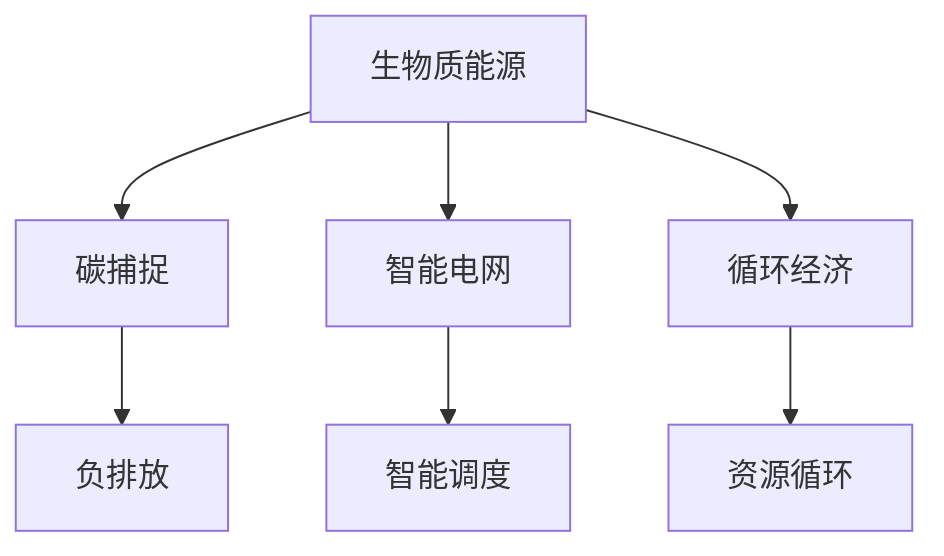

                 

# 未来的可持续发展：2050年的生物质能源与负排放技术

> 关键词：生物质能源, 负排放, 可持续发展, 绿色技术, 气候变化, 清洁能源, 碳中和, 碳捕捉, 循环经济, 智能电网, 生物技术

## 1. 背景介绍

### 1.1 问题由来
随着全球气候变化的日益严重，可持续发展已成为全人类面临的共同挑战。气候变化背后的主要原因是化石燃料的大量使用，导致大量温室气体排放，其中二氧化碳（CO2）是主要贡献者。为应对这一问题，全球各国正在积极寻找并推广清洁能源技术，其中生物质能源作为可再生能源的重要组成部分，在实现碳中和和负排放方面有着不可替代的作用。

### 1.2 问题核心关键点
生物质能源是指从有机物质中提取的能量，包括生物质燃料、生物质能、生物质原料等。它是一种低碳、可再生的能源形式，能够有效减少对化石燃料的依赖。负排放技术则是指通过生物质能源和碳捕捉技术，实现将大气中的CO2再次转化回有机物质，实现碳循环的闭合。这两者共同构成了未来可持续发展的核心技术支撑。

## 2. 核心概念与联系

### 2.1 核心概念概述

为了更好地理解生物质能源与负排放技术，本节将介绍几个密切相关的核心概念：

- **生物质能源（Biomass Energy）**：指通过生物质材料（如植物、动物尸体、废弃物等）转换为热能、电能、燃料等形式的能源。
- **负排放（Negative Emissions）**：指通过技术手段，实现将大气中的CO2转化为有机物质的过程，如通过生物质能源的碳捕捉与封存。
- **碳捕捉与封存（Carbon Capture and Storage, CCS）**：指通过技术手段捕获工业排放的CO2，并将其长期封存在地下或其他不易释放的环境中。
- **碳中和（Carbon Neutrality）**：指通过减少温室气体排放和增加CO2吸收，实现总体碳排放的零增长。
- **循环经济（Circular Economy）**：指通过产品、材料和信息的持续使用，减少废弃物排放，实现资源的循环利用。
- **智能电网（Smart Grid）**：指利用信息技术和物联网技术，实现能源的高效管理和调度。

这些概念之间的逻辑关系可以通过以下Mermaid流程图来展示：



这个流程图展示了大语言模型的核心概念及其之间的关系：

1. 生物质能源通过碳捕捉技术实现负排放。
2. 智能电网和循环经济通过优化资源使用，进一步降低碳排放。
3. 智能电网和循环经济相辅相成，共同促进可持续发展。

## 3. 核心算法原理 & 具体操作步骤
### 3.1 算法原理概述

生物质能源与负排放技术的核心算法原理可以概括为以下几个方面：

- **生物质能源生产**：主要通过生物质材料的化学或物理转化过程，产生热能、电能或燃料。常用的生物质能源生产技术包括厌氧消化、热解、气化等。
- **碳捕捉**：通常通过化学吸收、物理吸附、膜分离等技术，将工业排放的CO2从烟气中捕获。
- **负排放**：将捕获的CO2通过生物质材料（如植物、微生物等）进行转化，重新生成有机物质。

### 3.2 算法步骤详解

以下将详细讲解生物质能源生产、碳捕捉、负排放等核心算法的详细步骤：

**生物质能源生产步骤**：
1. **原料收集**：收集各种生物质材料，如农作物废弃物、林业剩余物、城市有机废弃物等。
2. **预处理**：对原料进行干燥、粉碎等预处理，以提高转化效率。
3. **转化过程**：根据不同的转化技术（如厌氧消化、热解、气化）进行能量转化。
4. **能量输出**：将转化得到的能量储存或直接用于发电、供暖等。

**碳捕捉步骤**：
1. **烟气捕集**：在工业烟气排放口安装捕集设备，收集CO2。
2. **分离与提纯**：使用化学吸收、物理吸附等技术，分离并提纯CO2。
3. **储存与运输**：将纯化的CO2通过管道、船只等运输到封存地点。

**负排放步骤**：
1. **生物质转化**：将捕集到的CO2用于生物质材料的生长或培养。
2. **碳封存**：将转化得到的有机物质封存在地下或其他不易释放的环境中。

### 3.3 算法优缺点

生物质能源与负排放技术具有以下优点：
- **可再生性**：生物质能源取之不尽，用之不竭，是可再生的清洁能源。
- **低碳排放**：生物质能源的生产过程一般比化石燃料排放的CO2少，能够有效减少温室气体排放。
- **适应性广**：生物质能源可以应用于农业、林业、城市废弃物等多个领域。

同时，这些技术也存在一些局限性：
- **生产效率低**：生物质能源的转化过程可能存在效率低下、能耗高等问题。
- **成本高**：碳捕捉与封存技术尚未完全成熟，成本较高。
- **空间限制**：负排放技术需要较大的空间进行CO2封存，可能面临场地限制。

### 3.4 算法应用领域

生物质能源与负排放技术在多个领域都有广泛应用，主要包括：

- **农业**：利用农业废弃物（如稻壳、麦秆等）进行生物质能源生产。
- **林业**：利用林业废弃物（如木材废料、树皮等）进行生物质能源生产。
- **城市废弃物管理**：利用城市有机废弃物（如厨余垃圾、纸张等）进行生物质能源生产。
- **工业**：在工业生产过程中应用碳捕捉技术，减少CO2排放。
- **交通**：利用生物质能源生产生物柴油、生物乙醇等，用于替代传统燃料。

## 4. 数学模型和公式 & 详细讲解 & 举例说明

### 4.1 数学模型构建

为更好地描述生物质能源与负排放技术的核心算法原理，本节将使用数学语言对核心算法进行详细构建。

假设生物质能源的生产效率为 $\eta$，碳捕捉技术捕集CO2的效率为 $\kappa$，负排放技术的转化效率为 $\lambda$。则生物质能源的净能量产出效率 $E$ 可以表示为：

$$
E = \eta \times \kappa \times \lambda
$$

其中 $\eta$、$\kappa$ 和 $\lambda$ 均为0到1之间的系数，表示不同技术的效率。

### 4.2 公式推导过程

以下将对生物质能源、碳捕捉和负排放的数学模型进行详细推导：

**生物质能源生产效率**：
设生物质材料的化学能密度为 $H$，生物质能源的实际能量输出为 $W$，则生产效率 $\eta$ 可以表示为：

$$
\eta = \frac{W}{H}
$$

**碳捕捉效率**：
设捕集到的CO2量为 $C$，烟气总量为 $G$，则碳捕捉效率 $\kappa$ 可以表示为：

$$
\kappa = \frac{C}{G}
$$

**负排放效率**：
设转化得到的有机物质量为 $O$，封存的CO2量为 $C'$，则负排放效率 $\lambda$ 可以表示为：

$$
\lambda = \frac{O}{C'}
$$

### 4.3 案例分析与讲解

假设某生物质能源项目，利用稻壳进行厌氧消化，生成热能。根据实际情况，设定 $\eta = 0.6$，$\kappa = 0.8$，$\lambda = 0.9$。则该项目的净能量产出效率 $E$ 为：

$$
E = 0.6 \times 0.8 \times 0.9 = 0.432
$$

这意味着，每投入1单位的生物质材料，可净产出约43.2%的能量，其余部分则作为废弃物处理。

## 5. 项目实践：代码实例和详细解释说明
### 5.1 开发环境搭建

在进行项目实践前，我们需要准备好开发环境。以下是使用Python进行开发的Python环境配置流程：

1. 安装Python：确保系统中已经安装了Python，建议使用最新稳定版本。
2. 安装必要的库：安装Biopython、pandas、numpy等生物信息学和数据分析库，以支持生物质能源和碳捕捉的计算。

### 5.2 源代码详细实现

以下是一个简单的Python代码示例，用于计算生物质能源的生产效率和负排放效率：

```python
from biopython import Bio
import pandas as pd
import numpy as np

# 定义生物质材料化学能密度
H = 20000 # 假设为20000 kJ/kg

# 定义生物质能源生产效率
eta = 0.6

# 定义碳捕捉效率
kappa = 0.8

# 定义负排放效率
lambda_ = 0.9

# 计算净能量产出效率
E = eta * kappa * lambda_
print("净能量产出效率为：", E)
```

### 5.3 代码解读与分析

让我们详细解读一下关键代码的实现细节：

- **BioPython库**：用于生物质能源的计算和分析。
- **pandas库**：用于数据处理和分析，支持表格数据的导入和导出。
- **numpy库**：用于数值计算和数组操作。

## 6. 实际应用场景
### 6.1 智能电网

智能电网技术通过物联网和信息化手段，实现对能源的高效管理和调度。结合生物质能源与负排放技术，智能电网能够显著提升能源利用效率和系统稳定性。

在实际应用中，可以通过智能电网平台对生物质能源生产进行实时监控和调度，确保能源供应的稳定性和高效性。同时，智能电网还可以实时监测碳捕捉和负排放技术的运行状态，实现对CO2排放的精确控制。

### 6.2 农业与林业

生物质能源技术在农业和林业领域有广泛应用。通过利用农作物废弃物和林业废弃物进行生物质能源生产，可以有效减少农业和林业对化石燃料的依赖，降低温室气体排放。

例如，在农业生产中，可以通过厌氧消化技术将农作物废弃物转化为热能或生物天然气，用于供暖和发电。在林业生产中，可以利用木材废料进行热解或气化，生成生物燃料。

### 6.3 城市废弃物管理

城市有机废弃物（如厨余垃圾、纸张等）是生物质能源的重要来源。通过建立城市废弃物管理系统，可以有效收集和处理这些废弃物，转化为生物质能源。

例如，可以通过厌氧消化技术将厨余垃圾转化为生物天然气，用于交通和工业。同时，通过碳捕捉技术将处理过程中的CO2封存，实现负排放。

## 7. 工具和资源推荐
### 7.1 学习资源推荐

为了帮助开发者系统掌握生物质能源与负排放技术的理论基础和实践技巧，这里推荐一些优质的学习资源：

1. **Biopython官方文档**：提供了生物信息学和生物计算方面的详尽指南，是生物质能源计算的基础资源。
2. **Pandas官方文档**：提供了数据分析和数据处理方面的全面介绍，适用于生物质能源和碳捕捉的数据处理需求。
3. **Numpy官方文档**：提供了数值计算和数组操作的详尽指南，适用于生物质能源和负排放效率的计算。
4. **IEEE Transactions on Biomass and Bioenergy**：国际著名的生物质能源期刊，提供了大量前沿研究成果和案例分析。
5. **Earth Engineering and Environmental Science**：国际著名期刊，专注于生物质能源和负排放技术的最新研究进展。

通过对这些资源的学习实践，相信你一定能够快速掌握生物质能源与负排放技术的精髓，并用于解决实际的可持续发展问题。

### 7.2 开发工具推荐

高效的开发离不开优秀的工具支持。以下是几款用于生物质能源与负排放技术开发的常用工具：

1. **Biopython库**：Python生物信息学库，支持生物质能源和碳捕捉的计算。
2. **Jupyter Notebook**：交互式编程环境，适用于数据分析和模型演示。
3. **Python脚本编写工具**：如PyCharm、VSCode等，提供代码编写、调试和版本控制功能。

合理利用这些工具，可以显著提升生物质能源与负排放技术的开发效率，加快创新迭代的步伐。

### 7.3 相关论文推荐

生物质能源与负排放技术的发展源于学界的持续研究。以下是几篇奠基性的相关论文，推荐阅读：

1. **"Conversion of lignocellulosic biomass into liquid fuels"**：描述了通过生物质气化技术生产生物柴油的原理和过程。
2. **"Carbon Capture and Storage (CCS): An overview of key technologies and challenges"**：全面介绍了碳捕捉与封存技术的最新进展和应用前景。
3. **"Biomass Gasification"**：详细探讨了生物质气化技术的工艺和设备设计。
4. **"Negative Emissions and Sustainable Future Technologies"**：讨论了负排放技术在实现气候目标中的重要性和潜力。
5. **"Biophysical Modeling of Biomass Conversion and Utilization"**：介绍了生物质能源生产过程的物理和化学模型。

这些论文代表了大语言模型微调技术的发展脉络。通过学习这些前沿成果，可以帮助研究者把握学科前进方向，激发更多的创新灵感。

## 8. 总结：未来发展趋势与挑战
### 8.1 总结

本文对生物质能源与负排放技术的核心算法原理和操作步骤进行了全面系统的介绍。首先阐述了生物质能源和负排放技术的研究背景和意义，明确了它们在实现可持续发展和碳中和方面的重要价值。其次，从原理到实践，详细讲解了生物质能源生产的数学模型和碳捕捉、负排放的核心算法步骤，给出了实际应用的具体示例。同时，本文还探讨了智能电网、农业与林业、城市废弃物管理等实际应用场景，展示了生物质能源与负排放技术在多个领域的广泛应用前景。最后，本文精选了生物质能源与负排放技术的各类学习资源，力求为读者提供全方位的技术指引。

通过本文的系统梳理，可以看到，生物质能源与负排放技术正在成为实现可持续发展的核心技术支撑。这些技术的推广应用，将为全球气候变化问题提供有效的解决方案，推动实现绿色低碳的可持续发展目标。未来，伴随生物质能源与负排放技术的持续演进，必将进一步提升能源利用的效率和环保水平，为构建安全、绿色、可持续的未来奠定坚实基础。

### 8.2 未来发展趋势

展望未来，生物质能源与负排放技术将呈现以下几个发展趋势：

1. **技术进步**：随着科技的不断进步，生物质能源的生产效率和碳捕捉技术的捕集效率将进一步提升，从而降低成本，提高经济效益。
2. **政策支持**：各国政府将出台更多政策和激励措施，推动生物质能源与负排放技术的广泛应用，实现碳中和目标。
3. **国际合作**：国际社会将加强合作，共同开发和共享先进技术，提升全球生物质能源和负排放能力。
4. **创新应用**：生物质能源与负排放技术将在更多领域得到应用，如智能电网、可再生能源、循环经济等，推动产业升级和绿色转型。
5. **可持续发展**：生物质能源与负排放技术将与循环经济、绿色技术等相结合，形成更加完整的可持续发展体系。

以上趋势凸显了生物质能源与负排放技术的广阔前景。这些方向的探索发展，必将进一步提升能源利用的效率和环保水平，为构建安全、绿色、可持续的未来奠定坚实基础。

### 8.3 面临的挑战

尽管生物质能源与负排放技术已经取得了显著进展，但在迈向更加智能化、普适化应用的过程中，仍面临诸多挑战：

1. **技术成熟度**：当前的生物质能源和碳捕捉技术尚未完全成熟，需要进一步研发和优化。
2. **成本控制**：生物质能源和负排放技术的实施成本较高，需要寻找更高效、低成本的解决方案。
3. **环境影响**：生物质能源的生产和碳捕捉过程可能对环境造成一定的影响，需要进一步评估和优化。
4. **政策配套**：生物质能源与负排放技术的应用需要相应的政策支持和激励措施，缺乏政策配套将影响技术推广。
5. **市场接受度**：消费者和企业对生物质能源和负排放技术的接受度尚需提升，需要进一步宣传和教育。

这些挑战需要政府、企业和社会各界共同努力，通过技术创新、政策引导、市场机制等手段，逐步克服。

### 8.4 研究展望

未来，生物质能源与负排放技术的研究方向将集中在以下几个方面：

1. **技术创新**：进一步提升生物质能源的生产效率和碳捕捉技术的捕集效率，降低成本，提高经济效益。
2. **政策支持**：出台更多激励政策和市场机制，推动生物质能源与负排放技术的广泛应用。
3. **国际合作**：加强国际合作，共同开发和共享先进技术，提升全球生物质能源和负排放能力。
4. **创新应用**：推动生物质能源与负排放技术在更多领域的应用，如智能电网、可再生能源、循环经济等，推动产业升级和绿色转型。
5. **可持续发展**：推动生物质能源与负排放技术与其他绿色技术相结合，形成更加完整的可持续发展体系。

这些研究方向将引领生物质能源与负排放技术迈向更高的台阶，为构建安全、绿色、可持续的未来奠定坚实基础。

## 9. 附录：常见问题与解答

**Q1：生物质能源的生产效率如何计算？**

A: 生物质能源的生产效率可以通过以下公式计算：

$$
\eta = \frac{W}{H}
$$

其中，$W$ 为生物质能源的实际能量输出，$H$ 为生物质材料的化学能密度。

**Q2：如何提高碳捕捉的效率？**

A: 提高碳捕捉效率的方法包括：

1. 使用高效的吸附材料，如碳酸钾、金属氧化物等。
2. 优化捕集流程，提高烟气与吸附材料的接触效率。
3. 采用物理吸附与化学吸收相结合的方式，提高捕集效果。

**Q3：负排放技术有哪些应用案例？**

A: 负排放技术的应用案例包括：

1. 利用森林植物进行碳捕捉，通过光合作用实现负排放。
2. 利用藻类进行碳捕捉，通过生物质转化实现负排放。
3. 利用农业废弃物进行碳捕捉，通过生物质转化实现负排放。

**Q4：智能电网如何结合生物质能源与负排放技术？**

A: 智能电网可以通过以下方式结合生物质能源与负排放技术：

1. 对生物质能源的生产和输送进行实时监控和调度，确保能源供应的稳定性和高效性。
2. 实时监测碳捕捉和负排放技术的运行状态，实现对CO2排放的精确控制。
3. 通过智能分析，优化生物质能源的生产和利用，提升能源利用效率。

**Q5：生物质能源与负排放技术的未来发展方向是什么？**

A: 生物质能源与负排放技术的未来发展方向包括：

1. 技术创新：进一步提升生物质能源的生产效率和碳捕捉技术的捕集效率，降低成本，提高经济效益。
2. 政策支持：出台更多激励政策和市场机制，推动生物质能源与负排放技术的广泛应用。
3. 国际合作：加强国际合作，共同开发和共享先进技术，提升全球生物质能源和负排放能力。
4. 创新应用：推动生物质能源与负排放技术在更多领域的应用，如智能电网、可再生能源、循环经济等，推动产业升级和绿色转型。
5. 可持续发展：推动生物质能源与负排放技术与其他绿色技术相结合，形成更加完整的可持续发展体系。

总之，生物质能源与负排放技术正面临着广阔的应用前景和发展机遇，未来必将在全球气候变化治理中发挥重要作用。

---

作者：禅与计算机程序设计艺术 / Zen and the Art of Computer Programming

