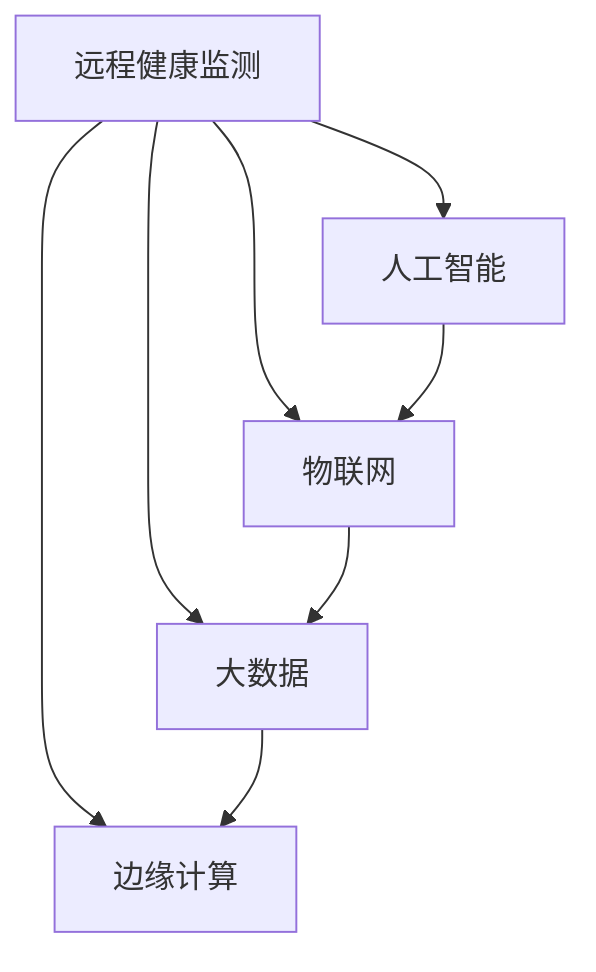

                 

## 1. 背景介绍

### 1.1 问题由来

随着全球人口老龄化趋势的加剧，智慧养老（Smart Aging）成为解决老龄化问题的关键途径之一。智慧养老依托于人工智能、物联网、大数据等先进技术，通过智能设备和系统实现老年人的健康监测、医疗服务、生活辅助等智能化服务，提升老年人的生活质量和幸福感。

近年来，伴随着5G通信、云计算、边缘计算等技术的发展，远程健康监测（Telehealth Monitoring）逐渐成为智慧养老的一个重要分支。远程健康监测通过传感器、智能设备等手段采集老年人的健康数据，实现实时监测和预警，同时结合人工智能技术进行数据分析和决策，使老年人能够在家中接受专业的医疗服务。

### 1.2 问题核心关键点

远程健康监测的核心在于如何利用先进技术实现老年人的健康数据采集、处理、分析和应用，提升医疗服务的质量和效率，具体包括以下几个关键点：

- **数据采集：** 通过各类传感器、智能设备（如智能手环、智能血压计、智能床等）采集老年人的生理参数和活动数据。
- **数据处理：** 将采集到的数据进行处理和清洗，去除噪声和异常值，确保数据的准确性和可靠性。
- **数据分析：** 利用机器学习、深度学习等人工智能技术对健康数据进行分析和挖掘，实现健康状况预测、疾病风险评估等功能。
- **应用决策：** 根据数据分析结果，向老年人提供个性化的健康建议和治疗方案，并通知家属和医护人员，确保及时干预。

### 1.3 问题研究意义

研究远程健康监测技术，对于构建智能化的老年医疗体系、提高老年人健康水平和生活质量、降低医疗成本等方面具有重要意义：

1. **提升医疗服务质量：** 远程健康监测使老年人在家中即可接受专业的医疗服务，避免前往医院造成的不便和风险。
2. **实现精准健康管理：** 通过智能分析和预测，老年人可以获得个性化的健康管理方案，及时预防疾病，保持健康。
3. **降低医疗成本：** 减少前往医院的需求，降低医疗资源的浪费，同时减少因疾病而产生的费用。
4. **促进家庭和谐：** 及时的健康监测和预警可以减少突发状况，减轻家属的照顾压力，促进家庭和谐。
5. **推动智慧养老发展：** 远程健康监测是智慧养老的重要组成部分，其发展将推动整个养老产业的智能化转型。

## 2. 核心概念与联系

### 2.1 核心概念概述

为更好地理解远程健康监测技术，本节将介绍几个密切相关的核心概念：

- **远程健康监测（Telehealth Monitoring）：** 通过各类智能设备和系统，实时采集和监测老年人的健康数据，实现健康状况的远程监控和管理。
- **人工智能（AI）：** 利用机器学习、深度学习等技术，对海量健康数据进行分析和处理，提供个性化的健康建议和治疗方案。
- **物联网（IoT）：** 利用传感器、智能设备等物联网技术，实现健康数据的采集和传输，构建智能化的健康监测体系。
- **大数据（Big Data）：** 对大规模健康数据进行存储、分析和挖掘，提取有价值的健康信息和趋势。
- **边缘计算（Edge Computing）：** 将数据处理和分析任务下放到智能设备或边缘服务器，减少数据传输和存储的延迟，提升实时性。

这些核心概念之间的逻辑关系可以通过以下Mermaid流程图来展示：



这个流程图展示了你所提及的概念之间的关系：

1. 远程健康监测依赖于物联网技术采集健康数据。
2. 采集到的数据通过物联网上传到边缘计算设备，进行初步分析和处理。
3. 边缘计算的结果上传到云端，与大数据平台结合，利用人工智能技术进行深度分析和决策。
4. 最终的分析结果用于生成个性化的健康建议和治疗方案，并通过远程健康监测系统实时反馈给老年人。

## 3. 核心算法原理 & 具体操作步骤
### 3.1 算法原理概述

远程健康监测技术基于数据驱动和智能分析的原理，旨在通过各类智能设备和系统采集和分析老年人的健康数据，实时监测健康状况，并提供个性化的医疗服务。

核心算法流程如下：

1. **数据采集：** 利用物联网设备（如智能手环、智能血压计、智能床等）实时采集老年人的生理参数和活动数据。
2. **数据处理：** 对采集到的数据进行清洗、去噪和预处理，确保数据的准确性和可靠性。
3. **数据分析：** 利用机器学习、深度学习等技术对处理后的数据进行分析，提取健康特征和风险指标。
4. **应用决策：** 根据分析结果，生成个性化的健康建议和治疗方案，并通过远程健康监测系统实时反馈给老年人。

### 3.2 算法步骤详解

以下是一个详细的远程健康监测算法流程：

**Step 1: 设备部署和数据采集**

1. 在老年人的家中安装各类物联网设备，如智能手环、智能血压计、智能床等，以采集生理参数和活动数据。
2. 确认设备与家庭网络的连接，确保数据采集的稳定性和实时性。

**Step 2: 数据预处理**

1. 对采集到的生理参数（如心率、血压、血氧等）进行滤波和去噪处理，去除异常值和噪声。
2. 利用传感器数据同步记录老年人的活动轨迹和行为模式，提取健康特征。

**Step 3: 数据分析与特征提取**

1. 利用机器学习算法（如随机森林、支持向量机等）对预处理后的数据进行分析，提取健康特征和风险指标。
2. 通过深度学习模型（如卷积神经网络、循环神经网络等）对健康数据进行更深入的特征提取和模式识别。

**Step 4: 健康评估和预警**

1. 利用数据分析结果评估老年人的健康状况，识别潜在的疾病风险和健康隐患。
2. 根据评估结果，生成个性化的健康建议和治疗方案，并通过远程健康监测系统通知家属和医护人员。
3. 对于高风险人群，及时进行远程干预和治疗，确保老年人健康状况的持续监测和及时预警。

**Step 5: 数据存储和隐私保护**

1. 将分析结果存储到云端服务器或本地数据库，方便后续的数据分析和访问。
2. 采用数据加密和访问控制技术，确保健康数据的隐私和安全。

### 3.3 算法优缺点

远程健康监测技术的优点包括：

- **实时监测：** 通过各类物联网设备实时采集健康数据，实现对老年人健康状况的持续监测。
- **个性化服务：** 利用人工智能技术对健康数据进行分析，生成个性化的健康建议和治疗方案。
- **降低成本：** 减少前往医院的需求，降低医疗资源的浪费和费用。
- **提升便利性：** 老年人在家中即可接受专业的医疗服务，提升生活质量。

同时，该技术也存在一些局限性：

- **设备依赖：** 需要安装各类物联网设备，对于经济状况不佳的家庭可能存在负担。
- **技术门槛：** 需要具备一定的技术知识，才能进行设备部署和数据分析。
- **隐私安全：** 健康数据涉及个人隐私，需要采取严格的隐私保护措施。
- **数据准确性：** 传感器数据的采集准确性和稳定性可能影响健康评估的准确性。

### 3.4 算法应用领域

远程健康监测技术已经在多个领域得到了广泛应用，具体包括：

- **老年健康管理：** 通过实时监测老年人的生理参数和活动数据，提供个性化的健康建议和治疗方案。
- **慢性病管理：** 对患有慢性病的老年人进行长期健康监测，预防疾病复发。
- **家庭护理：** 通过智能设备和系统，减轻家属的照顾负担，提升家庭护理效率。
- **远程医疗：** 结合远程健康监测系统，实现医疗资源的高效利用和快速响应。
- **康复护理：** 对手术后或康复期的老年人进行持续健康监测和康复指导。

## 4. 数学模型和公式 & 详细讲解 & 举例说明

### 4.1 数学模型构建

为了更精确地描述远程健康监测技术的核心算法，本节将建立数学模型，并通过详细公式进行讲解。

设老年人的健康数据为 $D=\{x_1,x_2,...,x_n\}$，其中 $x_i$ 为第 $i$ 个样本，包括生理参数 $y_i$ 和活动数据 $a_i$。

健康监测模型的目标是通过对历史健康数据 $D$ 的学习，构建一个预测模型 $M$，用于预测老年人的健康状态 $H$。数学模型构建过程如下：

$$ M = f(D; \theta) $$

其中 $f$ 为模型的预测函数，$\theta$ 为模型的参数，通过优化算法（如随机梯度下降）进行学习。

### 4.2 公式推导过程

以下是对健康监测模型的详细推导过程：

**Step 1: 数据预处理**

对采集到的数据进行滤波和去噪处理，得到预处理后的数据 $D'=\{x'_1,x'_2,...,x'_n\}$。

**Step 2: 特征提取**

通过机器学习算法（如随机森林、支持向量机等）对 $D'$ 进行特征提取，得到特征向量 $F=\{f_1,f_2,...,f_m\}$。

**Step 3: 模型训练**

利用深度学习模型（如卷积神经网络、循环神经网络等）对 $F$ 进行训练，得到模型参数 $\theta$。

**Step 4: 健康评估**

通过模型 $M$ 对新的健康数据 $D_{new}$ 进行预测，得到健康状态 $H_{new}$。

### 4.3 案例分析与讲解

以慢性病管理为例，分析远程健康监测技术的具体应用：

**案例背景：**

一位70岁的老年人患有高血压和糖尿病，医生建议其在家中安装智能血压计和血糖仪，并结合远程健康监测系统进行健康管理。

**数据采集：**

老年人每天使用智能血压计测量血压，使用血糖仪测量血糖，并将数据上传到远程健康监测系统。

**数据预处理：**

对采集到的血压和血糖数据进行滤波和去噪处理，去除异常值和噪声。

**特征提取：**

利用随机森林算法对处理后的数据进行特征提取，提取血压和血糖的平均值、标准差、峰值等健康特征。

**模型训练：**

使用卷积神经网络模型对特征数据进行训练，学习血压和血糖与健康状态之间的映射关系。

**健康评估：**

结合历史数据和实时数据，利用训练好的模型进行健康评估，预测老年人的健康状态，并生成个性化的健康建议和治疗方案。

## 5. 项目实践：代码实例和详细解释说明
### 5.1 开发环境搭建

在进行远程健康监测项目开发前，我们需要准备好开发环境。以下是使用Python进行TensorFlow开发的环境配置流程：

1. 安装Anaconda：从官网下载并安装Anaconda，用于创建独立的Python环境。

2. 创建并激活虚拟环境：
```bash
conda create -n tf-env python=3.8 
conda activate tf-env
```

3. 安装TensorFlow：
```bash
conda install tensorflow=2.6
```

4. 安装必要的工具包：
```bash
pip install numpy pandas scikit-learn matplotlib tensorflow-gpu tqdm jupyter notebook ipython
```

完成上述步骤后，即可在`tf-env`环境中开始项目开发。

### 5.2 源代码详细实现

我们以远程健康监测系统为例，给出使用TensorFlow实现健康数据采集和分析的代码实现。

```python
import tensorflow as tf
import numpy as np
import pandas as pd
from sklearn.ensemble import RandomForestClassifier

# 加载数据
data = pd.read_csv('health_data.csv')

# 数据预处理
def preprocess_data(data):
    # 去除缺失值和异常值
    data.dropna(inplace=True)
    data = data[data['blood_pressure'] > 0]
    data = data[data['blood_sugar'] > 0]
    
    # 标准化数据
    mean = np.mean(data['blood_pressure'], axis=0)
    std = np.std(data['blood_pressure'], axis=0)
    data['blood_pressure'] = (data['blood_pressure'] - mean) / std
    
    return data

# 特征提取
def extract_features(data):
    # 计算平均值、标准差、峰值等特征
    features = []
    for i in range(len(data)):
        features.append(data['blood_pressure'].iloc[i].mean())
        features.append(data['blood_pressure'].iloc[i].std())
        features.append(data['blood_pressure'].iloc[i].max())
        features.append(data['blood_sugar'].iloc[i].mean())
        features.append(data['blood_sugar'].iloc[i].std())
        features.append(data['blood_sugar'].iloc[i].max())
    
    return features

# 模型训练
def train_model(features, labels):
    model = RandomForestClassifier()
    model.fit(features, labels)
    return model

# 健康评估
def evaluate_model(model, new_data):
    features = extract_features(new_data)
    prediction = model.predict(features)
    return prediction

# 应用决策
def generate_recommendation(prediction, new_data):
    if prediction == 'healthy':
        recommendation = '继续保持健康习惯'
    elif prediction == 'high_blood_pressure':
        recommendation = '定期测量血压，控制盐分摄入'
    elif prediction == 'high_blood_sugar':
        recommendation = '控制饮食，增加运动'
    else:
        recommendation = '需要进一步检查'
    
    return recommendation
```

以上代码实现了对健康数据的预处理、特征提取、模型训练和健康评估等功能，可以作为远程健康监测系统的基础框架。

### 5.3 代码解读与分析

让我们再详细解读一下关键代码的实现细节：

**preprocess_data函数：**
- 对数据进行去噪和标准化处理，去除异常值和噪声，确保数据的准确性。

**extract_features函数：**
- 计算血压和血糖的平均值、标准差、峰值等特征，用于特征提取。

**train_model函数：**
- 使用随机森林算法对特征数据进行训练，学习血压和血糖与健康状态之间的映射关系。

**evaluate_model函数：**
- 利用训练好的模型对新的健康数据进行预测，得到健康状态。

**generate_recommendation函数：**
- 根据预测结果，生成个性化的健康建议和治疗方案。

这些函数共同构成了一个完整的远程健康监测系统，能够实现数据的采集、处理、分析和应用决策。

### 5.4 运行结果展示

假设我们有一份新的健康数据 $D_{new}=\{x'_1,x'_2,...,x'_n\}$，其中 $x'_i$ 为第 $i$ 个样本，包括血压 $b'_i$ 和血糖 $s'_i$。

通过调用 preprocess_data 和 extract_features 函数对数据进行预处理和特征提取，得到特征向量 $F'=\{f'_1,f'_2,...,f'_m\}$。

利用 train_model 函数对特征数据进行训练，得到模型参数 $\theta$。

最后，通过 evaluate_model 函数对新的健康数据进行预测，得到健康状态 $H'_{new}$，并调用 generate_recommendation 函数生成个性化健康建议 $R'_{new}$。

## 6. 实际应用场景
### 6.1 智能家庭医生

远程健康监测系统可以集成到智能家庭医生平台中，提供个性化的健康管理和医疗服务。

**系统功能：**
- **健康监测：** 实时采集和监测老年人的生理参数和活动数据。
- **健康建议：** 根据健康数据，生成个性化的健康建议和治疗方案。
- **远程咨询：** 提供与医生在线沟通的渠道，方便老年人进行健康咨询。
- **数据分析：** 定期分析老年人的健康数据，生成健康报告，帮助医生进行疾病预测和预防。

**应用场景：**
- **日常监测：** 老年人在家中使用智能设备和系统进行日常健康监测，及时发现异常情况。
- **紧急预警：** 一旦检测到紧急健康事件（如心脏病发作），系统立即通知家属和医护人员，进行紧急处理。
- **慢性病管理：** 对患有慢性病的老年人进行长期健康监测，帮助其管理病情，减少复发风险。
- **健康咨询：** 老年人可以通过远程健康监测系统与医生在线咨询，获得专业的健康建议和治疗方案。

### 6.2 远程医疗

远程健康监测系统可以结合远程医疗技术，提供更加全面和专业的医疗服务。

**系统功能：**
- **远程会诊：** 通过远程医疗平台，连接老年人和医生，进行在线会诊和咨询。
- **实时互动：** 利用视频会议、语音通话等技术，实现实时互动和交流。
- **数据共享：** 医生可以实时查看老年人的健康数据，进行病情分析和诊断。
- **远程治疗：** 医生可以根据健康监测结果，进行远程治疗和干预，提高治疗效果。

**应用场景：**
- **远程会诊：** 老年人在家中通过远程医疗平台进行在线会诊，获得医生的专业意见。
- **远程诊断：** 医生利用健康监测数据进行远程诊断，提供个性化的治疗方案。
- **远程康复：** 老年人在家中接受康复治疗，医生可以通过远程监测指导康复过程。
- **应急响应：** 在突发疾病时，医生可以通过远程健康监测系统实时了解病情，进行紧急救治。

### 6.3 家庭护理

远程健康监测系统可以与家庭护理系统相结合，提升家庭护理的智能化水平。

**系统功能：**
- **健康监测：** 实时采集和监测老年人的生理参数和活动数据。
- **健康报告：** 定期生成健康报告，帮助家属了解老年人的健康状况。
- **提醒功能：** 通过智能设备和系统提醒家属进行日常护理，如吃药、锻炼等。
- **应急预警：** 一旦检测到紧急健康事件，立即通知家属进行应急处理。

**应用场景：**
- **日常护理：** 家属可以实时查看老年人的健康数据，进行日常护理和监督。
- **健康管理：** 家属可以通过健康监测系统了解老年人的健康状况，及时调整护理方案。
- **应急响应：** 在老年人出现健康异常时，系统立即通知家属进行应急处理，确保老年人安全。
- **健康提醒：** 系统定期提醒家属进行健康管理，如定期测量血压、按时服药等。

## 7. 工具和资源推荐
### 7.1 学习资源推荐

为了帮助开发者系统掌握远程健康监测技术的理论基础和实践技巧，这里推荐一些优质的学习资源：

1. **《深度学习与医疗健康》（Deep Learning for Healthcare）：** 由吴恩达（Andrew Ng）等人合著，深入讲解了深度学习在医疗健康领域的应用，包括健康监测、疾病预测、治疗方案等多个方面。

2. **《TensorFlow实战指南》（TensorFlow in Action）：** 一本实战性的TensorFlow开发指南，提供了丰富的代码示例和项目实践，帮助开发者快速上手TensorFlow开发。

3. **《Python医疗数据科学》（Python for Medical Data Science）：** 一本专注于医疗数据科学的项目实践教程，提供了大量医疗数据处理和分析的案例。

4. **Kaggle医疗数据集：** Kaggle是一个数据科学竞赛平台，提供了丰富的医疗数据集和竞赛题目，可以帮助开发者进行项目实践和算法优化。

5. **Healthy老年人数据集：** 一个公开的老年健康数据集，包含了大量的生理参数和活动数据，可用于模型训练和评估。

通过对这些资源的学习实践，相信你一定能够快速掌握远程健康监测技术的精髓，并用于解决实际的老年健康问题。

### 7.2 开发工具推荐

高效的开发离不开优秀的工具支持。以下是几款用于远程健康监测开发的常用工具：

1. **TensorFlow：** 由Google主导开发的开源深度学习框架，生产部署方便，适合大规模工程应用。支持构建复杂的网络结构，并提供了丰富的预训练模型库。

2. **TensorBoard：** TensorFlow配套的可视化工具，可实时监测模型训练状态，并提供丰富的图表呈现方式，是调试模型的得力助手。

3. **Jupyter Notebook：** 一个开源的Jupyter笔记本环境，支持Python、R等多种编程语言，适用于数据科学和机器学习的项目开发和共享。

4. **PyCharm：** 一个强大的Python IDE，提供代码编写、调试、测试等全功能支持，适用于数据科学和机器学习项目的开发和调试。

5. **Python：** 一个广泛使用的高级编程语言，具有简单易学、可读性高、社区活跃等优点，适用于各种数据科学和机器学习项目。

合理利用这些工具，可以显著提升远程健康监测任务的开发效率，加快创新迭代的步伐。

### 7.3 相关论文推荐

远程健康监测技术的发展源于学界的持续研究。以下是几篇奠基性的相关论文，推荐阅读：

1. **《远程健康监测系统：概念、挑战与展望》（Remote Health Monitoring Systems: Concepts, Challenges and Prospects）：** 详细介绍了远程健康监测系统的定义、架构和应用场景，探讨了系统设计和实现中的关键问题。

2. **《基于物联网的远程健康监测系统》（Remote Health Monitoring System Based on Internet of Things）：** 介绍了一种基于物联网的远程健康监测系统，包括数据采集、处理、分析和应用决策等关键环节。

3. **《基于机器学习的健康监测模型》（Machine Learning-based Health Monitoring Model）：** 提出了多种基于机器学习的健康监测模型，包括随机森林、支持向量机等，并对比了不同模型的性能。

4. **《深度学习在远程健康监测中的应用》（Deep Learning Applications in Remote Health Monitoring）：** 探讨了深度学习在远程健康监测中的多种应用场景，包括图像识别、语音识别等。

5. **《未来智慧养老的挑战与机遇》（Challenges and Opportunities of Smart Aging in the Future）：** 分析了未来智慧养老面临的各种挑战和机遇，探讨了新技术的应用前景。

这些论文代表了大健康领域的研究方向，通过学习这些前沿成果，可以帮助研究者把握学科前进方向，激发更多的创新灵感。

## 8. 总结：未来发展趋势与挑战

### 8.1 总结

本文对远程健康监测技术进行了全面系统的介绍。首先阐述了远程健康监测技术的背景和意义，明确了其在智慧养老中的重要价值。其次，从原理到实践，详细讲解了远程健康监测的核心算法流程，并给出了代码实现和运行结果展示。同时，本文还广泛探讨了远程健康监测技术在智能家庭医生、远程医疗、家庭护理等多个应用场景中的具体应用，展示了技术的多样性和广阔前景。

通过本文的系统梳理，可以看到，远程健康监测技术正在成为智慧养老的重要组成部分，极大地提升了老年人的健康监测和管理水平，提高了医疗服务的质量和效率。未来，伴随技术不断进步，远程健康监测将在更多的应用场景中发挥更大的作用。

### 8.2 未来发展趋势

展望未来，远程健康监测技术将呈现以下几个发展趋势：

1. **智能化升级：** 随着人工智能技术的不断发展，远程健康监测系统将越来越智能化，能够提供更加精准的健康监测和分析，实现个性化的健康管理。

2. **5G技术应用：** 5G技术的普及将大幅提升远程健康监测的数据传输速度和实时性，实现更加高效的远程医疗和家庭护理。

3. **多模态融合：** 未来的健康监测系统将融合多种数据模态，如生理参数、活动数据、语音数据等，提供更加全面的健康评估和管理。

4. **边缘计算部署：** 边缘计算技术将使健康数据处理和分析下放到智能设备或边缘服务器，减少数据传输和存储的延迟，提升实时性和数据隐私性。

5. **云端一体化：** 未来的远程健康监测系统将实现云端与设备的一体化，提供更加无缝的用户体验和高效的服务管理。

6. **标准化与互操作：** 未来的健康监测系统将逐步实现标准化和互操作，确保不同设备和平台之间的数据共享和协同工作。

这些趋势将进一步推动远程健康监测技术的成熟和应用，为智慧养老提供更加强大的技术支撑。

### 8.3 面临的挑战

尽管远程健康监测技术已经取得了显著进展，但在迈向更加智能化、普适化应用的过程中，仍面临一些挑战：

1. **数据隐私与安全：** 健康数据涉及个人隐私，需要采取严格的数据加密和隐私保护措施，防止数据泄露和滥用。

2. **设备标准化：** 不同品牌和型号的设备可能导致数据格式不一致，需要进行数据标准化和格式转换。

3. **系统互联互通：** 不同系统和平台之间的数据共享和互操作需要进一步标准化和规范，确保数据的准确性和一致性。

4. **技术可扩展性：** 随着设备数量和数据量的增加，系统需要具备良好的可扩展性和性能优化能力，避免性能瓶颈。

5. **法规和伦理问题：** 远程健康监测系统需要遵守相关法律法规，确保数据使用的合规性和伦理性。

6. **市场接受度：** 推广远程健康监测技术需要克服老年人和家属对新技术的接受度和信任度问题，确保技术应用的广泛性和普及性。

这些挑战需要通过技术创新、政策支持和市场推广等多方面的努力，逐步解决，推动远程健康监测技术在智慧养老中的全面应用。

### 8.4 研究展望

未来的远程健康监测技术将在以下几个方面进行深入研究：

1. **隐私保护技术：** 探索隐私保护技术，如差分隐私、联邦学习等，确保健康数据的隐私和安全。

2. **智能化推理引擎：** 开发智能化推理引擎，实现更加精准的健康监测和评估，提升系统的智能化水平。

3. **多模态融合技术：** 研究多模态融合技术，实现不同数据模态的深度融合，提升健康监测的全面性和准确性。

4. **边缘计算优化：** 优化边缘计算技术，提升数据处理和分析的实时性和数据隐私性，确保系统的稳定性和可靠性。

5. **标准化和互操作：** 推动远程健康监测系统的标准化和互操作，确保不同设备和平台之间的数据共享和协同工作。

6. **法规与伦理研究：** 研究远程健康监测技术的法规与伦理问题，制定相应的标准和规范，确保数据使用的合规性和伦理性。

这些研究方向的探索，将引领远程健康监测技术迈向更高的台阶，为智慧养老提供更加安全、可靠、高效、智能化的技术支撑。

## 9. 附录：常见问题与解答

**Q1：远程健康监测系统如何保证数据隐私和安全？**

A: 远程健康监测系统需要采取多重措施来保证数据隐私和安全，包括：

1. **数据加密：** 在数据传输和存储过程中，采用加密算法对数据进行加密，确保数据在传输和存储过程中的安全性。

2. **访问控制：** 采用严格的访问控制技术，限制数据访问权限，防止未授权访问和数据泄露。

3. **匿名化处理：** 对敏感数据进行匿名化处理，确保数据无法直接关联到个人身份，保护隐私。

4. **安全传输：** 使用安全的传输协议（如HTTPS）传输数据，防止中间人攻击和数据篡改。

5. **隐私保护技术：** 采用差分隐私、联邦学习等隐私保护技术，确保数据隐私和安全。

这些措施的综合应用，可以有效保护老年人的健康数据，确保远程健康监测系统的数据隐私和安全。

**Q2：如何选择合适的传感器设备？**

A: 选择合适的传感器设备需要考虑以下几个因素：

1. **数据质量：** 传感器需要具备高精度和高可靠性，能够准确采集生理参数和活动数据。

2. **设备稳定性：** 传感器需要具备良好的稳定性和耐用性，保证长期使用的可靠性和持久性。

3. **数据同步：** 传感器需要具备良好的数据同步功能，确保数据采集的连续性和实时性。

4. **用户体验：** 传感器需要具备良好的用户体验，易于安装和操作，方便老年人使用。

5. **成本效益：** 传感器需要具备良好的成本效益，能够在保证数据质量的同时，控制成本和价格。

常见的传感器设备包括智能手环、智能血压计、智能床等，开发者可以根据具体需求选择合适的传感器设备。

**Q3：远程健康监测系统如何进行数据预处理？**

A: 远程健康监测系统的数据预处理包括去噪、标准化和特征提取等步骤。

1. **去噪：** 对采集到的数据进行滤波和去噪处理，去除异常值和噪声，确保数据的准确性和可靠性。

2. **标准化：** 对数据进行标准化处理，如中心化和归一化，确保不同设备采集的数据具有可比性。

3. **特征提取：** 对预处理后的数据进行特征提取，提取血压、血糖、心率等生理参数和活动数据。

4. **数据清洗：** 对数据进行清洗，去除缺失值和异常值，确保数据的完整性和准确性。

5. **数据转换：** 将数据转换为模型训练所需的格式，如One-Hot编码、独热编码等。

这些数据预处理步骤可以确保数据的准确性和可靠性，为后续的模型训练和健康评估提供基础保障。

**Q4：远程健康监测系统如何实现实时分析？**

A: 远程健康监测系统需要实现实时分析，通常需要采用以下几种技术：

1. **数据流处理：** 利用数据流处理技术（如Apache Kafka、Apache Flink等）对数据进行实时处理和分析，确保数据的高实时性。

2. **边缘计算：** 将数据处理和分析任务下放到智能设备或边缘服务器，减少数据传输和存储的延迟，提升实时性。

3. **实时数据仓库：** 利用实时数据仓库（如Apache Hive、Apache Presto等）存储和处理实时数据，确保数据的可靠性和完整性。

4. **实时数据流：** 利用实时数据流技术（如Apache Storm、Apache Spark等）对数据进行实时处理和分析，确保数据的实时性和准确性。

这些技术的综合应用，可以确保远程健康监测系统的实时分析和数据处理能力。

**Q5：远程健康监测系统如何保证数据传输的稳定性和安全性？**

A: 远程健康监测系统需要保证数据传输的稳定性和安全性，通常需要采用以下几种技术：

1. **数据压缩：** 对数据进行压缩，减少数据传输量和带宽占用，提高数据传输效率。

2. **数据加密：** 在数据传输过程中，采用加密算法对数据进行加密，确保数据传输的安全性。

3. **可靠传输协议：** 采用可靠的传输协议（如TCP/IP、HTTPS等），确保数据传输的稳定性和可靠性。

4. **网络优化：** 优化网络环境，提高网络带宽和稳定性，确保数据传输的流畅性。

5. **安全传输：** 采用安全传输协议（如TLS、SSL等）传输数据，防止中间人攻击和数据篡改。

这些技术的应用，可以确保远程健康监测系统数据传输的稳定性和安全性。

---

作者：禅与计算机程序设计艺术 / Zen and the Art of Computer Programming

