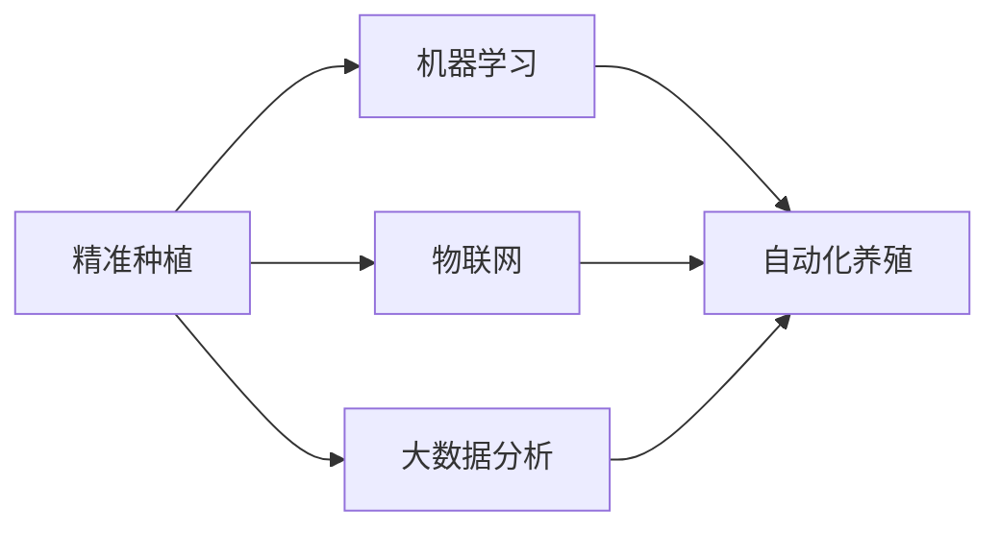

                 

## 1. 背景介绍

随着人工智能技术的迅速发展，未来的智慧农业将变得更加高效、精准和可持续。到2050年，我们将看到一系列创新的技术和方法被应用于精准种植与自动化养殖，从而大幅提高农业生产的效率和质量。本文将探讨这些未来的智慧农业技术，包括机器学习、物联网、自动化设备以及大数据分析的应用。

## 2. 核心概念与联系

### 2.1 核心概念概述

- **精准种植（Precision Agriculture）**：一种使用传感器、无人机和机器学习等技术来监测和优化农作物生长环境的农业模式。其目的是提高作物产量，减少资源浪费，并保护环境。

- **自动化养殖（Automated Livestock Farming）**：利用自动化技术和物联网设备，如传感器和监控系统，来监测和管理牲畜的健康和生长环境，从而提升养殖效率和动物福利。

- **机器学习（Machine Learning）**：一种人工智能技术，通过对数据进行分析和模式识别，使机器能够自动学习和改进任务。

- **物联网（Internet of Things, IoT）**：通过互联网将传感器、设备和其他对象连接起来，实现实时监控和数据收集。

- **大数据分析（Big Data Analytics）**：使用先进的数据处理技术来分析大量的农业数据，从而支持决策制定。

### 2.2 核心概念原理和架构的 Mermaid 流程图



这个流程图展示了精准种植与自动化养殖之间的关系。机器学习技术在精准种植中的应用包括数据采集和分析，而物联网和数据分析则支持自动化养殖的实施。

## 3. 核心算法原理 & 具体操作步骤

### 3.1 算法原理概述

未来的智慧农业将依赖于多种算法和技术的结合。其中，机器学习算法是核心。它通过分析历史数据和实时数据，来预测作物生长状况、病虫害爆发时间、土壤湿度等关键参数。这些预测可以帮助农民做出更好的决策，如何时种植、何时施肥、如何灌溉等。

### 3.2 算法步骤详解

1. **数据采集**：使用传感器、无人机和地面设备来收集土壤、气候、作物生长状态等数据。

2. **数据预处理**：对采集的数据进行清洗、标准化和转换，以便于后续分析。

3. **特征提取**：从原始数据中提取有用的特征，如土壤湿度、温度、光照强度等。

4. **模型训练**：使用机器学习算法（如随机森林、神经网络等）训练模型，预测作物生长状态。

5. **实时监控**：将训练好的模型部署到田间，实时监控作物生长状态，并根据预测结果调整农业活动。

6. **反馈调整**：根据监控结果调整模型参数，优化预测准确度。

### 3.3 算法优缺点

**优点**：
- 提高作物产量和质量。
- 减少资源浪费。
- 改善环境友好性。

**缺点**：
- 需要大量的初始数据和计算资源。
- 可能存在模型过拟合的风险。
- 需要专业技术人员进行部署和维护。

### 3.4 算法应用领域

这些算法和技术可以应用于各种农业活动，包括作物种植、牲畜养殖、土壤管理、病虫害防治、农业机械自动化等。

## 4. 数学模型和公式 & 详细讲解 & 举例说明

### 4.1 数学模型构建

假设有一个随机森林模型，用于预测作物生长状态。设 $X=(x_1, x_2, ..., x_n)$ 为输入特征，$Y$ 为输出标签（如作物生长状态）。模型的数学表达式为：

$$
Y = f(X; \theta)
$$

其中，$f$ 为随机森林模型，$\theta$ 为模型参数。

### 4.2 公式推导过程

在实际应用中，随机森林模型 $f$ 可以表示为多个决策树的集合。每个决策树的输出可以通过以下公式计算：

$$
f_{\text{tree}}(X) = \sum_{i=1}^m a_i \cdot h_i(X)
$$

其中，$a_i$ 为每个决策树的权重，$h_i$ 为第 $i$ 个决策树的预测函数。

### 4.3 案例分析与讲解

以预测作物生长状态为例，假设我们有四个特征 $X_1$（土壤湿度）、$X_2$（气温）、$X_3$（光照强度）和 $X_4$（肥料用量）。通过随机森林模型训练，我们可以得到一个用于预测作物生长状态的数学模型。这个模型可以根据输入特征预测作物是否健康，是否需要施肥等。

## 5. 项目实践：代码实例和详细解释说明

### 5.1 开发环境搭建

要实现这些算法，我们需要搭建一个基于Python的开发环境。以下是一个简单的Python开发环境搭建流程：

1. 安装Python和pip。
2. 安装必要的Python包，如scikit-learn、TensorFlow等。
3. 安装相应的硬件设备驱动和库，如Arduino库、RFID库等。

### 5.2 源代码详细实现

以下是使用scikit-learn实现随机森林模型的Python代码：

```python
from sklearn.ensemble import RandomForestClassifier
from sklearn.model_selection import train_test_split
from sklearn.metrics import accuracy_score

# 假设我们有一个特征集 X 和一个标签集 Y
X_train, X_test, y_train, y_test = train_test_split(X, Y, test_size=0.2)

# 创建随机森林模型
rf = RandomForestClassifier(n_estimators=100)

# 训练模型
rf.fit(X_train, y_train)

# 预测
y_pred = rf.predict(X_test)

# 评估模型性能
accuracy = accuracy_score(y_test, y_pred)
print(f"模型准确度为: {accuracy}")
```

### 5.3 代码解读与分析

这个代码片段展示了如何使用scikit-learn的RandomForestClassifier类来训练和评估一个随机森林模型。首先，我们通过train_test_split函数将数据集分成训练集和测试集。然后，我们创建一个RandomForestClassifier实例，设置参数n_estimators为100。接着，我们训练模型，并使用predict函数对测试集进行预测。最后，我们使用accuracy_score函数评估模型的准确度。

### 5.4 运行结果展示

运行上述代码后，我们将会得到一个模型的准确度。这个结果可以帮助我们了解模型的性能，并在需要时对模型进行调整。

## 6. 实际应用场景

### 6.1 智能温室

智能温室是一个典型的精准种植应用场景。通过传感器监测温室内的温度、湿度、光照等环境参数，并使用机器学习模型预测作物生长状态，农民可以及时调整环境设置，优化作物生长条件。

### 6.2 自动化农场

自动化农场利用物联网设备和机器学习算法，实现对农作物的实时监控和自动化管理。例如，自动灌溉系统可以根据土壤湿度和天气预报调整灌溉量，确保作物获得最佳的生长条件。

### 6.3 牲畜养殖

在牲畜养殖中，自动化监控系统可以实时监测牲畜的健康状况，如体重、健康指标等。这些数据可以用于疾病预测和预防，减少疾病传播的风险。

### 6.4 未来应用展望

未来的智慧农业将更加注重环境可持续性和资源优化。智能温室、自动化农场和牲畜养殖等领域将得到更广泛的应用，从而实现更高的生产效率和更好的环境保护。

## 7. 工具和资源推荐

### 7.1 学习资源推荐

1. **《Python机器学习》**：这本书深入浅出地介绍了机器学习的基础知识和实现方法。
2. **《深度学习与人工智能》**：这本书介绍了深度学习的基础知识、算法和应用。
3. **Kaggle**：Kaggle是一个数据科学竞赛平台，提供了丰富的数据集和代码示例。
4. **Coursera**：Coursera提供了众多与机器学习和农业相关的在线课程。

### 7.2 开发工具推荐

1. **PyTorch**：一个开源的深度学习框架，提供了丰富的机器学习工具。
2. **TensorFlow**：另一个流行的深度学习框架，提供了强大的计算能力和丰富的库。
3. **Arduino**：用于控制各种传感器和设备，实现物联网功能。
4. **RFID库**：用于读取RFID标签，用于动物识别和管理。

### 7.3 相关论文推荐

1. **《基于深度学习的精准农业技术》**：介绍了深度学习在精准农业中的应用。
2. **《智能温室环境监控系统设计》**：介绍了智能温室环境监控系统的设计和实现。
3. **《物联网在牲畜养殖中的应用》**：介绍了物联网在牲畜养殖中的应用，包括传感器和监控系统。

## 8. 总结：未来发展趋势与挑战

### 8.1 研究成果总结

未来智慧农业的发展将依赖于机器学习、物联网和大数据分析等技术的深度融合。这些技术的结合将带来更高的生产效率、更精准的农业管理和更可持续的环境保护。

### 8.2 未来发展趋势

1. **更加智能化**：未来的智慧农业将更加智能化，能够实现自动化的决策和优化。
2. **更加环境友好**：智能设备和技术将帮助农民更有效地利用资源，减少环境污染。
3. **更加人性化**：自动化设备和系统将帮助农民更好地照顾作物和牲畜，提升动物福利。

### 8.3 面临的挑战

1. **技术成本高**：自动化设备和智能系统的初始投资较高，可能限制了其在中小型农场的应用。
2. **数据安全**：在数据采集和传输过程中，需要确保数据的安全性和隐私保护。
3. **技术复杂性**：智能农业技术需要专业的技术支持，农民需要接受一定的技术培训。

### 8.4 研究展望

未来的研究将集中在如何降低技术成本、提高数据安全性和提升农民的技术素养。通过这些努力，智慧农业技术将能够更加广泛地应用于各个农场，提升全球农业生产的效率和质量。

## 9. 附录：常见问题与解答

**Q1: 智慧农业技术是否适用于小型农场？**

A: 是的，智慧农业技术适用于各种规模的农场。虽然初始投资较高，但长期来看，通过提高效率和减少资源浪费，可以显著降低生产成本。

**Q2: 如何保护数据隐私？**

A: 在数据采集和传输过程中，需要采用加密技术，确保数据的安全性和隐私保护。此外，农民需要了解并遵守相关的隐私保护法规。

**Q3: 技术复杂性如何降低？**

A: 可以通过培训和教育，提高农民对智能农业技术的理解和应用能力。同时，设计用户友好的界面和操作流程，减少技术门槛。

**Q4: 如何评估智慧农业技术的效果？**

A: 可以通过实验和对比试验，评估智慧农业技术的效果。还可以使用量化指标，如作物产量、资源利用率等，来衡量技术的效果。

---

作者：禅与计算机程序设计艺术 / Zen and the Art of Computer Programming

