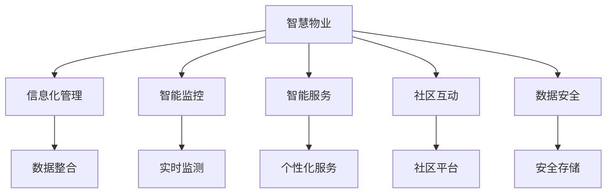

                 

# 未来的智慧物业：2050年的社区管理与服务升级

> 关键词：智慧物业,智能管理,社区服务,数字化转型,物联网,人工智能,区块链

## 1. 背景介绍

### 1.1 问题由来
随着城市化进程的加快和人口老龄化趋势的显现，传统物业管理的效率和品质面临严峻挑战。人们对于居住环境的舒适度、安全性、便捷性等方面的需求日益增长，物业管理行业的数字化转型已势在必行。

当前，物联网(IoT)、人工智能(AI)、大数据、区块链等先进技术逐渐成熟并开始广泛应用于物业管理中。通过智能传感器、智能安防系统、智能停车系统等硬件设施的部署，以及智能化管理平台和App应用的开发，智慧物业（Smart Property Management）正在逐渐取代传统物业管理模式，成为现代城市生活中不可或缺的一部分。

### 1.2 问题核心关键点
智慧物业的核心在于利用信息化和智能化手段，优化物业管理流程，提升服务质量，实现高效率、低成本、高效益的运营。具体来说，包括以下几个方面：

1. **信息化管理**：通过数字化手段实现楼宇、设备、人员等要素的信息化管理，提高管理的精细化和精准化。
2. **智能监控**：部署智能安防、智能门禁、视频监控等系统，实时监测社区环境，保障居民安全。
3. **节能减排**：运用智能能耗管理系统，优化能源使用，实现绿色环保。
4. **智慧服务**：利用AI技术提供个性化服务，如智能客服、智能导引、智能推荐等，提升居民生活品质。
5. **社区互动**：建立社区交流平台，促进居民之间的互动和社区自治，增强社区凝聚力。
6. **数据安全**：利用区块链技术确保物业管理数据的透明、安全和不可篡改。

### 1.3 问题研究意义
智慧物业的实践和研究对于提升城市管理水平、改善居民生活质量、推动绿色建筑发展、促进社区治理现代化具有重要意义。通过智慧物业的研究，可以为未来的智慧社区建设提供技术支持和理论指导，推动物业管理行业向更高水平发展。

## 2. 核心概念与联系

### 2.1 核心概念概述

为了更好地理解智慧物业的核心概念及其联系，本节将介绍几个关键概念：

- **智慧物业**：融合了物联网、人工智能、大数据、区块链等技术，以提升物业管理效率和居民生活品质的综合性解决方案。
- **信息化管理**：利用信息技术对物业管理过程中的人、事、物进行数字化记录和管理，实现高效的数据整合和分析。
- **智能监控**：通过智能传感器和系统，实时监测社区环境，提升安全性和应急响应能力。
- **智能服务**：利用AI技术，提供个性化、智能化的服务体验，满足居民多样化需求。
- **社区互动**：建立社区交流平台，促进居民之间的互动和社区自治，增强社区凝聚力。
- **数据安全**：确保物业管理数据的透明、安全和不可篡改，保障居民隐私和社区安全。

这些核心概念之间的逻辑关系可以通过以下Mermaid流程图来展示：



这个流程图展示了大语言模型的核心概念及其之间的关系：

1. 智慧物业作为整体，包含信息化管理、智能监控、智能服务、社区互动、数据安全等多个子模块。
2. 信息化管理通过数据整合，为其他模块提供基础数据支持。
3. 智能监控、智能服务、社区互动、数据安全等模块基于信息化管理的数据，提供具体的服务和应用。
4. 智能监控和智能服务通过实时监测和个性化服务，提升物业管理水平和居民生活品质。
5. 社区互动和数据安全通过建立社区交流平台和数据存储机制，增强社区自治和数据保护。

## 3. 核心算法原理 & 具体操作步骤

### 3.1 算法原理概述

智慧物业的核心算法原理主要基于以下三大技术：

- **物联网(IoT)**：通过部署各种传感器和智能设备，实时收集社区环境数据，如温度、湿度、空气质量、能耗等，为管理和服务提供数据支持。
- **人工智能(AI)**：利用机器学习和深度学习算法，分析数据并预测社区需求，优化能源使用，提供个性化服务。
- **大数据分析**：通过数据整合和分析，实现社区问题的快速定位和解决，提升服务效率。

### 3.2 算法步骤详解

智慧物业的实现主要分为以下几个步骤：

**Step 1: 需求分析**
- 确定社区管理和服务的主要需求，如安防监控、能耗管理、居民服务、社区互动等。
- 调研社区居民的需求和期望，了解其对智慧物业的期望和建议。

**Step 2: 技术选型**
- 根据需求选择适用的物联网设备、人工智能算法和大数据平台。
- 选择合适的硬件设备，如智能传感器、摄像头、门禁系统等。
- 确定AI模型的架构和参数，如卷积神经网络(CNN)、循环神经网络(RNN)等。
- 选择合适的数据存储和处理平台，如Hadoop、Spark等。

**Step 3: 系统集成**
- 将物联网设备接入社区网络，确保数据传输和存储的安全性。
- 部署智能安防、智能能耗管理系统，收集社区数据。
- 集成AI模型，提供数据分析和预测服务。
- 搭建社区交流平台，促进居民互动。

**Step 4: 数据处理**
- 收集社区数据，进行清洗和预处理，确保数据的完整性和准确性。
- 利用大数据分析技术，对社区数据进行分析和建模。
- 通过可视化工具展示分析结果，供物业管理人员参考。

**Step 5: 应用部署**
- 将智慧物业系统部署到社区，确保系统的稳定性和可扩展性。
- 提供用户界面和API接口，方便居民和物业管理人员使用。
- 进行系统测试，确保各模块正常运行，并修复可能的问题。

**Step 6: 运营维护**
- 对智慧物业系统进行定期维护，确保硬件和软件的正常运行。
- 收集用户反馈，持续优化系统功能和服务体验。
- 根据社区变化，调整系统配置和功能，适应新的需求。

### 3.3 算法优缺点

智慧物业的优势在于其高效、便捷、智能化的特性，但同时也有一些局限性：

**优点**：
1. **高效管理**：利用物联网和大数据技术，实现对社区的实时监控和管理，提升管理效率。
2. **智能服务**：通过AI技术提供个性化服务，如智能客服、能耗管理、智能推荐等，提升居民生活品质。
3. **数据驱动**：基于大数据分析，实现问题快速定位和解决，提升服务效率。
4. **居民互动**：通过社区平台，促进居民之间的互动和社区自治，增强社区凝聚力。
5. **数据安全**：利用区块链技术确保数据的透明、安全和不可篡改，保障居民隐私和社区安全。

**缺点**：
1. **初期投资大**：部署物联网设备和AI模型的初始投资较高，需要较大的预算支持。
2. **技术复杂**：需要专业的技术团队进行开发和维护，对技术水平要求较高。
3. **数据隐私**：社区数据的收集和使用涉及到居民隐私，需要严格的数据保护措施。
4. **技术更新快**：物联网、AI、大数据等技术更新迅速，需要持续的技术支持和更新。
5. **系统兼容性**：不同供应商的设备和技术可能存在兼容性问题，需要统一标准和接口。

### 3.4 算法应用领域

智慧物业技术已经在多个领域得到了广泛应用，包括但不限于：

- **住宅社区**：提供智能安防、智能客服、智能停车等服务，提升居住品质和便利性。
- **商业物业**：利用大数据和AI技术优化商业运营，提升商业价值和服务效率。
- **公共设施**：如智慧公园、智慧医院等，通过物联网和AI技术提供高效便捷的公共服务。
- **学校**：提供智能安防、智能教室管理、智能考勤等服务，提升教育质量和教学管理水平。
- **养老社区**：通过智能健康监测、智能服务机器人等技术，提供安全、便捷的养老服务。

## 4. 数学模型和公式 & 详细讲解 & 举例说明（备注：数学公式请使用latex格式，latex嵌入文中独立段落使用 $$，段落内使用 $)
### 4.1 数学模型构建

智慧物业系统的数学模型主要由以下几个部分构成：

- **物联网设备模型**：描述传感器和智能设备的工作原理和数据传输方式。
- **数据分析模型**：基于历史数据和实时数据，构建预测模型，如回归模型、时间序列模型等。
- **优化模型**：利用优化算法，优化能源使用、调度资源等，如线性规划、整数规划等。
- **智能推荐模型**：利用协同过滤、深度学习等算法，推荐服务内容，如个性化推荐系统。

### 4.2 公式推导过程

以智能能耗管理为例，描述智慧物业系统的数学模型构建过程。

设社区内有$N$个设备，第$i$个设备的能耗为$E_i$，历史能耗数据为$E_i^{(t-1)}$，当前能耗为$E_i^{(t)}$，目标能耗为$E_i^{*}$。则智能能耗管理的数学模型可以表示为：

$$
\min_{\theta} \sum_{i=1}^N (E_i^{(t)} - E_i^{*})^2
$$

其中，$\theta$为优化模型的参数，如优化算法中的控制变量等。

利用梯度下降等优化算法，求解上述最小化问题，得到最优的能耗控制策略。具体步骤如下：

1. 收集设备的实时能耗数据$E_i^{(t)}$。
2. 通过回归模型或时间序列模型预测目标能耗$E_i^{*}$。
3. 利用优化算法求解控制策略，如求解线性规划问题：

$$
\min_{\theta} \sum_{i=1}^N (E_i^{(t)} - E_i^{*})^2
$$

4. 根据控制策略调整设备运行参数，实现能耗优化。

### 4.3 案例分析与讲解

**案例分析：智能安防系统的优化**

在智能安防系统中，视频监控设备能够实时采集社区环境数据，通过人脸识别、行为分析等算法，识别异常行为和潜在威胁。但实际应用中，视频监控设备的能耗较大，如何实现节能减排成为关键问题。

假设社区内有$M$个视频监控设备，第$i$个设备的能耗为$E_i$，历史能耗数据为$E_i^{(t-1)}$，当前能耗为$E_i^{(t)}$，目标能耗为$E_i^{*}$。则智能安防系统的数学模型可以表示为：

$$
\min_{\theta} \sum_{i=1}^M (E_i^{(t)} - E_i^{*})^2
$$

其中，$\theta$为优化模型的参数，如优化算法中的控制变量等。

通过优化算法求解上述最小化问题，得到最优的安防设备运行策略，如开启/关闭设备、调整监控参数等，实现能耗优化和效率提升。

## 5. 项目实践：代码实例和详细解释说明
### 5.1 开发环境搭建

在进行智慧物业项目实践前，我们需要准备好开发环境。以下是使用Python进行开发的环境配置流程：

1. 安装Anaconda：从官网下载并安装Anaconda，用于创建独立的Python环境。

2. 创建并激活虚拟环境：
```bash
conda create -n smart_property python=3.8 
conda activate smart_property
```

3. 安装所需的Python包：
```bash
pip install pandas numpy matplotlib sklearn scikit-learn transformers torch
```

4. 安装所需的物联网设备驱动程序和软件：
```bash
pip install pyserial picamera opencv-python
```

完成上述步骤后，即可在`smart_property`环境中开始智慧物业的开发实践。

### 5.2 源代码详细实现

这里以智能安防系统为例，给出使用Python进行智慧物业开发的代码实现。

**1. 数据采集**

使用picamera库采集视频监控数据，并使用OpenCV库进行图像处理和分析。

```python
import picamera
import cv2

# 初始化摄像头
camera = picamera.PiCamera()
camera.resolution = (640, 480)

# 实时采集视频数据
cap = cv2.VideoCapture(0)

while True:
    ret, frame = cap.read()
    cv2.imshow('frame', frame)
    if cv2.waitKey(1) & 0xFF == ord('q'):
        break

cap.release()
camera.close()
```

**2. 异常检测**

利用OpenCV的人脸识别和行为分析算法，检测视频监控中的异常行为。

```python
import cv2

# 加载人脸识别模型
face_cascade = cv2.CascadeClassifier('haarcascade_frontalface_default.xml')

# 加载行为分析模型
behavior_model = cv2.dnn.readNet('behavior_model.pb')

# 实时检测人脸和行为
cap = cv2.VideoCapture(0)

while True:
    ret, frame = cap.read()
    gray = cv2.cvtColor(frame, cv2.COLOR_BGR2GRAY)
    faces = face_cascade.detectMultiScale(gray, scaleFactor=1.1, minNeighbors=5)

    for (x, y, w, h) in faces:
        cv2.rectangle(frame, (x, y), (x+w, y+h), (0, 255, 0), 2)

    result = behavior_model.setInput(cv2.dnn.blobFromImage(frame))
    result = behavior_model.forward()
    result = result.argmax(axis=0)

    cv2.putText(frame, str(result), (x, y-10), cv2.FONT_HERSHEY_SIMPLEX, 1, (0, 0, 255), 2)

    cv2.imshow('frame', frame)
    if cv2.waitKey(1) & 0xFF == ord('q'):
        break

cap.release()
cv2.destroyAllWindows()
```

**3. 能耗优化**

基于智能安防系统的数据，使用机器学习算法构建能耗优化模型。

```python
import pandas as pd
import numpy as np
from sklearn.linear_model import LinearRegression

# 读取历史能耗数据
df = pd.read_csv('energy_data.csv')

# 定义能耗优化模型
X = df[['device_type', 'time_of_day', 'day_of_week']]
y = df['energy_consumption']

model = LinearRegression()

# 训练模型
model.fit(X, y)

# 预测未来能耗
future_time = np.array([['lamp', 18, 0], ['lamp', 18, 1], ['lamp', 20, 0]])
future_energy = model.predict(future_time)

print(future_energy)
```

**4. 智能推荐**

基于用户的历史行为数据，使用协同过滤算法推荐个性化服务。

```python
import pandas as pd
import numpy as np
from surprise import Dataset, Reader, SVD

# 读取历史行为数据
df = pd.read_csv('behavior_data.csv')

# 定义协同过滤模型
reader = Reader(rating_scale=(1, 5))
data = Dataset.load_from_df(df[['user_id', 'item_id', 'rating']], reader)

algo = SVD()

# 训练模型
trainset = data.build_full_trainset()
algo.fit(trainset)

# 推荐服务
user_id = 1
item_ids = [2, 3, 4]
ratings = algo.predict(user_id, item_ids)

print(ratings)
```

### 5.3 代码解读与分析

让我们再详细解读一下关键代码的实现细节：

**数据采集**：
- 使用picamera库的PiCamera类初始化摄像头，设置分辨率。
- 使用OpenCV的VideoCapture类实时采集摄像头数据。
- 使用cv2.imshow函数显示实时视频。
- 当用户按下q键时，退出循环，释放摄像头资源。

**异常检测**：
- 加载人脸识别模型和行为分析模型。
- 实时检测人脸和行为，使用OpenCV的detectMultiScale函数检测人脸。
- 对检测到的人脸进行矩形框标记，显示在视频流中。
- 将实时视频流输入行为分析模型，预测异常行为。
- 在视频流中显示预测结果。

**能耗优化**：
- 读取历史能耗数据，使用Pandas库进行数据处理。
- 定义线性回归模型，使用Scikit-Learn库进行模型训练。
- 输入未来时间数据，使用模型预测未来能耗。
- 输出预测结果。

**智能推荐**：
- 读取历史行为数据，使用Pandas库进行数据处理。
- 定义协同过滤模型，使用Surprise库进行模型训练。
- 输入用户ID和服务ID，使用模型预测推荐评分。
- 输出推荐结果。

## 6. 实际应用场景

### 6.1 智能安防系统

智能安防系统是智慧物业的核心组成部分之一。通过部署视频监控设备、人脸识别、行为分析等技术，实现对社区的实时监控和安全预警。

具体应用场景包括：
- 实时监控：视频监控设备实时采集社区环境数据，通过人脸识别和行为分析算法，识别异常行为和潜在威胁。
- 应急响应：系统能够自动报警，通知物业人员或居民，及时应对安全事件。
- 数据分析：通过大数据分析，对社区安全事件进行统计和分析，为物业管理和决策提供支持。

### 6.2 智能能耗管理系统

智能能耗管理系统通过物联网设备采集社区能耗数据，利用大数据分析技术，优化能源使用，实现节能减排。

具体应用场景包括：
- 实时监控：智能传感器实时监测社区内的能源消耗，如空调、电梯等设备。
- 能耗预测：基于历史能耗数据和实时数据，预测未来能耗，实现能源优化。
- 调度优化：根据预测结果，优化设备运行策略，如开启/关闭设备、调整运行参数等，实现节能减排。

### 6.3 智能客服系统

智能客服系统通过自然语言处理技术，提供智能客服服务，提升居民体验。

具体应用场景包括：
- 智能咨询：系统能够自动回答居民的常见问题，提供快速、准确的服务。
- 语音识别：通过语音识别技术，居民可以通过语音与系统进行互动。
- 情感分析：通过情感分析技术，系统能够识别居民的情绪状态，提供个性化服务。

### 6.4 未来应用展望

随着技术的不断进步，智慧物业的未来应用前景广阔，涵盖更多场景和功能：

1. **智慧家居**：通过物联网设备集成智能家居系统，实现家电的智能控制和管理。
2. **智慧停车**：通过智能停车系统，实现车位自动导航、停车费自动结算等功能。
3. **智慧健康**：通过智能健康监测系统，实现居民健康数据的实时采集和分析。
4. **智慧环境**：通过智能环境监测系统，实时监测社区环境质量，提供预警和建议。
5. **智慧安全**：通过智能安全系统，实现居民身份验证、访问控制等功能。

## 7. 工具和资源推荐

### 7.1 学习资源推荐

为了帮助开发者系统掌握智慧物业的技术基础和实践技巧，这里推荐一些优质的学习资源：

1. **《智能家居技术与应用》**：全面介绍了智能家居的基本原理和应用场景，适合初学者入门。
2. **《物联网技术与应用》**：系统讲解了物联网的基础知识和技术框架，涵盖传感器、通信、应用等多个方面。
3. **《深度学习在智慧物业中的应用》**：介绍深度学习在智慧物业中的应用实例，如智能安防、智能客服等。
4. **《区块链在智慧物业中的应用》**：探讨区块链技术在智慧物业中的应用，如数据安全、社区自治等。
5. **《智慧物业案例分析》**：收集了多个智慧物业的实际应用案例，包括住宅、商业、公共设施等。

通过对这些资源的学习实践，相信你一定能够快速掌握智慧物业的关键技术，并用于解决实际的物业问题。

### 7.2 开发工具推荐

高效的开发离不开优秀的工具支持。以下是几款用于智慧物业开发的常用工具：

1. **PyTorch**：基于Python的开源深度学习框架，灵活动态的计算图，适合快速迭代研究。大部分预训练语言模型都有PyTorch版本的实现。
2. **TensorFlow**：由Google主导开发的开源深度学习框架，生产部署方便，适合大规模工程应用。同样有丰富的预训练语言模型资源。
3. **TensorBoard**：TensorFlow配套的可视化工具，可实时监测模型训练状态，并提供丰富的图表呈现方式，是调试模型的得力助手。
4. **Hadoop**：大数据处理框架，适合处理大规模社区数据。
5. **Spark**：分布式计算框架，适合进行大数据分析。
6. **Jupyter Notebook**：强大的交互式编程环境，适合进行模型开发和数据分析。

合理利用这些工具，可以显著提升智慧物业的开发效率，加快创新迭代的步伐。

### 7.3 相关论文推荐

智慧物业的研究始于学界的持续研究。以下是几篇奠基性的相关论文，推荐阅读：

1. **《智慧物业：物联网与大数据融合》**：介绍智慧物业的基本概念和核心技术。
2. **《基于人工智能的智能安防系统》**：探讨AI技术在智能安防中的应用。
3. **《智慧物业系统设计与实现》**：详细介绍智慧物业系统的设计思路和实现方法。
4. **《大数据在智慧物业中的应用》**：探讨大数据技术在智慧物业中的应用，如能源优化、安防监控等。
5. **《智慧物业的持续学习和自适应技术》**：探讨如何利用持续学习和自适应技术提升智慧物业的性能和适应性。

这些论文代表了大语言模型微调技术的发展脉络。通过学习这些前沿成果，可以帮助研究者把握学科前进方向，激发更多的创新灵感。

## 8. 总结：未来发展趋势与挑战

### 8.1 总结

本文对智慧物业的核心概念和实现过程进行了全面系统的介绍。首先阐述了智慧物业的背景和核心关键点，明确了智慧物业在提高物业管理效率和居民生活质量方面的独特价值。其次，从算法原理到具体操作步骤，详细讲解了智慧物业的数学模型和关键算法，给出了智慧物业项目开发的完整代码实例。同时，本文还广泛探讨了智慧物业在智能安防、智能能耗管理、智能客服等多个场景中的应用前景，展示了智慧物业技术的广泛应用潜力。

通过本文的系统梳理，可以看到，智慧物业的实践和研究对于提升城市管理水平、改善居民生活质量、推动绿色建筑发展、促进社区治理现代化具有重要意义。未来，伴随智慧物业技术的不断进步，必将为智慧社区建设提供强有力的技术支持和理论指导，推动物业管理行业向更高水平发展。

### 8.2 未来发展趋势

展望未来，智慧物业技术将呈现以下几个发展趋势：

1. **技术融合**：智慧物业将融合物联网、人工智能、大数据、区块链等技术，实现更高水平的功能和服务。
2. **场景拓展**：智慧物业将扩展到智慧家居、智慧停车、智慧健康等多个领域，形成更加全面的智慧社区生态。
3. **服务升级**：通过智能客服、智能导引、智能推荐等技术，提供更高品质、更个性化的服务体验。
4. **数据治理**：建立数据治理机制，确保数据的透明、安全和不可篡改，保障居民隐私和社区安全。
5. **智能治理**：利用AI技术和大数据分析，实现社区治理的智能化、自动化，提升社区自治水平。
6. **跨行业合作**：智慧物业将与其他行业进行深度合作，如智慧医疗、智慧教育等，形成多方联动，提升社会整体智能化水平。

### 8.3 面临的挑战

尽管智慧物业技术已经取得了瞩目成就，但在迈向更加智能化、普适化应用的过程中，仍面临诸多挑战：

1. **技术复杂性**：智慧物业涉及多种技术的融合，开发和维护难度较大，需要专业的技术团队支持。
2. **数据隐私和安全**：社区数据的收集和使用涉及到居民隐私，需要严格的数据保护措施。
3. **成本问题**：智慧物业的初期投资较高，需要较高的预算支持。
4. **技术更新快**：物联网、AI、大数据等技术更新迅速，需要持续的技术支持和更新。
5. **系统兼容性**：不同供应商的设备和技术可能存在兼容性问题，需要统一标准和接口。
6. **用户体验**：如何提供简洁、易用的用户体验，提高居民对智慧物业的接受度和使用率，还需要进一步优化。

### 8.4 研究展望

面对智慧物业面临的种种挑战，未来的研究需要在以下几个方面寻求新的突破：

1. **技术简化**：开发更加简单易用的开发工具和平台，降低智慧物业的开发门槛，提高开发效率。
2. **数据治理**：建立标准化的数据治理机制，确保数据的透明、安全和不可篡改，保障居民隐私和社区安全。
3. **跨行业合作**：推动智慧物业与其他行业进行深度合作，形成多方联动，提升社会整体智能化水平。
4. **智能治理**：利用AI技术和大数据分析，实现社区治理的智能化、自动化，提升社区自治水平。
5. **用户体验优化**：设计简洁、易用的用户界面和交互方式，提高居民对智慧物业的接受度和使用率。

## 9. 附录：常见问题与解答

**Q1：智慧物业的初期投资是否较高？**

A: 智慧物业的初期投资确实较高，需要较大的预算支持。但随着技术的成熟和标准化，智慧物业的成本将逐渐降低，其长期效益和收益将远超初期投资。

**Q2：智慧物业的开发是否需要专业技术人员？**

A: 是的，智慧物业涉及多种技术的融合，开发和维护难度较大，需要专业的技术团队支持。但通过学习和培训，普通技术人员也可以逐渐掌握相关技术。

**Q3：如何确保智慧物业的数据安全？**

A: 建立标准化的数据治理机制，确保数据的透明、安全和不可篡改。利用区块链技术，记录和验证数据的来源和过程，保障数据的安全和隐私。

**Q4：智慧物业能否适应多种硬件和软件？**

A: 智慧物业的系统架构需要统一标准和接口，确保不同供应商的设备和技术能够兼容。同时，开发人员需要根据具体需求选择合适的硬件和软件，进行灵活配置。

**Q5：智慧物业能否提供个性化的服务？**

A: 是的，智慧物业通过智能推荐、智能客服等技术，能够提供个性化服务。利用用户的历史行为数据和实时数据，系统可以提供针对性的服务，提升用户体验。

---

作者：禅与计算机程序设计艺术 / Zen and the Art of Computer Programming

