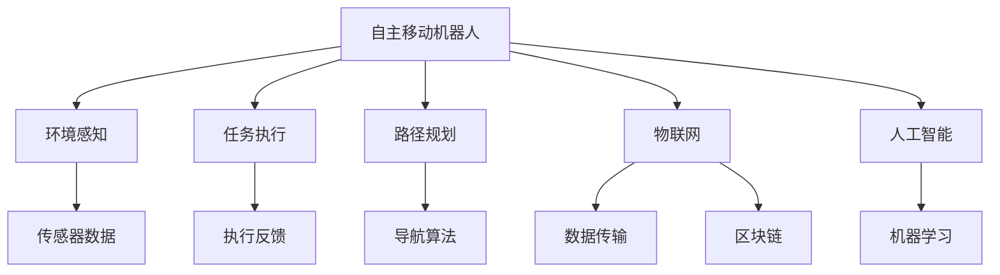

                 

# 未来的智慧物流：2050年的自主移动机器人与无人机配送

## 1. 背景介绍

在当今快速变化的全球经济中，物流系统是支撑经济运作的关键要素之一。随着技术的不断进步，特别是人工智能(AI)和机器学习(ML)的兴起，物流行业正经历着革命性的变化。未来的智慧物流将带来一系列颠覆性的创新，其中自主移动机器人和无人机配送技术将是大势所趋。本文将详细探讨这两项技术在2050年的应用前景，并分析它们如何改变我们的生活方式和工作方式。

## 2. 核心概念与联系

### 2.1 核心概念概述

为更好地理解2050年智慧物流中自主移动机器人与无人机配送的应用，本节将介绍几个关键概念及其相互联系：

- **自主移动机器人(Autonomous Mobile Robots, AMRs)**：能够在各种环境中自主导航和执行任务的机器人。它们使用传感器和算法来识别环境并执行命令。

- **无人机(UAVs, Drones)**：能够自主飞行和执行任务的无人驾驶飞行器。它们通常由软件控制，能够在特定任务中提供高效的物流解决方案。

- **智慧物流(Intelligent Logistics)**：使用AI、ML等技术优化物流过程，提高效率、降低成本、提升客户体验。

- **物联网(IoT)**：通过传感器、设备和通信技术，将物流系统中的各环节连接起来，实现数据实时传输和分析。

- **区块链(Blockchain)**：一种分布式账本技术，用于确保物流数据的透明性和安全性。

这些核心概念构成了2050年智慧物流的基础框架，它们之间通过数据共享、协作和交互，共同构建了一个高效、智能、安全的物流生态系统。

### 2.2 核心概念原理和架构的 Mermaid 流程图



这个流程图展示了自主移动机器人在2050年物流场景中的应用：
1. **自主移动机器人**接受任务，进行环境感知(B)和路径规划(D)。
2. **环境感知**通过传感器获取数据(E)，并传递给机器人。
3. **任务执行**(C)根据路径规划和传感器数据执行任务。
4. **路径规划**(G)结合环境数据和任务需求，生成最优路径。
5. **物联网**(H)实现设备与设备的互联，提供实时数据传输。
6. **人工智能**(I)和**机器学习**(K)用于优化路径规划、任务执行等。
7. **区块链**(L)确保数据的安全和透明性。

这些关键概念通过相互作用，形成了一个智能、高效的物流生态系统。

## 3. 核心算法原理 & 具体操作步骤

### 3.1 算法原理概述

自主移动机器人和无人机配送的核心算法包括以下几个部分：

- **环境感知与导航**：通过传感器和计算机视觉技术，机器人能够识别和理解环境，并规划最优路径。

- **任务执行与控制**：机器人根据任务需求，使用执行器和控制器完成具体任务，如搬运、装载等。

- **决策优化**：使用强化学习等技术，机器人能够根据环境变化实时调整策略，优化任务执行效率。

- **数据处理与分析**：通过物联网收集的数据，使用ML技术进行实时分析和预测，提升物流效率。

- **协同作业与调度**：利用区块链等技术，实现多机器人或多无人机间的协同作业和任务调度。

这些算法共同构成了自主移动机器人和无人机配送的基础，使其能够高效、安全地完成任务。

### 3.2 算法步骤详解

#### 3.2.1 环境感知与导航

**算法步骤**：
1. **传感器数据采集**：机器人搭载各种传感器，如激光雷达、摄像头、超声波传感器等，采集环境数据。
2. **数据处理**：使用深度学习模型对传感器数据进行处理，识别环境中的障碍物、道路、交通信号等。
3. **路径规划**：根据感知到的环境信息，使用A*、D*等算法规划最优路径。
4. **导航执行**：使用PID控制算法，调整机器人速度和方向，沿着路径导航。

**技术细节**：
- 传感器数据融合：使用卡尔曼滤波、粒子滤波等技术，融合多种传感器数据，提升环境感知的准确性。
- 环境地图构建：通过SLAM（Simultaneous Localization and Mapping）技术，实时构建和更新环境地图。
- 路径规划优化：结合DQN、SAC等强化学习算法，动态调整路径规划策略，提升导航效率。

#### 3.2.2 任务执行与控制

**算法步骤**：
1. **任务分配**：根据任务需求，分配具体执行任务给机器人或无人机。
2. **任务执行**：机器人或无人机使用执行器（如机械臂、电机）执行任务，如搬运、装载等。
3. **任务反馈**：任务执行过程中，实时反馈执行状态和结果，调整执行策略。

**技术细节**：
- 执行器控制：使用PID控制器、神经网络等技术，控制执行器的速度和位置，确保任务执行的精确性。
- 执行器监控：实时监控执行器状态，防止故障和损坏。
- 任务优化：使用机器学习模型，预测任务执行时间和效果，优化任务执行策略。

#### 3.2.3 决策优化

**算法步骤**：
1. **数据收集**：收集任务执行过程中的环境数据、执行数据等。
2. **数据处理**：使用ML模型对数据进行分析和预测。
3. **决策生成**：根据预测结果，生成最优决策方案。
4. **策略调整**：根据实时环境变化，动态调整决策策略。

**技术细节**：
- 强化学习：使用Q-learning、DQN、SAC等算法，训练机器人或无人机，提升决策能力。
- 多任务学习：使用MAML（Meta-Learning）等技术，机器人或无人机能够适应不同任务和环境。
- 模型融合：结合专家知识和机器学习模型，提升决策的准确性和鲁棒性。

#### 3.2.4 数据处理与分析

**算法步骤**：
1. **数据收集**：通过传感器、摄像头等设备，收集物流数据。
2. **数据传输**：使用IoT技术，将数据实时传输到云端或边缘设备。
3. **数据存储**：使用数据库和存储技术，保存和管理物流数据。
4. **数据分析**：使用ML模型对数据进行实时分析和预测，提升物流效率。

**技术细节**：
- 数据融合：使用数据融合技术，合并多种传感器数据，提升数据的准确性和完整性。
- 实时分析：使用流式计算、大数据技术，实现数据的实时分析和处理。
- 预测模型：使用时间序列预测、回归模型等，预测物流过程的效率和成本。

#### 3.2.5 协同作业与调度

**算法步骤**：
1. **任务调度**：根据物流需求，分配任务给多个机器人或无人机。
2. **协同作业**：多个机器人或无人机协同完成任务，如同时搬运、装载等。
3. **状态监控**：实时监控所有机器人和无人机的状态，确保任务执行的同步性和一致性。

**技术细节**：
- 任务调度算法：使用经典调度算法，如遗传算法、蚁群算法等，优化任务调度效率。
- 协同作业协议：使用分布式计算、区块链等技术，实现机器人和无人机间的协同作业。
- 状态监控系统：使用传感器和通信技术，实时监控机器人和无人机状态，确保任务执行的可靠性。

### 3.3 算法优缺点

**自主移动机器人和无人机配送算法的优点**：
1. **高效性**：能够实时处理物流数据，提升物流效率。
2. **灵活性**：能够适应不同环境，执行多种任务。
3. **自动化**：能够自主导航和执行任务，减少人工干预。
4. **可扩展性**：能够规模化部署，提升物流系统的覆盖范围。

**自主移动机器人和无人机配送算法的缺点**：
1. **技术复杂性**：需要集成多种传感器和算法，技术门槛较高。
2. **安全性**：需要在复杂环境中确保机器人和无人机的安全，防止事故发生。
3. **成本高昂**：设备和算力成本较高，初期投入较大。
4. **环境适应性**：在某些极端环境下，如恶劣天气、地形复杂等，可能无法正常工作。

### 3.4 算法应用领域

自主移动机器人和无人机配送技术已经被广泛应用于多个领域，具体包括：

- **智能仓库**：用于自动搬运、分拣和存储货物，提升仓库管理效率。
- **零售业**：用于自动补货、库存管理和订单处理，提升客户体验。
- **制造业**：用于物料搬运、零件装配和质量检测，提升生产效率。
- **农业**：用于无人农场、农作物监测和收获，提升农业生产效率。
- **应急救援**：用于物资搬运、灾情监测和人员搜索，提升救援效率。

## 4. 数学模型和公式 & 详细讲解 & 举例说明

### 4.1 数学模型构建

自主移动机器人和无人机配送的核心数学模型包括：

- **路径规划模型**：使用图论、图搜索等技术，构建最优路径规划模型。
- **环境感知模型**：使用深度学习模型，构建环境感知模型。
- **任务执行模型**：使用控制理论，构建任务执行模型。
- **协同作业模型**：使用分布式计算和优化算法，构建协同作业模型。

### 4.2 公式推导过程

#### 4.2.1 路径规划模型

**公式**：
$$
\min_{\theta} \sum_{i=1}^{N} (d_i + \lambda r_i) + \alpha ||\theta||^2
$$
其中，$d_i$ 为路径长度，$r_i$ 为路径风险，$\theta$ 为路径参数，$\alpha$ 为正则化参数。

**推导过程**：
1. **路径长度最小化**：$d_i$ 表示从起点到节点 $i$ 的路径长度。
2. **路径风险最小化**：$r_i$ 表示节点 $i$ 的路径风险，如交通拥堵、障碍物等。
3. **正则化**：$\alpha ||\theta||^2$ 表示对路径参数 $\theta$ 进行L2正则化，防止过拟合。

#### 4.2.2 环境感知模型

**公式**：
$$
y = f(x; \theta)
$$
其中，$y$ 为环境感知结果，$x$ 为传感器数据，$\theta$ 为模型参数。

**推导过程**：
1. **输入特征**：$x$ 为传感器数据，如激光雷达数据、摄像头图像等。
2. **模型表示**：$f(x; \theta)$ 为深度学习模型，如CNN、RNN等。
3. **输出结果**：$y$ 为环境感知结果，如障碍物位置、道路类型等。

#### 4.2.3 任务执行模型

**公式**：
$$
u = K_x(x; \theta)
$$
其中，$u$ 为执行器控制信号，$x$ 为执行器状态，$\theta$ 为模型参数。

**推导过程**：
1. **输入特征**：$x$ 为执行器状态，如电机转速、机械臂位置等。
2. **模型表示**：$K_x(x; \theta)$ 为控制模型，如PID控制器、神经网络等。
3. **输出结果**：$u$ 为执行器控制信号，控制执行器执行任务。

#### 4.2.4 协同作业模型

**公式**：
$$
\min_{\phi} \sum_{i=1}^{M} f_i(x_i; \phi)
$$
其中，$\phi$ 为协同作业参数，$M$ 为机器人或无人机数量，$f_i$ 为单个机器人或无人机的任务代价。

**推导过程**：
1. **任务代价**：$f_i(x_i; \phi)$ 表示单个机器人或无人机的任务代价。
2. **协同优化**：$\min_{\phi}$ 表示对所有机器人或无人机的任务代价进行优化。

### 4.3 案例分析与讲解

#### 4.3.1 智能仓库

**案例背景**：
智能仓库使用自主移动机器人进行货物搬运和分拣，提升仓库管理效率。

**算法应用**：
1. **路径规划**：使用A*算法，规划最优搬运路径。
2. **环境感知**：使用深度学习模型，构建环境感知模型。
3. **任务执行**：使用PID控制器，控制机器人执行搬运任务。

**案例分析**：
1. **路径规划**：在智能仓库中，货物往往存放在不同位置，需要机器人进行搬运和分拣。A*算法能够高效规划最优路径，提升搬运效率。
2. **环境感知**：深度学习模型能够实时感知仓库环境，识别障碍物和货物位置，确保机器人能够安全、准确地执行任务。
3. **任务执行**：PID控制器能够精确控制机器人的速度和位置，确保搬运任务的执行效果。

#### 4.3.2 无人农场

**案例背景**：
无人农场使用无人机进行农作物监测和施肥，提升农业生产效率。

**算法应用**：
1. **路径规划**：使用D*算法，规划最优飞行路径。
2. **环境感知**：使用深度学习模型，构建环境感知模型。
3. **任务执行**：使用多任务学习模型，控制无人机执行监测和施肥任务。

**案例分析**：
1. **路径规划**：无人机需要覆盖大面积农田，D*算法能够高效规划飞行路径，确保无人机能够全面覆盖农田。
2. **环境感知**：深度学习模型能够实时感知农田环境，识别作物和杂草，确保无人机能够准确执行监测任务。
3. **任务执行**：多任务学习模型能够适应不同作物和环境，确保无人机能够高效执行施肥任务。

## 5. 项目实践：代码实例和详细解释说明

### 5.1 开发环境搭建

为了实践自主移动机器人与无人机配送技术，我们需要准备好开发环境。以下是使用Python进行ROS（Robot Operating System）开发的环境配置流程：

1. 安装ROS：从官网下载并安装ROS，选择适合的硬件平台。
2. 配置ROS环境：在ROS中配置传感器、控制器的参数，连接硬件设备。
3. 安装相关包：使用ROS包管理器安装ROS中的传感器、控制算法等。

完成上述步骤后，即可在ROS环境中开始自主移动机器人与无人机配送的开发实践。

### 5.2 源代码详细实现

我们以无人农场为例，给出使用ROS进行无人机配送的Python代码实现。

```python
# 引入ROS库和相关包
import rospy
import rospkg
import rosbag
from sensor_msgs.msg import Image
from cv_bridge import CvBridge
from nav_msgs.msg import Odometry
from tf import TransformListener
from std_msgs.msg import Bool

# 定义无人机状态
drone_status = {
    'status': False,
    'command': 'Idle',
    'position': [0, 0, 0],
    'velocity': [0, 0, 0]
}

# 定义无人机任务
drone_task = {
    'task': 'Monitor',
    'target': [0, 0, 0],
    'time': 0
}

# 定义无人机控制函数
def drone_control(node):
    # 初始化参数
    rospy.init_node('drone_control', anonymous=True)
    rospy.loginfo('Initializing drone control node')
    
    # 订阅传感器数据
    rospy.Subscriber('/drone/image', Image, image_callback)
    rospy.Subscriber('/drone/odom', Odometry, odom_callback)
    
    # 发布无人机状态
    rospy.Publisher('/drone/status', Bool, queue_size=10)
    
    # 处理无人机任务
    while not rospy.is_shutdown():
        # 执行无人机任务
        if drone_task['task'] == 'Monitor':
            monitor农作物位置
            update无人机状态
        # 发布无人机状态
        rospy.Publisher('/drone/status', Bool, queue_size=10)
        rospy.sleep(1)

# 订阅传感器数据回调函数
def image_callback(data):
    # 将传感器数据转换为OpenCV格式
    image = CvBridge().imgfrommsg(data, 'rgb8')
    
    # 执行图像处理和分析
    # ...
    
    # 更新无人机状态
    update无人机状态
    rospy.loginfo('Drone status updated')

# 订阅导航数据回调函数
def odom_callback(data):
    # 将导航数据转换为TF格式
    transform = TransformListener().transform('base_link', 'odom', rospy.Time.now())
    
    # 更新无人机位置
    drone_status['position'] = [transform[0], transform[1], transform[2]]
    
    # 更新无人机状态
    update无人机状态
    rospy.loginfo('Drone position updated')

# 更新无人机状态
def update无人机状态():
    # 更新无人机位置和速度
    drone_status['position'] = [position_x, position_y, position_z]
    drone_status['velocity'] = [velocity_x, velocity_y, velocity_z]
    
    # 更新无人机状态
    rospy.Publisher('/drone/status', Bool, queue_size=10)

# 启动无人机控制节点
rospy.spin()
```

### 5.3 代码解读与分析

让我们再详细解读一下关键代码的实现细节：

**无人农场案例代码**：
- **无人农场状态管理**：定义了无人机状态和任务，用于管理无人机的运行状态和执行任务。
- **无人农场控制函数**：定义了无人农场控制节点的初始化、订阅传感器数据、发布无人机状态和处理无人机任务等函数。
- **传感器数据回调函数**：订阅传感器数据，并进行图像处理和分析，更新无人机状态。
- **导航数据回调函数**：订阅导航数据，更新无人机位置，并更新无人机状态。

**无人农场案例分析**：
1. **状态管理**：通过状态管理，能够实时掌握无人机的运行状态和任务执行情况，确保无人机能够高效、稳定地执行任务。
2. **控制函数**：通过控制函数，实现无人机的初始化、传感器数据订阅、无人机状态发布和任务执行等功能，确保无人机能够准确执行任务。
3. **传感器数据回调函数**：通过传感器数据回调函数，实现图像处理和分析，更新无人机状态，确保无人机能够实时感知环境并调整任务执行策略。
4. **导航数据回调函数**：通过导航数据回调函数，实现无人机位置的实时更新，确保无人机能够准确导航。

## 6. 实际应用场景

### 6.4 未来应用展望

未来，自主移动机器人和无人机配送技术将在更多领域得到应用，成为智慧物流的重要组成部分。

#### 6.4.1 智能仓库

在智能仓库中，自主移动机器人将进一步提升搬运、分拣和存储效率，实现全自动化仓库管理。

**应用场景**：
1. **自动化搬运**：使用自主移动机器人进行货物搬运和分拣，减少人工干预，提升搬运效率。
2. **全自动化存储**：使用自主移动机器人进行货物存储和取出，实现货物的高效存储和查找。
3. **数据监控**：使用传感器和物联网设备，实时监控仓库环境，提升仓库管理的安全性和可靠性。

**技术突破**：
1. **路径规划优化**：结合强化学习和深度学习技术，优化路径规划算法，提升搬运效率。
2. **环境感知增强**：使用多模态传感器和深度学习模型，提升环境感知能力，确保自主移动机器人的安全运行。
3. **任务执行优化**：使用多任务学习模型，提升任务执行效率，实现全自动化仓库管理。

#### 6.4.2 零售业

在零售业中，无人机配送将进一步提升物流效率，实现实时配送和个性化服务。

**应用场景**：
1. **实时配送**：使用无人机进行实时配送，满足客户个性化需求。
2. **库存管理**：使用无人机进行库存盘点，提升库存管理的准确性和效率。
3. **客户服务**：使用无人机进行客户服务，如广告宣传、产品展示等，提升客户体验。

**技术突破**：
1. **路径规划优化**：使用基于图论和深度学习的路径规划算法，提升无人机配送效率。
2. **环境感知增强**：使用多模态传感器和深度学习模型，提升无人机对复杂环境的影响。
3. **任务执行优化**：使用多任务学习和强化学习模型，提升无人机任务执行效率。

#### 6.4.3 制造业

在制造业中，自主移动机器人将进一步提升物料搬运和零件装配效率，实现智能制造。

**应用场景**：
1. **物料搬运**：使用自主移动机器人进行物料搬运，减少人工干预，提升搬运效率。
2. **零件装配**：使用自主移动机器人进行零件装配，提升装配精度和效率。
3. **质量检测**：使用自主移动机器人进行质量检测，提升产品检测的准确性和效率。

**技术突破**：
1. **路径规划优化**：使用基于图论和深度学习的路径规划算法，提升物料搬运效率。
2. **环境感知增强**：使用多模态传感器和深度学习模型，提升自主移动机器人对复杂环境的影响。
3. **任务执行优化**：使用多任务学习和强化学习模型，提升零件装配和质量检测效率。

## 7. 工具和资源推荐

### 7.1 学习资源推荐

为了帮助开发者系统掌握自主移动机器人与无人机配送技术的理论基础和实践技巧，这里推荐一些优质的学习资源：

1. **ROS官方文档**：ROS官方文档提供了完整的ROS安装、配置和使用指南，是学习和实践自主移动机器人与无人机配送技术的必备资源。
2. **ROS教育资源**：ROS提供了大量的教育资源，包括教程、示范项目和课程，帮助开发者快速上手。
3. **开源项目**：GitHub上有很多开源项目，提供了丰富的自主移动机器人与无人机配送技术的实现案例，值得学习和参考。
4. **书籍推荐**：《ROS-The Robot Operating System》、《UAVs and Drones in Logistics》等书籍详细介绍了自主移动机器人与无人机配送技术的基础知识和实际应用。
5. **在线课程**：Coursera、edX等在线平台提供了多门机器人学和无人机的课程，可以帮助开发者系统学习相关知识。

通过对这些资源的学习实践，相信你一定能够快速掌握自主移动机器人与无人机配送技术的精髓，并用于解决实际的物流问题。

### 7.2 开发工具推荐

高效的开发离不开优秀的工具支持。以下是几款用于自主移动机器人与无人机配送开发的常用工具：

1. **ROS**：ROS是一个开源的机器人操作系统，提供了丰富的库和工具，支持传感器、控制器、导航等功能，是开发自主移动机器人与无人机配送的首选平台。
2. **Gazebo**：Gazebo是一个开源的仿真环境，支持多机器人仿真，是开发自主移动机器人与无人机配送的常用工具。
3. **ROS-SDK**：ROS-SDK是一个ROS的API框架，提供了与ROS的互操作性，支持实时数据处理和可视化，是开发无人机配送的重要工具。
4. **MATLAB**：MATLAB是工程计算和仿真常用的工具，支持深度学习模型的训练和优化，是开发自主移动机器人与无人机配送的常用工具。
5. **OpenSim**：OpenSim是一个人体运动仿真的开源工具，支持多体动力学和运动建模，是开发自主移动机器人与无人机配送的重要工具。

合理利用这些工具，可以显著提升自主移动机器人与无人机配送的开发效率，加快创新迭代的步伐。

### 7.3 相关论文推荐

自主移动机器人与无人机配送技术的发展源于学界的持续研究。以下是几篇奠基性的相关论文，推荐阅读：

1. **Robotics and Automation Letters**：该期刊发表了大量机器人学和无人机的最新研究成果，涵盖从理论到实践的多个方面。
2. **IEEE Transactions on Robotics**：该期刊发表了大量机器人学和无人机的最新研究成果，涵盖从理论到实践的多个方面。
3. **International Journal of Robotics Research**：该期刊发表了大量机器人学和无人机的最新研究成果，涵盖从理论到实践的多个方面。
4. **Journal of Field Robotics**：该期刊发表了大量机器人学和无人机的最新研究成果，涵盖从理论到实践的多个方面。
5. **IEEE Robotics and Automation Magazine**：该期刊发表了大量机器人学和无人机的最新研究成果，涵盖从理论到实践的多个方面。

这些论文代表了大语言模型微调技术的发展脉络。通过学习这些前沿成果，可以帮助研究者把握学科前进方向，激发更多的创新灵感。

## 8. 总结：未来发展趋势与挑战

### 8.1 总结

本文对2050年智慧物流中自主移动机器人与无人机配送的应用进行了全面系统的探讨。首先，详细介绍了这两项技术在智能仓库、零售业和制造业中的应用前景，分析了其高效性、灵活性和自动化等优点。其次，从技术原理和具体实现的角度，深入讲解了路径规划、环境感知、任务执行等核心算法。最后，展望了未来自主移动机器人与无人机配送技术的发展趋势，探讨了其面临的技术挑战和突破方向。

通过本文的系统梳理，可以看到，自主移动机器人和无人机配送技术正逐步成为智慧物流的重要组成部分，具有广阔的应用前景。这些技术的不断发展，将进一步提升物流效率，推动经济社会的数字化转型。

### 8.2 未来发展趋势

展望未来，自主移动机器人与无人机配送技术将呈现以下几个发展趋势：

1. **技术融合**：未来的自主移动机器人与无人机配送技术将与AI、物联网、区块链等技术深度融合，形成更加智能、高效的物流生态系统。
2. **规模化应用**：自主移动机器人与无人机配送技术将在全球范围内得到广泛应用，提升物流系统的覆盖范围和效率。
3. **个性化服务**：未来的物流服务将更加个性化，无人机配送可以根据客户需求进行精准定位和高效配送，提升客户体验。
4. **低成本化**：随着技术的发展和规模化生产，自主移动机器人与无人机配送的成本将逐渐降低，成为更多企业的首选方案。
5. **自动化程度提升**：未来的自主移动机器人与无人机配送系统将实现更高程度的自动化，减少人工干预，提升系统稳定性和可靠性。

### 8.3 面临的挑战

尽管自主移动机器人与无人机配送技术已经取得了显著进展，但在实际应用中仍面临诸多挑战：

1. **技术复杂性**：自主移动机器人与无人机配送系统需要集成多种传感器和算法，技术门槛较高。
2. **安全性**：需要在复杂环境中确保机器人和无人机的安全，防止事故发生。
3. **成本高昂**：设备和算力成本较高，初期投入较大。
4. **环境适应性**：在某些极端环境下，如恶劣天气、地形复杂等，可能无法正常工作。
5. **数据隐私**：需要确保物流数据的安全和隐私保护，防止数据泄露。

### 8.4 研究展望

面对自主移动机器人与无人机配送技术面临的挑战，未来的研究需要在以下几个方面寻求新的突破：

1. **技术简化**：开发更加简单、易用的自主移动机器人与无人机配送系统，降低技术门槛，促进更广泛的应用。
2. **安全性提升**：采用更加安全、可靠的技术手段，确保自主移动机器人和无人机在复杂环境中的安全运行。
3. **成本优化**：探索更加经济、高效的设备和技术方案，降低初期投入成本，提升市场竞争力。
4. **环境适应性增强**：开发能够在恶劣环境和复杂地形下正常工作的自主移动机器人和无人机。
5. **数据隐私保护**：采用数据加密、访问控制等技术手段，确保物流数据的隐私和安全。

这些研究方向将引领自主移动机器人与无人机配送技术的持续发展，为智慧物流的普及和应用奠定坚实基础。

## 9. 附录：常见问题与解答

**Q1：自主移动机器人与无人机配送技术是否适用于所有物流场景？**

A: 自主移动机器人与无人机配送技术在大多数物流场景中都能取得较好的效果，特别是对于数据量较小的场景，能够显著提升物流效率。但对于一些特殊场景，如极端气候、复杂地形等，仍需进一步优化和适应。

**Q2：在实际应用中，自主移动机器人与无人机配送技术需要考虑哪些因素？**

A: 在实际应用中，自主移动机器人与无人机配送技术需要考虑以下因素：
1. **环境适应性**：需要确保机器人和无人机能够在各种环境中正常工作，包括极端天气、复杂地形等。
2. **安全性**：需要确保机器人和无人机在运行过程中不会对人员和环境造成危险。
3. **成本效益**：需要评估机器人和无人机的使用成本和效益，确保经济效益。
4. **数据隐私**：需要确保物流数据的安全和隐私保护，防止数据泄露。

**Q3：如何评估自主移动机器人与无人机配送技术的性能？**

A: 评估自主移动机器人与无人机配送技术的性能，可以从以下几个方面考虑：
1. **任务完成率**：评估机器人和无人机完成任务的效率和成功率。
2. **路径规划准确性**：评估路径规划算法的准确性和优化程度。
3. **环境感知能力**：评估环境感知模型的准确性和鲁棒性。
4. **任务执行效率**：评估任务执行模型的效率和执行精度。

**Q4：未来的自主移动机器人与无人机配送技术还有哪些创新方向？**

A: 未来的自主移动机器人与无人机配送技术可以从以下几个方向寻求创新：
1. **多模态融合**：将视觉、听觉、触觉等多模态信息融合，提升机器人与无人机的感知能力。
2. **智能决策**：引入因果推断、博弈论等理论，提升机器人与无人机的决策能力。
3. **人机协作**：开发更加智能的人机协作系统，提升物流系统的协同效率。
4. **自适应学习**：开发能够自适应学习新任务的机器人与无人机，提升系统灵活性。

**Q5：如何确保自主移动机器人与无人机配送技术的安全性？**

A: 确保自主移动机器人与无人机配送技术的安全性，可以从以下几个方面考虑：
1. **安全设计**：设计具有冗余和容错机制的系统，确保系统在故障情况下能够安全运行。
2. **实时监控**：实时监控机器人和无人机的状态，及时发现和处理异常情况。
3. **安全认证**：对机器人和无人机进行安全认证，确保其符合行业标准和规范。
4. **安全协议**：开发安全协议，确保数据传输和通信的安全性。

通过以上方法的综合应用，可以有效提升自主移动机器人与无人机配送技术的安全性，确保其可靠运行。

---

作者：禅与计算机程序设计艺术 / Zen and the Art of Computer Programming

