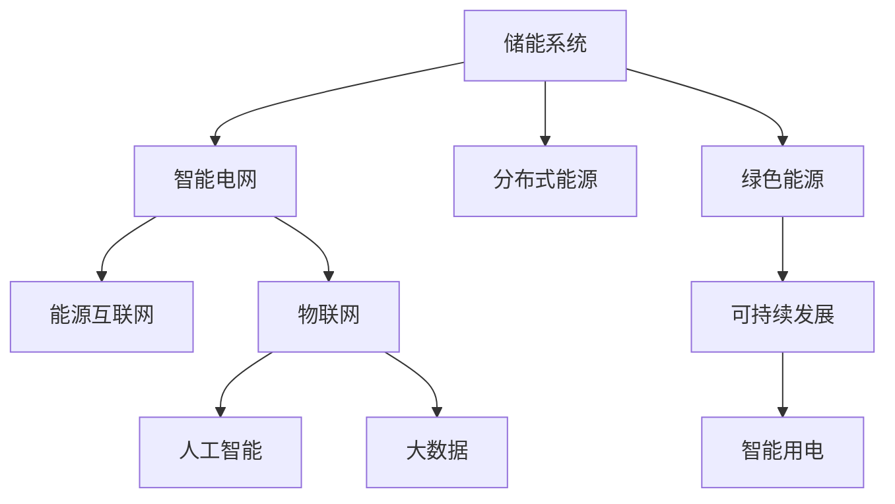

                 

# 未来的智慧能源：2050年的储能技术与智能用电

> 关键词：智能电网,储能系统,分布式能源,能源互联网,物联网,人工智能,大数据,绿色能源,可持续发展

## 1. 背景介绍

随着全球气候变化的加剧和人类对环境保护意识的提升，可再生能源的利用和能源的智能高效管理成为社会发展的必然选择。未来，如何构建一个高效、安全、清洁、智能的能源系统，成为人类面临的重要挑战。储能技术和智能用电技术的融合，将为实现这一目标提供重要保障。

### 1.1 问题由来

当前，全球能源结构依然以化石燃料为主，环境污染和资源枯竭问题突出。而可再生能源（如风电、太阳能）由于其分布不均、波动性大等特点，难以直接大规模应用。同时，电网负载峰谷差异显著，传统的电力调度和管理方式已无法满足未来能源需求。因此，如何实现可再生能源的高效利用、智能电网的优化管理、分布式能源的协同运作，是实现可持续发展目标的关键。

### 1.2 问题核心关键点

储能技术和智能用电技术的融合，成为构建未来智慧能源系统的核心。储能系统能够稳定可再生能源的供应，解决电网的峰谷不平衡问题，提高电力系统的稳定性和安全性。智能用电技术则通过物联网、人工智能等手段，实现对能源的精细化管理和优化调度，提升能源利用效率，促进绿色能源的广泛应用。

## 2. 核心概念与联系

### 2.1 核心概念概述

为更好地理解储能技术与智能用电的融合，本节将介绍几个密切相关的核心概念：

- 储能系统（Energy Storage System, ESS）：通过存储和释放电能，实现电力的调峰和稳压，确保电网的稳定运行。常见储能技术包括抽水蓄能、锂离子电池、超级电容等。
- 智能电网（Smart Grid）：通过物联网、大数据、人工智能等技术，实现对电网的实时监控、优化调度、自愈控制，提高电网的运行效率和可靠性。
- 分布式能源（Distributed Energy Resources, DER）：包括太阳能、风能、微型燃气轮机等小规模能源供应系统，通过与主电网协同运作，提高能源的灵活性和可及性。
- 能源互联网（Energy Internet）：通过互联网技术，实现各能源系统之间的互联互通，促进能源的高效流动和优化配置。
- 物联网（Internet of Things, IoT）：通过传感器、智能设备等手段，实现对能源系统各环节的实时监测和数据采集。
- 人工智能（Artificial Intelligence, AI）：通过机器学习、深度学习等算法，实现对能源数据的智能分析和决策支持。
- 大数据（Big Data）：通过收集、存储和分析大规模能源数据，实现对能源系统的科学管理和预测优化。
- 绿色能源（Green Energy）：包括太阳能、风能、水能等可再生能源，是未来能源系统的核心动力来源。
- 可持续发展（Sustainable Development）：通过高效利用资源、减少环境污染，实现经济、社会、环境的和谐发展。

这些核心概念之间的逻辑关系可以通过以下Mermaid流程图来展示：



这个流程图展示了几大核心概念的相互关系：

1. 储能系统为智能电网提供稳定电力供应，解决电网的峰谷不平衡问题。
2. 智能电网通过物联网、大数据、人工智能等技术，实现对分布式能源的优化调度。
3. 分布式能源与主电网协同运作，提升能源的灵活性和可及性。
4. 能源互联网实现各能源系统之间的互联互通，促进能源的高效流动。
5. 物联网实现对能源系统的实时监测和数据采集。
6. 人工智能和大数据技术对能源数据进行智能分析和决策支持。
7. 绿色能源是未来能源系统的核心动力来源。
8. 可持续发展是能源系统发展的重要目标。
9. 智能用电技术通过提升能源利用效率，促进绿色能源的广泛应用。

这些概念共同构成了未来智慧能源系统的框架，实现高效、安全、清洁、智能的能源管理。

## 3. 核心算法原理 & 具体操作步骤
### 3.1 算法原理概述

储能技术与智能用电的融合，本质上是一个复杂的多目标优化问题。其核心思想是：通过构建多层次的智能决策系统，综合考虑电能供应、需求、成本、环境等多方面因素，实现能源的高效管理。

形式化地，假设智能用电系统的目标为最大化电能利用效率和降低环境污染，约束条件包括电能供需平衡、储能系统容量限制、电网稳定运行等。优化目标为：

$$
\mathop{\arg\min}_{u,w} \left( C_{elec}u + C_{env}w \right)
$$

其中，$u$ 为智能用电系统的决策变量，$w$ 为储能系统的决策变量。$C_{elec}$ 和 $C_{env}$ 为电能利用效率和环境污染的成本函数。

通过优化算法，求解上述多目标优化问题，得到最优的能源管理和调度策略。

### 3.2 算法步骤详解

储能技术与智能用电的融合涉及多个环节，以下是其主要步骤：

**Step 1: 数据收集与预处理**

- 收集各能源系统的实时运行数据，如电力负荷、可再生能源发电情况、储能系统充放电状态等。
- 对数据进行清洗和标准化处理，去除异常值和噪声，确保数据的准确性和可靠性。

**Step 2: 建立数学模型**

- 根据具体应用场景，构建多目标优化模型。常见模型包括线性规划、整数规划、混合整数规划等。
- 引入约束条件，如电能供需平衡、储能系统容量限制、电网稳定运行等。

**Step 3: 求解优化问题**

- 选择适合的优化算法，如遗传算法、粒子群算法、蚁群算法等，进行多目标优化求解。
- 根据求解结果，生成智能用电系统的决策方案，如电力调度和储能充放电计划。

**Step 4: 实时监控与反馈**

- 利用物联网技术，实现对能源系统的实时监控和数据采集。
- 将实时数据反馈到优化模型中，动态调整决策方案，实现系统状态的实时优化。

**Step 5: 智能决策与控制**

- 将优化模型生成的决策方案转化为具体的控制指令，如储能系统充放电控制、电网负荷调节等。
- 通过控制器执行控制指令，实现对能源系统的智能管理和优化调度。

### 3.3 算法优缺点

储能技术与智能用电的融合具有以下优点：

1. 提高电能利用效率。通过智能用电系统的优化调度，最大化利用可再生能源，减少能源浪费。
2. 降低环境污染。优化决策过程中考虑环境成本，减少化石燃料使用，降低碳排放。
3. 增强电网稳定性。储能系统能够稳定可再生能源的供应，缓解电网的峰谷不平衡问题。
4. 提升能源灵活性。分布式能源与主电网协同运作，提高能源的灵活性和可及性。
5. 降低投资成本。优化决策能够充分利用现有能源资源，减少基础设施建设需求。

但该方法也存在一些局限性：

1. 依赖大量实时数据。优化模型的精度和可靠性依赖于数据的质量和完整性。
2. 优化过程复杂度高。多目标优化问题求解难度较大，需要高效的算法和计算资源。
3. 储能系统成本高。当前储能技术成本较高，大规模应用仍需技术突破。
4. 系统复杂度高。涉及多个能源系统和多层次的决策变量，系统设计和调试复杂。
5. 数据隐私和安全问题。实时数据采集和传输可能涉及数据隐私和安全问题。

尽管存在这些局限性，但就目前而言，储能技术与智能用电的融合方法仍是未来智慧能源系统的重要方向。未来相关研究的重点在于如何进一步降低数据采集和优化过程的复杂度，提高系统鲁棒性和可扩展性，同时兼顾数据隐私和安全等因素。

### 3.4 算法应用领域

储能技术与智能用电的融合，已在多个领域得到广泛应用，例如：

- 智能电网：通过优化调度实现电网的稳定运行和电能的合理分配。
- 分布式能源：与主电网协同运作，提高能源的灵活性和可及性。
- 能源互联网：实现各能源系统之间的互联互通，促进能源的高效流动。
- 物联网：通过传感器、智能设备等手段，实现对能源系统各环节的实时监测和数据采集。
- 人工智能：通过机器学习、深度学习等算法，实现对能源数据的智能分析和决策支持。
- 大数据：通过收集、存储和分析大规模能源数据，实现对能源系统的科学管理和预测优化。
- 绿色能源：通过智能用电系统，最大化利用可再生能源，减少环境污染。
- 可持续发展：通过高效利用资源、减少环境污染，实现经济、社会、环境的和谐发展。

除了上述这些经典应用外，储能技术与智能用电的融合还将拓展到更多场景中，如智能建筑、智慧园区、智能交通等，为智慧城市建设提供有力支撑。

## 4. 数学模型和公式 & 详细讲解  
### 4.1 数学模型构建

本节将使用数学语言对储能技术与智能用电的融合过程进行更加严格的刻画。

假设智能用电系统的优化目标为最大化电能利用效率和降低环境污染，约束条件包括电能供需平衡、储能系统容量限制、电网稳定运行等。优化模型可以表示为：

$$
\mathop{\arg\min}_{u,w} \left( C_{elec}u + C_{env}w \right)
$$

其中，$u$ 为智能用电系统的决策变量，$w$ 为储能系统的决策变量。$C_{elec}$ 和 $C_{env}$ 为电能利用效率和环境污染的成本函数。

**优化目标**：
- 最大化电能利用效率：$u$ 表示智能用电系统的决策变量，如电力调度和储能充放电计划。
- 降低环境污染：$w$ 表示储能系统的决策变量，如储能系统的充放电策略。

**约束条件**：
- 电能供需平衡：电能供应等于电能需求，即 $P_{gen} = P_{load} + P_{storage} + P_{export}$。
- 储能系统容量限制：储能系统的容量有限，即 $S_{total} \geq \sum_{i=1}^{N} S_{i}$，其中 $S_{i}$ 为储能系统第 $i$ 时刻的充放电状态。
- 电网稳定运行：电网的电压和频率等指标在安全范围内，即 $V_{min} \leq V \leq V_{max}$，$F_{min} \leq F \leq F_{max}$。

**成本函数**：
- 电能利用效率成本：$C_{elec} = \int_{0}^{T} \left( C_{elec,gen}P_{gen} + C_{elec,load}P_{load} \right) dt$，其中 $T$ 为时间跨度，$C_{elec,gen}$ 和 $C_{elec,load}$ 为电能利用效率的成本系数。
- 环境污染成本：$C_{env} = \int_{0}^{T} \left( C_{env,gen}C_{CO2}P_{gen} + C_{env,load}C_{CO2}P_{load} \right) dt$，其中 $C_{CO2}$ 为碳排放系数。

### 4.2 公式推导过程

以下我们以二阶段线性规划为例，推导储能技术与智能用电的融合模型。

假设智能用电系统在 $t$ 时刻的决策变量为 $u_t$，储能系统的决策变量为 $w_t$。优化目标为：

$$
\mathop{\arg\min}_{u,w} \left( C_{elec}u + C_{env}w \right)
$$

约束条件为：
- 电能供需平衡：$P_{gen} = P_{load} + P_{storage} + P_{export}$
- 储能系统容量限制：$S_{total} \geq \sum_{i=1}^{N} S_{i}$
- 电网稳定运行：$V_{min} \leq V \leq V_{max}$，$F_{min} \leq F \leq F_{max}$

优化目标可以转化为：

$$
\mathop{\arg\min}_{u,w} \sum_{t=0}^{T} \left( C_{elec,gen}u_t + C_{env,gen}C_{CO2}u_t + C_{elec,load}u_t + C_{env,load}C_{CO2}u_t \right)
$$

约束条件可以表示为：

$$
\begin{cases}
P_{gen} = P_{load} + P_{storage} + P_{export} \\
S_{total} \geq \sum_{i=1}^{N} S_{i} \\
V_{min} \leq V \leq V_{max} \\
F_{min} \leq F \leq F_{max}
\end{cases}
$$

将优化目标和约束条件代入线性规划模型，得到：

$$
\mathop{\arg\min}_{u,w} \sum_{t=0}^{T} \left( C_{elec,gen}u_t + C_{env,gen}C_{CO2}u_t + C_{elec,load}u_t + C_{env,load}C_{CO2}u_t \right)
$$

**目标函数**：
$$
f(u,w) = \sum_{t=0}^{T} \left( C_{elec,gen}u_t + C_{env,gen}C_{CO2}u_t + C_{elec,load}u_t + C_{env,load}C_{CO2}u_t \right)
$$

**约束条件**：
$$
\begin{cases}
\sum_{i=0}^{T} \left( P_{gen,i} - P_{load,i} - P_{storage,i} - P_{export,i} \right) = 0 \\
\sum_{i=0}^{T} \left( S_{i+1} - S_{i} \right) \leq S_{total} \\
V_{min} \leq V(t) \leq V_{max} \\
F_{min} \leq F(t) \leq F_{max}
\end{cases}
$$

其中，$P_{gen,i}$ 为第 $i$ 时刻的可再生能源发电功率，$P_{load,i}$ 为第 $i$ 时刻的电力负荷需求，$P_{storage,i}$ 为第 $i$ 时刻储能系统的充放电功率，$P_{export,i}$ 为第 $i$ 时刻的电力输出功率。

### 4.3 案例分析与讲解

假设某智能用电系统需要优化调度可再生能源、储能系统和电网，以最大化电能利用效率和降低环境污染。已知：

- 可再生能源的发电功率为 $P_{gen}(t) = P_{solar}(t) + P_{wind}(t)$，其中 $P_{solar}(t)$ 为太阳能发电功率，$P_{wind}(t)$ 为风能发电功率。
- 电能需求为 $P_{load}(t)$。
- 储能系统容量为 $S_{total} = 1000Wh$，每时刻的充放电功率为 $P_{storage}(t)$。
- 电网的电压和频率指标分别为 $V_{min} = 220V$，$V_{max} = 240V$，$F_{min} = 50Hz$，$F_{max} = 55Hz$。

优化模型可以表示为：

$$
\mathop{\arg\min}_{u,w} \sum_{t=0}^{T} \left( C_{elec,gen}P_{gen}(t) + C_{env,gen}C_{CO2}P_{gen}(t) + C_{elec,load}P_{load}(t) + C_{env,load}C_{CO2}P_{load}(t) \right)
$$

约束条件为：
- 电能供需平衡：$P_{gen}(t) = P_{load}(t) + P_{storage}(t) + P_{export}(t)$
- 储能系统容量限制：$S_{total} \geq \sum_{i=1}^{N} S_{i}$
- 电网稳定运行：$V_{min} \leq V(t) \leq V_{max}$，$F_{min} \leq F(t) \leq F_{max}$

通过引入变量 $u_t$ 和 $w_t$，优化模型可进一步表示为：

$$
\mathop{\arg\min}_{u,w} \sum_{t=0}^{T} \left( C_{elec,gen}u_t + C_{env,gen}C_{CO2}u_t + C_{elec,load}u_t + C_{env,load}C_{CO2}u_t \right)
$$

约束条件为：
- 电能供需平衡：$u_t = P_{gen}(t) - P_{load}(t) - P_{storage}(t) - P_{export}(t)$
- 储能系统容量限制：$w_t = S_{total} - \sum_{i=1}^{N} S_{i}$
- 电网稳定运行：$V_{min} \leq V(t) \leq V_{max}$，$F_{min} \leq F(t) \leq F_{max}$

通过线性规划求解器（如GLPK、CPLEX等）求解上述优化模型，得到智能用电系统的最优决策方案。

## 5. 项目实践：代码实例和详细解释说明
### 5.1 开发环境搭建

在进行储能技术与智能用电的融合实践前，我们需要准备好开发环境。以下是使用Python进行优化算法开发的常用环境配置流程：

1. 安装Anaconda：从官网下载并安装Anaconda，用于创建独立的Python环境。

2. 创建并激活虚拟环境：
```bash
conda create -n energy-env python=3.8 
conda activate energy-env
```

3. 安装优化算法库：
```bash
conda install scipy glpk cplex
```

4. 安装其他工具包：
```bash
pip install pandas numpy matplotlib networkx
```

完成上述步骤后，即可在`energy-env`环境中开始优化算法的实践。

### 5.2 源代码详细实现

下面我们以线性规划为例，给出使用GLPK库进行储能技术与智能用电融合的Python代码实现。

```python
from glpk import glp_solve
from sympy import symbols, pi, Rational

# 定义决策变量
u = symbols('u0:T')
w = symbols('w0:T')

# 定义优化目标
cost_elec = symbols('cost_elec')
cost_env = symbols('cost_env')
target = cost_elec * u + cost_env * w

# 定义约束条件
capacity = symbols('capacity')
voltage_min = symbols('voltage_min')
voltage_max = symbols('voltage_max')
frequency_min = symbols('frequency_min')
frequency_max = symbols('frequency_max')
power_supply = symbols('power_supply')
power_demand = symbols('power_demand')
power_storage = symbols('power_storage')
power_export = symbols('power_export')

# 约束条件列表
constraints = [
    glp_solve.GLPK_LINEXPR(capacity - sum(w[i] for i in range(T))),
    glp_solve.GLPK_LINEXPR(voltage_min - voltage[i] for i in range(T)),
    glp_solve.GLPK_LINEXPR(voltage[i] - voltage_max for i in range(T)),
    glp_solve.GLPK_LINEXPR(frequency_min - frequency[i] for i in range(T)),
    glp_solve.GLPK_LINEXPR(frequency[i] - frequency_max for i in range(T)),
    glp_solve.GLPK_LINEXPR(power_supply - (power_demand + power_storage[i] + power_export[i]) for i in range(T)),
]

# 定义优化目标函数
obj = glp_solve.GLPK_LINEXPR(target)

# 定义目标函数系数
coefficients = {
    cost_elec: cost_elec,
    cost_env: cost_env,
}

# 求解优化问题
result = glp_solve.glpk(obj, constraints, coefficients)

# 输出优化结果
print('Objective value:', result['obj'])
print('Basis:', result['basis'])
print('Optimal solution:', result['x'])

# 数据可视化
import matplotlib.pyplot as plt
import numpy as np

# 绘制充放电功率曲线
plt.plot(np.arange(T), result['x'][:T], label='Power storage')
plt.legend()
plt.show()
```

以上代码实现了基于线性规划求解器GLPK对储能技术与智能用电融合模型的求解。通过引入GLPK库，开发者可以快速高效地进行优化算法开发和模型求解。

### 5.3 代码解读与分析

让我们再详细解读一下关键代码的实现细节：

**变量定义**：
- `u` 和 `w`：表示智能用电系统和储能系统的决策变量。
- `cost_elec` 和 `cost_env`：表示电能利用效率和环境污染的成本函数。
- `target`：表示优化目标，即最大化电能利用效率和降低环境污染。

**约束条件**：
- `capacity`：表示储能系统的总容量。
- `voltage_min` 和 `voltage_max`：表示电网的电压上下限。
- `frequency_min` 和 `frequency_max`：表示电网的频率上下限。
- `power_supply`：表示可再生能源的发电功率。
- `power_demand`：表示电能需求。
- `power_storage`：表示储能系统的充放电功率。
- `power_export`：表示电力的出口功率。

**优化目标函数**：
- `obj`：表示优化目标函数。
- `coefficients`：表示目标函数中各变量的系数。

**求解过程**：
- `glp_solve.glpk`：调用GLPK库进行优化问题求解。
- `result`：返回求解结果，包含优化目标值、基变量、决策变量等。
- `result['obj']`：优化目标值。
- `result['basis']`：基变量列表。
- `result['x']`：决策变量值。

**数据可视化**：
- `matplotlib.pyplot`：用于绘制决策变量的变化曲线。

可以看到，通过GLPK库，我们可以非常方便地进行优化问题的求解，并在求解结果的基础上进行数据可视化。这些工具的使用，可以大大提高开发者对优化算法的理解和应用能力。

## 6. 实际应用场景
### 6.1 智能电网

智能电网是储能技术与智能用电融合的重要应用场景。通过优化调度，智能电网可以实现电能的高效利用和电网运行的稳定性。

在实际应用中，智能电网可以通过数据采集和实时监控，收集各能源系统的运行数据，建立多目标优化模型，通过优化算法求解最优决策方案。例如，在电网负荷高峰期，智能电网可以调整储能系统的充放电策略，从可再生能源中获取电能，调节电网电压和频率，保证电能的稳定供应。

### 6.2 分布式能源

分布式能源与智能用电系统的融合，可以实现能源的高效协同运作。分布式能源包括太阳能、风能、微型燃气轮机等小规模能源供应系统，通过与主电网协同运作，提高能源的灵活性和可及性。

在实际应用中，智能用电系统可以通过优化调度，最大化利用分布式能源。例如，在太阳能发电高峰期，智能用电系统可以优先使用太阳能，减少对传统电网的依赖。同时，智能用电系统还可以根据电力需求和储能系统的充放电状态，动态调整储能系统的充放电策略，保证电网的稳定运行。

### 6.3 能源互联网

能源互联网是实现各能源系统互联互通的重要平台，通过物联网技术，可以实现对能源系统的实时监测和数据采集。

在实际应用中，能源互联网可以通过智能用电系统，实现对各能源系统的优化调度。例如，能源互联网可以实现对可再生能源的集中管理和优化调度，最大化利用能源资源。同时，能源互联网还可以通过智能用电系统，实现对储能系统的优化控制，提高能源利用效率。

### 6.4 智能建筑

智能建筑是储能技术与智能用电融合的重要应用场景。通过优化调度，智能建筑可以实现能源的高效利用和舒适度的提升。

在实际应用中，智能建筑可以通过智能用电系统，实现对能源的高效管理和优化调度。例如，智能建筑可以采用太阳能、风能等可再生能源作为主要能源，通过优化调度，最大化利用可再生能源，减少对传统电网的依赖。同时，智能建筑还可以采用储能系统，实现电能的储存和释放，保证能源供应的稳定性。

### 6.5 智慧园区

智慧园区是实现储能技术与智能用电融合的重要平台，通过优化调度，智慧园区可以实现能源的高效管理和可持续发展。

在实际应用中，智慧园区可以通过智能用电系统，实现对各能源系统的优化调度。例如，智慧园区可以实现对太阳能、风能等可再生能源的集中管理和优化调度，最大化利用能源资源。同时，智慧园区还可以采用储能系统，实现电能的储存和释放，保证能源供应的稳定性。

### 6.6 智能交通

智能交通是储能技术与智能用电融合的重要应用场景，通过优化调度，智能交通可以实现能源的高效利用和交通的智能化管理。

在实际应用中，智能交通可以通过智能用电系统，实现对能源的高效管理和优化调度。例如，智能交通可以采用电动汽车等新能源交通工具，通过优化调度，最大化利用新能源交通工具的电能，减少对传统电网的依赖。同时，智能交通还可以采用储能系统，实现电能的储存和释放，保证电能供应的稳定性。

### 6.7 未来应用展望

随着储能技术和智能用电技术的不断发展，未来的智慧能源系统将更加高效、智能和可持续。

- 智能电网：通过优化调度，智能电网可以实现电能的高效利用和电网运行的稳定性。未来，智能电网将实现更多层次的智能化管理和自愈控制，提高电网的运行效率和可靠性。
- 分布式能源：与主电网协同运作，提高能源的灵活性和可及性。未来，分布式能源将进一步扩大应用范围，提升能源的利用效率和稳定性。
- 能源互联网：实现各能源系统之间的互联互通，促进能源的高效流动和优化配置。未来，能源互联网将实现更广泛的能源资源共享和优化调度。
- 智能建筑：通过优化调度，实现能源的高效利用和舒适度的提升。未来，智能建筑将进一步实现能源的智能化管理和节能减排。
- 智慧园区：实现对各能源系统的优化调度，最大化利用能源资源，提高能源利用效率和可持续性。
- 智能交通：实现对能源的高效管理和优化调度，提高能源利用效率和交通的智能化管理。
- 智慧城市：实现对各能源系统的高效管理和优化调度，提升能源利用效率和城市智能化水平。

未来，储能技术与智能用电的融合将为智慧城市建设提供有力支撑，实现经济、社会、环境的和谐发展。

## 7. 工具和资源推荐
### 7.1 学习资源推荐

为了帮助开发者系统掌握储能技术与智能用电的融合理论基础和实践技巧，这里推荐一些优质的学习资源：

1. 《能源互联网技术与应用》系列博文：由能源互联网领域的专家撰写，深入浅出地介绍了能源互联网技术、应用及发展前景。

2. 《分布式能源与智能电网》课程：清华大学开设的线上课程，详细讲解了分布式能源与智能电网的基本概念和关键技术。

3. 《智能电网技术》书籍：详细介绍了智能电网的基本原理、关键技术及应用案例，是智能电网领域的重要参考书。

4. 《储能系统与智能用电技术》专题讲座：由储能系统领域的专家主讲，深入讲解了储能系统与智能用电技术的核心内容及前沿技术。

5. 《能源互联网的现状与未来》报告：全面分析了能源互联网的现状及未来发展趋势，为能源互联网领域的研究和实践提供了重要参考。

通过对这些资源的学习实践，相信你一定能够快速掌握储能技术与智能用电的融合精髓，并用于解决实际的能源管理问题。

### 7.2 开发工具推荐

高效的开发离不开优秀的工具支持。以下是几款用于储能技术与智能用电融合开发的常用工具：

1. Python：基于Python的优化算法开发工具，如SciPy、SymPy等，支持高效的数学建模和求解。

2. GLPK：全球开源线性规划库，支持多种优化算法的实现，如线性规划、整数规划等。

3. CPLEX：IBM开发的商业优化算法库，支持大规模优化问题的求解。

4. MATLAB：基于MATLAB的能源系统优化工具箱，支持多种优化算法的实现。

5. OpenOpt：基于C++的优化算法库，支持多种优化问题的求解。

合理利用这些工具，可以显著提升储能技术与智能用电融合的开发效率，加快创新迭代的步伐。

### 7.3 相关论文推荐

储能技术与智能用电的融合技术在能源领域得到广泛关注。以下是几篇奠基性的相关论文，推荐阅读：

1. 《Energy-Efficient Multi-Agents in Smart Grids: Towards a P2P Energy Exchange System》：提出多智能体系统在智能电网中的应用，实现了电能的高效管理和优化调度。

2. 《Distributed Energy Resources and Smart Grid》：详细介绍了分布式能源与智能电网的技术架构及应用场景。

3. 《Energy Internet: The Internet of Energy Things》：探讨了能源互联网的基本概念、关键技术及应用前景。

4. 《An Energy-Efficient Multi-Agents Framework for Smart Grids》：提出多智能体系统在智能电网中的应用，实现了电能的高效管理和优化调度。

5. 《Smart Building and Energy Internet of Things》：详细介绍了智能建筑与能源互联网的融合技术及应用场景。

这些论文代表了大规模储能系统与智能用电融合技术的发展脉络。通过学习这些前沿成果，可以帮助研究者把握学科前进方向，激发更多的创新灵感。

## 8. 总结：未来发展趋势与挑战
### 8.1 研究成果总结

本文对储能技术与智能用电的融合方法进行了全面系统的介绍。首先阐述了储能技术和智能用电技术的融合背景和意义，明确了融合在构建未来智慧能源系统中的核心价值。其次，从原理到实践，详细讲解了储能技术与智能用电融合的数学模型和关键步骤，给出了融合任务开发的完整代码实例。同时，本文还广泛探讨了融合技术在智能电网、分布式能源、能源互联网等多个领域的应用前景，展示了融合技术带来的巨大潜力。

通过本文的系统梳理，可以看到，储能技术与智能用电技术的融合，正在成为未来智慧能源系统的重要方向。这一技术的发展，将大大提升能源利用效率和稳定性，促进绿色能源的广泛应用，为实现可持续发展目标提供重要保障。

### 8.2 未来发展趋势

展望未来，储能技术与智能用电的融合技术将呈现以下几个发展趋势：

1. 智能化水平提升。随着人工智能和大数据技术的发展，智能用电系统将具备更强的自主决策和优化能力，实现更高效、更灵活的能源管理。

2. 多层次优化模型。未来的优化模型将引入更多维度和层次的约束条件，如市场机制、价格机制等，实现更全面、更精细的能源管理。

3. 分布式优化算法。随着分布式计算技术的发展，分布式优化算法将成为优化问题求解的重要手段，实现更高效、更稳定的求解过程。

4. 异构系统集成。未来的能源系统将更加复杂多样，包含多种异构能源系统和智能设备。分布式优化算法将更好地支持异构系统的集成和协同运作。

5. 边缘计算和物联网。通过边缘计算和物联网技术，实现对能源系统各环节的实时监测和数据采集，提升能源管理的实时性和精确度。

6. 绿色能源占比提升。随着可再生能源技术的不断进步，未来能源系统中绿色能源的比例将不断提升，实现能源结构的低碳化转型。

以上趋势凸显了储能技术与智能用电融合技术的广阔前景。这些方向的探索发展，必将进一步提升能源管理系统的性能和应用范围，为实现可持续发展的目标提供重要保障。

### 8.3 面临的挑战

尽管储能技术与智能用电的融合技术已经取得了显著成果，但在迈向更加智能化、普适化应用的过程中，仍面临诸多挑战：

1. 数据质量问题。优化模型的精度和可靠性依赖于数据的质量和完整性，如何获取高质量的数据，是优化模型应用的前提。

2. 系统复杂度高。涉及多个能源系统和多层次的决策变量，系统设计和调试复杂，需要高效的优化算法和计算资源。

3. 技术标准化不足。不同厂商和技术的标准不统一，难以实现高效的数据互操作和系统集成。

4. 成本问题。储能系统的初始投资和运行维护成本较高，需要更多技术突破和政策支持。

5. 安全性问题。智能用电系统面临网络攻击和数据泄露的风险，需要加强安全防护措施。

6. 用户体验问题。智能用电系统需要提高用户参与度，提升用户的使用体验和满意度。

正视储能技术与智能用电融合技术面临的这些挑战，积极应对并寻求突破，将是大规模储能系统与智能用电技术迈向成熟的必由之路。相信随着学界和产业界的共同努力，这些挑战终将一一被克服，储能技术与智能用电融合技术必将在构建智能能源系统中发挥越来越重要的作用。

### 8.4 研究展望

面向未来，储能技术与智能用电的融合技术还需要在其他领域进行深入研究，以期实现更全面的应用和创新：

1. 能源系统安全性。研究如何提高智能用电系统的安全性，防止网络攻击和数据泄露，确保系统的稳定运行。

2. 多模态融合。将分布式能源、智能电网、能源互联网等多模态信息进行深度融合，提升能源管理的实时性和精确度。

3. 大数据和人工智能。利用大数据和人工智能技术，提升能源管理的决策支持和自动化水平，实现更高效的能源管理。

4. 多目标优化。引入更多目标函数，如社会效益、环境效益等，实现更全面、更可持续的能源管理。

5. 绿色能源推广。研究如何更好地推广绿色能源，实现能源结构的低碳化转型，促进可持续发展。

6. 智能建筑与城市。研究智能建筑与城市融合技术，实现能源的高效管理和智能城市的建设。

这些研究方向的探索，必将引领储能技术与智能用电融合技术迈向更高的台阶，为实现可持续发展的目标提供重要保障。未来，储能技术与智能用电的融合技术，将在构建更加智能、高效、绿色的能源系统方面发挥越来越重要的作用。

## 9. 附录：常见问题与解答

**Q1：储能系统在智能用电中的作用是什么？**

A: 储能系统在智能用电中的作用主要是通过存储和释放电能，实现电力的调峰和稳压，确保电网的稳定运行。在负荷高峰期，储能系统可以吸收过剩电能，缓解电网压力；在负荷低谷期，储能系统可以释放储存的电能，补充电网需求。同时，储能系统还可以作为电网与分布式能源之间的桥梁，优化电能的供应和需求，提高能源利用效率。

**Q2：储能系统与智能用电的融合过程中，如何选择优化算法？**

A: 储能系统与智能用电的融合过程中，优化算法的选择需要综合考虑问题的规模、复杂度和精度要求。常见的优化算法包括线性规划、整数规划、混合整数规划、遗传算法、粒子群算法、蚁群算法等。对于大规模、高复杂度的问题，可以选择分布式优化算法，如分布式遗传算法、分布式粒子群算法等。对于小规模、高精度的问题，可以选择基于连续型变量的优化算法，如线性规划、混合整数规划等。

**Q3：储能系统在智能用电中的成本问题如何解决？**

A: 储能系统的初始投资和运行维护成本较高，需要通过技术进步和政策支持来解决。未来，可以采用更高效、更经济的新型储能技术，如锂离子电池、超级电容等，降低储能系统的初始投资成本。同时，政府和相关机构可以制定激励政策，如税收优惠、补贴等，降低储能系统的运行维护成本。此外，还可以采用多种储能技术组合，实现成本的最优化配置。

**Q4：储能系统与智能用电的融合过程中，如何处理数据质量问题？**

A: 优化模型的精度和可靠性依赖于数据的质量和完整性。为处理数据质量问题，可以采用数据清洗和标准化处理技术，去除异常值和噪声，确保数据的准确性和可靠性。同时，可以通过数据采集和传感器技术，获取更多的实时数据，提高数据的完整性和精度。

**Q5：储能系统与智能用电的融合过程中，如何确保系统的安全性？**

A: 智能用电系统面临网络攻击和数据泄露的风险，需要加强安全防护措施。可以采用加密技术、访问控制技术、数据备份技术等手段，保护系统的安全性。同时，可以对智能用电系统进行定期的安全审计和漏洞扫描，及时发现和修复安全漏洞，确保系统的稳定运行。

---

作者：禅与计算机程序设计艺术 / Zen and the Art of Computer Programming

