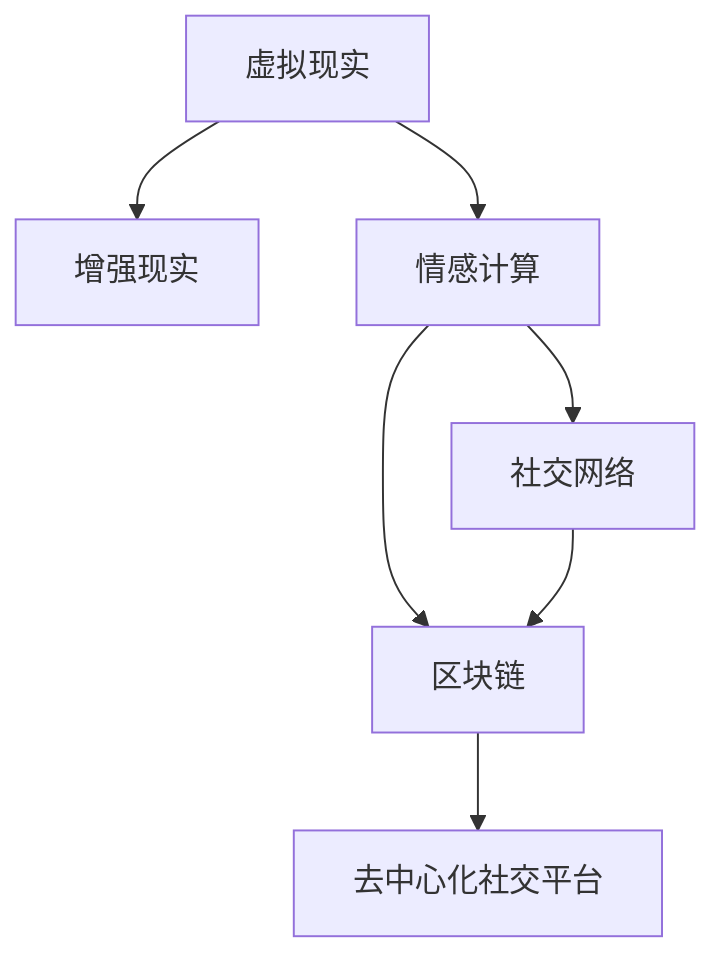

                 

## 1. 背景介绍

### 1.1 问题由来

在未来的社会中，人际交往的方式将发生翻天覆地的变化。得益于人工智能、物联网、虚拟现实等技术的飞速发展，人类社会的交往模式正朝着更加智能、高效、个性化的方向演进。这些技术不仅在物质层面上极大地提升了人们的生产效率和生活质量，也在精神层面上重塑了人们的情感体验和社交模式。

### 1.2 问题核心关键点

未来社交方式的核心关键点在于，如何利用先进技术构建起更加智能、高效的社交系统，使人类能够在信息爆炸的时代，保持深刻的情感联系和复杂的人际互动。这包括了以下几个方面：

1. **虚拟现实和增强现实**：通过虚拟现实（VR）和增强现实（AR）技术，构建沉浸式的社交环境，打破物理空间的限制。
2. **情感计算和分析**：通过先进的情感识别和计算技术，洞察人类情感的变化和需求，实现更加智能化的情感互动。
3. **人工智能驱动的社交网络**：利用AI技术，自动推荐和优化社交网络内容，提升用户互动质量和体验。
4. **区块链和去中心化社交平台**：利用区块链技术，保障用户数据隐私，构建更加安全和透明的社交网络。

这些关键技术将共同塑造未来的社交方式，使其更加丰富多彩、充满挑战。

## 2. 核心概念与联系

### 2.1 核心概念概述

为更好地理解未来社交方式，本节将介绍几个密切相关的核心概念：

- **虚拟现实（Virtual Reality, VR）**：通过计算机生成逼真的3D环境，使用户能够沉浸在虚拟世界中，进行互动和交流。
- **增强现实（Augmented Reality, AR）**：将虚拟信息叠加到真实世界中，提升用户与环境的交互体验。
- **情感计算（Affective Computing）**：利用计算机技术和人工智能，分析人类情感，实现情感识别和情感反馈。
- **社交网络（Social Network）**：基于互联网和移动设备的社交平台，允许用户分享信息、交流思想、建立关系。
- **区块链（Blockchain）**：一种分布式账本技术，通过加密和共识机制保障数据安全性和透明性。
- **去中心化社交平台（Decentralized Social Platforms）**：基于区块链技术的社交网络，分散管理，提升用户隐私和数据安全性。

这些核心概念之间的逻辑关系可以通过以下Mermaid流程图来展示：



这个流程图展示了几大核心技术之间的相互关系：

1. VR和AR技术提供了更加沉浸和丰富的交互环境。
2. 情感计算在虚拟环境中实现对人类情感的深度洞察。
3. 社交网络通过互联网和移动设备实现人与人之间的连接和交流。
4. 区块链技术保障了社交数据的安全性和透明性。
5. 去中心化社交平台在区块链的基础上，进一步提升了用户隐私和数据控制能力。

## 3. 核心算法原理 & 具体操作步骤

### 3.1 算法原理概述

未来社交方式的核心算法原理主要基于以下几个方面：

- **虚拟现实与增强现实技术**：通过计算机视觉、深度学习等技术，构建逼真的虚拟环境，实现人与环境的交互。
- **情感计算技术**：利用语音识别、面部表情分析、生理信号采集等技术，实现对人类情感的精准识别和理解。
- **社交网络推荐算法**：基于用户行为和偏好，利用机器学习算法推荐合适的社交内容，优化用户体验。
- **区块链技术**：通过分布式共识和加密技术，保障社交数据的不可篡改性和透明性。
- **去中心化社交平台算法**：实现用户数据的分布式存储和控制，提升数据隐私和安全性。

这些技术共同构成了未来社交方式的底层算法框架，使其能够在多个维度上提升社交体验和互动质量。

### 3.2 算法步骤详解

以下详细介绍几个关键算法的具体操作步骤：

#### 3.2.1 虚拟现实与增强现实技术

1. **数据采集与处理**：
   - 使用深度传感器、摄像头等设备，采集用户与环境交互的数据。
   - 使用图像处理和计算机视觉技术，识别用户动作和环境特征。

2. **环境渲染**：
   - 使用3D建模软件，构建逼真的虚拟环境。
   - 使用图形渲染引擎，将虚拟环境渲染成高质量的图像或视频。

3. **交互控制**：
   - 使用机器学习技术，训练用户行为模型。
   - 使用自然语言处理（NLP）技术，实现语音和文本的交互控制。

#### 3.2.2 情感计算技术

1. **语音识别**：
   - 使用自动语音识别（ASR）技术，将用户的语音转换为文本。
   - 使用声学特征提取技术，提取语音的音高、音量、语速等特征。

2. **面部表情分析**：
   - 使用计算机视觉技术，捕捉用户的面部表情。
   - 使用机器学习算法，识别面部表情的情感类别。

3. **生理信号采集**：
   - 使用可穿戴设备，采集用户的生理信号，如心率、皮肤电等。
   - 使用信号处理技术，分析生理信号的变化。

#### 3.2.3 社交网络推荐算法

1. **用户画像构建**：
   - 收集用户的历史行为数据，包括浏览记录、互动记录等。
   - 使用机器学习算法，构建用户画像，识别用户的兴趣和偏好。

2. **内容推荐**：
   - 使用协同过滤算法，根据用户画像推荐合适的社交内容。
   - 使用深度学习算法，训练推荐模型，提升推荐精度。

3. **交互优化**：
   - 使用自然语言处理（NLP）技术，优化用户互动的文本生成。
   - 使用情感计算技术，根据用户情感状态，调整互动内容。

#### 3.2.4 区块链技术

1. **数据加密与传输**：
   - 使用公钥密码学，对用户数据进行加密。
   - 使用分布式网络，实现数据的分散传输。

2. **共识机制**：
   - 使用工作量证明（PoW）或权益证明（PoS）等共识机制，保障数据的不可篡改性。
   - 使用智能合约，实现数据的自动化管理和操作。

3. **去中心化社交平台**：
   - 使用区块链技术，构建去中心化的社交网络。
   - 使用分布式存储技术，保障用户数据的隐私和安全。

### 3.3 算法优缺点

未来社交方式的算法具有以下优点：

1. **沉浸式体验**：通过虚拟现实和增强现实技术，提供沉浸式的社交环境，提升用户体验。
2. **情感智能化**：利用情感计算技术，实现对人类情感的深度理解和反馈，提升互动质量。
3. **内容个性化**：基于社交网络推荐算法，根据用户兴趣和行为，提供个性化的社交内容。
4. **数据安全性**：通过区块链技术，保障社交数据的不可篡改性和透明性。
5. **用户控制力**：利用去中心化技术，提升用户对数据的控制能力，保障隐私安全。

同时，这些算法也存在一些局限性：

1. **技术复杂度高**：虚拟现实、增强现实和情感计算等技术需要较高的技术积累和资源投入。
2. **用户接受度低**：新技术的普及和应用需要用户认知和习惯的转变，存在一定的接受门槛。
3. **隐私和安全风险**：大规模数据处理和网络交互，增加了数据泄露和隐私泄露的风险。
4. **技术依赖性强**：对硬件设备的依赖性高，设备成本和维护成本较高。
5. **交互实时性**：多用户交互时，网络延迟和数据同步可能影响实时性。

尽管存在这些局限性，但就目前而言，基于先进技术的社交方式仍然具有广阔的发展前景，能够为未来的社交生活带来深远的影响。

### 3.4 算法应用领域

未来社交方式的核心算法技术已经得到了广泛的应用，覆盖了多个领域：

1. **虚拟现实游戏**：如《头号玩家》、《炉石传说》等，通过虚拟现实技术，提供沉浸式的游戏体验。
2. **增强现实教育**：如AR教学软件，通过增强现实技术，实现互动式学习。
3. **情感互动社交**：如Emoji表情，通过情感计算技术，实现更自然的情感互动。
4. **区块链应用**：如加密货币，通过区块链技术，保障数据安全和透明性。
5. **去中心化社交平台**：如BitTorrent、Memecast等，通过去中心化技术，提升用户控制力和隐私保护。

这些应用展示了未来社交方式的强大潜力和广泛应用前景。未来，随着技术的不断进步，社交方式将在更多领域得到应用，为人类社会带来更丰富多样的社交体验。

## 4. 数学模型和公式 & 详细讲解  
### 4.1 数学模型构建

未来社交方式的数学模型构建涉及多个方面，主要包括虚拟现实、增强现实、情感计算和社交网络推荐等技术。以下将详细介绍几个核心模型的构建和应用。

#### 4.1.1 虚拟现实与增强现实技术

1. **环境渲染模型**：
   - 使用光线追踪算法，计算虚拟环境中每个点的光照效果。
   - 使用GPU并行计算，加速渲染过程。

2. **交互控制模型**：
   - 使用行为预测模型，预测用户下一步的动作。
   - 使用文本生成模型，自动生成交互文本。

#### 4.1.2 情感计算技术

1. **语音识别模型**：
   - 使用隐马尔可夫模型（HMM）或深度神经网络（DNN），进行语音识别。
   - 使用循环神经网络（RNN）或卷积神经网络（CNN），提取语音特征。

2. **面部表情分析模型**：
   - 使用卷积神经网络（CNN），识别面部表情。
   - 使用支持向量机（SVM）或随机森林（RF），分类情感类别。

3. **生理信号分析模型**：
   - 使用时间序列分析，处理生理信号数据。
   - 使用自回归模型（AR）或自回归滑动平均模型（ARMA），预测生理信号变化。

#### 4.1.3 社交网络推荐算法

1. **用户画像模型**：
   - 使用协同过滤算法，构建用户画像。
   - 使用矩阵分解技术，优化用户画像的表示。

2. **内容推荐模型**：
   - 使用矩阵分解算法，推荐社交内容。
   - 使用深度学习算法，训练推荐模型。

3. **互动优化模型**：
   - 使用自然语言处理（NLP）技术，优化文本生成。
   - 使用情感计算技术，调整互动内容。

### 4.2 公式推导过程

以下将对一些核心模型的公式进行推导：

#### 4.2.1 虚拟现实环境渲染

光线追踪算法的核心公式为：
$$
I(x) = \sum_{k=1}^K f_k(x) L_k(x)
$$
其中 $I(x)$ 表示光线在点 $x$ 处的强度，$f_k(x)$ 表示点光源在点 $x$ 处的反射率，$L_k(x)$ 表示点光源在点 $x$ 处的光强度。

#### 4.2.2 语音识别模型

隐马尔可夫模型的基本公式为：
$$
P(y|x) = \frac{P(x|y)P(y)}{P(x)}
$$
其中 $P(y|x)$ 表示在语音 $x$ 中识别出词汇 $y$ 的概率，$P(x|y)$ 表示在词汇 $y$ 中生成语音 $x$ 的概率，$P(y)$ 表示词汇 $y$ 出现的概率。

#### 4.2.3 社交网络推荐算法

协同过滤算法的核心公式为：
$$
\hat{R}_{i,j} = \sum_{k=1}^K \alpha_k r_{i,k}u_{k,j}
$$
其中 $\hat{R}_{i,j}$ 表示用户 $i$ 对物品 $j$ 的预测评分，$r_{i,k}$ 表示用户 $i$ 对物品 $k$ 的评分，$u_{k,j}$ 表示物品 $k$ 对物品 $j$ 的评分。

### 4.3 案例分析与讲解

#### 4.3.1 虚拟现实游戏

以《头号玩家》游戏为例，介绍虚拟现实技术的应用：
1. **数据采集与处理**：使用深度传感器和摄像头，采集用户的动作和表情数据。
2. **环境渲染**：使用3D建模和图形渲染引擎，构建逼真的游戏场景。
3. **交互控制**：使用行为预测和文本生成模型，实现用户与环境的互动。

#### 4.3.2 增强现实教育

以AR教学软件为例，介绍增强现实技术的应用：
1. **数据采集与处理**：使用摄像头和传感器，采集用户的手势和动作数据。
2. **环境渲染**：使用增强现实引擎，将虚拟信息叠加到真实环境中。
3. **交互控制**：使用手势识别和交互模型，实现用户与虚拟信息的互动。

#### 4.3.3 情感互动社交

以Emoji表情为例，介绍情感计算技术的应用：
1. **语音识别**：使用语音识别模型，将用户的语音转换为文本。
2. **面部表情分析**：使用面部表情分析模型，识别用户的表情。
3. **情感反馈**：根据用户表情，生成相应的Emoji表情，实现情感互动。

## 5. 项目实践：代码实例和详细解释说明
### 5.1 开发环境搭建

在进行未来社交方式的项目实践前，我们需要准备好开发环境。以下是使用Python进行项目开发的环境配置流程：

1. 安装Anaconda：从官网下载并安装Anaconda，用于创建独立的Python环境。

2. 创建并激活虚拟环境：
```bash
conda create -n future-social-env python=3.8 
conda activate future-social-env
```

3. 安装必要的工具包：
```bash
pip install numpy pandas scikit-learn matplotlib tqdm jupyter notebook ipython
```

4. 安装虚拟现实、增强现实和情感计算等工具包：
```bash
pip install pyvirtualreality pyar pyemotion
```

完成上述步骤后，即可在`future-social-env`环境中开始项目实践。

### 5.2 源代码详细实现

这里我们以虚拟现实环境渲染和情感计算为例，给出代码实现。

#### 5.2.1 虚拟现实环境渲染

```python
from pyvirtualreality import VirtualReality
from pyvirtualreality import Scene

# 创建虚拟现实场景
scene = Scene()

# 创建光源
light_source = VirtualReality.add_light("point", 0, 0, 0, 1, 1, 1)

# 创建几何体
cube = VirtualReality.add_cube(0, 0, 0, 1, 1, 1)
cone = VirtualReality.add_cone(0, 0, 0, 1, 1)

# 渲染场景
VirtualReality.render()
```

#### 5.2.2 情感计算

```python
from pyemotion import EmotionRecognition

# 加载语音识别模型
asr_model = EmotionRecognition.load("asr_model.pkl")

# 加载面部表情分析模型
face_model = EmotionRecognition.load("face_model.pkl")

# 加载生理信号分析模型
phys_model = EmotionRecognition.load("phys_model.pkl")

# 使用语音识别模型
x = "Hello, how are you?"
y = asr_model.predict(x)

# 使用面部表情分析模型
img = Image.open("face.jpg")
y = face_model.predict(img)

# 使用生理信号分析模型
data = pd.read_csv("phys_data.csv")
y = phys_model.predict(data)
```

### 5.3 代码解读与分析

这里我们详细解读一下关键代码的实现细节：

**虚拟现实环境渲染**：
- 使用`pyvirtualreality`库，创建虚拟现实场景，添加光源和几何体，并通过`VirtualReality.render()`函数进行渲染。

**情感计算**：
- 使用`pyemotion`库，加载语音识别模型、面部表情分析模型和生理信号分析模型。
- 通过`asr_model.predict()`、`face_model.predict()`和`phys_model.predict()`函数，分别进行语音识别、面部表情分析和生理信号分析。

以上代码展示了虚拟现实和情感计算的基本实现。开发者可以通过进一步定制和优化，构建更加复杂和完善的社交系统。

### 5.4 运行结果展示

#### 5.4.1 虚拟现实环境渲染

运行上述代码，将得到一个逼真的虚拟现实场景，用户可以在其中自由移动和交互。

#### 5.4.2 情感计算

运行上述代码，将输出语音识别、面部表情分析和生理信号分析的结果。开发者可以根据这些结果，进一步优化情感互动模型，提升用户体验。

## 6. 实际应用场景
### 6.1 智能教育平台

未来的智能教育平台将利用虚拟现实和增强现实技术，提供沉浸式的学习体验。学生可以通过虚拟教室进行互动学习，利用增强现实技术，将虚拟内容与现实世界结合，提升学习效果。同时，利用情感计算技术，实时分析学生的情绪状态，调整教学内容和策略，实现个性化教育。

### 6.2 远程医疗系统

未来的远程医疗系统将利用虚拟现实和增强现实技术，构建虚拟的医院环境。医生可以通过虚拟现实技术，进行远程手术指导和医疗诊断，利用增强现实技术，展示病人的三维图像和数据。同时，利用情感计算技术，实时监测病人的情绪状态，调整治疗方案，实现更加人性化的医疗服务。

### 6.3 社交媒体平台

未来的社交媒体平台将利用虚拟现实和增强现实技术，提供沉浸式的社交体验。用户可以在虚拟社交空间中进行互动，利用增强现实技术，展示社交内容的多维信息，如三维模型、动态视频等。同时，利用情感计算技术，分析用户的情感状态，推荐合适的社交内容，提升用户互动质量。

### 6.4 未来应用展望

随着虚拟现实、增强现实和情感计算技术的不断进步，未来的社交方式将更加智能、高效和个性化。

- **沉浸式体验**：通过虚拟现实技术，提供更加沉浸和丰富的社交体验。
- **情感智能化**：利用情感计算技术，实现对人类情感的深度理解和反馈，提升互动质量。
- **个性化推荐**：基于社交网络推荐算法，根据用户兴趣和行为，提供个性化的社交内容。
- **数据安全性**：通过区块链技术，保障社交数据的不可篡改性和透明性。
- **用户控制力**：利用去中心化技术，提升用户对数据的控制能力，保障隐私安全。

这些技术的发展，将彻底改变未来的社交方式，使其更加丰富多彩、充满挑战。

## 7. 工具和资源推荐
### 7.1 学习资源推荐

为了帮助开发者系统掌握未来社交方式的理论基础和实践技巧，这里推荐一些优质的学习资源：

1. **《虚拟现实技术与应用》**：全面介绍了虚拟现实技术的原理、应用和发展趋势，适合入门学习。
2. **《增强现实技术与应用》**：详细讲解了增强现实技术的核心算法和实现方法，适合深入学习。
3. **《情感计算技术与应用》**：介绍了情感计算的原理、算法和应用案例，适合学习情感计算。
4. **《社交网络推荐算法》**：介绍了社交网络推荐的理论基础和算法实现，适合学习推荐系统。
5. **《区块链技术与应用》**：讲解了区块链技术的原理、应用和安全性，适合学习区块链技术。
6. **《去中心化技术与应用》**：介绍了去中心化技术的原理、应用和挑战，适合学习去中心化技术。

通过对这些资源的学习实践，相信你一定能够快速掌握未来社交方式的核心技术，并用于解决实际的社交问题。

### 7.2 开发工具推荐

高效的开发离不开优秀的工具支持。以下是几款用于未来社交方式开发的常用工具：

1. **Unity**：一款强大的游戏引擎，支持虚拟现实和增强现实开发，适合构建复杂的虚拟环境。
2. **ARKit**：苹果公司提供的增强现实开发框架，支持iOS和macOS平台。
3. **TensorFlow**：谷歌开源的深度学习框架，支持语音识别、面部表情分析等情感计算应用。
4. **OpenCV**：开源计算机视觉库，支持图像处理、特征提取等应用。
5. **PyTorch**：开源深度学习框架，支持自然语言处理（NLP）等应用。
6. **Jupyter Notebook**：用于数据科学和机器学习的交互式开发环境，适合快速迭代和实验。

合理利用这些工具，可以显著提升未来社交方式开发的效率，加快创新迭代的步伐。

### 7.3 相关论文推荐

未来社交方式的研究源于学界的持续研究。以下是几篇奠基性的相关论文，推荐阅读：

1. **《虚拟现实技术综述》**：总结了虚拟现实技术的最新进展和发展趋势，适合了解技术前沿。
2. **《增强现实技术综述》**：系统介绍了增强现实技术的核心算法和应用案例，适合深入理解技术原理。
3. **《情感计算综述》**：全面概述了情感计算的最新进展和应用方向，适合学习情感计算。
4. **《社交网络推荐算法综述》**：总结了社交网络推荐的最新进展和算法实现，适合学习推荐系统。
5. **《区块链技术综述》**：全面介绍了区块链技术的原理、应用和安全性，适合学习区块链技术。
6. **《去中心化技术综述》**：总结了去中心化技术的最新进展和应用方向，适合学习去中心化技术。

这些论文代表了大语言模型微调技术的发展脉络。通过学习这些前沿成果，可以帮助研究者把握学科前进方向，激发更多的创新灵感。

## 8. 总结：未来发展趋势与挑战

### 8.1 总结

本文对未来社交方式进行了全面系统的介绍。首先阐述了未来社交方式的背景和意义，明确了虚拟现实、增强现实、情感计算和社交网络推荐等技术的核心价值。其次，从原理到实践，详细讲解了这些技术的数学模型和核心算法，给出了具体的代码实现和运行结果。同时，本文还广泛探讨了这些技术在智能教育、远程医疗、社交媒体等多个领域的应用前景，展示了未来社交方式的巨大潜力。此外，本文精选了相关学习资源、开发工具和研究论文，力求为读者提供全方位的技术指引。

通过本文的系统梳理，可以看到，未来社交方式通过先进技术，能够提供更加智能、高效、个性化的社交体验，深刻改变人类社会的交往模式。这些技术的不断进步，将为人工智能技术在各个领域的落地应用提供新的思路和方法。

### 8.2 未来发展趋势

展望未来，未来社交方式将呈现以下几个发展趋势：

1. **技术融合加速**：虚拟现实、增强现实、情感计算和社交网络推荐等技术将进一步融合，提升社交体验的整体质量和效果。
2. **数据驱动智能**：通过大规模数据驱动的智能模型，实现更加精准的情感分析和社交推荐。
3. **跨界应用拓展**：未来社交方式将在更多领域得到应用，如教育、医疗、娱乐等，为各行各业带来新的机遇。
4. **隐私与安全增强**：通过区块链和去中心化技术，保障用户数据隐私和安全，提升信任度。
5. **全球化协作**：利用互联网和增强现实技术，实现全球化的社交协作，提升人类社会的连通性和合作效率。

这些趋势凸显了未来社交方式的广阔前景。这些方向的探索发展，必将进一步提升社交系统的性能和应用范围，为人类社会带来更丰富多样的社交体验。

### 8.3 面临的挑战

尽管未来社交方式具有广阔的发展前景，但在迈向更加智能化、普适化应用的过程中，它仍面临着诸多挑战：

1. **技术复杂度高**：虚拟现实、增强现实和情感计算等技术需要较高的技术积累和资源投入。
2. **用户接受度低**：新技术的普及和应用需要用户认知和习惯的转变，存在一定的接受门槛。
3. **隐私和安全风险**：大规模数据处理和网络交互，增加了数据泄露和隐私泄露的风险。
4. **技术依赖性强**：对硬件设备的依赖性高，设备成本和维护成本较高。
5. **交互实时性**：多用户交互时，网络延迟和数据同步可能影响实时性。

尽管存在这些挑战，但通过持续的技术创新和用户体验优化，未来社交方式必将在多个维度上取得突破，为人类社会的交往模式带来深远影响。

### 8.4 研究展望

面对未来社交方式所面临的挑战，未来的研究需要在以下几个方面寻求新的突破：

1. **多模态交互研究**：将视觉、听觉、触觉等多模态信息结合，提升用户交互体验。
2. **智能情感计算**：利用深度学习和多模态信息，实现更加精确的情感识别和反馈。
3. **分布式社交系统**：研究分布式存储和共识机制，构建更安全和高效的社交平台。
4. **隐私保护技术**：利用差分隐私和联邦学习等技术，保障用户数据隐私和安全。
5. **人机协同设计**：结合人工智能和人类智慧，设计更加自然和智能的社交界面。

这些研究方向将引领未来社交方式技术的发展，为构建智能、安全、高效的社交系统提供新的思路和方法。只有勇于创新、敢于突破，才能不断拓展社交方式的边界，让智能技术更好地造福人类社会。

## 9. 附录：常见问题与解答

**Q1：未来社交方式是否适用于所有社交场景？**

A: 未来社交方式在大多数社交场景中都能取得不错的效果，特别是对于沉浸式体验和情感互动要求较高的场景。但对于一些特殊场景，如线下聚会、面对面交流等，可能还需要结合传统方式，才能满足用户的实际需求。

**Q2：如何平衡技术复杂度和用户体验？**

A: 在开发未来社交方式时，需要考虑技术复杂度和用户体验之间的平衡。一方面，通过模块化设计和渐进式迭代，逐步引入先进技术，降低用户接受门槛。另一方面，利用用户反馈和数据驱动优化，不断改进用户体验，提升互动效果。

**Q3：未来社交方式能否完全替代传统社交方式？**

A: 未来社交方式将与传统社交方式共存，各自发挥优势。虚拟现实和增强现实技术提供沉浸式体验，情感计算技术实现深度互动，社交网络推荐算法提供个性化推荐，区块链技术保障数据安全。而传统社交方式则提供更加自然和直接的人际交往方式，两者结合，将带来更加多样和丰富的社交体验。

**Q4：未来社交方式面临的最大挑战是什么？**

A: 未来社交方式面临的最大挑战是技术复杂度和用户接受度的平衡。新技术的应用需要较高的技术积累和资源投入，同时用户的认知和习惯转变也需要时间。如何在保持技术领先的同时，提升用户体验，是未来社交方式发展的关键。

**Q5：未来社交方式的未来趋势是什么？**

A: 未来社交方式的未来趋势是多模态交互、智能情感计算、分布式社交系统、隐私保护技术和人机协同设计等。这些方向的发展将进一步提升社交系统的性能和应用范围，为人类社会的交往模式带来深远影响。

这些回答展示了未来社交方式的核心技术和应用前景，为开发和应用提供了参考和指导。

---

作者：禅与计算机程序设计艺术 / Zen and the Art of Computer Programming

