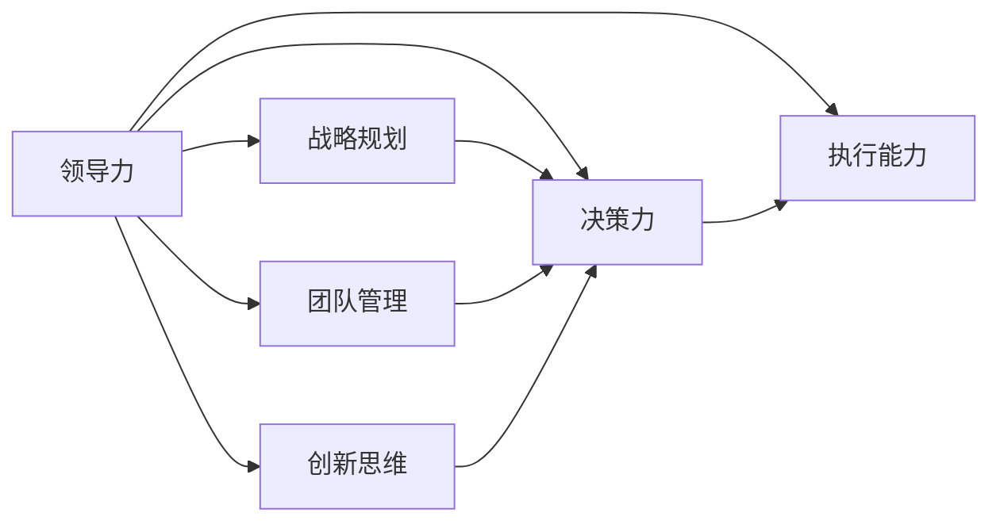

                 

# 构建个人领导力体系的方法论

> 关键词：领导力体系, 方法论, 团队管理, 创新思维, 决策力, 战略规划

## 1. 背景介绍

### 1.1 问题由来
在当今快速变化的市场环境中，企业领导者面临着前所未有的挑战。一方面，新技术、新模式层出不穷，要求领导者具备不断学习和适应的能力；另一方面，全球化、数字化、智能化等趋势加速发展，对领导者的视野、格局、资源配置能力提出了更高要求。在这种背景下，构建一套系统、全面、实用的个人领导力体系，成为每个领导者不可或缺的重要能力。

### 1.2 问题核心关键点
构建个人领导力体系的核心在于如何将领导力理论具体化、操作化，使之成为指导日常管理和决策的有效工具。其关键点包括：
1. **理论框架**：构建科学、系统的领导力理论体系。
2. **工具和方法**：开发和应用具体可操作的领导工具和方法。
3. **实践与反馈**：通过持续的实践和反馈，不断优化和提升领导力水平。
4. **文化与环境**：在组织文化与外部环境的基础上，构建符合实际的领导力模型。

### 1.3 问题研究意义
构建个人领导力体系具有重要意义：
1. **提升管理效能**：通过系统化的领导力方法，提高管理者对团队和项目的把控能力。
2. **促进组织创新**：良好的领导力有助于激发团队潜力，推动组织创新和发展。
3. **增强决策质量**：有效的领导力体系能提升决策的科学性和战略性，减少不确定性。
4. **塑造企业文化**：领导者的行为和价值观直接影响企业文化，有助于营造积极向上的组织氛围。

## 2. 核心概念与联系

### 2.1 核心概念概述

为更好地理解个人领导力体系的构建，本节将介绍几个关键概念：

- **领导力(Ledership)**：领导者在组织中引导和管理团队，实现组织目标的能力和行为。
- **战略规划(Strategic Planning)**：领导者基于外部环境、内部资源，制定和实施长远发展计划的过程。
- **团队管理(Team Management)**：领导者通过有效沟通、激励和组织团队成员，实现团队目标的管理活动。
- **创新思维(Innovation Thinking)**：领导者识别、评估和实施新想法、新方法的能力。
- **决策力(Decision Making)**：领导者基于数据和信息，做出有效、合理的决策的能力。
- **执行能力(Execution Capability)**：领导者将战略、计划转化为实际行动和成果的能力。

这些核心概念之间存在着紧密的联系，共同构成了一个完整的领导力体系。

### 2.2 核心概念原理和架构的 Mermaid 流程图



这个流程图展示了领导力体系的核心概念及其相互关系：

1. **领导力**是体系的基础，其他所有概念均围绕领导力展开。
2. **战略规划**是领导力的核心组成部分，指导组织的长远发展。
3. **团队管理**、**创新思维**、**决策力**和**执行能力**是领导力的具体体现，相互补充，共同支持组织的日常运作和创新发展。

## 3. 核心算法原理 & 具体操作步骤

### 3.1 算法原理概述

构建个人领导力体系的方法论主要基于以下几个算法原理：

1. **系统化建模(Structured Modeling)**：通过理论框架，系统地构建领导力模型，使之具有可操作性和可验证性。
2. **迭代优化(Iterative Optimization)**：通过持续的实践和反馈，不断优化和提升领导力水平。
3. **行为分析(Behavioral Analysis)**：利用数据分析工具，评估和改进领导行为和决策过程。
4. **跨学科整合(Interdisciplinary Integration)**：结合管理学、心理学、社会学等领域的知识，构建多维度的领导力体系。

### 3.2 算法步骤详解

构建个人领导力体系的一般步骤包括：

**Step 1: 确定领导力模型**
- 基于组织文化、行业特点和外部环境，设计科学、系统的领导力模型。
- 模型应涵盖战略规划、团队管理、创新思维、决策力、执行能力等关键维度。
- 模型应具备可操作性和可验证性，能够指导实际工作。

**Step 2: 开发工具和方法**
- 针对每个领导力维度，开发和应用具体可操作的领导工具和方法。
- 如战略规划工具、团队协作平台、创新激励机制、决策支持系统等。
- 工具和方法应具有易用性和可扩展性，适应不同情境和任务。

**Step 3: 实践与反馈**
- 在实际工作中应用领导力体系，持续收集和分析反馈信息。
- 通过定量和定性方法，评估工具和方法的有效性，及时调整和优化。
- 建立持续改进机制，确保领导力体系的不断进步。

**Step 4: 文化与环境适应**
- 根据组织文化、行业特点和外部环境，不断调整和优化领导力模型。
- 确保领导力体系与组织战略、团队需求相匹配，提升实际效果。
- 注重领导力的跨文化适应性，确保在多元文化环境中有效实施。

### 3.3 算法优缺点

构建个人领导力体系的方法论具有以下优点：
1. **系统性和全面性**：通过系统化的建模和工具开发，提供全面、系统的领导力解决方案。
2. **可操作性和可验证性**：工具和方法具有操作性强、可验证性高的特点，便于实际应用和效果评估。
3. **持续改进**：通过持续的实践和反馈，不断优化和提升领导力水平，确保体系不断进步。
4. **跨学科整合**：结合管理学、心理学、社会学等多学科知识，提供多维度的领导力支持。

同时，该方法也存在一定的局限性：
1. **实施难度高**：设计和应用一套全面、系统的领导力体系需要高水平的管理和技术能力。
2. **资源投入大**：开发和部署工具、方法需要投入大量的时间和资源。
3. **适用性有限**：不同组织和团队的具体情况各异，领导力体系需根据实际情况进行定制化调整。
4. **反馈机制复杂**：需要设计科学的反馈机制，收集、分析和应用反馈信息，确保体系有效运行。

尽管存在这些局限性，但就目前而言，构建个人领导力体系的方法论仍是大规模、系统化管理的重要手段。未来相关研究的重点在于如何进一步降低实施难度，提高体系的可操作性和适用性，同时兼顾反馈机制的科学性和效率。

### 3.4 算法应用领域

构建个人领导力体系的方法论适用于多个领域，包括但不限于：

- **企业领导**：适用于各种规模、各种类型企业的高层管理者。
- **政府管理**：适用于各级政府机构的管理者，提升公共服务水平和效率。
- **教育领导**：适用于学校、大学等教育机构的领导者，提升教育质量和创新能力。
- **非营利组织**：适用于慈善机构、公益组织等的管理者，提升社会影响力和服务效果。
- **科研团队**：适用于科研项目、研发团队的领导者，推动科技创新和成果转化。

这些领域领导者均需要具备全面的领导力，以应对复杂的任务和挑战。

## 4. 数学模型和公式 & 详细讲解 & 举例说明

### 4.1 数学模型构建

构建领导力体系的方法论可以通过数学模型来进一步描述。以下是一个简化的领导力模型：

$$
\text{Leadership Score} = \alpha \times \text{Strategic Score} + \beta \times \text{Team Score} + \gamma \times \text{Innovation Score} + \delta \times \text{Decision Score} + \epsilon \times \text{Execution Score}
$$

其中，$\alpha, \beta, \gamma, \delta, \epsilon$ 为权重系数，表示各维度的相对重要性；$\text{Strategic Score}, \text{Team Score}, \text{Innovation Score}, \text{Decision Score}, \text{Execution Score}$ 为各个维度的得分，通过具体指标和评估方法计算得出。

### 4.2 公式推导过程

以战略规划维度为例，推导其得分计算公式：

$$
\text{Strategic Score} = \frac{\text{Strategic Goals Score} + \text{Strategic Execution Score}}{2}
$$

其中：
- $\text{Strategic Goals Score}$ 表示战略目标的制定和实现程度；
- $\text{Strategic Execution Score}$ 表示战略计划的实施和调整效果。

类似地，其他维度的得分也可以根据具体指标进行计算和推导。

### 4.3 案例分析与讲解

以一家高科技公司为例，其领导力模型如下：

- 战略规划得分：$70\% \times \text{战略目标实现率} + 30\% \times \text{战略调整灵活性}$；
- 团队管理得分：$60\% \times \text{团队协作度} + 40\% \times \text{员工满意度}$；
- 创新思维得分：$50\% \times \text{新项目成功率} + 50\% \times \text{员工创新活跃度}$；
- 决策力得分：$70\% \times \text{决策准确率} + 30\% \times \text{决策时间效率}$；
- 执行能力得分：$80\% \times \text{项目按时交付率} + 20\% \times \text{项目质量评估}$。

通过实际评估数据，可以计算出该公司的领导力得分，并根据得分进行优化和改进。

## 5. 项目实践：代码实例和详细解释说明

### 5.1 开发环境搭建

在构建领导力体系时，需要搭建相应的开发环境。以下是使用Python进行数据分析和可视化实践的环境配置流程：

1. 安装Anaconda：从官网下载并安装Anaconda，用于创建独立的Python环境。

2. 创建并激活虚拟环境：
```bash
conda create -n leadership-env python=3.8 
conda activate leadership-env
```

3. 安装必要的库：
```bash
conda install pandas numpy matplotlib seaborn plotly jupyter notebook ipython
```

4. 导入数据：使用SQL数据库或Excel等数据源，导入领导力评估数据。

完成上述步骤后，即可在`leadership-env`环境中开始实践。

### 5.2 源代码详细实现

以下是一个基于Python的领导力体系构建示例代码：

```python
import pandas as pd
import numpy as np
import matplotlib.pyplot as plt
import seaborn as sns

# 导入数据
data = pd.read_csv('leadership_data.csv')

# 计算各维度得分
strategic_score = (data['战略目标实现率'] + data['战略调整灵活性']) / 2
team_score = (data['团队协作度'] + data['员工满意度']) / 2
innovation_score = (data['新项目成功率'] + data['员工创新活跃度']) / 2
decision_score = (data['决策准确率'] + data['决策时间效率']) / 2
execution_score = (data['项目按时交付率'] + data['项目质量评估']) / 2

# 计算领导力总分
leadership_score = 0.7 * strategic_score + 0.6 * team_score + 0.5 * innovation_score + 0.7 * decision_score + 0.8 * execution_score

# 可视化领导力得分
sns.histplot(leadership_score, bins=30, kde=True)
plt.title('Leadership Score Distribution')
plt.xlabel('Leadership Score')
plt.ylabel('Frequency')
plt.show()
```

### 5.3 代码解读与分析

让我们再详细解读一下关键代码的实现细节：

**导入数据**：
- 使用Pandas库读取领导力评估数据。

**计算各维度得分**：
- 根据预设的指标和权重，计算每个维度的得分。
- 通过简单的数学运算和平均计算，得到各维度的综合得分。

**计算领导力总分**：
- 根据各维度的得分和预设权重，计算领导力总分。

**可视化领导力得分**：
- 使用Seaborn库绘制领导力得分的直方图，直观展示领导力水平的分布情况。

### 5.4 运行结果展示

通过运行上述代码，可以得到领导力得分的直方图，直观展示领导力的分布情况。

## 6. 实际应用场景

### 6.1 企业领导

企业领导面临的核心问题是如何在复杂多变的环境中，保持战略一致性和团队协同。构建领导力体系可以帮助企业领导：

- **明确战略方向**：通过战略规划工具和评估方法，明确企业的长期发展目标。
- **优化团队管理**：通过团队协作平台和激励机制，提升团队的凝聚力和工作效率。
- **激发创新能力**：通过创新思维工具和创新奖励机制，激发员工的创造力和创新能力。
- **提升决策质量**：通过决策支持系统和数据分析工具，提升决策的科学性和合理性。
- **加强执行能力**：通过项目管理和绩效评估系统，确保战略和决策的顺利实施。

### 6.2 政府管理

政府管理要求领导者具备更强的宏观调控和公共服务能力。构建领导力体系可以帮助政府管理：

- **优化政策制定**：通过战略规划和数据分析，优化政策设计和实施。
- **提升公共服务**：通过团队协作和公共服务评估，提升公共服务的质量和效率。
- **推动社会创新**：通过创新激励和公共项目评估，推动社会创新和可持续发展。
- **强化执行力**：通过项目管理工具和绩效评估系统，确保政策的有效执行。

### 6.3 教育领导

教育领导需要具备更强的教学管理和学生指导能力。构建领导力体系可以帮助教育领导：

- **优化课程设计**：通过战略规划和课程评估，优化教学内容和方式。
- **提升师生互动**：通过团队协作和互动工具，提升师生互动和课堂效果。
- **激发学生潜力**：通过创新思维和创新奖励机制，激发学生的学习兴趣和创新能力。
- **强化教学效果**：通过决策支持系统和数据分析，提升教学效果和学生成绩。
- **促进师生成长**：通过执行能力和绩效评估，促进师生全面发展和成长。

### 6.4 未来应用展望

随着技术的进步和管理的复杂化，领导力体系的应用将更加广泛和深入：

1. **智能分析**：结合大数据和人工智能技术，实现领导力的智能分析和预测。
2. **跨文化管理**：通过跨文化分析和适应性评估，提升领导力在多元文化环境中的有效性。
3. **动态调整**：根据环境变化和组织需求，动态调整领导力体系，确保其持续适用性。
4. **个性化定制**：结合个人特点和组织特点，定制化设计领导力体系，提升其实效性。

## 7. 工具和资源推荐

### 7.1 学习资源推荐

为了帮助领导者系统掌握领导力体系的构建理论和方法，以下是一些优质的学习资源：

1. **《领导力：现代方法》**：经典管理学教材，系统介绍领导力的基本理论和实践方法。
2. **《变革领导力》**：介绍变革时代下，领导者如何应对变化和挑战。
3. **《高效领导力》**：介绍如何通过战略规划、团队管理、创新思维等提升领导力。
4. **《领导力的艺术与科学》**：著名领导力专家约翰·科特尔的著作，涵盖领导力的各个方面。
5. **《数据驱动的决策》**：介绍如何通过数据分析和智能工具，提升决策质量和效果。

通过对这些资源的学习实践，相信领导者能够更好地理解和应用领导力体系，提升自身管理能力。

### 7.2 开发工具推荐

高效的工具支持是构建领导力体系的重要保障。以下是几款常用的开发工具：

1. **Python**：基于Python的开源数据分析平台，支持丰富的数据处理和可视化工具。
2. **R语言**：强大的统计分析和可视化工具，适用于领导力数据分析和建模。
3. **Tableau**：数据可视化工具，支持复杂的图表和仪表盘，方便领导力评估和展示。
4. **Jupyter Notebook**：交互式编程环境，支持代码块和数据分析，便于学习和实践。
5. **Power BI**：微软推出的商业智能工具，支持多数据源集成和可视化，适用于企业领导力分析。

合理利用这些工具，可以显著提升领导力体系的构建和评估效率，加快创新迭代的步伐。

### 7.3 相关论文推荐

领导力体系的研究来源于学界的持续探索。以下是几篇有影响力的相关论文，推荐阅读：

1. **《领导力的理论和实践》**：综述领导力的基本理论和实践方法，适合初学者入门。
2. **《组织领导力模型》**：提出领导力的多维度模型，分析各维度的相互关系和影响。
3. **《变革领导力的挑战与应对》**：探讨变革时代下，领导者面临的挑战和应对策略。
4. **《数据驱动的领导力评估》**：介绍如何通过数据分析提升领导力评估的科学性和准确性。
5. **《跨文化领导力模型》**：分析不同文化背景下的领导力特点和实践，提供跨文化领导力解决方案。

这些论文代表了大规模、系统化领导力研究的发展脉络。通过学习这些前沿成果，可以帮助领导者把握学科前进方向，激发更多的创新灵感。

## 8. 总结：未来发展趋势与挑战

### 8.1 总结

本文对构建个人领导力体系的方法论进行了全面系统的介绍。首先阐述了领导力体系的构建背景和意义，明确了领导力体系在提升管理效能、促进组织创新、增强决策质量等方面的重要作用。其次，从原理到实践，详细讲解了领导力体系的数学模型和具体步骤，给出了领导力体系构建的完整代码实例。同时，本文还广泛探讨了领导力体系在企业领导、政府管理、教育领导等多个领域的应用前景，展示了领导力体系的巨大潜力。此外，本文精选了领导力体系的相关学习资源，力求为领导者提供全方位的技术指引。

通过本文的系统梳理，可以看到，构建个人领导力体系的方法论正在成为领导者不可或缺的重要能力。这些方向的探索发展，必将进一步提升领导者的管理水平和组织绩效，为构建人机协同的智能社会提供有力支持。

### 8.2 未来发展趋势

展望未来，领导力体系的发展趋势如下：

1. **智能化和自动化**：结合人工智能和大数据技术，实现领导力的智能化和自动化评估。
2. **跨领域整合**：将领导力体系与其他管理学科（如组织行为学、人力资源管理等）进行整合，形成更加全面、系统的管理框架。
3. **个性化定制**：根据个人特点和组织需求，定制化设计领导力体系，提升其实效性。
4. **全球化和本地化**：结合全球化管理和本地化需求，构建具有全球竞争力且能适应本地市场的领导力体系。
5. **动态调整**：根据环境变化和组织需求，动态调整领导力体系，确保其持续适用性。

### 8.3 面临的挑战

尽管领导力体系在理论和实践上取得了不少进展，但在迈向更加智能化、普适化应用的过程中，仍面临诸多挑战：

1. **复杂性和高成本**：构建和实施领导力体系需要高水平的管理和技术能力，投入成本高。
2. **数据质量和可靠性**：领导力评估依赖于大量数据，数据质量不高或可靠性不足将影响评估结果。
3. **文化适应性**：不同文化背景下的领导力需求各异，需要适应不同文化环境。
4. **组织认同感**：领导力体系需要在组织内部得到广泛认同和支持，否则难以有效实施。
5. **持续改进**：需要不断收集和分析反馈，及时调整和优化领导力体系。

尽管存在这些挑战，但未来领导力体系的研究和实践将继续深入，推动领导力理论和方法的不断进步。

### 8.4 研究展望

未来领导力体系的研究重点在于以下几个方面：

1. **智能化评估技术**：结合人工智能和大数据技术，实现领导力的智能化评估。
2. **跨领域整合**：将领导力体系与其他管理学科进行整合，形成更加全面、系统的管理框架。
3. **个性化定制**：根据个人特点和组织需求，定制化设计领导力体系，提升其实效性。
4. **动态调整机制**：建立动态调整机制，确保领导力体系在不断变化的环境下持续适用。
5. **跨文化适应性**：研究不同文化背景下的领导力特点和实践，提供跨文化领导力解决方案。

这些研究方向将推动领导力体系向更加智能化、普适化和可持续化的方向发展，为构建高效、稳定、创新的组织提供有力支持。

## 9. 附录：常见问题与解答

**Q1：构建领导力体系是否适用于所有组织？**

A: 领导力体系在大多数组织中都有广泛的应用价值，但需要根据组织的具体情况进行定制化调整。例如，对于小型企业，简化领导力评估指标和工具，可能更为适合。而对于大型复杂组织，需要更加系统的评估方法和工具。

**Q2：如何确定领导力模型的维度？**

A: 领导力模型的维度应根据组织的具体情况和目标来确定。一般包括战略规划、团队管理、创新思维、决策力、执行能力等关键维度。每个维度应包含具体的指标和评估方法，确保模型的科学性和可操作性。

**Q3：如何选择合适的领导工具和方法？**

A: 应根据领导力的具体需求和组织的特点选择合适的工具和方法。例如，对于战略规划，可以采用SWOT分析、PEST分析等工具；对于团队管理，可以采用OKR、KPI等方法。选择合适的工具和方法，是构建领导力体系的关键步骤。

**Q4：如何评估领导力体系的有效性？**

A: 通过定量和定性方法，评估领导力体系的有效性。定量评估可以采用问卷调查、数据分析等方法，定性评估可以采用访谈、案例分析等方法。持续收集和分析反馈信息，不断优化和改进领导力体系，确保其有效性。

**Q5：如何培养领导力？**

A: 领导力培养应结合实践和理论，不断学习和提升。可以通过培训课程、读书会、经验交流等形式，提升领导者的知识和技能。同时，注重团队建设和个人发展，营造积极向上的组织氛围，促进领导力的持续提升。

通过本文的系统梳理，领导者能够更好地理解和应用领导力体系，提升自身管理能力，为组织的发展和进步提供有力支持。

