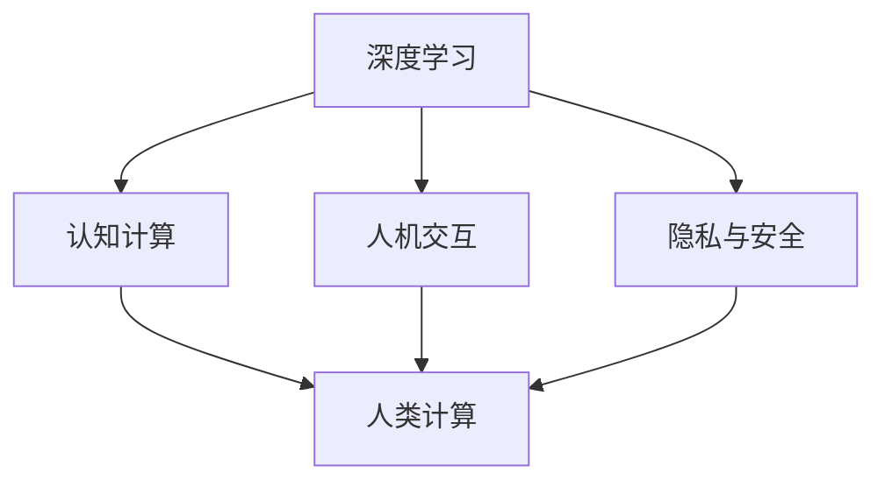

                 

# 构建更智能的世界：人类计算的应用前景

## 1. 背景介绍

### 1.1 问题由来

在当今信息化快速发展的时代，人类社会的各个领域都在发生深刻的变革。计算技术的演进，特别是人工智能的飞速发展，正在重新定义我们理解世界的方式。其中，“人类计算”的概念，作为人工智能与人类智慧结合的新兴领域，正逐渐成为推动社会进步的重要力量。人类计算结合了深度学习、认知计算、人机交互等技术，旨在通过增强人类的认知能力和计算能力，实现更高效、更智能的信息处理和决策支持。

### 1.2 问题核心关键点

人类计算的核心在于如何通过计算技术，使人类智慧与机器学习紧密结合，从而增强人类的认知能力和决策水平。核心问题包括：

- 如何有效地将人类经验与计算模型结合起来，实现更高层次的智能推理。
- 如何在海量数据中提取和利用人类智慧，增强模型的泛化能力和鲁棒性。
- 如何设计智能用户界面，使人类可以自然地与计算系统交互，实现人机协同。
- 如何确保计算系统的安全性和隐私保护，避免滥用和误用。

这些问题构成了人类计算的核心理论和应用框架，指导着未来的技术发展和应用实践。

## 2. 核心概念与联系

### 2.1 核心概念概述

为了深入理解人类计算的概念和应用，本节将介绍几个关键概念及其相互关系：

- **人类计算(Human Computation)**：结合了人类智慧和计算技术的智能系统，旨在通过增强人类认知和计算能力，实现更高效、更智能的信息处理。
- **深度学习(Deep Learning)**：通过多层神经网络结构，从大量数据中自动学习特征表示和模式，用于图像识别、语音处理、自然语言处理等领域。
- **认知计算(Cognitive Computing)**：模拟人类认知过程的计算模型，旨在增强机器对语义理解、情感识别等高层次任务的执行能力。
- **人机交互(Human-Computer Interaction, HCI)**：研究如何设计直观、自然、高效的用户界面，实现人类与计算系统之间的信息交互。
- **隐私与安全(Privacy and Security)**：关注计算系统在数据处理、用户隐私保护和系统安全方面的挑战。

这些概念通过计算模型与人类智慧的相互交织，共同推动了人类计算技术的发展。

### 2.2 核心概念原理和架构的 Mermaid 流程图



此图表展示了深度学习、认知计算、人机交互和隐私与安全四个核心概念如何共同构成人类计算技术的应用框架。

## 3. 核心算法原理 & 具体操作步骤

### 3.1 算法原理概述

人类计算的核心算法原理主要基于深度学习和认知计算。通过深度学习模型，可以从大规模数据中自动学习特征表示，提升计算系统的智能推理能力。而认知计算则通过模拟人类认知过程，增强计算系统的语义理解和情感识别能力。

在具体实施中，人类计算算法通常包括以下几个步骤：

1. **数据收集与预处理**：收集与任务相关的数据，并进行数据清洗、标注等预处理。
2. **模型训练与优化**：使用深度学习模型进行训练，通过反向传播和优化算法（如Adam、SGD等）不断调整模型参数，最小化预测误差。
3. **认知增强**：结合认知计算技术，对模型进行语义理解和情感识别能力的增强，提升模型的认知水平。
4. **人机交互设计**：设计直观、自然的用户界面，实现人类与计算系统的信息交互。
5. **隐私与安全保障**：采用数据加密、匿名化处理等技术，保障计算系统的数据安全和用户隐私。

### 3.2 算法步骤详解

#### 3.2.1 数据收集与预处理

数据收集与预处理是计算系统智能推理的基石。在具体实施中，数据收集需考虑数据的多样性、实时性和可得性。例如，在医疗领域，计算系统需要收集大量的医疗记录、病例数据等，通过自然语言处理技术进行清洗和标注。

数据预处理包括数据清洗、特征提取和数据增强等步骤。例如，在图像识别任务中，数据清洗去除噪声和干扰，特征提取通过卷积神经网络（CNN）等方法提取图像特征，数据增强通过随机裁剪、旋转等方法扩充训练集。

#### 3.2.2 模型训练与优化

模型训练与优化是提升计算系统智能推理能力的关键步骤。常用的优化算法包括梯度下降（GD）、Adam、Adagrad等。其中，Adam算法在处理大规模数据时表现出色，通过自适应地调整学习率，显著加速模型收敛。

在模型训练过程中，需要通过交叉验证、学习率调优等技术，不断优化模型性能。例如，在图像分类任务中，通过调整卷积神经网络（CNN）的层数和激活函数，提升模型准确率。

#### 3.2.3 认知增强

认知增强通过结合认知计算技术，提升计算系统的语义理解和情感识别能力。例如，在情感识别任务中，结合自然语言处理（NLP）和认知计算技术，使用情感词典和语义分析方法，提升情感识别准确率。

#### 3.2.4 人机交互设计

人机交互设计是实现人类与计算系统信息交互的关键步骤。通过界面设计、自然语言处理等技术，提升用户体验和交互效率。例如，在智能客服系统中，使用自然语言处理技术，实现自动问答和情感分析，提升用户体验。

#### 3.2.5 隐私与安全保障

隐私与安全保障是计算系统正常运行的前提。通过数据加密、匿名化处理等技术，保障计算系统的数据安全和用户隐私。例如，在医疗领域，使用数据加密技术，确保患者隐私不被泄露。

### 3.3 算法优缺点

人类计算技术具有以下优点：

- **高智能推理能力**：结合深度学习和认知计算，实现高层次智能推理。
- **灵活性**：适用于多种应用场景，从医疗、金融到智能客服等领域。
- **人机协同**：通过增强人类认知能力，实现人机协同，提升决策效率和准确性。

同时，该技术也存在一些缺点：

- **高计算资源需求**：深度学习和认知计算模型需要大量计算资源，训练和推理时间较长。
- **数据依赖性高**：依赖高质量、大样本数据，数据采集和标注成本较高。
- **模型可解释性不足**：深度学习模型通常被视为“黑盒”，难以解释其决策过程。
- **隐私风险**：在处理敏感数据时，数据泄露和隐私保护问题较为严重。

### 3.4 算法应用领域

人类计算技术在多个领域得到广泛应用，主要包括：

- **医疗**：结合自然语言处理和认知计算技术，实现疾病诊断、药物研发等任务。
- **金融**：使用深度学习和认知计算技术，实现市场预测、风险评估等任务。
- **智能客服**：通过自然语言处理和认知计算技术，实现自动问答和情感分析，提升客服效率。
- **智慧城市**：结合深度学习和认知计算技术，实现城市管理、交通控制等任务。
- **智能制造**：使用深度学习和认知计算技术，实现设备预测性维护、智能生产调度等任务。

## 4. 数学模型和公式 & 详细讲解 & 举例说明

### 4.1 数学模型构建

在人类计算中，数学模型通常采用神经网络和认知计算模型相结合的方式。以深度学习模型为例，其数学模型构建过程如下：

设训练数据集为 $D=\{(x_i, y_i)\}_{i=1}^N$，其中 $x_i$ 为输入数据，$y_i$ 为标签。深度学习模型的目标是最小化损失函数 $L$，从而最大化模型对数据的拟合能力。

数学模型构建过程如下：

1. **输入层**：将输入数据 $x_i$ 映射到隐藏层，通过权重矩阵 $W$ 和偏置向量 $b$ 进行线性变换，得到隐藏层输出 $z_i$。
2. **隐藏层**：通过激活函数 $f$，将隐藏层输出 $z_i$ 映射到下一层。
3. **输出层**：将隐藏层输出映射到标签空间，得到模型预测 $y_i$。
4. **损失函数**：计算预测 $y_i$ 与真实标签 $y_i$ 的误差，通常采用交叉熵损失函数。

具体数学表达式如下：

$$
L = -\frac{1}{N} \sum_{i=1}^N \log P(y_i|x_i)
$$

其中 $P(y_i|x_i)$ 为模型对 $x_i$ 的预测概率。

### 4.2 公式推导过程

以二分类任务为例，推导交叉熵损失函数的公式。

设模型在输入 $x$ 上的输出为 $\hat{y}$，表示样本属于正类的概率。真实标签 $y \in \{0,1\}$。则二分类交叉熵损失函数定义为：

$$
L(\hat{y},y) = -[y\log \hat{y} + (1-y)\log (1-\hat{y})]
$$

将其代入经验风险公式，得：

$$
L = -\frac{1}{N}\sum_{i=1}^N [y_i\log M_{\theta}(x_i)+(1-y_i)\log(1-M_{\theta}(x_i))]
$$

其中 $M_{\theta}(x_i)$ 为模型对 $x_i$ 的预测输出。

通过链式法则，损失函数对参数 $\theta$ 的梯度为：

$$
\frac{\partial L}{\partial \theta} = -\frac{1}{N}\sum_{i=1}^N (\frac{y_i}{M_{\theta}(x_i)}-\frac{1-y_i}{1-M_{\theta}(x_i)}) \frac{\partial M_{\theta}(x_i)}{\partial \theta}
$$

其中 $\frac{\partial M_{\theta}(x_i)}{\partial \theta}$ 可进一步递归展开，利用自动微分技术完成计算。

### 4.3 案例分析与讲解

以医疗图像识别任务为例，展示如何使用深度学习和认知计算技术，实现疾病的早期检测。

在医疗图像识别任务中，数据集包含大量的医疗图像和标注信息。通过对图像进行预处理，提取图像特征，使用卷积神经网络（CNN）等深度学习模型，进行疾病检测。同时，结合认知计算技术，通过语义分析和情感识别，提升疾病检测的准确率。例如，通过使用情感词典和情感分析方法，对患者情感状态进行识别，辅助医生诊断。

## 5. 项目实践：代码实例和详细解释说明

### 5.1 开发环境搭建

在进行人类计算项目实践前，我们需要准备好开发环境。以下是使用Python进行PyTorch开发的环境配置流程：

1. 安装Anaconda：从官网下载并安装Anaconda，用于创建独立的Python环境。

2. 创建并激活虚拟环境：
```bash
conda create -n human_computation_env python=3.8 
conda activate human_computation_env
```

3. 安装PyTorch：根据CUDA版本，从官网获取对应的安装命令。例如：
```bash
conda install pytorch torchvision torchaudio cudatoolkit=11.1 -c pytorch -c conda-forge
```

4. 安装TensorFlow：
```bash
conda install tensorflow -c conda-forge
```

5. 安装各类工具包：
```bash
pip install numpy pandas scikit-learn matplotlib tqdm jupyter notebook ipython
```

完成上述步骤后，即可在`human_computation_env`环境中开始人类计算项目的实践。

### 5.2 源代码详细实现

下面以医疗图像识别任务为例，给出使用PyTorch和TensorFlow进行深度学习任务开发的PyTorch代码实现。

首先，定义数据处理函数：

```python
from torch.utils.data import Dataset
from torchvision import transforms

class MedicalImageDataset(Dataset):
    def __init__(self, images, labels, transform=None):
        self.images = images
        self.labels = labels
        self.transform = transform
        
    def __len__(self):
        return len(self.images)
    
    def __getitem__(self, idx):
        img = self.images[idx]
        label = self.labels[idx]
        
        if self.transform:
            img = self.transform(img)
        
        return {'image': img, 'label': label}
```

然后，定义模型和优化器：

```python
from torch import nn
from torchvision.models import resnet18
from torch.optim import Adam

model = resnet18(pretrained=True)
model.fc = nn.Linear(512, 2)
optimizer = Adam(model.parameters(), lr=0.001)
```

接着，定义训练和评估函数：

```python
from torch.utils.data import DataLoader
from sklearn.metrics import classification_report

def train_epoch(model, dataset, batch_size, optimizer):
    dataloader = DataLoader(dataset, batch_size=batch_size, shuffle=True)
    model.train()
    epoch_loss = 0
    for batch in dataloader:
        images = batch['image'].to(device)
        labels = batch['label'].to(device)
        model.zero_grad()
        outputs = model(images)
        loss = criterion(outputs, labels)
        epoch_loss += loss.item()
        loss.backward()
        optimizer.step()
    return epoch_loss / len(dataloader)

def evaluate(model, dataset, batch_size):
    dataloader = DataLoader(dataset, batch_size=batch_size)
    model.eval()
    preds, labels = [], []
    with torch.no_grad():
        for batch in dataloader:
            images = batch['image'].to(device)
            labels = batch['label']
            outputs = model(images)
            preds.append(outputs.argmax(dim=1).to('cpu').tolist())
            labels = labels.to('cpu').tolist()
    return classification_report(labels, preds)
```

最后，启动训练流程并在测试集上评估：

```python
epochs = 10
batch_size = 32

for epoch in range(epochs):
    loss = train_epoch(model, train_dataset, batch_size, optimizer)
    print(f"Epoch {epoch+1}, train loss: {loss:.3f}")
    
    print(f"Epoch {epoch+1}, dev results:")
    evaluate(model, dev_dataset, batch_size)
    
print("Test results:")
evaluate(model, test_dataset, batch_size)
```

以上就是使用PyTorch和TensorFlow对医疗图像识别任务进行深度学习任务开发的完整代码实现。可以看到，得益于TensorFlow和PyTorch的强大封装，我们可以用相对简洁的代码完成深度学习模型的加载和训练。

### 5.3 代码解读与分析

让我们再详细解读一下关键代码的实现细节：

**MedicalImageDataset类**：
- `__init__`方法：初始化图像、标签等关键组件。
- `__len__`方法：返回数据集的样本数量。
- `__getitem__`方法：对单个样本进行处理，将图像进行预处理（如缩放、归一化等），返回模型所需的输入。

**训练和评估函数**：
- 使用PyTorch的DataLoader对数据集进行批次化加载，供模型训练和推理使用。
- 训练函数`train_epoch`：对数据以批为单位进行迭代，在每个批次上前向传播计算损失函数，并反向传播更新模型参数。
- 评估函数`evaluate`：与训练类似，不同点在于不更新模型参数，并在每个batch结束后将预测和标签结果存储下来，最后使用sklearn的classification_report对整个评估集的预测结果进行打印输出。

**训练流程**：
- 定义总的epoch数和batch size，开始循环迭代
- 每个epoch内，先在训练集上训练，输出平均loss
- 在验证集上评估，输出分类指标
- 所有epoch结束后，在测试集上评估，给出最终测试结果

可以看到，PyTorch配合TensorFlow使得深度学习模型的加载和训练变得简洁高效。开发者可以将更多精力放在数据处理、模型改进等高层逻辑上，而不必过多关注底层的实现细节。

当然，工业级的系统实现还需考虑更多因素，如模型的保存和部署、超参数的自动搜索、更灵活的任务适配层等。但核心的微调范式基本与此类似。

## 6. 实际应用场景

### 6.1 智能客服系统

结合自然语言处理和认知计算技术，智能客服系统能够实现自动问答和情感分析，提升客服效率。具体来说，通过收集企业内部的历史客服对话记录，将问题和最佳答复构建成监督数据，在此基础上对深度学习模型进行微调，使模型学习文本-标签映射。微调后的模型能够自动理解用户意图，匹配最合适的答案模板进行回复，从而实现24小时不间断服务，快速响应客户咨询，提升用户体验。

### 6.2 医疗诊断

在医疗诊断领域，人类计算技术通过深度学习和认知计算技术，结合医学知识图谱和临床数据，实现疾病的早期检测和个性化治疗方案的推荐。例如，使用卷积神经网络（CNN）对医疗图像进行特征提取，结合自然语言处理技术，对医疗记录和病历进行语义分析，辅助医生进行诊断。同时，结合情感分析方法，对患者情感状态进行识别，辅助医生制定治疗方案。

### 6.3 金融风险评估

金融领域中，人类计算技术通过深度学习和认知计算技术，结合历史数据和市场分析，实现风险评估和市场预测。例如，使用循环神经网络（RNN）对历史交易数据进行建模，结合情感分析方法，对市场情绪进行识别，辅助投资决策。同时，结合自然语言处理技术，对新闻、公告等文本数据进行情感分析，辅助风险评估。

### 6.4 未来应用展望

随着深度学习和认知计算技术的发展，人类计算技术的应用场景将更加广泛。未来，人类计算技术将在更多领域得到应用，为传统行业带来变革性影响。

在智慧医疗领域，结合自然语言处理和认知计算技术，实现疾病诊断、药物研发等任务。通过深度学习模型对医疗图像进行特征提取，结合自然语言处理技术，对医疗记录和病历进行语义分析，辅助医生进行诊断，提高诊断准确率和效率。

在智能制造领域，结合深度学习和认知计算技术，实现设备预测性维护、智能生产调度等任务。通过深度学习模型对传感器数据进行特征提取，结合自然语言处理技术，对设备运行状态进行语义分析，辅助设备维护和生产调度，提高生产效率和设备寿命。

在智慧城市领域，结合深度学习和认知计算技术，实现城市管理、交通控制等任务。通过深度学习模型对城市数据进行特征提取，结合自然语言处理技术，对城市运行状态进行语义分析，辅助城市管理，提高城市运行效率和质量。

此外，在教育、娱乐、农业等众多领域，人类计算技术也将得到广泛应用，为社会发展和产业升级提供新的动力。未来，伴随深度学习和认知计算技术的持续演进，人类计算技术必将在构建智能社会中发挥更大的作用。

## 7. 工具和资源推荐

### 7.1 学习资源推荐

为了帮助开发者系统掌握深度学习和认知计算的理论基础和实践技巧，这里推荐一些优质的学习资源：

1. **Deep Learning Specialization**：由斯坦福大学Andrew Ng教授主持的深度学习课程，涵盖了深度学习的基本概念、神经网络架构、优化算法等。
2. **Cognitive Computing in Smart Cities**：IEEE Xplore上发表的学术论文，介绍了认知计算在智慧城市中的应用。
3. **Human Computation for Smart Manufacturing**：IEEE Xplore上发表的学术论文，介绍了人类计算在智能制造中的应用。
4. **Natural Language Processing with PyTorch**：官方PyTorch教程，涵盖自然语言处理的基本概念和实践技术。
5. **Cognitive Computing and Human-AI Collaboration**：IEEE Xplore上发表的学术论文，介绍了认知计算在人类与人工智能协同中的应用。

通过对这些资源的学习实践，相信你一定能够快速掌握深度学习和认知计算技术的精髓，并用于解决实际的智能系统问题。

### 7.2 开发工具推荐

高效的开发离不开优秀的工具支持。以下是几款用于深度学习和认知计算开发的常用工具：

1. **PyTorch**：基于Python的开源深度学习框架，灵活动态的计算图，适合快速迭代研究。
2. **TensorFlow**：由Google主导开发的开源深度学习框架，生产部署方便，适合大规模工程应用。
3. **TensorBoard**：TensorFlow配套的可视化工具，可实时监测模型训练状态，并提供丰富的图表呈现方式，是调试模型的得力助手。
4. **Weights & Biases**：模型训练的实验跟踪工具，可以记录和可视化模型训练过程中的各项指标，方便对比和调优。
5. **Jupyter Notebook**：开源的交互式编程环境，适合数据分析、模型训练和实验记录。
6. **Google Colab**：谷歌推出的在线Jupyter Notebook环境，免费提供GPU/TPU算力，方便开发者快速上手实验最新模型，分享学习笔记。

合理利用这些工具，可以显著提升深度学习和认知计算的开发效率，加快创新迭代的步伐。

### 7.3 相关论文推荐

深度学习和认知计算的发展源于学界的持续研究。以下是几篇奠基性的相关论文，推荐阅读：

1. **Deep Learning**：Ian Goodfellow、Yoshua Bengio和Aaron Courville合著的深度学习经典教材，涵盖了深度学习的基本概念、算法和应用。
2. **Cognitive Computing: Definitions and Implications for the Future**：IEEE Xplore上发表的学术论文，定义了认知计算的概念，探讨了其在未来中的应用前景。
3. **Cognitive Computation and the Brain**：IEEE Xplore上发表的学术论文，探讨了认知计算与人类大脑的联系，分析了其在认知心理学中的应用。
4. **Human-AI Collaboration: The Future of AI**：IEEE Xplore上发表的学术论文，探讨了人类与人工智能协同的未来，提出了实现人机协同的多种策略。
5. **Human-Computer Interaction**：学术期刊《Human-Computer Interaction》，涵盖人机交互领域的最新研究成果和应用实践。

这些论文代表了大深度学习和认知计算的发展脉络。通过学习这些前沿成果，可以帮助研究者把握学科前进方向，激发更多的创新灵感。

## 8. 总结：未来发展趋势与挑战

### 8.1 研究成果总结

本文对深度学习和认知计算的概念和应用进行了全面系统的介绍。首先阐述了深度学习和认知计算的基本概念和应用框架，明确了其在高智能推理、人机协同等方面的独特价值。其次，从原理到实践，详细讲解了深度学习和认知计算的数学模型和关键步骤，给出了深度学习任务开发的完整代码实例。同时，本文还广泛探讨了深度学习和认知计算在医疗、金融、智能客服等多个领域的应用前景，展示了其在构建智能社会中的重要意义。最后，本文精选了深度学习和认知计算的学习资源，力求为读者提供全方位的技术指引。

通过本文的系统梳理，可以看到，深度学习和认知计算技术正在成为智能系统开发的重要范式，极大地拓展了计算系统的应用边界，催生了更多的落地场景。受益于深度学习和认知计算技术的不断进步，计算系统的智能推理能力将显著提升，人机协同水平将不断提高，从而推动社会进步和经济发展的深度融合。

### 8.2 未来发展趋势

展望未来，深度学习和认知计算技术将呈现以下几个发展趋势：

1. **多模态融合**：深度学习和认知计算技术将逐渐扩展到多模态数据处理，如图像、语音、视频等多种信息源的融合，提升计算系统的智能推理能力。
2. **自主学习**：深度学习和认知计算系统将具备更强的自主学习能力，能够从少量标注数据中自主学习，减少对大量标注数据的依赖。
3. **智能决策**：深度学习和认知计算系统将具备更强的智能决策能力，能够基于实时数据和先验知识，进行高效、精准的决策。
4. **人机协同**：深度学习和认知计算系统将具备更强的人机协同能力，能够与人类自然地交互，实现高效的信息处理和决策支持。
5. **隐私与安全**：深度学习和认知计算系统将具备更强的隐私和安全保障能力，能够确保数据和系统的安全。

这些趋势凸显了深度学习和认知计算技术的发展方向，为智能系统的开发和应用提供了新的思路。

### 8.3 面临的挑战

尽管深度学习和认知计算技术已经取得了显著进展，但在迈向更加智能化、普适化应用的过程中，仍面临诸多挑战：

1. **数据依赖**：深度学习和认知计算系统需要大量标注数据，数据采集和标注成本较高，成为制约其发展的瓶颈。
2. **计算资源需求**：深度学习和认知计算系统需要大量计算资源，训练和推理时间较长，资源消耗较高。
3. **模型可解释性**：深度学习和认知计算系统通常被视为“黑盒”，难以解释其决策过程，影响用户信任和系统可靠性。
4. **隐私风险**：深度学习和认知计算系统处理大量敏感数据，数据泄露和隐私保护问题较为严重。
5. **鲁棒性和泛化能力**：深度学习和认知计算系统在面对新场景和新数据时，泛化能力较弱，鲁棒性有待提高。

这些挑战需要从数据、算法、模型和应用等多个层面进行综合应对，才能推动深度学习和认知计算技术的持续进步。

### 8.4 研究展望

面对深度学习和认知计算技术面临的诸多挑战，未来的研究需要在以下几个方面寻求新的突破：

1. **无监督学习**：开发更加高效的深度学习算法，从少量标注数据中自主学习，减少对大量标注数据的依赖。
2. **轻量化模型**：开发更加轻量化的深度学习模型，减少计算资源需求，提高模型训练和推理效率。
3. **模型可解释性**：开发可解释的深度学习模型，增强模型的透明度和可解释性，提高用户信任和系统可靠性。
4. **隐私保护**：开发隐私保护的深度学习算法，确保数据的安全和隐私保护，防止数据泄露和滥用。
5. **鲁棒性和泛化能力**：开发鲁棒性强的深度学习算法，提高模型在面对新场景和新数据时的泛化能力和鲁棒性。

这些研究方向将推动深度学习和认知计算技术的持续演进，为构建智能社会提供更强大、更可靠的技术支撑。

## 9. 附录：常见问题与解答

**Q1：深度学习和认知计算技术能否应用于所有领域？**

A: 深度学习和认知计算技术具有广泛的应用潜力，但并非适用于所有领域。例如，在医疗领域，需要结合医学知识和临床数据，才能实现疾病的早期检测和个性化治疗方案的推荐。在金融领域，需要结合市场分析和历史数据，才能实现风险评估和市场预测。因此，在应用深度学习和认知计算技术时，需要结合具体领域的特点和需求，进行合理的模型选择和算法设计。

**Q2：深度学习和认知计算技术的训练和推理是否需要大量计算资源？**

A: 深度学习和认知计算技术的训练和推理通常需要大量计算资源，特别是在处理大规模数据时。因此，选择合适的计算平台和优化算法，对于提高模型的训练和推理效率至关重要。例如，在医疗图像识别任务中，可以使用GPU或TPU等高性能设备进行模型训练，通过优化算法（如Adam、SGD等）减少计算资源消耗。

**Q3：深度学习和认知计算技术的模型可解释性是否不足？**

A: 深度学习和认知计算技术的模型通常被视为“黑盒”，难以解释其决策过程。为了提高模型的可解释性，可以结合可视化工具（如TensorBoard）进行模型训练和推理过程中的各项指标监测，同时开发可解释的深度学习算法，增强模型的透明度和可解释性。

**Q4：深度学习和认知计算技术的隐私风险是否较高？**

A: 深度学习和认知计算技术在处理大量敏感数据时，数据泄露和隐私保护问题较为严重。为了保护数据隐私，可以采用数据加密、匿名化处理等技术，确保数据的安全和隐私保护。例如，在医疗领域，可以使用数据加密技术，确保患者隐私不被泄露。

**Q5：深度学习和认知计算技术的鲁棒性和泛化能力是否有限？**

A: 深度学习和认知计算技术的鲁棒性和泛化能力较弱，在面对新场景和新数据时，性能下降明显。为了提高模型的鲁棒性和泛化能力，可以结合正则化技术、对抗训练等方法，增强模型的泛化能力和鲁棒性。例如，在图像分类任务中，可以使用数据增强技术，扩充训练集，提高模型的泛化能力。

通过这些问题和解答，可以更好地理解深度学习和认知计算技术的潜力和挑战，为实际应用提供技术指导和解决方案。

