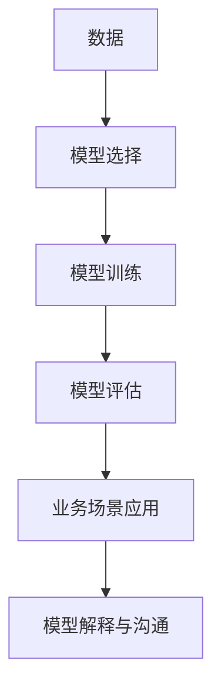

                 

# 模型思维在管理沟通中的运用

## 1. 背景介绍

### 1.1 问题由来

现代企业管理环境日益复杂，信息过载，沟通渠道多样化，给管理者带来了前所未有的挑战。信息传递的准确性和及时性，直接影响到企业的决策效率和运营效果。模型思维，作为一种科学分析和决策方法，正被越来越多的人在管理沟通中应用，并逐渐展现出其独特优势。

### 1.2 问题核心关键点

- **管理沟通的重要性**：信息传递不畅，容易导致误解和偏差，进而影响企业战略实施、团队协作和客户满意度。
- **模型思维的作用**：利用数据、算法和数学模型，帮助管理者更准确地理解问题，快速做出决策。
- **模型思维的应用**：包括决策树、回归模型、优化模型等，用于数据驱动的决策支持。

## 2. 核心概念与联系

### 2.1 核心概念概述

为了更好地理解模型思维在管理沟通中的应用，本节将介绍几个密切相关的核心概念：

- **模型思维**：基于数据和算法，建立模型进行预测、优化和决策的思维方法。
- **数据驱动决策**：利用大数据和机器学习技术，支持企业决策。
- **模型选择与评估**：选择合适的模型，通过评估模型性能，确保模型有效。
- **业务场景与问题**：将模型应用于具体的业务场景，解决实际管理问题。
- **模型解释与沟通**：确保模型输出的结果易于理解，便于管理层沟通。

这些核心概念之间的逻辑关系可以通过以下Mermaid流程图来展示：



这个流程图展示了大规模数据和模型思维的逻辑过程：

1. 从数据出发，选择合适模型，训练模型。
2. 评估模型性能，确保模型有效。
3. 将模型应用于具体业务场景，解决问题。
4. 解释模型输出结果，便于管理层沟通。

## 3. 核心算法原理 & 具体操作步骤
### 3.1 算法原理概述

模型思维在管理沟通中的应用，核心在于利用数据和算法，建立模型进行预测、优化和决策。常见的模型包括回归模型、决策树、随机森林、支持向量机等。这些模型通过分析历史数据，寻找数据之间的关联和规律，从而预测未来趋势，优化业务决策。

### 3.2 算法步骤详解

基于模型思维的管理沟通一般包括以下几个关键步骤：

**Step 1: 数据收集与预处理**
- 收集业务相关的数据，如销售数据、客户反馈、员工绩效等。
- 对数据进行清洗、归一化、缺失值处理等预处理操作。

**Step 2: 数据建模**
- 选择合适的模型，如线性回归、逻辑回归、决策树等。
- 根据业务需求，设计模型输入、输出和训练目标。
- 使用优化算法，如梯度下降、遗传算法等，训练模型。

**Step 3: 模型评估**
- 使用交叉验证、AUC-ROC曲线、混淆矩阵等评估指标，评估模型性能。
- 根据评估结果，调整模型参数或尝试其他模型。

**Step 4: 业务场景应用**
- 将训练好的模型应用于具体的业务场景，如销售预测、客户细分、风险评估等。
- 结合业务场景需求，设计合理的输入输出接口，支持业务应用。

**Step 5: 模型解释与沟通**
- 利用可视化工具，如Tableau、PowerBI等，展示模型结果。
- 提供模型解释报告，帮助管理层理解模型输出。
- 根据模型结果，进行数据驱动的决策，优化业务流程。

### 3.3 算法优缺点

模型思维在管理沟通中的应用，具有以下优点：
1. 数据驱动：基于实际业务数据，提供客观、科学的决策支持。
2. 快速迭代：通过持续的数据积累和模型优化，不断提高预测和决策的准确性。
3. 可解释性强：利用可视化工具，模型输出结果易于理解，便于沟通。
4. 灵活性高：可以根据不同业务场景，选择和调整合适的模型。

同时，该方法也存在一定的局限性：
1. 数据质量依赖：模型的性能依赖于数据的质量和数量。
2. 模型复杂度：复杂的模型可能存在过度拟合问题，影响泛化能力。
3. 业务理解需求：需要深入理解业务场景，才能设计出合适的模型。
4. 实施成本：数据处理、模型训练和部署等环节，需要一定的技术投入。

尽管存在这些局限性，但就目前而言，模型思维在管理沟通中的应用已初见成效，成为企业决策支持的重要手段。

### 3.4 算法应用领域

模型思维在管理沟通中的应用，广泛适用于各类业务场景，包括：

- **销售预测与分析**：利用历史销售数据，预测未来销售趋势，优化库存和销售策略。
- **客户细分与管理**：通过客户行为数据，细分客户群体，制定针对性营销方案。
- **风险评估与控制**：分析客户信用、市场风险等数据，预测风险，采取预防措施。
- **运营优化与改进**：分析供应链、生产流程等数据，优化运营效率，降低成本。
- **人力资源管理**：利用员工绩效、离职数据等，预测人才流失，优化招聘和培训策略。

此外，模型思维在企业战略规划、市场调研、产品开发等方面也有广泛应用，为企业带来了显著的决策和运营效益。

## 4. 数学模型和公式 & 详细讲解
### 4.1 数学模型构建

基于模型思维的管理沟通，通常使用回归模型、分类模型、优化模型等。以下是几种常见模型的数学模型构建：

**线性回归模型**：
$$
\min_{\theta} \sum_{i=1}^n (y_i - \theta^T x_i)^2
$$
其中，$\theta$ 为模型参数，$x_i$ 为输入特征，$y_i$ 为输出目标。

**逻辑回归模型**：
$$
\min_{\theta} \frac{1}{n} \sum_{i=1}^n \log [1 + \exp(-y_i \theta^T x_i)]
$$
其中，$\theta$ 为模型参数，$x_i$ 为输入特征，$y_i$ 为二分类标签。

**决策树模型**：
通过递归地将数据集划分，构建决策树，使得模型输出的目标值最小化。

### 4.2 公式推导过程

以线性回归模型为例，推导其最小二乘法求解过程：

假设数据集 $D = \{(x_1, y_1), (x_2, y_2), ..., (x_n, y_n)\}$，模型参数 $\theta = [\theta_0, \theta_1]^T$，则最小二乘法求解如下：

1. 计算样本均值和样本方差：
$$
\bar{x} = \frac{1}{n} \sum_{i=1}^n x_i, \quad \bar{y} = \frac{1}{n} \sum_{i=1}^n y_i
$$
$$
\sigma_x^2 = \frac{1}{n} \sum_{i=1}^n (x_i - \bar{x})^2, \quad \sigma_y^2 = \frac{1}{n} \sum_{i=1}^n (y_i - \bar{y})^2
$$

2. 求解模型参数：
$$
\theta_0 = \bar{y} - \theta_1 \bar{x}
$$
$$
\theta_1 = \frac{\sum_{i=1}^n (x_i - \bar{x})(y_i - \bar{y})}{\sigma_x^2}
$$

推导结果表明，最小二乘法通过最小化平方误差，得到最佳的模型参数。

### 4.3 案例分析与讲解

以销售预测为例，展示如何使用回归模型进行业务决策支持：

假设某公司销售数据如下：

| 年份 | 销量 |
| ---- | ---- |
| 2010 | 100 |
| 2011 | 120 |
| 2012 | 130 |
| 2013 | 140 |
| 2014 | 150 |

我们使用线性回归模型进行预测：

1. 收集数据：年份为自变量 $x_i$，销量为因变量 $y_i$。
2. 构建模型：$\theta_0 + \theta_1 x_i$，其中 $\theta_0$ 和 $\theta_1$ 为模型参数。
3. 求解参数：使用最小二乘法求解，得到 $\theta_0 = 60$，$\theta_1 = 10$。
4. 预测销量：当输入年份为2015时，$\hat{y} = 60 + 10 \times 2015 = 21300$。

通过模型预测，公司可以更准确地安排生产和库存，避免库存积压或缺货风险。

## 5. 项目实践：代码实例和详细解释说明
### 5.1 开发环境搭建

在进行模型思维在管理沟通中的应用实践前，我们需要准备好开发环境。以下是使用Python进行Scikit-Learn开发的开发环境配置流程：

1. 安装Anaconda：从官网下载并安装Anaconda，用于创建独立的Python环境。

2. 创建并激活虚拟环境：
```bash
conda create -n sklearn-env python=3.8 
conda activate sklearn-env
```

3. 安装Scikit-Learn：
```bash
conda install scikit-learn
```

4. 安装各类工具包：
```bash
pip install numpy pandas scikit-learn matplotlib tqdm jupyter notebook ipython
```

完成上述步骤后，即可在`sklearn-env`环境中开始模型思维在管理沟通中的应用实践。

### 5.2 源代码详细实现

下面我们以销售预测为例，给出使用Scikit-Learn进行线性回归模型的PyTorch代码实现。

首先，定义数据集和模型：

```python
import numpy as np
from sklearn.linear_model import LinearRegression
from sklearn.metrics import mean_squared_error
from sklearn.model_selection import train_test_split

# 数据集
data = np.array([[2010, 100], [2011, 120], [2012, 130], [2013, 140], [2014, 150]])
X = data[:, 0]  # 年份
y = data[:, 1]  # 销量

# 划分训练集和测试集
X_train, X_test, y_train, y_test = train_test_split(X, y, test_size=0.2, random_state=0)

# 构建模型
model = LinearRegression()
```

然后，训练模型并评估：

```python
# 训练模型
model.fit(X_train.reshape(-1, 1), y_train)

# 预测并评估
y_pred = model.predict(X_test.reshape(-1, 1))
mse = mean_squared_error(y_test, y_pred)
print("MSE:", mse)
```

最后，在新的年份上进行预测：

```python
# 预测2015年销量
x_new = np.array([2015])
y_new = model.predict(x_new.reshape(-1, 1))
print("2015年预测销量:", y_new[0])
```

以上就是使用Scikit-Learn进行销售预测的完整代码实现。可以看到，Scikit-Learn封装了线性回归模型的训练和评估过程，使得模型应用变得简洁高效。

### 5.3 代码解读与分析

让我们再详细解读一下关键代码的实现细节：

**数据集定义**：
- 使用NumPy数组定义年份和销量，其中年份为自变量，销量为因变量。

**模型训练**：
- 使用train_test_split方法划分训练集和测试集，确保模型泛化性能。
- 使用LinearRegression模型训练，通过fit方法拟合模型参数。

**模型评估**：
- 使用mean_squared_error计算预测值和真实值之间的均方误差。
- 输出均方误差，评估模型预测效果。

**模型预测**：
- 使用predict方法对新年份进行预测，输出预测销量。

可以看到，Scikit-Learn提供了方便的API接口，使得模型应用变得简单快捷。开发者可以将更多精力放在数据处理、模型选择和评估上，而不必过多关注底层实现细节。

当然，工业级的系统实现还需考虑更多因素，如模型的保存和部署、超参数的自动搜索、更灵活的任务适配层等。但核心的模型思维逻辑基本与此类似。

## 6. 实际应用场景
### 6.1 企业销售预测

在企业销售预测中，利用回归模型可以大幅提升预测的准确性和及时性，帮助企业更好地掌握市场动态，优化库存和销售策略。通过历史销售数据和市场趋势，模型可以预测未来的销售量，为企业提供科学决策支持。

在技术实现上，可以利用线性回归、逻辑回归、时间序列回归等模型，结合业务场景，设计合适的模型输入输出。通过持续的数据积累和模型优化，不断提升预测精度。

### 6.2 客户细分与营销

客户细分是企业精准营销的关键步骤，通过聚类分析等模型，可以识别出不同的客户群体，制定针对性的营销策略。例如，可以使用K-means聚类算法，根据客户的行为数据、消费习惯等，将客户分为高价值、中价值和低价值客户，进行差异化营销。

### 6.3 风险评估与预警

金融领域中的风险评估和预警，对企业的稳健运营至关重要。通过建立风险评估模型，可以预测客户的信用风险、市场风险等，及时采取防范措施。例如，可以使用逻辑回归模型，根据客户的贷款历史、收入状况、职业等信息，预测客户的违约概率，进行风险预警。

### 6.4 未来应用展望

随着数据驱动决策的普及，模型思维在管理沟通中的应用将越来越广泛。未来，模型思维将从单一的回归、分类模型，扩展到更复杂的神经网络、深度学习模型，以应对更复杂的业务场景和数据结构。同时，利用多模态数据融合、自适应学习等前沿技术，进一步提升模型的预测和决策能力。

## 7. 工具和资源推荐
### 7.1 学习资源推荐

为了帮助开发者系统掌握模型思维在管理沟通中的应用，这里推荐一些优质的学习资源：

1. 《数据科学导论》系列博文：系统介绍数据科学基础，包括数据预处理、模型选择、评估等。

2. 《机器学习实战》书籍：通过具体案例，深入讲解机器学习模型应用，适合初学者入门。

3. Coursera《机器学习》课程：由斯坦福大学教授主讲，详细讲解机器学习理论和实践，覆盖多种算法和应用场景。

4. Kaggle数据科学竞赛：参与实际数据竞赛，提升解决实际问题的能力，积累实践经验。

5. Scikit-Learn官方文档：提供完整的模型应用示例，是学习模型思维的重要资源。

通过对这些资源的学习实践，相信你一定能够快速掌握模型思维在管理沟通中的应用，并用于解决实际的业务问题。

### 7.2 开发工具推荐

高效的开发离不开优秀的工具支持。以下是几款用于模型思维在管理沟通中应用的常用工具：

1. Python：开源编程语言，生态丰富，适合数据科学和机器学习开发。

2. Scikit-Learn：Python数据科学库，提供多种机器学习算法和模型，适合快速原型开发。

3. TensorFlow：由Google主导开发的深度学习框架，支持多种模型和算法，适合生产部署。

4. Keras：基于TensorFlow的高级API，简化模型构建过程，适合快速迭代研究。

5. Jupyter Notebook：开源笔记本工具，支持代码运行和结果展示，方便数据科学实践。

合理利用这些工具，可以显著提升模型思维在管理沟通中的应用开发效率，加快创新迭代的步伐。

### 7.3 相关论文推荐

模型思维在管理沟通中的应用，是一个快速发展的领域。以下是几篇奠基性的相关论文，推荐阅读：

1. 《利用机器学习进行销售预测》：介绍机器学习模型在销售预测中的应用，提升预测精度。

2. 《客户细分与精准营销》：探讨聚类算法在客户细分中的应用，提高营销效果。

3. 《风险评估与预警模型》：分析逻辑回归模型在风险评估中的应用，提升风险管理能力。

4. 《多模态数据融合在管理决策中的应用》：介绍多模态数据融合方法，提升决策的全面性和准确性。

5. 《自适应学习在管理沟通中的应用》：探讨自适应学习模型，提升模型的自适应能力和泛化性能。

这些论文代表了大规模数据和模型思维的发展脉络。通过学习这些前沿成果，可以帮助研究者把握学科前进方向，激发更多的创新灵感。

## 8. 总结：未来发展趋势与挑战
### 8.1 总结

本文对模型思维在管理沟通中的应用进行了全面系统的介绍。首先阐述了模型思维在管理沟通中的重要性，明确了模型思维在数据驱动决策中的独特价值。其次，从原理到实践，详细讲解了模型思维的数学模型和具体操作步骤，给出了模型应用任务开发的完整代码实例。同时，本文还广泛探讨了模型思维在销售预测、客户细分、风险评估等多个业务场景中的应用前景，展示了模型思维的广泛应用价值。此外，本文精选了模型思维技术的各类学习资源，力求为读者提供全方位的技术指引。

通过本文的系统梳理，可以看到，模型思维在管理沟通中的应用，正在成为企业决策支持的重要手段，极大地提升了数据驱动决策的效率和准确性。未来，伴随大数据、深度学习等技术的不断发展，模型思维将进一步拓展应用范围，为企业管理沟通带来更加深刻的变革。

### 8.2 未来发展趋势

展望未来，模型思维在管理沟通中的应用将呈现以下几个发展趋势：

1. 数据质量依赖降低。通过更多的预处理和清洗，减少数据噪音，提升数据质量。

2. 模型复杂度提高。利用深度学习、神经网络等先进模型，提升模型的预测和决策能力。

3. 多模态数据融合增强。结合图像、语音、文本等多模态数据，提升模型的综合分析能力。

4. 自适应学习能力提升。引入自适应学习算法，使模型能够动态调整模型参数，提升模型的自适应能力和泛化性能。

5. 实时性要求提升。利用流式计算、实时数据处理技术，实现模型的实时预测和决策，满足业务实时性要求。

6. 可解释性和可视化增强。利用可解释性模型和可视化工具，提升模型输出的可理解性，便于管理层沟通。

以上趋势凸显了模型思维在管理沟通中的应用潜力，这些方向的探索发展，必将进一步提升数据驱动决策的效果，为企业带来显著的竞争优势。

### 8.3 面临的挑战

尽管模型思维在管理沟通中的应用已取得显著成效，但在迈向更加智能化、普适化应用的过程中，它仍面临诸多挑战：

1. 数据获取难度。高质量数据获取成本较高，数据噪音和缺失值处理复杂。

2. 模型训练时间较长。复杂模型训练时间长，需大量计算资源支持。

3. 模型泛化能力不足。模型在新数据上的泛化性能较低，需进一步优化。

4. 模型复杂度较高。复杂模型难以理解，模型解释和沟通难度大。

5. 实施成本较高。模型构建、训练、部署等环节，需要技术团队的支持，成本较高。

尽管存在这些挑战，但随着技术进步和实践积累，模型思维在管理沟通中的应用将更加广泛和深入。唯有持续探索和优化，才能更好地发挥模型思维的潜力，推动企业决策的科学化和智能化。

### 8.4 研究展望

面对模型思维在管理沟通中面临的挑战，未来的研究需要在以下几个方面寻求新的突破：

1. 数据获取和处理：研究高效的数据获取和预处理技术，提升数据质量，减少数据噪音。

2. 模型构建和优化：开发更加高效、可解释性强的模型，提高模型的泛化能力和解释性。

3. 实时性和灵活性：研究实时数据处理和模型优化技术，满足业务实时性和灵活性要求。

4. 多模态数据融合：结合多模态数据，提升模型的综合分析能力，支持多业务场景。

5. 模型解释和可视化：开发可解释性模型和可视化工具，提升模型的解释性和沟通效果。

这些研究方向的探索，必将引领模型思维在管理沟通中的应用迈向更高的台阶，为企业决策支持带来更加显著的效益。面向未来，模型思维还需要与其他人工智能技术进行更深入的融合，如知识表示、因果推理、强化学习等，多路径协同发力，共同推动数据驱动决策的进步。

## 9. 附录：常见问题与解答

**Q1：模型思维是否适用于所有业务场景？**

A: 模型思维在绝大多数业务场景中都能发挥作用，特别是数据驱动决策需求较高的领域。但对于一些需要人工干预、需要深度业务理解的场景，模型思维可能难以胜任。

**Q2：模型思维的实施成本是否较高？**

A: 模型思维的实施成本相对较高，包括数据获取、模型构建、训练、部署等环节，需要一定的技术团队支持。但随着开源工具和云计算的发展，这些成本正在逐渐降低。

**Q3：如何评估模型性能？**

A: 常用的模型评估指标包括均方误差(MSE)、AUC-ROC曲线、混淆矩阵等。根据业务需求选择合适的评估指标，对模型进行评估和优化。

**Q4：模型如何应用于实际业务场景？**

A: 将模型封装为标准化API接口，通过API调用获取模型输出结果，结合业务场景需求进行决策。

**Q5：模型解释和沟通的难点是什么？**

A: 复杂模型的解释和沟通是难点，需要通过可视化工具、简化模型等方法，提升模型的可理解性。

这些问题的解答，可以帮助企业更好地理解模型思维在管理沟通中的应用，并规避潜在的实施风险。

---

作者：禅与计算机程序设计艺术 / Zen and the Art of Computer Programming

