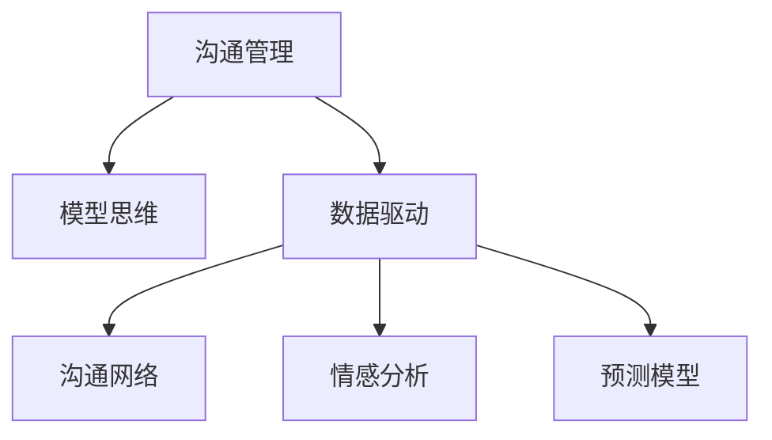

                 

# 模型思维在管理沟通中的运用

> 关键词：模型思维, 沟通管理, 管理决策, 数据驱动, 预测模型, 沟通模型

## 1. 背景介绍

### 1.1 问题由来

在现代企业管理中，良好的沟通是确保组织高效运行的重要前提。然而，现实中的沟通往往面临诸多挑战，如信息不对称、信息传递效率低、沟通误解等。这些问题严重影响了企业决策的有效性和执行效率。为了解决这些问题，企业开始引入数据分析和模型思维，利用数学模型和数据驱动的方法来优化沟通管理，提高决策质量。

### 1.2 问题核心关键点

模型思维在沟通管理中的应用，主要是指利用数学模型对沟通中的各种要素进行建模和分析，从而提升沟通效果。常见的模型包括沟通网络模型、情感模型、预测模型等。通过这些模型，可以定量分析和预测沟通行为，优化沟通策略，提高组织决策和执行效率。

## 2. 核心概念与联系

### 2.1 核心概念概述

为更好地理解模型思维在沟通管理中的应用，本节将介绍几个密切相关的核心概念：

- 沟通管理(Communication Management)：指企业利用各种沟通渠道和策略，确保信息在组织内外有效、高效地传递的过程。沟通管理的目标是降低信息不对称，提高决策效率。

- 模型思维(Model Thinking)：指利用数学模型和数据分析技术，对现实中的问题进行建模和分析，从而获得科学决策依据的方法。模型思维强调数据驱动，注重模型的预测和优化能力。

- 数据驱动(Data-Driven)：指决策过程基于数据而非直觉或经验，通过统计分析和机器学习模型，从数据中提取洞察，进行科学决策。

- 沟通网络(Communication Network)：指组织内部的信息流动网络，通过建模分析，可以了解信息传递的路径和效率。

- 情感分析(Sentiment Analysis)：指利用自然语言处理和机器学习技术，分析文本数据中的情感倾向，预测个体或群体对信息的情感反应。

- 预测模型(Predictive Model)：指通过历史数据训练的机器学习模型，用于预测未来沟通行为和决策结果。

这些核心概念之间的逻辑关系可以通过以下Mermaid流程图来展示：



这个流程图展示了一些核心概念及其之间的关系：

1. 沟通管理是目标，模型思维是手段。
2. 数据驱动是模型思维的基础。
3. 沟通网络和情感分析是具体应用，用于建模和分析。
4. 预测模型用于预测未来的沟通行为和决策结果。

## 3. 核心算法原理 & 具体操作步骤

### 3.1 算法原理概述

基于模型思维的沟通管理，核心在于利用数学模型对沟通中的各种要素进行建模和分析，从而优化沟通策略和提高决策质量。常见的模型包括沟通网络模型、情感模型和预测模型等。

- 沟通网络模型：用于分析组织内部的信息传递路径和效率，通过优化路径和节点，提高信息传递效率。
- 情感模型：用于分析沟通内容中的情感倾向，预测接收者的情感反应，从而调整沟通策略。
- 预测模型：用于预测未来的沟通行为和决策结果，提供科学决策依据。

### 3.2 算法步骤详解

基于模型思维的沟通管理一般包括以下几个关键步骤：

**Step 1: 数据收集和预处理**
- 收集组织内部的沟通记录、员工反馈、绩效数据等。
- 清洗和处理数据，包括去除噪音、填补缺失值、标准化数据等。

**Step 2: 建模和分析**
- 选择合适的数学模型，如沟通网络模型、情感模型和预测模型。
- 利用历史数据训练模型，进行模型参数调优。
- 利用模型对沟通行为和决策结果进行预测和分析。

**Step 3: 策略优化**
- 根据模型分析结果，优化沟通策略和路径。
- 调整沟通频率、方式和内容，提高沟通效果。
- 实施策略并评估其效果，迭代优化。

### 3.3 算法优缺点

基于模型思维的沟通管理方法具有以下优点：
1. 定量分析：模型提供了科学的数据驱动决策依据，减少主观判断误差。
2. 预测能力：利用历史数据进行模型训练，可以预测未来的沟通行为和决策结果。
3. 优化策略：模型分析可以发现沟通中的问题和瓶颈，提供优化建议。

同时，该方法也存在一定的局限性：
1. 数据质量要求高：模型依赖高质量的数据，数据收集和处理成本较高。
2. 模型复杂度：一些复杂的模型可能需要大量计算资源和时间进行训练和优化。
3. 预测偏差：模型可能由于数据分布偏差或过拟合等原因，导致预测结果不准确。
4. 实际应用限制：模型通常是针对特定情境设计的，难以直接应用于不同组织。

尽管存在这些局限性，但就目前而言，基于模型思维的沟通管理方法仍是大数据时代企业沟通管理的重要手段。未来相关研究的重点在于如何进一步降低数据依赖，提高模型的可解释性和泛化能力，以及更广泛地应用于不同组织和情境。

### 3.4 算法应用领域

基于模型思维的沟通管理方法在多个领域都有广泛应用：

- 企业管理：通过建模分析沟通行为，优化决策过程，提升组织效率。
- 人力资源：利用情感模型分析员工反馈，调整人力资源政策，提高员工满意度。
- 市场营销：通过预测模型分析市场反应，制定更有效的营销策略。
- 客户服务：利用情感模型分析客户反馈，提升客户满意度，优化服务流程。
- 项目管理：通过建模分析团队沟通，优化项目管理流程，提高项目成功率。

## 4. 数学模型和公式 & 详细讲解 & 举例说明

### 4.1 数学模型构建

基于模型思维的沟通管理，常见的数学模型包括：

- 沟通网络模型：使用图论中的有向图或无向图表示信息传递网络，通过节点的连通性和路径长度分析信息传递效率。
- 情感模型：基于自然语言处理技术，对文本中的情感倾向进行分类或回归分析，预测情感反应。
- 预测模型：使用机器学习算法（如回归、分类、聚类等），基于历史数据训练预测模型，预测未来的沟通行为和决策结果。

### 4.2 公式推导过程

以情感模型为例，利用LDA主题模型进行文本情感分析：

1. 文本预处理：去除停用词、分词、词性标注等。
2. 词向量化：将文本转化为词向量，用于机器学习模型训练。
3. LDA主题建模：利用LDA模型对词向量进行主题建模，提取文本中的主题和情感倾向。
4. 情感分类：将主题与情感词典进行匹配，分类文本情感倾向（正向、负向、中性）。

LDA模型的主题概率分布公式为：

$$
\theta_k = \frac{\sum_{i=1}^N \alpha_{ik} * \alpha_{ik}}{N \sum_{k=1}^K \sum_{i=1}^N \alpha_{ik}}
$$

其中 $\theta_k$ 表示主题 $k$ 在文本 $i$ 中的概率，$\alpha_{ik}$ 表示词 $i$ 属于主题 $k$ 的概率。

情感分类公式为：

$$
\text{Sentiment} = \max\limits_{k \in \text{emotions}} P(\text{theme}_k \mid \text{document})
$$

其中 $\text{Sentiment}$ 表示文本的情感倾向，$P(\text{theme}_k \mid \text{document})$ 表示主题 $k$ 与情感词典匹配的概率。

### 4.3 案例分析与讲解

假设某公司内部员工每周都会提交一份工作报告，包含对本周工作内容和情绪的描述。公司希望利用模型思维优化沟通管理，分析员工情绪变化，调整沟通策略。

1. **数据收集**：收集员工每周提交的工作报告，获取文本数据。
2. **情感模型建模**：利用LDA主题模型对文本进行主题建模，提取与情绪相关的关键词。
3. **情感分析**：将提取出的关键词与情感词典进行匹配，预测员工的情感倾向。
4. **策略优化**：根据情感分析结果，调整沟通频率和方式，如增加沟通次数，调整沟通内容，提高员工满意度。

案例分析如下：

**数据收集**：公司每周从员工提交的工作报告中提取文本数据，共计100份。

**情感模型建模**：利用LDA模型对文本进行主题建模，得到30个主题，每个主题对应一个情感倾向。

**情感分析**：将每个主题与情感词典匹配，得到情感倾向，结果如表所示：

| 主题ID | 情感倾向 | 文本示例 |
| ------ | -------- | ------- |
| 1      | 负向     | “工作很忙碌，压力很大” |
| 2      | 正向     | “团队协作很好，有成就感” |
| 3      | 中性     | “日常工作outine” |

**策略优化**：根据情感分析结果，发现一周内员工情绪主要集中在负向和中性主题上，工作压力较大。因此，公司决定增加沟通频率，调整沟通内容，增加对工作压力和团队合作的关注，提升员工满意度和工作效率。

通过以上案例，可以看出模型思维在沟通管理中的实际应用效果。

## 5. 项目实践：代码实例和详细解释说明

### 5.1 开发环境搭建

在进行模型思维的沟通管理实践前，我们需要准备好开发环境。以下是使用Python进行Scikit-learn开发的环境配置流程：

1. 安装Anaconda：从官网下载并安装Anaconda，用于创建独立的Python环境。

2. 创建并激活虚拟环境：
```bash
conda create -n communication-env python=3.8 
conda activate communication-env
```

3. 安装Scikit-learn：
```bash
pip install scikit-learn
```

4. 安装各类工具包：
```bash
pip install numpy pandas scikit-learn matplotlib tqdm jupyter notebook ipython
```

完成上述步骤后，即可在`communication-env`环境中开始模型思维的沟通管理实践。

### 5.2 源代码详细实现

下面我们以情感分析为例，给出使用Scikit-learn进行情感分析的Python代码实现。

首先，定义情感模型训练函数：

```python
from sklearn.feature_extraction.text import TfidfVectorizer
from sklearn.decomposition import LatentDirichletAllocation
from sklearn.feature_extraction.text import CountVectorizer

def train_emotion_model(texts, num_topics=30):
    tfidf = TfidfVectorizer(stop_words='english')
    X = tfidf.fit_transform(texts)
    lda = LatentDirichletAllocation(n_components=num_topics, max_iter=50, random_state=42)
    lda.fit(X)
    return lda
```

然后，定义情感分类函数：

```python
from sklearn.metrics.pairwise import cosine_similarity
from sklearn.metrics import accuracy_score
from sklearn.naive_bayes import MultinomialNB
from sklearn.svm import SVC

def classify_emotion(text, model):
    X_test = CountVectorizer(stop_words='english').fit_transform([text])
    X_test = TfidfVectorizer(stop_words='english').transform(X_test)
    emotion_prob = model.transform(X_test).toarray()
    prob_index = np.argmax(emotion_prob)
    return prob_index
```

最后，启动情感分析流程并在测试集上评估：

```python
from sklearn.model_selection import train_test_split

# 假设有100份员工报告文本
texts = ['work is very busy, pressure is big', 'teamwork is very good, have a sense of achievement', 'daily work routine']

# 分割训练集和测试集
X_train, X_test, y_train, y_test = train_test_split(texts, y, test_size=0.2)

# 训练情感模型
lda = train_emotion_model(X_train)

# 测试情感分类
y_pred = []
for text in X_test:
    prob_index = classify_emotion(text, lda)
    y_pred.append(prob_index)

# 评估分类器性能
print(accuracy_score(y_test, y_pred))
```

以上就是使用Scikit-learn对员工报告进行情感分析的完整代码实现。可以看到，通过简单的Python代码，可以轻松实现情感模型的训练和测试。

### 5.3 代码解读与分析

让我们再详细解读一下关键代码的实现细节：

**train_emotion_model函数**：
- `TfidfVectorizer`：将文本转化为TF-IDF特征向量。
- `LatentDirichletAllocation`：使用LDA模型对文本进行主题建模，提取情感主题。
- `model`：返回LDA模型对象，用于后续情感分类。

**classify_emotion函数**：
- `CountVectorizer`：将文本转化为词频特征向量。
- `TfidfVectorizer`：将词频向量转化为TF-IDF特征向量。
- `model.transform`：将文本转化为情感主题概率分布。
- `np.argmax`：返回情感概率分布中概率最大的主题ID。

**测试流程**：
- `train_test_split`：将数据集分为训练集和测试集。
- `lda`：使用训练集训练情感模型。
- `y_pred`：对测试集进行情感分类。
- `accuracy_score`：评估分类器性能。

通过以上代码，可以直观理解情感分析的实现过程，利用模型思维进行沟通管理的实际应用。

当然，在工业级的系统实现中，还需要考虑更多因素，如情感词典的构建、主题模型的超参数调优、多语言支持等。但核心的模型思维和机器学习算法仍是关键技术。

## 6. 实际应用场景

### 6.1 智能客服系统

基于模型思维的智能客服系统，可以广泛应用于企业客户服务部门。传统客服系统依赖人工操作，响应时间长，无法24小时不间断服务。通过模型思维，可以构建智能客服机器人，利用自然语言处理技术对客户咨询进行情感分析，提供个性化服务。

在技术实现上，可以收集历史客服对话记录，利用情感分析模型对客户情感进行分类，动态调整客服策略。对于新客户问题，系统可以实时搜索知识库，生成回答，并动态调整回答策略，提升客户满意度。

### 6.2 企业管理

企业管理中的沟通管理，通过模型思维可以更科学地制定沟通策略，优化决策流程。利用沟通网络模型，可以分析员工之间的信息传递效率，发现沟通瓶颈，调整沟通路径。利用情感分析模型，可以预测员工的情绪变化，调整管理措施。

在具体应用中，企业可以通过定期收集员工反馈，利用情感模型分析员工情绪，调整人力资源策略。对于高情感风险部门，可以加强沟通频率和方式，提升员工满意度和工作效率。

### 6.3 市场营销

市场营销中的沟通管理，通过模型思维可以更精准地制定营销策略，提升客户转化率。利用情感分析模型，可以分析客户对广告和产品的情感反应，调整营销内容和策略。利用预测模型，可以预测市场反应，优化广告投放策略。

在具体应用中，企业可以通过社交媒体收集客户反馈，利用情感分析模型分析客户情感，优化产品设计和广告策略。对于高情感正面反应的客户，可以加强品牌宣传，提升客户转化率。

### 6.4 未来应用展望

随着模型思维和机器学习技术的不断发展，基于模型思维的沟通管理将呈现以下几个发展趋势：

1. 数据融合与多模态建模：利用多模态数据（如语音、图像、文本）进行融合建模，提高模型对现实世界的理解和建模能力。
2. 模型可解释性与透明性：开发更可解释的模型，提供决策依据和推理过程，增强模型透明度和可信度。
3. 自动化与自适应：引入自动化学习与自适应技术，模型能够自主优化和调整，适应不同情境和环境。
4. 集成与协同：将模型思维与其他技术（如知识图谱、规则引擎等）进行集成，形成更全面、准确的信息整合能力。
5. 智能决策支持系统：构建基于模型思维的智能决策支持系统，利用机器学习模型辅助决策，提升决策质量和效率。

这些趋势展示了模型思维在沟通管理中的广阔前景。随着技术的进步和应用的深入，模型思维将更好地服务于企业管理，提高沟通效率和决策质量。

## 7. 工具和资源推荐

### 7.1 学习资源推荐

为了帮助开发者系统掌握模型思维在沟通管理中的应用，这里推荐一些优质的学习资源：

1. 《数据科学基础》系列书籍：由斯坦福大学、MIT等知名学府提供的免费在线课程，涵盖数据科学基础和高级技术。
2. 《机器学习实战》书籍：介绍机器学习算法和实现技巧，涵盖分类、回归、聚类等多个领域。
3. Kaggle竞赛平台：提供丰富的机器学习竞赛数据集和模型，可以锻炼数据处理和建模能力。
4. Scikit-learn官方文档：Scikit-learn的官方文档，提供完整的数据处理、建模和评估流程。
5. Google Colab：谷歌提供的免费在线Jupyter Notebook环境，方便进行数据实验和模型验证。

通过对这些资源的学习实践，相信你一定能够快速掌握模型思维在沟通管理中的应用，并用于解决实际的沟通问题。

### 7.2 开发工具推荐

高效的开发离不开优秀的工具支持。以下是几款用于模型思维沟通管理开发的常用工具：

1. Python：Python语言是数据科学和机器学习领域的主流语言，提供丰富的科学计算和数据分析库。
2. Scikit-learn：基于Python的机器学习库，提供了简单易用的建模工具和评估方法。
3. TensorFlow：Google开发的深度学习框架，支持大规模分布式计算，适合复杂模型训练。
4. PyTorch：Facebook开发的深度学习框架，支持动态计算图和GPU加速，适合快速迭代研究。
5. Jupyter Notebook：交互式编程环境，方便进行代码调试和实验记录。

合理利用这些工具，可以显著提升模型思维在沟通管理的开发效率，加快创新迭代的步伐。

### 7.3 相关论文推荐

模型思维在沟通管理中的应用，得益于学界的持续研究。以下是几篇奠基性的相关论文，推荐阅读：

1. "Latent Dirichlet Allocation"（LDA论文）：提出LDA主题模型，用于文本分析和主题建模。
2. "Sentiment Analysis in Social Media: An Overview"：介绍情感分析在社交媒体中的应用和挑战。
3. "Sequence-to-Sequence Models for Conversational Agent"：介绍序列到序列模型在智能客服中的应用。
4. "Data-Driven Decision-Making in Business Intelligence"：讨论数据驱动决策在商业智能中的应用和重要性。
5. "Machine Learning in Marketing: A Practical Guide"：介绍机器学习在市场营销中的应用和实践。

这些论文代表了大模型思维在沟通管理领域的发展脉络。通过学习这些前沿成果，可以帮助研究者把握学科前进方向，激发更多的创新灵感。

## 8. 总结：未来发展趋势与挑战

### 8.1 总结

本文对基于模型思维的沟通管理方法进行了全面系统的介绍。首先阐述了模型思维在沟通管理中的研究背景和意义，明确了模型思维在提升沟通效率和决策质量方面的独特价值。其次，从原理到实践，详细讲解了模型思维的数学原理和关键步骤，给出了模型思维应用的全代码实例。同时，本文还广泛探讨了模型思维在智能客服、企业管理、市场营销等多个行业领域的应用前景，展示了模型思维的广阔应用空间。最后，本文精选了模型思维的各类学习资源，力求为读者提供全方位的技术指引。

通过本文的系统梳理，可以看出模型思维在沟通管理中的重要性和广泛应用。借助数学模型和数据驱动的方法，可以有效提升沟通管理效率，优化决策过程，降低企业成本，提高员工满意度和客户转化率。未来，随着模型思维技术的不断发展，将为沟通管理带来更多创新和突破，推动企业管理信息化和智能化进程。

### 8.2 未来发展趋势

展望未来，基于模型思维的沟通管理将呈现以下几个发展趋势：

1. 数据驱动决策：越来越多的企业将基于数据和模型进行决策，减少主观判断，提高决策科学性。
2. 智能化客服：智能客服系统将更加智能，能够理解复杂的客户情感，提供更个性化和高效的客户服务。
3. 自适应沟通模型：基于机器学习的模型将具备自适应能力，根据不同情境和环境，自动调整沟通策略。
4. 多模态沟通：利用多模态数据进行融合建模，提高模型对现实世界的理解和建模能力。
5. 可解释性和透明性：模型将更加可解释，提供决策依据和推理过程，增强模型透明度和可信度。

以上趋势展示了模型思维在沟通管理中的广阔前景。这些方向的探索发展，必将进一步提升沟通管理效率和决策质量，推动企业信息化和智能化进程。

### 8.3 面临的挑战

尽管基于模型思维的沟通管理技术已经取得了瞩目成就，但在迈向更加智能化、普适化应用的过程中，它仍面临诸多挑战：

1. 数据质量问题：数据质量直接影响到模型效果，高质量数据的获取和处理成本较高。
2. 模型复杂度：一些复杂的模型可能需要大量计算资源和时间进行训练和优化。
3. 模型泛化能力：模型在特定情境下的泛化能力不足，难以适应新的数据和环境。
4. 实际应用限制：模型通常是针对特定情境设计的，难以直接应用于不同组织和情境。
5. 数据隐私和安全：模型训练和应用过程中涉及大量数据，数据隐私和安全问题亟待解决。

尽管存在这些挑战，但通过技术创新和实践积累，未来这些挑战终将一一被克服，基于模型思维的沟通管理必将在企业管理和客户服务等领域发挥更大的作用。

### 8.4 研究展望

面对模型思维在沟通管理中面临的挑战，未来的研究需要在以下几个方面寻求新的突破：

1. 多模态数据融合：利用多模态数据进行融合建模，提高模型的泛化能力和鲁棒性。
2. 模型可解释性：开发更可解释的模型，提供决策依据和推理过程，增强模型透明度和可信度。
3. 自适应学习：引入自动化学习和自适应技术，模型能够自主优化和调整，适应不同情境和环境。
4. 数据隐私保护：引入数据隐私保护技术，确保模型训练和应用过程中数据的隐私和安全。
5. 多语言支持：构建多语言支持的系统，提高模型的普适性和应用范围。

这些研究方向将引领基于模型思维的沟通管理技术迈向更高的台阶，为企业管理和客户服务带来更多创新和突破，推动人工智能技术在垂直行业的规模化落地。总之，模型思维需要从数据、算法、工程、业务等多个维度协同发力，才能真正实现人工智能技术在垂直行业的规模化落地。相信随着技术的进步和应用的深入，基于模型思维的沟通管理必将在企业管理信息化和智能化进程中扮演越来越重要的角色。

## 9. 附录：常见问题与解答

**Q1: 模型思维在沟通管理中如何应用？**

A: 模型思维在沟通管理中的应用主要包括以下几个方面：
1. 数据收集与预处理：收集和管理组织内部的沟通数据，包括文本、语音、图像等多模态数据。
2. 建模与分析：利用数学模型对沟通数据进行建模和分析，如沟通网络模型、情感模型、预测模型等。
3. 策略优化：根据模型分析结果，优化沟通策略和路径，提高沟通效率和效果。
4. 评估与迭代：定期评估沟通管理效果，不断迭代优化模型和策略，提升沟通质量。

**Q2: 情感分析模型的构建过程是怎样的？**

A: 情感分析模型的构建过程主要包括以下几个步骤：
1. 数据收集与预处理：收集文本数据，去除噪音、分词、词性标注等。
2. 特征提取：将文本转化为TF-IDF特征向量或词向量。
3. 主题建模：使用LDA模型对文本进行主题建模，提取情感主题。
4. 情感分类：将主题与情感词典进行匹配，分类情感倾向。
5. 模型评估：使用分类准确率、F1值等指标评估模型性能。

**Q3: 如何提高沟通模型泛化能力？**

A: 提高沟通模型的泛化能力可以从以下几个方面入手：
1. 数据多样性：收集多种情境和环境下的沟通数据，增加模型的多样性和泛化能力。
2. 多模态融合：利用多模态数据进行融合建模，提高模型的泛化能力和鲁棒性。
3. 自适应学习：引入自动化学习和自适应技术，模型能够自主优化和调整，适应不同情境和环境。
4. 模型融合：将多个模型进行融合，提高模型的泛化能力和鲁棒性。

**Q4: 沟通模型在实际应用中需要注意哪些问题？**

A: 沟通模型在实际应用中需要注意以下几个问题：
1. 数据质量：确保数据质量，去除噪音、填补缺失值、标准化数据等。
2. 模型泛化能力：模型需要具备良好的泛化能力，能够在不同情境和环境下表现稳定。
3. 实际应用限制：模型通常是针对特定情境设计的，需要根据实际情况进行调整和优化。
4. 数据隐私和安全：模型训练和应用过程中涉及大量数据，需要确保数据隐私和安全。

**Q5: 如何构建基于模型思维的智能客服系统？**

A: 构建基于模型思维的智能客服系统主要包括以下几个步骤：
1. 数据收集：收集客户历史咨询记录，提取文本数据。
2. 情感分析：利用情感分析模型对客户情感进行分类，调整客服策略。
3. 知识库构建：构建知识库，包含常见问题及其答案。
4. 对话生成：利用生成模型生成回答，动态调整回答策略。
5. 系统集成：将智能客服系统集成到企业客服系统中，提供个性化服务。

通过以上步骤，可以构建一个基于模型思维的智能客服系统，提升客户咨询体验和满意度。

