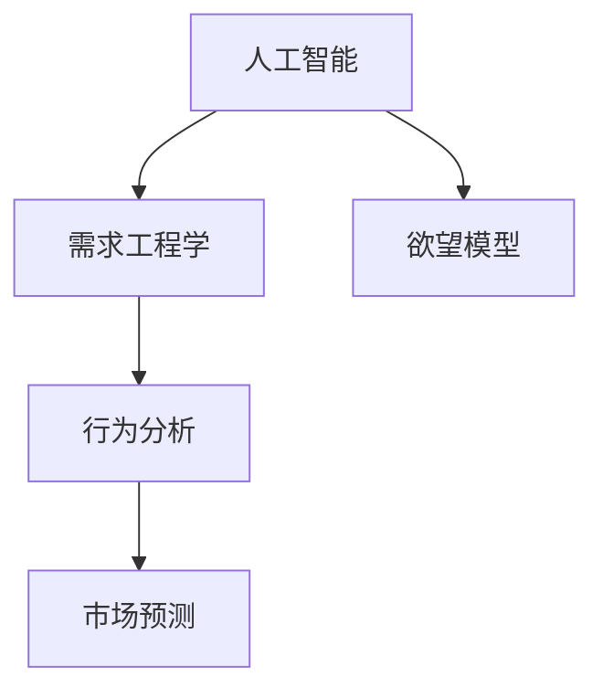

                 

# 欲望工程学：AI如何塑造人类需求

> 关键词：人工智能，需求工程，欲望模型，行为分析，市场预测

## 1. 背景介绍

### 1.1 问题由来
在当今数字化时代，人工智能(AI)技术正以前所未有的速度渗透到各个领域。AI的应用不仅在工业生产、自动化服务、医疗健康等领域带来了革命性的变革，更在消费行为、市场动态、城市规划等方面展现出了强大的潜力和价值。然而，AI技术如何更好地理解和塑造人类需求，成为了一个亟待解决的问题。

### 1.2 问题核心关键点
需求塑造的核心在于对人类行为模式和偏好进行深入分析和预测。AI技术通过数据挖掘、机器学习等方法，可以从海量数据中提取有价值的信息，揭示人类行为的规律和趋势。本文聚焦于AI如何通过需求工程学的方式，准确把握和预测人类需求，从而指导商业决策、优化产品设计、提升用户体验。

### 1.3 问题研究意义
理解并塑造人类需求，对于构建智能商业模型、提升用户体验、优化资源配置具有重要意义：

1. **提升商业效率**：通过精准预测市场趋势和消费者需求，企业可以优化供应链管理，减少库存积压，提高资金周转率。
2. **优化用户体验**：AI技术可以帮助企业理解用户行为，提供个性化的产品和服务，增强用户粘性。
3. **优化资源配置**：通过数据分析，AI可以预测城市人口流动、资源需求，辅助政府和企业进行智能规划和决策。
4. **推动创新发展**：基于需求分析，企业可以发现市场空白，推出更具吸引力的新产品，推动技术进步和产业升级。
5. **促进社会福祉**：通过AI技术改善公共服务，如交通出行、医疗健康、教育培训，提升社会整体福祉。

## 2. 核心概念与联系

### 2.1 核心概念概述

为更好地理解AI如何塑造人类需求，本节将介绍几个关键概念：

- **人工智能**：通过算法和模型，使机器能够模拟人类智能行为的技术。
- **需求工程学**：研究和实践如何通过工程方法，理解和构建用户需求的技术。
- **欲望模型**：描述和预测人类行为动机的数学和算法模型。
- **行为分析**：利用数据分析和机器学习技术，识别和解释人类行为的规律和趋势。
- **市场预测**：通过需求分析，预测未来市场变化，指导商业决策。

这些概念之间的逻辑关系可以通过以下Mermaid流程图来展示：



这个流程图展示了一些核心概念及其之间的关系：

1. 人工智能提供技术基础，需求工程学通过工程方法，研究和实践如何理解和构建需求。
2. 欲望模型是需求工程学的核心工具，用于描述和预测人类行为动机。
3. 行为分析利用人工智能技术，分析和解释人类行为的规律和趋势。
4. 市场预测基于行为分析，预测未来市场需求，指导商业决策。

## 3. 核心算法原理 & 具体操作步骤
### 3.1 算法原理概述

AI通过欲望模型和行为分析，理解和预测人类需求。其核心算法原理如下：

- **欲望模型构建**：基于心理学和行为经济学理论，构建描述人类行为动机的数学模型。
- **行为分析实现**：利用机器学习算法，如聚类分析、关联规则、深度学习等，从数据中挖掘人类行为规律。
- **市场预测应用**：将行为分析结果应用到市场预测模型中，通过历史数据和实时数据，预测未来的市场需求和变化。

### 3.2 算法步骤详解

基于AI的需求工程学，市场预测的算法步骤一般包括：

1. **数据收集**：从多个渠道收集用户行为数据，如电商平台交易记录、社交媒体互动信息、移动应用使用行为等。
2. **数据预处理**：对收集到的数据进行清洗、归一化、特征提取等预处理工作。
3. **欲望模型训练**：利用用户行为数据训练欲望模型，如期望效用模型、决策树模型等，以揭示用户行为动机的内在规律。
4. **行为分析应用**：应用欲望模型和历史数据，使用机器学习算法进行行为分析，识别出用户偏好和行为模式。
5. **市场预测实现**：将行为分析结果输入市场预测模型，利用时间序列分析、回归分析等方法，预测未来市场需求和变化趋势。
6. **模型评估与优化**：通过评估预测结果与实际数据的匹配度，不断优化模型参数和算法，提升预测精度。

### 3.3 算法优缺点

AI在需求工程学中的应用具有以下优点：

1. **数据驱动**：基于大规模数据进行分析和预测，能够更全面、客观地理解用户需求。
2. **实时响应**：AI可以实时分析用户行为，快速响应市场变化，提升决策效率。
3. **个性化推荐**：利用用户行为数据，提供个性化推荐，提升用户体验。
4. **跨领域应用**：AI技术在电商、社交、医疗、交通等多个领域都有广泛应用，具有通用性。

同时，也存在一些局限性：

1. **数据隐私**：用户行为数据涉及隐私，数据收集和使用需要遵守相关法律法规。
2. **数据质量**：数据质量对AI模型性能有重要影响，数据收集和处理过程中容易出现偏差和噪音。
3. **模型复杂性**：AI模型往往较为复杂，需要专业知识进行设计和优化。
4. **解释性不足**：AI模型往往缺乏可解释性，难以直观理解其内部决策过程。
5. **伦理挑战**：AI技术在应用过程中可能存在伦理问题，如数据滥用、算法偏见等。

尽管存在这些局限性，但AI在需求工程学中的应用仍具有显著优势，尤其是在大数据和实时性方面，AI技术具有不可替代的地位。

### 3.4 算法应用领域

AI在需求工程学中的应用广泛，以下是几个典型的应用领域：

1. **电商推荐系统**：根据用户浏览和购买行为，推荐个性化的商品和活动，提升销售转化率。
2. **社交媒体分析**：分析用户互动数据，识别出热门话题和用户偏好，指导内容生产和广告投放。
3. **医疗健康**：利用患者健康数据和行为分析，预测疾病风险，提供个性化的健康管理方案。
4. **城市规划**：分析居民出行数据，预测交通流量和需求，优化城市交通规划和资源配置。
5. **金融市场**：分析市场交易数据，预测股票价格和趋势，指导投资决策。

这些应用场景展示了AI在需求工程学中的强大能力和广泛应用，为各行各业带来了显著的效率提升和价值创造。

## 4. 数学模型和公式 & 详细讲解 & 举例说明

### 4.1 数学模型构建

为了更好地理解和构建欲望模型，我们首先需要定义一些关键概念和公式。

- **期望效用**：表示用户从某一行为中获得的期望收益。期望效用函数为 $U(x) = \sum_i p_iu_i$，其中 $p_i$ 为事件 $i$ 发生的概率，$u_i$ 为事件 $i$ 的效用值。

- **决策树**：通过树形结构表示决策过程，每个节点代表一个决策点，每个叶子节点代表一个最终决策结果。决策树的构建和优化，是欲望模型中常用的方法之一。

- **时间序列分析**：利用时间序列数据，预测未来的趋势和周期性变化。常用的时间序列模型包括ARIMA、LSTM等。

基于上述概念，我们可以构建欲望模型和行为分析的数学模型。

### 4.2 公式推导过程

以下是期望效用模型和决策树的公式推导：

**期望效用模型**：

1. 定义期望效用函数：
$$
U(x) = \sum_i p_iu_i
$$

2. 假设用户有 $n$ 个可能的行为选择，每个行为的概率为 $p_i$，对应的效用为 $u_i$。则用户期望效用最大化问题可以表示为：
$$
\max_{p_i} \sum_i p_iu_i \text{ s.t. } \sum_i p_i = 1
$$

3. 利用拉格朗日乘数法，引入拉格朗日乘子 $\lambda$，构造拉格朗日函数：
$$
L(p_i,\lambda) = \sum_i p_iu_i - \lambda (\sum_i p_i - 1)
$$

4. 对 $p_i$ 求偏导，得到期望效用最大化的决策条件：
$$
\frac{\partial L}{\partial p_i} = u_i - \lambda = 0
$$

5. 解得期望效用最大化的决策策略：
$$
p_i = \frac{u_i}{\sum_j u_j}
$$

**决策树构建**：

1. 定义决策树节点 $T$ 和叶节点 $L$，以及从节点 $T$ 到叶节点 $L$ 的路径 $Path(T,L)$。
2. 假设决策树根节点为 $T_0$，则决策树构建过程可以表示为：
$$
T = \arg\min_{T'} \max_{L'} \sum_{(x,y) \in D} C(T',L') \text{ subject to } d(T') \leq d_{max}
$$
其中 $C(T',L')$ 表示节点 $T'$ 和叶节点 $L'$ 的代价，$d(T')$ 表示节点 $T'$ 的深度。
3. 利用贪心算法或信息增益等方法，从根节点 $T_0$ 开始，不断扩展决策树，直到满足停止条件。

### 4.3 案例分析与讲解

**案例1：电商推荐系统**

电商推荐系统是一个典型的需求工程学应用。假设我们有一个电商平台，需要根据用户的历史浏览和购买行为，推荐个性化的商品和活动。

1. **数据收集**：收集用户的历史浏览记录、购买记录、评价记录等数据。
2. **数据预处理**：对数据进行清洗、归一化、特征提取等预处理工作。
3. **欲望模型训练**：利用历史数据训练期望效用模型，描述用户行为动机。
4. **行为分析应用**：分析用户行为数据，识别出用户的偏好和行为模式。
5. **市场预测实现**：利用时间序列分析和回归分析，预测用户未来的购买行为和趋势。
6. **模型评估与优化**：通过评估预测结果与实际数据的匹配度，不断优化模型参数和算法，提升推荐精度。

**案例2：社交媒体分析**

社交媒体分析也是一个典型的需求工程学应用。假设我们有一个社交媒体平台，需要分析用户互动数据，识别出热门话题和用户偏好。

1. **数据收集**：收集用户在社交媒体上的互动数据，如点赞、评论、分享等。
2. **数据预处理**：对数据进行清洗、归一化、特征提取等预处理工作。
3. **欲望模型训练**：利用用户互动数据训练决策树模型，描述用户行为动机。
4. **行为分析应用**：分析用户互动数据，识别出热门话题和用户偏好。
5. **市场预测实现**：利用情感分析和时间序列分析，预测未来的热门话题和用户偏好变化。
6. **模型评估与优化**：通过评估预测结果与实际数据的匹配度，不断优化模型参数和算法，提升预测精度。

## 5. 项目实践：代码实例和详细解释说明
### 5.1 开发环境搭建

在进行需求工程学和市场预测的实践前，我们需要准备好开发环境。以下是使用Python进行需求工程学和市场预测的开发环境配置流程：

1. 安装Anaconda：从官网下载并安装Anaconda，用于创建独立的Python环境。

2. 创建并激活虚拟环境：
```bash
conda create -n ai-env python=3.8 
conda activate ai-env
```

3. 安装必要的库：
```bash
conda install pandas numpy scikit-learn matplotlib seaborn jupyter notebook ipython
```

完成上述步骤后，即可在`ai-env`环境中开始需求工程学和市场预测的实践。

### 5.2 源代码详细实现

下面以电商推荐系统为例，给出使用Python进行需求工程学和市场预测的代码实现。

首先，定义电商推荐系统的数据处理函数：

```python
import pandas as pd
from sklearn.model_selection import train_test_split

def load_data(file_path):
    data = pd.read_csv(file_path)
    return data

def preprocess_data(data):
    # 数据清洗、归一化、特征提取等预处理工作
    # 具体实现根据数据集情况而定
    return preprocessed_data

def train_test_split_data(data):
    X_train, X_test, y_train, y_test = train_test_split(
        data[['feature1', 'feature2', 'feature3']],
        data['target'],
        test_size=0.2,
        random_state=42
    )
    return X_train, X_test, y_train, y_test

# 加载数据
data = load_data('data.csv')

# 预处理数据
preprocessed_data = preprocess_data(data)

# 分割数据集
X_train, X_test, y_train, y_test = train_test_split_data(preprocessed_data)

# 打印数据集信息
print('X_train shape:', X_train.shape)
print('y_train shape:', y_train.shape)
print('X_test shape:', X_test.shape)
print('y_test shape:', y_test.shape)
```

然后，定义欲望模型和行为分析的实现：

```python
from sklearn.ensemble import DecisionTreeRegressor
from sklearn.metrics import mean_squared_error

# 定义欲望模型
model = DecisionTreeRegressor()

# 训练欲望模型
model.fit(X_train, y_train)

# 预测用户行为
y_pred = model.predict(X_test)

# 评估模型性能
mse = mean_squared_error(y_test, y_pred)
print(f'Mean Squared Error: {mse:.2f}')
```

最后，启动电商推荐系统的训练和测试流程：

```python
# 训练模型
model.fit(X_train, y_train)

# 预测用户行为
y_pred = model.predict(X_test)

# 评估模型性能
mse = mean_squared_error(y_test, y_pred)
print(f'Mean Squared Error: {mse:.2f}')
```

以上就是使用Python进行电商推荐系统的需求工程学和市场预测的完整代码实现。可以看到，使用Scikit-Learn库可以很方便地实现决策树模型的训练和评估。

### 5.3 代码解读与分析

让我们再详细解读一下关键代码的实现细节：

**数据处理函数**：
- `load_data`方法：加载数据集。
- `preprocess_data`方法：数据清洗、归一化、特征提取等预处理工作。
- `train_test_split_data`方法：将数据集分割为训练集和测试集。

**欲望模型训练**：
- 使用`DecisionTreeRegressor`类训练决策树模型，用于描述用户行为动机。
- 使用`fit`方法训练模型，`predict`方法进行预测。
- 使用`mean_squared_error`评估模型性能，计算预测值和真实值之间的均方误差。

**电商推荐系统训练**：
- 将数据集传入`fit`方法训练模型。
- 使用`predict`方法预测用户行为。
- 计算预测值和真实值之间的均方误差，评估模型性能。

可以看到，使用Python进行需求工程学和市场预测的实现相对简单，只需要借助一些常用的机器学习库即可实现。

## 6. 实际应用场景
### 6.1 智能客服系统

基于AI的需求工程学，智能客服系统可以更好地理解用户意图，提供个性化的服务和解答。

**系统设计**：
- 收集用户的查询记录和回答记录，构建需求模型。
- 利用机器学习算法，分析用户查询的语义和情感，识别出常见问题。
- 根据用户偏好，提供个性化的回答和解决方案。

**实现方式**：
- 使用NLG（自然语言生成）技术，生成自然流畅的回复。
- 集成知识库和规则库，增强回答的准确性和可信度。
- 实时监控用户反馈，不断优化需求模型和回答质量。

### 6.2 金融风险预测

基于AI的需求工程学，金融风险预测系统可以更准确地识别和评估金融风险。

**系统设计**：
- 收集用户的金融交易数据和行为数据，构建需求模型。
- 利用机器学习算法，分析用户交易的频率、金额、时间等特征。
- 根据历史数据和实时数据，预测未来的金融风险和变化趋势。

**实现方式**：
- 使用时间序列分析和回归分析，预测用户未来的金融行为。
- 集成风险评估模型，评估金融交易的风险等级。
- 实时监控交易数据，及时预警风险事件。

### 6.3 健康管理

基于AI的需求工程学，健康管理系统可以更精准地预测疾病风险，提供个性化的健康管理方案。

**系统设计**：
- 收集用户的健康数据和行为数据，构建需求模型。
- 利用机器学习算法，分析用户的健康数据和行为模式。
- 根据历史数据和实时数据，预测用户的疾病风险和健康状态。

**实现方式**：
- 使用深度学习算法，构建健康风险预测模型。
- 集成健康数据管理模块，存储和管理用户健康数据。
- 实时监控健康数据，及时提醒用户关注健康问题。

### 6.4 未来应用展望

随着AI技术的发展，需求工程学和市场预测的应用场景将更加广泛。未来，我们可以预见以下趋势：

1. **跨领域应用**：AI技术将广泛应用于更多领域，如智慧城市、智能家居、智能交通等。
2. **实时响应**：AI系统能够实时分析用户行为，快速响应市场变化，提升决策效率。
3. **个性化服务**：AI系统将能够提供更个性化的服务和推荐，提升用户体验。
4. **多模态融合**：AI系统将融合视觉、语音、文本等多种模态数据，提升分析精度。
5. **隐私保护**：AI系统将更加注重用户隐私保护，遵守相关法律法规。

## 7. 工具和资源推荐
### 7.1 学习资源推荐

为了帮助开发者系统掌握需求工程学和市场预测的理论基础和实践技巧，这里推荐一些优质的学习资源：

1. 《Python数据分析与机器学习实战》系列博文：由数据科学家撰写，深入浅出地介绍了Python在数据分析和机器学习中的应用，适合初学者入门。
2. 《机器学习实战》书籍：详细介绍了各种机器学习算法的实现和应用，是学习机器学习的经典教材。
3. 《深度学习》课程：斯坦福大学开设的深度学习课程，涵盖深度学习的基本原理和实践，适合深入学习。
4. Kaggle数据科学竞赛：通过参与Kaggle竞赛，实践机器学习算法和数据分析技巧，积累实战经验。
5. Coursera在线课程：提供丰富的机器学习、数据分析课程，涵盖从基础到高级的内容。

通过对这些资源的学习实践，相信你一定能够快速掌握需求工程学和市场预测的精髓，并用于解决实际的商业问题。
###  7.2 开发工具推荐

高效的开发离不开优秀的工具支持。以下是几款用于需求工程学和市场预测开发的常用工具：

1. Jupyter Notebook：开源的Python交互式编程环境，适合数据处理、算法实现和结果展示。
2. Scikit-Learn：Python机器学习库，提供多种常用机器学习算法和工具。
3. TensorFlow：由Google主导的深度学习框架，生产部署方便，适合大规模工程应用。
4. PyTorch：开源的深度学习框架，灵活动态的计算图，适合快速迭代研究。
5. Weights & Biases：模型训练的实验跟踪工具，可以记录和可视化模型训练过程中的各项指标，方便对比和调优。
6. Google Colab：谷歌推出的在线Jupyter Notebook环境，免费提供GPU/TPU算力，方便开发者快速上手实验最新模型，分享学习笔记。

合理利用这些工具，可以显著提升需求工程学和市场预测的开发效率，加快创新迭代的步伐。

### 7.3 相关论文推荐

需求工程学和市场预测的研究源于学界的持续研究。以下是几篇奠基性的相关论文，推荐阅读：

1. Predictive Analytics: The Science of Predicting the Future（预测分析：预测未来的科学）：介绍预测分析的基本原理和方法，适用于市场预测、风险评估等领域。
2. Human-AI Collaboration: A Survey（人机协作：综述）：综述人机协作的技术和应用，适用于智能客服、健康管理等领域。
3. Deep Learning for Healthcare（深度学习在医疗健康中的应用）：介绍深度学习在医疗健康领域的应用，适用于健康管理、疾病预测等。
4. Machine Learning in Financial Markets（金融市场中的机器学习）：介绍机器学习在金融市场的应用，适用于金融风险预测、投资决策等领域。
5. AI and Behavioral Science（人工智能和行为科学）：综述人工智能和行为科学的研究进展，适用于行为分析、需求工程等领域。

这些论文代表了大数据和人工智能在需求工程学和市场预测领域的研究脉络。通过学习这些前沿成果，可以帮助研究者把握学科前进方向，激发更多的创新灵感。

## 8. 总结：未来发展趋势与挑战
### 8.1 总结

本文对基于AI的需求工程学和市场预测方法进行了全面系统的介绍。首先阐述了AI技术在需求工程学中的重要性，明确了市场预测在理解用户需求、指导商业决策中的独特价值。其次，从原理到实践，详细讲解了欲望模型和行为分析的数学原理和关键步骤，给出了市场预测任务开发的完整代码实例。同时，本文还广泛探讨了市场预测方法在电商、金融、健康等多个行业领域的应用前景，展示了需求工程学的广阔应用场景。

通过本文的系统梳理，可以看到，基于AI的需求工程学和市场预测方法正在成为商业决策和产品设计的关键工具，极大地提升了数据分析和决策的效率和精度。未来，伴随数据量的不断增长和AI技术的持续进步，需求工程学和市场预测必将取得更大的发展，为各行各业带来更多创新和价值。

### 8.2 未来发展趋势

展望未来，需求工程学和市场预测技术将呈现以下几个发展趋势：

1. **数据驱动**：基于大规模数据进行分析和预测，能够更全面、客观地理解用户需求。
2. **实时响应**：AI系统能够实时分析用户行为，快速响应市场变化，提升决策效率。
3. **个性化服务**：AI系统将能够提供更个性化的服务和推荐，提升用户体验。
4. **多模态融合**：AI系统将融合视觉、语音、文本等多种模态数据，提升分析精度。
5. **隐私保护**：AI系统将更加注重用户隐私保护，遵守相关法律法规。

这些趋势凸显了需求工程学和市场预测技术的广阔前景。这些方向的探索发展，必将进一步提升数据分析和决策的精度和效率，为各行各业带来更多创新和价值。

### 8.3 面临的挑战

尽管需求工程学和市场预测技术已经取得了显著进展，但在迈向更加智能化、普适化应用的过程中，仍面临诸多挑战：

1. **数据质量**：数据质量对AI模型性能有重要影响，数据收集和处理过程中容易出现偏差和噪音。
2. **模型复杂性**：AI模型往往较为复杂，需要专业知识进行设计和优化。
3. **伦理问题**：AI技术在应用过程中可能存在伦理问题，如数据滥用、算法偏见等。
4. **资源消耗**：大规模数据和复杂模型的训练和推理，需要高性能计算资源，成本较高。
5. **解释性不足**：AI模型往往缺乏可解释性，难以直观理解其内部决策过程。

尽管存在这些挑战，但需求工程学和市场预测技术在数据分析和决策中的优势不可忽视，未来仍然有巨大的发展潜力。

### 8.4 研究展望

面对需求工程学和市场预测面临的挑战，未来的研究需要在以下几个方面寻求新的突破：

1. **数据质量提升**：改进数据收集和处理技术，提高数据质量和代表性。
2. **模型简化**：开发更加简洁高效的模型结构，减少资源消耗，提高推理速度。
3. **伦理约束**：引入伦理导向的评估指标，过滤和惩罚有偏见、有害的输出倾向。
4. **多模态融合**：将符号化的先验知识与神经网络模型进行融合，提高分析精度和鲁棒性。
5. **透明性和可解释性**：开发可解释性强的模型，增强模型的透明性和可信度。

这些研究方向的研究突破，将使需求工程学和市场预测技术更加成熟，广泛应用于各个领域，带来更大的社会和经济价值。

## 9. 附录：常见问题与解答

**Q1：需求工程学和市场预测是否适用于所有领域？**

A: 需求工程学和市场预测在大多数领域都有广泛应用，如电商、金融、健康、城市规划等。但对于一些特殊领域，如医疗、法律等，可能需要结合领域特定的知识进行优化。此外，对于一些需要高精度、实时性要求的任务，如金融交易、医疗诊断等，需求工程学和市场预测方法也需要针对性的改进。

**Q2：如何处理数据隐私问题？**

A: 数据隐私是需求工程学和市场预测中必须考虑的重要问题。为了保护用户隐私，可以采用以下方法：
1. 数据匿名化：对用户数据进行去标识化处理，确保用户隐私不被泄露。
2. 数据加密：在数据传输和存储过程中，采用加密技术保护数据安全。
3. 数据脱敏：在分析数据时，对敏感信息进行脱敏处理，确保用户隐私不被侵犯。

**Q3：如何选择适当的机器学习算法？**

A: 选择合适的机器学习算法需要考虑多个因素，如数据特征、任务类型、性能需求等。以下是一些常用的机器学习算法及其适用场景：
1. 线性回归：适用于预测连续型数值变量。
2. 决策树：适用于分类和回归任务，易于理解和解释。
3. 随机森林：适用于高维数据和多分类任务，具有较好的泛化性能。
4. 支持向量机：适用于小样本、高维数据和线性分类问题。
5. 神经网络：适用于复杂的数据结构和任务，具有强大的拟合能力。

**Q4：如何评估模型性能？**

A: 评估模型性能是需求工程学和市场预测中不可或缺的一步。常用的评估指标包括：
1. 均方误差（MSE）：适用于回归任务，衡量预测值与真实值之间的平均误差。
2. 准确率（Accuracy）：适用于分类任务，衡量模型预测的正确率。
3. F1分数（F1 Score）：适用于分类任务，衡量模型的精度和召回率。
4. R2分数（R-squared）：适用于回归任务，衡量模型的拟合优度。
5. AUC-ROC曲线：适用于分类任务，衡量模型的分类能力。

通过选择合适的评估指标，可以全面了解模型的性能表现，指导模型的改进和优化。

---

作者：禅与计算机程序设计艺术 / Zen and the Art of Computer Programming

