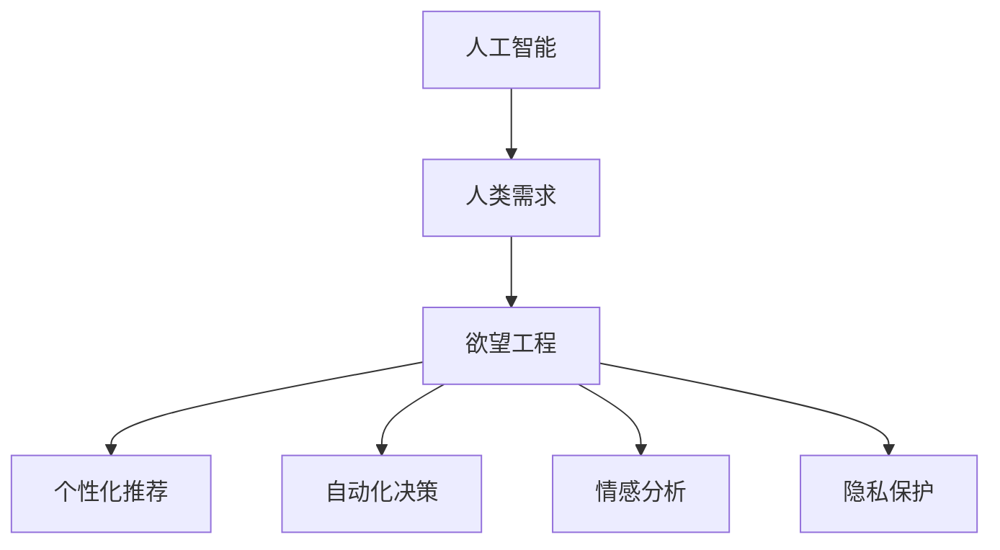

                 

## 1. 背景介绍

### 1.1 问题由来

在人工智能(AI)和自动化技术飞速发展的今天，人类对欲望的满足方式已经发生了翻天覆地的变化。从简单的查询信息到复杂的自动化决策，AI技术在方方面面影响着人类的需求满足。然而，这种变化也引发了一系列伦理、心理和社会问题。

### 1.2 问题核心关键点

AI技术如何满足人类欲望，已经在各行各业产生了深远影响。

- **需求理解与定制化**：AI能够精准分析用户需求，提供高度定制化的解决方案，如推荐系统、智能客服、健康管理系统等。
- **自动化决策**：AI可以辅助或完全代替人类进行决策，如自动驾驶、金融投资、医疗诊断等。
- **情感与行为干预**：AI不仅影响人类需求的满足方式，也通过推荐、广告等方式影响人类情感和行为，进而改变需求倾向。
- **隐私与伦理**：AI在满足人类需求的同时，也引发了隐私泄露、数据滥用等伦理问题。

### 1.3 问题研究意义

深入理解AI如何影响人类需求，对于构建更健康、可持续的科技生态具有重要意义：

- **提升用户体验**：通过精准满足用户需求，AI可以提供更高效、更便捷的解决方案，提升用户体验。
- **推动科技创新**：AI技术可以助力更多领域的技术创新，带来新的商业机会和社会价值。
- **规范AI行为**：理解AI对人类需求的深远影响，有助于制定相应的规范和政策，避免伦理风险。
- **促进跨学科研究**：AI与心理学、社会学等学科的交叉研究，有助于深入理解人类行为和需求，促进科技与人文的融合。

## 2. 核心概念与联系

### 2.1 核心概念概述

在探讨AI如何影响人类需求的过程中，需要理解以下核心概念：

- **人工智能(AI)**：旨在模拟人类智能的计算机系统，通过学习和推理实现复杂任务。
- **人类需求**：指个体或社会对物质、精神等方面的期望和追求。
- **欲望工程**：利用AI技术实现对人类需求的精准识别和满足，改变人类行为和决策的工程。
- **个性化推荐**：通过分析用户行为数据，推荐符合用户需求的产品或服务。
- **自动化决策**：利用AI进行数据分析和预测，辅助或代替人类进行决策。
- **情感分析**：通过分析文本、语音等数据，理解人类情感状态，指导行为干预。
- **隐私保护**：通过技术手段保障用户数据的安全和隐私。

这些概念之间的联系可以通过以下Mermaid流程图来展示：



这个流程图展示了AI技术如何从人类需求出发，通过各种方式影响和满足这些需求。

## 3. 核心算法原理 & 具体操作步骤

### 3.1 算法原理概述

AI通过收集和分析大量数据，学习人类的行为模式和需求倾向，从而提供定制化、个性化的解决方案。其核心算法包括但不限于：

- **机器学习算法**：如线性回归、决策树、神经网络等，用于数据建模和预测。
- **自然语言处理(NLP)**：用于分析和理解人类语言，如情感分析、文本分类等。
- **强化学习算法**：用于优化自动化决策，通过奖励机制指导AI进行智能决策。

### 3.2 算法步骤详解

1. **数据收集**：通过传感器、社交媒体、在线行为数据等渠道，收集用户行为和偏好数据。
2. **数据预处理**：清洗、去噪、归一化等处理步骤，保证数据质量。
3. **特征工程**：选择、构造和优化特征，提升模型的预测能力。
4. **模型训练**：选择合适的算法和参数，在数据集上进行训练，构建预测模型。
5. **模型评估**：使用测试集评估模型性能，调整模型参数，优化模型表现。
6. **部署应用**：将训练好的模型部署到实际应用中，提供实时预测和推荐服务。

### 3.3 算法优缺点

**优点**：

- **高效准确**：通过大量数据训练，AI可以提供高效、准确的个性化推荐和决策支持。
- **泛化能力强**：经过深度学习训练的模型，可以处理复杂的多维数据，具备较强的泛化能力。
- **实时响应**：通过在线机器学习技术，AI可以实时更新模型，提供最新的服务。

**缺点**：

- **数据隐私**：大量数据收集和分析可能导致隐私泄露风险。
- **算法偏见**：训练数据可能存在偏见，导致AI模型也具有同样的偏见。
- **计算资源需求高**：高质量的AI模型训练和运行需要大量计算资源。

### 3.4 算法应用领域

AI技术在多个领域应用广泛，以下是几个典型应用场景：

- **零售和电商**：通过个性化推荐，提升销售转化率和用户体验。
- **医疗健康**：利用AI进行疾病预测、健康管理、个性化医疗方案制定等。
- **金融服务**：通过自动化决策和情感分析，提升金融服务的质量和效率。
- **智能家居**：通过智能设备和AI系统，实现便捷、个性化的家居管理。
- **智能交通**：利用AI进行交通流量预测和自动化决策，优化交通管理。

## 4. 数学模型和公式 & 详细讲解 & 举例说明

### 4.1 数学模型构建

在AI模型构建中，常用的数学模型包括线性回归、决策树、神经网络等。

以线性回归模型为例，假设数据集为 $(x_i, y_i)$，其中 $x_i \in \mathbb{R}^d$，$y_i \in \mathbb{R}$。线性回归模型的目标是最小化误差平方和：

$$
\min_{\theta} \frac{1}{N}\sum_{i=1}^N (y_i - \theta^Tx_i)^2
$$

其中 $\theta$ 为模型参数，$N$ 为数据集大小。

### 4.2 公式推导过程

线性回归模型的推导过程如下：

1. 构建损失函数：
$$
\mathcal{L}(\theta) = \frac{1}{N}\sum_{i=1}^N (y_i - \theta^Tx_i)^2
$$

2. 计算梯度：
$$
\nabla_{\theta}\mathcal{L}(\theta) = \frac{2}{N}\sum_{i=1}^N (y_i - \theta^Tx_i)x_i
$$

3. 更新模型参数：
$$
\theta \leftarrow \theta - \eta \nabla_{\theta}\mathcal{L}(\theta)
$$

其中 $\eta$ 为学习率。

### 4.3 案例分析与讲解

假设有一个电商平台的个性化推荐系统，需要根据用户历史购买行为预测其未来购买倾向。通过线性回归模型，可以构建如下预测公式：

$$
y = \theta^T \phi(x)
$$

其中 $\phi(x)$ 为特征映射函数，$\theta$ 为模型参数。模型通过不断调整参数 $\theta$，最小化预测误差，从而提升推荐效果。

## 5. 项目实践：代码实例和详细解释说明

### 5.1 开发环境搭建

要进行AI项目开发，首先需要搭建开发环境。以下是使用Python进行TensorFlow开发的环境配置流程：

1. 安装Anaconda：从官网下载并安装Anaconda，用于创建独立的Python环境。

2. 创建并激活虚拟环境：
```bash
conda create -n tf-env python=3.8 
conda activate tf-env
```

3. 安装TensorFlow：根据CUDA版本，从官网获取对应的安装命令。例如：
```bash
conda install tensorflow -c tensorflow -c conda-forge
```

4. 安装NumPy、Pandas、scikit-learn、Matplotlib等常用工具包：
```bash
pip install numpy pandas scikit-learn matplotlib tqdm jupyter notebook ipython
```

完成上述步骤后，即可在`tf-env`环境中开始AI项目开发。

### 5.2 源代码详细实现

我们以电商个性化推荐系统为例，给出使用TensorFlow进行线性回归模型训练的Python代码实现。

首先，定义数据处理函数：

```python
import pandas as pd
import numpy as np

def load_data(file_path):
    data = pd.read_csv(file_path)
    X = data.iloc[:, :-1].values
    y = data.iloc[:, -1].values
    return X, y
```

然后，定义模型训练函数：

```python
import tensorflow as tf
from sklearn.model_selection import train_test_split
from sklearn.metrics import mean_squared_error

def train_model(X, y, learning_rate=0.01, epochs=1000):
    X_train, X_test, y_train, y_test = train_test_split(X, y, test_size=0.2, random_state=42)
    
    # 定义模型
    model = tf.keras.Sequential([
        tf.keras.layers.Dense(1, input_dim=X.shape[1])
    ])
    
    # 编译模型
    model.compile(loss='mean_squared_error', optimizer=tf.keras.optimizers.SGD(learning_rate))
    
    # 训练模型
    history = model.fit(X_train, y_train, epochs=epochs, batch_size=32, validation_data=(X_test, y_test))
    
    # 评估模型
    y_pred = model.predict(X_test)
    mse = mean_squared_error(y_test, y_pred)
    return model, mse
```

最后，启动模型训练流程并在测试集上评估：

```python
# 加载数据
X, y = load_data('data.csv')

# 训练模型
model, mse = train_model(X, y)

# 打印结果
print(f'Mean Squared Error: {mse:.4f}')
```

以上就是使用TensorFlow进行电商个性化推荐系统开发的完整代码实现。可以看到，TensorFlow提供了强大的工具和库，可以轻松实现复杂的机器学习模型。

### 5.3 代码解读与分析

让我们再详细解读一下关键代码的实现细节：

**load_data函数**：
- 使用Pandas加载数据，提取特征和标签。

**train_model函数**：
- 将数据集划分为训练集和测试集。
- 定义线性回归模型，包含一个全连接层。
- 使用均方误差损失函数和随机梯度下降优化器。
- 训练模型，并在测试集上评估均方误差。

**train函数**：
- 加载数据。
- 训练模型。
- 输出模型性能指标。

## 6. 实际应用场景

### 6.1 智能客服系统

基于AI的智能客服系统，可以显著提升客户服务效率和满意度。传统的客服系统依赖人工，响应时间长，服务质量难以保证。通过AI技术，智能客服系统可以实现24小时不间断服务，快速响应客户咨询，并提供个性化服务。

在技术实现上，可以收集企业内部的客服历史对话记录，训练一个基于AI的对话模型。该模型能够理解客户意图，提供最合适的解决方案，并在与客户的交互中不断学习，提高服务质量。

### 6.2 医疗健康管理

AI在医疗健康领域的应用非常广泛。通过AI技术，可以实现疾病预测、健康管理、个性化医疗方案制定等功能。例如，AI可以通过分析患者的医疗记录和健康数据，预测其患病的风险，提出预防和干预措施。同时，AI还可以根据患者的健康状况和偏好，提供个性化的饮食、运动和医疗建议，提升其生活质量。

### 6.3 智能交通系统

AI技术在智能交通系统中也有广泛应用。通过AI进行交通流量预测和自动化决策，可以优化交通管理，减少拥堵，提高交通效率。例如，AI可以通过实时数据分析，预测交通流量，调整信号灯和路线的设置，实现交通流畅。同时，AI还可以根据交通状况和天气信息，提供最优的出行路线和建议，提升驾驶体验。

### 6.4 未来应用展望

未来，AI技术将在更多领域得到应用，进一步改变人类生活的方方面面。

- **自动化决策**：AI将更加深入地渗透到各个领域，实现更高效的自动化决策，提升社会整体效率。
- **个性化服务**：AI技术将提供更加个性化的服务，满足不同用户的多样化需求。
- **跨领域融合**：AI技术与各个领域的技术进行深度融合，带来更多的创新应用和商业机会。

## 7. 工具和资源推荐

### 7.1 学习资源推荐

为了帮助开发者系统掌握AI技术，这里推荐一些优质的学习资源：

1. 《Python机器学习》系列博文：由机器学习专家撰写，深入浅出地介绍了Python机器学习的核心概念和实现方法。

2. TensorFlow官方文档：TensorFlow的官方文档，提供了完整的API文档和样例代码，是学习TensorFlow的必备资源。

3. Coursera的《机器学习》课程：斯坦福大学开设的机器学习课程，由Andrew Ng主讲，涵盖机器学习的各个方面。

4. Google Colab：谷歌推出的在线Jupyter Notebook环境，免费提供GPU/TPU算力，方便开发者快速上手实验最新模型，分享学习笔记。

5. Kaggle：数据科学和机器学习竞赛平台，提供了大量高质量的竞赛数据集和代码实现，帮助开发者提升实战能力。

通过对这些资源的学习实践，相信你一定能够快速掌握AI技术的精髓，并用于解决实际的工程问题。

### 7.2 开发工具推荐

高效的开发离不开优秀的工具支持。以下是几款用于AI项目开发的常用工具：

1. TensorFlow：由Google主导开发的深度学习框架，生产部署方便，适合大规模工程应用。

2. PyTorch：基于Python的开源深度学习框架，灵活性和易用性高，适合快速迭代研究。

3. scikit-learn：开源的Python机器学习库，提供简单易用的API，适合数据处理和模型构建。

4. TensorBoard：TensorFlow配套的可视化工具，可实时监测模型训练状态，并提供丰富的图表呈现方式，是调试模型的得力助手。

5. Weights & Biases：模型训练的实验跟踪工具，可以记录和可视化模型训练过程中的各项指标，方便对比和调优。

6. Jupyter Notebook：基于Web的交互式编程环境，支持Python、R等多种语言，适合数据科学和机器学习项目开发。

合理利用这些工具，可以显著提升AI项目开发的效率，加快创新迭代的步伐。

### 7.3 相关论文推荐

AI技术的发展源于学界的持续研究。以下是几篇奠基性的相关论文，推荐阅读：

1. Deep Learning（《深度学习》一书）：Ian Goodfellow等著，全面介绍了深度学习的基本概念和实现方法。

2. Convolutional Neural Networks for Images, Speech, and Video（卷积神经网络论文）：Yann LeCun等著，介绍了卷积神经网络在图像、语音和视频领域的广泛应用。

3. AlphaGo Zero：Mastering the Game of Go without Human Knowledge（AlphaGo Zero论文）：David Silver等著，展示了AI在复杂策略游戏中的突破性应用。

4. Natural Language Processing with Transformers（Transformer论文）：Ashish Vaswani等著，介绍了Transformer模型在自然语言处理领域的广泛应用。

这些论文代表了大AI技术的发展脉络。通过学习这些前沿成果，可以帮助研究者把握学科前进方向，激发更多的创新灵感。

## 8. 总结：未来发展趋势与挑战

### 8.1 总结

本文对AI技术如何影响人类需求进行了全面系统的介绍。首先阐述了AI技术在多个领域的应用和影响，明确了AI技术在满足人类需求方面的独特价值。其次，从原理到实践，详细讲解了AI模型的构建和训练过程，给出了AI项目开发的完整代码实例。同时，本文还广泛探讨了AI技术在智能客服、医疗健康、智能交通等多个行业领域的应用前景，展示了AI技术的巨大潜力。

通过本文的系统梳理，可以看到，AI技术在满足人类需求方面具有广阔的应用前景。AI技术的进步将极大地提升人类生活质量，但也带来了一系列挑战和问题。

### 8.2 未来发展趋势

展望未来，AI技术将在更多领域得到应用，进一步改变人类生活的方方面面。

- **自动化决策**：AI将更加深入地渗透到各个领域，实现更高效的自动化决策，提升社会整体效率。
- **个性化服务**：AI技术将提供更加个性化的服务，满足不同用户的多样化需求。
- **跨领域融合**：AI技术与各个领域的技术进行深度融合，带来更多的创新应用和商业机会。

### 8.3 面临的挑战

尽管AI技术已经取得了瞩目成就，但在迈向更加智能化、普适化应用的过程中，它仍面临诸多挑战：

- **数据隐私**：大量数据收集和分析可能导致隐私泄露风险。
- **算法偏见**：训练数据可能存在偏见，导致AI模型也具有同样的偏见。
- **计算资源需求高**：高质量的AI模型训练和运行需要大量计算资源。
- **可解释性不足**：AI模型通常是“黑盒”系统，难以解释其内部工作机制和决策逻辑。
- **安全性有待保障**：AI在满足人类需求的同时，也引发了隐私泄露、数据滥用等伦理问题。

### 8.4 研究展望

未来的AI研究需要在以下几个方面寻求新的突破：

- **探索无监督和半监督学习**：摆脱对大规模标注数据的依赖，利用自监督学习、主动学习等无监督和半监督范式，最大限度利用非结构化数据，实现更加灵活高效的AI训练。
- **开发更加高效和轻量级的AI模型**：开发更加参数高效和计算高效的AI模型，在固定大部分预训练参数的情况下，只更新极少量的任务相关参数。同时优化AI模型的计算图，减少前向传播和反向传播的资源消耗，实现更加轻量级、实时性的部署。
- **引入更多先验知识**：将符号化的先验知识，如知识图谱、逻辑规则等，与神经网络模型进行巧妙融合，引导AI训练过程学习更准确、合理的知识表示。
- **加强跨学科研究**：AI与心理学、社会学等学科的交叉研究，有助于深入理解人类行为和需求，促进科技与人文的融合。
- **纳入伦理道德约束**：在AI训练目标中引入伦理导向的评估指标，过滤和惩罚有偏见、有害的输出倾向。同时加强人工干预和审核，建立AI行为的监管机制，确保输出符合人类价值观和伦理道德。

这些研究方向的探索，必将引领AI技术迈向更高的台阶，为构建安全、可靠、可解释、可控的智能系统铺平道路。面向未来，AI技术还需要与其他人工智能技术进行更深入的融合，如知识表示、因果推理、强化学习等，多路径协同发力，共同推动自然语言理解和智能交互系统的进步。只有勇于创新、敢于突破，才能不断拓展AI技术的边界，让智能技术更好地造福人类社会。

## 9. 附录：常见问题与解答

**Q1：AI技术如何提升人类生活质量？**

A: AI技术通过精准理解人类需求，提供个性化、高效的解决方案，极大地提升了人类生活质量。例如，个性化推荐系统可以提升电商、媒体等行业的用户体验；智能客服系统可以提供24小时不间断的服务，提升客户满意度；医疗AI可以辅助医生进行诊断和治疗，提升健康水平。

**Q2：AI技术是否会导致就业岗位减少？**

A: AI技术的进步确实会对某些低技能岗位产生冲击，但同时也创造了新的高技能岗位。例如，AI技术的应用需要大量的数据科学家、算法工程师、产品经理等人才，这些岗位的薪资和需求都在不断上升。因此，AI技术的推广需要政策制定者、企业和社会各界共同努力，实现技术进步与就业平衡。

**Q3：AI技术是否会导致数据隐私泄露？**

A: AI技术在数据收集和处理过程中，存在一定的隐私泄露风险。但通过数据脱敏、匿名化等技术手段，可以有效地保护用户隐私。同时，制定严格的数据保护法规，加强数据安全监管，也是防止隐私泄露的重要措施。

**Q4：AI技术是否会带来伦理问题？**

A: AI技术在应用过程中，确实存在伦理问题，如算法偏见、数据滥用等。为应对这些问题，需要在AI训练和部署过程中引入伦理导向的评估指标，加强人工干预和审核，确保AI系统的公平性和透明性。同时，制定相关的法律法规，规范AI技术的应用。

**Q5：AI技术是否会改变人类行为和决策？**

A: AI技术通过精准理解和分析人类行为，可以引导人类做出更合理的决策。例如，推荐系统可以根据用户偏好推荐产品，智能客服系统可以提供更高效的客户服务，这些都会改变人类的行为和决策方式。但同时也需要注意，过度依赖AI可能会导致人类失去自主性和创造性，因此需要合理使用AI技术，保持人类的主动性和多样性。

---

作者：禅与计算机程序设计艺术 / Zen and the Art of Computer Programming

