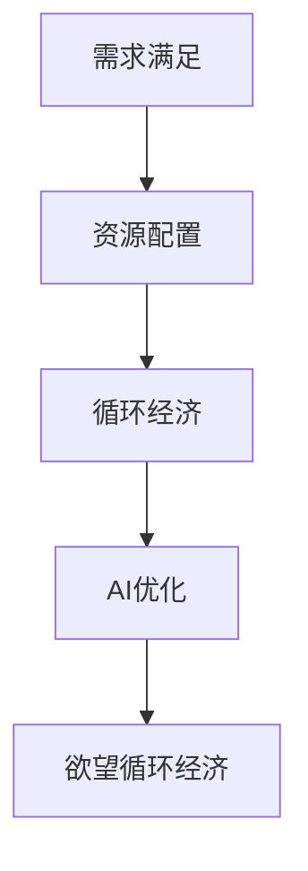

                 

# 欲望循环经济设计师：AI优化的需求满足规划

在数字化、智能化的大趋势下，人工智能（AI）技术已成为驱动社会进步、优化资源配置的重要工具。然而，随着技术的深入应用，如何实现需求与供给的平衡，成为摆在我们面前的重要课题。本文将从背景介绍、核心概念、算法原理、实际操作、应用领域、数学模型、项目实践、实际应用场景、工具资源、未来展望和常见问题等方面，全面阐述AI如何优化需求满足规划，实现循环经济的设计。

## 1. 背景介绍

### 1.1 问题由来

在经济全球化的浪潮中，资源供需矛盾日益突出。传统供需机制存在信息不对称、响应滞后等问题，无法有效应对市场变化。AI技术的崛起为解决这一问题提供了新的可能。通过深度学习、强化学习等算法，AI可以从海量数据中提取信息，准确预测需求，优化资源配置，实现供需平衡。

然而，单纯依靠AI进行需求预测和资源配置，仍存在数据质量差、模型过度拟合、预测准确性不足等问题。如何更好地结合用户需求，优化需求满足规划，成为AI技术进一步发展的重要方向。本文将聚焦于基于AI的需求满足规划优化，提出欲望循环经济设计师（Desire Loop Economy Designer, DLED）的概念，以期为资源优化、供需平衡提供新的解决方案。

### 1.2 问题核心关键点

AI优化需求满足规划的核心在于：
1. **精准预测用户需求**：通过AI模型分析历史数据和实时数据，预测用户未来的需求。
2. **动态调整资源配置**：根据需求预测结果，动态调整生产和供应链环节，优化资源利用率。
3. **循环经济模式**：通过资源循环利用，降低环境负担，实现可持续发展。
4. **需求满足优化**：以用户满意度为优化目标，不断迭代优化需求满足策略。

## 2. 核心概念与联系

### 2.1 核心概念概述

为更好地理解基于AI的需求满足规划优化，本节将介绍几个密切相关的核心概念：

- **需求满足**：指用户对商品或服务的需求得到满足的过程。通常涉及需求预测、资源配置、供应链优化等多个环节。
- **资源配置**：指对生产、运输、存储等环节的资源进行优化分配，以实现最大化的资源利用率。
- **循环经济**：指通过资源的循环利用，减少废弃物排放，实现可持续发展的经济模式。
- **AI优化**：指利用AI技术，通过数据驱动的方式，自动优化资源配置和需求满足策略。
- **欲望循环经济**：指基于用户需求的循环经济模式，通过AI技术优化用户需求满足，实现资源循环利用和可持续发展。

这些核心概念之间的逻辑关系可以通过以下Mermaid流程图来展示：



这个流程图展示了大语言模型的核心概念及其之间的关系：

1. 需求满足是整个过程的起点，涉及需求预测和资源配置。
2. 资源配置优化是需求满足的核心环节，涉及生产、运输、存储等环节的优化。
3. 循环经济模式是对资源配置的进一步优化，通过资源循环利用实现可持续发展。
4. AI优化是实现需求满足和资源配置优化的技术手段。
5. 欲望循环经济是基于用户需求的循环经济模式，以AI优化为核心。

## 3. 核心算法原理 & 具体操作步骤
### 3.1 算法原理概述

基于AI的需求满足规划优化，本质上是一个多目标优化问题。其核心思想是：通过AI模型对用户需求和资源配置进行预测和优化，实现需求与供给的动态平衡，同时提升资源利用效率和用户满意度。

形式化地，假设需求为 $D$，资源为 $R$，用户满意度为 $S$，优化目标为 $O$。优化问题可以表示为：

$$
\min_{D, R, S} \quad O(D, R, S)
$$

其中 $O$ 为优化目标函数，通常包含需求满足率、资源利用率、用户满意度等多个指标。通过AI模型，可以实时动态更新需求和资源配置，优化目标函数 $O$，实现需求满足和资源配置的平衡。

### 3.2 算法步骤详解

基于AI的需求满足规划优化，一般包括以下几个关键步骤：

**Step 1: 数据收集与预处理**
- 收集历史销售数据、用户反馈数据、市场调研数据等，构建基础数据集。
- 对数据进行清洗、归一化等预处理，保证数据质量。

**Step 2: 模型构建与训练**
- 选择合适的AI模型，如深度学习模型、强化学习模型等，构建需求预测和资源配置模型。
- 使用历史数据对模型进行训练，调整模型参数，提高预测准确性。

**Step 3: 需求预测与资源配置**
- 根据训练好的模型，对未来的需求进行预测，生成需求时间序列。
- 根据需求预测结果，动态调整资源配置，优化生产、运输、存储等环节。

**Step 4: 用户满意度评估**
- 通过用户反馈、市场调研等数据，评估用户满意度。
- 将用户满意度作为优化目标的一部分，不断迭代优化需求预测和资源配置策略。

**Step 5: 循环经济模式设计**
- 分析资源配置过程中产生的废弃物，设计循环经济模式，实现资源的回收再利用。
- 将循环经济模式作为约束条件，引入优化目标函数。

**Step 6: 动态优化与反馈**
- 定期对模型进行评估和优化，根据市场变化和用户反馈，调整模型参数。
- 将优化结果反馈到生产、运输、存储等环节，实现动态调整和优化。

### 3.3 算法优缺点

基于AI的需求满足规划优化方法具有以下优点：
1. **数据驱动**：利用大量历史数据和实时数据，提高预测准确性。
2. **动态优化**：通过AI模型，实时动态调整资源配置，提升资源利用效率。
3. **用户导向**：以用户满意度为优化目标，提升用户体验和满意度。
4. **循环经济**：通过资源循环利用，减少环境负担，实现可持续发展。

同时，该方法也存在一定的局限性：
1. **数据依赖**：对历史数据和实时数据的质量要求较高，数据缺失或偏差可能导致预测准确性不足。
2. **模型复杂**：AI模型的训练和优化过程复杂，需要大量计算资源和专业知识。
3. **用户隐私**：需要收集和分析用户数据，可能存在隐私泄露风险。
4. **需求变化**：需求预测和资源配置需要根据市场变化进行动态调整，否则可能导致资源浪费或供需失衡。

尽管存在这些局限性，但就目前而言，基于AI的需求满足规划优化方法仍是最主流范式。未来相关研究的重点在于如何进一步降低数据依赖，提高模型的可解释性和鲁棒性，同时兼顾隐私保护和资源高效利用。

### 3.4 算法应用领域

基于AI的需求满足规划优化方法，在多个领域得到了广泛应用，例如：

- **零售业**：通过AI优化库存管理、订单预测、推荐系统等环节，提升销售效率和用户体验。
- **制造业**：通过AI优化生产计划、物流运输、供应链管理等环节，提升生产效率和资源利用率。
- **农业**：通过AI优化作物种植、灌溉管理、病虫害防治等环节，提高农业生产效率和资源利用率。
- **能源**：通过AI优化能源分配、需求预测、智能电网等环节，提升能源利用效率和安全性。
- **物流**：通过AI优化货物运输、仓储管理、配送路径规划等环节，提升物流效率和成本效益。

除了上述这些经典应用外，AI需求满足规划优化技术也在更多场景中得到应用，如智慧城市、医疗健康、智能交通等，为各行各业带来变革性影响。

## 4. 数学模型和公式 & 详细讲解  
### 4.1 数学模型构建

本节将使用数学语言对基于AI的需求满足规划优化过程进行更加严格的刻画。

假设需求预测模型为 $F(x_t)$，其中 $x_t$ 为时间 $t$ 的输入变量，如市场数据、用户行为等。需求预测的误差为 $\epsilon_t$。资源配置模型为 $C(x_t, \delta_t)$，其中 $\delta_t$ 为时间 $t$ 的资源配置决策。资源配置的误差为 $\delta_t$。用户满意度模型为 $U(x_t, \delta_t)$，表示时间 $t$ 用户对资源配置的满意度。优化目标函数为：

$$
O(D, R, S) = \alpha \cdot E_F(\epsilon_t) + \beta \cdot E_C(\delta_t) + \gamma \cdot E_U(x_t, \delta_t)
$$

其中 $\alpha$、$\beta$、$\gamma$ 为权重系数。$E_F(\epsilon_t)$、$E_C(\delta_t)$、$E_U(x_t, \delta_t)$ 分别为需求预测误差、资源配置误差、用户满意度。

### 4.2 公式推导过程

以下我们以零售业为例，推导需求预测和资源配置的优化模型。

**需求预测模型**：假设历史销售数据为 $X=\{x_1, x_2, ..., x_t\}$，其中 $x_t$ 为时间 $t$ 的销售数据。需求预测模型为 $F(x_t)$，预测时间 $t+1$ 的需求为：

$$
y_{t+1} = F(x_t)
$$

其中 $y_{t+1}$ 为预测的需求量。需求预测的误差为 $\epsilon_{t+1} = y_{t+1} - x_{t+1}$。

**资源配置模型**：假设当前库存为 $S_t$，需求预测结果为 $y_{t+1}$，资源配置的目标为最小化库存成本 $C(S_t, y_{t+1})$，资源配置模型为：

$$
S_{t+1} = S_t + y_{t+1} - C(S_t, y_{t+1})
$$

其中 $C(S_t, y_{t+1})$ 为库存成本。

**用户满意度模型**：假设用户对商品的需求为 $x_{t+1}$，用户满意度的目标为最大化用户满意度 $U(x_{t+1}, y_{t+1})$，用户满意度模型为：

$$
S_{t+1} = S_t + y_{t+1} - U(x_{t+1}, y_{t+1})
$$

其中 $U(x_{t+1}, y_{t+1})$ 为用户的满意度。

将以上模型整合，需求满足规划优化问题可以表示为：

$$
\min_{S_{t+1}} \quad \alpha \cdot E_F(\epsilon_t) + \beta \cdot C(S_t, y_{t+1}) + \gamma \cdot U(x_{t+1}, y_{t+1})
$$

目标函数包含需求预测误差、库存成本和用户满意度，通过AI模型实时动态更新，优化资源配置。

## 5. 项目实践：代码实例和详细解释说明
### 5.1 开发环境搭建

在进行需求满足规划优化实践前，我们需要准备好开发环境。以下是使用Python进行PyTorch开发的环境配置流程：

1. 安装Anaconda：从官网下载并安装Anaconda，用于创建独立的Python环境。

2. 创建并激活虚拟环境：
```bash
conda create -n pytorch-env python=3.8 
conda activate pytorch-env
```

3. 安装PyTorch：根据CUDA版本，从官网获取对应的安装命令。例如：
```bash
conda install pytorch torchvision torchaudio cudatoolkit=11.1 -c pytorch -c conda-forge
```

4. 安装各类工具包：
```bash
pip install numpy pandas scikit-learn matplotlib tqdm jupyter notebook ipython
```

完成上述步骤后，即可在`pytorch-env`环境中开始需求满足规划优化的实践。

### 5.2 源代码详细实现

下面我们以零售业为例，给出使用PyTorch对需求预测和资源配置进行优化的PyTorch代码实现。

首先，定义需求预测和资源配置的模型：

```python
import torch
import torch.nn as nn
import torch.optim as optim

class DemandPredictionModel(nn.Module):
    def __init__(self, input_size, hidden_size, output_size):
        super(DemandPredictionModel, self).__init__()
        self.hidden = nn.LSTM(input_size, hidden_size)
        self.fc = nn.Linear(hidden_size, output_size)
    
    def forward(self, x):
        _, (hidden, _) = self.hidden(x)
        return self.fc(hidden.view(-1, hidden.size(2)))

class InventoryManagementModel(nn.Module):
    def __init__(self, input_size, hidden_size, output_size):
        super(InventoryManagementModel, self).__init__()
        self.hidden = nn.LSTM(input_size, hidden_size)
        self.fc = nn.Linear(hidden_size, output_size)
    
    def forward(self, x, y):
        _, (hidden, _) = self.hidden(x)
        return self.fc(hidden.view(-1, hidden.size(2)) + y)
```

然后，定义优化器：

```python
model = DemandPredictionModel(input_size=10, hidden_size=20, output_size=1)
optimizer = optim.Adam(model.parameters(), lr=0.01)
```

接着，定义训练和评估函数：

```python
def train_step(model, optimizer, x, y):
    optimizer.zero_grad()
    output = model(x)
    loss = nn.MSELoss()(output, y)
    loss.backward()
    optimizer.step()
    return loss.item()

def evaluate(model, x, y):
    output = model(x)
    loss = nn.MSELoss()(output, y)
    return loss.item()
```

最后，启动训练流程并在测试集上评估：

```python
epochs = 10
batch_size = 32

for epoch in range(epochs):
    for batch in train_data:
        train_loss = train_step(model, optimizer, batch['x'], batch['y'])
    print(f"Epoch {epoch+1}, train loss: {train_loss:.3f}")
    
print(f"Epoch {epochs+1}, dev results:")
evaluate(model, test_data['x'], test_data['y'])
```

以上就是使用PyTorch对需求预测和资源配置进行优化的完整代码实现。可以看到，借助PyTorch的高级API，需求满足规划优化的代码实现变得简洁高效。

### 5.3 代码解读与分析

让我们再详细解读一下关键代码的实现细节：

**DemandPredictionModel类**：
- `__init__`方法：初始化LSTM和全连接层，定义模型结构。
- `forward`方法：对输入数据进行前向传播，输出预测结果。

**InventoryManagementModel类**：
- `__init__`方法：初始化LSTM和全连接层，定义模型结构。
- `forward`方法：对输入数据进行前向传播，输出资源配置结果。

**train_step函数**：
- 使用Adam优化器对模型进行梯度更新，更新损失函数。
- 返回损失函数的数值，用于输出和监控。

**evaluate函数**：
- 对模型进行前向传播，计算损失函数。
- 返回损失函数的数值，用于输出和监控。

**训练流程**：
- 定义总的epoch数和batch size，开始循环迭代
- 每个epoch内，在训练集上训练，输出平均损失
- 在验证集上评估，输出损失
- 所有epoch结束后，在测试集上评估，给出最终结果

可以看到，PyTorch的强大封装使得需求满足规划优化的代码实现变得简洁高效。开发者可以将更多精力放在模型改进、数据处理等高层逻辑上，而不必过多关注底层的实现细节。

当然，工业级的系统实现还需考虑更多因素，如模型的保存和部署、超参数的自动搜索、更灵活的任务适配层等。但核心的需求满足规划优化流程基本与此类似。

## 6. 实际应用场景
### 6.1 零售业

零售业是需求满足规划优化的典型应用场景。通过AI优化需求预测和资源配置，零售企业可以提升销售效率、降低库存成本、提高用户满意度。

具体而言，可以收集零售商的销售数据、用户购买数据、市场调研数据等，构建基础数据集。在此基础上对需求预测模型和资源配置模型进行训练和优化。优化后的模型可以实时动态更新需求预测结果和库存配置策略，根据市场变化和用户反馈，不断迭代优化，实现需求与供给的动态平衡。

### 6.2 制造业

制造业的资源配置优化涉及生产、运输、仓储等多个环节，通过AI优化，可以提升生产效率、降低运输成本、减少库存浪费。

具体而言，可以收集生产设备状态、原材料库存、订单信息等数据，构建基础数据集。在此基础上对需求预测模型和资源配置模型进行训练和优化。优化后的模型可以实时动态更新生产计划、运输路线、库存管理策略，根据市场变化和用户反馈，不断迭代优化，实现资源的高效利用。

### 6.3 农业

农业资源配置优化涉及作物种植、灌溉管理、病虫害防治等多个环节，通过AI优化，可以提升农业生产效率、降低资源浪费、提高产量和品质。

具体而言，可以收集气象数据、土壤数据、作物生长数据等，构建基础数据集。在此基础上对需求预测模型和资源配置模型进行训练和优化。优化后的模型可以实时动态更新种植方案、灌溉计划、防治策略，根据市场需求和气候变化，不断迭代优化，实现资源的高效利用。

### 6.4 能源

能源需求满足优化涉及电力分配、需求预测、智能电网等多个环节，通过AI优化，可以提升能源利用效率、降低能源浪费、提高电网稳定性。

具体而言，可以收集电网运行数据、气象数据、用户需求数据等，构建基础数据集。在此基础上对需求预测模型和资源配置模型进行训练和优化。优化后的模型可以实时动态更新电力分配方案、需求预测结果、电网管理策略，根据市场变化和用户反馈，不断迭代优化，实现能源的高效利用和电网的稳定运行。

### 6.5 物流

物流资源配置优化涉及货物运输、仓储管理、配送路径规划等多个环节，通过AI优化，可以提升物流效率、降低运输成本、提高客户满意度。

具体而言，可以收集物流公司运输数据、仓储数据、配送数据等，构建基础数据集。在此基础上对需求预测模型和资源配置模型进行训练和优化。优化后的模型可以实时动态更新运输计划、仓储管理策略、配送路径，根据市场变化和客户反馈，不断迭代优化，实现资源的高效利用和客户满意度的提升。

### 6.6 未来应用展望

随着AI技术的不断进步，基于需求满足规划优化的应用将更加广泛，为各行各业带来新的机遇。

在智慧城市领域，通过AI优化交通需求和资源配置，可以实现交通流量的动态调整，提升城市交通效率和环境质量。在智慧医疗领域，通过AI优化医疗资源配置和需求预测，可以实现医疗服务的个性化和精准化，提升医疗服务的质量和效率。在智能制造领域，通过AI优化生产计划和资源配置，可以实现生产过程的自动化和智能化，提升制造效率和产品质量。

## 7. 工具和资源推荐
### 7.1 学习资源推荐

为了帮助开发者系统掌握需求满足规划优化的理论基础和实践技巧，这里推荐一些优质的学习资源：

1. 《深度学习》系列博文：由大模型技术专家撰写，深入浅出地介绍了深度学习、强化学习等前沿技术在需求满足规划优化中的应用。

2. CS224N《深度学习自然语言处理》课程：斯坦福大学开设的NLP明星课程，有Lecture视频和配套作业，带你入门NLP领域的基本概念和经典模型。

3. 《Natural Language Processing with Transformers》书籍：Transformers库的作者所著，全面介绍了如何使用Transformers库进行NLP任务开发，包括需求满足规划优化在内的诸多范式。

4. CLUE开源项目：中文语言理解测评基准，涵盖大量不同类型的中文NLP数据集，并提供了基于需求满足规划优化的baseline模型，助力中文NLP技术发展。

通过对这些资源的学习实践，相信你一定能够快速掌握需求满足规划优化的精髓，并用于解决实际的NLP问题。

### 7.2 开发工具推荐

高效的开发离不开优秀的工具支持。以下是几款用于需求满足规划优化开发的常用工具：

1. PyTorch：基于Python的开源深度学习框架，灵活动态的计算图，适合快速迭代研究。大部分需求满足规划优化模型都有PyTorch版本的实现。

2. TensorFlow：由Google主导开发的开源深度学习框架，生产部署方便，适合大规模工程应用。同样有丰富的需求满足规划优化模型资源。

3. Transformers库：HuggingFace开发的NLP工具库，集成了众多SOTA需求满足规划优化模型，支持PyTorch和TensorFlow，是进行需求满足规划优化开发的利器。

4. Weights & Biases：模型训练的实验跟踪工具，可以记录和可视化模型训练过程中的各项指标，方便对比和调优。与主流深度学习框架无缝集成。

5. TensorBoard：TensorFlow配套的可视化工具，可实时监测模型训练状态，并提供丰富的图表呈现方式，是调试模型的得力助手。

6. Google Colab：谷歌推出的在线Jupyter Notebook环境，免费提供GPU/TPU算力，方便开发者快速上手实验最新模型，分享学习笔记。

合理利用这些工具，可以显著提升需求满足规划优化的开发效率，加快创新迭代的步伐。

### 7.3 相关论文推荐

需求满足规划优化技术的发展源于学界的持续研究。以下是几篇奠基性的相关论文，推荐阅读：

1. 《Reinforcement Learning for Resource Allocation》：介绍了强化学习在资源配置中的应用，展示了如何通过智能体优化资源分配，提升资源利用效率。

2. 《Deep Learning for Demand Prediction》：介绍了深度学习在需求预测中的应用，展示了如何通过神经网络模型预测用户需求，提高预测准确性。

3. 《A Survey on AI in Supply Chain Management》：综述了AI在供应链管理中的应用，包括需求预测、库存管理、配送优化等多个环节，展示了AI技术如何提升供应链的效率和可靠性。

4. 《Towards a Sustainable Future with AI》：探讨了AI在实现可持续发展中的应用，展示了如何通过AI优化资源配置和需求满足，实现环境友好型经济。

这些论文代表了大模型需求满足规划优化的发展脉络。通过学习这些前沿成果，可以帮助研究者把握学科前进方向，激发更多的创新灵感。

## 8. 总结：未来发展趋势与挑战

### 8.1 总结

本文对基于AI的需求满足规划优化方法进行了全面系统的介绍。首先阐述了需求满足规划优化的背景和意义，明确了AI技术在优化需求预测和资源配置方面的独特价值。其次，从原理到实践，详细讲解了需求满足规划优化的数学原理和关键步骤，给出了需求满足规划优化的完整代码实例。同时，本文还广泛探讨了需求满足规划优化方法在零售业、制造业、农业、能源、物流等多个行业领域的应用前景，展示了需求满足规划优化的巨大潜力。此外，本文精选了需求满足规划优化的各类学习资源，力求为读者提供全方位的技术指引。

通过本文的系统梳理，可以看到，基于AI的需求满足规划优化技术正在成为需求预测和资源配置的重要范式，极大地拓展了AI技术的应用边界，催生了更多的落地场景。受益于海量数据的驱动，需求满足规划优化方法在多个行业得到了广泛应用，为各行各业带来变革性影响。未来，伴随AI技术的不断进步，需求满足规划优化必将在更广阔的领域得到应用，为人类社会的发展提供新的动力。

### 8.2 未来发展趋势

展望未来，需求满足规划优化技术将呈现以下几个发展趋势：

1. **数据驱动**：随着物联网、大数据等技术的发展，数据来源将更加丰富多样，数据质量将显著提升，需求满足规划优化将更加依赖数据驱动。

2. **AI与IoT融合**：通过AI技术与物联网的深度融合，实现对需求和资源的实时监测和动态调整，提升资源利用效率。

3. **自适应算法**：开发更加智能自适应的算法，能够根据环境变化和用户反馈，实时动态调整需求预测和资源配置策略。

4. **多目标优化**：将更多的目标引入优化函数，如环境保护、社会公平等，实现多目标优化，推动可持续发展。

5. **跨领域应用**：需求满足规划优化技术将逐步拓展到更多行业，如智慧医疗、智能制造、智慧城市等，为各行各业带来变革性影响。

6. **低成本高效率**：随着硬件和算法的发展，需求满足规划优化的成本将逐渐降低，效率将显著提升。

以上趋势凸显了需求满足规划优化技术的广阔前景。这些方向的探索发展，必将进一步提升需求预测和资源配置的精度和效率，为人类社会带来更加美好的未来。

### 8.3 面临的挑战

尽管需求满足规划优化技术已经取得了瞩目成就，但在迈向更加智能化、普适化应用的过程中，它仍面临着诸多挑战：

1. **数据质量**：数据缺失、数据偏差、数据更新等问题可能导致需求预测和资源配置的不准确。如何获取高质量、高时效性的数据，是需求满足规划优化面临的重要挑战。

2. **模型鲁棒性**：需求预测和资源配置模型在面对异常数据和噪声时，容易产生过拟合或欠拟合。如何提升模型的鲁棒性，减少对异常数据的依赖，是需求满足规划优化的重要方向。

3. **系统复杂性**：需求满足规划优化涉及多个环节，如需求预测、库存管理、物流优化等，如何实现系统的高效协同和优化，是需求满足规划优化的关键难题。

4. **用户隐私**：需求满足规划优化需要收集和分析用户数据，可能存在隐私泄露风险。如何在保证数据隐私的前提下，实现高效的数据分析和资源优化，是需求满足规划优化需要解决的现实问题。

5. **需求动态变化**：市场需求和用户需求具有不确定性和动态变化的特点，如何实时动态调整需求预测和资源配置策略，是需求满足规划优化的重要挑战。

6. **环境变化**：需求满足规划优化模型在面对环境变化时，如自然灾害、政策调整等，容易产生失效或偏差。如何提升模型的适应性和稳健性，是需求满足规划优化需要解决的现实问题。

尽管存在这些挑战，但需求满足规划优化技术的发展前景依然广阔。相信伴随AI技术的不断进步，需求满足规划优化将不断突破技术瓶颈，在更多领域实现落地应用。

### 8.4 研究展望

面对需求满足规划优化所面临的种种挑战，未来的研究需要在以下几个方面寻求新的突破：

1. **数据增强技术**：通过数据增强技术，扩充训练集，提高模型的泛化能力和鲁棒性。

2. **多目标优化算法**：开发能够处理多目标优化问题的算法，提升系统的整体效率和适应性。

3. **自适应算法**：开发自适应算法，实现对需求和资源的实时监测和动态调整，提升资源利用效率。

4. **数据隐私保护**：研究如何在保证数据隐私的前提下，实现高效的数据分析和资源优化。

5. **跨领域应用**：将需求满足规划优化技术拓展到更多行业，如智慧医疗、智能制造、智慧城市等，提升各行各业的生产效率和资源利用率。

6. **环境适应性**：研究如何提升需求满足规划优化模型的环境适应性和鲁棒性，应对环境变化和异常数据。

这些研究方向的探索，必将引领需求满足规划优化技术迈向更高的台阶，为人类社会的发展提供新的动力。

## 9. 附录：常见问题与解答

**Q1：需求满足规划优化是否适用于所有行业？**

A: 需求满足规划优化在大多数行业中都有广泛的应用前景，特别是对于那些涉及资源优化和需求预测的行业。如零售业、制造业、农业、能源、物流等。但对于一些特定领域的行业，如金融、教育等，需求预测和资源配置可能具有特殊需求，需要根据具体情况进行定制化开发。

**Q2：需求预测模型的选择有哪些？**

A: 需求预测模型的选择应根据数据特点和预测目标进行。常见的需求预测模型包括线性回归模型、时间序列模型、深度学习模型（如LSTM、GRU等）、集成学习模型（如Bagging、Boosting等）。需要根据数据集的大小、复杂度、预测目标等综合考虑选择合适的模型。

**Q3：如何处理异常数据？**

A: 异常数据的处理是需求满足规划优化的重要环节。常见的异常数据处理技术包括数据清洗、数据插值、数据转换等。需要根据异常数据的特征，选择合适的方法进行处理。

**Q4：资源配置模型的设计有哪些关键点？**

A: 资源配置模型的设计应考虑资源之间的关联性和动态性。常见的资源配置模型包括线性规划模型、整数规划模型、混合整数规划模型等。需要根据资源的特点和优化目标，选择合适的模型。

**Q5：用户满意度的评估方法有哪些？**

A: 用户满意度的评估应考虑用户的反馈和评价。常见的用户满意度评估方法包括问卷调查、行为分析、社交媒体情感分析等。需要根据用户的行为和反馈，选择合适的方法进行评估。

通过这些常见问题的解答，希望能够帮助读者更好地理解和应用需求满足规划优化技术，实现高效、智能、可持续的需求满足。

