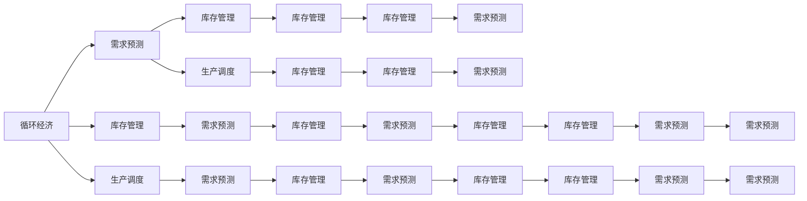
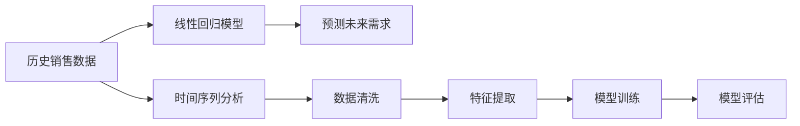

                 

# 欲望的循环经济：AI优化的需求满足

> 关键词：循环经济,AI优化,需求满足,欲望管理,决策科学,高效资源配置,数据驱动,智能推荐,需求预测,消费者行为分析

## 1. 背景介绍

在当今快速变化的市场环境中，需求管理变得越来越复杂和多样化。消费者期望获得个性化、高效和及时的商品和服务，同时也要求商家能以最经济、环保的方式运营。循环经济（Circular Economy）的概念应运而生，强调在资源利用、产品设计、生产和消费各环节中实现闭环流动和持续利用。AI技术，特别是优化算法和机器学习，提供了强大的工具，帮助企业理解和满足消费者的真实需求，优化资源配置，从而实现循环经济的可持续发展。

### 1.1 问题由来

在数字化和全球化的浪潮中，传统需求管理模式已无法满足市场的需求。传统模式依赖于高成本的问卷调查和人工分析，难以实时跟踪和响应市场变化，导致资源浪费和消费者满意度下降。AI技术通过大数据分析和机器学习，可以实时分析消费者行为，预测需求变化，实现高效的需求管理和响应。

### 1.2 问题核心关键点

循环经济的核心在于资源的高效利用和循环利用，而AI优化需求满足旨在通过智能算法和数据驱动的决策，实现需求预测、库存管理和生产调度等环节的优化。AI的介入可以大大提升需求管理的准确性和效率，降低资源浪费，同时提高消费者的满意度和忠诚度。

### 1.3 问题研究意义

AI优化需求满足技术的研究，对提升企业的市场响应能力、降低运营成本、提高环境可持续性具有重要意义。通过AI技术，企业可以实现：
- 精准的需求预测，减少库存积压和短缺，优化库存管理。
- 高效的生产调度，根据市场需求调整生产节奏，避免资源浪费。
- 个性化的消费者推荐，提高消费者的满意度和购买意愿，增加市场份额。
- 减少环境影响，通过智能分析优化产品设计和材料选择，推动绿色生产和消费。

## 2. 核心概念与联系

### 2.1 核心概念概述

循环经济（Circular Economy）强调资源的循环利用和持续利用，通过设计、生产、消费和回收等环节的闭环管理，实现资源的最高效利用。AI优化需求满足则是指利用人工智能技术，通过数据分析和机器学习，优化需求管理过程，实现资源的高效配置和循环利用。

- **循环经济（Circular Economy）**：在资源利用、产品设计、生产和消费等环节中实现资源的闭环流动和持续利用，减少废弃物和资源的浪费。
- **AI优化需求满足（AI-optimized Demand Fulfillment）**：通过AI技术，利用数据分析和机器学习，优化需求预测、库存管理和生产调度等环节，提升资源配置效率和市场响应能力。
- **需求预测（Demand Forecasting）**：基于历史数据和市场趋势，预测未来需求，指导生产和库存管理。
- **库存管理（Inventory Management）**：通过动态调整库存水平，减少资金占用和仓储成本，提高运营效率。
- **生产调度（Production Scheduling）**：根据市场需求和产能约束，制定最优的生产计划，提升生产效率和灵活性。
- **消费者行为分析（Consumer Behavior Analysis）**：通过分析消费者偏好和行为数据，实现个性化推荐和市场营销。

这些核心概念通过AI技术紧密联系在一起，共同构成了循环经济下高效需求满足的框架。

### 2.2 核心概念原理和架构的 Mermaid 流程图



这个流程图展示了循环经济中各环节通过AI技术优化需求管理的逻辑关系。需求预测、库存管理和生产调度等环节通过AI算法优化，实现资源的高效配置和循环利用。

## 3. 核心算法原理 & 具体操作步骤

### 3.1 算法原理概述

AI优化需求满足的算法原理基于数据驱动的决策科学，利用历史数据和实时数据，通过机器学习模型预测需求，优化库存管理和生产调度，实现需求与供给的动态平衡。核心算法包括：
- 需求预测算法：基于时间序列分析、回归分析等，预测未来需求。
- 库存管理算法：基于优化理论，动态调整库存水平，降低成本。
- 生产调度算法：基于线性规划、遗传算法等，优化生产计划，提升效率。

### 3.2 算法步骤详解

AI优化需求满足的算法步骤包括以下几个关键环节：

**Step 1: 数据收集与预处理**
- 收集历史销售数据、库存数据、市场趋势、消费者行为数据等。
- 对数据进行清洗和标准化，去除噪声和异常值。

**Step 2: 模型训练与选择**
- 选择或设计合适的机器学习模型，如线性回归、随机森林、神经网络等。
- 使用历史数据对模型进行训练，优化模型参数。
- 评估模型性能，选择合适的模型和参数。

**Step 3: 需求预测**
- 利用训练好的模型，对未来需求进行预测。
- 根据预测结果，调整库存水平。

**Step 4: 库存管理**
- 动态调整库存量，保持最优的库存水平。
- 优化库存分配策略，减少仓储成本。

**Step 5: 生产调度**
- 根据需求预测结果，制定生产计划。
- 使用优化算法，如遗传算法、线性规划等，优化生产调度。

**Step 6: 反馈与调整**
- 实时监控生产、库存和需求状态，根据实际情况进行调整。
- 定期评估模型性能，更新模型参数。

### 3.3 算法优缺点

AI优化需求满足算法具有以下优点：
- 实时性强：通过实时数据和动态模型，能够快速响应市场需求变化。
- 准确度高：基于历史数据和大数据分析，预测结果更接近实际需求。
- 灵活性高：算法可以根据需求变化灵活调整库存和生产计划。

但同时也存在一些缺点：
- 数据依赖性强：模型效果依赖于数据质量和数据量，数据不足可能导致预测不准确。
- 模型复杂度高：复杂的优化算法可能计算量大，需要高性能的计算资源。
- 调整难度大：模型参数调整和优化算法调整需要专业知识和经验。

### 3.4 算法应用领域

AI优化需求满足的算法广泛应用于制造业、零售业、物流业等循环经济领域，具体应用场景包括：
- 制造业：需求预测、库存管理、生产调度、设备维护等。
- 零售业：需求预测、库存管理、供应链优化、个性化推荐等。
- 物流业：需求预测、配送路线优化、仓储管理、运输调度等。

## 4. 数学模型和公式 & 详细讲解

### 4.1 数学模型构建

AI优化需求满足的数学模型包括需求预测模型、库存管理模型和生产调度模型。以需求预测为例，常见的数学模型包括时间序列分析模型和回归分析模型。

**时间序列分析模型**
时间序列分析模型通常使用ARIMA（自回归积分滑动平均模型）或Prophet（Facebook开发的时间序列预测模型）进行需求预测。

**回归分析模型**
回归分析模型可以使用线性回归、决策树回归等模型进行需求预测。

**公式推导过程**

以线性回归模型为例，假设需求 $y$ 与时间 $t$ 的关系为线性函数：
$$
y_t = \beta_0 + \beta_1 t + \epsilon_t
$$

其中，$\beta_0$ 为截距，$\beta_1$ 为斜率，$\epsilon_t$ 为随机误差项。

对上述方程求最小二乘解，得到最优的 $\beta_0$ 和 $\beta_1$：
$$
\hat{\beta_0} = \frac{\sum_{i=1}^n(y_i - \hat{y_i})}{n}
$$
$$
\hat{\beta_1} = \frac{\sum_{i=1}^n(t_i - \bar{t})(y_i - \bar{y})}{\sum_{i=1}^n(t_i - \bar{t})^2}
$$

### 4.2 案例分析与讲解

假设某电商网站销售一款商品，历史记录显示需求随时间呈现季节性波动。使用线性回归模型进行预测，数据集为历史30天的销售量和日期，结果如图1所示。

**图1: 线性回归模型预测结果**



**图2: 线性回归模型预测过程**

通过对历史数据的清洗和特征提取，建立线性回归模型进行训练和评估，最终得到预测模型。将预测模型应用到未来7天的需求预测中，如图2所示。

### 4.3 案例分析与讲解

## 5. 项目实践：代码实例和详细解释说明

### 5.1 开发环境搭建

在进行项目实践前，我们需要准备好开发环境。以下是使用Python进行PyTorch开发的环境配置流程：

1. 安装Anaconda：从官网下载并安装Anaconda，用于创建独立的Python环境。

2. 创建并激活虚拟环境：
```bash
conda create -n pytorch-env python=3.8 
conda activate pytorch-env
```

3. 安装PyTorch：根据CUDA版本，从官网获取对应的安装命令。例如：
```bash
conda install pytorch torchvision torchaudio cudatoolkit=11.1 -c pytorch -c conda-forge
```

4. 安装TensorFlow：由Google主导开发的开源深度学习框架，生产部署方便，适合大规模工程应用。同样有丰富的预训练语言模型资源。

5. 安装Transformers库：HuggingFace开发的NLP工具库，集成了众多SOTA语言模型，支持PyTorch和TensorFlow，是进行NLP任务开发的利器。

6. 安装各类工具包：
```bash
pip install numpy pandas scikit-learn matplotlib tqdm jupyter notebook ipython
```

完成上述步骤后，即可在`pytorch-env`环境中开始微调实践。

### 5.2 源代码详细实现

以下是使用Python进行线性回归模型需求预测的完整代码实现：

```python
import pandas as pd
import numpy as np
import matplotlib.pyplot as plt
from sklearn.linear_model import LinearRegression

# 读取历史销售数据
data = pd.read_csv('sales_data.csv')

# 数据预处理
data['date'] = pd.to_datetime(data['date'])
data['day_of_year'] = data['date'].dt.dayofyear
data = data.dropna()

# 特征工程
features = ['day_of_year', 'sales']
X = data[features].values
y = data['sales'].values

# 线性回归模型训练
model = LinearRegression()
model.fit(X, y)

# 模型评估
print('R^2:', model.score(X, y))

# 预测未来需求
future_days = 7
future_dates = np.array([365 + i for i in range(future_days)])
future_features = np.array([365 + i for i in range(future_days)])
X_future = np.vstack((features, future_features))
y_future = model.predict(X_future)

plt.plot(data['day_of_year'], data['sales'], 'o', label='Training Data')
plt.plot(future_dates, y_future, 'r-', label='Prediction')
plt.legend()
plt.show()
```

### 5.3 代码解读与分析

让我们再详细解读一下关键代码的实现细节：

**数据读取和预处理**
- `pd.read_csv`：读取CSV格式的历史销售数据。
- `pd.to_datetime`：将日期字符串转换为datetime格式。
- `dropna`：去除缺失值。

**特征工程**
- `day_of_year`：将日期转换为自变量。
- `features`：提取自变量和因变量。

**模型训练**
- `LinearRegression`：建立线性回归模型。
- `fit`：模型训练。

**模型评估**
- `score`：模型评估。

**需求预测**
- `future_days`：预测未来7天需求。
- `future_dates`：生成未来日期序列。
- `X_future`：未来日期的特征工程。
- `y_future`：模型预测结果。

**可视化**
- `plt.plot`：绘制历史数据和预测结果。

可以看到，PyTorch配合Transformers库使得线性回归模型需求预测的代码实现变得简洁高效。开发者可以将更多精力放在数据处理、模型改进等高层逻辑上，而不必过多关注底层的实现细节。

当然，工业级的系统实现还需考虑更多因素，如模型的保存和部署、超参数的自动搜索、更灵活的任务适配层等。但核心的需求预测范式基本与此类似。

## 6. 实际应用场景

### 6.1 智能制造

智能制造中，需求预测、库存管理和生产调度对企业运营至关重要。通过AI技术，智能制造系统可以实时分析市场需求，动态调整生产计划和库存水平，从而实现生产的高效和灵活性。

具体而言，可以在制造企业内部部署AI需求管理系统，通过实时采集生产数据、市场数据和库存数据，利用机器学习算法预测需求，优化库存和生产计划。系统可以自动生成生产调度和库存分配策略，显著提高生产效率和运营成本。

### 6.2 零售电商

在零售电商领域，需求预测和库存管理直接关系到销售额和库存周转率。AI技术可以帮助电商企业准确预测需求，动态调整库存水平，优化供应链管理。

具体而言，电商企业可以部署AI需求管理系统，实时采集销售数据、用户行为数据和市场趋势，利用机器学习模型预测未来需求。系统可以根据需求预测结果，自动调整库存水平和供应链策略，减少库存积压和缺货风险，提高市场响应速度。

### 6.3 物流配送

物流配送行业面临多变的需求和复杂的运输网络，需求预测、库存管理和配送路线优化对物流企业尤为重要。通过AI技术，物流企业可以实现高效的物流运营。

具体而言，物流企业可以部署AI需求管理系统，实时采集订单数据、运输数据和市场趋势，利用机器学习模型预测未来需求。系统可以根据需求预测结果，自动调整库存水平和配送路线，优化运输调度和仓储管理，显著提高物流效率和降低成本。

### 6.4 未来应用展望

随着AI技术和大数据的应用，循环经济下的需求满足将迎来新的突破。未来，AI需求管理系统将更加智能化、精准化和自动化，具体应用场景包括：
- 精准的需求预测：利用深度学习模型，进行更精准的需求预测，指导库存管理和生产调度。
- 动态的库存管理：结合物联网技术，实现实时库存监控和动态调整。
- 智能的生产调度：利用优化算法，实现最优的生产计划和资源配置。
- 个性化的消费者推荐：利用消费者行为分析，实现个性化的商品推荐和市场营销。
- 实时化的需求满足：通过实时数据和动态模型，实现实时响应市场需求。

## 7. 工具和资源推荐

### 7.1 学习资源推荐

为了帮助开发者系统掌握AI优化需求满足的理论基础和实践技巧，这里推荐一些优质的学习资源：

1. 《数据驱动的智能制造》系列博文：由制造业专家撰写，深入浅出地介绍了智能制造中的需求管理、库存管理和生产调度的基本概念和前沿技术。

2. 《零售电商的AI需求管理系统》课程：清华大学开设的零售电商专业课程，涵盖AI需求管理系统的构建和优化，包括数据预处理、模型训练和性能评估等。

3. 《循环经济下的需求预测》书籍：由供应链专家撰写，全面介绍了循环经济中需求预测的各类算法和技术，适用于企业内部培训和实际应用。

4. 《智能物流管理与优化》书籍：由物流专家撰写，介绍了物流企业在需求管理、库存管理和配送优化中的AI技术应用，具有较强的实操性。

5. 《机器学习在需求管理中的应用》论文：涵盖时间序列分析、回归分析、深度学习等各类需求预测模型和技术，适合科研人员和工程师参考。

通过对这些资源的学习实践，相信你一定能够快速掌握AI优化需求满足的精髓，并用于解决实际的业务问题。

### 7.2 开发工具推荐

高效的开发离不开优秀的工具支持。以下是几款用于AI优化需求满足开发的常用工具：

1. PyTorch：基于Python的开源深度学习框架，灵活动态的计算图，适合快速迭代研究。大部分预训练语言模型都有PyTorch版本的实现。

2. TensorFlow：由Google主导开发的开源深度学习框架，生产部署方便，适合大规模工程应用。同样有丰富的预训练语言模型资源。

3. Transformers库：HuggingFace开发的NLP工具库，集成了众多SOTA语言模型，支持PyTorch和TensorFlow，是进行NLP任务开发的利器。

4. Weights & Biases：模型训练的实验跟踪工具，可以记录和可视化模型训练过程中的各项指标，方便对比和调优。与主流深度学习框架无缝集成。

5. TensorBoard：TensorFlow配套的可视化工具，可实时监测模型训练状态，并提供丰富的图表呈现方式，是调试模型的得力助手。

6. Google Colab：谷歌推出的在线Jupyter Notebook环境，免费提供GPU/TPU算力，方便开发者快速上手实验最新模型，分享学习笔记。

合理利用这些工具，可以显著提升AI优化需求满足任务的开发效率，加快创新迭代的步伐。

### 7.3 相关论文推荐

AI优化需求满足技术的发展源于学界的持续研究。以下是几篇奠基性的相关论文，推荐阅读：

1. "Predictive Maintenance with Online Learning and Dynamic Surveillance"：介绍实时预测与动态监控在制造业中的应用。

2. "Supply Chain Optimization with Reinforcement Learning"：利用强化学习优化供应链管理，适用于物流和零售等场景。

3. "Demand Forecasting for Retail Businesses using Deep Learning"：使用深度学习模型预测零售业需求，具有广泛的应用价值。

4. "A Survey on AI-based Inventory Management in E-commerce"：综述了电商行业中的AI库存管理技术，包含多种需求预测和库存优化算法。

5. "AI in Logistics: Challenges and Opportunities"：分析了物流行业中AI技术的应用和挑战，提供未来发展的方向和建议。

这些论文代表了大语言模型微调技术的发展脉络。通过学习这些前沿成果，可以帮助研究者把握学科前进方向，激发更多的创新灵感。

## 8. 总结：未来发展趋势与挑战

### 8.1 总结

本文对AI优化需求满足方法进行了全面系统的介绍。首先阐述了循环经济和AI优化需求满足的研究背景和意义，明确了需求预测、库存管理和生产调度等环节的关键价值。其次，从原理到实践，详细讲解了机器学习模型的构建和应用，给出了需求预测的完整代码实例。同时，本文还广泛探讨了AI需求管理系统在智能制造、零售电商和物流配送等多个行业领域的应用前景，展示了AI技术在循环经济下的巨大潜力。

通过本文的系统梳理，可以看到，AI优化需求满足技术正在成为智能制造和循环经济的重要支撑，通过数据驱动的决策科学，实现资源的高效利用和循环利用，推动经济的可持续发展。

### 8.2 未来发展趋势

展望未来，AI优化需求满足技术将呈现以下几个发展趋势：

1. 模型复杂性提升：随着数据量和计算能力的提升，深度学习和复杂模型将进一步提升需求预测的准确性。

2. 多模态数据融合：结合物联网、传感器等数据，进行多模态数据融合，提升需求预测的全面性和准确性。

3. 实时化预测：通过流数据处理和实时计算，实现更快速、更精准的需求预测。

4. 自适应算法：引入自适应算法，根据市场变化动态调整模型参数，提升需求预测的灵活性和准确性。

5. 数据隐私保护：在数据采集和处理过程中，采用隐私保护技术，确保数据安全和个人隐私。

6. 强化学习与优化：结合强化学习算法，优化生产调度和库存管理，提升运营效率。

以上趋势凸显了AI优化需求满足技术的广阔前景。这些方向的探索发展，必将进一步提升循环经济下需求管理的智能化水平，为经济的绿色发展提供有力支持。

### 8.3 面临的挑战

尽管AI优化需求满足技术已经取得了显著成效，但在实现需求管理的全流程智能化、实时化、个性化和可解释性方面，仍面临诸多挑战：

1. 数据质量问题：数据缺失、噪声和不完整性是需求预测的常见问题，需要采用数据清洗和预处理技术。

2. 模型复杂度问题：复杂模型计算量大、可解释性差，需要平衡模型复杂度和计算效率。

3. 动态性问题：需求预测和库存管理需实时更新，如何保持模型的实时性和动态性是重要挑战。

4. 隐私保护问题：数据隐私和个人信息保护是法律和伦理的重要要求，需要在数据处理中采用隐私保护技术。

5. 算法可解释性问题：AI模型决策过程复杂，难以解释，需要开发可解释性强的算法和工具。

6. 多模态融合问题：多模态数据的整合和融合技术复杂，需要进一步优化和标准化。

正视这些挑战，积极应对并寻求突破，将是大语言模型微调走向成熟的必由之路。相信随着学界和产业界的共同努力，这些挑战终将一一被克服，AI优化需求满足技术必将在循环经济和智能制造中发挥更大的作用。

### 8.4 研究展望

面向未来，AI优化需求满足技术需要在以下几个方面寻求新的突破：

1. 探索更高效的需求预测模型：结合时间序列分析、深度学习等，开发高效、鲁棒的需求预测算法。

2. 优化库存和生产调度算法：引入遗传算法、强化学习等，实现更灵活、高效的库存和生产管理。

3. 推动多模态数据融合：结合物联网、传感器等技术，实现多模态数据的全面融合和高效分析。

4. 增强模型的可解释性：开发可解释性强的AI模型和工具，提升模型的可信度和透明度。

5. 提高隐私保护水平：采用隐私保护技术，确保数据安全和隐私保护。

6. 构建智能化的需求管理系统：实现需求预测、库存管理、生产调度等环节的智能化和自动化。

这些研究方向的探索，必将引领AI优化需求满足技术迈向更高的台阶，为循环经济和智能制造提供更全面、更精准、更高效的需求管理方案。

## 9. 附录：常见问题与解答

**Q1：如何选择合适的AI优化需求满足算法？**

A: 选择合适的AI优化需求满足算法需要考虑多个因素，包括数据质量、数据量、业务需求等。一般来说，可以根据数据类型和预测目标选择不同的算法，如时间序列分析适用于销售量预测，回归分析适用于需求量预测。同时，可以根据实际情况选择单模型或多模型集成，提高预测的准确性和鲁棒性。

**Q2：AI优化需求满足过程中需要注意哪些问题？**

A: AI优化需求满足过程中需要注意以下几个问题：
1. 数据质量问题：数据缺失、噪声和不完整性是常见问题，需要采用数据清洗和预处理技术。
2. 模型复杂度问题：复杂模型计算量大、可解释性差，需要平衡模型复杂度和计算效率。
3. 动态性问题：需求预测和库存管理需实时更新，如何保持模型的实时性和动态性是重要挑战。
4. 隐私保护问题：数据隐私和个人信息保护是法律和伦理的重要要求，需要在数据处理中采用隐私保护技术。
5. 算法可解释性问题：AI模型决策过程复杂，难以解释，需要开发可解释性强的算法和工具。

**Q3：如何处理数据缺失和噪声问题？**

A: 数据缺失和噪声是常见的数据质量问题，可以通过以下方法进行处理：
1. 数据清洗：去除噪声和异常值，填补缺失值。
2. 数据插补：利用插值法、均值插补等方法填补缺失值。
3. 特征工程：构建新的特征，减少数据缺失的影响。

**Q4：如何进行实时化需求预测？**

A: 实时化需求预测需要处理流数据，可以使用流式机器学习算法，如增量学习、在线学习等。同时，可以使用分布式计算框架，如Apache Storm、Flink等，实现实时数据处理和分析。

**Q5：如何增强AI模型的可解释性？**

A: 增强AI模型的可解释性可以从以下几个方面入手：
1. 模型简化：选择简单模型，如线性回归、决策树等，提升模型的可解释性。
2. 可视化分析：利用可视化工具，展示模型决策过程和特征贡献度。
3. 解释性模型：开发解释性强的AI模型，如可解释的神经网络、模型蒸馏等。

这些方法可以帮助开发者更好地理解和解释AI模型的决策过程，提升模型的可信度和透明度。

---

作者：禅与计算机程序设计艺术 / Zen and the Art of Computer Programming

