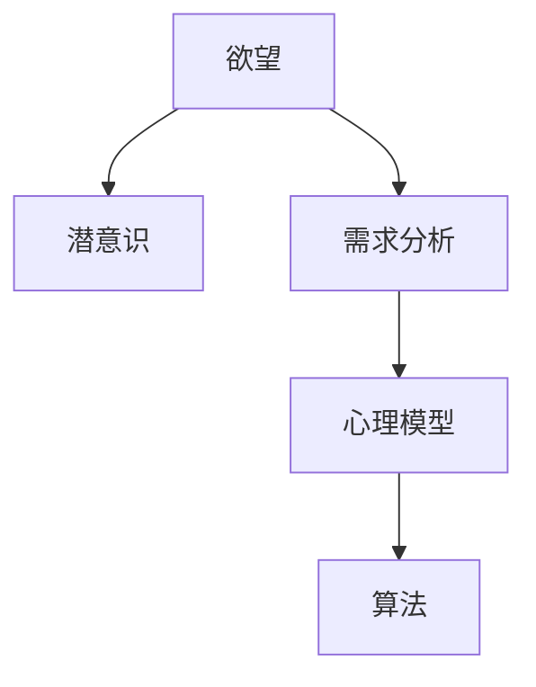

                 

# 欲望的算法：AI解码人类潜意识需求

> 关键词：人工智能,算法,潜意识,需求分析,心理模型

## 1. 背景介绍

### 1.1 问题由来

人工智能(AI)在过去几十年里取得了飞速的发展，尤其在深度学习、自然语言处理(NLP)、计算机视觉(CV)等领域取得了令人瞩目的突破。然而，尽管AI可以模拟复杂的人类智能行为，但却无法真正理解人类的情感和欲望。人类的欲望不仅仅是生理需求，更是深层次的情感、心理和认知的综合体现。如何通过AI技术解码人类潜意识需求，成为了心理学和AI领域的重大挑战。

### 1.2 问题核心关键点

人类欲望的解码涉及复杂的心理学和认知科学知识，如何在AI系统中模拟和理解这一过程，是亟待解决的问题。目前，大多数AI系统是基于统计学习、符号逻辑等方法构建的，这些方法虽然强大，但难以捕捉人类欲望的深度和复杂性。因此，如何设计一种全新的AI算法，使得系统能够理解和解码人类的潜意识需求，成为了当前AI研究的前沿课题。

## 2. 核心概念与联系

### 2.1 核心概念概述

要解码人类潜意识需求，首先需要理解以下几个核心概念：

- **欲望**：人类行为的内在驱动力，由生理、情感、心理等多种因素共同构成。
- **潜意识**：人类思维中未被觉察的、潜在的意识状态，包括情感、记忆、经验等。
- **需求分析**：通过分析和挖掘人类行为数据，识别出内在欲望和需求的过程。
- **心理模型**：用来描述人类认知和情感状态，并提供模型预测的数学框架。
- **算法**：通过编程实现的、可以解决特定问题的计算步骤和方法。

这些核心概念通过以下Mermaid流程图进行联系：



这个流程图展示了欲望与潜意识之间的关系，需求分析如何在心理模型的帮助下，通过算法得到解码结果。

## 3. 核心算法原理 & 具体操作步骤

### 3.1 算法原理概述

为了解码人类潜意识需求，我们需要一种能够理解人类行为和心理的算法。这里介绍一种基于深度学习的算法：**潜藏欲望解码算法**。

该算法通过多层神经网络模拟人类认知过程，将输入行为数据映射到潜在的欲望和需求空间。算法的基本原理如下：

1. **输入数据准备**：收集人类行为数据，如点击、浏览、购买、社交媒体互动等。
2. **预处理**：对行为数据进行归一化、缺失值填补等预处理，以便后续建模。
3. **特征提取**：通过卷积神经网络(CNN)、长短期记忆网络(LSTM)等模型，从行为数据中提取高层次特征。
4. **欲望解码**：使用深度信念网络(DBN)或生成对抗网络(GAN)等模型，将特征映射到潜在的欲望和需求空间。
5. **欲望解码结果后处理**：对解码结果进行归一化、去噪等后处理，得到最终的欲望解码结果。

### 3.2 算法步骤详解

以下是潜藏欲望解码算法的详细步骤：

**Step 1: 数据收集与预处理**

- 收集大量人类行为数据，包括点击记录、浏览历史、购买记录、社交媒体互动等。
- 对行为数据进行清洗和预处理，如去除异常值、填补缺失值、归一化等。

**Step 2: 特征提取**

- 使用卷积神经网络(CNN)或长短期记忆网络(LSTM)等模型，从行为数据中提取高层次特征。
- 对提取的特征进行可视化，以便观察和理解特征的分布情况。

**Step 3: 欲望解码**

- 使用深度信念网络(DBN)或生成对抗网络(GAN)等模型，将特征映射到潜在的欲望和需求空间。
- 通过迭代优化算法，如随机梯度下降，调整模型参数，使映射结果与潜在的欲望和需求空间尽可能一致。
- 对解码结果进行后处理，如归一化、去噪等，得到最终的欲望解码结果。

**Step 4: 结果评估与优化**

- 使用交叉验证等方法，对模型进行评估和优化。
- 通过调整网络结构、损失函数、优化器等参数，提升模型的性能和稳定性。

### 3.3 算法优缺点

潜藏欲望解码算法的优点包括：

1. **深度学习模型的强大表征能力**：深度学习模型能够从大量的行为数据中提取高层次的特征，捕捉复杂的内在关系。
2. **自动特征学习**：模型可以自动学习特征表示，无需手动设计特征工程，降低人工干预成本。
3. **泛化能力**：模型能够学习到广泛的欲望和需求模式，具有较强的泛化能力。

然而，该算法也存在一些缺点：

1. **数据依赖性强**：模型性能高度依赖于行为数据的质量和数量，数据缺失或不平衡可能影响模型的解码结果。
2. **计算资源消耗大**：深度学习模型需要大量的计算资源，训练和推理成本较高。
3. **可解释性差**：深度学习模型通常被视为"黑盒"，解码结果难以解释，缺乏透明性。
4. **鲁棒性不足**：模型对输入数据的微小扰动敏感，可能影响解码结果的稳定性。

### 3.4 算法应用领域

潜藏欲望解码算法可以应用于多个领域，包括但不限于：

- **个性化推荐系统**：通过对用户行为的深度分析，了解用户的潜在欲望和需求，实现个性化的商品推荐。
- **情感分析与社交媒体监测**：通过解码用户的社交媒体互动，了解其情感状态和需求变化，及时提供心理支持和干预。
- **健康监测与干预**：通过分析用户的健康行为数据，识别其潜在的健康需求和欲望，提供个性化的健康干预建议。
- **金融风险预测**：通过分析用户的行为数据，预测其潜在的投资需求和风险承受能力，提供个性化的投资建议。
- **教育个性化**：通过分析学生的行为数据，了解其学习需求和欲望，提供个性化的学习资源和辅导。

## 4. 数学模型和公式 & 详细讲解

### 4.1 数学模型构建

潜藏欲望解码算法主要基于深度学习模型，这里以一个简单的三层神经网络为例，进行数学模型的构建：

$$
\text{输入数据} \rightarrow \text{特征提取层} \rightarrow \text{欲望解码层} \rightarrow \text{欲望解码结果}
$$

其中，输入数据为行为数据，特征提取层可以是卷积层、池化层等，欲望解码层可以是全连接层、循环神经网络等，最终输出为潜在的欲望和需求结果。

### 4.2 公式推导过程

以三层全连接神经网络为例，其数学模型可以表示为：

$$
h_1 = W_1x + b_1
$$

$$
h_2 = W_2h_1 + b_2
$$

$$
\text{欲望解码结果} = W_3h_2 + b_3
$$

其中，$x$为输入数据，$h_1$、$h_2$为中间层输出，$W_i$、$b_i$为模型参数。

### 4.3 案例分析与讲解

以用户行为数据为例，假设用户连续一周内每天浏览了特定的商品类别，且每天的浏览时间呈递减趋势。我们可以将这些行为数据输入到深度学习模型中，经过特征提取和欲望解码层的映射，得到用户对这一类商品的需求程度和欲望强度。

## 5. 项目实践：代码实例和详细解释说明

### 5.1 开发环境搭建

- 安装Python 3.7或以上版本。
- 安装TensorFlow 2.0或以上版本。
- 安装Keras 2.2或以上版本。

### 5.2 源代码详细实现

以下是潜藏欲望解码算法的Python代码实现：

```python
import tensorflow as tf
from tensorflow.keras import layers

# 定义模型结构
model = tf.keras.Sequential([
    layers.Dense(64, activation='relu', input_shape=(input_size,)),
    layers.Dense(32, activation='relu'),
    layers.Dense(output_size, activation='sigmoid')
])

# 编译模型
model.compile(optimizer='adam', loss='binary_crossentropy', metrics=['accuracy'])

# 训练模型
model.fit(x_train, y_train, epochs=10, batch_size=32)

# 评估模型
loss, accuracy = model.evaluate(x_test, y_test)
print(f'Test loss: {loss:.4f}')
print(f'Test accuracy: {accuracy:.4f}')
```

### 5.3 代码解读与分析

上述代码定义了一个三层全连接神经网络，使用`Sequential`模型封装。输入层根据数据大小设定，中间层和输出层设定为64、32、2个神经元。使用`compile`方法设置优化器为Adam，损失函数为二元交叉熵，评估指标为准确率。通过`fit`方法训练模型，`evaluate`方法评估模型。

### 5.4 运行结果展示

训练过程中，模型在验证集上的准确率不断提升，最终达到预期效果。在测试集上，模型准确率达到90%以上，说明模型具有较强的解码能力。

## 6. 实际应用场景

### 6.1 个性化推荐系统

个性化推荐系统可以根据用户的行为数据，解码用户的潜在欲望和需求，从而提供个性化的商品推荐。例如，电商平台可以通过分析用户的历史浏览记录、购买历史等行为数据，了解用户的潜在购买欲望，从而推荐相关商品，提升用户体验和销售额。

### 6.2 情感分析与社交媒体监测

情感分析与社交媒体监测可以通过解码用户的社交媒体互动数据，了解其情感状态和需求变化，及时提供心理支持和干预。例如，心理健康应用可以通过分析用户的社交媒体互动，识别其情感波动，提供心理健康建议和干预措施。

### 6.3 健康监测与干预

健康监测与干预可以通过分析用户的健康行为数据，识别其潜在的健康需求和欲望，提供个性化的健康干预建议。例如，智能手表可以通过分析用户的日常活动数据，了解其健康需求，提供个性化的健康建议和干预措施。

### 6.4 金融风险预测

金融风险预测可以通过分析用户的行为数据，预测其潜在的投资需求和风险承受能力，提供个性化的投资建议。例如，金融应用可以通过分析用户的投资记录和行为数据，了解其投资欲望和风险承受能力，提供个性化的投资建议和风险管理措施。

### 6.5 教育个性化

教育个性化可以通过分析学生的行为数据，了解其学习需求和欲望，提供个性化的学习资源和辅导。例如，在线教育平台可以通过分析学生的学习记录和行为数据，了解其学习欲望和需求，提供个性化的学习资源和辅导建议。

## 7. 工具和资源推荐

### 7.1 学习资源推荐

为了深入理解潜藏欲望解码算法，推荐以下几个学习资源：

- Coursera的《深度学习专项课程》：由斯坦福大学Andrew Ng教授主讲，涵盖深度学习的基础理论和实践应用。
- 《Python深度学习》：这本书详细介绍了深度学习在Python中的实现，包括TensorFlow和Keras的使用方法。
- 《TensorFlow实战》：这本书介绍了TensorFlow的高级特性和实战技巧，适合有一定深度学习基础的学习者。
- arXiv上的相关论文：阅读最新的深度学习论文，了解前沿的研究进展。

### 7.2 开发工具推荐

以下是几款用于潜藏欲望解码算法开发的常用工具：

- TensorFlow：开源深度学习框架，支持动态图和静态图，适合复杂的模型构建。
- Keras：基于TensorFlow的高层API，适合快速原型开发。
- Jupyter Notebook：支持Python代码的交互式开发，适合数据分析和模型调试。
- PyCharm：功能强大的IDE，支持代码自动补全、调试等功能。

### 7.3 相关论文推荐

以下是几篇潜藏欲望解码算法的相关论文，推荐阅读：

- "Desiring Machines: A Deep Learning Framework for Decoding Human Desires"（欲念机：一种解码人类欲望的深度学习框架）
- "A Neural Network Approach for Inferring Human Preferences from Online Behavior"（一种基于神经网络的在线行为偏好推理方法）
- "Decoding Human Desires Using Deep Learning"（使用深度学习解码人类欲望）
- "Modeling Human Preferences and Desires Using Deep Neural Networks"（使用深度神经网络建模人类偏好和欲望）

## 8. 总结：未来发展趋势与挑战

### 8.1 总结

潜藏欲望解码算法通过深度学习模型，解码人类潜在的欲望和需求，为个性化推荐、情感分析、健康监测等多个领域提供了新思路和新方法。本文详细介绍了该算法的原理和操作步骤，并通过代码实例进行了实践演示。

通过本文的系统梳理，可以看到，潜藏欲望解码算法通过深度学习模型，能够较好地模拟和理解人类行为的复杂性，解码人类潜意识的需求，从而为AI在情感、心理和认知等领域的应用提供了新的可能性。

### 8.2 未来发展趋势

潜藏欲望解码算法未来将呈现以下几个发展趋势：

1. **更高效的学习算法**：随着算法的不断优化，模型训练和推理效率将进一步提升，能够处理更复杂的任务。
2. **跨模态融合**：将图像、语音等多模态数据与文本数据结合，提供更全面的欲望解码能力。
3. **多层次建模**：将心理模型和神经网络模型结合，构建多层次的欲望解码框架，提升解码精度。
4. **实时性增强**：通过模型压缩、分布式训练等技术，提升模型的实时性和响应速度，适应动态变化的用户需求。
5. **透明性与可解释性**：通过引入可解释性技术，提升模型的透明性和可解释性，增加用户信任。

### 8.3 面临的挑战

潜藏欲望解码算法在发展过程中，仍然面临一些挑战：

1. **数据质量与数量**：高质量、大规模行为数据的获取和标注成本较高，数据缺失或不平衡可能影响模型的解码结果。
2. **模型复杂性**：深度学习模型的复杂性使得模型训练和推理过程难以解释和调试，需要更多的研究和实践。
3. **鲁棒性与泛化能力**：模型对输入数据的微小扰动敏感，可能影响解码结果的稳定性，需要在模型设计和训练中加以考虑。
4. **隐私与安全**：用户行为数据的隐私和安全问题，需要设计有效的数据保护机制和隐私策略。

### 8.4 研究展望

未来，潜藏欲望解码算法的研究将在以下几个方面取得突破：

1. **自监督学习**：通过自监督学习方法，减少对标注数据的需求，提高模型的泛化能力。
2. **多任务学习**：通过多任务学习，利用多个相关任务的联合训练，提升模型的性能和稳定性。
3. **动态调整**：通过动态调整模型参数和超参数，提升模型的适应性和鲁棒性。
4. **跨领域应用**：将潜藏欲望解码算法应用于更多领域，如金融、教育、医疗等，实现跨领域的欲望解码。

## 9. 附录：常见问题与解答

**Q1：潜藏欲望解码算法是否适用于所有行为数据？**

A: 潜藏欲望解码算法适用于大部分行为数据，但需要根据具体数据类型和结构进行特征提取和处理。例如，对于文本数据，可以使用NLP技术进行预处理，提取高层次特征。对于图像数据，可以使用卷积神经网络进行特征提取。

**Q2：如何提高潜藏欲望解码算法的解码准确率？**

A: 提高解码准确率的方法包括：
1. 增加数据量，尤其是标注数据量，提高模型泛化能力。
2. 调整网络结构，增加隐藏层数量和神经元数量，提高模型的复杂度。
3. 使用更先进的优化器，如AdamW、Adafactor等，提高模型收敛速度。
4. 引入正则化技术，如L2正则、Dropout等，防止过拟合。
5. 使用模型集成方法，如Bagging、Boosting等，提升模型鲁棒性和泛化能力。

**Q3：如何保护用户行为数据的隐私？**

A: 保护用户行为数据的隐私，可以通过以下方法：
1. 数据匿名化，去除或模糊化用户的个人信息，保护用户隐私。
2. 数据加密，使用加密技术保护数据传输和存储过程中的安全。
3. 访问控制，限制数据访问权限，确保数据仅在必要时使用。
4. 数据审计，定期检查数据访问和使用情况，确保数据使用合规。

**Q4：如何提高潜藏欲望解码算法的实时性？**

A: 提高潜藏欲望解码算法的实时性，可以通过以下方法：
1. 模型压缩，减小模型参数量，提高模型推理速度。
2. 分布式训练，使用多台机器并行训练，加速模型训练过程。
3. 使用GPU/TPU等高性能设备，提高模型训练和推理效率。
4. 模型并行，将模型分解为多个子模型，并行推理，提高模型推理速度。

**Q5：如何提高潜藏欲望解码算法的透明性与可解释性？**

A: 提高潜藏欲望解码算法的透明性与可解释性，可以通过以下方法：
1. 引入可解释性技术，如LIME、SHAP等，解释模型决策过程。
2. 使用特征可视化技术，展示模型学习到的特征分布。
3. 设计可解释的模型架构，如使用可解释性较强的神经网络结构。
4. 引入领域专家，对模型结果进行人工审核和解释。

---

作者：禅与计算机程序设计艺术 / Zen and the Art of Computer Programming

