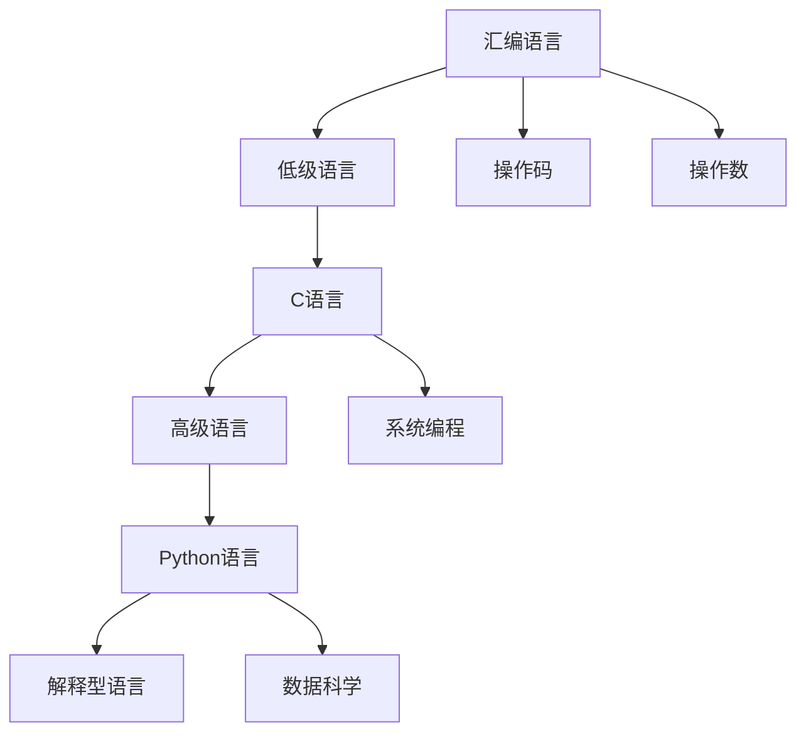

                 

# 汇编、C和Python：AI开发中的编程语言选择

> 关键词：汇编语言、C语言、Python、AI开发、编程语言选择

## 1. 背景介绍

在当今信息时代，人工智能（AI）技术正以前所未有的速度发展，广泛应用于各个领域，包括自然语言处理、计算机视觉、机器学习等。编程语言作为人工智能开发的重要工具，其选择和应用对AI系统的性能和效率有着至关重要的影响。汇编、C和Python作为三种不同的编程语言，各自具有独特的优势和适用场景。本文将探讨这三种语言在AI开发中的选择和使用，帮助开发者在复杂的人工智能项目中做出更明智的语言决策。

## 2. 核心概念与联系

### 2.1 核心概念概述

- **汇编语言（Assembly Language）**：一种低级语言，直接与计算机硬件交互，由操作码和操作数组成，执行效率极高，但编写难度大，可读性差。
- **C语言（C Programming Language）**：一种高级语言，支持底层操作，灵活性高，广泛应用于系统编程、科学计算等领域，是许多AI库和框架的基础。
- **Python（Python Programming Language）**：一种高级、解释型、动态语言，易于学习，代码可读性强，生态系统丰富，广泛应用于数据科学、机器学习等领域。

### 2.2 核心概念原理和架构的 Mermaid 流程图



这个流程图展示了三种编程语言的基本特征及其之间的联系。汇编语言直接与计算机硬件交互，提供了最高的执行效率；C语言则介于汇编和高级语言之间，具有系统编程的能力；而Python作为一种高级语言，更注重代码的可读性和灵活性，广泛应用于数据科学和机器学习领域。

## 3. 核心算法原理 & 具体操作步骤

### 3.1 算法原理概述

AI开发中，编程语言的选择应基于项目的特定需求，如性能要求、开发效率、生态系统等。汇编语言因其低级特性，主要用于底层操作和性能要求极高的应用；C语言则适合于需要高效执行和高性能的AI库和框架的开发；Python则以其简洁性和易用性，成为数据科学和机器学习领域的黄金语言。

### 3.2 算法步骤详解

**Step 1: 确定项目需求**
- 明确项目的目标，如数据预处理、模型训练、推理部署等。
- 分析项目性能、效率、易用性和可维护性等需求。

**Step 2: 选择编程语言**
- 根据项目需求选择合适的编程语言。对于性能要求极高的应用，选择汇编语言；对于需要高效执行和高性能的AI库和框架，选择C语言；对于数据科学和机器学习，选择Python。

**Step 3: 安装语言环境**
- 安装对应的编译器、解释器和库文件。

**Step 4: 编写代码**
- 根据项目需求，编写符合语言的代码。

**Step 5: 测试与优化**
- 测试代码的功能和性能，必要时进行优化。

### 3.3 算法优缺点

**汇编语言**
- **优点**：
  - 最高执行效率
  - 直接与硬件交互，性能优化潜力大
- **缺点**：
  - 编写难度大，可读性差
  - 平台依赖性强

**C语言**
- **优点**：
  - 高效执行
  - 灵活性高
  - 广泛应用的基础库和框架支持
- **缺点**：
  - 编写复杂度相对较高
  - 不适合快速开发

**Python**
- **优点**：
  - 易于学习，代码可读性强
  - 丰富的第三方库和框架支持
  - 高度灵活性，适合快速原型开发
- **缺点**：
  - 执行效率相对较低
  - 某些底层操作受限

### 3.4 算法应用领域

- **汇编语言**：主要用于操作系统内核、驱动程序等对性能要求极高的底层应用。
- **C语言**：广泛用于系统编程、科学计算、AI库和框架的底层实现，如TensorFlow、PyTorch等。
- **Python**：主要应用于数据科学、机器学习、自然语言处理等领域的高级应用开发。

## 4. 数学模型和公式 & 详细讲解 & 举例说明

### 4.1 数学模型构建

在AI开发中，数学模型和算法的选择与编程语言密切相关。以神经网络为例，其模型构建过程包括权重初始化、前向传播、反向传播等步骤。不同编程语言在实现这些步骤时，有着各自的优势和劣势。

### 4.2 公式推导过程

**神经网络前向传播**：
$$
y = f(\theta^T x)
$$
其中 $y$ 为输出，$x$ 为输入，$\theta$ 为权重，$f$ 为激活函数。

**神经网络反向传播**：
$$
\frac{\partial y}{\partial \theta} = \frac{\partial f(\theta^T x)}{\partial \theta} = f'(\theta^T x) \frac{\partial (\theta^T x)}{\partial \theta} = f'(\theta^T x) x^T
$$
其中 $f'$ 为激活函数的导数。

### 4.3 案例分析与讲解

**C语言在神经网络中的应用**
C语言因其高效执行和灵活性，广泛应用于神经网络的高效实现。例如，使用C语言编写的TensorFlow库，能够高效地进行矩阵运算和神经网络训练。

**Python在神经网络中的应用**
Python在数据科学和机器学习领域的应用非常广泛，例如使用Python编写的Keras库，提供了简单易用的API，方便开发者快速搭建和训练神经网络模型。

## 5. 项目实践：代码实例和详细解释说明

### 5.1 开发环境搭建

**C语言环境搭建**
- 安装GCC编译器
- 配置Makefile和CMake文件
- 安装必要的库文件

**Python环境搭建**
- 安装Anaconda
- 创建虚拟环境
- 安装必要的第三方库和框架

### 5.2 源代码详细实现

**C语言实现神经网络**
```c
#include <stdio.h>
#include <stdlib.h>

#define INPUT_SIZE 2
#define HIDDEN_SIZE 3
#define OUTPUT_SIZE 1

void forwardPropagation(float *input, float *hiddenWeights, float *hiddenBiases, float *outputWeights, float *outputBiases, float *output) {
    // 前向传播
}

void backwardPropagation(float *input, float *hiddenWeights, float *hiddenBiases, float *outputWeights, float *outputBiases, float *output, float *hiddenWeightsGradients, float *hiddenBiasesGradients, float *outputWeightsGradients, float *outputBiasesGradients) {
    // 反向传播
}

int main() {
    // 训练数据
    // 训练过程
    return 0;
}
```

**Python实现神经网络**
```python
import numpy as np

def sigmoid(x):
    return 1 / (1 + np.exp(-x))

def forwardPropagation(X, W1, W2, b1, b2):
    # 前向传播
    return None

def backwardPropagation(X, y, W1, W2, b1, b2, activation, activationPrime, outputWeights, outputBiases, hiddenWeights, hiddenBiases):
    # 反向传播
    return None

def train(X, y, W1, W2, b1, b2, epochs, learningRate, activation, activationPrime):
    # 训练过程
    return None
```

### 5.3 代码解读与分析

**C语言代码解读**
- 定义输入、隐藏层和输出层的权重和偏置
- 实现前向传播和反向传播函数
- 主函数中进行数据初始化和模型训练

**Python代码解读**
- 定义激活函数
- 实现前向传播和反向传播函数
- 主函数中进行数据初始化和模型训练

### 5.4 运行结果展示

**C语言运行结果**
- 高效的矩阵运算和神经网络训练结果

**Python运行结果**
- 简单易用的API和灵活的数据处理能力

## 6. 实际应用场景

**汇编语言在AI中的应用**
- 实现底层操作，如GPU并行计算

**C语言在AI中的应用**
- 实现高效的AI库和框架，如TensorFlow、PyTorch等

**Python在AI中的应用**
- 实现数据科学、机器学习、自然语言处理等领域的高级应用

## 7. 工具和资源推荐

### 7.1 学习资源推荐

- **汇编语言学习资源**：《汇编语言基础》、《计算机组成原理》
- **C语言学习资源**：《C Programming: A Modern Approach》、《C语言程序设计》
- **Python学习资源**：《Python编程：从入门到实践》、《深入理解Python》

### 7.2 开发工具推荐

- **汇编语言开发工具**：NASM、GCC
- **C语言开发工具**：GCC、Clang
- **Python开发工具**：Anaconda、Jupyter Notebook

### 7.3 相关论文推荐

- **汇编语言在AI中的应用**：《Using Assembly Language for AI Applications》
- **C语言在AI中的应用**：《Efficient Deep Learning with C++》
- **Python在AI中的应用**：《Python Programming for Data Science》

## 8. 总结：未来发展趋势与挑战

### 8.1 研究成果总结

本文探讨了汇编、C和Python三种编程语言在AI开发中的应用，强调了编程语言选择的重要性。汇编语言因其高效性，适用于底层操作；C语言因其灵活性和性能，适用于AI库和框架的底层实现；Python因其易用性和丰富生态，适用于数据科学和机器学习领域的高级应用。

### 8.2 未来发展趋势

未来，AI开发将更加依赖于高效、灵活、易用的编程语言。随着硬件性能的提升和编程语言的不断演进，AI开发将朝着更高的性能、更低的开发成本和更广泛的应用领域迈进。

### 8.3 面临的挑战

尽管编程语言的选择有助于提高AI开发效率和性能，但仍面临以下挑战：
- 编程语言之间的生态壁垒
- 高性能编程语言的编写难度
- 编程语言性能和易用性的平衡

### 8.4 研究展望

未来的研究将集中在以下几个方面：
- 开发更加高效、易用的编程语言
- 优化现有编程语言的高性能库和框架
- 实现跨编程语言的高效代码互操作

## 9. 附录：常见问题与解答

**Q1: 如何选择合适的编程语言？**

A: 根据项目需求选择编程语言。性能要求高的应用选择汇编语言；需要高效执行和高性能的AI库和框架选择C语言；数据科学和机器学习选择Python。

**Q2: 汇编语言是否只适用于底层操作？**

A: 汇编语言因其低级特性，主要用于底层操作和性能要求极高的应用。但在一些特定场景下，如GPU并行计算，汇编语言也有其独特的优势。

**Q3: C语言和Python相比，哪种更适合AI开发？**

A: C语言因其高效性和灵活性，适用于AI库和框架的底层实现；Python因其易用性和丰富生态，适用于数据科学和机器学习领域的高级应用。

**Q4: Python的执行效率是否真的不如C语言？**

A: Python在执行效率上相对较低，但在数据科学和机器学习领域，Python的高易用性和丰富生态使得其成为首选。通过优化和编译技术，Python也可以实现高效执行。

**Q5: 在AI开发中，是否应该同时掌握多种编程语言？**

A: 掌握多种编程语言有助于提高AI开发的多样性和灵活性。但针对具体项目选择合适的语言更为重要，无需在所有项目中都使用多种语言。

