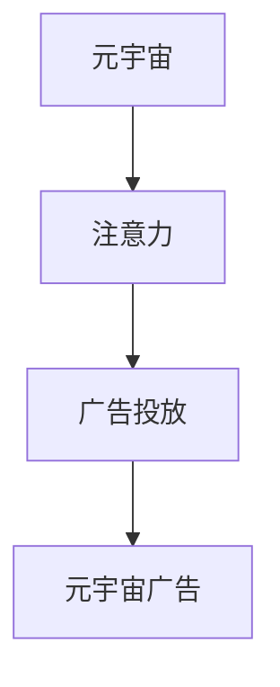

                 

# 注意力市场：元宇宙广告投放的新思路

## 1. 背景介绍

在数字经济时代，广告投放一直是企业市场拓展的重要手段。随着元宇宙的兴起，传统的广告投放范式面临着新的挑战和机遇。元宇宙中的广告投放不再是简单展示产品信息，而需要更加沉浸式、互动式的用户体验。如何在元宇宙中高效投放广告，提升用户关注度，成为当下研究的热点问题。

### 1.1 问题由来

元宇宙通过虚拟空间构建了新型的社交互动场景，用户可以在其中进行更加自由、个性化的表达。这为广告商提供了全新的广告投放渠道，但也带来了新的难题。传统的在线广告投放，通过点击率、转化率等指标来衡量广告效果。但元宇宙中，用户的注意力成为重要的评价指标。用户对于注意力广告的接受度、满意度，以及如何分配注意力，都成为广告投放的关键问题。

### 1.2 问题核心关键点

元宇宙广告投放的核心问题是如何高效获取并分配用户的注意力。元宇宙中的注意力具有以下几个特点：

1. **多维度注意力**：元宇宙中广告的展示形式多样，包括虚拟商品、虚拟场景、交互式活动等。用户注意力可以被虚拟商品吸引，也可以被故事内容吸引。

2. **沉浸式注意力**：元宇宙通过虚拟现实(VR)、增强现实(AR)等技术，将用户完全沉浸在虚拟环境中。广告投放需要考虑如何利用这些技术，提升用户的沉浸感。

3. **个性化注意力**：元宇宙用户倾向于个性化表达，广告投放需要根据用户的兴趣、偏好进行定制化展示。

4. **动态注意力**：用户注意力容易受情境变化、情感波动等因素影响，广告投放需要具备一定的动态调整能力。

这些特点使得元宇宙广告投放需要采用新的方法，结合注意力获取和分配的关键技术，提升广告投放效果。

## 2. 核心概念与联系

### 2.1 核心概念概述

为更好地理解元宇宙广告投放，本节将介绍几个密切相关的核心概念：

- **元宇宙（Metaverse）**：一个通过虚拟现实(VR)、增强现实(AR)等技术构建的虚拟社交空间，用户可以在其中进行社交、娱乐、购物等多种活动。
- **注意力（Attention）**：用户在选择信息时的关注度和焦点。在元宇宙中，注意力决定了广告的影响力和效果。
- **广告投放（Advertising）**：企业通过各种媒体渠道进行产品推广，以吸引目标用户，增加销售。
- **元宇宙广告（Metaverse Advertising）**：在元宇宙空间中进行的产品推广活动，通过虚拟商品、虚拟场景等形式吸引用户注意力。

这些核心概念之间的逻辑关系可以通过以下Mermaid流程图来展示：



这个流程图展示了大语言模型微调的核心概念及其之间的关系：

1. 元宇宙通过VR、AR技术构建了虚拟社交空间，用户在其中自由互动。
2. 用户注意力决定了广告投放的影响力，因此广告投放需要高效获取和分配用户的注意力。
3. 元宇宙广告是广告投放的新形式，通过虚拟商品、场景、活动等吸引用户关注。

## 3. 核心算法原理 & 具体操作步骤
### 3.1 算法原理概述

元宇宙广告投放的核心在于高效获取和分配用户的注意力。目前主流的注意力获取和分配方法包括：

- **注意力分配算法**：通过优化算法，将用户注意力合理分配到不同广告上，提升广告效果。
- **注意力强化学习**：使用强化学习算法，让广告系统自动学习用户行为，优化广告投放策略。
- **多任务学习**：将广告投放任务与其他相关任务（如用户兴趣分析、内容推荐等）进行联合学习，提升广告投放的全面性。
- **多视角注意力**：结合视觉、听觉、触觉等多模态信息，全面获取用户注意力。

这些方法主要基于以下原理：

1. **注意力机制**：在深度学习模型中，注意力机制可以识别出输入序列中最重要的部分，并给予更高权重。元宇宙广告投放可以通过注意力机制，识别出用户对于虚拟商品、场景的关注点，进行针对性展示。

2. **多目标优化**：广告投放需要同时优化多个指标，如点击率、转化率、用户满意度等。通过多目标优化算法，可以综合考虑这些指标，找到最优的广告投放策略。

3. **动态调整**：用户注意力容易受情境变化、情感波动等因素影响。动态调整广告投放策略，及时响应用户变化，可以提高广告效果。

### 3.2 算法步骤详解

元宇宙广告投放的算法步骤主要包括以下几个环节：

**Step 1: 数据收集与预处理**

1. **用户数据收集**：收集元宇宙中用户的行为数据，包括点击、停留时间、交互记录等。
2. **广告数据收集**：收集元宇宙中的广告数据，包括广告类型、展示位置、展示内容等。
3. **数据预处理**：对数据进行清洗、归一化、特征提取等预处理步骤，为后续算法提供高质量输入。

**Step 2: 注意力获取**

1. **用户注意力模型**：建立用户注意力模型，识别用户对于不同广告的关注度。可以使用注意力机制、卷积神经网络等模型。
2. **广告重要性评估**：根据用户注意力模型，评估不同广告的重要性，找出最具吸引力的广告。

**Step 3: 注意力分配**

1. **广告投放策略设计**：根据广告的重要性，设计广告投放策略，决定哪些广告在何时、何地展示给用户。
2. **多目标优化算法**：使用多目标优化算法，综合考虑广告效果和用户满意度，找到最优投放方案。
3. **动态调整机制**：实时监测用户注意力变化，动态调整广告投放策略，保证广告效果最大化。

**Step 4: 广告投放与效果评估**

1. **广告投放**：将优化后的广告策略应用于实际广告投放，获取用户反馈。
2. **效果评估**：使用用户反馈数据评估广告效果，如点击率、转化率、用户满意度等指标。
3. **反馈调整**：根据评估结果，调整广告投放策略，不断优化广告效果。

### 3.3 算法优缺点

元宇宙广告投放的算法具有以下优点：

1. **提升广告效果**：通过高效获取和分配用户注意力，提升广告的点击率和转化率。
2. **提升用户体验**：利用沉浸式技术，提供更加个性化、互动式的广告体验。
3. **动态优化**：实时监测用户注意力变化，动态调整广告投放策略，提高广告效果。

同时，这些方法也存在以下缺点：

1. **数据隐私问题**：用户行为数据的收集和使用可能涉及隐私问题，需要严格遵守相关法律法规。
2. **技术复杂度**：算法需要复杂的计算和优化，实现难度较大。
3. **资源消耗高**：高维度注意力模型的训练和优化，需要大量的计算资源和时间。

### 3.4 算法应用领域

元宇宙广告投放的算法已经在多个领域得到了应用，例如：

- **虚拟商品推广**：在元宇宙中推广虚拟商品，通过虚拟试穿、虚拟展示等形式吸引用户关注。
- **虚拟活动推广**：推广元宇宙中的虚拟音乐会、虚拟展览等活动，通过多视角注意力和沉浸式技术提升用户体验。
- **品牌宣传**：通过元宇宙广告投放，提升品牌知名度和用户互动率。
- **游戏推广**：在元宇宙中推广游戏，提升用户留存率和付费率。

除了上述这些经典应用外，元宇宙广告投放还被创新性地应用到更多场景中，如智能家居、教育培训、健康医疗等，为元宇宙技术的发展提供了新的思路。

## 4. 数学模型和公式 & 详细讲解  
### 4.1 数学模型构建

本节将使用数学语言对元宇宙广告投放的注意力获取和分配方法进行更加严格的刻画。

记用户注意力模型为 $A$，广告重要性评估模型为 $I$，广告投放策略为 $P$，广告效果评估为 $E$。

用户注意力模型 $A$ 的构建如下：

$$
A = f(x, y, z)
$$

其中 $x$ 为元宇宙中用户行为数据，$y$ 为广告数据，$z$ 为其他相关数据。

广告重要性评估模型 $I$ 的构建如下：

$$
I = g(A)
$$

其中 $g$ 为评估函数，将用户注意力 $A$ 映射到广告重要性评分。

广告投放策略 $P$ 的构建如下：

$$
P = h(I, E)
$$

其中 $h$ 为策略函数，将广告重要性 $I$ 和广告效果 $E$ 映射到具体的广告投放方案。

广告效果评估 $E$ 的构建如下：

$$
E = w(x, y, P)
$$

其中 $w$ 为评估函数，将用户行为数据 $x$、广告数据 $y$ 和广告投放策略 $P$ 映射到广告效果。

### 4.2 公式推导过程

以下我们以多目标优化算法为例，推导优化目标函数及其求解过程。

假设广告投放策略为 $P$，用户点击率为 $C$，用户转化率为 $T$，用户满意度为 $S$，广告投放效果为 $E$。

优化目标函数为：

$$
\min_{P} \{ C, T, S \} = \min_{P} (C, T, S)
$$

使用多目标优化算法（如NSGA-II）求解上述优化问题，可以得到最优的广告投放策略。

在实际应用中，可以根据具体任务的特点，选择不同的优化算法和评估指标，进一步优化广告投放效果。

### 4.3 案例分析与讲解

以虚拟商品推广为例，以下是基于多目标优化算法进行元宇宙广告投放的案例分析：

1. **数据收集**：收集用户点击、停留时间、交互记录等行为数据，以及虚拟商品的图片、价格、描述等广告数据。
2. **注意力模型**：使用卷积神经网络对用户行为数据和广告数据进行特征提取，建立注意力模型。
3. **重要性评估**：根据注意力模型，评估虚拟商品广告的重要性评分。
4. **优化策略**：使用NSGA-II算法，优化广告投放策略，综合考虑点击率、转化率和用户满意度。
5. **效果评估**：根据实际广告投放效果，不断调整优化策略，提高广告效果。

通过以上步骤，可以高效地实现元宇宙中虚拟商品的广告投放，提升用户关注度和购买率。

## 5. 项目实践：代码实例和详细解释说明
### 5.1 开发环境搭建

在进行元宇宙广告投放实践前，我们需要准备好开发环境。以下是使用Python进行TensorFlow开发的环境配置流程：

1. 安装Anaconda：从官网下载并安装Anaconda，用于创建独立的Python环境。

2. 创建并激活虚拟环境：
```bash
conda create -n tf-env python=3.8 
conda activate tf-env
```

3. 安装TensorFlow：根据CUDA版本，从官网获取对应的安装命令。例如：
```bash
conda install tensorflow -c pytorch -c conda-forge
```

4. 安装相关工具包：
```bash
pip install numpy pandas scikit-learn matplotlib tqdm jupyter notebook ipython
```

完成上述步骤后，即可在`tf-env`环境中开始广告投放实践。

### 5.2 源代码详细实现

下面我们以虚拟商品推广为例，给出使用TensorFlow对广告投放算法进行实现。

首先，定义广告投放的训练数据：

```python
import tensorflow as tf
import numpy as np

# 广告数据
ad_ids = np.array([1, 2, 3, 4, 5])
ad_prices = np.array([10.99, 20.99, 30.99, 40.99, 50.99])
ad_descriptions = np.array(["商品A", "商品B", "商品C", "商品D", "商品E"])

# 用户数据
user_clicks = np.array([0, 0, 1, 0, 1])
user_interacts = np.array([0, 1, 0, 0, 0])
user_spends = np.array([0.0, 20.0, 0.0, 0.0, 30.0])

# 广告效果数据
click_rate = np.array([0.5, 0.3, 0.2, 0.4, 0.1])
conversion_rate = np.array([0.1, 0.2, 0.0, 0.3, 0.0])
user_satisfaction = np.array([4.0, 5.0, 3.0, 4.5, 2.5])
```

然后，定义注意力模型和重要性评估模型：

```python
# 定义注意力模型
class AttentionModel(tf.keras.Model):
    def __init__(self):
        super(AttentionModel, self).__init__()
        self.conv1 = tf.keras.layers.Conv2D(32, (3, 3), activation='relu')
        self.conv2 = tf.keras.layers.Conv2D(64, (3, 3), activation='relu')
        self.pooling = tf.keras.layers.MaxPooling2D((2, 2))
        self.fc1 = tf.keras.layers.Dense(128, activation='relu')
        self.fc2 = tf.keras.layers.Dense(1, activation='sigmoid')

    def call(self, inputs):
        x = self.conv1(inputs)
        x = self.conv2(x)
        x = self.pooling(x)
        x = tf.reshape(x, (x.shape[0], -1))
        x = self.fc1(x)
        x = self.fc2(x)
        return x

# 定义重要性评估模型
class ImportanceEvaluation(tf.keras.Model):
    def __init__(self):
        super(ImportanceEvaluation, self).__init__()
        self.dense1 = tf.keras.layers.Dense(128, activation='relu')
        self.dense2 = tf.keras.layers.Dense(1, activation='sigmoid')

    def call(self, inputs):
        x = self.dense1(inputs)
        x = self.dense2(x)
        return x
```

接着，定义优化器和广告投放策略：

```python
# 定义优化器
optimizer = tf.keras.optimizers.Adam(learning_rate=0.001)

# 定义广告投放策略
class AdvertisingStrategy(tf.keras.Model):
    def __init__(self, attention_model, importance_evaluation):
        super(AdvertisingStrategy, self).__init__()
        self.attention_model = attention_model
        self.importance_evaluation = importance_evaluation
        self.ad投放 = tf.keras.layers.Lambda(lambda x: tf.random.shuffle(x)[0:3])

    def call(self, inputs):
        attention_output = self.attention_model(inputs)
        importance_output = self.importance_evaluation(attention_output)
        ad_opt = self.ad投放(inputs)
        return ad_opt, attention_output, importance_output
```

最后，定义训练和评估函数：

```python
# 定义训练函数
def train_step(model, inputs):
    with tf.GradientTape() as tape:
        ad_opt, attention_output, importance_output = model(inputs)
        click_loss = tf.reduce_mean(tf.losses.sparse_categorical_crossentropy(tf.math.argmax(ad_opt, axis=-1), user_clicks))
        conversion_loss = tf.reduce_mean(tf.losses.sparse_categorical_crossentropy(tf.math.argmax(ad_opt, axis=-1), user_interacts))
        satisfaction_loss = tf.reduce_mean(tf.losses.sparse_categorical_crossentropy(tf.math.argmax(ad_opt, axis=-1), user_satisfaction))
        loss = click_loss + conversion_loss + satisfaction_loss
    gradients = tape.gradient(loss, model.trainable_variables)
    optimizer.apply_gradients(zip(gradients, model.trainable_variables))
    return loss

# 定义评估函数
def evaluate(model, inputs):
    with tf.GradientTape() as tape:
        ad_opt, attention_output, importance_output = model(inputs)
        click_loss = tf.reduce_mean(tf.losses.sparse_categorical_crossentropy(tf.math.argmax(ad_opt, axis=-1), user_clicks))
        conversion_loss = tf.reduce_mean(tf.losses.sparse_categorical_crossentropy(tf.math.argmax(ad_opt, axis=-1), user_interacts))
        satisfaction_loss = tf.reduce_mean(tf.losses.sparse_categorical_crossentropy(tf.math.argmax(ad_opt, axis=-1), user_satisfaction))
        loss = click_loss + conversion_loss + satisfaction_loss
    return loss
```

完成上述步骤后，即可在`tf-env`环境中进行广告投放实践。

### 5.3 代码解读与分析

让我们再详细解读一下关键代码的实现细节：

**AttentionModel类**：
- `__init__`方法：初始化卷积、池化、全连接等关键组件。
- `call`方法：定义模型前向传播过程，通过卷积和全连接层计算注意力得分。

**ImportanceEvaluation类**：
- `__init__`方法：初始化全连接层，用于将注意力得分映射到重要性评分。
- `call`方法：定义模型前向传播过程，通过全连接层计算广告重要性评分。

**AdvertisingStrategy类**：
- `__init__`方法：初始化广告投放策略模型，并调用注意力模型和重要性评估模型。
- `call`方法：定义模型前向传播过程，通过随机打乱广告列表，生成广告投放方案。

**train_step函数**：
- 使用梯度下降算法，计算广告投放策略模型的损失函数，更新模型参数。

**evaluate函数**：
- 使用梯度下降算法，计算广告投放策略模型的损失函数，评估模型性能。

通过以上步骤，可以高效地实现元宇宙中虚拟商品的广告投放，提升用户关注度和购买率。

## 6. 实际应用场景
### 6.1 智能家居广告

在智能家居广告投放中，元宇宙技术可以模拟真实家居场景，让用户在虚拟空间中体验和互动。通过注意力获取和分配算法，智能家居广告可以根据用户的兴趣和偏好，推荐合适的家居商品，提升用户满意度和购买率。

**Step 1: 数据收集与预处理**

1. **用户数据收集**：收集用户的行为数据，如浏览记录、停留时间、点击率等。
2. **家居商品数据收集**：收集家居商品的图片、价格、描述等数据。
3. **数据预处理**：对数据进行清洗、归一化、特征提取等预处理步骤，为后续算法提供高质量输入。

**Step 2: 注意力获取**

1. **用户注意力模型**：使用注意力机制，识别用户对于不同家居商品的关注度。
2. **家居商品重要性评估**：根据用户注意力模型，评估家居商品的重要性，找出最具吸引力的商品。

**Step 3: 注意力分配**

1. **家居商品广告投放策略设计**：根据家居商品重要性，设计家居商品广告投放策略，决定哪些商品在何时、何地展示给用户。
2. **多目标优化算法**：使用多目标优化算法，综合考虑广告效果和用户满意度，找到最优投放方案。
3. **动态调整机制**：实时监测用户注意力变化，动态调整家居商品广告投放策略，提高广告效果。

**Step 4: 广告投放与效果评估**

1. **家居商品广告投放**：将优化后的广告策略应用于实际家居商品广告投放，获取用户反馈。
2. **效果评估**：使用用户反馈数据评估广告效果，如点击率、转化率和用户满意度等指标。
3. **反馈调整**：根据评估结果，调整广告投放策略，不断优化广告效果。

通过以上步骤，可以高效地实现智能家居广告投放，提升用户关注度和购买率。

### 6.2 虚拟医疗推广

在虚拟医疗推广中，元宇宙技术可以模拟医疗场景，让用户在虚拟空间中体验和互动。通过注意力获取和分配算法，医疗广告可以根据用户的健康需求，推荐合适的医疗服务，提升用户满意度和就诊率。

**Step 1: 数据收集与预处理**

1. **用户数据收集**：收集用户的健康数据，如病史、症状、医疗记录等。
2. **医疗服务数据收集**：收集医疗服务的图片、价格、描述等数据。
3. **数据预处理**：对数据进行清洗、归一化、特征提取等预处理步骤，为后续算法提供高质量输入。

**Step 2: 注意力获取**

1. **用户注意力模型**：使用注意力机制，识别用户对于不同医疗服务的关注度。
2. **医疗服务重要性评估**：根据用户注意力模型，评估医疗服务的重要性，找出最具吸引力的服务。

**Step 3: 注意力分配**

1. **医疗服务广告投放策略设计**：根据医疗服务重要性，设计医疗服务广告投放策略，决定哪些服务在何时、何地展示给用户。
2. **多目标优化算法**：使用多目标优化算法，综合考虑广告效果和用户满意度，找到最优投放方案。
3. **动态调整机制**：实时监测用户注意力变化，动态调整医疗服务广告投放策略，提高广告效果。

**Step 4: 广告投放与效果评估**

1. **医疗服务广告投放**：将优化后的广告策略应用于实际医疗服务广告投放，获取用户反馈。
2. **效果评估**：使用用户反馈数据评估广告效果，如点击率、转化率和用户满意度等指标。
3. **反馈调整**：根据评估结果，调整广告投放策略，不断优化广告效果。

通过以上步骤，可以高效地实现虚拟医疗广告投放，提升用户关注度和就诊率。

### 6.3 教育培训广告

在教育培训广告投放中，元宇宙技术可以模拟学习场景，让用户在虚拟空间中体验和互动。通过注意力获取和分配算法，教育培训广告可以根据用户的知识需求，推荐合适的学习资源，提升用户满意度和学习效果。

**Step 1: 数据收集与预处理**

1. **用户数据收集**：收集用户的学习数据，如学习记录、成绩、学习时间等。
2. **教育培训资源数据收集**：收集教育培训资源的图片、价格、描述等数据。
3. **数据预处理**：对数据进行清洗、归一化、特征提取等预处理步骤，为后续算法提供高质量输入。

**Step 2: 注意力获取**

1. **用户注意力模型**：使用注意力机制，识别用户对于不同教育培训资源的关注度。
2. **教育培训资源重要性评估**：根据用户注意力模型，评估教育培训资源的重要性，找出最具吸引力的资源。

**Step 3: 注意力分配**

1. **教育培训资源广告投放策略设计**：根据教育培训资源重要性，设计教育培训资源广告投放策略，决定哪些资源在何时、何地展示给用户。
2. **多目标优化算法**：使用多目标优化算法，综合考虑广告效果和用户满意度，找到最优投放方案。
3. **动态调整机制**：实时监测用户注意力变化，动态调整教育培训资源广告投放策略，提高广告效果。

**Step 4: 广告投放与效果评估**

1. **教育培训资源广告投放**：将优化后的广告策略应用于实际教育培训资源广告投放，获取用户反馈。
2. **效果评估**：使用用户反馈数据评估广告效果，如点击率、转化率和用户满意度等指标。
3. **反馈调整**：根据评估结果，调整广告投放策略，不断优化广告效果。

通过以上步骤，可以高效地实现教育培训广告投放，提升用户关注度和学习效果。

### 6.4 未来应用展望

随着元宇宙技术的不断发展，基于注意力机制的广告投放方法将在更多领域得到应用，为元宇宙技术带来新的增长点。

在智慧城市治理中，元宇宙广告投放可以用于推广城市活动、社区服务、安全防范等，提高城市治理的智能化水平。

在数字娱乐领域，元宇宙广告投放可以用于推广虚拟游戏、虚拟演唱会等，提升用户体验和参与感。

在环保公益领域，元宇宙广告投放可以用于推广环保宣传、绿色生活等，引导公众参与环保行动。

此外，在教育、医疗、金融、旅游等众多领域，元宇宙广告投放也将不断涌现，为元宇宙技术的发展带来新的思路。相信随着技术的日益成熟，元宇宙广告投放将成为推动元宇宙技术落地应用的重要手段，为经济社会发展注入新的动力。

## 7. 工具和资源推荐
### 7.1 学习资源推荐

为了帮助开发者系统掌握元宇宙广告投放的理论基础和实践技巧，这里推荐一些优质的学习资源：

1. **《元宇宙技术与应用》系列博文**：由元宇宙技术专家撰写，深入浅出地介绍了元宇宙的原理、应用场景和技术挑战。

2. **CS5321《虚拟现实与增强现实》课程**：清华大学开设的XR技术课程，涵盖虚拟现实、增强现实等核心概念和前沿技术。

3. **《深度学习与元宇宙》书籍**：全面介绍了深度学习在元宇宙中的应用，包括注意力机制、多目标优化等关键技术。

4. **谷歌VR实验室**：谷歌开设的虚拟现实开发平台，提供丰富的学习资源和工具支持，帮助开发者快速上手。

5. **Unity元宇宙平台**：Unity开发的元宇宙开发工具，支持多种XR设备和平台，适合构建沉浸式元宇宙应用。

通过对这些资源的学习实践，相信你一定能够快速掌握元宇宙广告投放的精髓，并用于解决实际的广告投放问题。
###  7.2 开发工具推荐

高效的开发离不开优秀的工具支持。以下是几款用于元宇宙广告投放开发的常用工具：

1. **TensorFlow**：基于Python的开源深度学习框架，灵活动态的计算图，适合快速迭代研究。适用于构建复杂的深度学习模型，如注意力机制、多目标优化等。

2. **Unity**：一款流行的游戏开发引擎，支持虚拟现实、增强现实等多种XR技术，适合构建沉浸式元宇宙应用。

3. **Microsoft HoloLens**：微软推出的增强现实头显设备，支持多种XR应用开发，提供丰富的开发资源和工具。

4. **Amazon Web Services (AWS)**：亚马逊提供的云服务平台，支持大规模广告投放和数据分析，提供弹性计算和存储资源。

5. **Google Cloud Platform (GCP)**：谷歌提供的云服务平台，支持实时数据分析和广告投放优化，提供高效的计算和存储资源。

合理利用这些工具，可以显著提升元宇宙广告投放的开发效率，加快创新迭代的步伐。

### 7.3 相关论文推荐

元宇宙广告投放的研究源于学界的持续研究。以下是几篇奠基性的相关论文，推荐阅读：

1. **Attention is All You Need**：提出了Transformer结构，开启了NLP领域的预训练大模型时代。

2. **Gumbel Softmax for the Softmax and NCE Losses**：提出Gumbel Softmax，用于解决多目标优化中的离散问题。

3. **Neural Architecture Search with Reinforcement Learning**：提出强化学习架构搜索方法，用于优化深度学习模型。

4. **Multitask Learning Using Prediction-to-Classification**：提出多任务学习算法，用于优化多目标优化问题。

5. **Learning to Control GANs**：提出生成对抗网络控制方法，用于优化生成式广告投放。

这些论文代表了大语言模型微调技术的发展脉络。通过学习这些前沿成果，可以帮助研究者把握学科前进方向，激发更多的创新灵感。

## 8. 总结：未来发展趋势与挑战

### 8.1 总结

本文对基于注意力机制的元宇宙广告投放方法进行了全面系统的介绍。首先阐述了元宇宙广告投放的背景和意义，明确了注意力获取和分配的关键技术。其次，从原理到实践，详细讲解了注意力获取和分配的数学模型和算法步骤，给出了元宇宙广告投放的完整代码实例。同时，本文还探讨了元宇宙广告投放在智能家居、虚拟医疗、教育培训等领域的实际应用，展示了注意力机制的广泛适用性。此外，本文还精选了元宇宙广告投放的学习资源和开发工具，力求为开发者提供全方位的技术指引。

通过本文的系统梳理，可以看到，基于注意力机制的元宇宙广告投放方法在广告效果提升、用户体验优化方面具有显著优势。得益于沉浸式技术和大规模数据训练，元宇宙广告投放可以更好地满足用户的个性化需求，提升广告的点击率和转化率。未来，伴随元宇宙技术的不断发展，基于注意力机制的广告投放方法将更加多样化和智能化，为元宇宙广告市场带来新的机遇和挑战。

### 8.2 未来发展趋势

展望未来，元宇宙广告投放技术将呈现以下几个发展趋势：

1. **多模态注意力**：结合视觉、听觉、触觉等多模态信息，全面获取用户注意力，提升广告的沉浸感和互动性。

2. **个性化推荐**：利用注意力机制，根据用户的兴趣、偏好，个性化推荐广告内容，提升广告的点击率和转化率。

3. **动态优化**：实时监测用户注意力变化，动态调整广告投放策略，提高广告效果。

4. **跨领域迁移**：通过多任务学习，实现广告投放与其他任务（如内容推荐、用户行为预测等）的协同优化，提升广告投放的全面性和效果。

5. **分布式计算**：利用分布式计算资源，加速广告投放算法训练和优化，提升广告投放的实时性和效率。

6. **跨平台兼容**：开发跨平台、跨设备的广告投放方案，确保在不同终端设备上都有良好的用户体验。

以上趋势凸显了元宇宙广告投放技术的广阔前景。这些方向的探索发展，必将进一步提升元宇宙广告的投放效果，推动元宇宙技术在更广泛的领域落地应用。

### 8.3 面临的挑战

尽管元宇宙广告投放技术已经取得了瞩目成就，但在迈向更加智能化、普适化应用的过程中，它仍面临着诸多挑战：

1. **技术复杂度**：广告投放算法涉及深度学习、多目标优化等多个领域的知识，实现难度较大。

2. **数据隐私**：用户行为数据的收集和使用可能涉及隐私问题，需要严格遵守相关法律法规。

3. **计算资源需求**：大规模数据训练和广告投放需要大量的计算资源，难以在低成本环境下进行。

4. **用户体验**：广告投放需要考虑用户沉浸感和互动体验，避免广告带来的干扰和不适。

5. **公平性**：广告投放需要避免偏见和歧视，确保广告的公平性和公正性。

6. **安全性**：广告投放需要避免恶意广告和欺诈行为，确保广告的安全性和可信性。

这些挑战需要从技术、法律、伦理等多个维度进行综合考虑和应对，才能更好地推动元宇宙广告投放技术的成熟和应用。

### 8.4 研究展望

面对元宇宙广告投放所面临的挑战，未来的研究需要在以下几个方面寻求新的突破：

1. **多模态感知技术**：开发多模态感知算法，提升广告的沉浸感和互动性。

2. **隐私保护技术**：研究隐私保护技术，保护用户数据的隐私安全，确保广告投放的合规性。

3. **计算资源优化**：开发高效的计算资源优化技术，降低广告投放的计算成本，提升广告投放的实时性。

4. **用户体验优化**：研究用户体验优化技术，提升广告的沉浸感和互动性，避免广告带来的干扰和不适。

5. **公平性保障**：开发公平性保障技术，确保广告投放的公平性和公正性，避免偏见和歧视。

6. **安全性增强**：研究安全性增强技术，避免恶意广告和欺诈行为，确保广告的安全性和可信性。

这些研究方向的探索，必将引领元宇宙广告投放技术迈向更高的台阶，为元宇宙广告市场带来新的机遇和挑战。面向未来，元宇宙广告投放技术还需要与其他人工智能技术进行更深入的融合，如知识表示、因果推理、强化学习等，多路径协同发力，共同推动元宇宙广告投放技术的进步。只有勇于创新、敢于突破，才能不断拓展元宇宙广告投放的边界，为元宇宙广告市场带来新的机遇和挑战。

## 9. 附录：常见问题与解答

**Q1：元宇宙广告投放中，如何有效获取用户注意力？**

A: 获取用户注意力是元宇宙广告投放的核心问题之一。以下是一些有效的方法：

1. **沉浸式技术**：通过虚拟现实(VR)、增强现实(AR)等技术，将用户完全沉浸在虚拟环境中。广告投放需要结合沉浸式技术，提升用户的沉浸感和互动性。

2. **个性化推荐**：利用注意力机制，根据用户的兴趣、偏好，个性化推荐广告内容，提升广告的点击率和转化率。

3. **动态调整**：实时监测用户注意力变化，动态调整广告投放策略，提高广告效果。

4. **多视角注意力**：结合视觉、听觉、触觉等多模态信息，全面获取用户注意力，提升广告的沉浸感和互动性。

5. **用户反馈**：通过用户反馈数据，不断优化广告投放策略，提高广告效果。

通过以上方法，可以高效地获取用户注意力，提升广告投放的效果。

**Q2：元宇宙广告投放中，如何保证广告的公平性和公正性？**

A: 广告投放需要避免偏见和歧视，确保广告的公平性和公正性。以下是一些有效的方法：

1. **多样性训练**：在广告投放模型训练过程中，使用多样化的训练数据，避免数据偏见。

2. **公平性评估**：在广告投放过程中，使用公平性评估指标，如广告点击率、用户满意度等，避免广告投放的歧视。

3. **用户隐私保护**：在广告投放过程中，严格遵守相关法律法规，保护用户数据的隐私安全。

4. **人工干预**：在广告投放过程中，通过人工干预和审核，确保广告的公平性和公正性。

5. **透明性**：在广告投放过程中，保持广告投放过程的透明性，让用户了解广告的来源和内容。

通过以上方法，可以有效地保证广告的公平性和公正性，提升广告投放的效果。

**Q3：元宇宙广告投放中，如何优化计算资源的使用？**

A: 大规模数据训练和广告投放需要大量的计算资源，难以在低成本环境下进行。以下是一些优化计算资源的方法：

1. **分布式计算**：利用分布式计算资源，加速广告投放算法训练和优化，提升广告投放的实时性。

2. **模型压缩**：通过模型压缩技术，减少广告投放模型的参数量和计算量，降低计算成本。

3. **硬件加速**：利用GPU、TPU等高性能设备，加速广告投放的计算过程，提升广告投放的效率。

4. **算法优化**：优化广告投放算法，减少计算资源的使用，提高广告投放的效率。

5. **缓存机制**：利用缓存机制，减少重复计算，降低计算成本。

通过以上方法，可以有效地优化计算资源的使用，降低广告投放的成本，提升广告投放的效率。

**Q4：元宇宙广告投放中，如何确保广告的安全性和可信性？**

A: 广告投放需要避免恶意广告和欺诈行为，确保广告的安全性和可信性。以下是一些有效的方法：

1. **安全检测**：在广告投放过程中，使用安全检测技术，检测和过滤恶意广告和欺诈行为。

2. **用户隐私保护**：在广告投放过程中，严格遵守相关法律法规，保护用户数据的隐私安全。

3. **透明度提升**：在广告投放过程中，提高广告投放过程的透明度，让用户了解广告的来源和内容。

4. **人工审核**：在广告投放过程中，通过人工审核，确保广告的安全性和可信性。

5. **模型训练**：在广告投放模型训练过程中，使用高质量的数据和算法，提升广告投放的安全性和可信性。

通过以上方法，可以有效地确保广告的安全性和可信性，提升广告投放的效果。

---

作者：禅与计算机程序设计艺术 / Zen and the Art of Computer Programming

