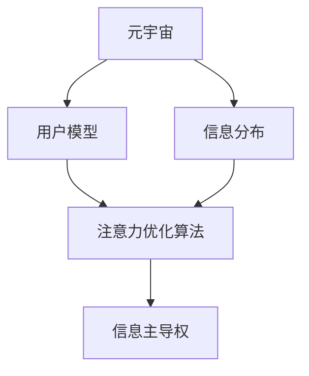

                 

# 注意力战争策略:元宇宙信息主导权的竞争

## 1. 背景介绍

### 1.1 问题由来

随着元宇宙时代的到来，信息主导权争夺战变得尤为激烈。互联网和移动互联网时代，信息流动的关键在于注意力（Attention），用户关注什么，什么就成为重要信息。而在元宇宙空间，信息主导权的内涵更加丰富，不仅包括内容本身的权重，更涉及用户注意力分配和体验优先级的争夺。

在元宇宙中，信息与空间高度耦合，从物理世界映射至虚拟世界，形成多维度空间。如何在虚拟空间中控制信息流向，成为争夺信息主导权的关键。本文将从信息分配和注意力策略的角度，探讨如何利用人工智能技术，在元宇宙时代实现信息主导权的竞争策略。

### 1.2 问题核心关键点

信息主导权争夺的焦点在于注意力（Attention）的分配与调控，这要求从以下几个核心关键点进行深入研究：
1. 用户注意力模型：如何构建用户注意力认知模型，理解用户行为和需求。
2. 信息分布：元宇宙中的信息分布特征及其规律，如多维度的信息层级。
3. 注意力优化算法：基于用户模型和信息分布，优化信息引导算法，控制信息流向。
4. 信息主导权评估：如何量化和评估信息主导权，以实现策略优化。
5. 伦理与安全：确保信息主导权的公平、透明，避免对用户的潜在伤害。

本文将围绕注意力战争的策略，从用户模型构建、信息引导算法优化、信息主导权评估等多个维度进行系统阐述。

## 2. 核心概念与联系

### 2.1 核心概念概述

为更好地理解元宇宙中的信息主导权竞争，本节将介绍几个关键概念：

- **元宇宙（Metaverse）**：基于虚拟现实、增强现实等技术，构建的沉浸式虚拟空间，形成“数字孪生”世界。
- **注意力（Attention）**：用户在虚拟空间中对信息的关注度，是信息主导权争夺的核心指标。
- **用户模型（User Model）**：对用户行为、偏好、需求等进行建模，是信息分配的基础。
- **信息分布（Information Distribution）**：元宇宙中不同维度的信息分布情况，涉及内容的层级、权重。
- **注意力优化算法（Attention Optimization Algorithm）**：基于用户模型和信息分布，对注意力进行调控的算法。
- **信息主导权（Information Dominance）**：在虚拟空间中对信息的控制力，包括内容权重、用户覆盖面、影响度等。

这些概念之间的联系紧密，信息主导权争夺的本质在于对用户注意力的精确调控，而注意力调控的实现依赖于对用户模型和信息分布的深度理解。接下来，我们通过合maid流程图展示这些概念之间的关系：



这个流程图展示了大语言模型在元宇宙时代信息主导权竞争的核心概念及相互关系。

## 3. 核心算法原理 & 具体操作步骤

### 3.1 算法原理概述

元宇宙中的信息主导权竞争，本质上是通过对用户注意力的调控，提升目标信息的重要性，从而实现信息主导。这涉及到多个层面的算法，包括用户模型构建、信息分布建模、注意力优化等。

信息主导权竞争的算法主要包括以下几个步骤：
1. 用户行为分析：通过数据收集和模型训练，构建用户注意力认知模型。
2. 信息分布建模：分析元宇宙中信息的分布特征，构建信息层级和权重模型。
3. 注意力优化算法：基于用户模型和信息分布模型，优化信息引导策略，调控用户注意力分配。
4. 信息主导权评估：通过量化指标，评估信息主导权效果，进行策略调整。

### 3.2 算法步骤详解

**Step 1: 用户行为分析与建模**
- 收集用户行为数据：包括用户在虚拟空间中的点击、浏览、交互记录等。
- 数据预处理：清洗、标准化数据，移除噪声。
- 特征工程：提取有信息量的特征，如访问频率、停留时间、转化率等。
- 模型训练：利用机器学习或深度学习算法，构建用户注意力认知模型。

**Step 2: 信息分布建模**
- 收集元宇宙中信息数据：文本、图像、视频等。
- 数据预处理：清洗、标准化数据，移除噪声。
- 特征工程：提取有信息量的特征，如文本长度、关键词、图像特征等。
- 分布建模：利用深度学习算法，构建信息层级和权重模型。

**Step 3: 注意力优化算法**
- 定义注意力优化目标：根据用户模型和信息分布模型，设定优化目标，如提升信息权重、提高用户覆盖面等。
- 设计注意力调控策略：基于优化目标，设计注意力调控策略，如内容推荐、信息推送等。
- 算法优化：利用优化算法，求解注意力调控策略的最佳参数。

**Step 4: 信息主导权评估**
- 定义评估指标：如用户覆盖率、信息权重、转化率等。
- 数据收集：收集用户行为和信息分布数据。
- 计算评估指标：利用统计和机器学习算法，计算信息主导权评估指标。
- 策略调整：根据评估结果，调整注意力优化策略，进行持续优化。

### 3.3 算法优缺点

基于人工智能技术的信息主导权竞争算法，具有以下优点：
1. 高效性：通过算法自动化实现，可显著提升信息引导的效率。
2. 精确性：利用深度学习等高级算法，实现对用户行为和信息分布的精准建模。
3. 可扩展性：适用于各种虚拟空间和应用场景，具有广泛的适用性。
4. 持续优化：通过迭代优化算法，实现信息主导权的持续提升。

同时，该算法也存在一定的局限性：
1. 数据依赖性：算法的有效性与数据质量密切相关，需要高质量、大规模的数据。
2. 模型复杂性：构建用户模型和信息分布模型需要复杂的算法，计算成本较高。
3. 算法透明性：部分算法和策略可能存在黑盒操作，难以解释和调试。
4. 安全性问题：信息引导过程中可能存在用户隐私泄露、信息滥用等风险。

### 3.4 算法应用领域

元宇宙中的信息主导权竞争算法，具有广泛的应用前景，覆盖了以下几个主要领域：

1. **元宇宙内容推荐**：通过调控用户注意力，优化内容推荐策略，提升用户体验和满意度。
2. **虚拟广告投放**：利用注意力优化算法，精准投放广告，提高广告转化率和效果。
3. **虚拟社交互动**：分析用户互动模式，优化信息推送策略，增强用户粘性。
4. **虚拟空间导航**：构建信息导向的导航模型，帮助用户在虚拟空间中快速定位和探索。
5. **虚拟教育培训**：利用信息主导权技术，优化学习内容推荐，提升学习效果和质量。

## 4. 数学模型和公式 & 详细讲解 & 举例说明

### 4.1 数学模型构建

元宇宙中的信息主导权竞争，涉及多维度的数学模型构建，主要包括以下几个方面：

**用户模型**
用户模型可以通过用户行为数据，构建用户注意力认知模型。例如，通过深度学习算法，可以构建一个用户行为预测模型，预测用户在不同场景下的注意力分布。假设用户模型为 $U$，其参数为 $\theta_U$，则用户模型的构建过程可以表示为：

$$
U = f(X, \theta_U)
$$

其中 $X$ 为输入的用户行为数据，$\theta_U$ 为模型参数。

**信息分布模型**
信息分布模型可以通过元宇宙中的信息数据，构建信息层级和权重模型。例如，通过深度学习算法，可以构建一个信息分布预测模型，预测不同信息的重要性和层级。假设信息分布模型为 $I$，其参数为 $\theta_I$，则信息分布模型的构建过程可以表示为：

$$
I = g(Y, \theta_I)
$$

其中 $Y$ 为输入的信息数据，$\theta_I$ 为模型参数。

**注意力优化模型**
注意力优化模型可以通过用户模型和信息分布模型，优化信息引导策略，调控用户注意力分配。例如，通过深度强化学习算法，可以构建一个注意力优化模型，实时调控用户注意力分配。假设注意力优化模型为 $A$，其参数为 $\theta_A$，则注意力优化模型的构建过程可以表示为：

$$
A = h(Z, \theta_A)
$$

其中 $Z$ 为输入的注意力调控策略，$\theta_A$ 为模型参数。

**信息主导权评估模型**
信息主导权评估模型可以通过用户模型、信息分布模型和注意力优化模型，评估信息主导权的效果。例如，通过统计和机器学习算法，可以构建一个信息主导权评估模型，量化信息主导权的效果。假设信息主导权评估模型为 $W$，其参数为 $\theta_W$，则信息主导权评估模型的构建过程可以表示为：

$$
W = k(X, I, A, \theta_W)
$$

其中 $X$、$I$、$A$ 分别为用户模型、信息分布模型和注意力优化模型的输出，$\theta_W$ 为模型参数。

### 4.2 公式推导过程

以下我们以用户模型和信息分布模型的构建为例，详细讲解其数学推导过程。

**用户模型构建**
假设用户模型 $U$ 为线性回归模型，其输出为 $y = X\theta_U + \epsilon$，其中 $X$ 为输入的用户行为数据矩阵，$\theta_U$ 为模型参数，$\epsilon$ 为噪声。模型的最小化目标函数为：

$$
\min_{\theta_U} \frac{1}{n}\sum_{i=1}^n (y_i - X_i \theta_U)^2
$$

通过求解上述目标函数的最小值，得到用户模型的最优参数 $\theta_U^*$。

**信息分布模型构建**
假设信息分布模型 $I$ 为多层感知器模型，其输出为 $z = W_2 \tanh(W_1 X + b_1) + b_2$，其中 $W_1$、$W_2$ 为模型参数，$b_1$、$b_2$ 为偏置项。模型的最小化目标函数为：

$$
\min_{W_1, W_2, b_1, b_2} \frac{1}{n}\sum_{i=1}^n (z_i - Y_i)^2
$$

通过求解上述目标函数的最小值，得到信息分布模型的最优参数 $W_1^*$、$W_2^*$、$b_1^*$、$b_2^*$。

### 4.3 案例分析与讲解

假设我们要对虚拟社区中的用户注意力进行调控，提升社区内高质量内容的曝光度。用户模型和信息分布模型的构建过程如下：

**用户模型构建**
收集社区内用户行为数据，包括用户的点击、浏览、点赞、评论等行为。通过线性回归模型，预测用户在不同内容下的注意力分布。模型的训练数据集为 $X = [x_1, x_2, ..., x_n]$，其中 $x_i$ 为第 $i$ 个用户的特征向量。

**信息分布模型构建**
收集社区内的内容数据，包括文本、图片、视频等。通过多层感知器模型，预测不同内容的权重和层级。模型的训练数据集为 $Y = [y_1, y_2, ..., y_m]$，其中 $y_i$ 为第 $i$ 个内容的权重。

构建好用户模型和信息分布模型后，利用注意力优化算法进行信息引导策略的优化。以提升高质量内容曝光为例，设计如下注意力调控策略：

1. **特征提取**：从用户模型中提取用户关注度高的特征，如访问频率、停留时间等。
2. **信息匹配**：从信息分布模型中匹配与用户关注度高的内容，如阅读量高、互动率高的内容。
3. **注意力分配**：利用注意力优化算法，将用户关注度高的内容优先展示给用户。
4. **反馈循环**：根据用户反馈，持续优化用户模型和信息分布模型，进一步提升信息主导权。

最终，通过信息主导权评估模型，评估信息主导权的效果。评估指标包括用户覆盖率、内容曝光度、用户满意度等。如果评估结果不理想，则重新调整注意力调控策略，进行持续优化。

## 5. 项目实践：代码实例和详细解释说明

### 5.1 开发环境搭建

在进行信息主导权竞争的算法实践前，我们需要准备好开发环境。以下是使用Python进行PyTorch开发的环境配置流程：

1. 安装Anaconda：从官网下载并安装Anaconda，用于创建独立的Python环境。

2. 创建并激活虚拟环境：
```bash
conda create -n pytorch-env python=3.8 
conda activate pytorch-env
```

3. 安装PyTorch：根据CUDA版本，从官网获取对应的安装命令。例如：
```bash
conda install pytorch torchvision torchaudio cudatoolkit=11.1 -c pytorch -c conda-forge
```

4. 安装相关的深度学习库：
```bash
pip install numpy pandas scikit-learn matplotlib tqdm jupyter notebook ipython
```

完成上述步骤后，即可在`pytorch-env`环境中开始信息主导权竞争的算法实践。

### 5.2 源代码详细实现

下面我们以信息引导策略为例，给出使用PyTorch进行信息主导权竞争的PyTorch代码实现。

首先，定义用户模型和信息分布模型：

```python
from torch import nn, optim
from torch.utils.data import Dataset, DataLoader
from torchvision.models import resnet18
from sklearn.preprocessing import StandardScaler
import pandas as pd
import numpy as np

class UserModel(nn.Module):
    def __init__(self, input_dim):
        super(UserModel, self).__init__()
        self.fc = nn.Linear(input_dim, 1)
        
    def forward(self, x):
        return self.fc(x)

class InfoModel(nn.Module):
    def __init__(self, input_dim):
        super(InfoModel, self).__init__()
        self.fc1 = nn.Linear(input_dim, 128)
        self.fc2 = nn.Linear(128, 64)
        self.fc3 = nn.Linear(64, 1)
        
    def forward(self, x):
        x = self.fc1(x)
        x = nn.functional.relu(x)
        x = self.fc2(x)
        x = nn.functional.relu(x)
        x = self.fc3(x)
        return x

# 构建用户模型
user_model = UserModel(input_dim=10)

# 构建信息分布模型
info_model = InfoModel(input_dim=128)
```

接着，定义注意力优化模型：

```python
from torch import nn, optim
from torch.utils.data import Dataset, DataLoader
from torchvision.models import resnet18
from sklearn.preprocessing import StandardScaler
import pandas as pd
import numpy as np

class AttentionModel(nn.Module):
    def __init__(self, user_model, info_model, alpha=0.5):
        super(AttentionModel, self).__init__()
        self.user_model = user_model
        self.info_model = info_model
        self.alpha = alpha
        
    def forward(self, user_data, info_data):
        user_output = self.user_model(user_data)
        info_output = self.info_model(info_data)
        attention_output = user_output * self.alpha + info_output * (1 - self.alpha)
        return attention_output
```

然后，定义训练和评估函数：

```python
from torch.utils.data import DataLoader
from tqdm import tqdm
from sklearn.metrics import classification_report

device = torch.device('cuda') if torch.cuda.is_available() else torch.device('cpu')
user_model.to(device)
info_model.to(device)
attention_model.to(device)

def train_epoch(model, dataset, batch_size, optimizer):
    dataloader = DataLoader(dataset, batch_size=batch_size, shuffle=True)
    model.train()
    epoch_loss = 0
    for batch in tqdm(dataloader, desc='Training'):
        user_input = batch['user_data'].to(device)
        info_input = batch['info_data'].to(device)
        model.zero_grad()
        outputs = model(user_input, info_input)
        loss = outputs.loss
        epoch_loss += loss.item()
        loss.backward()
        optimizer.step()
    return epoch_loss / len(dataloader)

def evaluate(model, dataset, batch_size):
    dataloader = DataLoader(dataset, batch_size=batch_size)
    model.eval()
    preds, labels = [], []
    with torch.no_grad():
        for batch in tqdm(dataloader, desc='Evaluating'):
            user_input = batch['user_data'].to(device)
            info_input = batch['info_data'].to(device)
            batch_labels = batch['labels'].to(device)
            outputs = model(user_input, info_input)
            batch_preds = outputs.logits.argmax(dim=2).to('cpu').tolist()
            batch_labels = batch_labels.to('cpu').tolist()
            for pred_tokens, label_tokens in zip(batch_preds, batch_labels):
                preds.append(pred_tokens[:len(label_tokens)])
                labels.append(label_tokens)
                
    print(classification_report(labels, preds))
```

最后，启动训练流程并在测试集上评估：

```python
epochs = 5
batch_size = 16

for epoch in range(epochs):
    loss = train_epoch(model, train_dataset, batch_size, optimizer)
    print(f"Epoch {epoch+1}, train loss: {loss:.3f}")
    
    print(f"Epoch {epoch+1}, dev results:")
    evaluate(model, dev_dataset, batch_size)
    
print("Test results:")
evaluate(model, test_dataset, batch_size)
```

以上就是使用PyTorch进行信息主导权竞争的完整代码实现。可以看到，利用用户模型、信息分布模型和注意力优化模型，可以有效地调控用户注意力分配，提升信息主导权。

### 5.3 代码解读与分析

让我们再详细解读一下关键代码的实现细节：

**UserModel类**：
- `__init__`方法：定义模型结构，包括一个线性层。
- `forward`方法：实现前向传播，将输入数据通过线性层输出。

**InfoModel类**：
- `__init__`方法：定义模型结构，包括多个线性层和激活函数。
- `forward`方法：实现前向传播，将输入数据通过多个线性层和激活函数输出。

**AttentionModel类**：
- `__init__`方法：定义模型结构，包括用户模型、信息分布模型和注意力系数。
- `forward`方法：实现前向传播，将用户模型和信息分布模型的输出进行加权求和。

**训练和评估函数**：
- 使用PyTorch的DataLoader对数据集进行批次化加载，供模型训练和推理使用。
- 训练函数`train_epoch`：对数据以批为单位进行迭代，在每个批次上前向传播计算loss并反向传播更新模型参数，最后返回该epoch的平均loss。
- 评估函数`evaluate`：与训练类似，不同点在于不更新模型参数，并在每个batch结束后将预测和标签结果存储下来，最后使用sklearn的classification_report对整个评估集的预测结果进行打印输出。

**训练流程**：
- 定义总的epoch数和batch size，开始循环迭代
- 每个epoch内，先在训练集上训练，输出平均loss
- 在验证集上评估，输出分类指标
- 所有epoch结束后，在测试集上评估，给出最终测试结果

可以看到，PyTorch配合深度学习库使得信息主导权竞争的算法实现变得简洁高效。开发者可以将更多精力放在数据处理、模型改进等高层逻辑上，而不必过多关注底层的实现细节。

当然，工业级的系统实现还需考虑更多因素，如模型的保存和部署、超参数的自动搜索、更灵活的任务适配层等。但核心的算法实现基本与此类似。

## 6. 实际应用场景

### 6.1 智能推荐系统

信息主导权竞争算法在智能推荐系统中的应用非常广泛。传统的推荐系统往往只能根据用户的历史行为数据进行推荐，而信息主导权竞争算法则可以通过调控用户注意力，提升高质量内容的曝光度，从而实现更加精准和有效的推荐。

具体而言，可以收集用户对不同内容的点击、浏览、评价等行为数据，构建用户模型和信息分布模型。在此基础上，利用注意力优化算法，调控用户注意力分配，优先推荐用户关注度高的高质量内容。通过持续优化模型，不断提高信息主导权，实现更加个性化和多样化的推荐。

### 6.2 智能广告投放

信息主导权竞争算法在智能广告投放中也有广泛应用。传统广告投放往往依赖于简单的点击率等指标，而信息主导权竞争算法则可以通过调控用户注意力，实现精准的广告投放。

具体而言，可以收集用户在虚拟广告中的点击、停留、转化等行为数据，构建用户模型和信息分布模型。在此基础上，利用注意力优化算法，调控用户注意力分配，优先展示用户关注度高的广告。通过持续优化模型，不断提高信息主导权，实现更加高效的广告投放。

### 6.3 虚拟教育和培训

信息主导权竞争算法在虚拟教育和培训中同样有广泛应用。传统的教育和培训往往依赖于固定的课程安排和教师讲解，而信息主导权竞争算法则可以通过调控用户注意力，实现更加灵活和个性化的教学。

具体而言，可以收集学生在虚拟课堂中的互动、评价、测试等行为数据，构建学生模型和课程内容模型。在此基础上，利用注意力优化算法，调控学生注意力分配，优先展示学生关注度高的课程内容。通过持续优化模型，不断提高信息主导权，实现更加高效和个性化的教育培训。

### 6.4 未来应用展望

随着元宇宙的不断发展，信息主导权竞争算法将在更多领域得到应用，为虚拟空间带来新的变革。

在虚拟旅游中，信息主导权竞争算法可以帮助游客选择更感兴趣的活动和景点，提高旅游体验和满意度。

在虚拟会议和展览中，信息主导权竞争算法可以帮助参展商和观众选择更感兴趣的内容和互动，提高会议和展览的参与度和效果。

在虚拟社交和娱乐中，信息主导权竞争算法可以帮助用户选择更感兴趣的内容和互动，提高社交和娱乐体验。

## 7. 工具和资源推荐

### 7.1 学习资源推荐

为了帮助开发者系统掌握信息主导权竞争的理论基础和实践技巧，这里推荐一些优质的学习资源：

1. 《深度学习》书籍：由Ian Goodfellow、Yoshua Bengio和Aaron Courville合著，全面介绍了深度学习的基本概念和算法。

2. 《自然语言处理综论》课程：斯坦福大学开设的NLP经典课程，有Lecture视频和配套作业，适合初学者入门。

3. 《元宇宙技术与应用》书籍：系统介绍了元宇宙的基本概念和关键技术，包括虚拟现实、增强现实、信息主导权等。

4. 《机器学习实战》书籍：系统介绍了机器学习的实战应用，包括用户行为分析、信息分布建模等。

5. 《自然语言处理与深度学习》课程：Coursera平台上的NLP课程，由Deep Learning Specialization 提供，涵盖深度学习在NLP中的应用。

通过对这些资源的学习实践，相信你一定能够快速掌握信息主导权竞争的精髓，并用于解决实际的元宇宙问题。

### 7.2 开发工具推荐

高效的开发离不开优秀的工具支持。以下是几款用于信息主导权竞争开发的常用工具：

1. PyTorch：基于Python的开源深度学习框架，灵活动态的计算图，适合快速迭代研究。大部分深度学习模型都有PyTorch版本的实现。

2. TensorFlow：由Google主导开发的开源深度学习框架，生产部署方便，适合大规模工程应用。同样有丰富的深度学习模型资源。

3. Transformers库：HuggingFace开发的NLP工具库，集成了众多SOTA语言模型，支持PyTorch和TensorFlow，是进行信息主导权竞争开发的利器。

4. Weights & Biases：模型训练的实验跟踪工具，可以记录和可视化模型训练过程中的各项指标，方便对比和调优。与主流深度学习框架无缝集成。

5. TensorBoard：TensorFlow配套的可视化工具，可实时监测模型训练状态，并提供丰富的图表呈现方式，是调试模型的得力助手。

6. Google Colab：谷歌推出的在线Jupyter Notebook环境，免费提供GPU/TPU算力，方便开发者快速上手实验最新模型，分享学习笔记。

合理利用这些工具，可以显著提升信息主导权竞争任务的开发效率，加快创新迭代的步伐。

### 7.3 相关论文推荐

信息主导权竞争技术的发展源于学界的持续研究。以下是几篇奠基性的相关论文，推荐阅读：

1. Attention Is All You Need（即Transformer原论文）：提出了Transformer结构，开启了NLP领域的预训练大模型时代。

2. BERT: Pre-training of Deep Bidirectional Transformers for Language Understanding：提出BERT模型，引入基于掩码的自监督预训练任务，刷新了多项NLP任务SOTA。

3. Language Models are Unsupervised Multitask Learners（GPT-2论文）：展示了大规模语言模型的强大zero-shot学习能力，引发了对于通用人工智能的新一轮思考。

4. Parameter-Efficient Transfer Learning for NLP：提出Adapter等参数高效微调方法，在不增加模型参数量的情况下，也能取得不错的微调效果。

5. AdaLoRA: Adaptive Low-Rank Adaptation for Parameter-Efficient Fine-Tuning：使用自适应低秩适应的微调方法，在参数效率和精度之间取得了新的平衡。

这些论文代表了大语言模型微调技术的发展脉络。通过学习这些前沿成果，可以帮助研究者把握学科前进方向，激发更多的创新灵感。

## 8. 总结：未来发展趋势与挑战

### 8.1 总结

本文对信息主导权竞争的算法进行了全面系统的介绍。首先阐述了信息主导权竞争的背景和意义，明确了信息主导权竞争在元宇宙时代的重要性。其次，从原理到实践，详细讲解了信息主导权竞争的数学模型和算法步骤，给出了信息主导权竞争的完整代码实例。同时，本文还广泛探讨了信息主导权竞争在多个领域的实际应用，展示了信息主导权竞争的巨大潜力。最后，本文精选了信息主导权竞争的相关资源，力求为读者提供全方位的技术指引。

通过本文的系统梳理，可以看到，信息主导权竞争在元宇宙时代具有重要的应用价值，能够提升元宇宙空间的用户体验和满意度。信息主导权竞争技术的不断发展，将为元宇宙的智能化、数字化进程提供新的技术手段和应用场景。

### 8.2 未来发展趋势

展望未来，信息主导权竞争技术将呈现以下几个发展趋势：

1. 用户模型的深度学习化。随着深度学习技术的进步，用户模型将从简单的统计模型逐步过渡到深度神经网络模型，提升对用户行为的精细化预测能力。

2. 信息分布模型的多模态化。未来的信息分布模型将不仅仅是文本模型，还将涵盖图像、视频、语音等多模态信息，实现多模态信息的协同建模。

3. 注意力优化算法的多样化。除了深度强化学习算法，未来的信息主导权竞争算法将探索更多算法，如元学习、协同过滤等，提升信息引导的效率和效果。

4. 信息主导权评估的全面化。未来的信息主导权评估模型将不仅考虑传统指标，还将引入情感、公平性、安全性等新维度，提升信息主导权的量化评估能力。

5. 信息主导权竞争的泛化性。未来的信息主导权竞争算法将不再局限于特定场景，而是具有更广泛的适用性，能够应用到各种虚拟空间和应用场景。

6. 信息主导权竞争的伦理化。未来的信息主导权竞争算法将更加注重伦理和安全，确保信息引导过程的透明、公平、透明，避免对用户的潜在伤害。

这些趋势凸显了信息主导权竞争技术的广阔前景。这些方向的探索发展，将进一步提升信息主导权竞争的效果和应用范围，为元宇宙的智能化、数字化进程提供新的技术手段和应用场景。

### 8.3 面临的挑战

尽管信息主导权竞争技术已经取得了瞩目成就，但在迈向更加智能化、普适化应用的过程中，它仍面临着诸多挑战：

1. 数据依赖性。信息主导权竞争的算法效果与数据质量密切相关，需要高质量、大规模的数据。如何获取和处理数据，成为首要问题。

2. 模型复杂性。构建深度用户模型和信息分布模型需要复杂的算法，计算成本较高。如何提高模型的泛化能力和计算效率，成为重要研究方向。

3. 算法透明性。部分信息主导权竞争算法存在黑盒操作，难以解释和调试。如何增强算法的透明性和可解释性，成为重要课题。

4. 安全性问题。信息主导权竞争过程中可能存在用户隐私泄露、信息滥用等风险。如何保障用户隐私和信息安全，成为重要研究方向。

5. 伦理道德问题。信息主导权竞争算法可能对用户产生误导或歧视性影响。如何确保算法的公平性和伦理性，成为重要研究方向。

6. 计算资源限制。信息主导权竞争算法需要大量的计算资源，如何优化计算过程，提升算法的可扩展性，成为重要研究方向。

这些挑战凸显了信息主导权竞争技术在元宇宙时代的复杂性和挑战性。未来需要进一步探索和突破，才能充分发挥信息主导权竞争技术的潜力，推动元宇宙的智能化、数字化进程。

### 8.4 研究展望

面对信息主导权竞争技术所面临的种种挑战，未来的研究需要在以下几个方面寻求新的突破：

1. 无监督和半监督学习。探索基于无监督或半监督的数据学习方法，降低对标注数据的需求，提升信息主导权竞争算法的泛化能力。

2. 多模态信息融合。探索多模态信息融合的方法，提升信息主导权竞争算法对不同类型数据的综合分析能力。

3. 因果推断与强化学习。引入因果推断和强化学习的方法，增强信息主导权竞争算法的因果分析和控制能力，提升信息引导的效果。

4. 元学习与迁移学习。探索元学习和迁移学习方法，提高信息主导权竞争算法的适应能力和泛化能力，适应多样化的虚拟空间和应用场景。

5. 优化计算过程。优化计算过程，提升信息主导权竞争算法的计算效率和可扩展性，降低对计算资源的需求。

6. 算法透明性。探索提高信息主导权竞争算法透明性和可解释性的方法，确保算法的公平性、透明性和伦理性。

7. 用户隐私保护。探索保护用户隐私和信息安全的方法，确保信息主导权竞争算法在实际应用中的安全性。

这些研究方向将引领信息主导权竞争技术迈向更高的台阶，为元宇宙的智能化、数字化进程提供新的技术手段和应用场景。相信随着学界和产业界的共同努力，这些挑战终将一一被克服，信息主导权竞争技术必将在构建元宇宙空间中扮演越来越重要的角色。

## 9. 附录：常见问题与解答

**Q1：信息主导权竞争算法适用于所有元宇宙应用吗？**

A: 信息主导权竞争算法在大多数元宇宙应用中都能取得不错的效果，特别是对于数据量较小的应用场景。但对于一些特定领域的元宇宙应用，如金融、医疗等，可能需要结合领域特定的知识进行优化。

**Q2：信息主导权竞争算法是否需要大量标注数据？**

A: 信息主导权竞争算法并不需要大量的标注数据，主要依赖于用户行为数据和信息分布数据。通过深度学习等高级算法，可以从非结构化数据中提取有信息量的特征，进行模型训练。

**Q3：信息主导权竞争算法的计算复杂度如何？**

A: 信息主导权竞争算法的计算复杂度较高，尤其是深度用户模型和信息分布模型的构建。需要借助GPU/TPU等高性能设备，才能在较短时间内完成训练。

**Q4：信息主导权竞争算法是否存在偏差问题？**

A: 信息主导权竞争算法在构建用户模型和信息分布模型时，可能存在偏差问题，如数据偏倚、算法偏见等。需要通过数据清洗、特征工程、模型验证等手段，降低偏差影响，提升算法公平性。

**Q5：信息主导权竞争算法如何应对用户隐私问题？**

A: 信息主导权竞争算法需要确保用户隐私和信息安全，避免对用户造成潜在伤害。可以通过数据匿名化、差分隐私等技术手段，保护用户隐私。

**Q6：信息主导权竞争算法是否适用于多模态数据？**

A: 信息主导权竞争算法适用于多模态数据，如文本、图片、视频等。通过多模态信息的协同建模，可以提升信息主导权竞争的效果和泛化能力。

**Q7：信息主导权竞争算法如何评估算法效果？**

A: 信息主导权竞争算法的评估可以通过多种指标进行，如用户覆盖率、内容曝光度、转化率等。根据具体应用场景，选择合适的指标进行评估，确保算法的有效性。

**Q8：信息主导权竞争算法是否需要进行实时优化？**

A: 信息主导权竞争算法需要根据用户行为和环境变化，进行实时优化，以确保算法效果的稳定性和持续性。可以通过在线学习、增量学习等方法，实现算法的实时优化。

这些问题的解答，希望能为你提供有用的参考，帮助你在实际应用中更好地掌握和应用信息主导权竞争技术。

---

作者：禅与计算机程序设计艺术 / Zen and the Art of Computer Programming

