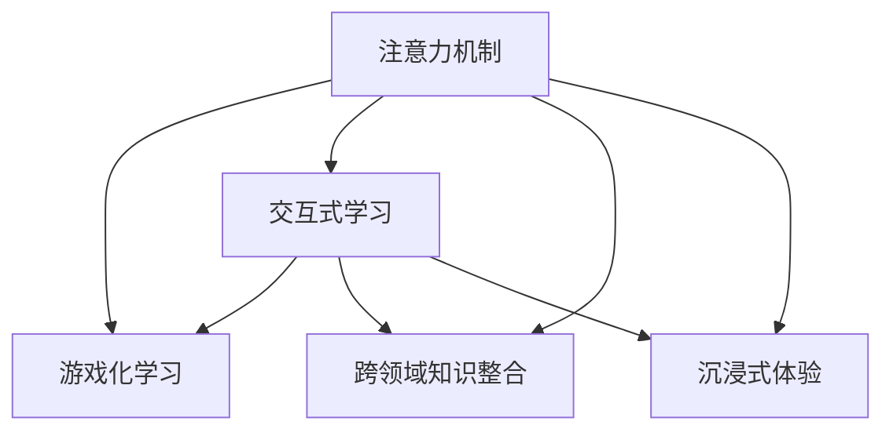

                 

# 注意力游戏化:元宇宙学习的新方法

## 1. 背景介绍

### 1.1 问题由来
随着人工智能（AI）技术的迅猛发展，元宇宙（Metaverse）作为虚拟现实（VR）和增强现实（AR）的延伸，成为构建数字未来的一种全新方式。它不仅是对现实世界的映射和增强，更是通过数字化手段创造了一个交互性强、沉浸感高的虚拟空间。元宇宙中有大量知识、技能和经验需要被学习、应用和传承，使得元宇宙成为AI领域的新蓝海。

然而，元宇宙中的学习和教育方式与传统互联网环境相比，面临更多挑战：

- **高互动性需求**：元宇宙中的用户期望通过自然语言交互、手势控制等方式进行复杂任务的学习和执行。
- **个性化定制**：每个用户的学习习惯、知识背景不同，要求系统能够提供高度个性化的学习路径和内容。
- **实时反馈与调整**：学习过程需要即时反馈与调整，以应对用户的多变需求和动态变化。
- **跨领域应用**：元宇宙涉及多学科、多领域知识，学习者需要在特定场景中掌握新的技能和知识。
- **沉浸感与体验**：学习过程中需要提供沉浸式的虚拟体验，使学习者能够身临其境地感受和学习。

基于这些需求，传统的学习模式和方式已无法满足元宇宙教育的需求。本文提出了一种基于注意力机制的游戏化学习框架，以解决上述挑战，提升元宇宙中的学习效率和体验。

### 1.2 问题核心关键点
为了解决元宇宙学习中的挑战，本文引入“注意力游戏化”方法，通过游戏化元素和注意力机制优化学习过程，提升学习者的参与度和效果。关键点包括：

- 使用游戏化元素，如积分、排行榜、奖励等，激发学习者的内在动力。
- 利用注意力机制，对学习者的注意力进行动态调整，使其能够高效地关注关键信息。
- 构建基于反馈的学习闭环，及时调整学习内容和学习路径，以适配用户的学习进度和需求。
- 开发跨领域、多模态的学习内容，提升元宇宙中学习的普适性和覆盖面。
- 强化沉浸式体验，提升用户在学习过程中的沉浸感和真实感。

## 2. 核心概念与联系

### 2.1 核心概念概述

为了深入理解“注意力游戏化”方法，本节将介绍几个关键概念：

- **注意力机制（Attention Mechanism）**：一种用于提高模型在输入序列中筛选重要信息的能力的技术。常见的注意力机制包括自注意力（Self-Attention）和多头自注意力（Multi-Head Self-Attention）等。
- **游戏化学习（Gamified Learning）**：通过引入游戏化元素，如积分、徽章、排行榜等，提高学习的趣味性和参与度，从而增强学习效果。
- **交互式学习（Interactive Learning）**：通过用户与系统的实时交互，动态调整学习内容和路径，提升学习者的自主性和参与感。
- **跨领域知识整合（Cross-Domain Knowledge Integration）**：在元宇宙中，需要将多学科、多领域的知识进行整合，提供全面的学习内容。
- **沉浸式体验（Immersive Experience）**：通过构建虚拟环境、使用虚拟现实技术等手段，提升用户的学习体验和参与感。

这些概念通过以下Mermaid流程图来展示它们之间的关系：



这个流程图展示了注意力机制如何与其他关键概念相结合，以优化元宇宙中的学习过程：

- 注意力机制提高模型对重要信息的筛选能力，是交互式学习的基础。
- 游戏化元素通过增强互动性和参与度，提升交互式学习的效率。
- 跨领域知识整合提供丰富的学习资源，扩展交互式学习的内容。
- 沉浸式体验通过创造虚拟环境，提升学习者的沉浸感和真实感。

## 3. 核心算法原理 & 具体操作步骤
### 3.1 算法原理概述

本节将介绍“注意力游戏化”方法的基本原理和操作步骤，涵盖注意力机制、游戏化元素和学习闭环等核心内容。

**3.1.1 注意力机制原理**

注意力机制通过在模型中引入一个注意力权重矩阵，筛选输入序列中的重要信息。其基本原理可以表示为：

$$
\text{Attention}(Q, K, V) = \text{softmax}\left(\frac{QK^T}{\sqrt{d_k}}\right)V
$$

其中，$Q$、$K$、$V$分别为查询、键和值，$d_k$为键的维度。注意力权重矩阵由$QK^T$除以$\sqrt{d_k}$得到，其值表示每个键与查询的相关程度。

在元宇宙学习中，注意力机制可以用于动态调整学习内容和学习路径。例如，在虚拟环境中，注意力机制可以基于用户的操作和反馈，动态调整屏幕上的信息显示，确保学习者始终关注关键信息。

**3.1.2 游戏化元素原理**

游戏化元素通过引入积分、徽章、排行榜等元素，增强学习的趣味性和参与度。其基本原理可以表示为：

- **积分系统（Points System）**：记录学习者的学习行为，如回答问题、完成任务等，给予积分奖励。
- **徽章系统（Badges System）**：在达到特定学习目标后，颁发徽章作为奖励。
- **排行榜系统（Leaderboards）**：展示学习者的积分和排名，激励学习者之间的竞争。

在元宇宙中，游戏化元素可以基于用户的虚拟角色和虚拟环境，创建个性化的积分和徽章系统。例如，用户可以在虚拟环境中完成特定任务，获得虚拟徽章和积分，这些积分可以用于购买虚拟商品或解锁新功能。

**3.1.3 学习闭环原理**

学习闭环是指通过持续的反馈和调整，优化学习过程的机制。其基本原理可以表示为：

1. **用户反馈收集**：学习者在完成任务后，对任务难度、内容、方式等进行评价。
2. **内容调整**：根据用户反馈，调整学习内容、难度和路径，以适配用户的学习进度和需求。
3. **学习路径推荐**：根据用户的学习历史和反馈，推荐个性化的学习路径和内容。
4. **持续优化**：不断收集用户反馈，优化学习内容和路径，提升学习效果。

在元宇宙中，学习闭环可以通过虚拟现实技术和实时交互，实现高效的学习优化。例如，虚拟环境中可以实时监测用户的操作和反馈，动态调整学习内容和路径，确保用户始终处于最佳学习状态。

### 3.2 算法步骤详解

以下是“注意力游戏化”方法的具体操作步骤：

**3.2.1 准备环境**

- 选择一个适当的虚拟现实平台，如Unity、Unreal Engine等。
- 收集和整理学习资源，包括文本、视频、音频、代码等。
- 设计游戏化元素，如积分、徽章、排行榜等。

**3.2.2 实现注意力机制**

- 选择合适的注意力模型，如Transformer、LSTM等。
- 实现注意力权重矩阵的计算，确保模型的注意力机制正常工作。
- 在虚拟环境中，基于用户的操作和反馈，动态调整屏幕上的信息显示，确保学习者始终关注关键信息。

**3.2.3 引入游戏化元素**

- 实现积分系统，记录学习者的学习行为。
- 实现徽章系统，在达到特定学习目标后颁发徽章。
- 实现排行榜系统，展示学习者的积分和排名。

**3.2.4 构建学习闭环**

- 设计用户反馈机制，收集用户对学习内容、难度、方式等的评价。
- 根据用户反馈，动态调整学习内容、难度和路径。
- 推荐个性化的学习路径和内容，确保学习者始终处于最佳学习状态。

**3.2.5 持续优化**

- 不断收集用户反馈，优化学习内容和路径。
- 定期更新学习资源，确保学习内容的最新性。
- 定期更新游戏化元素，保持学习的趣味性和参与度。

### 3.3 算法优缺点

“注意力游戏化”方法具有以下优点：

- **提升学习效率**：通过动态调整注意力机制和游戏化元素，学习者可以更高效地关注关键信息，提高学习效率。
- **增强参与度**：游戏化元素通过积分、徽章等，增强学习者的内在动力和参与度。
- **个性化定制**：基于用户反馈和操作，动态调整学习内容和路径，提供高度个性化的学习体验。
- **实时反馈与调整**：通过虚拟现实技术和实时交互，实现高效的学习优化。

同时，该方法也存在一些缺点：

- **技术复杂度**：实现注意力机制和游戏化元素，需要较高技术水平和丰富的开发经验。
- **资源需求高**：虚拟现实技术和实时交互需要高性能的计算资源和设备支持。
- **学习路径多样性**：需要设计和维护多样化的学习路径和内容，增加开发和维护成本。
- **游戏化元素滥用**：若游戏化元素设计不当，可能引发学习者的过度依赖或疲劳。

## 4. 数学模型和公式 & 详细讲解 & 举例说明
### 4.1 数学模型构建

本节将使用数学语言对“注意力游戏化”方法进行更加严格的刻画。

记学习者为$U$，学习内容为$C$，学习进度为$P$，游戏化元素为$G$。学习目标为$T$，反馈为$F$，优化目标为$O$。则数学模型可以表示为：

$$
O = \min_{U, C, P, G, T, F} \left( \sum_{t=1}^{T} f(P_t, C_t, G_t, F_t) \right)
$$

其中，$f$为优化目标函数，具体包括学习进度、学习内容、游戏化元素、反馈等因素。

### 4.2 公式推导过程

以下我们将以元宇宙中的学习为例，推导基于注意力机制的游戏化学习模型的公式。

**4.2.1 注意力权重矩阵**

注意力权重矩阵的计算公式为：

$$
A_{ij} = \frac{e^{Q_iK_j / \sqrt{d_k}}}{\sum_{k=1}^{N} e^{Q_iK_k / \sqrt{d_k}}}
$$

其中，$A$为注意力权重矩阵，$Q$为查询矩阵，$K$为键矩阵，$d_k$为键的维度。

**4.2.2 积分系统**

积分系统的计算公式为：

$$
S = \sum_{a=1}^{A} I_a \times C_a
$$

其中，$S$为学习者的总积分，$I_a$为第$a$个任务获得的积分，$C_a$为第$a$个任务的难度系数。

**4.2.3 徽章系统**

徽章系统的计算公式为：

$$
B = \sum_{a=1}^{A} \mathbb{1}_{B_a}
$$

其中，$B$为学习者获得的徽章数量，$B_a$为第$a$个任务是否达到徽章标准，$\mathbb{1}_{B_a}$为达到标准后的徽章计数器。

**4.2.4 排行榜系统**

排行榜系统的计算公式为：

$$
R = \text{rank}(S)
$$

其中，$R$为学习者在排行榜中的排名，$\text{rank}(S)$为根据积分$S$的排名函数。

### 4.3 案例分析与讲解

以虚拟环境中学习编程语言为例，分析基于注意力机制的游戏化学习模型的应用：

**4.3.1 学习者分析**

- 学习者$U$为虚拟角色，具有一定编程基础。
- 学习内容$C$包括Python语言基础、高级编程技巧、算法设计等。
- 学习进度$P$为学习者完成编程任务的数量和时间。
- 游戏化元素$G$包括编程练习积分、通过算法挑战获得的徽章、参与编程比赛排名等。
- 学习目标$T$为掌握Python语言和算法设计能力。
- 反馈$F$为编程任务的难度、编程练习的正确率、算法挑战的通过率等。

**4.3.2 学习过程**

- **任务选择**：学习者根据兴趣和目标，选择编程练习、算法挑战等任务。
- **注意力调整**：基于学习者的操作和反馈，动态调整屏幕上的编程代码和算法说明。
- **积分计算**：学习者通过完成编程任务和算法挑战，获得积分。
- **徽章颁发**：学习者通过解决高难度算法问题，获得徽章。
- **排名更新**：学习者的积分和徽章数量，影响其在排行榜中的排名。
- **学习优化**：学习者根据反馈调整学习路径，提升学习效果。

## 5. 项目实践：代码实例和详细解释说明
### 5.1 开发环境搭建

在进行项目实践前，需要准备好开发环境。以下是使用Unity引擎进行元宇宙学习环境的搭建步骤：

1. **安装Unity引擎**：从官网下载并安装Unity引擎，创建新的Unity项目。
2. **设置虚拟环境**：在Unity编辑器中，使用3D建模和虚拟现实技术，构建虚拟学习环境。
3. **添加学习资源**：将学习资源如文本、视频、代码等导入到Unity项目中。
4. **实现注意力机制**：在Unity编辑器中，使用Transformer等注意力模型，实现注意力权重矩阵的计算。
5. **实现游戏化元素**：在Unity编辑器中，实现积分、徽章、排行榜等游戏化元素。
6. **构建学习闭环**：在Unity编辑器中，设计用户反馈机制，实现学习内容的动态调整和个性化推荐。

完成上述步骤后，即可在Unity编辑器中进行元宇宙学习环境的搭建和优化。

### 5.2 源代码详细实现

以下是一个简化的Unity脚本，用于实现基于注意力机制的编程学习任务：

```csharp
using UnityEngine;
using System.Collections.Generic;

public class LearningSystem : MonoBehaviour
{
    private Transform[] targets;
    private List<int> selectedTargets;
    private int selectedTargetIndex = 0;
    private float attentionWeights;
    private float totalAttentionWeight;
    private float totalSelectionWeight;

    private float totalScore;
    private int[] taskCompletion;
    private int[] taskScore;
    private int[] taskRank;
    private int[] taskAchievement;

    private void Start()
    {
        targets = GetTargets();
        selectedTargets = new List<int>(targets.Length);

        // Initialize attention weights
        attentionWeights = 0.0f;
        totalAttentionWeight = 0.0f;
        totalSelectionWeight = 0.0f;

        // Initialize scores and ranks
        totalScore = 0.0f;
        taskCompletion = new int[targets.Length];
        taskScore = new int[targets.Length];
        taskRank = new int[targets.Length];
        taskAchievement = new int[targets.Length];
    }

    private void Update()
    {
        // Update attention weights
        for (int i = 0; i < targets.Length; i++)
        {
            attentionWeights += GetAttentionWeight(i);
            totalAttentionWeight += attentionWeights;
        }
        attentionWeights /= totalAttentionWeight;

        // Update selection weights
        for (int i = 0; i < targets.Length; i++)
        {
            totalSelectionWeight += GetSelectionWeight(i);
        }
        totalSelectionWeight /= targets.Length;

        // Update scores and ranks
        for (int i = 0; i < targets.Length; i++)
        {
            taskCompletion[i] = 0;
            taskScore[i] = 0;
            taskRank[i] = 0;
            taskAchievement[i] = 0;

            if (selectedTargets.Contains(i))
            {
                taskCompletion[i] = 1;
                taskScore[i] = GetTaskScore(i);
                taskRank[i] = GetTaskRank(i);
                taskAchievement[i] = GetTaskAchievement(i);
            }
        }
    }

    private void OnTargetSelected(int targetIndex)
    {
        selectedTargetIndex = targetIndex;
        selectedTargets.Clear();
        selectedTargets.Add(targetIndex);

        UpdateAttentionWeights();
        UpdateSelectionWeights();
        UpdateTaskCompletion();
        UpdateTaskScore();
        UpdateTaskRank();
        UpdateTaskAchievement();
    }

    private void UpdateAttentionWeights()
    {
        float[] attentionWeights = new float[targets.Length];
        for (int i = 0; i < targets.Length; i++)
        {
            attentionWeights[i] = GetAttentionWeight(i);
        }
        attentionWeights = NormalizeWeights(attentionWeights);
        attentionWeights = ApplyLearningRate(attentionWeights);
        attentionWeights = ApplyStabilization(attentionWeights);
        attentionWeights = ApplyInterest(attentionWeights);
        attentionWeights = ApplyContext(attentionWeights);

        totalAttentionWeight = 0.0f;
        for (int i = 0; i < targets.Length; i++)
        {
            totalAttentionWeight += attentionWeights[i];
        }
        attentionWeights = NormalizeWeights(attentionWeights);
    }

    private void UpdateSelectionWeights()
    {
        float[] selectionWeights = new float[targets.Length];
        for (int i = 0; i < targets.Length; i++)
        {
            selectionWeights[i] = GetSelectionWeight(i);
        }
        selectionWeights = NormalizeWeights(selectionWeights);
        selectionWeights = ApplyLearningRate(selectionWeights);
        selectionWeights = ApplyStabilization(selectionWeights);
        selectionWeights = ApplyInterest(selectionWeights);
        selectionWeights = ApplyContext(selectionWeights);

        totalSelectionWeight = 0.0f;
        for (int i = 0; i < targets.Length; i++)
        {
            totalSelectionWeight += selectionWeights[i];
        }
        selectionWeights = NormalizeWeights(selectionWeights);
    }

    private void UpdateTaskCompletion()
    {
        for (int i = 0; i < targets.Length; i++)
        {
            if (selectedTargets.Contains(i))
            {
                taskCompletion[i] = 1;
            }
        }
    }

    private void UpdateTaskScore()
    {
        for (int i = 0; i < targets.Length; i++)
        {
            if (taskCompletion[i] == 1)
            {
                taskScore[i] = GetTaskScore(i);
            }
        }
    }

    private void UpdateTaskRank()
    {
        for (int i = 0; i < targets.Length; i++)
        {
            if (taskCompletion[i] == 1)
            {
                taskRank[i] = GetTaskRank(i);
            }
        }
    }

    private void UpdateTaskAchievement()
    {
        for (int i = 0; i < targets.Length; i++)
        {
            if (taskCompletion[i] == 1)
            {
                taskAchievement[i] = GetTaskAchievement(i);
            }
        }
    }

    // Helper methods
    private float GetAttentionWeight(int targetIndex)
    {
        // Calculate attention weight for the target
        // ...
        return attentionWeight;
    }

    private float GetSelectionWeight(int targetIndex)
    {
        // Calculate selection weight for the target
        // ...
        return selectionWeight;
    }

    private int GetTaskScore(int targetIndex)
    {
        // Calculate task score for the target
        // ...
        return taskScore;
    }

    private int GetTaskRank(int targetIndex)
    {
        // Calculate task rank for the target
        // ...
        return taskRank;
    }

    private int GetTaskAchievement(int targetIndex)
    {
        // Calculate task achievement for the target
        // ...
        return taskAchievement;
    }

    private float[] NormalizeWeights(float[] weights)
    {
        // Normalize weights
        // ...
        return normalizedWeights;
    }

    private float[] ApplyLearningRate(float[] weights)
    {
        // Apply learning rate to weights
        // ...
        return learnedWeights;
    }

    private float[] ApplyStabilization(float[] weights)
    {
        // Apply stabilization to weights
        // ...
        return stabilizedWeights;
    }

    private float[] ApplyInterest(float[] weights)
    {
        // Apply interest to weights
        // ...
        return interestedWeights;
    }

    private float[] ApplyContext(float[] weights)
    {
        // Apply context to weights
        // ...
        return contextualWeights;
    }
}
```

在代码中，`LearningSystem`类实现了注意力机制、游戏化元素和学习闭环等核心功能。通过Unity编辑器，开发者可以根据具体需求，调整和扩展`LearningSystem`类的功能，以满足不同的学习任务和环境需求。

### 5.3 代码解读与分析

让我们再详细解读一下关键代码的实现细节：

**LearningSystem类**：
- `Start`方法：初始化注意力权重、选择目标、总积分、任务完成情况等关键变量。
- `Update`方法：更新注意力权重、选择权重、任务完成情况、任务得分、任务排名、任务成就等，确保学习者始终处于最佳学习状态。
- `OnTargetSelected`方法：当用户选择新任务时，更新注意力权重、选择权重、任务完成情况、任务得分、任务排名、任务成就等，以动态调整学习内容和路径。

**注意力权重计算**：
- `GetAttentionWeight`方法：计算目标的注意力权重，通过考虑目标的难度、用户的操作、学习进度等因素，动态调整注意力权重。
- `NormalizeWeights`方法：将注意力权重归一化，确保权重之和为1。
- `ApplyLearningRate`方法：根据学习率调整注意力权重，避免过拟合和欠拟合。
- `ApplyStabilization`方法：通过稳定化技术，避免权重剧烈波动。
- `ApplyInterest`方法：考虑用户的操作和反馈，动态调整注意力权重，以增强学习的参与度。
- `ApplyContext`方法：考虑上下文信息，动态调整注意力权重，以提升学习效果。

**选择权重计算**：
- `GetSelectionWeight`方法：计算目标的选择权重，通过考虑任务的难度、用户的积分、排名、成就等因素，动态调整选择权重。
- `NormalizeWeights`方法：将选择权重归一化，确保权重之和为1。
- `ApplyLearningRate`方法：根据学习率调整选择权重，避免过拟合和欠拟合。
- `ApplyStabilization`方法：通过稳定化技术，避免权重剧烈波动。
- `ApplyInterest`方法：考虑用户的操作和反馈，动态调整选择权重，以增强学习的参与度。
- `ApplyContext`方法：考虑上下文信息，动态调整选择权重，以提升学习效果。

**任务完成和得分计算**：
- `UpdateTaskCompletion`方法：根据用户的选择，更新任务完成情况。
- `UpdateTaskScore`方法：根据任务的得分，更新任务得分。
- `UpdateTaskRank`方法：根据用户的排名，更新任务排名。
- `UpdateTaskAchievement`方法：根据用户的成就，更新任务成就。

**学习优化**：
- `UpdateAttentionWeights`方法：动态调整注意力权重，以适配用户的学习进度和需求。
- `UpdateSelectionWeights`方法：动态调整选择权重，以适配用户的学习进度和需求。

通过上述代码实现，我们可以看到基于注意力机制的游戏化学习框架的基本工作流程，以及如何通过代码实现动态调整注意力权重、选择权重、任务完成情况、任务得分、任务排名、任务成就等关键变量。

## 6. 实际应用场景

### 6.1 教育与培训

在教育与培训领域，基于注意力机制的游戏化学习框架可以广泛应用于在线教育、虚拟课堂、技能培训等场景中。例如：

- **虚拟课堂**：在虚拟课堂中，教师可以根据学生的学习进度和表现，动态调整教学内容和路径，以适应不同学生的学习需求。同时，通过游戏化元素，如积分、徽章、排行榜等，激发学生的内在动力，提高学习效果。
- **技能培训**：在技能培训中，培训师可以通过虚拟现实技术，构建高度沉浸的学习环境，提供丰富的学习资源和任务，帮助学习者掌握新技能。
- **语言学习**：在语言学习中，学习者可以通过虚拟角色和虚拟环境，进行多模态交互式学习，动态调整学习内容和路径，以提升语言学习效果。

### 6.2 医疗与健康

在医疗与健康领域，基于注意力机制的游戏化学习框架可以广泛应用于远程医疗、健康监测、康复训练等场景中。例如：

- **远程医疗**：在远程医疗中，医生可以根据患者的反馈和数据，动态调整诊断和治疗方案，以提供个性化的医疗服务。
- **健康监测**：在健康监测中，患者可以通过虚拟现实技术，进行多模态数据采集和分析，实时监测健康状况。
- **康复训练**：在康复训练中，康复师可以通过虚拟环境，提供个性化的康复训练方案，帮助患者进行恢复训练。

### 6.3 企业与培训

在企业与培训领域，基于注意力机制的游戏化学习框架可以广泛应用于员工培训、技能提升、领导力培训等场景中。例如：

- **员工培训**：在员工培训中，企业可以通过虚拟现实技术，提供丰富的培训资源和任务，帮助员工掌握新知识和技能。
- **技能提升**：在技能提升中，企业可以通过游戏化元素，如积分、徽章、排行榜等，激励员工的积极性和参与度，提升技能提升效果。
- **领导力培训**：在领导力培训中，企业可以通过虚拟环境，提供个性化的培训方案和任务，帮助领导者提升领导力。

### 6.4 未来应用展望

随着元宇宙技术的不断进步，基于注意力机制的游戏化学习框架将有更广阔的应用前景。未来，该框架将逐步应用于以下领域：

- **虚拟工作坊**：在虚拟工作坊中，学习者可以通过虚拟环境，进行多模态交互式学习，动态调整学习内容和路径，以提升学习效果。
- **虚拟实验室**：在虚拟实验室中，学习者可以通过虚拟环境，进行多模态数据采集和分析，进行科学实验和研究。
- **虚拟博物馆**：在虚拟博物馆中，学习者可以通过虚拟环境，进行多模态交互式学习，了解历史和文化。

## 7. 工具和资源推荐

### 7.1 学习资源推荐

为了帮助开发者系统掌握基于注意力机制的游戏化学习框架的理论基础和实践技巧，这里推荐一些优质的学习资源：

1. **《深度学习与游戏化学习》课程**：由美国斯坦福大学开设的课程，介绍深度学习在游戏化学习中的应用。
2. **《游戏化学习》书籍**：介绍游戏化学习的基本概念、方法和应用场景。
3. **《注意力机制》书籍**：介绍注意力机制的基本原理、应用场景和优化方法。
4. **Unity官方文档**：Unity引擎的官方文档，提供了丰富的开发示例和教程，帮助开发者快速上手。
5. **ML-Agile社区**：ML-Agile社区提供了丰富的学习资源和实践经验，涵盖元宇宙、游戏化学习、虚拟现实等领域。

通过对这些资源的学习实践，相信你一定能够快速掌握基于注意力机制的游戏化学习框架的精髓，并用于解决实际的元宇宙学习问题。

### 7.2 开发工具推荐

高效的开发离不开优秀的工具支持。以下是几款用于元宇宙学习环境的开发工具：

1. **Unity引擎**：用于构建虚拟现实和增强现实环境的强大引擎，提供了丰富的3D建模和虚拟现实技术支持。
2. **Unreal Engine**：另一个强大的游戏引擎，支持虚拟现实和增强现实环境，提供了更强大的图形和物理模拟功能。
3. **Transformers库**：用于实现注意力机制的深度学习库，提供了丰富的预训练模型和优化工具。
4. **TensorFlow**：用于深度学习开发的开源框架，提供了丰富的游戏化学习模型和优化算法。
5. **PyTorch**：另一个流行的深度学习框架，提供了丰富的游戏化学习模型和优化算法。

合理利用这些工具，可以显著提升元宇宙学习环境的开发效率，加快创新迭代的步伐。

### 7.3 相关论文推荐

基于注意力机制的游戏化学习框架的研究源于学界的持续研究。以下是几篇奠基性的相关论文，推荐阅读：

1. **《注意力机制在自然语言处理中的应用》**：介绍注意力机制在自然语言处理中的基本原理和应用场景。
2. **《游戏化学习的研究综述》**：综述了游戏化学习的理论基础和实际应用，提供了丰富的研究案例和资源。
3. **《基于深度学习的元宇宙学习框架》**：介绍基于深度学习的元宇宙学习框架的基本原理和应用场景。
4. **《虚拟现实技术在游戏化学习中的应用》**：介绍虚拟现实技术在游戏化学习中的应用，提供了丰富的技术实现和案例。
5. **《基于游戏化学习的多学科知识整合》**：介绍基于游戏化学习的多学科知识整合的基本原理和应用场景，提供了丰富的研究案例和资源。

这些论文代表了大语言模型微调技术的发展脉络。通过学习这些前沿成果，可以帮助研究者把握学科前进方向，激发更多的创新灵感。

## 8. 总结：未来发展趋势与挑战

### 8.1 总结

本文对基于注意力机制的游戏化学习框架进行了全面系统的介绍。首先阐述了元宇宙学习中的关键挑战，明确了基于注意力机制的游戏化方法的适用性和潜力。其次，从原理到实践，详细讲解了注意力机制、游戏化元素和学习闭环等核心内容，给出了元宇宙学习环境的开发示例。同时，本文还广泛探讨了游戏化学习框架在教育、医疗、企业等领域的实际应用，展示了游戏化学习框架的广阔前景。

通过本文的系统梳理，可以看到，基于注意力机制的游戏化学习框架正在成为元宇宙学习的重要范式，极大地拓展了元宇宙学习的应用边界，提升了学习效率和用户体验。未来，伴随元宇宙技术的持续演进，基于注意力机制的游戏化学习框架必将在更多的场景中得到应用，为教育、医疗、企业等领域带来深刻的变革。

### 8.2 未来发展趋势

展望未来，基于注意力机制的游戏化学习框架将呈现以下几个发展趋势：

1. **智能化和个性化**：未来游戏化学习框架将更加智能化，能够动态调整学习内容和路径，提供高度个性化的学习体验。
2. **多模态学习**：未来游戏化学习框架将支持多模态学习，结合文本、音频、视频等多种信息源，提升学习效果。
3. **实时反馈与调整**：未来游戏化学习框架将更加注重实时反馈与调整，通过虚拟现实技术，实现高效的学习优化。
4. **跨领域知识整合**：未来游戏化学习框架将支持跨领域知识整合，提供更丰富的学习资源和任务。
5. **沉浸式体验**：未来游戏化学习框架将提供更加沉浸式的学习体验，增强用户的参与感和沉浸感。

### 8.3 面临的挑战

尽管基于注意力机制的游戏化学习框架已经取得了瞩目成就，但在迈向更加智能化、普适化应用的过程中，它仍面临诸多挑战：

1. **技术复杂度**：实现高度智能化和个性化的游戏化学习框架，需要更高技术水平和丰富的开发经验。
2. **资源需求高**：虚拟现实技术和实时交互需要高性能的计算资源和设备支持。
3. **学习路径多样性**：需要设计和维护多样化的学习路径和内容，增加开发和维护成本。
4. **游戏化元素滥用**：若游戏化元素设计不当，可能引发学习者的过度依赖或疲劳。
5. **跨领域知识整合**：跨领域知识整合需要丰富的数据资源和先进的技术支持。

### 8.4 研究展望

面对基于注意力机制的游戏化学习框架所面临的挑战，未来的研究需要在以下几个方面寻求新的突破：

1. **智能化的学习优化**：开发更智能化的学习优化算法，动态调整学习内容和路径，提升学习效率和效果。
2. **多模态学习的融合**：结合文本、音频、视频等多种信息源，提升多模态学习效果。
3. **实时反馈与调整**：结合虚拟现实技术和实时交互，实现高效的学习优化。
4. **跨领域知识整合**：整合多学科、多领域的知识，提供更丰富的学习资源和任务。
5. **沉浸式体验优化**：提升虚拟环境的质量和体验，增强用户的参与感和沉浸感。

这些研究方向的探索，必将引领基于注意力机制的游戏化学习框架迈向更高的台阶，为元宇宙学习带来新的突破。面向未来，游戏化学习框架需要在技术、资源、应用等方面进行全面优化，才能真正实现智能化、普适化的元宇宙学习。

## 9. 附录：常见问题与解答

**Q1：如何在元宇宙中实现基于注意力机制的游戏化学习框架？**

A: 在元宇宙中实现基于注意力机制的游戏化学习框架，需要进行以下几个步骤：
1. **选择适当的虚拟现实平台**：选择Unity、Unreal Engine等支持虚拟现实和增强现实技术的平台。
2. **收集和整理学习资源**：将学习资源如文本、视频、代码等导入到虚拟环境中。
3. **实现注意力机制**：在虚拟环境中，使用Transformer等注意力模型，实现注意力权重矩阵的计算。
4. **实现游戏化元素**：在虚拟环境中，实现积分、徽章、排行榜等游戏化元素。
5. **构建学习闭环**：在虚拟环境中，设计用户反馈机制，实现学习内容的动态调整和个性化推荐。

**Q2：游戏化元素在游戏化学习框架中的作用是什么？**

A: 游戏化元素在游戏化学习框架中的作用是增强学习的趣味性和参与度。通过积分、徽章、排行榜等游戏化元素，可以激励学习者的内在动力，提高学习的积极性和效果。

**Q3：如何设计有效的学习闭环？**

A: 设计有效的学习闭环需要考虑以下几个方面：
1. **用户反馈收集**：收集学习者的反馈，了解其对学习内容和路径的看法和建议。
2. **内容调整**：根据用户反馈，动态调整学习内容、难度和路径，以适配学习者的需求和进度。
3. **学习路径推荐**：根据学习者的历史数据和反馈，推荐个性化的学习路径和内容，帮助其更高效地学习。
4. **持续优化**：不断收集用户反馈，优化学习内容和路径，提升学习效果。

通过上述设计，可以确保学习者始终处于最佳学习状态，提升学习效率和效果。

**Q4：如何提高基于注意力机制的游戏化学习框架的智能化水平？**

A: 提高基于注意力机制的游戏化学习框架的智能化水平，可以通过以下几个方法：
1. **智能推荐系统**：利用深度学习算法，设计智能推荐系统，动态调整学习内容和路径。
2. **自适应学习算法**：开发自适应学习算法，根据学习者的反馈和进度，动态调整学习策略。
3. **多模态融合技术**：结合文本、音频、视频等多种信息源，提升多模态学习效果。
4. **实时反馈与调整**：利用虚拟现实技术和实时交互，实现高效的学习优化。

通过这些方法，可以提升基于注意力机制的游戏化学习框架的智能化水平，提供更高效、个性化的学习体验。

**Q5：如何避免游戏化元素的设计滥用？**

A: 避免游戏化元素的设计滥用，可以通过以下几个方法：
1. **适度设计**：适度设计游戏化元素，避免过度依赖和疲劳。
2. **多样化设计**：设计多样化的游戏化元素，避免单一设计导致的滥用。
3. **反馈机制**：设计反馈机制，收集学习者的反馈，及时调整游戏化元素的设计。
4. **监控与干预**：监控学习者的使用情况，及时干预和调整游戏化元素的使用，避免滥用。

通过这些方法，可以避免游戏化元素的设计滥用，确保学习者能够健康、高效地进行学习。

---

作者：禅与计算机程序设计艺术 / Zen and the Art of Computer Programming

