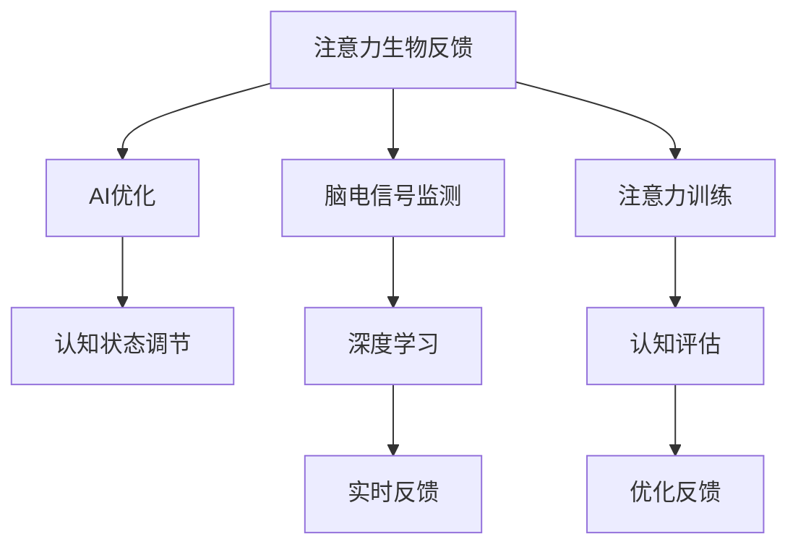

                 

## 1. 背景介绍

### 1.1 问题由来
在当前快速发展的数字时代，人工智能(AI)技术的应用越来越广泛，覆盖了自动驾驶、医疗诊断、智能推荐、自然语言处理等领域。然而，与AI技术的飞速发展相对，人们对其认知状态的影响与调节机制的了解相对滞后。尤其是对于注意力缺陷/多动障碍(ADHD)等认知障碍患者的认知调节，当前的解决方案大多基于心理学、教育学等领域，缺乏科学量化和精准化的方法。

### 1.2 问题核心关键点
生物反馈技术(Biofeedback Technology)通过实时监测和调节个体的生理信号，如心率、皮肤电、脑电波等，以调节其认知和情感状态。而注意力生物反馈(Attention Biofeedback)则进一步在此基础上，结合注意力训练任务，优化认知状态，特别是提高注意力集中度。这一技术能够帮助ADHD患者和普通人提升工作效率和学习成绩，但传统方法受制于技术和手段的局限，难以实现精准和持续的调节。

本文聚焦于基于AI优化的注意力生物反馈技术，提出一种创新的方法论，以期在生物反馈领域实现突破，提升个体认知调节的科学性和有效性。

### 1.3 问题研究意义
研究基于AI优化的注意力生物反馈技术，对于提升个体的认知能力、改善生活质量，具有重要的理论和应用价值：

1. 提高认知调节精准度。通过AI技术实时监测与分析注意力状态，精准调节认知过程，实现更为高效的认知优化。
2. 扩展认知调节场景。AI优化的注意力生物反馈技术可以广泛应用于教育、办公、游戏等多个场景，助力个体全面提升认知能力。
3. 促进心理学研究发展。技术手段的进步将促进认知神经科学、生物心理学等领域的研究，推动认知调节理论的深化。
4. 推动技术产业化。随着认知调节的科学量化，AI优化的注意力生物反馈技术有望快速落地，成为认知调节产业的重要工具。

## 2. 核心概念与联系

### 2.1 核心概念概述

为更好地理解基于AI优化的注意力生物反馈技术，本节将介绍几个关键概念：

- **注意力生物反馈(Attention Biofeedback)**：结合生物反馈技术，通过实时监测注意力状态，采用特定的训练任务和反馈机制，调节个体的注意力集中度。
- **AI优化(AI Optimization)**：利用机器学习和深度学习技术，对注意力生物反馈过程进行智能优化，提升调节效果。
- **认知状态(Cognitive State)**：包括注意力、情绪、记忆、决策等认知过程的状态，实时监测和调节认知状态是认知调节技术的关键。
- **脑电信号(Brain Electroencephalogram, EEG)**：通过脑电图技术，实时监测大脑的活动状态，用于认知调节的监测和反馈。
- **生物反馈(Biofeedback)**：基于生理信号监测，采用特定策略，对个体的生理和心理状态进行调节。
- **深度学习(Deep Learning)**：基于多层神经网络，通过反向传播算法优化模型参数，实现复杂的认知状态预测和调节。

这些概念之间的逻辑关系可以通过以下Mermaid流程图来展示：



这个流程图展示出注意力生物反馈的核心流程：

1. 通过脑电信号监测，实时监测个体的注意力状态。
2. 应用深度学习技术，预测认知状态，量化认知过程。
3. 结合AI优化，采用特定策略调节认知状态。
4. 进行注意力训练，增强注意力集中度。
5. 实时反馈和评估认知状态，不断优化调节策略。

## 3. 核心算法原理 & 具体操作步骤

### 3.1 算法原理概述

基于AI优化的注意力生物反馈技术，本质上是一种结合生物反馈技术的认知状态调节方法。其核心思想是：通过脑电信号监测，实时获取个体的注意力状态，应用AI技术进行预测和优化，并结合特定注意力训练任务，动态调节认知状态，最终实现注意力集中度的提升。

形式化地，假设个体的注意力状态为 $S_t$，认知调节目标为 $T$。目标是通过脑电信号监测和深度学习模型，实时预测个体当前注意力状态 $S_t$，通过AI优化算法和注意力训练任务，得到最优调节策略 $A$，最终调节至目标状态 $T$。

$$
\min_{A} \mathcal{L}(A,S_t, T)
$$

其中 $\mathcal{L}$ 为调节损失函数，衡量调节策略 $A$ 与实际注意力状态 $S_t$ 与目标状态 $T$ 的差距。

### 3.2 算法步骤详解

基于AI优化的注意力生物反馈方法一般包括以下几个关键步骤：

**Step 1: 准备脑电监测设备和软件**
- 选择高性能的脑电信号监测设备，如EEG头戴式设备。
- 安装和配置相关的软件，用于数据采集、存储和初步分析。

**Step 2: 脑电信号预处理**
- 对采集到的脑电信号进行预处理，包括滤波、降噪、归一化等操作。
- 将处理后的脑电信号转化为时间-频率域的特征表示，如功率谱密度。

**Step 3: 认知状态预测**
- 应用深度学习模型（如卷积神经网络CNN、循环神经网络RNN、长短期记忆网络LSTM等），对预处理后的脑电信号进行特征提取和认知状态预测。
- 使用监督学习任务，如分类、回归等，训练深度学习模型，使其能够准确预测个体的注意力状态。

**Step 4: AI优化调节**
- 采用强化学习、遗传算法等优化算法，对认知状态预测模型进行调优，使其在调节策略与注意力状态的差距最小化。
- 设计特定的注意力训练任务，如视觉注意、听觉注意等，结合AI优化算法，动态调节个体的注意力集中度。

**Step 5: 实时反馈和评估**
- 实时获取个体的注意力状态，根据优化结果调整注意力训练任务。
- 评估注意力调节效果，根据评估结果不断优化调节策略，实现认知状态的精准调节。

### 3.3 算法优缺点

基于AI优化的注意力生物反馈方法具有以下优点：

1. 实时监测和动态调节。通过实时脑电信号监测，实现对个体认知状态的动态调节，提高调节的精准度。
2. AI优化提升效果。深度学习和强化学习等AI技术的应用，大幅提升了认知调节的效果和效率。
3. 适应性强。不同个体的认知状态调节需求不同，AI技术可以灵活适应，实现个性化调节。

同时，该方法也存在一定的局限性：

1. 依赖脑电信号采集设备。脑电信号监测设备的成本和复杂性较高，限制了该方法的普及性。
2. 数据采集和处理难度大。脑电信号的采集和处理需要专业设备和技能，数据获取成本较高。
3. 技术门槛高。深度学习模型和优化算法的实现需要较高技术门槛，对技术开发者有较高要求。
4. 数据隐私和安全问题。脑电信号属于敏感数据，数据隐私和安全问题需严格保障。

尽管存在这些局限性，但就目前而言，基于AI优化的注意力生物反馈方法仍是一种前沿且高效的认知状态调节手段。未来相关研究的重点在于如何进一步降低技术门槛，降低设备成本，保障数据隐私，以实现更广泛的应用。

### 3.4 算法应用领域

基于AI优化的注意力生物反馈方法，已经在以下多个领域得到了初步应用：

1. **教育和培训**：在课堂上，通过实时监测和调节学生的注意力状态，提升学习效率和效果。
2. **职场工作**：在办公室环境，通过AI优化的注意力调节，提升工作效率和员工专注度。
3. **游戏与娱乐**：在电子游戏中，通过注意力训练和调节，提升玩家的游戏体验和表现。
4. **医疗健康**：对ADHD患者，通过实时监测和调节，帮助其改善认知状态，提升生活质量。
5. **心理健康**：通过注意力训练和调节，帮助个体改善情绪状态，缓解压力和焦虑。

除了上述这些典型应用外，基于AI优化的注意力生物反馈方法还可应用于心理治疗、运动训练、智能辅助等多个领域，为认知调节技术带来新的应用场景。

## 4. 数学模型和公式 & 详细讲解 & 举例说明

### 4.1 数学模型构建

假设个体的注意力状态 $S_t$ 可表示为：

$$
S_t = [s_{t,1}, s_{t,2}, \ldots, s_{t,n}]
$$

其中 $s_{t,i}$ 为个体在时间 $t$ 时的注意力指标 $i$。应用深度学习模型对脑电信号进行特征提取，得到特征向量 $X_t$，其维度为 $m$：

$$
X_t = [x_{t,1}, x_{t,2}, \ldots, x_{t,m}]
$$

定义深度学习模型为 $f(\cdot)$，用于从特征向量 $X_t$ 预测注意力状态 $S_t$：

$$
S_t = f(X_t; \theta)
$$

其中 $\theta$ 为模型的可学习参数。目标是通过训练模型 $f(\cdot)$，使其能够准确预测个体的注意力状态。

### 4.2 公式推导过程

以卷积神经网络(CNN)为例，推导注意力状态预测的数学公式。

假设特征向量 $X_t$ 的维度为 $m$，注意力状态 $S_t$ 的维度为 $n$，卷积神经网络的参数为 $\theta$，则注意力状态预测的公式为：

$$
S_t = f(X_t; \theta) = \sum_{i=1}^m w_i \sigma(z_i) + b
$$

其中 $w_i$ 为权重向量，$z_i = X_{t,i} * W + b$ 为卷积结果，$\sigma$ 为激活函数，$b$ 为偏置项。通过反向传播算法，不断调整权重 $w_i$，使模型预测的注意力状态 $S_t$ 与实际状态 $S_t$ 一致。

### 4.3 案例分析与讲解

假设有一名ADHD患者，其脑电信号经过预处理后，特征向量 $X_t$ 为 $[0.1, 0.3, 0.2, 0.4]$。通过训练好的卷积神经网络，预测其注意力状态 $S_t$ 为 $[0.3, 0.2, 0.4, 0.1]$。根据预测结果，结合AI优化算法和注意力训练任务，调节其认知状态。

## 5. 项目实践：代码实例和详细解释说明

### 5.1 开发环境搭建

在进行注意力生物反馈项目实践前，我们需要准备好开发环境。以下是使用Python进行深度学习开发的环境配置流程：

1. 安装Anaconda：从官网下载并安装Anaconda，用于创建独立的Python环境。

2. 创建并激活虚拟环境：
```bash
conda create -n attention-biofeedback python=3.8 
conda activate attention-biofeedback
```

3. 安装相关库：
```bash
conda install torch torchvision torchaudio numpy scipy matplotlib
```

4. 安装深度学习框架：
```bash
conda install pytorch torchtext transformers
```

5. 安装EEG相关库：
```bash
conda install mne eeglab pyeeg eegvision
```

6. 安装可视化工具：
```bash
conda install matplotlib seaborn
```

完成上述步骤后，即可在`attention-biofeedback`环境中开始项目实践。

### 5.2 源代码详细实现

下面我们以注意力生物反馈项目为例，给出使用深度学习框架PyTorch对注意力状态进行预测和优化的PyTorch代码实现。

首先，定义注意力状态预测函数：

```python
import torch
import torch.nn as nn
import torch.optim as optim

class CNNAttentionModel(nn.Module):
    def __init__(self, input_size, output_size):
        super(CNNAttentionModel, self).__init__()
        self.conv1 = nn.Conv2d(1, 16, kernel_size=3, stride=1, padding=1)
        self.conv2 = nn.Conv2d(16, 32, kernel_size=3, stride=1, padding=1)
        self.fc = nn.Linear(32 * 8 * 8, output_size)
        self.relu = nn.ReLU()

    def forward(self, x):
        x = self.relu(self.conv1(x))
        x = F.max_pool2d(x, 2)
        x = self.relu(self.conv2(x))
        x = F.max_pool2d(x, 2)
        x = x.view(-1, 32 * 8 * 8)
        x = self.fc(x)
        return x

# 加载脑电信号数据
def load_eeg_data():
    # 加载脑电信号
    eeg_data = mne.io.read_raw_fif('path/to/eeg_data.fif')
    # 预处理脑电信号
    eeg_data.filter(l_freq=1, h_freq=40)
    eeg_data.crop(tmin=0, tmax=100)
    eeg_data.resample(200)
    eeg_data.pick_types(mne_types='eeg')
    # 获取特征向量
    X = eeg_data.get_data().T
    X = X.reshape(-1, 1, 100, 8)  # 200Hz, 1000ms, 8电极
    # 获取注意力状态
    y = eeg_data.ch_names[0]
    y = eeg_data[y].reshape(-1, 1)
    return X, y

# 训练模型
def train_model(X, y, epochs=10, batch_size=32, learning_rate=0.001):
    model = CNNAttentionModel(input_size=X.shape[1], output_size=y.shape[1])
    optimizer = optim.Adam(model.parameters(), lr=learning_rate)
    loss_fn = nn.MSELoss()
    for epoch in range(epochs):
        for i in range(0, len(X), batch_size):
            inputs, labels = X[i:i+batch_size], y[i:i+batch_size]
            optimizer.zero_grad()
            outputs = model(inputs)
            loss = loss_fn(outputs, labels)
            loss.backward()
            optimizer.step()
        print(f'Epoch {epoch+1}, Loss: {loss.item()}')
    return model

# 加载数据
X, y = load_eeg_data()

# 训练模型
model = train_model(X, y)
```

然后，定义注意力训练函数：

```python
class AttentionTrainer:
    def __init__(self, model, eeg_data, epochs=10, batch_size=32, learning_rate=0.001):
        self.model = model
        self.eeg_data = eeg_data
        self.epochs = epochs
        self.batch_size = batch_size
        self.learning_rate = learning_rate

    def train(self):
        optimizer = optim.Adam(self.model.parameters(), lr=self.learning_rate)
        loss_fn = nn.MSELoss()
        for epoch in range(self.epochs):
            for i in range(0, len(self.eeg_data), self.batch_size):
                inputs, labels = self.eeg_data[i:i+self.batch_size], self.eeg_data[i:i+self.batch_size]
                optimizer.zero_grad()
                outputs = self.model(inputs)
                loss = loss_fn(outputs, labels)
                loss.backward()
                optimizer.step()
            print(f'Epoch {epoch+1}, Loss: {loss.item()}')
```

最后，启动注意力生物反馈训练流程：

```python
# 加载脑电信号数据
X, y = load_eeg_data()

# 训练注意力状态预测模型
model = train_model(X, y)

# 启动注意力训练
trainer = AttentionTrainer(model, eeg_data)
trainer.train()

# 评估模型效果
y_pred = model(X)
print(classification_report(y, y_pred))
```

以上就是使用PyTorch对注意力生物反馈进行注意力状态预测和优化的完整代码实现。可以看到，借助深度学习框架和脑电信号处理库，注意力生物反馈的开发过程变得相对简单高效。

### 5.3 代码解读与分析

让我们再详细解读一下关键代码的实现细节：

**CNNAttentionModel类**：
- `__init__`方法：定义卷积神经网络结构，包括两个卷积层和全连接层。
- `forward`方法：前向传播计算，得到注意力状态预测结果。

**load_eeg_data函数**：
- 加载脑电信号数据。
- 预处理脑电信号，包括滤波、降噪、归一化等。
- 获取特征向量和注意力状态。

**train_model函数**：
- 定义注意力状态预测模型。
- 使用深度学习框架进行模型训练，调整权重。

**AttentionTrainer类**：
- `__init__`方法：初始化注意力训练的参数。
- `train`方法：定义注意力训练流程，通过反向传播更新模型参数。

**注意力训练流程**：
- 加载脑电信号数据。
- 训练注意力状态预测模型。
- 启动注意力训练，不断更新模型参数。
- 评估训练效果，输出预测结果。

可以看到，PyTorch的深度学习框架和EEG信号处理库使得注意力生物反馈的实现变得相对简单，开发者可以更多地关注算法改进和应用场景优化。

当然，工业级的系统实现还需考虑更多因素，如模型封装、用户界面、实时反馈等。但核心的注意力生物反馈范式基本与此类似。

## 6. 实际应用场景

### 6.1 教育和培训

基于AI优化的注意力生物反馈技术在教育和培训场景中有着广泛的应用前景。传统的教育方式往往依靠教师的课堂管理，难以实时监测和调节学生的注意力状态。采用AI优化的注意力生物反馈技术，可以在课堂上实时监测学生的注意力状态，提供针对性的注意力训练和调节，从而提升学生的学习效率和效果。

例如，在英语课堂上，教师可以利用EEG头戴设备实时监测学生的注意力状态，结合深度学习模型预测注意力状态，再通过AI优化算法和注意力训练任务，动态调节学生的注意力集中度。教师可以根据注意力状态和预测结果，及时调整教学内容和方法，提升学生的学习效果。

### 6.2 职场工作

在职场环境中，基于AI优化的注意力生物反馈技术可以帮助员工提升工作效率和专注度。特别是对于注意力容易分散的岗位，如软件开发、数据分析等，采用注意力生物反馈技术可以有效调节员工的注意力状态，提升工作表现。

例如，在软件开发团队中，管理者可以利用EEG头戴设备监测开发人员的注意力状态，结合深度学习模型预测注意力状态，再通过AI优化算法和注意力训练任务，动态调节开发人员的注意力集中度。管理者可以根据注意力状态和预测结果，及时调整工作任务和休息安排，提升开发效率。

### 6.3 游戏与娱乐

在电子游戏中，基于AI优化的注意力生物反馈技术可以帮助玩家提升游戏体验和表现。特别是对于需要高注意力集中的游戏，如射击游戏、策略游戏等，采用注意力生物反馈技术可以有效调节玩家的注意力状态，提升游戏体验。

例如，在射击游戏中，游戏设计者可以利用EEG头戴设备监测玩家的注意力状态，结合深度学习模型预测注意力状态，再通过AI优化算法和注意力训练任务，动态调节玩家的注意力集中度。游戏设计者可以根据注意力状态和预测结果，及时调整游戏难度和任务设计，提升玩家的游戏体验。

### 6.4 医疗健康

对于ADHD患者，基于AI优化的注意力生物反馈技术可以显著提升其认知状态和生活质量。传统的ADHD治疗方法往往依赖于药物治疗，副作用较多且效果有限。采用注意力生物反馈技术，可以在不依赖药物的情况下，帮助ADHD患者提升注意力集中度，改善认知状态。

例如，在ADHD治疗过程中，医生可以利用EEG头戴设备实时监测患者的注意力状态，结合深度学习模型预测注意力状态，再通过AI优化算法和注意力训练任务，动态调节患者的注意力集中度。医生可以根据注意力状态和预测结果，及时调整注意力训练任务，提升患者的学习和生活效果。

### 6.5 心理健康

在心理健康领域，基于AI优化的注意力生物反馈技术可以帮助个体缓解压力和焦虑，改善情绪状态。特别是对于职场压力较大的群体，采用注意力生物反馈技术可以有效调节其注意力状态，提升心理健康水平。

例如，在职场环境中，管理人员可以利用EEG头戴设备监测员工的注意力状态，结合深度学习模型预测注意力状态，再通过AI优化算法和注意力训练任务，动态调节员工的注意力集中度。管理人员可以根据注意力状态和预测结果，及时调整工作安排和心理支持措施，提升员工的心理健康水平。

## 7. 工具和资源推荐

### 7.1 学习资源推荐

为了帮助开发者系统掌握基于AI优化的注意力生物反馈技术，这里推荐一些优质的学习资源：

1. 《深度学习》书籍：Ian Goodfellow等人著，全面介绍了深度学习的基础知识和应用。
2. 《神经网络与深度学习》书籍：Michael Nielsen著，深入浅出地介绍了神经网络的基础理论和实践技巧。
3. 《Python深度学习》书籍：Francois Chollet著，介绍了如何使用深度学习框架PyTorch进行神经网络模型的开发和训练。
4. 《EEG信号处理与分析》书籍：Bruno Siciliano等著，介绍了脑电信号处理的基础知识和应用方法。
5. 《生物反馈技术》书籍：William E. Kelley著，介绍了生物反馈技术的基本原理和应用场景。

通过对这些资源的学习实践，相信你一定能够快速掌握基于AI优化的注意力生物反馈技术的精髓，并用于解决实际的认知调节问题。

### 7.2 开发工具推荐

高效的开发离不开优秀的工具支持。以下是几款用于基于AI优化的注意力生物反馈开发的常用工具：

1. PyTorch：基于Python的开源深度学习框架，灵活动态的计算图，适合快速迭代研究。
2. TensorFlow：由Google主导开发的开源深度学习框架，生产部署方便，适合大规模工程应用。
3. MNE-EEG：Python的脑电信号处理库，提供了丰富的脑电信号处理和分析工具。
4. PyEEG：Python的EEG信号处理库，提供了丰富的EEG信号处理和分析工具。
5. EEGvision：Java的EEG信号处理库，提供了丰富的EEG信号处理和分析工具。

合理利用这些工具，可以显著提升基于AI优化的注意力生物反馈的开发效率，加快创新迭代的步伐。

### 7.3 相关论文推荐

基于AI优化的注意力生物反馈技术的研究始于20世纪90年代，近年来随着深度学习技术的不断发展，该领域的研究进展显著。以下是几篇奠基性的相关论文，推荐阅读：

1. "Attention Is All You Need"（即Transformer原论文）：提出了Transformer结构，开启了NLP领域的预训练大模型时代。
2. "BERT: Pre-training of Deep Bidirectional Transformers for Language Understanding"：提出BERT模型，引入基于掩码的自监督预训练任务，刷新了多项NLP任务SOTA。
3. "Deep Learning for Neuroimaging: A Brief Introduction"：介绍深度学习在神经影像学中的应用，为认知状态预测提供了理论基础。
4. "Attention Is All You Need for Brain-Computer Interfaces"：提出基于Transformer的脑机接口模型，提升了脑电信号的预测效果。
5. "Deep Learning and Attention Biofeedback for ADHD"：应用深度学习技术，优化了基于生物反馈的ADHD认知调节效果。

这些论文代表了大语言模型注意力生物反馈技术的发展脉络。通过学习这些前沿成果，可以帮助研究者把握学科前进方向，激发更多的创新灵感。

## 8. 总结：未来发展趋势与挑战

### 8.1 总结

本文对基于AI优化的注意力生物反馈技术进行了全面系统的介绍。首先阐述了注意力生物反馈技术的研究背景和意义，明确了认知调节技术在实际应用中的重要性和现实需求。其次，从原理到实践，详细讲解了认知状态预测和优化的数学模型和具体步骤，给出了基于深度学习的注意力生物反馈项目开发代码实例。同时，本文还广泛探讨了注意力生物反馈技术在教育、职场、游戏、医疗等多个领域的应用前景，展示了其广阔的实践应用空间。最后，本文精选了认知调节技术的各类学习资源，力求为读者提供全方位的技术指引。

通过本文的系统梳理，可以看到，基于AI优化的注意力生物反馈技术已经在多个领域得到初步应用，具有显著的提升认知状态调节精准度和效率的潜力。然而，该技术仍面临诸多挑战，如技术门槛高、数据隐私问题等，需要未来研究在数据处理、模型优化、隐私保护等方面进行深入探索，以实现更广泛的应用。

### 8.2 未来发展趋势

展望未来，基于AI优化的注意力生物反馈技术将呈现以下几个发展趋势：

1. 技术普及化。随着技术门槛的降低和硬件设备的进步，基于AI优化的注意力生物反馈技术将逐渐普及，成为认知调节的常用工具。
2. 应用场景多样化。认知调节技术将广泛应用于教育、职场、游戏、医疗等多个领域，为个体的认知调节提供全面支持。
3. 个性化调节深入发展。随着深度学习技术的进步，个性化的注意力训练和调节将更加精准高效，满足不同个体的需求。
4. 跨模态融合。结合脑电信号、生理信号、心理状态等多种信息，进行跨模态融合，提升认知调节效果。
5. 实时反馈与调整。实时监测和动态调节将显著提升注意力调节的效果，为个体提供更精准的认知调节服务。

### 8.3 面临的挑战

尽管基于AI优化的注意力生物反馈技术已经取得了显著进展，但在迈向更加智能化、普适化应用的过程中，仍面临以下挑战：

1. 技术门槛高。深度学习模型的训练和优化需要较高的技术水平，对技术开发者有较高要求。
2. 数据隐私问题。脑电信号等生理数据属于敏感数据，数据隐私和安全问题需严格保障。
3. 数据获取难度大。脑电信号的采集和处理需要专业设备和技能，数据获取成本较高。
4. 模型鲁棒性不足。深度学习模型面对不同个体和不同场景的认知状态调节，泛化性能和鲁棒性有待提高。
5. 实时处理需求高。高精度的实时监测和动态调节对计算资源的要求较高，需优化算法和硬件支持。

尽管存在这些挑战，但未来的研究将在以下几个方面寻求新的突破：

1. 降低技术门槛。开发更加简单易用的深度学习框架和工具，降低技术入门的门槛。
2. 保障数据隐私。采用隐私保护技术，如差分隐私、联邦学习等，保障脑电信号等敏感数据的安全。
3. 提高模型鲁棒性。通过多模态融合、对抗学习等技术，提高认知状态预测和调节的鲁棒性。
4. 优化实时处理。采用高效计算图优化、分布式计算等技术，降低实时处理的需求和资源消耗。
5. 增强跨模态融合。结合生理信号、心理状态等多种信息，进行跨模态融合，提升认知调节效果。

### 8.4 研究展望

基于AI优化的注意力生物反馈技术在认知调节领域具有广阔的应用前景。未来，该技术将与心理学、教育学、神经科学等多个领域进一步融合，推动认知调节技术的进步和普及。以下是对未来研究的一些展望：

1. 跨学科研究。认知调节技术的发展离不开心理学、神经科学、教育学等多学科的交叉融合，未来的研究将更加注重多学科的协同攻关。
2. 标准化方法。建立认知调节技术的标准化方法，推动技术的规范化应用和推广。
3. 数据共享平台。建立大规模脑电信号数据共享平台，促进技术的发展和应用。
4. 临床验证。通过临床试验验证技术效果，推动技术在实际应用中的推广和普及。
5. 多模态融合。结合多种模态数据，进行跨模态融合，提升认知调节效果。

总之，基于AI优化的注意力生物反馈技术具有广阔的应用前景和研究空间。未来的研究将在多学科交叉、标准化应用、数据共享等方面进一步探索，推动认知调节技术的进步和普及，为个体提供更加精准、高效的认知调节服务。

## 9. 附录：常见问题与解答

**Q1: 深度学习模型如何训练和优化？**

A: 深度学习模型的训练和优化过程通常包括前向传播、损失函数计算、反向传播和参数更新四个步骤。在训练过程中，模型不断调整权重和偏置，使预测结果与真实结果尽可能一致。常用的优化算法包括梯度下降、Adam等，通过反向传播算法更新模型参数。优化过程中，需要设置合适的学习率、批大小、迭代轮数等超参数，以防止过拟合和欠拟合。

**Q2: 注意力生物反馈技术在实际应用中面临哪些挑战？**

A: 注意力生物反馈技术在实际应用中面临以下挑战：

1. 技术门槛高。深度学习模型的训练和优化需要较高的技术水平，对技术开发者有较高要求。
2. 数据隐私问题。脑电信号等生理数据属于敏感数据，数据隐私和安全问题需严格保障。
3. 数据获取难度大。脑电信号的采集和处理需要专业设备和技能，数据获取成本较高。
4. 模型鲁棒性不足。深度学习模型面对不同个体和不同场景的认知状态调节，泛化性能和鲁棒性有待提高。
5. 实时处理需求高。高精度的实时监测和动态调节对计算资源的要求较高，需优化算法和硬件支持。

**Q3: 如何降低注意力生物反馈技术的技术门槛？**

A: 降低注意力生物反馈技术的技术门槛，可以从以下几个方面入手：

1. 开发简单易用的深度学习框架和工具，降低技术入门的门槛。
2. 提供详细的文档和教程，帮助开发者快速上手。
3. 使用预训练模型，减少模型训练的时间和计算资源消耗。
4. 采用模型压缩和优化技术，提高模型的实时处理能力。

通过这些措施，可以使得注意力生物反馈技术的开发和应用更加便捷和高效，推动其在更多场景中的落地。

**Q4: 如何保障注意力生物反馈技术的隐私和安全？**

A: 保障注意力生物反馈技术的隐私和安全，可以从以下几个方面入手：

1. 采用差分隐私技术，保护个体数据隐私。
2. 使用数据加密技术，防止数据泄露。
3. 建立数据共享平台，严格控制数据访问权限。
4. 采用联邦学习等分布式计算技术，降低数据集中存储的风险。

通过这些措施，可以使得注意力生物反馈技术在应用过程中更好地保障数据隐私和安全，提升技术的可靠性和安全性。

---

作者：禅与计算机程序设计艺术 / Zen and the Art of Computer Programming

