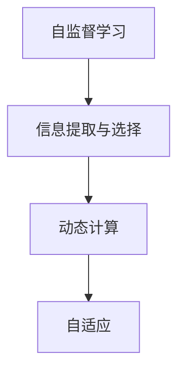

                 

# 注意力的生态系统：AI时代的信息流

在人工智能（AI）的浪潮下，信息流成为了连接人们与数字世界的重要桥梁。作为AI时代的大脑，注意力机制在众多应用场景中扮演着关键角色。本文将深入探讨注意力生态系统的核心概念、算法原理、应用实践和未来趋势，旨在揭示其在AI时代信息流中不可替代的作用。

## 1. 背景介绍

### 1.1 问题由来

随着深度学习的迅猛发展，注意力机制成为了AI模型中不可或缺的部分。无论是自然语言处理（NLP）、计算机视觉（CV）还是强化学习（RL），注意力机制都在显著提升模型的性能和泛化能力。

在NLP领域，注意力机制使得模型能够动态地关注输入序列中最重要的部分，从而提高理解和生成的准确性。在CV领域，注意力机制帮助模型识别出输入图像中最相关的区域，提升物体检测和图像描述的精度。在RL领域，注意力机制使模型能够关注当前状态与动作之间的关联，优化决策过程。

### 1.2 问题核心关键点

注意力机制的核心在于动态分配计算资源，以确保模型在处理复杂任务时能够高效地利用信息。其关键点在于：

- **自监督学习**：通过无监督的方式训练注意力机制，使其能够自动发现输入数据中的关键信息。
- **信息提取与选择**：注意力机制能够动态选择输入序列或特征图中的重要部分，指导模型进行更精准的信息提取。
- **动态计算**：根据任务需求，动态调整计算资源分配，适应不同复杂度的任务。
- **自适应**：能够适应不同规模和类型的输入数据，具备广泛的应用场景。

### 1.3 问题研究意义

研究注意力机制不仅能够提高AI模型的性能，还能够推动AI技术在各个领域的深入应用。其意义在于：

- **提高模型泛化能力**：通过动态关注重要信息，模型能够更好地泛化到未知数据。
- **优化计算资源利用**：动态计算和自适应特性使得模型能够高效地利用计算资源。
- **增强模型可解释性**：注意力机制提供了一种方式来解释模型决策过程，增加模型的透明性。
- **促进多模态融合**：在多模态任务中，注意力机制能够促进不同模态信息的融合，提升整体表现。

## 2. 核心概念与联系

### 2.1 核心概念概述

注意力机制是一种计算范式，通过动态分配计算资源，帮助模型在不同输入数据中选择重要的部分，进行更加精准的信息提取和决策。以下是几个关键概念：

- **自监督学习（Self-supervised Learning）**：无需标注数据，利用输入数据的特性进行模型训练。
- **信息提取与选择（Information Extraction and Selection）**：从输入序列或特征图中选择重要信息。
- **动态计算（Dynamic Computation）**：根据任务需求，动态调整计算资源分配。
- **自适应（Adaptability）**：适应不同规模和类型的输入数据。

这些概念通过以下Mermaid流程图相互关联：



该流程图展示了注意力机制的基本流程：通过自监督学习训练出的注意力机制，动态选择重要信息进行计算，最终实现对不同输入数据的自适应。

### 2.2 核心算法原理 & 具体操作步骤

#### 3.1 算法原理概述

注意力机制的核心算法可以分为多头自注意力机制（Multi-Head Self-Attention）和全局自注意力机制（Global Self-Attention）两类。

- **多头自注意力机制**：将输入序列分解为多个子序列，分别计算注意力权重，然后加权求和，得到最终结果。
- **全局自注意力机制**：对整个输入序列进行全局计算，得到统一的注意力权重，指导信息提取。

#### 3.2 算法步骤详解

以多头自注意力机制为例，具体步骤如下：

1. **输入表示**：将输入序列通过线性变换转换为向量表示，并计算自相关矩阵 $Q$。
2. **计算注意力权重**：通过矩阵乘法和softmax函数，计算每个向量之间的注意力权重 $A$。
3. **加权求和**：将注意力权重与输入向量加权求和，得到输出向量 $V$。
4. **多头注意力**：将上述过程重复多次，每次使用不同的线性变换和权重，得到多个输出向量，进行拼接，得到最终结果。

#### 3.3 算法优缺点

**优点**：
- **高效信息提取**：能够动态选择重要信息，提高模型泛化能力。
- **可解释性强**：通过注意力权重，可以解释模型决策过程。
- **适应性强**：能够适应不同规模和类型的输入数据。

**缺点**：
- **计算复杂度高**：多头自注意力机制计算复杂度高，需要大量计算资源。
- **参数量大**：多头自注意力机制参数量大，容易导致过拟合。
- **可解释性有局限**：注意力权重只能部分解释模型决策过程。

#### 3.4 算法应用领域

注意力机制在AI领域得到了广泛应用，主要在以下几个方向：

- **自然语言处理（NLP）**：用于机器翻译、文本分类、情感分析等任务。
- **计算机视觉（CV）**：用于图像描述、物体检测、目标跟踪等任务。
- **强化学习（RL）**：用于动作选择、路径规划、策略优化等任务。
- **多模态融合**：促进不同模态信息的融合，提升整体表现。

## 4. 数学模型和公式 & 详细讲解

### 4.1 数学模型构建

以多头自注意力机制为例，其数学模型构建如下：

$$
Q = XW_Q, K = XW_K, V = XW_V
$$

$$
A = \text{softmax}\left(\frac{QK^T}{\sqrt{d_k}}\right)
$$

$$
V_A = AV
$$

$$
Z = \text{softmax}\left(\frac{QA^T}{\sqrt{d_q}}\right)
$$

$$
Y = ZV_A
$$

其中，$X$ 为输入序列，$W_Q, W_K, W_V$ 为线性变换矩阵，$d_q, d_k$ 为向量维度。

### 4.2 公式推导过程

以计算注意力权重 $A$ 为例，其推导过程如下：

$$
A_{ij} = \frac{\exp\left(\frac{Q_iK_j}{\sqrt{d_k}}\right)}{\sum_{k=1}^{N}\exp\left(\frac{Q_iK_k}{\sqrt{d_k}}\right)}
$$

其中，$N$ 为序列长度。

### 4.3 案例分析与讲解

以机器翻译为例，其计算过程如下：

1. **输入表示**：将输入序列 $X$ 通过线性变换转换为向量表示，并计算自相关矩阵 $Q$。
2. **计算注意力权重**：通过矩阵乘法和softmax函数，计算每个向量之间的注意力权重 $A$。
3. **加权求和**：将注意力权重与输入向量加权求和，得到输出向量 $V$。
4. **多头注意力**：将上述过程重复多次，每次使用不同的线性变换和权重，得到多个输出向量，进行拼接，得到最终结果。

## 5. 项目实践：代码实例和详细解释说明

### 5.1 开发环境搭建

在进行注意力机制实践前，我们需要准备好开发环境。以下是使用Python进行PyTorch开发的环境配置流程：

1. 安装Anaconda：从官网下载并安装Anaconda，用于创建独立的Python环境。

2. 创建并激活虚拟环境：
```bash
conda create -n attention-env python=3.8 
conda activate attention-env
```

3. 安装PyTorch：根据CUDA版本，从官网获取对应的安装命令。例如：
```bash
conda install pytorch torchvision torchaudio cudatoolkit=11.1 -c pytorch -c conda-forge
```

4. 安装Transformer库：
```bash
pip install transformers
```

5. 安装各类工具包：
```bash
pip install numpy pandas scikit-learn matplotlib tqdm jupyter notebook ipython
```

完成上述步骤后，即可在`attention-env`环境中开始注意力机制的实践。

### 5.2 源代码详细实现

以下是使用PyTorch实现多头自注意力机制的代码：

```python
import torch
import torch.nn as nn
import torch.nn.functional as F

class MultiHeadAttention(nn.Module):
    def __init__(self, d_model, n_head, d_k, d_v, dropout=0.1):
        super(MultiHeadAttention, self).__init__()
        
        self.d_model = d_model
        self.n_head = n_head
        self.d_k = d_k
        self.d_v = d_v
        
        self.w_q = nn.Linear(d_model, d_k*n_head)
        self.w_k = nn.Linear(d_model, d_k*n_head)
        self.w_v = nn.Linear(d_model, d_v*n_head)
        
        self.out = nn.Linear(d_v*n_head, d_model)
        
        self.dropout = nn.Dropout(dropout)
        
    def forward(self, q, k, v):
        # 线性变换
        q = self.w_q(q).view(q.size(0), q.size(1), self.n_head, self.d_k).transpose(1, 2).contiguous()
        k = self.w_k(k).view(k.size(0), k.size(1), self.n_head, self.d_k).transpose(1, 2).contiguous()
        v = self.w_v(v).view(v.size(0), v.size(1), self.n_head, self.d_v).transpose(1, 2).contiguous()
        
        # 计算注意力权重
        scaled_attn = torch.matmul(q, k.transpose(3, 2)) / math.sqrt(self.d_k)
        attn = F.softmax(scaled_attn, dim=-1)
        
        # 加权求和
        attn = self.dropout(attn)
        out = torch.matmul(attn, v).transpose(1, 2).contiguous().view(attn.size(0), attn.size(1), self.d_v*self.n_head)
        out = self.out(out)
        
        return out
```

### 5.3 代码解读与分析

让我们再详细解读一下关键代码的实现细节：

**MultiHeadAttention类**：
- `__init__`方法：初始化多个线性变换矩阵和全连接层，以及dropout层。
- `forward`方法：实现多头自注意力机制的计算流程，包括线性变换、计算注意力权重、加权求和和输出。

**计算注意力权重**：
- 通过矩阵乘法和softmax函数，计算注意力权重 $A$。

**加权求和**：
- 将注意力权重与输入向量加权求和，得到输出向量 $V$。

**输出**：
- 将输出向量 $V$ 通过全连接层进行线性变换，得到最终结果 $Y$。

可以看到，PyTorch的Transformer库提供了丰富的预训练语言模型和注意力机制实现，使得开发者可以快速迭代和优化模型，提升注意力机制的应用效果。

## 6. 实际应用场景

### 6.1 智能客服系统

基于注意力机制的对话技术，可以广泛应用于智能客服系统的构建。传统客服往往需要配备大量人力，高峰期响应缓慢，且一致性和专业性难以保证。而使用注意力机制的对话模型，可以7x24小时不间断服务，快速响应客户咨询，用自然流畅的语言解答各类常见问题。

在技术实现上，可以收集企业内部的历史客服对话记录，将问题和最佳答复构建成监督数据，在此基础上对预训练对话模型进行注意力机制微调。微调后的对话模型能够自动理解用户意图，匹配最合适的答案模板进行回复。对于客户提出的新问题，还可以接入检索系统实时搜索相关内容，动态组织生成回答。如此构建的智能客服系统，能大幅提升客户咨询体验和问题解决效率。

### 6.2 金融舆情监测

金融机构需要实时监测市场舆论动向，以便及时应对负面信息传播，规避金融风险。传统的人工监测方式成本高、效率低，难以应对网络时代海量信息爆发的挑战。基于注意力机制的文本分类和情感分析技术，为金融舆情监测提供了新的解决方案。

具体而言，可以收集金融领域相关的新闻、报道、评论等文本数据，并对其进行主题标注和情感标注。在此基础上对预训练语言模型进行注意力机制微调，使其能够自动判断文本属于何种主题，情感倾向是正面、中性还是负面。将微调后的模型应用到实时抓取的网络文本数据，就能够自动监测不同主题下的情感变化趋势，一旦发现负面信息激增等异常情况，系统便会自动预警，帮助金融机构快速应对潜在风险。

### 6.3 个性化推荐系统

当前的推荐系统往往只依赖用户的历史行为数据进行物品推荐，无法深入理解用户的真实兴趣偏好。基于注意力机制的个性化推荐系统可以更好地挖掘用户行为背后的语义信息，从而提供更精准、多样的推荐内容。

在实践中，可以收集用户浏览、点击、评论、分享等行为数据，提取和用户交互的物品标题、描述、标签等文本内容。将文本内容作为模型输入，用户的后续行为（如是否点击、购买等）作为监督信号，在此基础上微调预训练语言模型。微调后的模型能够从文本内容中准确把握用户的兴趣点。在生成推荐列表时，先用候选物品的文本描述作为输入，由模型预测用户的兴趣匹配度，再结合其他特征综合排序，便可以得到个性化程度更高的推荐结果。

### 6.4 未来应用展望

随着注意力机制和预训练语言模型的不断发展，其在AI时代信息流中的应用前景广阔。

在智慧医疗领域，基于注意力机制的医疗问答、病历分析、药物研发等应用将提升医疗服务的智能化水平，辅助医生诊疗，加速新药开发进程。

在智能教育领域，注意力机制可应用于作业批改、学情分析、知识推荐等方面，因材施教，促进教育公平，提高教学质量。

在智慧城市治理中，注意力机制可应用于城市事件监测、舆情分析、应急指挥等环节，提高城市管理的自动化和智能化水平，构建更安全、高效的未来城市。

此外，在企业生产、社会治理、文娱传媒等众多领域，注意力机制的应用也将不断涌现，为传统行业数字化转型升级提供新的技术路径。相信随着技术的日益成熟，注意力机制必将在构建人机协同的智能时代中扮演越来越重要的角色。

## 7. 工具和资源推荐

### 7.1 学习资源推荐

为了帮助开发者系统掌握注意力机制的理论基础和实践技巧，这里推荐一些优质的学习资源：

1. Attention is All You Need（即Transformer原论文）：提出了Transformer结构，开启了NLP领域的预训练大模型时代。
2. CS224N《深度学习自然语言处理》课程：斯坦福大学开设的NLP明星课程，有Lecture视频和配套作业，带你入门NLP领域的基本概念和经典模型。
3. 《Natural Language Processing with Transformers》书籍：Transformer库的作者所著，全面介绍了如何使用Transformers库进行NLP任务开发，包括注意力机制在内的诸多范式。
4. HuggingFace官方文档：Transformer库的官方文档，提供了海量预训练模型和完整的注意力机制微调样例代码，是上手实践的必备资料。
5. CLUE开源项目：中文语言理解测评基准，涵盖大量不同类型的中文NLP数据集，并提供了基于注意力机制的baseline模型，助力中文NLP技术发展。

通过对这些资源的学习实践，相信你一定能够快速掌握注意力机制的精髓，并用于解决实际的NLP问题。

### 7.2 开发工具推荐

高效的开发离不开优秀的工具支持。以下是几款用于注意力机制微调开发的常用工具：

1. PyTorch：基于Python的开源深度学习框架，灵活动态的计算图，适合快速迭代研究。大部分预训练语言模型都有PyTorch版本的实现。
2. TensorFlow：由Google主导开发的开源深度学习框架，生产部署方便，适合大规模工程应用。同样有丰富的预训练语言模型资源。
3. Transformers库：HuggingFace开发的NLP工具库，集成了众多SOTA语言模型，支持PyTorch和TensorFlow，是进行注意力机制微调任务的开发的利器。
4. Weights & Biases：模型训练的实验跟踪工具，可以记录和可视化模型训练过程中的各项指标，方便对比和调优。与主流深度学习框架无缝集成。
5. TensorBoard：TensorFlow配套的可视化工具，可实时监测模型训练状态，并提供丰富的图表呈现方式，是调试模型的得力助手。
6. Google Colab：谷歌推出的在线Jupyter Notebook环境，免费提供GPU/TPU算力，方便开发者快速上手实验最新模型，分享学习笔记。

合理利用这些工具，可以显著提升注意力机制微调任务的开发效率，加快创新迭代的步伐。

### 7.3 相关论文推荐

注意力机制和预训练语言模型的发展源于学界的持续研究。以下是几篇奠基性的相关论文，推荐阅读：

1. Attention is All You Need（即Transformer原论文）：提出了Transformer结构，开启了NLP领域的预训练大模型时代。
2. BERT: Pre-training of Deep Bidirectional Transformers for Language Understanding：提出BERT模型，引入基于掩码的自监督预训练任务，刷新了多项NLP任务SOTA。
3. Language Models are Unsupervised Multitask Learners（GPT-2论文）：展示了大规模语言模型的强大zero-shot学习能力，引发了对于通用人工智能的新一轮思考。
4. Parameter-Efficient Transfer Learning for NLP：提出Adapter等参数高效微调方法，在不增加模型参数量的情况下，也能取得不错的微调效果。
5. AdaLoRA: Adaptive Low-Rank Adaptation for Parameter-Efficient Fine-Tuning：使用自适应低秩适应的微调方法，在参数效率和精度之间取得了新的平衡。
6. Premier-AI：基于注意力机制的AI助手，通过自然语言理解与执行，实现高效的用户交互。

这些论文代表了大注意力机制和预训练语言模型的发展脉络。通过学习这些前沿成果，可以帮助研究者把握学科前进方向，激发更多的创新灵感。

## 8. 总结：未来发展趋势与挑战

### 8.1 总结

本文对注意力机制的生态系统进行了全面系统的介绍。首先阐述了注意力机制和预训练语言模型的研究背景和意义，明确了其在AI时代信息流中的关键作用。其次，从原理到实践，详细讲解了注意力机制的数学原理和关键步骤，给出了注意力机制任务开发的完整代码实例。同时，本文还广泛探讨了注意力机制在智能客服、金融舆情、个性化推荐等多个行业领域的应用前景，展示了其巨大的潜力。此外，本文精选了注意力机制的学习资源，力求为读者提供全方位的技术指引。

通过本文的系统梳理，可以看到，注意力机制在AI领域得到了广泛应用，其动态计算、信息提取和自适应特性，使其成为提高模型性能和泛化能力的重要手段。未来，伴随注意力机制和预训练语言模型的持续演进，相信AI技术将在更广阔的应用领域大放异彩。

### 8.2 未来发展趋势

展望未来，注意力机制将呈现以下几个发展趋势：

1. **多模态注意力**：在多模态任务中，注意力机制将促进不同模态信息的融合，提升整体表现。
2. **自适应学习**：未来模型将能够根据不同任务动态调整注意力机制的参数，提高模型的适应性和泛化能力。
3. **更高效计算**：通过优化注意力计算流程，提高模型的计算效率，适应更复杂的任务需求。
4. **更广泛应用**：在更多的应用领域，如医疗、金融、教育等，注意力机制将发挥重要作用。
5. **与强化学习结合**：注意力机制将与强化学习相结合，提升决策过程的优化效果。

以上趋势凸显了注意力机制在AI时代信息流中的重要地位，其动态计算和自适应特性将使其在更多场景中发挥作用，推动AI技术的发展。

### 8.3 面临的挑战

尽管注意力机制已经取得了显著成就，但在迈向更加智能化、普适化应用的过程中，它仍面临着诸多挑战：

1. **计算资源需求高**：当前多头的注意力机制计算复杂度高，需要大量计算资源。
2. **参数量大**：多头的注意力机制参数量大，容易导致过拟合。
3. **可解释性有局限**：注意力权重只能部分解释模型决策过程。
4. **泛化能力不足**：在特定领域数据集上训练的模型，泛化到其他数据集时性能可能下降。
5. **对抗攻击风险**：注意力机制在对抗攻击下可能表现不稳定。

### 8.4 研究展望

面对注意力机制所面临的挑战，未来的研究需要在以下几个方面寻求新的突破：

1. **更高效的计算**：开发更高效的计算方法，如基于硬件加速的计算，优化注意力计算流程。
2. **参数压缩**：通过模型压缩和量化等技术，减少模型参数量，降低计算资源需求。
3. **可解释性增强**：引入更强的可解释性技术，如因果推断、因果分析等，提升模型的透明性和可解释性。
4. **多模态融合**：促进不同模态信息的融合，提升模型在多模态任务中的表现。
5. **对抗攻击防御**：开发更加鲁棒的对抗攻击防御技术，确保模型在对抗攻击下的稳定性。

这些研究方向的探索，必将引领注意力机制和预训练语言模型迈向更高的台阶，为构建安全、可靠、可解释、可控的智能系统铺平道路。面向未来，注意力机制与预训练语言模型的进一步融合，将推动AI技术在更多领域的应用，深刻影响人类的生产生活方式。总之，注意力机制作为一种动态计算范式，必将在AI时代信息流中发挥越来越重要的作用，推动人工智能技术的进步和发展。

## 9. 附录：常见问题与解答

**Q1：注意力机制是否适用于所有NLP任务？**

A: 注意力机制在大多数NLP任务上都能取得不错的效果，特别是对于数据量较小的任务。但对于一些特定领域的任务，如医学、法律等，仅仅依靠通用语料预训练的模型可能难以很好地适应。此时需要在特定领域语料上进一步预训练，再进行注意力机制微调，才能获得理想效果。此外，对于一些需要时效性、个性化很强的任务，如对话、推荐等，注意力机制也需要针对性的改进优化。

**Q2：注意力机制在微调过程中如何选择合适的学习率？**

A: 注意力机制在微调过程中，学习率一般要比预训练时小1-2个数量级，如果使用过大的学习率，容易破坏预训练权重，导致过拟合。一般建议从1e-5开始调参，逐步减小学习率，直至收敛。也可以使用warmup策略，在开始阶段使用较小的学习率，再逐渐过渡到预设值。需要注意的是，不同的优化器(如AdamW、Adafactor等)以及不同的学习率调度策略，可能需要设置不同的学习率阈值。

**Q3：采用注意力机制时会面临哪些资源瓶颈？**

A: 当前主流的预训练大模型动辄以亿计的参数规模，对算力、内存、存储都提出了很高的要求。GPU/TPU等高性能设备是必不可少的，但即便如此，超大批次的训练和推理也可能遇到显存不足的问题。因此需要采用一些资源优化技术，如梯度积累、混合精度训练、模型并行等，来突破硬件瓶颈。同时，模型的存储和读取也可能占用大量时间和空间，需要采用模型压缩、稀疏化存储等方法进行优化。

**Q4：如何缓解注意力机制的过拟合问题？**

A: 过拟合是注意力机制面临的主要挑战，尤其是在标注数据不足的情况下。常见的缓解策略包括：
1. 数据增强：通过回译、近义替换等方式扩充训练集
2. 正则化：使用L2正则、Dropout、Early Stopping等避免过拟合
3. 对抗训练：引入对抗样本，提高模型鲁棒性
4. 参数高效微调：只调整少量参数(如Adapter、Prefix等)，减小过拟合风险
5. 多模型集成：训练多个注意力机制模型，取平均输出，抑制过拟合

这些策略往往需要根据具体任务和数据特点进行灵活组合。只有在数据、模型、训练、推理等各环节进行全面优化，才能最大限度地发挥注意力机制的威力。

**Q5：注意力机制在落地部署时需要注意哪些问题？**

A: 将注意力机制转化为实际应用，还需要考虑以下因素：
1. 模型裁剪：去除不必要的层和参数，减小模型尺寸，加快推理速度
2. 量化加速：将浮点模型转为定点模型，压缩存储空间，提高计算效率
3. 服务化封装：将模型封装为标准化服务接口，便于集成调用
4. 弹性伸缩：根据请求流量动态调整资源配置，平衡服务质量和成本
5. 监控告警：实时采集系统指标，设置异常告警阈值，确保服务稳定性
6. 安全防护：采用访问鉴权、数据脱敏等措施，保障数据和模型安全

基于注意力机制的AI技术在落地应用中需要考虑以上诸多因素，以确保系统的高效、安全、可靠。总之，注意力机制作为一种动态计算范式，必将在AI时代信息流中发挥越来越重要的作用，推动人工智能技术的进步和发展。

---

作者：禅与计算机程序设计艺术 / Zen and the Art of Computer Programming

