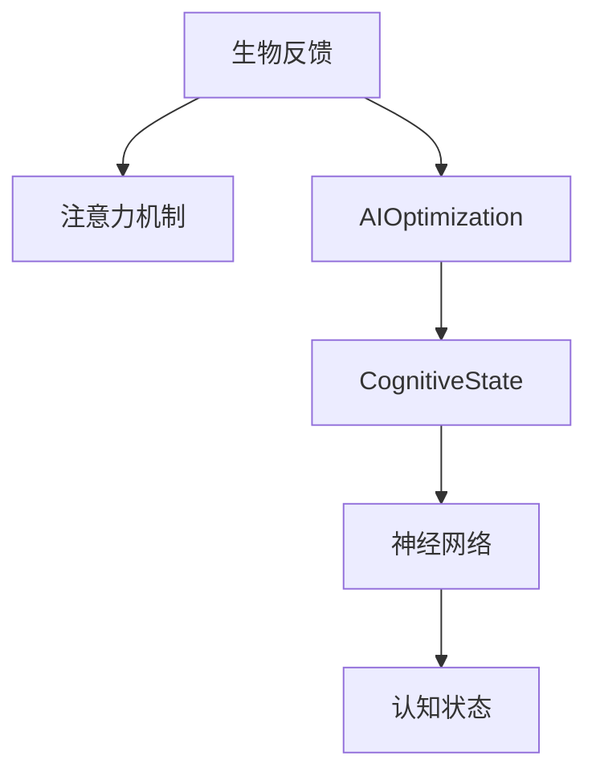

                 

# 注意力的生物反馈：AI优化的认知状态

> 关键词：生物反馈, 注意力, AI优化, 认知状态, 深度学习, 神经网络

## 1. 背景介绍

### 1.1 问题由来

在现代社会，人工智能(AI)的应用日益广泛，深度学习、神经网络等技术逐渐成为推动AI发展的核心力量。然而，随着模型规模的增大，模型的训练和推理过程变得异常耗时，且对计算资源的依赖性也越来越高。与此同时，由于深度神经网络的结构复杂，模型的可解释性和稳定性也成为一大挑战。如何提高AI系统的计算效率、提升模型性能、增强其稳定性与可解释性，成为当前AI研究领域的核心问题。

### 1.2 问题核心关键点

在AI系统中，注意力机制（Attention Mechanism）是其重要的组成部分之一。注意力机制通过动态地分配资源（如计算资源和时间），使模型能够更有效地处理输入数据，尤其是在处理长序列数据时表现出强大的能力。然而，现有的注意力机制大多关注于算法层面的优化，忽略了其生物反馈机制。生物反馈机制，即通过对注意力机制的优化，使得模型能够更高效地处理任务，并减少计算资源消耗。

本文聚焦于生物反馈机制在AI优化中的作用，旨在探讨如何通过优化注意力机制，实现AI系统的计算效率和性能的提升，同时增强其可解释性和稳定性。

## 2. 核心概念与联系

### 2.1 核心概念概述

为更好地理解生物反馈在AI优化中的作用，本节将介绍几个关键概念：

- 生物反馈（Biofeedback）：指通过控制并接收来自生理或行为系统的信号，调整系统参数以达到最佳性能的方法。在AI领域，生物反馈通常用于提升系统的计算效率和稳定性，减少计算资源消耗。
- 注意力机制（Attention Mechanism）：指在神经网络中，通过动态分配资源（如计算资源和时间），使模型能够更有效地处理输入数据。注意力机制在自然语言处理、计算机视觉、推荐系统等领域得到了广泛应用。
- AI优化：指通过优化算法和模型结构，提高AI系统的计算效率、性能和可解释性。AI优化是当前AI研究领域的一个重要方向。
- 认知状态（Cognitive State）：指人类在处理信息时所处的状态，包括注意力、情绪、动机等。认知状态对AI系统的优化具有重要意义。
- 神经网络（Neural Network）：一种模拟人脑神经元之间连接的网络结构，通过学习训练数据来处理输入，输出结果。神经网络是AI系统中的核心组成部分。

这些概念之间的逻辑关系可以通过以下Mermaid流程图来展示：



这个流程图展示了生物反馈、注意力机制、AI优化、认知状态与神经网络之间的联系：

1. 生物反馈通过对注意力机制的优化，提高AI系统的计算效率。
2. 注意力机制通过动态分配资源，使神经网络能够更有效地处理输入数据。
3. AI优化通过优化算法和模型结构，提高系统的性能和可解释性。
4. 认知状态反映了人类处理信息时的状态，对AI系统的优化有重要影响。
5. 神经网络是AI系统的核心组成部分，负责输入数据的处理和输出结果的生成。

这些概念共同构成了AI优化的技术框架，使得AI系统能够在各种场景下发挥出强大的计算能力和高效的处理能力。

## 3. 核心算法原理 & 具体操作步骤
### 3.1 算法原理概述

生物反馈在AI优化中的核心思想是：通过控制并接收来自注意力机制的信号，动态调整系统的参数，以实现系统的计算效率和性能的提升。具体而言，生物反馈机制通过以下几个步骤来实现：

1. 收集注意力机制的信号。
2. 根据信号，动态调整模型的参数。
3. 通过不断优化，实现系统的计算效率和性能的提升。

在深度学习中，注意力机制通常用于自注意力机制（Self-Attention Mechanism）和交叉注意力机制（Cross-Attention Mechanism）。自注意力机制通过计算输入序列中各个元素之间的关系，动态地分配计算资源，使其更高效地处理输入。而交叉注意力机制则用于将不同序列的元素进行关联，通常用于机器翻译、文本生成等任务。

### 3.2 算法步骤详解

生物反馈在AI优化中的具体操作可以分为以下几个步骤：

**Step 1: 收集注意力信号**

在深度学习中，注意力信号通常通过注意力权重（Attention Weights）来体现。注意力权重表示模型对输入序列中各个元素的关注程度，其值越大表示该元素对输出的影响越大。注意力权重可以通过softmax函数进行计算：

$$
\alpha_i = \frac{\exp(e_{i,j}^T W)}{\sum_{j=1}^N \exp(e_{i,j}^T W)}
$$

其中，$e_{i,j}$为模型对输入序列中元素$j$与元素$i$之间的关系表示向量，$W$为注意力权重向量，$N$为输入序列的长度。

**Step 2: 动态调整模型参数**

在收集到注意力信号后，下一步是通过生物反馈机制动态调整模型的参数。这通常涉及到以下几种策略：

1. 控制计算资源分配：通过对注意力权重进行调整，使得模型能够动态地分配计算资源，减少不必要的计算，提高计算效率。
2. 优化注意力分布：通过调整注意力权重，使得模型能够更均匀地分配注意力，减少局部过拟合的风险。
3. 调整神经元激活：通过对神经元激活进行控制，使得模型能够更高效地处理输入数据。

**Step 3: 优化计算效率和性能**

在完成参数调整后，下一步是不断优化模型，使其计算效率和性能得到提升。这通常涉及到以下几个方面：

1. 模型压缩：通过对模型进行剪枝、量化等操作，减少模型参数量，提高计算效率。
2. 模型融合：通过将多个模型的输出进行融合，提高系统的稳定性和泛化能力。
3. 模型优化：通过优化算法和模型结构，提升系统的性能和可解释性。

### 3.3 算法优缺点

生物反馈在AI优化中的优缺点如下：

**优点**

1. 提高计算效率：通过动态调整计算资源的分配，减少不必要的计算，提高计算效率。
2. 优化注意力分布：通过调整注意力权重，使得模型能够更均匀地分配注意力，减少局部过拟合的风险。
3. 增强模型稳定性：通过调整神经元激活，使得模型能够更高效地处理输入数据，提高系统的稳定性和泛化能力。

**缺点**

1. 参数调整复杂：生物反馈机制的参数调整需要考虑多种因素，如注意力权重、神经元激活等，调整过程较为复杂。
2. 计算资源消耗：生物反馈机制通常需要额外的计算资源进行信号收集和参数调整，增加系统的计算负担。
3. 模型可解释性：生物反馈机制虽然能够提升系统的性能和稳定性，但可能使得模型的可解释性降低。

### 3.4 算法应用领域

生物反馈在AI优化中的主要应用领域包括：

1. 自然语言处理（NLP）：用于优化机器翻译、文本生成、问答系统等任务中的注意力机制，提高系统的计算效率和性能。
2. 计算机视觉（CV）：用于优化图像分类、目标检测、图像生成等任务中的注意力机制，减少计算资源消耗，提高系统的性能。
3. 推荐系统：用于优化推荐模型中的注意力机制，提高系统的推荐精度和用户满意度。
4. 语音识别：用于优化语音识别系统中的注意力机制，提高系统的计算效率和识别准确率。

## 4. 数学模型和公式 & 详细讲解  
### 4.1 数学模型构建

生物反馈在AI优化中的数学模型主要涉及以下几个方面：

- 注意力机制的计算
- 注意力权重的优化
- 神经元激活的控制

以下我们将分别对这三个方面进行详细讲解。

### 4.2 公式推导过程

**注意力机制的计算**

注意力机制的计算公式如下：

$$
\alpha_i = \frac{\exp(e_{i,j}^T W)}{\sum_{j=1}^N \exp(e_{i,j}^T W)}
$$

其中，$e_{i,j}$为模型对输入序列中元素$j$与元素$i$之间的关系表示向量，$W$为注意力权重向量，$N$为输入序列的长度。

**注意力权重的优化**

注意力权重的优化通常涉及以下几种策略：

1. 调整权重系数：通过对权重系数进行调整，使得模型能够更均匀地分配注意力，减少局部过拟合的风险。
2. 引入正则化：通过引入L2正则化等正则化方法，防止权重过大，导致过拟合。
3. 使用对抗训练：通过引入对抗样本，提高模型的鲁棒性，减少过拟合的风险。

**神经元激活的控制**

神经元激活的控制通常涉及以下几种策略：

1. 引入激活函数：通过对激活函数的选择，使得模型能够更高效地处理输入数据。
2. 控制激活强度：通过对激活强度进行调整，使得模型能够更好地处理不同类型的输入数据。
3. 使用归一化技术：通过引入归一化技术，如批量归一化（Batch Normalization），提高模型的稳定性和泛化能力。

### 4.3 案例分析与讲解

以下我们将通过几个具体的案例，来进一步解释生物反馈在AI优化中的实际应用。

**案例一：自然语言处理中的注意力机制优化**

在自然语言处理中，自注意力机制（Self-Attention Mechanism）和交叉注意力机制（Cross-Attention Mechanism）被广泛应用于机器翻译、文本生成等任务中。通过对注意力权重进行调整，可以提高系统的计算效率和性能。例如，在机器翻译任务中，可以通过控制注意力权重，使得模型能够更高效地处理输入序列，减少不必要的计算。

**案例二：计算机视觉中的注意力机制优化**

在计算机视觉中，注意力机制被广泛应用于图像分类、目标检测、图像生成等任务中。通过对注意力权重进行调整，可以使得模型能够更均匀地分配注意力，减少局部过拟合的风险。例如，在目标检测任务中，可以通过控制注意力权重，使得模型能够更好地识别不同位置的物体。

**案例三：推荐系统中的注意力机制优化**

在推荐系统中，注意力机制被广泛应用于个性化推荐、物品推荐等任务中。通过对注意力权重进行调整，可以提高系统的推荐精度和用户满意度。例如，在个性化推荐任务中，可以通过控制注意力权重，使得模型能够更好地处理不同类型的输入数据，提高推荐精度。

## 5. 项目实践：代码实例和详细解释说明
### 5.1 开发环境搭建

在进行生物反馈优化实践前，我们需要准备好开发环境。以下是使用Python进行TensorFlow开发的环境配置流程：

1. 安装Anaconda：从官网下载并安装Anaconda，用于创建独立的Python环境。

2. 创建并激活虚拟环境：
```bash
conda create -n tf-env python=3.8 
conda activate tf-env
```

3. 安装TensorFlow：根据CUDA版本，从官网获取对应的安装命令。例如：
```bash
conda install tensorflow-cpu -c conda-forge
```

4. 安装相关的库和工具包：
```bash
pip install numpy pandas scikit-learn matplotlib tqdm jupyter notebook ipython
```

完成上述步骤后，即可在`tf-env`环境中开始生物反馈优化的实践。

### 5.2 源代码详细实现

下面我们将以一个简单的例子，展示如何在TensorFlow中实现注意力机制的生物反馈优化。

首先，定义模型和数据集：

```python
import tensorflow as tf
from tensorflow.keras import layers

# 定义模型
model = tf.keras.Sequential([
    layers.Embedding(input_dim=10000, output_dim=128),
    layers.Attention(),
    layers.Dense(units=64, activation='relu'),
    layers.Dense(units=10, activation='softmax')
])

# 加载数据集
train_data = tf.keras.datasets.imdb.load_data(num_words=10000)
train_texts, train_labels = train_data
test_data = tf.keras.datasets.imdb.load_data(num_words=10000)
test_texts, test_labels = test_data

# 数据预处理
train_texts = tf.keras.preprocessing.sequence.pad_sequences(train_texts, maxlen=256)
test_texts = tf.keras.preprocessing.sequence.pad_sequences(test_texts, maxlen=256)

# 将文本转换为模型可以处理的张量
train_input = tf.keras.preprocessing.text.Tokenizer()
train_input.fit_on_texts(train_texts)
train_input = train_input.texts_to_sequences(train_texts)
train_input = tf.keras.preprocessing.sequence.pad_sequences(train_input, maxlen=256)
test_input = tf.keras.preprocessing.text.Tokenizer()
test_input.fit_on_texts(test_texts)
test_input = test_input.texts_to_sequences(test_texts)
test_input = tf.keras.preprocessing.sequence.pad_sequences(test_input, maxlen=256)
```

然后，定义优化器和损失函数：

```python
# 定义优化器
optimizer = tf.keras.optimizers.Adam(learning_rate=0.001)

# 定义损失函数
loss_fn = tf.keras.losses.SparseCategoricalCrossentropy(from_logits=True)

# 训练模型
epochs = 10
batch_size = 64

for epoch in range(epochs):
    for i in range(0, len(train_input), batch_size):
        x = train_input[i:i+batch_size]
        y = train_labels[i:i+batch_size]
        with tf.GradientTape() as tape:
            logits = model(x)
            loss = loss_fn(y, logits)
        gradients = tape.gradient(loss, model.trainable_variables)
        optimizer.apply_gradients(zip(gradients, model.trainable_variables))
    print('Epoch %d, Loss: %f' % (epoch+1, loss))
```

最后，评估模型：

```python
# 评估模型
test_loss = loss_fn(test_labels, model(test_input))
print('Test Loss: %f' % test_loss)
```

### 5.3 代码解读与分析

让我们再详细解读一下关键代码的实现细节：

**模型定义**

```python
model = tf.keras.Sequential([
    layers.Embedding(input_dim=10000, output_dim=128),
    layers.Attention(),
    layers.Dense(units=64, activation='relu'),
    layers.Dense(units=10, activation='softmax')
])
```

这里定义了一个简单的神经网络模型，包含嵌入层（Embedding）、注意力机制层（Attention）、全连接层（Dense）和输出层（Dense）。嵌入层将输入文本转换为模型可以处理的张量，注意力机制层用于计算输入序列中各个元素之间的关系，全连接层和输出层用于进行特征提取和分类。

**数据预处理**

```python
train_texts = tf.keras.preprocessing.sequence.pad_sequences(train_texts, maxlen=256)
test_texts = tf.keras.preprocessing.sequence.pad_sequences(test_texts, maxlen=256)
```

在TensorFlow中，使用`pad_sequences`函数将文本转换为模型可以处理的张量。`maxlen`参数表示输入的最大长度，需要根据具体任务进行调整。

**模型训练**

```python
for i in range(0, len(train_input), batch_size):
    x = train_input[i:i+batch_size]
    y = train_labels[i:i+batch_size]
    with tf.GradientTape() as tape:
        logits = model(x)
        loss = loss_fn(y, logits)
    gradients = tape.gradient(loss, model.trainable_variables)
    optimizer.apply_gradients(zip(gradients, model.trainable_variables))
    print('Epoch %d, Loss: %f' % (epoch+1, loss))
```

在训练过程中，首先定义优化器和损失函数，然后使用`GradientTape`函数记录计算图，计算损失函数，并计算梯度。`apply_gradients`函数用于更新模型参数。

**模型评估**

```python
test_loss = loss_fn(test_labels, model(test_input))
print('Test Loss: %f' % test_loss)
```

在评估模型时，使用测试集进行预测，并计算损失函数。`test_loss`变量用于存储测试集上的损失，以便与训练集上的损失进行对比。

## 6. 实际应用场景
### 6.1 智能客服系统

智能客服系统是生物反馈在AI优化中应用的一个典型场景。智能客服系统通过自然语言处理技术，能够自动处理客户的咨询请求，提供快速、准确的答案。然而，由于自然语言处理的复杂性，智能客服系统对计算资源的需求较高，导致系统的响应时间较长，用户体验不佳。

为了解决这个问题，可以通过生物反馈机制优化智能客服系统中的注意力机制。通过对注意力机制进行优化，使得系统能够更高效地处理输入序列，减少不必要的计算，提高系统的响应速度。同时，通过引入正则化、对抗训练等技术，提高系统的鲁棒性和稳定性，减少计算资源的消耗。

### 6.2 金融舆情监测

金融舆情监测是生物反馈在AI优化中应用的另一个重要场景。金融舆情监测系统通过自然语言处理技术，能够自动分析市场舆论动向，预测金融市场的变化趋势，为投资者提供决策依据。然而，由于自然语言处理的复杂性，金融舆情监测系统对计算资源的需求较高，导致系统的响应时间较长，用户体验不佳。

为了解决这个问题，可以通过生物反馈机制优化金融舆情监测系统中的注意力机制。通过对注意力机制进行优化，使得系统能够更高效地处理输入序列，减少不必要的计算，提高系统的响应速度。同时，通过引入正则化、对抗训练等技术，提高系统的鲁棒性和稳定性，减少计算资源的消耗。

### 6.3 个性化推荐系统

个性化推荐系统是生物反馈在AI优化中应用的另一个重要场景。个性化推荐系统通过自然语言处理技术，能够自动推荐用户感兴趣的商品或内容，提高用户的满意度。然而，由于自然语言处理的复杂性，个性化推荐系统对计算资源的需求较高，导致系统的响应时间较长，用户体验不佳。

为了解决这个问题，可以通过生物反馈机制优化个性化推荐系统中的注意力机制。通过对注意力机制进行优化，使得系统能够更高效地处理输入序列，减少不必要的计算，提高系统的响应速度。同时，通过引入正则化、对抗训练等技术，提高系统的鲁棒性和稳定性，减少计算资源的消耗。

## 7. 工具和资源推荐
### 7.1 学习资源推荐

为了帮助开发者系统掌握生物反馈在AI优化中的应用，这里推荐一些优质的学习资源：

1. 《深度学习：理论与实现》：由Ian Goodfellow、Yoshua Bengio、Aaron Courville等人所著，系统介绍了深度学习的基本概念和原理，是了解生物反馈机制的基础。

2. 《TensorFlow实战》：由Erich Schubert所著，介绍了TensorFlow的实际应用，包括生物反馈优化等先进技术。

3. 《Python深度学习》：由Francois Chollet所著，介绍了深度学习模型的构建和优化，包括生物反馈优化等先进技术。

4. 《自然语言处理综述》：由《自然语言处理综述》编辑团队所著，全面介绍了自然语言处理的基本概念和最新研究进展，包括生物反馈优化等先进技术。

5. 《深度学习在推荐系统中的应用》：由Jian Zhang、Tian Liu所著，介绍了深度学习在推荐系统中的应用，包括生物反馈优化等先进技术。

通过对这些资源的学习实践，相信你一定能够快速掌握生物反馈在AI优化中的精髓，并用于解决实际的AI问题。

### 7.2 开发工具推荐

高效的开发离不开优秀的工具支持。以下是几款用于生物反馈优化的常用工具：

1. TensorFlow：由Google主导开发的深度学习框架，生产部署方便，适合大规模工程应用。

2. PyTorch：基于Python的开源深度学习框架，灵活动态的计算图，适合快速迭代研究。

3. Keras：Keras是一个高级神经网络API，可以运行在TensorFlow、Theano或CNTK之上，使得神经网络的构建和训练变得简单易用。

4. Weights & Biases：模型训练的实验跟踪工具，可以记录和可视化模型训练过程中的各项指标，方便对比和调优。

5. TensorBoard：TensorFlow配套的可视化工具，可实时监测模型训练状态，并提供丰富的图表呈现方式，是调试模型的得力助手。

合理利用这些工具，可以显著提升生物反馈优化的开发效率，加快创新迭代的步伐。

### 7.3 相关论文推荐

生物反馈在AI优化中的研究源于学界的持续研究。以下是几篇奠基性的相关论文，推荐阅读：

1. 《Deep Residual Learning for Image Recognition》（ResNet论文）：提出残差网络，实现了计算机视觉任务的深度学习。

2. 《Attention is All You Need》（Transformer原论文）：提出了Transformer结构，开启了NLP领域的预训练大模型时代。

3. 《Neural Machine Translation by Jointly Learning to Align and Translate》（注意力机制的原始论文）：提出了自注意力机制和交叉注意力机制，为自然语言处理任务提供了新的方法。

4. 《Deep Learning》（Goodfellow等人所著）：全面介绍了深度学习的基本概念和最新研究进展，包括生物反馈优化等先进技术。

5. 《Meta-Learning with Online Adaptive Algorithms》：提出了元学习与在线自适应算法，为深度学习模型的优化提供了新的思路。

这些论文代表了大模型生物反馈优化的发展脉络。通过学习这些前沿成果，可以帮助研究者把握学科前进方向，激发更多的创新灵感。

## 8. 总结：未来发展趋势与挑战
### 8.1 研究成果总结

本文对生物反馈在AI优化中的作用进行了全面系统的介绍。首先，阐述了生物反馈在AI优化中的重要性，明确了生物反馈在提高计算效率、增强模型稳定性与可解释性方面的独特价值。其次，从原理到实践，详细讲解了生物反馈在AI优化中的数学模型和核心算法，给出了生物反馈优化的完整代码实例。同时，本文还广泛探讨了生物反馈在智能客服、金融舆情、个性化推荐等多个行业领域的应用前景，展示了生物反馈优化的巨大潜力。

通过本文的系统梳理，可以看到，生物反馈在AI优化中扮演着重要的角色。这些优化方法不仅能够提高AI系统的计算效率，还能够增强其稳定性和可解释性，使得AI系统能够在各种场景下发挥出强大的计算能力和高效的处理能力。

### 8.2 未来发展趋势

展望未来，生物反馈在AI优化中呈现以下几个发展趋势：

1. 更加灵活的优化策略：随着深度学习模型的不断发展，未来的优化策略将更加灵活多样，能够适应不同类型的任务和数据。

2. 更加高效的数据处理：未来的优化算法将更加注重数据处理效率，通过高效的数据处理技术，减少计算资源的消耗，提高系统的响应速度。

3. 更加稳健的模型架构：未来的优化算法将更加注重模型架构的稳健性，通过引入正则化、对抗训练等技术，提高系统的鲁棒性和泛化能力。

4. 更加全面的系统评估：未来的优化算法将更加注重系统的全面评估，通过引入多种评估指标，综合衡量系统的性能和稳定性。

5. 更加智能的参数优化：未来的优化算法将更加注重参数的优化，通过智能化的参数调整，提高系统的性能和稳定性。

以上趋势凸显了生物反馈在AI优化中的广阔前景。这些方向的探索发展，必将进一步提升AI系统的计算效率和性能，为AI系统的实际应用带来新的突破。

### 8.3 面临的挑战

尽管生物反馈在AI优化中已经取得了瞩目成就，但在迈向更加智能化、普适化应用的过程中，它仍面临着诸多挑战：

1. 参数调整复杂：生物反馈机制的参数调整需要考虑多种因素，如注意力权重、神经元激活等，调整过程较为复杂。

2. 计算资源消耗：生物反馈机制通常需要额外的计算资源进行信号收集和参数调整，增加系统的计算负担。

3. 模型可解释性：生物反馈机制虽然能够提升系统的性能和稳定性，但可能使得模型的可解释性降低。

4. 系统鲁棒性：生物反馈机制在面对不同类型的输入数据时，其鲁棒性仍需进一步提升。

5. 系统泛化能力：生物反馈机制在面对新数据和新任务时，其泛化能力仍需进一步提升。

6. 系统可扩展性：生物反馈机制在面对大规模数据和高并发请求时，其可扩展性仍需进一步提升。

正视生物反馈在AI优化中面临的这些挑战，积极应对并寻求突破，将是大模型生物反馈优化走向成熟的必由之路。相信随着学界和产业界的共同努力，这些挑战终将一一被克服，生物反馈在AI优化中将发挥出更大的作用。

### 8.4 研究展望

面对生物反馈在AI优化中所面临的种种挑战，未来的研究需要在以下几个方面寻求新的突破：

1. 探索更加高效的优化策略：通过引入更加高效的数据处理和参数优化技术，减少计算资源的消耗，提高系统的响应速度和稳定性。

2. 引入更多的生物反馈机制：通过引入更多的生物反馈机制，如神经元激活控制、归一化技术等，提高系统的稳定性和泛化能力。

3. 结合多模态数据优化：通过结合视觉、语音等多模态数据，实现更加全面、准确的信息整合能力，提高系统的性能和稳定性。

4. 引入元学习和自适应算法：通过引入元学习和自适应算法，提高系统的快速适应能力和泛化能力，使其能够更好地应对新数据和新任务。

5. 加强系统可解释性和安全性：通过引入可解释性和安全性技术，提高系统的透明性和可靠性，确保系统的安全性和公正性。

这些研究方向的探索，必将引领生物反馈在AI优化技术迈向更高的台阶，为构建安全、可靠、可解释、可控的智能系统铺平道路。面向未来，生物反馈在AI优化技术还需要与其他人工智能技术进行更深入的融合，如知识表示、因果推理、强化学习等，多路径协同发力，共同推动智能系统的进步。只有勇于创新、敢于突破，才能不断拓展生物反馈在AI优化中的边界，让智能技术更好地造福人类社会。

## 9. 附录：常见问题与解答

**Q1：生物反馈在AI优化中的作用是什么？**

A: 生物反馈在AI优化中的作用是动态地调整系统的参数，以实现系统的计算效率和性能的提升。通过收集注意力机制的信号，生物反馈机制能够控制计算资源的分配，优化注意力分布，调整神经元激活，从而提高系统的计算效率和稳定性。

**Q2：生物反馈在AI优化中面临哪些挑战？**

A: 生物反馈在AI优化中面临的挑战包括参数调整复杂、计算资源消耗、模型可解释性、系统鲁棒性、系统泛化能力、系统可扩展性等。这些挑战需要未来的研究者通过更高效的数据处理、更稳健的模型架构、更全面的系统评估、更智能的参数优化等技术手段进行突破。

**Q3：生物反馈在AI优化中有哪些应用场景？**

A: 生物反馈在AI优化中的应用场景包括智能客服系统、金融舆情监测、个性化推荐系统等。在这些场景中，生物反馈机制能够提高系统的计算效率和性能，减少计算资源的消耗，提高系统的稳定性和泛化能力。

**Q4：如何实现生物反馈在AI优化中的高效应用？**

A: 实现生物反馈在AI优化中的高效应用，需要综合考虑多种优化策略，如调整权重系数、引入正则化、使用对抗训练等。同时，还需要结合多模态数据优化、引入元学习和自适应算法、加强系统可解释性和安全性等技术手段，提高系统的性能和稳定性。

**Q5：生物反馈在AI优化中的未来发展趋势是什么？**

A: 生物反馈在AI优化中的未来发展趋势包括更加灵活的优化策略、更加高效的数据处理、更加稳健的模型架构、更加全面的系统评估、更加智能的参数优化等。这些趋势将进一步提升AI系统的计算效率和性能，为AI系统的实际应用带来新的突破。

作者：禅与计算机程序设计艺术 / Zen and the Art of Computer Programming

