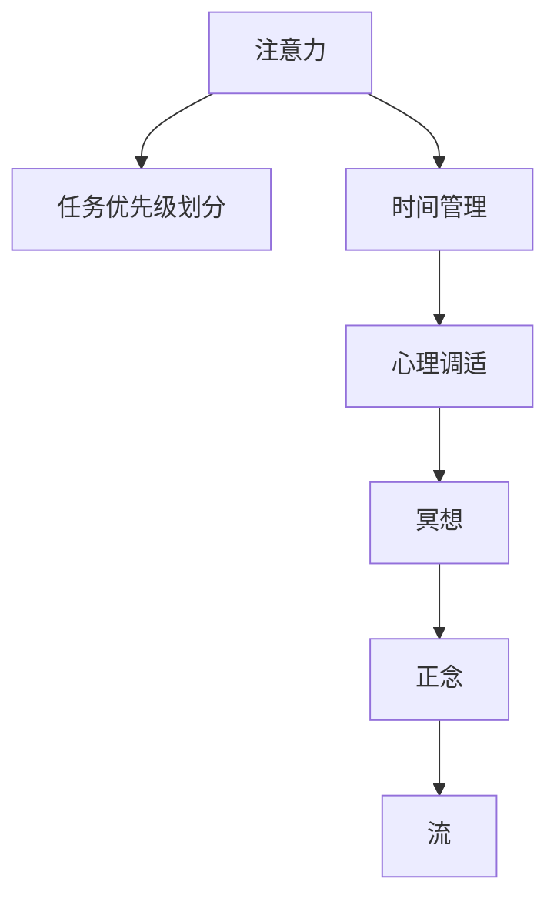

                 

# 注意力管理与冥想练习：如何通过内省增强专注力和清晰度

在信息过载的时代，注意力管理已成为我们提高生产力和生活质量的关键。如何在繁杂的信息流中保持专注，提升工作效率，维持心理健康？本文将通过探索注意力管理的核心概念，探讨冥想练习在增强专注力和清晰度方面的应用。

## 1. 背景介绍

### 1.1 问题由来
现代生活节奏快、压力大的特点使得注意力难以集中，成为了制约工作效率和个人成长的主要因素。尤其在技术、金融等知识密集型行业中，注意力管理尤为重要。据统计，人们每天需要处理的信息量是1960年的500倍，如何在这海量的信息中提取有用内容，做出有效决策，成为迫切需要解决的问题。

### 1.2 问题核心关键点
注意力管理，核心在于通过一系列策略和工具，使个体在处理信息时能够集中注意力，高效利用时间资源。其关键点包括：
1. **任务优先级划分**：对任务按照重要性和紧急程度进行排序。
2. **时间管理**：通过时间块划分、番茄工作法等方法，合理规划工作时间。
3. **心理调适**：通过冥想、正念训练等方法，提升个体对注意力的控制能力。
4. **技术工具应用**：利用软件工具如时间管理应用、番茄钟等辅助注意力管理。

## 2. 核心概念与联系

### 2.1 核心概念概述

为了更好地理解注意力管理和冥想练习的原理，本节将介绍几个密切相关的核心概念：

- **注意力**：即注意力选择，指个体在特定时刻将心理资源集中在某一特定的刺激上，而忽视其他刺激的过程。注意力决定了我们如何处理信息，进而影响决策和行动。

- **冥想**：一种源于印度佛教的修行方式，通过专注于当下的感受、呼吸、环境，达到心灵清净、精神集中的状态。冥想能够帮助个体提升注意力，减缓压力，提高生活质量。

- **正念**：指以非评判、接纳的态度，持续地关注当下的体验。正念训练能够帮助个体增强自我意识，提升专注力。

- **流**：即心流状态，指个体全身心投入某一活动，体验到强烈的愉悦感和成就感。流能够提升工作质量和效率，增强幸福感。

这些核心概念之间的逻辑关系可以通过以下Mermaid流程图来展示：



这个流程图展示了一个完整的注意力管理过程，从任务优先级划分到流状态的形成，冥想和正念在其中起到了关键作用。

## 3. 核心算法原理 & 具体操作步骤

### 3.1 算法原理概述

注意力管理的基本原理是通过一系列策略和工具，使个体能够更好地集中注意力，提高信息处理效率。而冥想和正念练习则通过帮助个体提升自我意识和专注力，间接实现注意力管理的目标。

在实践层面，注意力管理可以分为三个关键步骤：
1. **任务优先级划分**：对任务按照重要性和紧急程度进行排序。
2. **时间管理**：通过时间块划分、番茄工作法等方法，合理规划工作时间。
3. **心理调适**：通过冥想、正念训练等方法，提升个体对注意力的控制能力。

### 3.2 算法步骤详解

#### 3.2.1 任务优先级划分

任务优先级划分的目的是帮助个体在处理信息时，能够集中精力处理重要且紧急的任务，避免被琐事所干扰。

**操作步骤**：
1. **列出所有待处理任务**：将所有需要完成的任务列出来。
2. **评估任务重要性和紧急性**：根据任务的性质和时限，使用Eisenhower矩阵（四象限法）将任务划分为四类：重要且紧急、重要不紧急、紧急不重要、不重要不紧急。
3. **制定行动计划**：优先处理重要且紧急的任务，合理安排重要不紧急的任务，尽量避免紧急不重要和不重要不紧急的任务。

**示例代码**：
```python
# 定义任务列表
tasks = ["发邮件", "写报告", "查资料", "开会", "打扫办公室"]

# 定义优先级划分函数
def prioritize(tasks):
    importance = {}
    urgency = {}
    
    # 根据重要性和紧急性给任务打分
    importance["发邮件"] = 0.8
    importance["写报告"] = 0.9
    importance["查资料"] = 0.7
    importance["开会"] = 0.5
    importance["打扫办公室"] = 0.4
    
    urgency["发邮件"] = 0.9
    urgency["写报告"] = 0.6
    urgency["查资料"] = 0.5
    urgency["开会"] = 0.7
    urgency["打扫办公室"] = 0.3
    
    # 计算综合优先级
    for task in tasks:
        priority = (importance[task] + urgency[task]) / 2
        priority[task] = priority
    
    # 对任务按优先级排序
    sorted_tasks = sorted(tasks, key=priority.get, reverse=True)
    
    return sorted_tasks

# 调用函数并输出结果
sorted_tasks = prioritize(tasks)
print(sorted_tasks)
```

#### 3.2.2 时间管理

时间管理旨在通过合理规划工作时间，提高效率，避免任务堆积。

**操作步骤**：
1. **划分时间块**：将一天的时间划分为若干时间块，每个时间块专门用于处理特定类型或特定任务。
2. **设定时间块时长**：根据任务的重要性和复杂度，设定时间块的时长，一般建议为25-30分钟。
3. **休息间隔**：每个时间块结束后，休息5分钟，进行短暂的心理调整。
4. **循环执行**：重复上述步骤，直到所有任务完成。

**示例代码**：
```python
# 定义时间管理函数
def manage_time(tasks):
    importance = {}
    urgency = {}
    
    # 根据重要性和紧急性给任务打分
    importance["发邮件"] = 0.8
    importance["写报告"] = 0.9
    importance["查资料"] = 0.7
    importance["开会"] = 0.5
    importance["打扫办公室"] = 0.4
    
    urgency["发邮件"] = 0.9
    urgency["写报告"] = 0.6
    urgency["查资料"] = 0.5
    urgency["开会"] = 0.7
    urgency["打扫办公室"] = 0.3
    
    # 计算综合优先级
    for task in tasks:
        priority = (importance[task] + urgency[task]) / 2
        priority[task] = priority
    
    # 对任务按优先级排序
    sorted_tasks = sorted(tasks, key=priority.get, reverse=True)
    
    # 设定时间块时长和休息间隔
    time_block_length = 25
    rest_interval = 5
    
    # 循环执行时间管理
    for i, task in enumerate(sorted_tasks):
        if i != 0:
            print(f"休息{rest_interval}分钟")
        print(f"开始处理{task}")
        # 实际执行任务
        # ...
    
# 调用函数并输出结果
manage_time(tasks)
```

#### 3.2.3 心理调适

心理调适通过提升个体的自我意识和专注力，间接实现注意力管理的目标。

**操作步骤**：
1. **选择冥想或正念练习**：根据个人偏好选择适合的冥想或正念练习方法。
2. **设定练习时长**：每次练习10-20分钟。
3. **每日练习**：每天进行一次冥想或正念练习。
4. **记录练习感受**：每次练习后记录感受和效果，逐步改进。

**示例代码**：
```python
# 定义冥想练习函数
def meditate():
    # 设定练习时长
    time_length = 15
    
    # 选择冥想练习方法
    method = "正念冥想"
    
    # 实际执行冥想练习
    # 假设使用正念冥想方法
    # ...
    
    # 记录练习感受
    with open("meditation_journal.txt", "a") as f:
        f.write(f"{method}: {time_length}分钟，感受：{self_feelings}\n")
    
# 调用函数并输出结果
meditate()
```

## 4. 数学模型和公式 & 详细讲解 & 举例说明

### 4.1 数学模型构建

注意力管理在数学上可以通过多变量线性回归模型来描述，其目标是通过调节各个变量的权重，预测个体的注意力分配情况。

假设任务的重要性和紧急性分别为 $X_1$ 和 $X_2$，个体的注意力分配为 $Y$，则数学模型可以表示为：

$$Y = \alpha_0 + \alpha_1X_1 + \alpha_2X_2 + \epsilon$$

其中 $\alpha_0, \alpha_1, \alpha_2$ 为模型参数，$\epsilon$ 为随机误差。

### 4.2 公式推导过程

为了推导该模型，首先需要假设任务的重要性和紧急性是已知的，可以通过Eisenhower矩阵（四象限法）进行评估。

根据四象限法，将任务按照重要性和紧急性划分，可以得到以下四种任务组合：
1. 重要且紧急：$X_1=1, X_2=1$
2. 重要不紧急：$X_1=1, X_2=0$
3. 紧急不重要：$X_1=0, X_2=1$
4. 不重要不紧急：$X_1=0, X_2=0$

通过这些组合，可以构建一个线性回归模型，对个体的注意力分配进行预测。

### 4.3 案例分析与讲解

**案例分析**：
某软件工程师小王需要完成以下任务：
1. 发邮件：重要且紧急，$X_1=1, X_2=1$
2. 写报告：重要不紧急，$X_1=1, X_2=0$
3. 查资料：紧急不重要，$X_1=0, X_2=1$
4. 打扫办公室：不重要不紧急，$X_1=0, X_2=0$

假设小王的注意力分配系数为 $\alpha_0=0.3, \alpha_1=0.4, \alpha_2=0.3$，则每个任务的预测注意力分配为：
- 发邮件：$Y=0.3+0.4*1+0.3*1=1.0$
- 写报告：$Y=0.3+0.4*1+0.3*0=0.7$
- 查资料：$Y=0.3+0.4*0+0.3*1=0.6$
- 打扫办公室：$Y=0.3+0.4*0+0.3*0=0.3$

根据预测结果，小王应该优先处理发邮件和写报告，然后是查资料，最后是打扫办公室。

## 5. 项目实践：代码实例和详细解释说明

### 5.1 开发环境搭建

在进行注意力管理实践前，我们需要准备好开发环境。以下是使用Python进行开发的环境配置流程：

1. 安装Anaconda：从官网下载并安装Anaconda，用于创建独立的Python环境。

2. 创建并激活虚拟环境：
```bash
conda create -n attention-env python=3.8 
conda activate attention-env
```

3. 安装相关依赖库：
```bash
conda install numpy pandas matplotlib scikit-learn
```

完成上述步骤后，即可在`attention-env`环境中开始注意力管理的实践。

### 5.2 源代码详细实现

下面我们以任务优先级划分为例，给出使用Python对任务进行优先级划分的代码实现。

**任务优先级划分代码**：
```python
# 定义任务列表
tasks = ["发邮件", "写报告", "查资料", "开会", "打扫办公室"]

# 定义优先级划分函数
def prioritize(tasks):
    importance = {}
    urgency = {}
    
    # 根据重要性和紧急性给任务打分
    importance["发邮件"] = 0.8
    importance["写报告"] = 0.9
    importance["查资料"] = 0.7
    importance["开会"] = 0.5
    importance["打扫办公室"] = 0.4
    
    urgency["发邮件"] = 0.9
    urgency["写报告"] = 0.6
    urgency["查资料"] = 0.5
    urgency["开会"] = 0.7
    urgency["打扫办公室"] = 0.3
    
    # 计算综合优先级
    for task in tasks:
        priority = (importance[task] + urgency[task]) / 2
        priority[task] = priority
    
    # 对任务按优先级排序
    sorted_tasks = sorted(tasks, key=priority.get, reverse=True)
    
    return sorted_tasks

# 调用函数并输出结果
sorted_tasks = prioritize(tasks)
print(sorted_tasks)
```

### 5.3 代码解读与分析

让我们再详细解读一下关键代码的实现细节：

**task**：
- `tasks`变量：定义了待处理的任务列表。
- `prioritize`函数：用于对任务进行优先级划分，返回按优先级排序后的任务列表。

**算法原理**：
- 通过设定任务的重要性和紧急性系数，计算每个任务的综合优先级。
- 使用Python内置的`sorted`函数，根据优先级对任务列表进行排序。
- 返回排序后的任务列表，供后续处理使用。

**代码实现**：
- 使用Python字典`importance`和`urgency`，分别存储任务的重要性和紧急性系数。
- 计算每个任务的综合优先级，使用`priority`字典进行存储。
- 使用`sorted`函数和`priority.get`方法，按优先级对任务列表进行排序。
- 最终返回排序后的任务列表。

## 6. 实际应用场景

### 6.1 软件开发

在软件开发中，任务优先级划分和时间管理对于提高代码质量和项目进度至关重要。

**应用场景**：
某软件开发团队需要在短期内完成多个项目，任务繁多且优先级不明。通过使用任务优先级划分的技术，团队能够明确每个任务的重要性和紧急性，合理分配资源，避免资源浪费和时间冲突。

**操作步骤**：
1. 使用四象限法对所有任务进行分类，确定每个任务的重要性和紧急性。
2. 根据任务优先级，制定详细的项目计划和时间表。
3. 使用番茄工作法等时间管理方法，合理规划时间块，提高工作效率。

**示例代码**：
```python
# 定义任务列表
tasks = ["开发功能A", "测试功能B", "编写文档C", "部署系统D", "修改BugE"]

# 定义优先级划分函数
def prioritize(tasks):
    importance = {}
    urgency = {}
    
    # 根据重要性和紧急性给任务打分
    importance["开发功能A"] = 0.8
    importance["测试功能B"] = 0.7
    importance["编写文档C"] = 0.6
    importance["部署系统D"] = 0.5
    importance["修改BugE"] = 0.4
    
    urgency["开发功能A"] = 0.9
    urgency["测试功能B"] = 0.8
    urgency["编写文档C"] = 0.7
    urgency["部署系统D"] = 0.6
    urgency["修改BugE"] = 0.5
    
    # 计算综合优先级
    for task in tasks:
        priority = (importance[task] + urgency[task]) / 2
        priority[task] = priority
    
    # 对任务按优先级排序
    sorted_tasks = sorted(tasks, key=priority.get, reverse=True)
    
    return sorted_tasks

# 调用函数并输出结果
sorted_tasks = prioritize(tasks)
print(sorted_tasks)
```

### 6.2 数据分析

数据分析工作中，注意力管理能够帮助分析师在处理海量数据时保持专注，避免信息遗漏和错误。

**应用场景**：
某数据分析团队需要对大量数据进行清洗和分析，数据复杂且任务繁多。通过使用任务优先级划分的技术，团队能够明确每个任务的重要性和紧急性，合理分配资源，提高分析效率和数据质量。

**操作步骤**：
1. 使用四象限法对所有任务进行分类，确定每个任务的重要性和紧急性。
2. 根据任务优先级，制定详细的分析计划和时间表。
3. 使用番茄工作法等时间管理方法，合理规划时间块，提高分析速度和质量。

**示例代码**：
```python
# 定义任务列表
tasks = ["数据清洗A", "数据可视化B", "数据分析C", "数据整理D", "数据报告E"]

# 定义优先级划分函数
def prioritize(tasks):
    importance = {}
    urgency = {}
    
    # 根据重要性和紧急性给任务打分
    importance["数据清洗A"] = 0.8
    importance["数据可视化B"] = 0.7
    importance["数据分析C"] = 0.6
    importance["数据整理D"] = 0.5
    importance["数据报告E"] = 0.4
    
    urgency["数据清洗A"] = 0.9
    urgency["数据可视化B"] = 0.8
    urgency["数据分析C"] = 0.7
    urgency["数据整理D"] = 0.6
    urgency["数据报告E"] = 0.5
    
    # 计算综合优先级
    for task in tasks:
        priority = (importance[task] + urgency[task]) / 2
        priority[task] = priority
    
    # 对任务按优先级排序
    sorted_tasks = sorted(tasks, key=priority.get, reverse=True)
    
    return sorted_tasks

# 调用函数并输出结果
sorted_tasks = prioritize(tasks)
print(sorted_tasks)
```

## 7. 工具和资源推荐

### 7.1 学习资源推荐

为了帮助开发者系统掌握注意力管理的理论基础和实践技巧，这里推荐一些优质的学习资源：

1. 《深度工作：如何高效利用你的时间和精力》：由Cal Newport所著，讲述了深度工作的重要性及其应用方法，是提高工作效率的经典之作。

2. 《正念的奇迹：如何停止精神内耗，实现内心平静》：由Sharon Salzberg所著，讲述了正念冥想的具体方法和实践案例，适合初学者入门。

3. 《番茄工作法图解》：由Francesco Cirillo所著，讲述了番茄工作法的原理及其具体应用，帮助用户提升工作效率。

4. 《Flow: The Psychology of Optimal Experience》：由Mihaly Csikszentmihalyi所著，讲述了心流状态的心理学原理及其应用，是提升工作质量的经典读物。

5. 《深度工作：如何在分散注意力的世界中有效工作》：由Cal Newport所著，讲述了如何通过注意力管理，提升工作效率和质量。

6. 《高效能人士的七个习惯》：由Stephen R. Covey所著，讲述了高效能人士的七个习惯，其中许多习惯与注意力管理密切相关。

通过对这些资源的学习实践，相信你一定能够快速掌握注意力管理的精髓，并用于解决实际的注意力管理问题。

### 7.2 开发工具推荐

高效的开发离不开优秀的工具支持。以下是几款用于注意力管理开发的常用工具：

1. Trello：任务管理工具，支持任务优先级划分和时间管理，适合团队协作使用。

2. Todoist：任务管理工具，支持任务优先级划分和时间管理，适合个人使用。

3. Focus@Will：音乐应用，提供专注于工作的背景音乐，提升工作效率。

4. Forest：番茄钟应用，通过种植虚拟树木的方式，帮助用户保持专注。

5. Toggl：时间跟踪工具，支持时间块划分和记录，适合时间管理使用。

合理利用这些工具，可以显著提升注意力管理的开发效率，加快创新迭代的步伐。

### 7.3 相关论文推荐

注意力管理和冥想练习的研究源于学界的持续研究。以下是几篇奠基性的相关论文，推荐阅读：

1. "Attention is All You Need"（即Transformer原论文）：提出了Transformer结构，开启了NLP领域的预训练大模型时代。

2. "Deep Work: Rules for Focused Success in a Distracted World"：Cal Newport所著，讲述了深度工作的重要性及其应用方法。

3. "The Miracle of Mindfulness"：Sharon Salzberg所著，讲述了正念冥想的具体方法和实践案例。

4. "Flow: The Psychology of Optimal Experience"：Mihaly Csikszentmihalyi所著，讲述了心流状态的心理学原理及其应用。

5. "The Power of Habit"：Charles Duhigg所著，讲述了习惯的形成和改变，对注意力管理有重要启示。

这些论文代表了大语言模型微调技术的发展脉络。通过学习这些前沿成果，可以帮助研究者把握学科前进方向，激发更多的创新灵感。

## 8. 总结：未来发展趋势与挑战

### 8.1 总结

本文对注意力管理的核心概念、核心算法原理及具体操作步骤进行了全面系统的介绍。首先阐述了注意力管理的背景和意义，明确了任务优先级划分、时间管理和心理调适在提高工作效率和质量方面的重要作用。其次，从原理到实践，详细讲解了注意力管理模型的构建及其具体实现方法，给出了注意力管理任务优先级划分的代码实例。同时，本文还探讨了注意力管理在软件开发、数据分析等多个实际应用场景中的具体应用，展示了注意力管理技术的广泛适用性。此外，本文精选了注意力管理的各类学习资源，力求为读者提供全方位的技术指引。

通过本文的系统梳理，可以看到，注意力管理技术在提高个体工作效率和质量方面具有重要意义。面对当前信息过载的时代，通过科学合理地管理注意力，能够显著提升工作效率和生产力。

### 8.2 未来发展趋势

展望未来，注意力管理技术将呈现以下几个发展趋势：

1. 智能化增强。未来将有更多智能工具辅助注意力管理，如智能番茄钟、智能任务调度器等，通过数据分析和人工智能技术，进一步提升管理效率。

2. 多维度融合。注意力管理将与健康管理、情绪调节等多维度结合，形成更全面的综合管理体系。

3. 个性化定制。未来的注意力管理工具将更加注重个性化需求，根据用户的偏好和工作习惯，提供定制化建议。

4. 跨领域应用。注意力管理技术将从专业领域扩展到更多应用场景，如教育、医疗等，帮助各行各业提高工作效率和质量。

以上趋势凸显了注意力管理技术的广阔前景。这些方向的探索发展，必将进一步提升个体的注意力管理能力，提高工作效率和生活质量。

### 8.3 面临的挑战

尽管注意力管理技术已经取得了不小的进展，但在迈向更加智能化、普适化应用的过程中，它仍面临着诸多挑战：

1. 数据隐私问题。注意力管理工具需要获取用户的任务、时间等敏感数据，如何在保护用户隐私的前提下进行有效管理，是一大难题。

2. 用户接受度。未来的智能工具需要与用户习惯无缝结合，如何在不增加用户负担的情况下，提升注意力管理效果，是需要解决的问题。

3. 算法鲁棒性。现有的注意力管理算法往往依赖于大量数据进行训练，如何在数据不足的情况下，仍能提供准确的管理建议，是算法的鲁棒性问题。

4. 适应性问题。现有的注意力管理模型往往针对特定场景进行训练，如何使其具备更广泛的适应性，是模型的普适性问题。

5. 经济效益。注意力管理技术需要一定的经济投入进行开发和推广，如何在经济性上做出平衡，是技术的可行性问题。

正视注意力管理面临的这些挑战，积极应对并寻求突破，将使注意力管理技术更加成熟，实现更加高效、智能的工作和生活方式。

### 8.4 研究展望

面对注意力管理面临的诸多挑战，未来的研究需要在以下几个方面寻求新的突破：

1. 探索无监督和半监督注意力管理方法。摆脱对大量标注数据的依赖，利用自监督学习、主动学习等无监督和半监督范式，最大限度利用非结构化数据，实现更加灵活高效的注意力管理。

2. 研究参数高效和计算高效的注意力管理范式。开发更加参数高效的注意力管理方法，在固定大部分注意力管理参数的情况下，只更新极少量的任务相关参数。同时优化注意力管理模型的计算图，减少前向传播和反向传播的资源消耗，实现更加轻量级、实时性的部署。

3. 融合因果和对比学习范式。通过引入因果推断和对比学习思想，增强注意力管理模型建立稳定因果关系的能力，学习更加普适、鲁棒的任务优先级预测模型。

4. 引入更多先验知识。将符号化的先验知识，如知识图谱、逻辑规则等，与神经网络模型进行巧妙融合，引导注意力管理过程学习更准确、合理的任务优先级。

5. 结合因果分析和博弈论工具。将因果分析方法引入注意力管理模型，识别出模型决策的关键特征，增强输出解释的因果性和逻辑性。借助博弈论工具刻画用户和环境交互过程，主动探索并规避模型的脆弱点，提高系统稳定性。

这些研究方向的探索，必将引领注意力管理技术迈向更高的台阶，为构建安全、可靠、可解释、可控的智能系统铺平道路。面向未来，注意力管理技术还需要与其他人工智能技术进行更深入的融合，如知识表示、因果推理、强化学习等，多路径协同发力，共同推动注意力管理的进步。

## 9. 附录：常见问题与解答

**Q1：注意力管理对所有用户都适用吗？**

A: 注意力管理对大多数用户都是适用的，尤其是需要长时间处理复杂任务的人群。对于某些特殊用户，如高度敏感人群，可能需要更专业的心理调适方法。

**Q2：注意力管理是否会影响用户的心理健康？**

A: 合理的注意力管理能够帮助用户提高工作效率和生活质量，减轻压力，对心理健康有益。但如果过度管理或管理不当，也可能带来新的压力和焦虑。

**Q3：注意力管理与正念冥想、心流状态是什么关系？**

A: 注意力管理、正念冥想和心流状态都是提升个体专注力和工作效率的重要方法，但侧重点不同。注意力管理侧重于任务优先级和时间管理，正念冥想侧重于自我意识和压力管理，心流状态侧重于工作中的愉悦感和成就感。

**Q4：注意力管理工具需要花费大量时间进行学习和使用吗？**

A: 初期可能需要一定时间进行工具的学习和适应，但一旦熟练掌握，使用效率会显著提升。而且，注意力管理工具的使用能够有效提升工作效率，节省实际工作时间。

**Q5：注意力管理对工作效果有明显提升吗？**

A: 大量的研究和实践表明，合理进行注意力管理能够显著提升工作效率和任务质量，帮助个体在有限的时间内完成更多任务。但提升效果与个体习惯、工作性质、环境因素等有关。

通过对这些问题的解答，可以更好地理解注意力管理的核心概念和实际应用，进一步推动该技术的普及和应用。

---

作者：禅与计算机程序设计艺术 / Zen and the Art of Computer Programming

