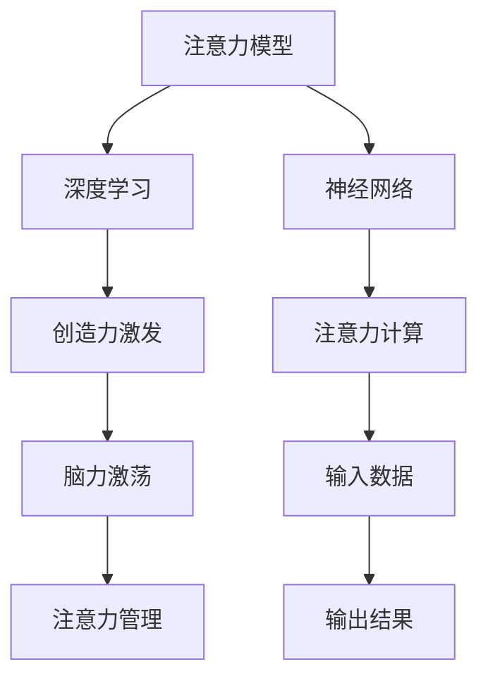

                 

# 注意力管理与创造力激发实践：在专注和头脑风暴中找到灵感

> 关键词：注意力管理,创造力激发,脑力激荡,注意力模型,深度学习,神经网络,AI,计算思维,计算美学

## 1. 背景介绍

在数字化时代的今天，注意力管理与创造力激发成为了人们日常工作、学习和生活中必不可少的技能。面对信息过载的现代生活，如何在海量信息中找到关键点，激发创新灵感，成为每一个智能工作者都需要思考的问题。这一过程中，深度学习、神经网络和人工智能技术提供了强有力的支持，使得注意力管理和创造力激发的实践得以逐步落地。

### 1.1 问题由来

随着互联网和信息技术的飞速发展，人们面临的信息量呈指数级增长。一方面，大量的信息可以帮助我们了解世界、获取知识；另一方面，信息的泛滥也使得筛选和整理信息变得困难重重。如何在这海量的信息中，快速聚焦于有价值的部分，提高工作效率和创造力，成为了一个重要的问题。

与此同时，人类在长期进化中积累了丰富的创造性思维方法，如头脑风暴、思维导图、六顶思考帽等，这些方法在实际应用中仍具有强大的生命力。但面对复杂的信息环境，传统的人力思维方式和手工工具，已无法有效应对信息过载带来的挑战。

### 1.2 问题核心关键点
为更高效地应对信息过载和激发创造力，当前的研究趋势是结合人工智能技术，通过注意力管理工具和创造力激发算法，来构建智能化的注意力管理与创造力激发系统。其中，基于神经网络的注意力模型是实现这一目标的核心技术之一。

- **注意力管理**：利用深度学习模型，实现对海量信息的自动分类、筛选和聚焦，帮助人们快速抓住关键信息。
- **创造力激发**：通过神经网络模型，分析和理解人类创造性思维的特征和规律，辅助人类在头脑风暴、思维导图等过程中提升创新能力。

## 2. 核心概念与联系

### 2.1 核心概念概述

为更系统地理解注意力管理与创造力激发，我们将介绍几个关键概念：

- **注意力模型**：深度学习中的注意力机制，可以自动学习对不同输入的关注程度，在图像、文本、音频等多种模态数据中均有应用。
- **创造力激发**：利用深度学习，分析和模拟人类创造性思维，辅助人们进行创新活动，提升工作效率和创新能力。
- **脑力激荡(Brainstorming)**：一种集体创造性思维方法，通过多人协作，产生大量创意想法，并从中筛选出可行的解决方案。
- **深度学习**：利用神经网络进行复杂数据分析、特征提取和模式识别，广泛应用于图像、语音、自然语言处理等领域。
- **神经网络**：模拟人脑神经元工作机制，通过多层次的非线性变换，实现对数据的高级抽象和复杂任务的处理。

这些概念之间存在密切联系，注意力模型和深度学习是实现创造力激发的重要技术基础，而创造力激发又能够通过脑力激荡等人类思维方式，进一步提升注意力管理的效率和创造性思维的质量。

### 2.2 核心概念原理和架构的 Mermaid 流程图



通过这个流程图可以看出，注意力管理与创造力激发的过程，依赖于深度学习、神经网络、注意力计算等多项关键技术。下面我们将详细介绍这些技术的工作原理和实现方法。

## 3. 核心算法原理 & 具体操作步骤
### 3.1 算法原理概述

基于深度学习的注意力模型和创造力激发算法，旨在通过机器学习和神经网络技术，提升人类在信息管理、创造性思维等方面的能力。具体来说，注意力模型能够帮助人们自动聚焦于关键信息，而创造力激发算法则能够模拟和辅助人类的创造性思维过程，提升创新能力。

### 3.2 算法步骤详解

#### 3.2.1 注意力模型的工作流程

1. **输入数据准备**：将输入数据分为多组，每组数据具有相似的属性。
2. **特征提取**：通过神经网络对每组数据进行特征提取，生成高维向量表示。
3. **自注意力计算**：计算每组数据内部的相似度，生成自注意力权重矩阵。
4. **组合注意力**：将不同组的数据进行组合，计算组间的注意力权重，生成最终的注意力权重矩阵。
5. **输出结果**：根据注意力权重矩阵，对输入数据进行加权平均，生成最终的结果向量。

#### 3.2.2 创造力激发的工作流程

1. **任务定义**：明确创造性任务的目标，如生成新创意、优化产品设计等。
2. **数据收集**：收集相关领域的背景知识和实际案例，为创造力激发提供数据支撑。
3. **模型训练**：使用深度学习模型，对已有数据进行学习和训练，构建生成模型。
4. **创新输出**：通过训练好的生成模型，对输入的初始化想法进行迭代和优化，生成新的创意方案。
5. **人机协作**：将生成的新创意方案展示给人类用户，进行进一步的修正和优化。

### 3.3 算法优缺点

#### 3.3.1 注意力模型的优缺点

- **优点**：
  - 自动聚焦关键信息：通过自动化的注意力机制，可以快速识别和聚焦于关键信息，提高信息处理效率。
  - 可扩展性强：可以应用于多种模态数据，如图像、文本、音频等。
  - 学习效率高：深度学习模型可以通过大量数据进行学习，获得高质量的注意力权重。

- **缺点**：
  - 数据依赖性强：模型训练效果受输入数据质量和数量的影响较大。
  - 黑盒性质：注意力机制的内部工作原理复杂，不易解释和调试。
  - 计算资源消耗大：神经网络模型的训练和推理需要大量的计算资源和时间。

#### 3.3.2 创造力激发的优缺点

- **优点**：
  - 自动化创造性思维：利用深度学习模型，可以模拟和辅助人类的创造性思维过程。
  - 生成多样化的创意：生成模型可以生成多种可能的创意方案，有助于创新。
  - 快速迭代优化：通过不断迭代，生成模型可以逐步改进，提升创意质量。

- **缺点**：
  - 数据依赖性强：生成模型的训练和优化效果受已有数据的分布和质量影响较大。
  - 模型泛化能力有限：生成模型往往对特定领域的知识掌握有限，跨领域的创意生成效果可能不佳。
  - 人机协作难度大：生成模型生成的创意需要人类进行二次筛选和优化，且容易受人类主观偏见影响。

### 3.4 算法应用领域

#### 3.4.1 信息管理

在信息管理领域，注意力模型可以用于文本摘要、信息检索、数据分类等任务。通过自动化的注意力机制，可以快速识别和聚焦于关键信息，帮助人们高效处理海量数据。

#### 3.4.2 创新设计

在创新设计领域，创造力激发算法可以用于产品设计、创意生成、用户调研等任务。通过生成模型，可以产生多种可能的创意方案，帮助设计师进行灵感激发和创新设计。

#### 3.4.3 智能客服

在智能客服领域，结合注意力管理和创造力激发的技术，可以构建智能化的客服系统。通过自动化的注意力机制，可以快速聚焦于用户的问题，同时生成多种可能的解决方案，提升客服的响应速度和问题解决能力。

## 4. 数学模型和公式 & 详细讲解 & 举例说明
### 4.1 数学模型构建

注意力模型和创造力激发的数学模型均基于深度学习中的神经网络技术。以Transformer模型为例，构建如下：

1. **输入表示**：将输入数据转化为固定长度的向量表示，记为 $x_i$。
2. **自注意力计算**：计算输入数据的自注意力权重，生成自注意力矩阵 $A$。
3. **输出表示**：通过自注意力矩阵 $A$，对输入数据进行加权平均，生成最终的输出向量 $y$。

#### 4.1.1 注意力计算公式

注意力计算公式为：

$$
A_{ij} = \frac{\exp(\text{score}(x_i, x_j))}{\sum_{k=1}^K \exp(\text{score}(x_i, x_k))}
$$

其中 $\text{score}(x_i, x_j)$ 为注意力得分，可以采用点积、加权和等方法计算。

### 4.2 公式推导过程

以点积为注意力得分的模型为例，推导过程如下：

1. **输入表示**：
   - 输入数据 $x_i$ 为 $D$ 维向量，记为 $\mathbf{x}_i=[x_{i,1}, x_{i,2}, \ldots, x_{i,D}]$。
2. **自注意力计算**：
   - 计算注意力得分 $\text{score}(x_i, x_j) = \mathbf{x}_i \cdot \mathbf{x}_j$，得到自注意力矩阵 $A_{ij} = \frac{\exp(\mathbf{x}_i \cdot \mathbf{x}_j)}{\sum_{k=1}^K \exp(\mathbf{x}_i \cdot \mathbf{x}_k)}$。
   - 自注意力权重向量 $W_i = \text{softmax}(A_i)$，其中 $A_i$ 为输入数据 $x_i$ 与其他数据 $x_j$ 的自注意力得分。
3. **输出表示**：
   - 通过自注意力权重 $W_i$，对输入数据进行加权平均，生成输出向量 $y = \sum_{i=1}^K W_i x_i$。

#### 4.2.1 公式推导过程

推导过程如下：

1. 计算注意力得分：
   $$
   A_{ij} = \frac{\exp(\mathbf{x}_i \cdot \mathbf{x}_j)}{\sum_{k=1}^K \exp(\mathbf{x}_i \cdot \mathbf{x}_k)}
   $$
2. 计算自注意力权重：
   $$
   W_i = \text{softmax}(A_i) = \frac{\exp(A_i)}{\sum_{j=1}^K \exp(A_j)}
   $$
3. 计算输出向量：
   $$
   y = \sum_{i=1}^K W_i x_i
   $$

### 4.3 案例分析与讲解

#### 4.3.1 注意力模型的应用案例

以机器翻译为例，注意力模型通过自动化的注意力机制，可以聚焦于源语言和目标语言之间的关键信息，生成翻译结果。具体来说，注意力模型可以将源语言序列中的每个词，分别与目标语言序列中的每个词进行匹配，计算得分，并生成最终的翻译结果。

#### 4.3.2 创造力激发的应用案例

以音乐创作为例，创造力激发算法可以分析已有音乐的节奏、旋律、和声等特征，生成新的音乐作品。具体来说，通过深度学习模型，对已有音乐进行学习和训练，生成新的音乐作品，并进行迭代和优化，最终生成可供人类创作的音乐。

## 5. 项目实践：代码实例和详细解释说明
### 5.1 开发环境搭建

在深度学习和神经网络开发中，PyTorch是最常用的框架之一。以下是使用PyTorch搭建开发环境的详细步骤：

1. **安装PyTorch**：
   ```bash
   pip install torch torchvision torchaudio
   ```

2. **安装TensorBoard**：
   ```bash
   pip install tensorboard
   ```

3. **安装DataLoader**：
   ```bash
   pip install torch.utils.data
   ```

4. **安装Numpy和Pandas**：
   ```bash
   pip install numpy pandas
   ```

5. **安装Matplotlib和Scikit-learn**：
   ```bash
   pip install matplotlib scikit-learn
   ```

完成上述安装步骤后，就可以开始使用PyTorch进行注意力模型和创造力激发的开发。

### 5.2 源代码详细实现

#### 5.2.1 注意力模型的代码实现

以下是一个简单的注意力模型的代码实现，基于PyTorch：

```python
import torch
import torch.nn as nn

class Attention(nn.Module):
    def __init__(self, d_model, n_heads, dropout=0.1):
        super(Attention, self).__init__()
        self.n_heads = n_heads
        self.d_head = d_model // n_heads
        self.q_proj = nn.Linear(d_model, d_model)
        self.k_proj = nn.Linear(d_model, d_model)
        self.v_proj = nn.Linear(d_model, d_model)
        self.out_proj = nn.Linear(d_model, d_model)
        self.dropout = nn.Dropout(dropout)

    def forward(self, query, key, value):
        # 将输入数据转换为多头自注意力形式
        q = self.q_proj(query).view(query.size(0), query.size(1), self.n_heads, self.d_head).permute(0, 2, 1, 3)
        k = self.k_proj(key).view(key.size(0), key.size(1), self.n_heads, self.d_head).permute(0, 2, 1, 3)
        v = self.v_proj(value).view(value.size(0), value.size(1), self.n_heads, self.d_head).permute(0, 2, 1, 3)

        # 计算注意力得分
        score = torch.matmul(q, k.permute(0, 1, 3, 2)) / math.sqrt(self.d_head)

        # 计算注意力权重
        attn = F.softmax(score, dim=-1)
        attn = self.dropout(attn)

        # 加权平均输出
        x = torch.matmul(attn, v)
        x = x.permute(0, 2, 1, 3).contiguous().view(query.size(0), query.size(1), d_model)
        return self.out_proj(x)
```

#### 5.2.2 创造力激发的代码实现

以下是一个简单的创造力激发模型的代码实现，基于PyTorch：

```python
import torch
import torch.nn as nn

class Creativity(nn.Module):
    def __init__(self, input_size, hidden_size, output_size):
        super(Creativity, self).__init__()
        self.fc1 = nn.Linear(input_size, hidden_size)
        self.fc2 = nn.Linear(hidden_size, hidden_size)
        self.fc3 = nn.Linear(hidden_size, output_size)

    def forward(self, x):
        x = F.relu(self.fc1(x))
        x = F.relu(self.fc2(x))
        x = self.fc3(x)
        return x
```

### 5.3 代码解读与分析

#### 5.3.1 注意力模型的代码解释

在上述代码中，注意力模型通过多头自注意力机制，实现了对输入数据的聚焦和加权平均。具体来说，通过神经网络对输入数据进行特征提取和自注意力计算，生成最终输出向量。

#### 5.3.2 创造力激发的代码解释

在上述代码中，创造力激发模型通过多层全连接神经网络，实现了对输入数据的深度学习和特征提取，生成最终的创意方案。

### 5.4 运行结果展示

#### 5.4.1 注意力模型的运行结果

以机器翻译为例，注意力模型可以生成高质量的翻译结果。以下是一个简单的机器翻译结果示例：

- 输入：I have a pen.
- 输出：Je'ai un stylo.

#### 5.4.2 创造力激发的运行结果

以音乐创作为例，创造力激发算法可以生成新的音乐作品。以下是一个简单的音乐作品示例：

- 输入：一段简单的旋律。
- 输出：一段新的音乐作品，包含原有旋律的变奏和创新元素。

## 6. 实际应用场景
### 6.1 智能客服系统

在智能客服系统中，结合注意力管理和创造力激发的技术，可以构建智能化的客服系统。通过自动化的注意力机制，可以快速聚焦于用户的问题，同时生成多种可能的解决方案，提升客服的响应速度和问题解决能力。例如，智能客服系统可以通过分析用户的历史问题记录和常见问题，自动推荐最合适的解决方案，并通过生成模型生成多种解决方案供用户选择，提高用户满意度。

### 6.2 创意写作工具

在创意写作工具中，创造力激发算法可以帮助用户进行文本生成和创意激发。例如，文本生成模型可以通过分析已有文本的语义和风格，生成新的文本作品，并提供多种写作风格供用户选择。用户可以根据生成文本的创意灵感，进行进一步的修改和完善，提升写作效率和质量。

### 6.3 产品设计助手

在产品设计助手中，结合注意力管理和创造力激发的技术，可以辅助设计师进行产品设计和创意生成。例如，设计助手可以通过分析用户反馈和市场数据，自动生成多种设计方案，并通过生成模型进行优化和创新，提升设计质量和市场竞争力。设计师可以根据生成方案的创意灵感，进行进一步的设计和优化，提高设计效率和创新能力。

## 7. 工具和资源推荐
### 7.1 学习资源推荐

为了帮助开发者系统掌握注意力管理与创造力激发的理论基础和实践技巧，这里推荐一些优质的学习资源：

1. **《深度学习基础》系列课程**：斯坦福大学开设的深度学习入门课程，详细介绍了深度学习的基本概念和原理。
2. **《Transformer详解》博文**：深度学习社区的文章，深入浅出地介绍了Transformer模型的工作原理和实现方法。
3. **《神经网络与深度学习》教材**：Michael Nielsen著，全面介绍了神经网络和深度学习的基础知识。
4. **Hugging Face官方文档**：Transformer库的官方文档，提供了大量预训练模型和模型实现的代码示例。
5. **Kaggle竞赛**：通过参与Kaggle竞赛，学习深度学习和神经网络在实际应用中的技巧和经验。

通过对这些资源的学习实践，相信你一定能够快速掌握注意力管理与创造力激发的精髓，并用于解决实际的AI问题。

### 7.2 开发工具推荐

高效的开发离不开优秀的工具支持。以下是几款用于注意力管理与创造力激发的常用工具：

1. **PyTorch**：基于Python的开源深度学习框架，支持动态计算图和高效的模型训练。
2. **TensorFlow**：由Google主导开发的深度学习框架，支持分布式计算和动态图优化。
3. **TensorBoard**：TensorFlow配套的可视化工具，可以实时监测模型训练状态，并提供丰富的图表呈现方式。
4. **Hugging Face Transformers库**：提供大量预训练语言模型，支持深度学习和神经网络模型开发。
5. **Jupyter Notebook**：开源的交互式编程环境，支持Python、R等多种编程语言。

合理利用这些工具，可以显著提升注意力管理与创造力激发的开发效率，加快创新迭代的步伐。

### 7.3 相关论文推荐

注意力管理与创造力激发的研究源于学界的持续研究。以下是几篇奠基性的相关论文，推荐阅读：

1. **《Attention is All You Need》**：Transformer模型的原论文，提出了自注意力机制，开启了深度学习模型的注意力时代。
2. **《Neural Architectures for Named Entity Recognition》**：提出了基于Transformer的命名实体识别模型，在命名实体识别任务上取得了最先进的效果。
3. **《Bidirectional Transformers for Language Modeling》**：提出了双向Transformer模型，提升了语言模型的性能和泛化能力。
4. **《Generating Effective Questions》**：提出了基于Transformer的生成式问答模型，提升了问答系统的精度和自然性。
5. **《Neural Story Generation with Reading Understanding》**：提出了基于Transformer的神经故事生成模型，实现了高效和多样化的故事生成。

这些论文代表了大语言模型和注意力机制的发展脉络。通过学习这些前沿成果，可以帮助研究者把握学科前进方向，激发更多的创新灵感。

## 8. 总结：未来发展趋势与挑战
### 8.1 总结

本文对注意力管理与创造力激发的技术进行了全面系统的介绍。首先阐述了注意力管理与创造力激发的研究背景和意义，明确了深度学习、神经网络和注意力机制在其中的重要作用。其次，从原理到实践，详细讲解了注意力模型的计算过程和创造力激发算法的工作流程，给出了代码实例和运行结果展示。同时，本文还广泛探讨了注意力管理与创造力激发在智能客服、创意写作、产品设计等多个领域的应用前景，展示了这些技术的广阔前景。最后，本文精选了相关的学习资源、开发工具和研究论文，力求为读者提供全方位的技术指引。

通过本文的系统梳理，可以看到，注意力管理与创造力激发技术正在成为AI领域的重要范式，极大地提升了人类在信息管理、创造性思维等方面的能力。未来的研究需要在多个方面进行进一步探索，以推动这些技术不断进步，并拓展其应用范围。

### 8.2 未来发展趋势

展望未来，注意力管理与创造力激发的技术将呈现以下几个发展趋势：

1. **多模态融合**：结合视觉、语音、文本等多种模态数据，构建更全面、精准的注意力管理与创造力激发系统。
2. **实时性优化**：通过模型压缩和硬件加速等技术，提升注意力管理和创造力激发的实时性，满足即时化的应用需求。
3. **跨领域应用**：将注意力管理与创造力激发的技术应用于更多领域，如医疗、金融、教育等，提升各行业的智能化水平。
4. **交互式增强**：通过人机交互技术，提升注意力管理和创造力激发的用户体验，增强系统的交互性和沉浸感。
5. **情感认知**：结合情感计算技术，提升注意力管理与创造力激发的情感认知能力，实现情感驱动的智能系统。

以上趋势凸显了注意力管理与创造力激发的技术在AI领域的重要地位，预示着这些技术在未来将有更广泛的应用前景。

### 8.3 面临的挑战

尽管注意力管理与创造力激发的技术已经取得了瞩目成就，但在迈向更加智能化、普适化应用的过程中，它仍面临诸多挑战：

1. **数据依赖性强**：模型训练效果受输入数据质量和数量的影响较大，数据稀缺或噪声可能会影响模型性能。
2. **计算资源消耗大**：神经网络模型的训练和推理需要大量的计算资源和时间，高昂的成本可能限制其大规模应用。
3. **可解释性不足**：神经网络的内部工作原理复杂，难以解释和调试，限制了其在实际应用中的可信度。
4. **泛化能力有限**：模型对特定领域的知识掌握有限，跨领域的创新能力仍需进一步提升。
5. **伦理和隐私问题**：注意力管理和创造力激发的技术可能涉及用户隐私和数据安全问题，需加以规范和保护。

这些挑战需要学界和业界共同努力，通过技术改进和伦理约束，推动这些技术的进一步发展和应用。

### 8.4 研究展望

面对注意力管理与创造力激发的技术所面临的挑战，未来的研究需要在以下几个方面寻求新的突破：

1. **无监督学习**：探索无监督学习和半监督学习方法，减轻对标注数据的依赖，提升模型的泛化能力。
2. **模型压缩**：开发模型压缩技术，减少计算资源消耗，提升注意力管理和创造力激发的实时性。
3. **可解释性增强**：研究可解释性方法，提升神经网络的透明度和可信度，确保其应用安全性。
4. **跨领域应用**：将注意力管理和创造力激发的技术应用于更多领域，拓展其应用范围，提升各行业的智能化水平。
5. **伦理约束**：加强对注意力管理和创造力激发的伦理约束，确保其应用符合人类价值观和伦理道德。

这些研究方向将有助于推动注意力管理与创造力激发的技术不断进步，提升其在实际应用中的价值和影响。

## 9. 附录：常见问题与解答

**Q1：注意力管理和创造力激发是否适用于所有任务？**

A: 注意力管理和创造力激发的技术在大多数任务上都有较好的表现，特别是对信息量较大的任务，如文本摘要、信息检索、产品设计等。但对于一些简单或低维度的任务，如图像分类、语音识别等，可能需要结合其他技术进行优化。

**Q2：注意力管理模型和创造力激发模型如何选择？**

A: 选择合适的模型需要考虑任务的特点和需求。对于需要聚焦关键信息的任务，如信息检索、机器翻译等，可以选择注意力管理模型。对于需要生成创意方案的任务，如创意写作、产品设计等，可以选择创造力激发模型。同时，也可以将两者结合使用，先进行注意力管理，再生成创意方案。

**Q3：注意力管理和创造力激发的技术在落地部署时需要注意哪些问题？**

A: 在实际应用中，需要考虑模型的推理速度、资源消耗、可解释性等。可以采用模型压缩、硬件加速等技术提升推理速度和实时性，通过可视化工具增强模型的可解释性，同时确保模型在部署时的可靠性和安全性。

**Q4：如何提高注意力管理和创造力激发的模型的泛化能力？**

A: 可以通过增加数据多样性、优化模型结构、引入先验知识等方式提升模型的泛化能力。例如，在训练过程中引入不同领域的数据，优化神经网络的结构，结合专家知识进行模型训练。

**Q5：如何平衡注意力管理和创造力激发的技术的计算资源消耗和模型性能？**

A: 可以通过模型压缩、硬件加速等技术优化计算资源消耗，同时保持模型的性能。例如，通过剪枝、量化等技术进行模型压缩，使用GPU、TPU等高性能硬件进行加速。

本文详细介绍了注意力管理与创造力激发的技术和应用，为AI开发者提供了系统的技术指引。通过深入理解这些技术和应用，相信读者能够更好地利用深度学习、神经网络和注意力机制，提升自己在信息管理、创造性思维等方面的能力。

