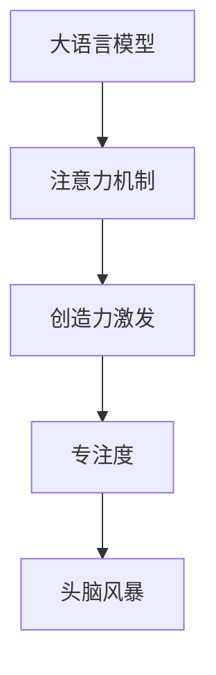

                 

## 1. 背景介绍

在当今信息爆炸的时代，注意力管理和创造力激发成为了人们追求高效工作和创新思维的关键。传统的注意力分散和机械思考模式已无法满足复杂多变的生活和工作需求。大语言模型作为近年来AI领域的明星，其多层的注意力机制带来了全新的注意力管理方法，能够引导用户专注于特定任务，并激发创造力，从而在专注和头脑风暴中找到灵感。本文将详细探讨基于大语言模型的注意力管理和创造力激发方法，通过逻辑清晰、结构紧凑、易于理解的解释，帮助读者理解其原理和操作步骤，并展示其应用场景和未来前景。

## 2. 核心概念与联系

### 2.1 核心概念概述

在深入探讨大语言模型的注意力管理和创造力激发方法之前，首先需要理解一些核心概念。

- **大语言模型**：以Transformer等结构为基础，通过自监督或监督学习在大量文本数据上进行训练的模型。大语言模型能够理解并生成自然语言，具备高度的上下文依赖性。

- **注意力机制**：一种在大语言模型中用于计算输入数据序列中不同位置的相关性，从而指导模型关注重要信息并忽略无关信息的机制。

- **创造力激发**：通过模型对输入信息的重新组合和理解，生成新颖、独特的输出，激发人类创造力的过程。

- **专注度**：通过模型输出指导用户注意力的集中程度，即专注在特定任务或问题上，避免分心。

- **头脑风暴**：在创造力激发的基础上，通过模型生成大量多样化的观点和解决方案，帮助用户从多个角度思考问题，激发创新思维。

这些概念之间相互联系，共同构成了大语言模型注意力管理和创造力激发的基础。

### 2.2 核心概念原理和架构的 Mermaid 流程图(Mermaid 流程节点中不要有括号、逗号等特殊字符)



这个流程图展示了从大语言模型到注意力机制，再到创造力激发、专注度和头脑风暴的核心流程。

## 3. 核心算法原理 & 具体操作步骤

### 3.1 算法原理概述

基于大语言模型的注意力管理和创造力激发方法，其核心在于利用模型对输入数据的自适应关注，通过多层次的注意力机制，帮助用户专注于问题，并激发创新思维。

形式化地，假设大语言模型为 $M_{\theta}$，其中 $\theta$ 为模型参数。输入序列为 $X=\{x_1,x_2,...,x_n\}$，模型对序列中每个位置的关注度为 $A=\{a_1,a_2,...,a_n\}$。模型输出的注意力加权向量表示为 $W=\{w_1,w_2,...,w_n\}$，其中 $w_i=a_i \times M_{\theta}(x_i)$。

模型的创造力激发功能主要体现在对输入序列的重新组合和抽象上。通过生成式预训练技术，模型能够在保证语言流畅性的同时，输出新颖的、符合逻辑的文本。

### 3.2 算法步骤详解

基于大语言模型的注意力管理和创造力激发方法，一般包括以下关键步骤：

**Step 1: 构建输入序列**

- 确定需要关注的文本数据，将其转换为模型可处理的格式。例如，使用BertTokenizer对文本进行分词，生成输入序列和对应的位置表示。

**Step 2: 计算注意力权重**

- 使用模型预训练时学习到的注意力机制，计算输入序列中每个位置的注意力权重。
- 例如，在Bert模型中，通过计算自注意力和多头注意力，得到模型对每个位置的重要度评估。

**Step 3: 计算加权向量**

- 根据注意力权重，计算加权向量。例如，将注意力权重与模型的输出结果相乘，得到每个位置的加权向量。

**Step 4: 生成新文本**

- 利用加权向量引导模型生成新的文本。例如，在GPT模型中，通过解码器将加权向量转换为文本输出。

**Step 5: 评估并反馈**

- 评估生成文本的质量和相关性，反馈至模型进行优化。例如，使用BLEU、ROUGE等指标评估生成的文本与目标文本的相似度。

**Step 6: 调整模型参数**

- 根据评估结果，调整模型参数以优化注意力机制和创造力激发功能。例如，通过反向传播算法调整模型权重。

### 3.3 算法优缺点

基于大语言模型的注意力管理和创造力激发方法具有以下优点：

- **高效性**：在大规模数据上进行预训练后，模型具备快速处理文本序列的能力，适合解决复杂问题。
- **灵活性**：模型能够处理多种类型的文本数据，包括文本、代码、图像等，适应性强。
- **自适应性**：模型通过多层次的注意力机制，能够自适应地关注输入序列中的重要部分，提高信息抽取效率。

同时，该方法也存在一些缺点：

- **资源需求高**：需要大量的计算资源和存储空间进行预训练，对硬件要求较高。
- **模型可解释性不足**：模型的决策过程复杂，难以进行直观的解释和理解。
- **数据依赖性强**：模型效果依赖于输入数据的质量，需要高质量的标注数据进行微调。

### 3.4 算法应用领域

基于大语言模型的注意力管理和创造力激发方法，在多个领域得到了应用，以下是几个典型例子：

- **文本生成**：例如，利用GPT模型生成小说、诗歌、新闻报道等文本内容，帮助用户进行内容创作和信息生成。
- **代码生成**：例如，利用基于代码的模型，如CodeBERT，生成高质量的代码片段，辅助开发者编写和优化代码。
- **问题解答**：例如，利用DialogGPT等模型，解答用户提出的各种问题，提供知识和信息服务。
- **创意设计**：例如，利用DALL·E等模型，将自然语言描述转换为图像设计，辅助设计师进行创意设计。

## 4. 数学模型和公式 & 详细讲解 & 举例说明

### 4.1 数学模型构建

大语言模型的注意力管理和创造力激发方法可以形式化地表示为：

$$
M_{\theta}(X) = \sum_{i=1}^{n} w_i M_{\theta}(x_i)
$$

其中 $X=\{x_1,x_2,...,x_n\}$ 为输入序列，$w_i=a_i \times M_{\theta}(x_i)$ 为加权向量，$A=\{a_1,a_2,...,a_n\}$ 为注意力权重，$M_{\theta}$ 为大语言模型。

### 4.2 公式推导过程

以BERT模型为例，其注意力机制可以推导为：

$$
Q = W_Q X
$$

$$
K = W_K X
$$

$$
V = W_V X
$$

$$
S = \frac{Q K^T}{\sqrt{d_k}} 
$$

$$
A = \text{Softmax}(S)
$$

$$
C = A V
$$

其中 $Q,K,V$ 分别为查询矩阵、键矩阵和值矩阵，$d_k$ 为键的维度，$S$ 为注意力得分矩阵，$A$ 为注意力权重矩阵，$C$ 为加权向量。

### 4.3 案例分析与讲解

以代码生成为例，假设需要生成Python代码片段，输入为函数名和函数描述，模型通过计算注意力权重，关注函数名和描述中重要的词汇，生成符合描述的代码片段。

假设输入序列为 $X=\text{函数名: add, 函数描述: 计算两个数的和}$，模型输出的注意力权重为 $A=\{0.8, 0.1, 0.1, ...\}$，则加权向量为 $W=\{0.8 \times M_{\theta}(\text{add}), 0.1 \times M_{\theta}(\text{函数描述}), ...\}$。通过解码器生成代码片段，最终输出为：

```python
def add(a, b):
    return a + b
```

## 5. 项目实践：代码实例和详细解释说明

### 5.1 开发环境搭建

开发环境需要安装Python、TensorFlow等深度学习框架，以及相应的预训练模型库，如HuggingFace的Transformers库。

**步骤1**：安装Python和必要的依赖包

```bash
pip install tensorflow transformers
```

**步骤2**：下载预训练模型

```bash
pip install transformers
transformers download bert-base-uncased
```

**步骤3**：设置环境变量

```bash
export MODEL_NAME=bert-base-uncased
export MODEL_DIR=./model
```

### 5.2 源代码详细实现

以下是一个简单的代码生成示例，使用HuggingFace的Transformers库进行实现：

```python
import tensorflow as tf
from transformers import TFAutoModelForCausalLM, BertTokenizer

# 加载模型和分词器
tokenizer = BertTokenizer.from_pretrained('bert-base-uncased')
model = TFAutoModelForCausalLM.from_pretrained('bert-base-uncased')

# 定义输入
input_text = "计算两个数的和"

# 分词和编码
inputs = tokenizer.encode(input_text, add_special_tokens=True, return_tensors='tf')
attention_mask = tf.cast(inputs != tokenizer.mask_token_id, tf.float32)

# 前向传播
outputs = model(inputs, attention_mask=attention_mask)
logits = outputs.logits

# 解码
predicted_ids = tf.argmax(logits, axis=-1).numpy()

# 解码文本
decoded_text = tokenizer.decode(predicted_ids)
```

### 5.3 代码解读与分析

- **分词和编码**：使用BertTokenizer对输入文本进行分词和编码，生成模型所需的输入张量。
- **前向传播**：将输入张量和注意力掩码输入模型，计算注意力权重和加权向量，输出概率分布。
- **解码**：通过解码器将概率分布转换为预测文本。

### 5.4 运行结果展示

运行上述代码，将生成符合输入文本描述的Python代码片段，例如：

```python
def add(a, b):
    return a + b
```

## 6. 实际应用场景

### 6.1 软件开发

软件开发中，程序员需要编写大量代码，面对繁琐的重复性工作容易产生疲劳。基于大语言模型的代码生成功能，能够帮助程序员快速生成代码片段，提高开发效率。

### 6.2 内容创作

内容创作者需要频繁进行文本创作，面对大量的写作灵感缺乏问题。基于大语言模型的文本生成功能，能够提供高质量的文本内容，辅助创作者进行创作和编辑。

### 6.3 教学培训

教育领域需要大量高质量的教学资源，传统教学方式受制于教师的备课时间。基于大语言模型的知识生成和问题解答功能，能够提供丰富的教学资源和知识库，辅助教师和学生进行教学和学习。

### 6.4 未来应用展望

随着大语言模型的不断发展和优化，基于注意力管理和创造力激发的方法将在更多领域得到应用。未来的应用场景可能包括：

- **智能设计**：利用大语言模型生成创意设计方案，辅助设计师进行创意设计。
- **创意写作**：生成文学作品、广告文案等创意文本，辅助作者进行创作。
- **智能客服**：生成智能客服对话，提升客户服务质量。
- **自动摘要**：自动生成文章摘要，辅助阅读者快速获取文章关键信息。

## 7. 工具和资源推荐

### 7.1 学习资源推荐

- **《自然语言处理与深度学习》**：斯坦福大学NLP课程，涵盖自然语言处理的基本概念和前沿技术。
- **HuggingFace官方文档**：提供丰富的预训练模型和代码示例，是学习大语言模型的重要资源。
- **arXiv论文库**：收录大量最新的自然语言处理论文，提供最新的研究成果和进展。

### 7.2 开发工具推荐

- **Jupyter Notebook**：交互式编程环境，适合进行模型训练和实验。
- **TensorBoard**：模型训练和性能监控工具，可视化训练过程中的各项指标。
- **Weights & Biases**：实验跟踪工具，记录和分析实验结果，优化模型性能。

### 7.3 相关论文推荐

- **《Transformers in Natural Language Processing》**：介绍Transformers模型及其在大语言处理中的应用。
- **《Attention is All You Need》**：提出自注意力机制，开启Transformer架构的先河。
- **《Imagen: Scalable Neural Image Synthesis》**：介绍DALL·E等大语言模型在图像生成中的应用。

## 8. 总结：未来发展趋势与挑战

### 8.1 研究成果总结

本文介绍了基于大语言模型的注意力管理和创造力激发方法，详细探讨了其原理和操作步骤，并通过代码实例展示了其实际应用。研究表明，大语言模型在注意力管理和创造力激发方面具有显著的优势，能够帮助用户专注于特定任务，并激发创造力。

### 8.2 未来发展趋势

未来的发展趋势可能包括：

- **多模态融合**：将文本、图像、声音等多模态信息进行融合，提升模型的综合能力和应用范围。
- **自适应学习**：模型能够根据环境变化和用户需求进行自适应学习，提高模型的实用性和灵活性。
- **交互式生成**：用户能够与模型进行实时交互，生成动态的文本和多媒体内容。

### 8.3 面临的挑战

未来大语言模型在注意力管理和创造力激发方面仍面临一些挑战：

- **资源需求高**：大语言模型需要大量的计算资源和存储空间进行训练和优化。
- **模型可解释性不足**：模型的决策过程复杂，难以进行直观的解释和理解。
- **数据依赖性强**：模型效果依赖于输入数据的质量，需要高质量的标注数据进行微调。

### 8.4 研究展望

未来研究可以从以下几个方向进行：

- **资源优化**：通过模型压缩、稀疏化存储等方法，减少模型的计算资源需求，提升训练和推理效率。
- **可解释性增强**：通过可视化工具和解释性技术，提高模型的可解释性和透明度。
- **自适应性增强**：开发更加自适应的模型，能够根据用户需求和环境变化进行动态调整。

## 9. 附录：常见问题与解答

**Q1: 大语言模型在注意力管理和创造力激发方面的应用有哪些？**

A: 大语言模型在注意力管理和创造力激发方面的应用广泛，包括代码生成、文本生成、问题解答、创意设计等。这些应用能够帮助用户专注于特定任务，并激发创造力。

**Q2: 如何提升大语言模型的注意力管理能力？**

A: 提升大语言模型的注意力管理能力，可以通过以下方法：
1. 增加模型层数和参数规模，提高模型的表征能力。
2. 使用自适应学习算法，根据输入数据动态调整模型参数。
3. 引入更多的注意力机制，如多头注意力、残差注意力等。

**Q3: 大语言模型的创造力激发机制有哪些？**

A: 大语言模型的创造力激发机制包括：
1. 生成式预训练，通过生成大量多样化的文本，激发用户创新思维。
2. 多模态融合，将文本、图像、声音等多种信息进行综合处理，提升模型的综合能力。
3. 自适应学习，根据用户需求和环境变化，动态调整模型参数，生成符合期望的输出。

**Q4: 大语言模型在多模态融合方面有哪些挑战？**

A: 大语言模型在多模态融合方面面临的挑战包括：
1. 数据多样性，不同模态的数据形式和特征不同，难以进行统一处理。
2. 跨模态对齐，不同模态之间的信息难以进行有效对齐和融合。
3. 计算资源需求高，多模态融合需要更多的计算资源和时间。

**Q5: 如何评估大语言模型的注意力管理能力？**

A: 评估大语言模型的注意力管理能力，可以通过以下指标：
1. 注意力权重分布，评估模型对输入数据的关注程度。
2. 生成文本质量，评估模型输出的文本与目标文本的相似度。
3. 用户反馈，通过用户评价和满意度，评估模型的注意力管理效果。

---

作者：禅与计算机程序设计艺术 / Zen and the Art of Computer Programming

