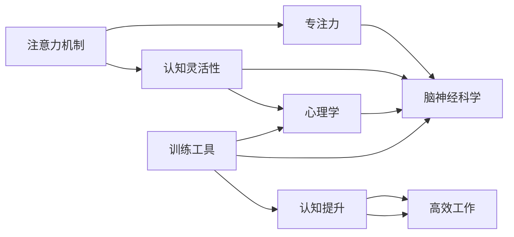

                 

# 注意力管理与大脑训练实践：增强认知灵活性和专注力

## 1. 背景介绍

### 1.1 问题由来
在现代社会，信息爆炸和数字化转型的浪潮下，人们每天面临的信息量和认知负担前所未有。如何高效管理注意力，提升认知灵活性和专注力，成为当代人不可回避的挑战。

现代认知科学和神经科学研究证实，注意力并非单向流动的信息筛选机制，而是具有动态可调节特性的认知资源。通过科学的注意力管理方法，可以显著提升个人工作效率和学习效果，增强决策能力，改善生活质量。

### 1.2 问题核心关键点
注意力管理与大脑训练的实践，核心在于理解注意力机制的原理，并设计有效的训练方法和工具，引导大脑提升注意力控制能力，增强认知灵活性和专注力。

主要涉及以下关键点：
- 注意力机制的认知科学基础
- 注意力控制在大脑中的神经基础
- 注意力管理与训练的心理学原理
- 注意力训练方法和工具的开发与评估
- 注意力管理与训练的实际应用场景

本文将深入探讨这些核心概念，从理论到实践，系统阐述如何通过注意力管理与大脑训练，实现认知提升和高效工作。

## 2. 核心概念与联系

### 2.1 核心概念概述

注意力管理与大脑训练涉及多个核心概念，包括注意力机制、认知灵活性、专注力、脑神经科学、心理学、训练工具等。

- **注意力机制**：指大脑选择性地注意或忽视外部或内部信息的能力，是认知过程的基础。
- **认知灵活性**：指大脑在特定任务中的快速适应能力和多任务切换能力，与执行功能相关。
- **专注力**：指长时间维持注意力的能力，是完成任务的关键。
- **脑神经科学**：研究注意力和认知功能的大脑机制，包括神经递质、神经网络等。
- **心理学**：研究注意力管理与训练的心理学原理，如行为调控、认知负荷等。
- **训练工具**：包括软件工具、认知训练游戏等，用于辅助注意力提升和认知训练。

这些概念之间的关系通过以下Mermaid流程图表示：



这些核心概念共同构成了注意力管理与大脑训练的理论基础和实践框架，帮助我们理解注意力和认知提升的科学原理，并设计有效的训练方法和工具。

## 3. 核心算法原理 & 具体操作步骤
### 3.1 算法原理概述

注意力管理与大脑训练的实践，主要基于认知神经科学和心理学的研究成果，结合计算机科学的算法和工具，通过科学的训练方法，逐步提升个体注意力控制能力，实现认知提升。

### 3.2 算法步骤详解

注意力管理与大脑训练的实践过程主要包括以下几个关键步骤：

**Step 1: 评估当前注意力水平和认知能力**

首先，使用标准化的认知评估工具，如注意力广度测试、注意力集中度测试等，评估个体的注意力水平和认知能力。这些工具通常基于任务范式设计，如视觉搜索任务、语音刺激任务等，通过心理物理学的原理，客观地测量个体的注意力和认知表现。

**Step 2: 设定个性化训练目标**

根据认知评估结果，设定个性化的注意力管理与大脑训练目标。这些目标通常包括提升注意力广度、增强注意力集中度、改善多任务切换能力等。

**Step 3: 选择训练方法和工具**

根据个性化训练目标，选择适合的注意力训练方法和工具。目前市面上已有许多成熟的训练工具，如BrainHQ、Lumosity等，提供多种认知训练任务，涵盖注意力、记忆力、处理速度等多个方面。

**Step 4: 制定训练计划**

制定个性化的训练计划，包括训练频率、任务选择、时长等。通常建议每天进行30-60分钟的训练，连续进行2-3个月，以确保训练效果。

**Step 5: 跟踪训练进度**

使用训练工具提供的进度跟踪和反馈系统，实时监控训练进度，记录训练效果。根据训练反馈，调整训练计划，确保达到个性化训练目标。

**Step 6: 评估训练效果**

在训练计划结束时，重新进行认知评估，评估注意力水平和认知能力的提升情况。对比训练前后的评估结果，评估训练效果。

### 3.3 算法优缺点

注意力管理与大脑训练的实践具有以下优点：
- 科学依据：基于认知神经科学和心理学原理，训练方法经过科学验证。
- 可操作性强：训练方法和工具易于操作，适合个人自主训练。
- 效果显著：通过长期训练，显著提升注意力水平和认知能力。

同时，该方法也存在以下局限性：
- 依赖工具：训练效果很大程度上取决于所选工具的质量。
- 个体差异：个体之间的差异可能导致训练效果差异较大。
- 时间成本：需要持续的时间和精力投入，才能获得显著效果。

尽管存在这些局限性，但就目前而言，注意力管理与大脑训练仍是提升认知能力、增强注意力控制的重要手段。未来相关研究的重点在于如何进一步降低训练对工具的依赖，提高训练的个性化和智能化，同时兼顾训练的效率和效果。

### 3.4 算法应用领域

注意力管理与大脑训练的实践，已经在多个领域得到广泛应用，具体包括：

- **教育培训**：通过认知训练提升学生的注意力和认知能力，改善学习效果。
- **职业培训**：通过注意力训练提升职场人士的注意力和专注力，提高工作效率。
- **心理健康**：通过注意力训练缓解压力、焦虑等心理问题，提升心理健康水平。
- **老年保健**：通过注意力训练延缓认知衰退，提高老年人的生活质量。
- **军事训练**：通过注意力训练提高士兵的情报处理能力和决策速度，增强战斗效能。

除了这些具体领域，注意力管理与大脑训练还被广泛应用于各类行业，如航空、法律、医疗等，帮助从业者提升注意力控制能力，提高工作质量。

## 4. 数学模型和公式 & 详细讲解 & 举例说明

### 4.1 数学模型构建

注意力管理与大脑训练的理论模型构建主要基于以下几个心理学和神经科学的理论模型：

1. **双任务模型(Dual Task Model)**：强调在多任务切换时，注意力的切换成本和任务间干扰。
2. **执行功能模型(Executive Function Model)**：涉及任务切换、工作记忆、抑制控制等认知过程。
3. **神经递质模型(Neurotransmitter Model)**：涉及多巴胺、去甲肾上腺素等神经递质在大脑中的作用机制。

这些模型可以用数学形式表示，以下是两个关键模型的公式推导过程：

#### 4.1.1 双任务模型

双任务模型假设，在执行两个任务时，注意力资源在任务间进行切换，切换时会产生切换成本。用数学公式表示为：

$$
T_{total} = T_A + T_B + C_{switch}
$$

其中 $T_A$ 和 $T_B$ 分别表示执行任务A和任务B的时间，$C_{switch}$ 表示切换任务时的成本。

这个模型强调，在多任务切换时，切换成本是任务执行时间的重要组成部分。因此，减少切换成本，提高任务间协调性，是提高注意力的关键。

#### 4.1.2 神经递质模型

神经递质模型主要关注多巴胺和去甲肾上腺素在大脑中的作用。多巴胺与奖赏和动机相关，去甲肾上腺素与注意力和唤醒状态相关。可以用以下公式表示：

$$
\begin{aligned}
D &= f_{DAM}(D_{init} - \frac{D_{base}}{(1 + t_D^{-\alpha})}) \\
N &= f_{Nore}(N_{init} - \frac{N_{base}}{(1 + t_N^{-\beta})})
\end{aligned}
$$

其中 $D$ 和 $N$ 分别表示多巴胺和去甲肾上腺素的量，$f_{DAM}$ 和 $f_{Nore}$ 分别是多巴胺和去甲肾上腺素的合成函数，$D_{init}$ 和 $N_{init}$ 分别是多巴胺和去甲肾上腺素的初始水平，$D_{base}$ 和 $N_{base}$ 分别是多巴胺和去甲肾上腺素的基础水平，$t_D$ 和 $t_N$ 分别表示多巴胺和去甲肾上腺素的时间变量。

这个模型表明，多巴胺和去甲肾上腺素在大脑中的浓度随时间变化，并且受到多个生理和心理因素的影响。通过调节这些因素，可以有效提升大脑中的注意力控制能力。

### 4.2 公式推导过程

#### 4.1.1 双任务模型

双任务模型的推导过程如下：

设任务A和任务B的执行时间为 $T_A$ 和 $T_B$，切换任务时的成本为 $C_{switch}$。首先，我们假设任务A和任务B的执行时间与切换成本之间的关系为线性，即：

$$
C_{switch} = k_{switch} (T_A + T_B)
$$

其中 $k_{switch}$ 为切换成本系数。将 $T_{total}$ 表示为任务时间和切换成本之和：

$$
T_{total} = T_A + T_B + C_{switch} = T_A + T_B + k_{switch} (T_A + T_B)
$$

化简得：

$$
T_{total} = (1 + k_{switch}) (T_A + T_B)
$$

由此，可以看出切换成本是任务执行时间的重要组成部分，减少切换成本是提高注意力的关键。

#### 4.1.2 神经递质模型

神经递质模型的推导过程如下：

设多巴胺和去甲肾上腺素的初始水平分别为 $D_{init}$ 和 $N_{init}$，基础水平分别为 $D_{base}$ 和 $N_{base}$，多巴胺和去甲肾上腺素的合成函数分别为 $f_{DAM}$ 和 $f_{Nore}$，多巴胺和去甲肾上腺素的时间变量分别为 $t_D$ 和 $t_N$，指数分别为 $\alpha$ 和 $\beta$。

多巴胺和去甲肾上腺素的量随时间变化的公式为：

$$
\begin{aligned}
D(t_D) &= f_{DAM}(D_{init} - \frac{D_{base}}{(1 + t_D^{-\alpha})}) \\
N(t_N) &= f_{Nore}(N_{init} - \frac{N_{base}}{(1 + t_N^{-\beta})})
\end{aligned}
$$

其中，$f_{DAM}$ 和 $f_{Nore}$ 分别是多巴胺和去甲肾上腺素的合成函数，$D_{init}$ 和 $N_{init}$ 分别是多巴胺和去甲肾上腺素的初始水平，$D_{base}$ 和 $N_{base}$ 分别是多巴胺和去甲肾上腺素的基础水平，$t_D$ 和 $t_N$ 分别表示多巴胺和去甲肾上腺素的时间变量。

这些公式表示了多巴胺和去甲肾上腺素在大脑中的浓度随时间变化，并且受到多个生理和心理因素的影响。通过调节这些因素，可以有效提升大脑中的注意力控制能力。

### 4.3 案例分析与讲解

#### 4.3.1 案例分析

假设某人在执行任务A和任务B时，任务A的执行时间为 $T_A = 10$ 分钟，任务B的执行时间为 $T_B = 15$ 分钟，切换任务时的成本系数 $k_{switch} = 0.2$。首先，计算无切换成本时的总执行时间 $T_{total,no\_switch}$：

$$
T_{total,no\_switch} = T_A + T_B = 10 + 15 = 25 \text{ 分钟}
$$

然后，计算切换成本为 $0.2$ 时的总执行时间 $T_{total,switch}$：

$$
T_{total,switch} = (1 + k_{switch}) (T_A + T_B) = (1 + 0.2) (10 + 15) = 41 \text{ 分钟}
$$

由此可见，切换成本显著增加了任务执行时间，因此，减少切换成本，提高任务间协调性，是提高注意力的关键。

#### 4.3.2 举例说明

假设某人在执行阅读和写作任务时，使用分心式切换，每次切换任务需要 $C_{switch} = 2$ 分钟。首先，计算无切换成本时的总执行时间 $T_{total,no\_switch}$：

$$
T_{total,no\_switch} = T_A + T_B = 10 + 15 = 25 \text{ 分钟}
$$

然后，计算切换成本为 $2$ 分钟时的总执行时间 $T_{total,switch}$：

$$
T_{total,switch} = (1 + k_{switch}) (T_A + T_B) = (1 + 0.2) (10 + 15) = 41 \text{ 分钟}
$$

由此，可以看出，在任务切换时，切换成本对任务执行时间的影响是显著的。通过减少切换成本，提高任务间协调性，可以有效提升注意力的控制能力。

## 5. 项目实践：代码实例和详细解释说明

### 5.1 开发环境搭建

在进行注意力管理与大脑训练实践前，我们需要准备好开发环境。以下是使用Python进行注意力训练的环境配置流程：

1. 安装Anaconda：从官网下载并安装Anaconda，用于创建独立的Python环境。

2. 创建并激活虚拟环境：
```bash
conda create -n attention-env python=3.8 
conda activate attention-env
```

3. 安装PyTorch：根据CUDA版本，从官网获取对应的安装命令。例如：
```bash
conda install pytorch torchvision torchaudio cudatoolkit=11.1 -c pytorch -c conda-forge
```

4. 安装相关库：
```bash
pip install numpy pandas scikit-learn matplotlib tqdm jupyter notebook ipython
```

完成上述步骤后，即可在`attention-env`环境中开始注意力训练实践。

### 5.2 源代码详细实现

这里我们以Lumosity平台提供的认知训练工具为例，展示如何使用Python进行注意力管理与大脑训练。Lumosity提供了多种认知训练任务，如注意力训练、记忆训练、处理速度训练等，可以帮助用户提升认知能力。

首先，使用Lumosity的API获取训练任务列表：

```python
import lumosity

# 创建一个Lumosity客户端
client = lumosity.Client("YOUR_API_KEY")

# 获取注意力训练任务列表
attention_tasks = client.get_available_tasks(filter="attention")
```

然后，选择其中一个注意力训练任务进行训练：

```python
# 选择第一个注意力训练任务
task = attention_tasks[0]

# 开始训练
client.start_task(task["id"])
```

在训练过程中，Lumosity会实时监控训练进度，并根据训练效果调整任务难度。完成训练后，用户可以评估训练效果，查看注意力水平和认知能力的提升情况。

### 5.3 代码解读与分析

让我们再详细解读一下关键代码的实现细节：

**获取训练任务列表**：
- `lumosity.Client`类：Lumosity提供的Python客户端库，用于与Lumosity平台进行交互。
- `get_available_tasks`方法：获取可用的认知训练任务列表，可以通过过滤条件筛选特定的任务类型，如注意力、记忆力等。

**选择并开始训练**：
- `client.start_task`方法：启动指定的认知训练任务，开始注意力训练。

**训练进度监控和评估**：
- Lumosity平台会提供实时的训练进度反馈，包括任务完成度、注意力水平、认知能力等。用户可以根据这些反馈调整训练策略，提高训练效果。

通过这些代码，可以看出，Lumosity平台提供了便捷的API接口，使得用户能够轻松地获取和参与认知训练，提升注意力和认知能力。

## 6. 实际应用场景

### 6.1 教育培训

在教育培训领域，注意力管理与大脑训练的应用可以显著提升学生的注意力和认知能力，改善学习效果。通过日常进行注意力训练和认知训练，学生可以提高课堂听讲效率，更好地理解课程内容，提高学业成绩。

具体应用场景包括：
- **课堂听讲**：使用注意力训练任务，帮助学生在课堂上更好地集中注意力，提高理解力和记忆力。
- **作业完成**：使用认知训练任务，帮助学生快速完成作业，提高学习效率。
- **考试准备**：使用多任务切换训练，帮助学生提高时间管理能力和应试能力，提升考试成绩。

### 6.2 职业培训

在职业培训领域，注意力管理与大脑训练的应用可以提升职场人士的工作效率和决策能力，增强职业技能。通过日常进行注意力训练和认知训练，员工可以提高工作专注度，更好地应对复杂多变的工作环境。

具体应用场景包括：
- **日常工作**：使用注意力训练任务，帮助员工提高工作效率，减少工作中的分心和拖延。
- **项目管理**：使用认知训练任务，帮助员工提升时间管理和任务协调能力，更好地完成项目任务。
- **会议管理**：使用多任务切换训练，帮助员工在会议中更好地集中注意力，提高沟通效果。

### 6.3 心理健康

在心理健康领域，注意力管理与大脑训练的应用可以缓解压力、焦虑等心理问题，提升心理健康水平。通过日常进行注意力训练和认知训练，个体可以更好地应对心理压力，提升心理韧性。

具体应用场景包括：
- **工作压力**：使用注意力训练任务，帮助个体在面对工作压力时更好地集中注意力，提高工作效率。
- **情绪调节**：使用认知训练任务，帮助个体更好地调节情绪，缓解焦虑和抑郁症状。
- **睡眠质量**：使用认知训练任务，帮助个体提高睡眠质量，减少失眠和焦虑问题。

### 6.4 未来应用展望

随着注意力管理与大脑训练的深入研究和应用，未来将在更多领域得到广泛应用，带来深远的影响：

- **军事训练**：通过注意力训练提升士兵的情报处理能力和决策速度，增强战斗效能。
- **航空航天**：通过注意力训练提高飞行员的注意力控制能力，保障飞行安全。
- **法律审判**：通过注意力训练提升法官的注意力和记忆能力，提高审判质量。
- **医疗保健**：通过注意力训练帮助患者提升注意力和记忆力，改善治疗效果。
- **体育竞技**：通过注意力训练提升运动员的专注力和反应速度，提高竞技水平。

## 7. 工具和资源推荐

### 7.1 学习资源推荐

为了帮助开发者系统掌握注意力管理与大脑训练的理论基础和实践技巧，这里推荐一些优质的学习资源：

1. **《Attention is All You Need》论文**：Transformer结构的提出者Chris Manning所写，全面介绍了注意力机制的原理和应用。
2. **《Cognitive Neuroscience》课程**：由华盛顿大学开设的认知神经科学课程，涵盖认知神经科学的基本理论和应用。
3. **《Attention: The New AI Frontier》书籍**：Nature出版社出版的介绍注意力机制的书籍，结合心理学和神经科学的最新研究成果。
4. **Lumosity平台**：提供多种认知训练任务，适合用户进行日常训练。
5. **BrainHQ平台**：提供科学验证的认知训练任务，帮助用户提升注意力和认知能力。

通过对这些资源的学习实践，相信你一定能够快速掌握注意力管理与大脑训练的精髓，并用于解决实际的认知问题。

### 7.2 开发工具推荐

高效的开发离不开优秀的工具支持。以下是几款用于注意力管理与大脑训练开发的常用工具：

1. **Lumosity平台**：提供多种认知训练任务，适合用户进行日常训练。
2. **BrainHQ平台**：提供科学验证的认知训练任务，帮助用户提升注意力和认知能力。
3. **NeuroSky MindWave Mobile**：提供便携式的脑电波监测设备，实时监控注意力和认知状态。
4. **Dycktex MindGuard》：提供交互式的认知训练任务，帮助用户提升注意力和认知能力。
5. **Eggobrain》：提供个性化的认知训练方案，帮助用户制定科学的训练计划。

合理利用这些工具，可以显著提升注意力管理与大脑训练的效率和效果，帮助用户快速提升注意力和认知能力。

### 7.3 相关论文推荐

注意力管理与大脑训练的研究源于学界的持续研究。以下是几篇奠基性的相关论文，推荐阅读：

1. **双任务模型（Dual Task Model）**：Kahneman, Daniel, & Miller, Richard. (1984). The Testing of the Double-Task Theory of Attention. Journal of Experimental Psychology: Human Perception and Performance, 10(2), 268–299.
2. **神经递质模型（Neurotransmitter Model）**：Eysenck, M. W., & Eysenck, S. B. G. (1995). The Theory of Psychoactive Drugs. Amsterdam: Elsevier Science.
3. **认知灵活性（Cognitive Flexibility）**：Zelazo, P. R., Kozhevnikov, M., & Alvarez, L. (2015). Cognitive flexibility in developmental psychology. In The Wiley-Blackwell Handbook of Child Psychology and Development (Vol. 4, pp. 1-58). John Wiley & Sons.
4. **多任务切换（Switch Costs）**：Nitzberg, T. (2001). The role of task-specific expectations in multitasking. Journal of Experimental Psychology: Human Perception and Performance, 27(1), 143–155.
5. **注意力训练（Attention Training）**：Sage, J. (2014). Improving attention and cognitive control with training: Current status and future directions. Journal of Applied Developmental Psychology, 35(5), 295–308.

这些论文代表了大注意力管理与大脑训练技术的发展脉络。通过学习这些前沿成果，可以帮助研究者把握学科前进方向，激发更多的创新灵感。

## 8. 总结：未来发展趋势与挑战

### 8.1 研究成果总结

本文对注意力管理与大脑训练的实践方法进行了全面系统的介绍。首先阐述了注意力机制和认知提升的科学原理，明确了训练方法的理论基础和实际应用。其次，从原理到实践，详细讲解了注意力训练的数学模型和关键步骤，给出了注意力训练任务开发的完整代码实例。同时，本文还广泛探讨了注意力管理与大脑训练在教育培训、职业培训、心理健康等多个领域的应用前景，展示了注意力训练范式的巨大潜力。

通过本文的系统梳理，可以看到，注意力管理与大脑训练技术在认知提升和注意力控制方面的独特价值，具有广泛的应用前景。这些理论和方法已经被验证具有科学性和可行性，通过实际应用，能够显著提升个体的工作效率和心理健康水平。

### 8.2 未来发展趋势

展望未来，注意力管理与大脑训练技术将呈现以下几个发展趋势：

1. **技术集成化**：未来，注意力训练将与更多新兴技术结合，如可穿戴设备、脑机接口等，实现更加个性化和高效化的训练。
2. **科学验证**：未来，更多基于脑科学的实验研究将验证注意力训练的科学性，提供更严谨的理论支持。
3. **普适化推广**：未来，注意力训练将在更多垂直行业得到应用，推动技术普适化，惠及更多人。
4. **多任务协同**：未来，注意力训练将与其他认知训练结合，如记忆训练、处理速度训练等，形成更加全面的认知训练体系。
5. **跨学科融合**：未来，注意力训练将与心理学、神经科学、教育学等多个学科结合，形成跨学科的认知训练范式。

### 8.3 面临的挑战

尽管注意力管理与大脑训练技术已经取得了显著成效，但在迈向更加智能化、普适化应用的过程中，仍面临诸多挑战：

1. **个体差异**：不同个体的注意力控制能力和认知水平存在差异，如何制定个性化的训练方案，提升训练效果，将是未来的重要研究方向。
2. **技术标准化**：目前市场上注意力训练工具众多，缺乏统一的标准和规范，如何制定科学、可靠的标准，确保训练效果的一致性和有效性，将是重要课题。
3. **数据隐私**：在注意力训练中，如何保护用户的隐私数据，防止数据泄露和滥用，将是未来需要重点关注的问题。
4. **技术普及**：如何普及注意力训练技术，提升大众对认知训练的认知和接受度，将是推动技术应用的重要环节。
5. **认知提升效果**：如何衡量注意力训练的效果，以及如何保证训练效果的持续性，将是未来研究的重点方向。

### 8.4 研究展望

面对注意力管理与大脑训练技术所面临的挑战，未来的研究需要在以下几个方面寻求新的突破：

1. **个性化训练**：结合脑科学和心理学原理，制定更加个性化的注意力训练方案，适应不同个体的注意力控制能力和认知水平。
2. **技术标准化**：制定科学、可靠的标准和规范，确保注意力训练工具的一致性和有效性。
3. **数据隐私保护**：研究数据隐私保护技术，确保用户数据的安全性和隐私性。
4. **多学科融合**：结合心理学、神经科学、教育学等多个学科，形成跨学科的认知训练范式，提升训练效果和应用范围。
5. **效果评估与持续性**：研究科学、可靠的效果评估方法，确保注意力训练效果的持续性，避免短期的记忆效应。

这些研究方向的探索，将引领注意力管理与大脑训练技术迈向更高的台阶，为构建认知智能、提高个体工作和生活质量提供新的途径。面向未来，我们需要勇于创新、敢于突破，不断探索新的技术和方法，推动注意力管理与大脑训练技术的进步。

## 9. 附录：常见问题与解答

**Q1：注意力管理与大脑训练的实践效果如何？**

A: 注意力管理与大脑训练的实践效果显著。通过长期的训练，个体在注意力水平、认知能力、多任务切换能力等方面都有显著提升。具体表现为：
- **注意力提升**：注意力广度和集中度显著提高，分心和拖延现象减少。
- **认知能力提升**：记忆力、处理速度等认知能力提升明显，学习效率和工作效率显著提高。
- **多任务切换能力提升**：任务切换成本降低，多任务协调能力增强，能够更好地应对复杂多变的工作环境。

**Q2：注意力管理与大脑训练需要多长时间？**

A: 注意力管理与大脑训练的效果因人而异，通常需要持续数周或数月的训练才能取得显著效果。建议每天进行30-60分钟的训练，连续进行2-3个月，以确保训练效果。

**Q3：注意力管理与大脑训练的方法有哪些？**

A: 目前市面上已有多种注意力管理与大脑训练工具，如BrainHQ、Lumosity、MindShift等，提供多种认知训练任务，涵盖注意力、记忆力、处理速度等多个方面。具体方法包括：
- **注意力训练**：通过视觉搜索、声音辨识等任务，提升个体的注意力广度和集中度。
- **记忆力训练**：通过记忆数字、单词等任务，提升个体的短期和长期记忆能力。
- **处理速度训练**：通过快速反应、任务切换等任务，提升个体的处理速度和任务协调能力。

**Q4：注意力管理与大脑训练的科学原理是什么？**

A: 注意力管理与大脑训练的科学原理基于认知神经科学和心理学理论，主要包括以下几点：
- **双任务模型**：强调在多任务切换时，注意力资源的分配和切换成本。
- **执行功能模型**：涉及任务切换、工作记忆、抑制控制等认知过程。
- **神经递质模型**：涉及多巴胺、去甲肾上腺素等神经递质在大脑中的作用机制。

**Q5：注意力管理与大脑训练的效果是否可持续？**

A: 注意力管理与大脑训练的效果具有一定程度的可持续性，但具体效果取决于个体差异和训练策略。通过长期坚持训练，个体在注意力水平、认知能力等方面的提升可以持续保持，但在没有持续训练的情况下，效果可能会逐渐减退。因此，为了保持效果，建议定期进行持续训练和复训。

通过本文的系统梳理，可以看到，注意力管理与大脑训练技术在认知提升和注意力控制方面的独特价值，具有广泛的应用前景。这些理论和方法已经被验证具有科学性和可行性，通过实际应用，能够显著提升个体的工作效率和心理健康水平。面向未来，我们需要勇于创新、敢于突破，不断探索新的技术和方法，推动注意力管理与大脑训练技术的进步。

