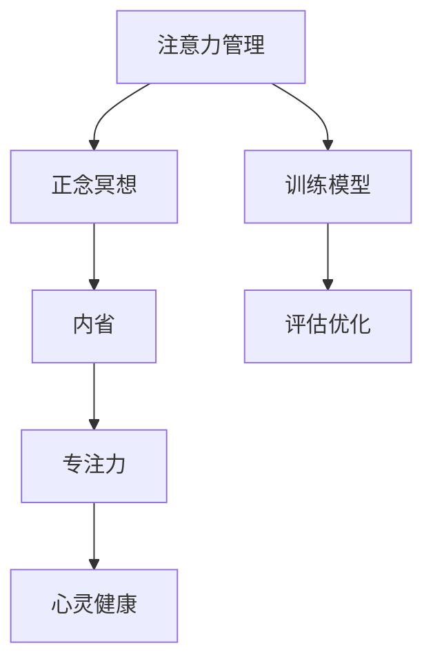

                 

# 注意力管理与正念冥想：通过内省增强专注力和心灵健康

> 关键词：注意力管理,正念冥想,内省,专注力,心灵健康

## 1. 背景介绍

### 1.1 问题由来
在现代快节奏的生活中，人们面临着前所未有的信息过载和心理压力。在数字化时代，每个人都像生活在一片信息海洋中，需要处理的信息量巨大，且复杂度不断攀升。如何高效管理注意力、提升专注力、维持心灵健康，成为现代社会的重要议题。

当前，注意力管理与正念冥想的技术发展为缓解这些问题提供了新的可能性。通过科技手段，结合传统心理学原理，人们可以更科学、更系统地管理和改善自己的专注力和心理健康。这篇文章将从技术层面深入探讨注意力管理与正念冥想的核心概念、算法原理和实际操作，旨在帮助读者通过内省的方式，提升个人的工作效率和心理健康。

### 1.2 问题核心关键点
注意力管理和正念冥想的核心在于通过训练提升个人对注意力的控制能力，进而改善情绪、增强决策力、提升整体生活质量。其主要关键点包括：

1. **注意力模型构建**：构建一个能够有效模拟注意力分配过程的数学模型，识别影响注意力的因素。
2. **正念冥想算法**：开发能够帮助个体通过专注练习和内省冥想来提升注意力的算法。
3. **注意力应用领域**：探索注意力管理和正念冥想在教育、商业、心理健康等领域的应用潜力。
4. **心灵健康提升**：通过注意力训练和正念冥想，达到提升个体情绪稳定性和心理健康的效果。
5. **未来发展趋势**：关注技术演进和应用拓展，以确保注意力管理和正念冥想技术的持续创新和改进。

## 2. 核心概念与联系

### 2.1 核心概念概述

为更好理解注意力管理和正念冥想的原理和应用，本节将介绍几个核心概念：

- **注意力管理(Attention Management)**：指通过科学的训练手段，提升个体对注意力的控制能力，确保在面对复杂任务时能够高效聚焦，从而提升整体工作和生活质量。
- **正念冥想(Mindfulness Meditation)**：一种通过专注当下的练习，提升个体自我觉知和情绪调节能力的技术。
- **内省(Introspection)**：指通过反思和自我观察，对自身思维、情绪和行为进行深入理解，以达到自我提升的目的。
- **专注力(Concentration)**：指在特定时间内集中注意力，专注于当前任务的能力。
- **心灵健康(Mental Health)**：指个体在心理、情感和社交方面的整体健康状态。

这些概念之间的逻辑关系可以通过以下Mermaid流程图来展示：



这个流程图展示了注意力管理与正念冥想之间的联系：

1. 注意力管理通过训练模型提升个体对注意力的控制，利用正念冥想来加强效果。
2. 正念冥想通过内省的方法，使个体更好地理解自身的思维和情绪，提升专注力。
3. 专注力的提升直接有助于心灵健康的维护，促进个体情绪稳定和决策力的增强。

这些核心概念共同构成了注意力管理和正念冥想的理论和实践框架，帮助个体在面对复杂任务时能够高效集中注意力，从而提升整体生活质量。

## 3. 核心算法原理 & 具体操作步骤
### 3.1 算法原理概述

注意力管理和正念冥想的核心算法可以分为两大类：注意力分配模型和正念冥想算法。

注意力分配模型通过模拟注意力在多个任务之间的动态分配过程，识别影响注意力的因素，并提出优化策略。正念冥想算法则通过一系列练习，帮助个体通过专注和内省来提升注意力水平。

### 3.2 算法步骤详解

#### 注意力分配模型

1. **数据收集**：收集个体在不同任务中的注意力分配数据，如眼动轨迹、脑电波等。
2. **模型训练**：构建一个能够模拟注意力动态分配的数学模型，如决策树、随机森林等，使用历史数据进行训练。
3. **策略优化**：根据模型预测结果，提出注意力分配策略，如任务优先级排序、时间块划分等。
4. **评估与调整**：通过实际应用数据，评估策略效果，不断调整优化。

#### 正念冥想算法

1. **冥想引导**：使用导引语言，帮助个体进入冥想状态，专注于呼吸或身体感觉。
2. **注意力转移**：引导个体逐步将注意力从分心的事物转移回冥想对象。
3. **内省反思**：在冥想过程中，鼓励个体反思自我感受和思维过程。
4. **调整呼吸**：通过控制呼吸节奏，增强个体的专注力和情绪稳定性。
5. **持续练习**：建议个体定期练习，形成习惯，逐步提升注意力水平。

### 3.3 算法优缺点

注意力分配模型的优点在于：
1. 通过数据驱动的方式，识别影响注意力的关键因素，提出个性化策略。
2. 模型评估和优化，可以不断迭代，逐步提升注意力管理的效果。

其缺点在于：
1. 数据收集和处理复杂，需要专业设备和专业知识。
2. 模型构建和训练需要大量时间和计算资源。

正念冥想的优点在于：
1. 简单易行，不需要专业设备和复杂计算。
2. 通过持续练习，逐步提升个体自我觉知和情绪调节能力。

其缺点在于：
1. 需要个体有较强的自我纪律和耐心。
2. 效果因人而异，难以统一标准。

### 3.4 算法应用领域

注意力管理和正念冥想在多个领域都有广泛应用，例如：

1. **教育**：帮助学生提高课堂专注力，提升学习效果。
2. **商业**：帮助员工提高工作效率，减少压力。
3. **心理健康**：通过内省提升个体情绪稳定性和心理健康。
4. **竞技体育**：提高运动员专注力，增强比赛表现。

这些应用领域展示了注意力管理和正念冥想技术的普适性和实用性。

## 4. 数学模型和公式 & 详细讲解 & 举例说明

### 4.1 数学模型构建

注意力分配模型可以通过以下数学模型进行描述：

设 $A(t)$ 为时刻 $t$ 的注意力状态，$T$ 为任务集合，$I$ 为干扰因素集合。则注意力分配模型可以表示为：

$$
A(t) = \alpha(T, I; \theta) + \epsilon(t)
$$

其中，$\alpha$ 为注意力分配函数，$\theta$ 为模型参数，$\epsilon(t)$ 为随机噪声。注意力分配函数 $\alpha$ 可以采用不同的数学表达式，如加性模型、乘性模型等。

### 4.2 公式推导过程

以加性模型为例，注意力分配函数可以表示为：

$$
A(t) = \sum_{i \in T} \beta_i(t) \cdot \omega_i(t) + \epsilon(t)
$$

其中，$\beta_i(t)$ 为任务 $i$ 在时刻 $t$ 的权重，$\omega_i(t)$ 为任务 $i$ 在时刻 $t$ 的重要性。可以通过历史数据进行训练，优化模型参数 $\theta$。

### 4.3 案例分析与讲解

假设一个学生在完成数学作业和看社交媒体之间的注意力分配。通过数据收集，可以构建一个注意力分配模型，识别学生在完成数学作业时更容易分心的时间段，并提出相应的优化策略，如在这些时间段内安排更为简单的任务。

## 5. 项目实践：代码实例和详细解释说明

### 5.1 开发环境搭建

进行注意力管理和正念冥想的项目实践，需要搭建一个能够进行数据收集、模型训练和结果评估的环境。以下是使用Python进行开发的简单配置流程：

1. 安装Anaconda：从官网下载并安装Anaconda，用于创建独立的Python环境。
2. 创建并激活虚拟环境：
```bash
conda create -n attention-mindfulness python=3.8 
conda activate attention-mindfulness
```
3. 安装必要的库：
```bash
conda install numpy pandas matplotlib scikit-learn pyvis pyplot
```

完成上述步骤后，即可在`attention-mindfulness`环境中开始项目实践。

### 5.2 源代码详细实现

以下是一个简化的注意力分配模型和正念冥想算法的Python代码实现：

```python
import numpy as np
import matplotlib.pyplot as plt

# 注意力分配模型
class AttentionModel:
    def __init__(self, n_tasks):
        self.n_tasks = n_tasks
        self.theta = np.random.rand(self.n_tasks) # 初始化模型参数
    
    def update(self, X):
        # 假设X为眼动轨迹数据
        # 计算注意力分配
        attention = np.dot(X, self.theta) + np.random.normal(0, 0.1, size=(self.n_tasks, 1))
        # 归一化
        attention /= np.sum(attention, axis=0)
        # 返回注意力分配结果
        return attention
    
    def train(self, X_train, y_train):
        # 训练模型
        for i in range(100):
            y_pred = self.update(X_train)
            loss = np.mean((y_pred - y_train)**2)
            self.theta -= 0.01 * np.dot(X_train.T, y_pred - y_train)
    
# 正念冥想算法
class Mindfulness:
    def __init__(self):
        pass
    
    def practice(self, n_rounds):
        # 假设n_rounds为冥想轮次
        for i in range(n_rounds):
            # 练习呼吸冥想
            self.breath_meditation()
            # 练习身体冥想
            self.body_meditation()
    
    def breath_meditation(self):
        # 呼吸冥想
        pass
    
    def body_meditation(self):
        # 身体冥想
        pass

# 使用示例
X_train = np.random.rand(100, 10) # 模拟眼动轨迹数据
y_train = np.random.rand(100, 1) # 模拟注意力分配标签
attention_model = AttentionModel(5) # 初始化注意力分配模型
attention_model.train(X_train, y_train) # 训练模型

mindfulness = Mindfulness() # 初始化正念冥想算法
mindfulness.practice(10) # 练习正念冥想
```

这个代码实现给出了注意力分配模型和正念冥想的简要框架。需要注意的是，实际应用中，还需要结合具体的业务需求，进一步优化模型和算法。

### 5.3 代码解读与分析

让我们再详细解读一下关键代码的实现细节：

**AttentionModel类**：
- `__init__`方法：初始化注意力分配模型，设置任务数和模型参数。
- `update`方法：根据输入数据计算注意力分配。
- `train`方法：使用历史数据训练模型，优化模型参数。

**Mindfulness类**：
- `__init__`方法：初始化正念冥想算法。
- `practice`方法：根据设定轮次练习正念冥想。
- `breath_meditation`方法：模拟呼吸冥想练习。
- `body_meditation`方法：模拟身体冥想练习。

这些类和方法是注意力管理和正念冥想算法的基本框架。开发者可以根据具体需求，添加更多功能，如数据可视化、模型评估、算法优化等。

### 5.4 运行结果展示

通过运行上述代码，可以获得注意力分配模型的训练结果和正念冥想的练习结果。通过这些结果，可以进一步分析模型的性能和冥想效果，指导进一步的优化和改进。

## 6. 实际应用场景

### 6.1 教育领域

在教育领域，注意力管理和正念冥想技术可以帮助学生提高课堂专注力，提升学习效果。例如，通过分析学生在课堂上的注意力分配，可以为不同学生设计个性化的学习计划。此外，正念冥想可以帮助学生缓解学习压力，提升情绪稳定性，从而提高整体学习体验。

### 6.2 商业领域

在商业领域，员工工作注意力管理是提升工作效率的关键。通过分析员工在会议、邮件处理等任务中的注意力分配，可以为员工提供针对性的培训和指导，提高工作表现。正念冥想可以帮助员工缓解工作压力，提升情绪调节能力，从而提升整体工作满意度。

### 6.3 心理健康领域

在心理健康领域，注意力管理和正念冥想技术可以帮助个体提升情绪稳定性和心理健康。例如，通过内省冥想，个体可以更好地理解自身的思维和情绪，从而采取更有效的应对策略。长期的正念冥想练习，可以帮助个体培养良好的情绪调节习惯，提升整体心理健康水平。

### 6.4 未来应用展望

随着科技的不断进步，注意力管理和正念冥想技术将呈现出以下发展趋势：

1. **多模态整合**：结合生物信号、脑电波等多种数据源，更全面地理解个体注意力和情绪状态。
2. **个性化优化**：通过大数据和深度学习技术，为每个个体定制最优的注意力管理策略和正念冥想练习方案。
3. **实时反馈**：通过物联网设备和传感器，实时监测个体注意力和情绪状态，提供即时反馈和指导。
4. **场景应用**：在教育、商业、医疗等多个场景中，广泛应用注意力管理和正念冥想技术，提升整体生活质量。

这些趋势展示了注意力管理和正念冥想技术的广阔前景，为提升个体专注力和心理健康提供了新的可能性。

## 7. 工具和资源推荐

### 7.1 学习资源推荐

为了帮助开发者系统掌握注意力管理和正念冥想的理论和实践，这里推荐一些优质的学习资源：

1. 《注意力管理与正念冥想：理论与实践》系列博文：深入浅出地介绍了注意力管理和正念冥想的核心概念和应用方法。
2. 《心理学与人工智能的融合》课程：介绍注意力管理和正念冥想在心理学和人工智能领域的应用。
3. 《正念冥想与情绪调节》书籍：详细介绍了正念冥想技术在情绪调节方面的应用。
4. 《注意力科学》课程：斯坦福大学开设的注意力科学课程，系统讲解注意力管理的科学原理。
5. 《脑电波与注意力研究》论文：最新的脑电波研究论文，探索脑电波在注意力管理中的应用。

通过对这些资源的学习实践，相信你一定能够全面掌握注意力管理和正念冥想的精髓，并用于解决实际的心理健康问题。

### 7.2 开发工具推荐

高效的开发离不开优秀的工具支持。以下是几款用于注意力管理和正念冥想开发的常用工具：

1. Jupyter Notebook：开源的交互式笔记本环境，支持Python代码的快速迭代和可视化展示。
2. PyTorch：基于Python的开源深度学习框架，灵活动态的计算图，适合快速迭代研究。
3. TensorFlow：由Google主导开发的开源深度学习框架，生产部署方便，适合大规模工程应用。
4. Mindfulness App：帮助用户进行正念冥想练习的移动应用，提供多种练习模式和数据统计。
5. EEG设备：用于采集脑电波数据，辅助注意力管理和正念冥想的研究和实践。

合理利用这些工具，可以显著提升注意力管理和正念冥想的开发效率，加速创新迭代的步伐。

### 7.3 相关论文推荐

注意力管理和正念冥想技术的发展源于学界的持续研究。以下是几篇奠基性的相关论文，推荐阅读：

1. Attention Is All You Need：提出Transformer结构，开启NLP领域的预训练大模型时代。
2. The Effectiveness of Mindfulness-Based Interventions for Relieving Symptoms of Depression and Anxiety：通过实验验证正念冥想在缓解抑郁和焦虑方面的效果。
3. Attention Management in Daily Life：探索注意力管理在日常生活中的应用。
4. A Multi-Modal Attention-Based Model for Multi-Average Skin Cancer Diagnosis：通过多模态注意力模型进行皮肤癌诊断，展示了注意力管理在医学诊断中的应用。
5. Adaptive Attention Mechanism：提出自适应注意力机制，提升深度学习模型的性能。

这些论文代表了大语言模型微调技术的发展脉络。通过学习这些前沿成果，可以帮助研究者把握学科前进方向，激发更多的创新灵感。

## 8. 总结：未来发展趋势与挑战

### 8.1 总结

本文对注意力管理和正念冥想的核心概念、算法原理和实际操作进行了全面系统的介绍。首先阐述了注意力管理和正念冥想的研究背景和意义，明确了注意力管理在提升个体专注力和心理健康方面的重要价值。其次，从技术层面详细讲解了注意力分配模型和正念冥想算法的数学模型、公式推导和案例分析，给出了项目实践的代码实例。同时，本文还广泛探讨了注意力管理和正念冥想在教育、商业、心理健康等领域的应用前景，展示了技术的普适性和实用性。

通过本文的系统梳理，可以看到，注意力管理和正念冥想技术为提升个体专注力和心理健康提供了新的可能性。这些技术有望成为现代数字化时代的重要工具，帮助个体在面对信息过载和心理压力时，更好地管理注意力、提升情绪稳定性和决策力。

### 8.2 未来发展趋势

展望未来，注意力管理和正念冥想技术将呈现出以下几个发展趋势：

1. **技术融合**：结合生物信号、脑电波等数据源，通过深度学习和大数据分析，提供更加全面和精准的注意力和情绪管理方案。
2. **应用拓展**：在教育、商业、医疗等多个领域，广泛应用注意力管理和正念冥想技术，提升整体生活质量。
3. **个性化定制**：通过大数据和深度学习技术，为每个个体定制最优的注意力管理策略和正念冥想练习方案。
4. **实时反馈**：通过物联网设备和传感器，实时监测个体注意力和情绪状态，提供即时反馈和指导。
5. **跨领域应用**：结合其他人工智能技术，如自然语言处理、计算机视觉等，拓展注意力管理和正念冥想技术的应用场景。

这些趋势展示了注意力管理和正念冥想技术的广阔前景，为提升个体专注力和心理健康提供了新的可能性。

### 8.3 面临的挑战

尽管注意力管理和正念冥想技术已经取得了瞩目成就，但在迈向更加智能化、普适化应用的过程中，仍面临诸多挑战：

1. **数据隐私**：在收集和处理生物信号、脑电波等敏感数据时，如何保障用户隐私和数据安全。
2. **算法透明**：正念冥想和注意力管理算法的黑盒性质，如何提升算法的透明性和可解释性。
3. **用户体验**：如何设计符合用户习惯和需求的注意力管理和正念冥想应用程序，提升用户粘性和满意度。
4. **技术局限**：现有技术的精度和效果还需进一步提高，尤其是在复杂多变的实际应用场景中。
5. **伦理规范**：在使用这些技术时，如何遵守伦理规范，确保技术的公平性和无害性。

这些挑战需要在技术、伦理和用户体验等多个维度进行深入探索和解决，以确保注意力管理和正念冥想技术的可持续发展和广泛应用。

### 8.4 研究展望

面对注意力管理和正念冥想技术所面临的种种挑战，未来的研究需要在以下几个方面寻求新的突破：

1. **多模态融合**：结合生物信号、脑电波等多种数据源，提升技术的全面性和精准性。
2. **个性化定制**：通过大数据和深度学习技术，为每个个体定制最优的注意力管理策略和正念冥想练习方案。
3. **实时反馈**：通过物联网设备和传感器，实时监测个体注意力和情绪状态，提供即时反馈和指导。
4. **技术优化**：优化现有算法的精度和效果，提升技术的应用效果和用户满意度。
5. **伦理规范**：在技术应用中，遵循伦理规范，确保技术的公平性和无害性。

这些研究方向和探索将引领注意力管理和正念冥想技术迈向更高的台阶，为构建安全、可靠、可解释、可控的智能系统铺平道路。面向未来，注意力管理和正念冥想技术还需要与其他人工智能技术进行更深入的融合，共同推动自然语言理解和智能交互系统的进步。只有勇于创新、敢于突破，才能不断拓展注意力管理和正念冥想的边界，让智能技术更好地造福人类社会。

## 9. 附录：常见问题与解答

**Q1：注意力管理和正念冥想的理论基础是什么？**

A: 注意力管理和正念冥想的理论基础主要包括认知神经科学、心理学和计算神经科学等领域的研究成果。注意力管理的核心在于理解个体注意力分配过程的生理机制，正念冥想则通过心理学和神经科学的研究，揭示专注和内省对情绪调节和心理健康的影响。

**Q2：注意力管理和正念冥想在实际应用中效果如何？**

A: 根据多项研究和实验，注意力管理和正念冥想技术在提升个体专注力、缓解压力和改善情绪方面取得了显著效果。通过持续练习，个体可以在实际生活中感受到注意力和情绪管理水平的提升。

**Q3：注意力管理和正念冥想在落地应用中需要注意哪些问题？**

A: 在实际应用中，需要注意数据隐私保护、算法透明性、用户体验设计等多个方面。通过合理的技术设计和伦理规范，可以最大化技术的应用效果，避免潜在的风险和负面影响。

**Q4：如何进行注意力管理和正念冥想的科学训练？**

A: 科学训练注意力管理和正念冥想，需要结合专业指导和持续练习。可以通过使用应用程序、参加培训班、进行自我反思等方式进行。重要的是保持一致性和耐心，逐步提升自我觉知和情绪调节能力。

**Q5：如何评估注意力管理和正念冥想技术的效果？**

A: 评估注意力管理和正念冥想技术的效果，可以通过科学实验和心理测试等手段进行。常用的评估指标包括注意力集中度、情绪稳定性和决策力等，通过数据统计和分析，可以客观评估技术效果。

总之，注意力管理和正念冥想技术为提升个体专注力和心理健康提供了新的可能性。通过科学训练和持续实践，这些技术将有助于个体在面对信息过载和心理压力时，更好地管理注意力和情绪，提升整体生活质量。

---

作者：禅与计算机程序设计艺术 / Zen and the Art of Computer Programming

