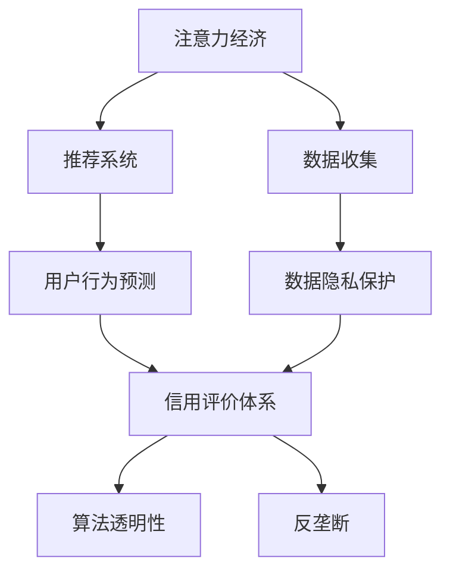

                 

# 注意力经济与个人信用体系的构建

> 关键词：注意力经济, 个人信用体系, 推荐系统, 数据隐私, 算法透明, 反垄断

## 1. 背景介绍

### 1.1 问题由来

在互联网经济的时代背景下，用户注意力成为最宝贵的资源之一。各类互联网应用，如社交媒体、新闻平台、视频网站等，都在争夺用户的宝贵注意力。因此，如何有效管理和利用用户注意力，成为了互联网企业的核心竞争力之一。

同时，随着个人信用在社会生活的各个方面扮演着越来越重要的角色，如何构建一个高效、安全、可信的个人信用体系，也成为了各国政府和企业关注的焦点。有效的个人信用体系不仅能提升社会治理效率，还能促进金融服务的普惠性，带来更多的商业机会。

本文旨在探讨注意力经济和个人信用体系构建之间的联系，从技术和伦理角度出发，提出基于推荐系统的注意力经济和个人信用体系构建框架，以期为解决上述问题提供新的思路和方法。

### 1.2 问题核心关键点

在构建基于推荐系统的注意力经济和个人信用体系时，需要重点考虑以下关键问题：

1. **注意力资源管理**：如何有效地收集、分配和利用用户注意力资源，最大化注意力经济价值。
2. **数据隐私保护**：在收集和利用用户数据时，如何平衡商业利益和数据隐私保护，保护用户个人信息安全。
3. **算法透明性和公平性**：如何保证推荐算法的透明度和公平性，防止数据偏见和算法滥用。
4. **用户行为预测**：如何准确预测用户行为，实现个性化推荐，提升用户体验和满意度。
5. **信用评价体系设计**：如何构建一个全面、公正、可解释的个人信用评价体系，提升信用评价的准确性和可信度。

这些问题构成了构建注意力经济和个人信用体系的基石，需要在设计和实践中进行综合考虑和优化。

## 2. 核心概念与联系

### 2.1 核心概念概述

在探讨注意力经济和个人信用体系构建的框架时，涉及以下核心概念：

- **注意力经济**：指通过收集和分配用户注意力资源，创造经济价值的过程。在互联网时代，注意力已成为重要的资源，企业通过吸引用户注意力，提供有价值的信息和服务，实现商业变现。

- **推荐系统**：根据用户的历史行为和偏好，为用户推荐个性化内容的技术系统。推荐系统在提升用户满意度和广告效果方面发挥着重要作用，是注意力经济的核心工具。

- **个人信用体系**：通过收集和分析用户的信用行为数据，评估用户信用水平，提供信用评价和信用管理服务，提升社会治理效率和金融服务的普惠性。

- **数据隐私保护**：在收集和处理用户数据时，保护用户个人信息安全，防止数据滥用和隐私泄露。

- **算法透明性**：确保推荐算法的决策过程公开透明，防止算法偏见和滥用，提升用户信任和满意度。

- **反垄断**：防止数据和算法滥用导致的市场垄断，促进公平竞争，保障消费者权益。

这些概念之间的联系紧密，共同构成了构建基于推荐系统的注意力经济和个人信用体系的框架。

### 2.2 核心概念原理和架构的 Mermaid 流程图



以上流程图展示了注意力经济、数据收集、推荐系统、用户行为预测、信用评价体系、数据隐私保护、算法透明性和反垄断之间的联系和交互。

## 3. 核心算法原理 & 具体操作步骤

### 3.1 算法原理概述

构建基于推荐系统的注意力经济和个人信用体系，其核心在于如何将用户的注意力和行为数据，转化为对用户进行精准推荐和信用评价的算法模型。这一过程主要包括以下几个步骤：

1. **注意力资源收集**：通过用户行为数据，如浏览记录、点击行为、搜索关键词等，收集用户注意力资源。
2. **用户行为预测**：基于收集到的注意力资源，通过推荐算法预测用户可能感兴趣的内容或服务。
3. **信用评价体系设计**：根据用户的行为数据，设计一个全面、公正、可解释的个人信用评价体系。
4. **注意力经济变现**：通过推荐系统将用户注意力资源转化为经济价值，如广告展示、内容付费等。
5. **数据隐私保护**：在数据收集和处理过程中，保护用户隐私，防止数据滥用和泄露。

### 3.2 算法步骤详解

**Step 1: 数据收集**

1. **用户行为数据收集**：通过网站、应用、广告等渠道收集用户的行为数据，包括但不限于浏览记录、点击行为、搜索关键词等。
2. **注意力资源转换**：将行为数据转换为注意力资源，用于后续的推荐和信用评价。

**Step 2: 用户行为预测**

1. **特征工程**：提取用户行为数据中的特征，如用户兴趣、行为模式、时间特征等。
2. **模型训练**：使用机器学习或深度学习算法，如协同过滤、神经网络等，训练用户行为预测模型。
3. **推荐结果生成**：根据用户当前的行为和预测模型，生成个性化推荐结果。

**Step 3: 信用评价体系设计**

1. **评价指标定义**：定义信用评价的指标，如信用评分、信用历史、负债情况等。
2. **信用数据收集**：收集用户的信用行为数据，如信用卡使用记录、贷款还款记录等。
3. **信用评价模型训练**：使用信用数据训练信用评价模型，如逻辑回归、决策树等。
4. **信用评价结果生成**：根据信用评价模型，生成用户的信用评价结果。

**Step 4: 注意力经济变现**

1. **广告推荐**：通过推荐系统将广告精准推送给潜在用户，实现广告的定向展示。
2. **内容付费**：根据用户的兴趣和行为，推荐有价值的内容，实现内容付费模式。
3. **个性化服务**：提供个性化的服务，如金融、教育、娱乐等，提升用户体验和满意度。

**Step 5: 数据隐私保护**

1. **数据匿名化**：对收集到的数据进行匿名化处理，防止数据泄露。
2. **数据加密**：对敏感数据进行加密存储，防止数据滥用。
3. **访问控制**：限制数据访问权限，确保数据仅被授权人员使用。

### 3.3 算法优缺点

基于推荐系统的注意力经济和个人信用体系的构建，具有以下优点：

1. **提高用户满意度**：通过个性化推荐，提升用户满意度和忠诚度，增加用户粘性。
2. **增加商业价值**：通过精准广告推荐和内容付费，增加企业的商业收入和利润。
3. **提升信用评价准确性**：通过全面的信用行为数据，提升信用评价的准确性和可信度。

同时，也存在以下缺点：

1. **隐私风险**：在收集和处理用户数据时，可能存在隐私泄露的风险。
2. **算法偏见**：推荐算法可能存在数据偏见，导致不公平的推荐结果。
3. **透明度不足**：推荐算法的决策过程不透明，可能导致用户信任度下降。
4. **技术复杂性**：构建基于推荐系统的注意力经济和个人信用体系，需要复杂的技术实现和维护。

### 3.4 算法应用领域

基于推荐系统的注意力经济和个人信用体系，可以应用于以下几个领域：

1. **电商领域**：通过推荐系统提升用户购买决策，增加销售额和客户满意度。
2. **金融领域**：通过信用评价体系提升金融服务的普惠性和准确性，降低风险。
3. **媒体领域**：通过广告推荐和内容付费，增加媒体平台的收入和用户粘性。
4. **教育领域**：通过个性化推荐，提升教育内容和服务的吸引力，增加用户参与度。
5. **公共服务领域**：通过信用评价体系，提升社会治理效率和公共服务质量。

## 4. 数学模型和公式 & 详细讲解 & 举例说明

### 4.1 数学模型构建

假设用户的注意力资源为 $A$，推荐系统的推荐结果为 $R$，信用评价体系的信用评分为 $C$。基于推荐系统的注意力经济和个人信用体系构建的数学模型可以表示为：

$$
\maximize \quad A \cdot R
$$

其中 $A$ 表示用户的注意力资源，$R$ 表示推荐系统的推荐效果。

### 4.2 公式推导过程

在推荐系统的用户行为预测过程中，常用的推荐算法包括协同过滤和基于内容的推荐。协同过滤算法基于用户-物品评分矩阵，通过计算用户之间的相似度，预测用户对新物品的评分。基于内容的推荐算法则根据物品的特征，预测用户对物品的兴趣。

对于信用评价体系，常用的信用评分模型包括逻辑回归和决策树。逻辑回归模型根据用户的行为数据，预测用户的信用评分，模型可以表示为：

$$
P(C=1|A) = \sigma(\sum_{i=1}^{n} x_i \cdot w_i)
$$

其中 $x_i$ 表示第 $i$ 个特征，$w_i$ 表示第 $i$ 个特征的权重，$\sigma$ 表示 sigmoid 函数。

### 4.3 案例分析与讲解

假设某电商平台希望通过推荐系统提升用户购买决策和满意度，同时建立用户信用评价体系，提升金融服务的普惠性。

1. **数据收集**：收集用户的浏览记录、点击行为、购买记录等注意力数据，以及用户的信用评分数据。
2. **特征工程**：提取用户的兴趣特征、行为模式、时间特征等，构建特征向量 $X$。
3. **模型训练**：使用协同过滤算法或基于内容的推荐算法，训练推荐模型，生成个性化推荐结果 $R$。
4. **信用评分预测**：使用逻辑回归模型，预测用户的信用评分 $C$。
5. **注意力经济变现**：通过推荐系统实现个性化广告推荐和内容付费，增加电商平台的收入。
6. **信用评价应用**：根据用户的信用评分，提供相应的金融服务，如贷款、信用卡等。
7. **数据隐私保护**：对用户行为数据进行匿名化处理，防止数据泄露和滥用。

## 5. 项目实践：代码实例和详细解释说明

### 5.1 开发环境搭建

在进行项目实践前，我们需要准备好开发环境。以下是使用Python进行PyTorch开发的环境配置流程：

1. 安装Anaconda：从官网下载并安装Anaconda，用于创建独立的Python环境。

2. 创建并激活虚拟环境：
```bash
conda create -n pytorch-env python=3.8 
conda activate pytorch-env
```

3. 安装PyTorch：根据CUDA版本，从官网获取对应的安装命令。例如：
```bash
conda install pytorch torchvision torchaudio cudatoolkit=11.1 -c pytorch -c conda-forge
```

4. 安装TensorFlow：
```bash
pip install tensorflow==2.7.0
```

5. 安装各类工具包：
```bash
pip install numpy pandas scikit-learn matplotlib tqdm jupyter notebook ipython
```

完成上述步骤后，即可在`pytorch-env`环境中开始项目实践。

### 5.2 源代码详细实现

下面我们以推荐系统为例，给出使用PyTorch进行用户行为预测的PyTorch代码实现。

首先，定义用户行为预测模型：

```python
import torch
import torch.nn as nn
import torch.optim as optim

class UserBehaviorModel(nn.Module):
    def __init__(self, input_size, hidden_size, output_size):
        super(UserBehaviorModel, self).__init__()
        self.fc1 = nn.Linear(input_size, hidden_size)
        self.fc2 = nn.Linear(hidden_size, output_size)
        self.sigmoid = nn.Sigmoid()

    def forward(self, x):
        x = self.fc1(x)
        x = torch.tanh(x)
        x = self.fc2(x)
        return self.sigmoid(x)
```

然后，定义训练函数：

```python
def train_model(model, train_dataset, epochs, batch_size, learning_rate):
    optimizer = optim.Adam(model.parameters(), lr=learning_rate)
    criterion = nn.BCELoss()

    for epoch in range(epochs):
        for batch in train_dataset:
            inputs, labels = batch
            optimizer.zero_grad()
            outputs = model(inputs)
            loss = criterion(outputs, labels)
            loss.backward()
            optimizer.step()

        print(f"Epoch {epoch+1}, loss: {loss:.4f}")
```

最后，启动训练流程：

```python
epochs = 10
batch_size = 64
learning_rate = 0.001

model = UserBehaviorModel(input_size=100, hidden_size=128, output_size=1)
train_dataset = # 准备训练数据集
train_model(model, train_dataset, epochs, batch_size, learning_rate)
```

以上就是使用PyTorch进行用户行为预测的完整代码实现。可以看到，通过定义用户行为预测模型和训练函数，可以完成推荐系统的用户行为预测。

### 5.3 代码解读与分析

让我们再详细解读一下关键代码的实现细节：

**UserBehaviorModel类**：
- `__init__`方法：初始化模型参数，包括输入层、隐藏层、输出层和激活函数。
- `forward`方法：定义模型的前向传播过程，通过两层线性变换和sigmoid激活函数，计算输出。

**train_model函数**：
- `optimizer`：定义优化器，使用Adam算法，设置学习率。
- `criterion`：定义损失函数，使用二元交叉熵损失。
- 在每个epoch中，对训练数据进行迭代，前向传播计算输出，反向传播更新模型参数。

**训练流程**：
- 定义总epoch数、batch size和学习率，初始化模型。
- 通过循环迭代训练数据，每个batch进行一次前向传播和反向传播，更新模型参数。
- 打印当前epoch的损失值，循环直到训练完成。

通过上述代码实现，我们展示了基于推荐系统的注意力经济构建的基本框架。在实际应用中，还需要进一步完善数据收集、特征工程、模型评估等环节，确保推荐系统的高效运行。

## 6. 实际应用场景

### 6.1 智能推荐系统

智能推荐系统是构建基于推荐系统的注意力经济的核心工具。电商、新闻、视频等各类应用，都广泛应用推荐系统提升用户体验和平台收入。

1. **电商推荐**：通过推荐系统，为用户推荐可能感兴趣的商品，提升购买决策和满意度。
2. **新闻推荐**：根据用户阅读历史和行为，推荐相关的新闻内容，增加用户粘性。
3. **视频推荐**：根据用户的观看历史，推荐新的视频内容，提高平台用户留存率。

智能推荐系统通过精准预测用户行为，提升平台的用户满意度和收益。但同时，也存在数据隐私和安全问题，需要严格保护用户数据。

### 6.2 金融信用体系

金融信用体系是构建个人信用体系的重要组成部分，通过信用评分和信用管理服务，提升金融服务的普惠性和安全性。

1. **信用评分**：根据用户的信用行为数据，评估用户的信用水平，提供信用评分。
2. **信用管理**：提供贷款、信用卡等金融服务，提升金融服务的普惠性和安全性。
3. **反欺诈**：通过信用评分和行为监测，防止金融欺诈行为，提升金融服务的安全性。

金融信用体系不仅提升金融服务的普惠性和安全性，还能促进金融市场的健康发展。但同时，也存在算法透明和反垄断问题，需要合理设计和监管。

### 6.3 反垄断和公平性

构建基于推荐系统的注意力经济和个人信用体系，需要防止数据和算法滥用导致的市场垄断问题。

1. **数据共享**：防止数据滥用导致的市场垄断，确保数据仅用于提升用户体验和平台收益。
2. **算法公平性**：防止算法偏见和滥用，确保推荐系统的公平性和公正性。
3. **反垄断监管**：通过立法和监管，防止市场垄断，保障消费者权益。

反垄断和公平性问题在构建基于推荐系统的注意力经济和个人信用体系中至关重要，需要政府和企业共同努力，确保市场的公平竞争和用户权益。

## 7. 工具和资源推荐

### 7.1 学习资源推荐

为了帮助开发者系统掌握基于推荐系统的注意力经济和个人信用体系的构建，这里推荐一些优质的学习资源：

1. 《深度学习推荐系统：原理与实践》：详细介绍推荐系统的原理和实践，涵盖协同过滤、基于内容的推荐等主流方法。
2. 《Python推荐系统实战》：使用Python实现推荐系统的实战指南，包括数据收集、特征工程、模型训练等步骤。
3. 《信用评分与信用管理》：详细介绍信用评分的原理和应用，涵盖逻辑回归、决策树等信用评分模型。
4. 《数据隐私保护》：详细介绍数据隐私保护的基本概念和实现方法，涵盖数据匿名化、加密存储等技术。

通过对这些资源的学习实践，相信你一定能够快速掌握基于推荐系统的注意力经济和个人信用体系的构建方法，并用于解决实际的NLP问题。

### 7.2 开发工具推荐

高效的开发离不开优秀的工具支持。以下是几款用于基于推荐系统的注意力经济和个人信用体系构建的常用工具：

1. PyTorch：基于Python的开源深度学习框架，灵活动态的计算图，适合快速迭代研究。
2. TensorFlow：由Google主导开发的开源深度学习框架，生产部署方便，适合大规模工程应用。
3. Weights & Biases：模型训练的实验跟踪工具，可以记录和可视化模型训练过程中的各项指标，方便对比和调优。
4. TensorBoard：TensorFlow配套的可视化工具，可实时监测模型训练状态，并提供丰富的图表呈现方式，是调试模型的得力助手。
5. Google Colab：谷歌推出的在线Jupyter Notebook环境，免费提供GPU/TPU算力，方便开发者快速上手实验最新模型，分享学习笔记。

合理利用这些工具，可以显著提升基于推荐系统的注意力经济和个人信用体系构建的开发效率，加快创新迭代的步伐。

### 7.3 相关论文推荐

基于推荐系统的注意力经济和个人信用体系的发展源于学界的持续研究。以下是几篇奠基性的相关论文，推荐阅读：

1. Matrix Factorization Techniques for Recommender Systems（矩阵分解推荐系统）：介绍了协同过滤算法的原理和实现方法，是推荐系统领域的重要基础。
2. Attention is All You Need（即Transformer原论文）：提出了Transformer结构，开启了NLP领域的预训练大模型时代，对推荐系统的注意力机制也有重要启示。
3. BERT: Pre-training of Deep Bidirectional Transformers for Language Understanding（BERT论文）：提出BERT模型，引入基于掩码的自监督预训练任务，刷新了多项NLP任务SOTA，对推荐系统的数据预处理也有重要参考价值。
4. Recommender Systems for Online Learning Platforms（在线学习平台的推荐系统）：介绍了在线学习平台的推荐系统设计和应用，涵盖用户行为预测和信用评价等多个方面。

这些论文代表了大语言模型微调技术的发展脉络。通过学习这些前沿成果，可以帮助研究者把握学科前进方向，激发更多的创新灵感。

## 8. 总结：未来发展趋势与挑战

### 8.1 总结

本文对基于推荐系统的注意力经济和个人信用体系的构建进行了全面系统的介绍。首先阐述了注意力经济和个人信用体系的研究背景和意义，明确了基于推荐系统的构建框架。其次，从原理到实践，详细讲解了推荐算法的数学模型和实现步骤，给出了推荐系统的完整代码实例。同时，本文还广泛探讨了推荐系统在电商、金融、教育等多个行业领域的应用前景，展示了推荐系统的巨大潜力。

通过本文的系统梳理，可以看到，基于推荐系统的注意力经济和个人信用体系的构建框架，已经在大规模应用中取得了显著效果，为社会的数字化转型和金融服务的普惠化提供了有力支持。未来，伴随技术的不断演进，推荐系统将更加智能化、普适化，更好地服务于用户的生产生活方式。

### 8.2 未来发展趋势

展望未来，基于推荐系统的注意力经济和个人信用体系将呈现以下几个发展趋势：

1. **智能化水平提升**：推荐算法将更加智能，能够更好地理解用户需求，提供个性化的服务和推荐。
2. **数据融合和跨领域应用**：通过多模态数据的融合和跨领域应用，提升推荐系统的适应性和灵活性。
3. **公平性和透明性提升**：推荐系统将更加注重公平性和透明性，防止算法偏见和滥用。
4. **隐私保护和反垄断加强**：在数据收集和处理过程中，加强隐私保护和反垄断监管，保障用户权益和市场公平。
5. **个性化服务的泛化性提升**：通过更全面的用户行为分析和信用评价，提升个性化服务的泛化性和普适性。

以上趋势凸显了基于推荐系统的注意力经济和个人信用体系的广阔前景。这些方向的探索发展，必将进一步提升推荐系统的性能和应用范围，为社会带来更大的价值。

### 8.3 面临的挑战

尽管基于推荐系统的注意力经济和个人信用体系已经取得了显著成效，但在迈向更加智能化、普适化应用的过程中，也面临诸多挑战：

1. **数据隐私和安全问题**：在数据收集和处理过程中，存在隐私泄露和数据滥用的风险，需要严格保护用户数据。
2. **算法偏见和公平性问题**：推荐算法可能存在数据偏见，导致不公平的推荐结果，需要设计公平透明的算法。
3. **模型透明性和解释性问题**：推荐模型的决策过程不透明，可能导致用户信任度下降，需要提升模型的可解释性。
4. **技术复杂性和资源消耗问题**：推荐系统的实现和维护需要复杂的技术手段和资源支持，需要优化资源使用和算法效率。
5. **跨领域和跨模态应用问题**：推荐系统需要适应不同领域和模态的数据，需要设计通用的推荐框架和模型。

这些挑战需要在技术、伦理和政策等多个维度进行综合考虑和优化，才能实现基于推荐系统的注意力经济和个人信用体系的持续发展和优化。

### 8.4 研究展望

面对基于推荐系统的注意力经济和个人信用体系所面临的挑战，未来的研究需要在以下几个方面寻求新的突破：

1. **多模态数据融合**：通过融合不同模态的数据，提升推荐系统的适应性和泛化性。
2. **算法透明性和解释性**：设计透明和可解释的推荐算法，提升用户信任和满意度。
3. **隐私保护和反垄断**：通过隐私保护和反垄断技术，保障用户权益和市场公平。
4. **跨领域和跨模态应用**：设计通用的推荐框架和模型，适应不同领域和模态的数据。
5. **智能化和普适化提升**：通过更智能的算法和更泛化的模型，提升推荐系统的智能化和普适化水平。

这些研究方向将引领基于推荐系统的注意力经济和个人信用体系的发展，为构建安全、可靠、可解释、可控的智能系统铺平道路。

## 9. 附录：常见问题与解答

**Q1：推荐系统如何处理用户注意力资源？**

A: 推荐系统通过收集用户的注意力资源，如浏览记录、点击行为等，进行特征工程和模型训练，预测用户可能感兴趣的内容或服务。通过推荐算法，将注意力资源转化为个性化推荐结果。

**Q2：推荐系统如何保证推荐结果的公平性和透明性？**

A: 推荐系统可以通过以下方式保证推荐结果的公平性和透明性：
1. 数据预处理：对数据进行去重、归一化等预处理，防止数据偏见。
2. 模型透明性：使用可解释的推荐算法，如协同过滤、基于内容的推荐等。
3. 反偏见设计：设计反偏见模型，识别和纠正推荐过程中的数据偏见。
4. 用户反馈：收集用户反馈，持续优化推荐算法，提高推荐公平性。

**Q3：推荐系统如何保护用户隐私？**

A: 推荐系统可以通过以下方式保护用户隐私：
1. 数据匿名化：对数据进行匿名化处理，防止数据泄露。
2. 数据加密：对敏感数据进行加密存储，防止数据滥用。
3. 访问控制：限制数据访问权限，确保数据仅被授权人员使用。
4. 差分隐私：使用差分隐私技术，在保护用户隐私的同时，保证推荐系统的有效性。

通过上述措施，推荐系统可以在保护用户隐私的同时，提供高质量的个性化推荐服务。

**Q4：推荐系统如何优化资源使用和算法效率？**

A: 推荐系统可以通过以下方式优化资源使用和算法效率：
1. 模型压缩：使用模型压缩技术，减少模型参数和计算量，提高推理速度。
2. 梯度优化：使用梯度优化算法，如AdamW、Adafactor等，提高模型训练效率。
3. 特征选择：使用特征选择算法，选择对推荐结果影响较大的特征，减少计算量。
4. 分布式训练：使用分布式训练技术，加速模型训练和推理。

通过优化资源使用和算法效率，推荐系统可以在更高效地提供个性化推荐服务的同时，提升用户体验和平台收益。

---

作者：禅与计算机程序设计艺术 / Zen and the Art of Computer Programming

