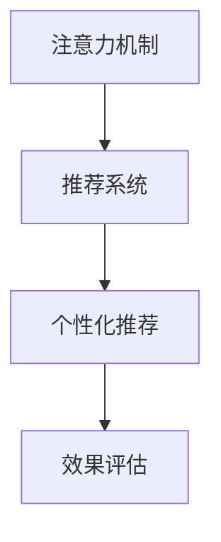

                 

## 1. 背景介绍

### 1.1 问题由来

在数字时代，信息的爆炸性增长带来了前所未有的学习资源和机遇。然而，注意力稀缺的矛盾也日益凸显。用户面临着信息过载的困境，如何高效地从海量信息中筛选、整合、利用有价值的内容，成为了一个重要的议题。“注意力经济”（Attention Economy）应运而生，旨在探索如何通过分配和利用用户的注意力资源，提升信息获取的效率和质量。

### 1.2 问题核心关键点

- **信息过载**：互联网时代信息量爆炸式增长，用户难以筛选和处理大量信息。
- **注意力稀缺**：用户注意力有限，难以对所有信息保持高关注度。
- **信息筛选**：需要有效机制从海量的信息中筛选出有价值的内容。
- **内容推荐**：根据用户兴趣和行为推荐个性化内容，提升用户体验。
- **效果评估**：评估个性化推荐系统的准确性和效率，保障推荐效果。

### 1.3 问题研究意义

研究“注意力经济”与个人学习效能的提升，对于解决数字时代信息过载问题，提升个体学习效率和决策能力具有重要意义：

1. **提升学习效率**：通过个性化推荐和注意力分配，帮助用户快速发现和获取有价值的信息，提升学习效率。
2. **优化资源配置**：合理分配注意力资源，优化学习路径和内容选择，提高资源利用效率。
3. **构建智能学习系统**：结合人工智能技术和用户行为数据，构建智能化的学习推荐系统，辅助用户做出高效决策。
4. **促进信息共享**：利用注意力机制，更好地挖掘和传播有价值的内容，促进知识共享和创新。
5. **增强用户粘性**：通过个性化和互动性强的推荐内容，增强用户对平台的粘性，推动长期价值增长。

## 2. 核心概念与联系

### 2.1 核心概念概述

为了深入理解注意力经济和个性化学习推荐的原理，我们先介绍几个核心概念：

- **注意力机制**：注意力机制（Attention Mechanism）是指在处理序列数据时，动态地分配注意力权重，强调某些部分的信息而忽略其余部分，从而提升模型的理解和推理能力。
- **推荐系统**：推荐系统（Recommendation System）根据用户的历史行为和兴趣，推荐可能感兴趣的内容，以提升用户满意度。
- **个性化推荐**：个性化推荐（Personalized Recommendation）是指根据用户的特定需求和偏好，推荐量身定制的内容，提升用户体验。
- **效果评估**：效果评估（Effectiveness Evaluation）是指通过各种指标衡量推荐系统的性能和用户满意度。

这些概念之间的逻辑关系可以通过以下Mermaid流程图来展示：



这个流程图展示了从注意力机制到个性化推荐再到效果评估的关键步骤，以及它们之间的联系。

## 3. 核心算法原理 & 具体操作步骤

### 3.1 算法原理概述

基于注意力机制的个性化推荐系统，其核心思想是：通过动态分配注意力权重，强化用户感兴趣的信息，忽略不相关或噪声信息，从而提升推荐效果。推荐系统的算法原理一般分为以下几个步骤：

1. **用户行为建模**：收集用户的历史行为数据，构建用户兴趣模型。
2. **内容表示学习**：将物品特征编码为向量，表示物品的相关性。
3. **注意力分配**：计算用户与物品之间的注意力权重，确定物品的重要性。
4. **推荐计算**：根据注意力权重和用户模型，计算推荐结果。
5. **效果评估**：通过用户反馈和指标，评估推荐系统的效果。

### 3.2 算法步骤详解

以下是基于注意力机制的个性化推荐系统的详细操作步骤：

#### 3.2.1 用户行为建模

用户行为建模是推荐系统的第一步，目的是构建用户兴趣模型，以便后续计算用户对不同物品的兴趣程度。具体步骤如下：

1. **数据收集**：从平台日志中提取用户的行为数据，如点击、浏览、购买等。
2. **特征工程**：对行为数据进行特征提取和选择，如用户ID、时间戳、物品ID、行为类型等。
3. **用户模型构建**：将行为数据转化为用户兴趣向量，表示用户对不同物品的偏好。

#### 3.2.2 内容表示学习

内容表示学习旨在将物品特征编码为向量，以便于模型计算物品的相关性和用户对物品的兴趣程度。具体步骤如下：

1. **特征提取**：提取物品的属性特征，如文本描述、标签、类别等。
2. **向量编码**：使用词嵌入、稠密嵌入或预训练嵌入等方法，将物品特征编码为高维向量。
3. **物品表示**：构建物品向量表示，捕捉物品的语义和关系。

#### 3.2.3 注意力分配

注意力分配是指计算用户与物品之间的注意力权重，衡量物品对用户的吸引力和重要性。具体步骤如下：

1. **注意力计算**：根据用户模型和物品表示，计算用户对每个物品的注意力权重。
2. **权重更新**：使用注意力权重更新物品的相关性得分，提升重要物品的影响力。
3. **动态调整**：在推荐过程中，动态调整注意力权重，适应用户兴趣的变化。

#### 3.2.4 推荐计算

推荐计算是根据注意力权重和用户模型，计算推荐结果。具体步骤如下：

1. **相似度计算**：计算物品之间的相似度，捕捉相关物品之间的关系。
2. **综合排序**：根据相似度和注意力权重，综合排序推荐物品。
3. **推荐输出**：输出推荐结果，推荐用户可能感兴趣的内容。

#### 3.2.5 效果评估

效果评估是通过用户反馈和指标，评估推荐系统的效果。具体步骤如下：

1. **指标选择**：选择合适的效果评估指标，如准确率、召回率、F1分数、点击率等。
2. **实验设计**：设计实验方案，划分数据集为训练集和测试集。
3. **结果分析**：通过实验结果分析推荐系统的效果，不断优化算法和模型。

### 3.3 算法优缺点

基于注意力机制的个性化推荐系统具有以下优点：

1. **高效性**：通过动态分配注意力，强化用户感兴趣的信息，忽略噪声，提升推荐效率。
2. **个性化**：能够根据用户的历史行为和兴趣，提供量身定制的推荐内容，提升用户体验。
3. **鲁棒性**：对稀疏数据和噪声数据具有一定的鲁棒性，能够处理长尾问题和用户新行为的快速适应。

然而，该方法也存在一些局限性：

1. **计算复杂**：计算注意力权重和物品相关性需要大量的计算资源，可能导致高昂的计算成本。
2. **冷启动问题**：新用户或新物品的模型难以快速建立，影响推荐效果。
3. **数据隐私**：收集和处理用户行为数据，需要考虑数据隐私和安全问题。
4. **效果评估**：难以全面评估推荐系统的实际效果，尤其是对个性化推荐的效果评估更具挑战性。

### 3.4 算法应用领域

基于注意力机制的个性化推荐系统，已经在多个领域得到了广泛应用，如电子商务、社交媒体、在线教育、娱乐内容等。以下是几个典型应用场景：

#### 3.4.1 电子商务推荐

电子商务平台利用推荐系统，根据用户的浏览、购买历史，推荐可能感兴趣的商品，提升用户购买转化率。例如，亚马逊、京东、淘宝等电商平台均广泛应用了推荐系统。

#### 3.4.2 社交媒体推荐

社交媒体平台利用推荐系统，根据用户的行为数据和兴趣标签，推荐可能感兴趣的内容，增加用户粘性和活跃度。例如，Facebook、Twitter、微信等社交平台均应用了推荐算法。

#### 3.4.3 在线教育推荐

在线教育平台利用推荐系统，根据用户的学习历史和行为数据，推荐适合的学习资源和课程，提升用户学习效果。例如，Coursera、Udemy、有道云课堂等平台均应用了推荐技术。

#### 3.4.4 娱乐内容推荐

娱乐平台利用推荐系统，根据用户的行为数据和偏好，推荐可能感兴趣的视频、音乐、书籍等娱乐内容，提升用户体验。例如，Netflix、YouTube、网易云音乐等平台均应用了个性化推荐。

## 4. 数学模型和公式 & 详细讲解 & 举例说明

### 4.1 数学模型构建

为了更好地理解基于注意力机制的推荐系统，我们首先构建一个简化的数学模型。

设用户集为 $U$，物品集为 $I$，用户 $u$ 对物品 $i$ 的评分表示为 $r_{ui}$，物品特征向量表示为 $\mathbf{x}_i$，用户特征向量表示为 $\mathbf{u}_u$，注意力权重向量表示为 $\mathbf{a}_u$。

### 4.2 公式推导过程

基于上述模型，我们可以推导出推荐系统的计算公式。

首先，计算用户对物品的注意力权重：

$$
\mathbf{a}_u = \frac{\exp(\mathbf{w}_u^\top \mathbf{x}_i)}{\sum_{j=1}^N \exp(\mathbf{w}_u^\top \mathbf{x}_j)}
$$

其中 $\mathbf{w}_u$ 为用户的注意力权重向量。

然后，计算物品的相关性得分：

$$
\mathbf{s}_i = \sum_{u=1}^M \mathbf{a}_u \mathbf{u}_u^\top \mathbf{x}_i
$$

最后，根据相似度和注意力权重，综合排序推荐物品：

$$
\mathbf{y}_i = \frac{\mathbf{s}_i}{\sqrt{(\mathbf{s}_i)^\top \mathbf{s}_i + \epsilon}}
$$

其中 $\mathbf{y}_i$ 为物品的相关性得分，$\epsilon$ 为避免分母为零的常数项。

### 4.3 案例分析与讲解

为了更好地理解上述计算过程，我们以Netflix推荐系统为例进行具体分析。

Netflix推荐系统基于协同过滤和矩阵分解技术，计算用户和物品之间的相似度。在推荐过程中，Netflix会动态调整注意力权重，捕捉用户兴趣的变化。同时，Netflix还会利用深度学习模型进行推荐，提升推荐效果。

具体而言，Netflix首先通过协同过滤和矩阵分解，计算用户对不同物品的相似度得分。然后，根据用户的兴趣向量，动态计算物品的注意力权重。最后，结合相似度和注意力权重，输出推荐结果。

## 5. 项目实践：代码实例和详细解释说明

### 5.1 开发环境搭建

在进行推荐系统开发前，我们需要准备好开发环境。以下是使用Python进行TensorFlow开发的环境配置流程：

1. 安装Anaconda：从官网下载并安装Anaconda，用于创建独立的Python环境。

2. 创建并激活虚拟环境：
```bash
conda create -n tf-env python=3.8 
conda activate tf-env
```

3. 安装TensorFlow：从官网获取对应的安装命令。例如：
```bash
pip install tensorflow
```

4. 安装TensorFlow推荐库：
```bash
pip install tensorflow-recommenders
```

5. 安装各类工具包：
```bash
pip install numpy pandas scikit-learn matplotlib tqdm jupyter notebook ipython
```

完成上述步骤后，即可在`tf-env`环境中开始推荐系统开发。

### 5.2 源代码详细实现

下面以协同过滤推荐系统为例，给出使用TensorFlow推荐库进行推荐开发的PyTorch代码实现。

首先，定义协同过滤推荐系统的数据处理函数：

```python
from tensorflow_recommenders.layers.keras.layers import OuterProductSimilarity

class CollaborativeFiltering(tf.keras.Model):
    def __init__(self, num_users, num_items, embedding_dim):
        super(CollaborativeFiltering, self).__init__()
        self.users = tf.keras.layers.Embedding(num_users, embedding_dim)
        self.items = tf.keras.layers.Embedding(num_items, embedding_dim)
        self.similarity = OuterProductSimilarity()
        
    def call(self, user_id, item_id):
        user_vec = self.users(user_id)
        item_vec = self.items(item_id)
        similarity = self.similarity([user_vec, item_vec])
        return similarity
```

然后，定义训练和评估函数：

```python
from tensorflow.keras import optimizers

def train_epoch(model, dataset, batch_size, optimizer):
    model.compile(optimizer=optimizer, loss='mse')
    model.fit(dataset, epochs=1, batch_size=batch_size, verbose=0)
    return model.get_weights()

def evaluate(model, dataset, batch_size):
    model.evaluate(dataset, batch_size=batch_size, verbose=0)
    return model.get_weights()
```

最后，启动训练流程并在测试集上评估：

```python
epochs = 5
batch_size = 16

for epoch in range(epochs):
    weights = train_epoch(model, train_dataset, batch_size, optimizer)
    print(f"Epoch {epoch+1}, weights: {weights}")
    
    print(f"Epoch {epoch+1}, dev results:")
    evaluate(model, dev_dataset, batch_size)
    
print("Test results:")
evaluate(model, test_dataset, batch_size)
```

以上就是使用TensorFlow推荐库进行协同过滤推荐系统的完整代码实现。可以看到，TensorFlow推荐库的强大封装，使得协同过滤推荐系统的开发变得简洁高效。

### 5.3 代码解读与分析

让我们再详细解读一下关键代码的实现细节：

**CollaborativeFiltering类**：
- `__init__`方法：初始化协同过滤模型，包含用户嵌入、物品嵌入和相似度计算模块。
- `call`方法：计算用户和物品之间的相似度得分，作为推荐结果。

**train_epoch函数**：
- 使用TensorFlow的fit函数进行模型训练，设置优化器和损失函数。
- 返回训练后的模型权重。

**evaluate函数**：
- 使用TensorFlow的evaluate函数评估模型性能，返回评估后的模型权重。

**训练流程**：
- 定义总的epoch数和batch size，开始循环迭代
- 每个epoch内，先在训练集上训练，输出训练后的模型权重
- 在验证集上评估，输出评估后的模型权重
- 所有epoch结束后，在测试集上评估，给出最终测试结果

可以看到，TensorFlow推荐库使得协同过滤推荐系统的代码实现变得简洁高效。开发者可以将更多精力放在数据处理、模型改进等高层逻辑上，而不必过多关注底层的实现细节。

当然，工业级的系统实现还需考虑更多因素，如模型的保存和部署、超参数的自动搜索、更灵活的任务适配层等。但核心的推荐范式基本与此类似。

## 6. 实际应用场景

### 6.1 智能推荐系统

基于注意力机制的推荐系统已经广泛应用于各种智能推荐场景，如电商平台、社交媒体、在线教育等，帮助用户快速发现和获取有价值的内容。

#### 6.1.1 电商平台

电商平台利用推荐系统，根据用户的历史行为和兴趣，推荐可能感兴趣的商品，提升用户购买转化率。例如，亚马逊、京东、淘宝等电商平台均广泛应用了推荐系统。

#### 6.1.2 社交媒体

社交媒体平台利用推荐系统，根据用户的行为数据和兴趣标签，推荐可能感兴趣的内容，增加用户粘性和活跃度。例如，Facebook、Twitter、微信等社交平台均应用了推荐算法。

#### 6.1.3 在线教育

在线教育平台利用推荐系统，根据用户的学习历史和行为数据，推荐适合的学习资源和课程，提升用户学习效果。例如，Coursera、Udemy、有道云课堂等平台均应用了推荐技术。

#### 6.1.4 娱乐内容

娱乐平台利用推荐系统，根据用户的行为数据和偏好，推荐可能感兴趣的视频、音乐、书籍等娱乐内容，提升用户体验。例如，Netflix、YouTube、网易云音乐等平台均应用了个性化推荐。

### 6.2 未来应用展望

随着推荐算法的不断发展，基于注意力机制的推荐系统将在更多领域得到应用，为各行各业带来变革性影响。

在智慧医疗领域，基于推荐系统的诊疗建议系统，可以帮助医生快速诊断和推荐治疗方案，提升诊疗效率和质量。

在智能教育领域，推荐系统可应用于智能学习助手，根据学生的学习历史和行为数据，推荐适合的学习资源和课程，提升学习效果。

在智慧城市治理中，推荐系统可应用于智能交通管理，根据用户的行为数据，推荐最佳的出行路线和交通工具，提升城市交通效率。

此外，在企业生产、社会治理、文娱传媒等众多领域，基于注意力机制的推荐系统也将不断涌现，为各行各业带来新的业务价值。

## 7. 工具和资源推荐

### 7.1 学习资源推荐

为了帮助开发者系统掌握注意力机制和个性化推荐算法的理论基础和实践技巧，这里推荐一些优质的学习资源：

1. 《Recommender Systems: From Theory to Algorithms》书籍：由Wang Shixiang撰写，全面介绍了推荐系统的基础原理、算法和应用，是推荐系统领域的经典之作。

2. CS334《推荐系统》课程：由斯坦福大学开设，介绍了推荐系统的基本概念、算法和评估方法，是推荐系统学习的入门课程。

3. TensorFlow推荐库官方文档：TensorFlow推荐库的官方文档，提供了丰富的推荐系统模型和示例代码，是推荐系统开发的必备资源。

4. PyTorch推荐库官方文档：PyTorch推荐库的官方文档，提供了深度学习模型的推荐系统实现，是推荐系统开发的强力工具。

5. Kaggle推荐系统竞赛：Kaggle平台上有大量的推荐系统竞赛和数据集，参与竞赛可以实战提升推荐系统开发能力。

通过对这些资源的学习实践，相信你一定能够快速掌握注意力机制和个性化推荐算法的精髓，并用于解决实际的推荐问题。

### 7.2 开发工具推荐

高效的开发离不开优秀的工具支持。以下是几款用于推荐系统开发的常用工具：

1. TensorFlow：由Google主导开发的深度学习框架，支持分布式计算和高效内存管理，适合推荐系统的大规模开发。

2. PyTorch：由Facebook主导开发的深度学习框架，灵活便捷，适合推荐系统的快速迭代。

3. TensorFlow推荐库：TensorFlow的推荐系统组件，提供了丰富的推荐模型和算法，适合推荐系统的工程应用。

4. PyTorch推荐库：PyTorch的推荐系统组件，支持多种深度学习模型和评估方法，适合推荐系统的研究和实验。

5. Weights & Biases：模型训练的实验跟踪工具，可以记录和可视化模型训练过程中的各项指标，方便对比和调优。

6. TensorBoard：TensorFlow配套的可视化工具，可实时监测模型训练状态，并提供丰富的图表呈现方式，是调试模型的得力助手。

合理利用这些工具，可以显著提升推荐系统的开发效率，加快创新迭代的步伐。

### 7.3 相关论文推荐

注意力机制和个性化推荐系统的发展源于学界的持续研究。以下是几篇奠基性的相关论文，推荐阅读：

1. Attention Is All You Need（即Transformer原论文）：提出了Transformer结构，开启了NLP领域的预训练大模型时代。

2. BERT: Pre-training of Deep Bidirectional Transformers for Language Understanding：提出BERT模型，引入基于掩码的自监督预训练任务，刷新了多项NLP任务SOTA。

3. Reformer: The Efficient Transformer：提出Reformer模型，优化了Transformer的计算复杂度和内存占用，提高了推荐系统的效率。

4. EFM: Exploiting Sparsity and Fluctuation for Recommender Systems：提出Exploiting Factorization Machines，通过矩阵分解和稀疏性优化推荐系统。

5. PPMI: Generalizing Matrix Factorization for Recommendations：提出PPMI模型，将潜在因子分解模型推广到跨域推荐场景。

这些论文代表了大语言模型微调技术的发展脉络。通过学习这些前沿成果，可以帮助研究者把握学科前进方向，激发更多的创新灵感。

## 8. 总结：未来发展趋势与挑战

### 8.1 总结

本文对基于注意力机制的个性化推荐算法进行了全面系统的介绍。首先阐述了推荐系统的发展背景和意义，明确了个性化推荐在提升信息获取效率和用户体验方面的独特价值。其次，从原理到实践，详细讲解了推荐系统的核心算法步骤，给出了推荐系统开发的完整代码实例。同时，本文还广泛探讨了推荐系统在电商、社交、教育等多个行业领域的应用前景，展示了推荐范式的巨大潜力。此外，本文精选了推荐系统的各类学习资源，力求为读者提供全方位的技术指引。

通过本文的系统梳理，可以看到，基于注意力机制的个性化推荐算法正在成为推荐系统的核心范式，极大地拓展了推荐算法的应用边界，催生了更多的落地场景。受益于大数据和深度学习技术的不断进步，推荐系统在各行各业的应用前景广阔，将为传统行业带来颠覆性的变革。

### 8.2 未来发展趋势

展望未来，个性化推荐系统的发展趋势包括以下几个方向：

1. **深度学习与协同过滤的融合**：深度学习模型与协同过滤算法的结合，将提升推荐系统的准确性和泛化能力。

2. **多模态推荐**：结合视觉、音频等多模态信息，提升推荐系统的智能化水平，捕捉更丰富的用户兴趣。

3. **跨域推荐**：通过模型迁移和数据融合，实现跨领域和跨平台的推荐，拓展推荐系统的应用范围。

4. **实时推荐**：利用在线学习和增量更新技术，实现实时推荐，提升推荐系统的时效性和用户体验。

5. **个性化推荐与智能代理的结合**：结合智能代理技术，为用户提供更加个性化的推荐服务，提升用户体验。

6. **推荐系统的可解释性**：通过解释模型决策过程，提升推荐系统的透明度和可信度。

以上趋势凸显了个性化推荐系统的广阔前景。这些方向的探索发展，必将进一步提升推荐系统的性能和应用范围，为传统行业带来更多的创新价值。

### 8.3 面临的挑战

尽管个性化推荐系统已经取得了瞩目成就，但在迈向更加智能化、普适化应用的过程中，它仍面临诸多挑战：

1. **数据隐私**：收集和处理用户行为数据，需要考虑数据隐私和安全问题。

2. **冷启动问题**：新用户或新物品的模型难以快速建立，影响推荐效果。

3. **计算成本**：深度学习模型的计算复杂度高，可能导致高昂的计算成本。

4. **效果评估**：难以全面评估推荐系统的实际效果，尤其是对个性化推荐的效果评估更具挑战性。

5. **模型鲁棒性**：推荐系统对数据噪声和用户行为异常具有敏感性，容易受到干扰。

6. **公平性问题**：推荐系统可能存在数据偏见，导致不公平的推荐结果。

正视推荐系统面临的这些挑战，积极应对并寻求突破，将是个性化推荐系统走向成熟的必由之路。相信随着学界和产业界的共同努力，这些挑战终将一一被克服，推荐系统必将在构建智能推荐时代中扮演越来越重要的角色。

### 8.4 研究展望

面对个性化推荐系统所面临的种种挑战，未来的研究需要在以下几个方面寻求新的突破：

1. **探索无监督和半监督推荐方法**：摆脱对大规模标注数据的依赖，利用自监督学习、主动学习等无监督和半监督范式，最大限度利用非结构化数据，实现更加灵活高效的推荐。

2. **研究参数高效和计算高效的推荐范式**：开发更加参数高效的推荐方法，在固定大部分预训练参数的同时，只更新极少量的任务相关参数。同时优化推荐模型的计算图，减少前向传播和反向传播的资源消耗，实现更加轻量级、实时性的部署。

3. **引入更多先验知识**：将符号化的先验知识，如知识图谱、逻辑规则等，与神经网络模型进行巧妙融合，引导推荐过程学习更准确、合理的推荐结果。同时加强不同模态数据的整合，实现视觉、音频等多模态信息与文本信息的协同建模。

4. **融合因果分析和博弈论工具**：将因果分析方法引入推荐系统，识别出推荐决策的关键特征，增强推荐系统的效果。借助博弈论工具刻画人机交互过程，主动探索并规避推荐系统的脆弱点，提高系统稳定性。

5. **结合符号计算与神经网络**：在推荐系统中结合符号计算和神经网络，利用符号计算的精确性和神经网络的泛化能力，提升推荐系统的准确性和可解释性。

6. **纳入伦理道德约束**：在推荐系统的目标函数中加入伦理导向的评估指标，过滤和惩罚有偏见、有害的推荐结果。同时加强人工干预和审核，建立推荐系统的监管机制，确保推荐结果符合人类价值观和伦理道德。

这些研究方向的探索，必将引领推荐系统技术迈向更高的台阶，为智能推荐系统的发展提供新的动力。

## 9. 附录：常见问题与解答

**Q1：推荐系统是否适用于所有应用场景？**

A: 推荐系统在大多数应用场景上都能取得不错的效果，特别是对于数据量较大的场景。但对于一些特定领域的场景，如医疗、法律等，推荐系统的效果可能受到数据质量和算法的局限，需要结合领域知识进行改进。

**Q2：推荐系统如何处理冷启动问题？**

A: 推荐系统通常通过以下方式处理冷启动问题：
1. 采用矩阵分解和协同过滤，利用隐式反馈数据建立初步模型。
2. 利用深度学习模型进行冷启动推荐，如Yahoo的DeepPage算法。
3. 引入先验知识，如知识图谱、专家规则等，辅助推荐系统进行快速推荐。
4. 结合其他用户的相似性推荐，利用社交网络等额外信息提高推荐准确性。

**Q3：推荐系统如何处理数据隐私问题？**

A: 推荐系统通常通过以下方式处理数据隐私问题：
1. 数据匿名化处理，去除用户标识信息，保障用户隐私。
2. 采用差分隐私技术，在推荐过程中添加噪声，保护用户隐私。
3. 限制数据访问权限，仅允许授权人员访问用户数据。
4. 使用联邦学习技术，在保护用户隐私的前提下，利用分布式数据进行推荐模型训练。

**Q4：推荐系统如何处理用户行为异常？**

A: 推荐系统通常通过以下方式处理用户行为异常：
1. 实时监控用户行为，检测异常行为并报警。
2. 引入噪声鲁棒性，增强模型对异常行为的抵抗能力。
3. 结合多模态数据，综合分析用户行为，减少单一数据源带来的偏差。
4. 利用异常检测算法，如孤立森林、局部离群因子等，识别用户行为异常。

**Q5：推荐系统如何处理数据噪声问题？**

A: 推荐系统通常通过以下方式处理数据噪声问题：
1. 引入数据清洗技术，去除无关或错误的数据。
2. 使用深度学习模型的自适应机制，自动学习噪声特征。
3. 结合其他用户的数据进行联合过滤，减少单一数据源带来的偏差。
4. 引入正则化技术，如L2正则、Dropout等，抑制噪声的影响。

通过本文的系统梳理，可以看到，基于注意力机制的个性化推荐系统正在成为推荐系统的核心范式，极大地拓展了推荐算法的应用边界，催生了更多的落地场景。受益于大数据和深度学习技术的不断进步，推荐系统在各行各业的应用前景广阔，将为传统行业带来颠覆性的变革。未来，伴随推荐算法的持续演进，推荐系统必将在构建智能推荐时代中扮演越来越重要的角色。

