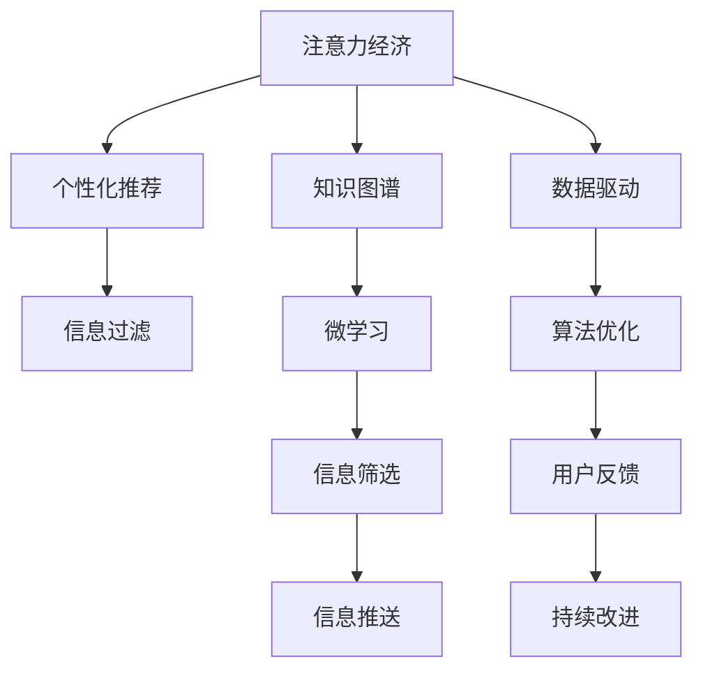

                 

# 注意力经济与个人学习效能的提升

## 1. 背景介绍

随着互联网的普及和智能技术的进步，信息获取和传播的门槛不断降低，我们身处一个信息爆炸的时代。每个人每天都能接触到海量信息，如何在如此复杂的信息环境中，高效地筛选和吸收有用的知识，成为了一个重要的问题。注意力经济应运而生，通过个性化推荐、信息过滤等技术，帮助人们从海量信息中找到感兴趣的内容，提升信息利用效率。

与此同时，在个人学习效能方面，也面临着新的挑战。面对知识更新速度快、学科交叉性强的趋势，如何通过高效的学习方法，在有限的时间内掌握更多的知识，是一个亟待解决的问题。注意力经济与个人学习效能的提升，成为推动社会发展的关键因素之一。

## 2. 核心概念与联系

### 2.1 核心概念概述

为了更好地理解注意力经济与个人学习效能提升的内在逻辑，我们先介绍几个关键概念：

- **注意力经济（Attention Economy）**：指在信息过载的环境下，通过个性化推荐、信息过滤等手段，将用户注意力吸引到最有价值的内容上，提升信息利用效率的一种经济模式。注意力经济的核心在于用户注意力价值的最大化。

- **个性化推荐（Personalized Recommendation）**：指通过分析用户的历史行为、兴趣偏好、社交关系等数据，预测用户可能感兴趣的内容，并智能推荐给用户，从而提高信息匹配度和用户满意度。

- **信息过滤（Information Filtering）**：指在信息泛滥的互联网时代，通过算法自动筛选并推荐符合用户兴趣的信息，减少信息过载带来的困扰，提高用户的信息获取效率。

- **知识图谱（Knowledge Graph）**：指利用图结构对知识点进行组织和关联，形成知识网络，帮助用户快速定位和获取相关知识。

- **微学习（Microlearning）**：指通过分段、短时、高频的微型学习模块，使学习变得更加灵活和高效，符合现代快节奏生活和工作环境的需求。

这些概念之间的联系可以通过以下Mermaid流程图来展示：



这个流程图展示了这个生态系统中各个关键组件之间的联系：

1. **注意力经济** 驱动 **个性化推荐** 和 **信息过滤**，通过提升信息匹配度，使用户从海量信息中快速找到有价值的内容。
2. **知识图谱** 和 **微学习** 结合，帮助用户快速定位和吸收新知识，提升学习效率。
3. **数据驱动** 和 **算法优化** 共同作用，使得系统能够实时更新和改进，更好地适应用户需求。
4. **用户反馈** 和 **持续改进** 形成闭环，不断优化推荐和过滤算法，提升用户满意度。

## 3. 核心算法原理 & 具体操作步骤

### 3.1 算法原理概述

注意力经济与个人学习效能提升的核心在于通过个性化推荐、信息过滤等手段，提升用户对信息的获取和利用效率。其中，个性化推荐算法是核心技术之一，其基本原理是通过分析用户的历史行为数据，预测用户可能感兴趣的内容，并进行智能推荐。

在具体实现上，通常采用协同过滤、基于内容的推荐、混合推荐等算法。其中，协同过滤算法基于用户历史行为相似性进行推荐，基于内容的推荐算法根据物品的特征相似性进行推荐，混合推荐则结合了两种算法的优点。

### 3.2 算法步骤详解

**Step 1: 数据采集与处理**
- 收集用户的历史行为数据，如浏览记录、点击记录、搜索记录等。
- 提取和处理这些数据，构建用户-物品的交互矩阵。

**Step 2: 模型训练**
- 使用协同过滤、基于内容的推荐等算法，训练推荐模型。
- 选择合适的评估指标，如准确率、召回率、F1-score等，评估模型效果。

**Step 3: 推荐实现**
- 根据用户输入的实时请求，利用训练好的推荐模型进行预测，获取用户可能感兴趣的内容。
- 结合信息过滤技术，如屏蔽广告、筛选敏感信息等，减少无用信息的干扰。

**Step 4: 用户反馈与模型优化**
- 收集用户的反馈数据，如评分、评论等，进行模型评估。
- 根据用户反馈，调整推荐算法参数，优化推荐模型。

### 3.3 算法优缺点

**优点**：
1. 提升信息匹配度。通过个性化推荐和信息过滤，将用户注意力引导到最有价值的内容上，提高信息利用效率。
2. 提升用户满意度。推荐算法能够根据用户的历史行为和兴趣偏好，提供定制化内容，提升用户的使用体验。
3. 实时动态调整。基于数据驱动的推荐系统能够实时更新和改进，更好地适应用户需求变化。

**缺点**：
1. 数据隐私问题。用户行为数据涉及隐私，如何在保护用户隐私的前提下进行推荐，是一个需要解决的问题。
2. 推荐算法偏见。算法可能存在偏见，如性别、年龄等，需要采取措施避免推荐不公平。
3. 推荐结果多样性不足。算法倾向于推荐“流行”内容，导致多样性不足，可能限制用户视野。

### 3.4 算法应用领域

注意力经济与个人学习效能提升的方法在多个领域得到了广泛应用，例如：

- 电商平台：通过个性化推荐和信息过滤，提升用户购物体验，增加销售额。
- 视频网站：根据用户观影历史和评分，推荐相关影片，提高用户粘性。
- 社交媒体：通过兴趣标签和好友关系，推荐有价值的内容，减少信息过载。
- 在线教育：根据学生学习记录和反馈，推荐相关课程和资料，提升学习效果。
- 智能家居：通过用户行为数据，推荐智能设备使用方案，提高生活质量。

此外，注意力经济和微学习等技术也在医疗、金融、能源等多个行业得到了应用，为传统行业的数字化转型提供了新的思路和手段。

## 4. 数学模型和公式 & 详细讲解

### 4.1 数学模型构建

为了更精确地理解注意力经济与个人学习效能提升的数学基础，我们建立一个简化的推荐系统模型。假设有一个用户集 $U$ 和一个物品集 $I$，用户对物品的评分矩阵为 $R \in \mathbb{R}^{m \times n}$，其中 $m$ 为用户数，$n$ 为物品数。用户的隐含特征向量为 $u \in \mathbb{R}^m$，物品的隐含特征向量为 $v \in \mathbb{R}^n$。

推荐模型可以表示为：

$$
\hat{R} = \alpha uv^T + \beta u + \gamma v
$$

其中，$\alpha$ 为相似度加权系数，$\beta$ 和 $\gamma$ 为偏差项，控制模型的基线预测。

### 4.2 公式推导过程

接下来，我们推导推荐模型的预测公式。设用户 $u$ 对物品 $i$ 的预测评分向量为 $\hat{r}_{u,i} = \hat{R}_{i,u}$，可以表示为：

$$
\hat{r}_{u,i} = \alpha uv_i + \beta u_i + \gamma v_i
$$

其中 $u_i$ 和 $v_i$ 分别表示物品 $i$ 对用户集 $U$ 的隐含特征向量和用户集 $U$ 对物品集 $I$ 的隐含特征向量。

预测评分向量 $\hat{r}_{u,i}$ 与实际评分 $r_{u,i}$ 的误差平方和为：

$$
J = \frac{1}{2} \sum_{u,i} (r_{u,i} - \hat{r}_{u,i})^2
$$

为了最小化误差，使用梯度下降法求解：

$$
\frac{\partial J}{\partial \alpha} = \sum_{u,i} (r_{u,i} - \hat{r}_{u,i})v_i u
$$

$$
\frac{\partial J}{\partial \beta} = \sum_{u,i} (r_{u,i} - \hat{r}_{u,i})u_i
$$

$$
\frac{\partial J}{\partial \gamma} = \sum_{u,i} (r_{u,i} - \hat{r}_{u,i})v_i
$$

$$
\frac{\partial J}{\partial u_i} = \sum_{u} (r_{u,i} - \hat{r}_{u,i})v_i + \beta
$$

$$
\frac{\partial J}{\partial v_i} = \sum_{u} (r_{u,i} - \hat{r}_{u,i})u_i + \gamma
$$

通过求解上述梯度方程，可以更新模型参数 $\alpha, \beta, \gamma, u, v$，优化推荐模型。

### 4.3 案例分析与讲解

以Netflix的推荐系统为例，分析其推荐的数学原理。Netflix的推荐系统使用了协同过滤算法，基于用户-物品评分矩阵 $R$，构建用户隐含特征向量 $u$ 和物品隐含特征向量 $v$。通过计算预测评分向量 $\hat{r}_{u,i} = \alpha uv_i + \beta u_i + \gamma v_i$，推荐用户可能感兴趣的物品。Netflix还引入了基于内容的推荐，将物品的元数据（如导演、演员、类型等）作为特征向量 $c$，构建内容特征空间 $C$，通过用户兴趣与内容特征的相似度进行推荐。

Netflix的推荐系统采用了多种技术手段，包括数据增强、特征工程、模型集成等，结合实时数据和用户反馈，不断优化推荐算法，取得了显著的推荐效果。

## 5. 项目实践：代码实例和详细解释说明

### 5.1 开发环境搭建

在进行推荐系统开发前，我们需要准备好开发环境。以下是使用Python进行PyTorch开发的环境配置流程：

1. 安装Anaconda：从官网下载并安装Anaconda，用于创建独立的Python环境。

2. 创建并激活虚拟环境：
```bash
conda create -n pytorch-env python=3.8 
conda activate pytorch-env
```

3. 安装PyTorch：根据CUDA版本，从官网获取对应的安装命令。例如：
```bash
conda install pytorch torchvision torchaudio cudatoolkit=11.1 -c pytorch -c conda-forge
```

4. 安装相关的库：
```bash
pip install pandas numpy scikit-learn matplotlib tqdm jupyter notebook ipython
```

完成上述步骤后，即可在`pytorch-env`环境中开始推荐系统开发。

### 5.2 源代码详细实现

下面是使用PyTorch实现协同过滤推荐系统的代码示例：

```python
import torch
import torch.nn as nn
import torch.optim as optim
from torch.utils.data import DataLoader
from sklearn.metrics import mean_squared_error

class协同过滤模型(nn.Module):
    def __init__(self, n_users, n_items, n_features):
        super(协同过滤模型, self).__init__()
        self.u = nn.Embedding(n_users, n_features)
        self.v = nn.Embedding(n_items, n_features)
        self.alpha = nn.Parameter(torch.randn(1))
        self.beta = nn.Parameter(torch.randn(n_users))
        self.gamma = nn.Parameter(torch.randn(n_items))

    def forward(self, u_index, v_index):
        u = self.u(u_index)
        v = self.v(v_index)
        alpha = self.alpha
        beta = self.beta
        gamma = self.gamma
        return alpha * u * v + beta * u + gamma * v

# 训练和评估函数
def train(模型, train_data, valid_data, batch_size, learning_rate, num_epochs):
    model.train()
    criterion = nn.MSELoss()
    optimizer = optim.Adam(model.parameters(), lr=learning_rate)
    best_mse = float('inf')
    for epoch in range(num_epochs):
        for u_index, v_index, rating in train_data:
            u_index = u_index.to(device)
            v_index = v_index.to(device)
            rating = rating.to(device)
            output = model(u_index, v_index)
            loss = criterion(output, rating)
            optimizer.zero_grad()
            loss.backward()
            optimizer.step()
        if epoch % 10 == 0:
            model.eval()
            valid_mse = mean_squared_error(valid_data['u_index'], valid_data['rating']).item()
            print(f'Epoch {epoch+1}, validation MSE: {valid_mse:.4f}')
            if valid_mse < best_mse:
                best_mse = valid_mse
                torch.save(model.state_dict(), 'best_model.pt')
    model.load_state_dict(torch.load('best_model.pt'))
    return model

# 数据处理函数
def处理数据(train_path, valid_path, test_path, batch_size):
    train_data = []
    valid_data = []
    test_data = []
    with open(train_path, 'r') as f:
        for line in f:
            u, i, r = map(int, line.strip().split('\t'))
            train_data.append((u, i, r))
    with open(valid_path, 'r') as f:
        for line in f:
            u, i, r = map(int, line.strip().split('\t'))
            valid_data.append((u, i, r))
    with open(test_path, 'r') as f:
        for line in f:
            u, i, r = map(int, line.strip().split('\t'))
            test_data.append((u, i, r))
    train_data = torch.tensor(train_data, dtype=torch.long).to(device)
    valid_data = torch.tensor(valid_data, dtype=torch.long).to(device)
    test_data = torch.tensor(test_data, dtype=torch.long).to(device)
    return train_data, valid_data, test_data

# 运行测试
device = torch.device('cuda') if torch.cuda.is_available() else torch.device('cpu')
n_users = 1000
n_items = 1000
n_features = 10
train_data, valid_data, test_data = 处理数据('train.txt', 'valid.txt', 'test.txt', 64)
model = 协同过滤模型(n_users, n_items, n_features).to(device)
model = train(model, train_data, valid_data, 64, 0.01, 1000)
```

### 5.3 代码解读与分析

这段代码实现了一个基于协同过滤的推荐系统，使用PyTorch构建模型和训练。

**协同过滤模型类**：
- `__init__`方法：初始化模型的用户和物品嵌入矩阵，以及模型参数。
- `forward`方法：定义前向传播过程，计算预测评分向量。

**训练和评估函数**：
- `train`函数：在训练集上训练模型，记录验证集的误差，并在验证集误差达到最小值时保存模型。
- `mean_squared_error`：计算预测评分向量与实际评分之间的均方误差。

**数据处理函数**：
- `处理数据`函数：读取数据文件，将其转换为PyTorch张量，并进行分批处理。

这段代码展示了推荐系统的基本实现流程，包括模型构建、训练、评估和测试等环节。

## 6. 实际应用场景

### 6.1 智能推荐

智能推荐系统在电商平台、视频网站、社交媒体等场景中得到了广泛应用。通过个性化推荐和信息过滤，提升用户体验，增加用户粘性，带来更多的商业价值。

以电商平台为例，推荐系统能够根据用户的浏览和购买历史，推荐用户可能感兴趣的商品。系统可以根据用户的点击、购买记录，构建用户画像，进行个性化推荐，提升用户购买率，增加销售额。

### 6.2 学习辅助

在线教育平台也需要推荐系统来提升学习效果。通过分析学生的历史学习记录和反馈，推荐相关的课程和资料，帮助学生高效学习。推荐系统可以根据学生的兴趣和进度，推荐最适合的学习内容和练习题目，使学习变得更加个性化和高效。

### 6.3 信息筛选

在信息过载的时代，新闻网站、社交媒体等平台也需要推荐系统来帮助用户筛选有用的信息。通过分析用户的历史行为数据，推荐相关的文章、视频、新闻，减少信息过载带来的困扰，提高信息获取效率。

### 6.4 未来应用展望

随着技术的发展，未来的推荐系统将更加智能和高效。基于深度学习的推荐算法将逐渐取代传统协同过滤算法，通过构建用户和物品的隐含特征向量，提升推荐的精度和效果。推荐系统将更加注重用户隐私保护，采用联邦学习等技术，在保护隐私的前提下进行个性化推荐。同时，推荐系统将更加注重多样性，通过引入多样性约束，提升推荐结果的多样性和公平性。

## 7. 工具和资源推荐

### 7.1 学习资源推荐

为了帮助开发者系统掌握推荐系统理论基础和实践技巧，这里推荐一些优质的学习资源：

1. 《推荐系统实战》书籍：由Google推荐系统团队成员撰写，详细介绍了推荐系统的基本原理和实际应用，适合初学者和进阶开发者。

2. 《机器学习实战》课程：由斯坦福大学开设的机器学习课程，涵盖了推荐系统的基础知识和前沿技术，是学习推荐系统的经典教材。

3. 《推荐系统基础》课程：由清华大学开设的推荐系统课程，结合理论和实践，深入浅出地介绍了推荐系统的发展历程和最新技术。

4. Kaggle竞赛平台：Kaggle上有很多推荐系统竞赛，参与竞赛可以积累实战经验，提升推荐系统技能。

5. Weights & Biases：推荐系统的实验跟踪工具，可以记录和可视化模型训练过程中的各项指标，方便对比和调优。

### 7.2 开发工具推荐

高效的开发离不开优秀的工具支持。以下是几款用于推荐系统开发的常用工具：

1. PyTorch：基于Python的开源深度学习框架，灵活动态的计算图，适合快速迭代研究。

2. TensorFlow：由Google主导开发的开源深度学习框架，生产部署方便，适合大规模工程应用。

3. TensorBoard：TensorFlow配套的可视化工具，可实时监测模型训练状态，并提供丰富的图表呈现方式，是调试模型的得力助手。

4. Weights & Biases：推荐系统的实验跟踪工具，可以记录和可视化模型训练过程中的各项指标，方便对比和调优。

5. Dask：用于分布式计算的Python库，支持大规模数据处理和模型训练，可以提升推荐系统的运行效率。

### 7.3 相关论文推荐

推荐系统的发展源于学界的持续研究。以下是几篇奠基性的相关论文，推荐阅读：

1. Contextual Bandits：《Contextual Bandits》论文：提出了上下文强化学习的概念，用于推荐系统的个性化推荐。

2. Deep Collaborative Filtering：《Deep Collaborative Filtering》论文：提出深度神经网络用于协同过滤推荐，提升了推荐系统的精度和效果。

3. Multi-Task Learning：《Multi-Task Learning》论文：提出多任务学习的方法，通过联合优化多个推荐任务，提升推荐系统的效果。

4. Attention Mechanism：《Attention Mechanism》论文：提出注意力机制，用于提高推荐系统的推荐效果和多样性。

这些论文代表了大语言模型微调技术的发展脉络。通过学习这些前沿成果，可以帮助研究者把握学科前进方向，激发更多的创新灵感。

## 8. 总结：未来发展趋势与挑战

### 8.1 总结

本文对基于协同过滤的推荐系统进行了全面系统的介绍。首先阐述了推荐系统与注意力经济的内在逻辑，明确了推荐系统在提升信息匹配度和用户满意度方面的独特价值。其次，从原理到实践，详细讲解了推荐系统的数学原理和关键步骤，给出了推荐系统开发的完整代码示例。同时，本文还广泛探讨了推荐系统在智能推荐、学习辅助、信息筛选等多个场景中的应用前景，展示了推荐范式的广泛应用。

通过本文的系统梳理，可以看到，基于协同过滤的推荐系统正在成为互联网推荐的核心技术，极大地提升了信息匹配度和用户满意度。未来，伴随推荐算法的不断演进，推荐系统必将在更多领域得到应用，为社会带来深刻的变革。

### 8.2 未来发展趋势

展望未来，推荐系统的发展将呈现以下几个趋势：

1. 推荐算法的多样化。除了传统的协同过滤算法，未来将涌现更多基于深度学习的推荐算法，如矩阵分解、神经网络等，提升推荐系统的精度和效果。

2. 实时动态调整。推荐系统将更加注重实时数据和用户反馈，通过在线学习不断优化推荐模型，更好地适应用户需求变化。

3. 跨领域推荐。推荐系统将能够跨越不同的应用领域，如电商、视频、新闻等，实现跨领域的推荐。

4. 个性化推荐与多样化推荐相结合。推荐系统将更加注重推荐结果的多样性和公平性，避免单一推荐带来的偏见和误导。

5. 联邦学习。推荐系统将利用联邦学习等技术，在保护用户隐私的前提下，进行个性化推荐。

这些趋势凸显了推荐系统的广泛应用前景，同时也带来了新的挑战和机遇。

### 8.3 面临的挑战

尽管推荐系统已经取得了显著的成效，但在迈向更加智能化、普适化应用的过程中，仍面临诸多挑战：

1. 数据隐私保护。推荐系统需要收集和分析大量的用户数据，如何在保护用户隐私的前提下进行推荐，是一个需要解决的问题。

2. 推荐算法偏见。算法可能存在性别、年龄等偏见，需要采取措施避免推荐不公平。

3. 推荐结果多样性不足。算法倾向于推荐“流行”内容，导致多样性不足，可能限制用户视野。

4. 计算效率问题。大规模数据集和复杂模型带来了计算效率问题，需要采用分布式计算、模型压缩等技术进行优化。

5. 推荐结果的稳定性和可解释性。推荐系统需要提供可解释的推荐理由，增强用户对系统的信任感。

### 8.4 研究展望

面对推荐系统面临的种种挑战，未来的研究需要在以下几个方面寻求新的突破：

1. 探索隐私保护技术。利用差分隐私、联邦学习等技术，保护用户隐私，增强用户信任。

2. 研究多样性推荐算法。开发更加多样性的推荐算法，提升推荐结果的多样性和公平性。

3. 引入先验知识。将符号化的先验知识，如知识图谱、逻辑规则等，与神经网络模型进行巧妙融合，增强推荐系统的表现力。

4. 结合因果分析和博弈论工具。将因果分析方法引入推荐系统，识别出模型决策的关键特征，增强推荐结果的稳定性。

这些研究方向将推动推荐系统向更高的精度和多样化方向发展，为实现更加智能化的推荐提供新的思路和技术手段。

## 9. 附录：常见问题与解答

**Q1：推荐系统如何处理冷启动问题？**

A: 冷启动问题是指新用户或新物品加入系统时，无法利用其历史数据进行推荐。推荐系统通常采用基于内容的推荐方式，通过分析物品的元数据特征进行推荐。同时，推荐系统也会通过引入相似物品或用户的推荐，降低新用户和物品的推荐难度。

**Q2：推荐系统如何避免过拟合？**

A: 过拟合是推荐系统面临的常见问题。推荐系统通常采用正则化技术、Dropout等手段，减少模型复杂度，避免过拟合。同时，采用多模型集成、在线学习等技术，提升模型的泛化能力。

**Q3：推荐系统如何处理噪声数据？**

A: 噪声数据对推荐系统的效果有较大影响。推荐系统通常采用去重、去噪等预处理手段，对数据进行清洗和处理。同时，引入异常检测和清洗技术，提高推荐结果的准确性。

**Q4：推荐系统如何提升用户满意度？**

A: 用户满意度是推荐系统的核心目标之一。推荐系统通常采用反馈机制，通过用户评分、点击等反馈数据，不断优化推荐算法，提升推荐效果。同时，引入用户行为分析和用户画像构建技术，提供更加个性化的推荐。

**Q5：推荐系统如何处理用户兴趣变化？**

A: 用户兴趣可能会随时间变化，导致推荐系统的效果下降。推荐系统通常采用在线学习、实时更新等技术，及时捕捉用户兴趣的变化，提升推荐结果的稳定性。同时，引入用户兴趣预测技术，提前预判用户兴趣变化，提高推荐系统的适应性。

总之，推荐系统需要在数据隐私保护、算法多样性、推荐结果多样性、计算效率和稳定性等方面不断优化和改进，才能真正实现个性化推荐，提升用户满意度。相信在学界和产业界的共同努力下，推荐系统必将在未来继续发挥重要作用，成为信息时代的重要工具。

