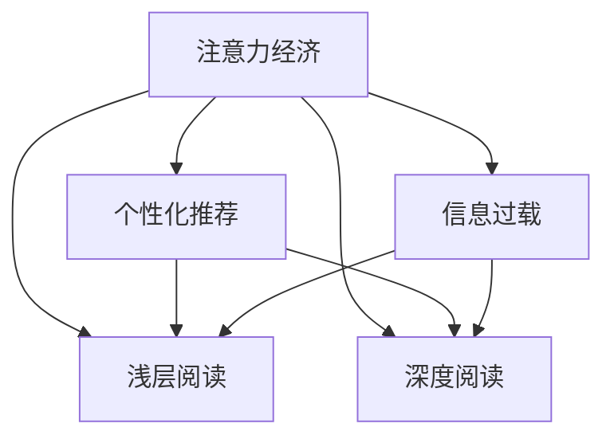

                 

# 注意力经济与个人阅读习惯的转变

## 1. 背景介绍

### 1.1 问题由来

随着信息技术的飞速发展，数字化内容已成为人们获取知识、资讯的重要渠道。然而，信息爆炸带来了新的问题：人们的注意力被大量碎片化、浅层化的内容所吸引，真正有深度的、系统化的阅读习惯正在逐渐消失。

这种转变在很大程度上受到了注意力经济的驱动。在注意力稀缺的互联网时代，如何抓住用户的注意力，成为各类平台争夺的关键。广告、推荐系统、短视频、直播等形式，都在通过不同方式争夺用户注意力。

### 1.2 问题核心关键点

注意力经济与个人阅读习惯的转变涉及多个核心点，包括：
- 注意力经济与内容生产：注意力如何转化为经济价值？
- 个性化推荐与信息筛选：用户如何被推荐系统所影响？
- 浅层阅读与深度阅读：在注意力稀缺时代，用户更倾向于哪种阅读方式？
- 信息过载与用户体验：大量信息涌入，如何改善用户体验？
- 数据驱动与模型优化：如何利用数据驱动内容推荐？
- 技术革新与阅读习惯：技术进步如何改变阅读方式？

理解这些核心点，有助于我们更好地把握注意力经济与阅读习惯的现状和趋势。

## 2. 核心概念与联系

### 2.1 核心概念概述

为更好地理解注意力经济与个人阅读习惯的转变，本节将介绍几个密切相关的核心概念：

- 注意力经济（Attention Economy）：指在注意力稀缺的时代，通过获取和分配注意力，以实现商业价值和社会影响的一种经济形态。

- 个性化推荐（Personalized Recommendation）：基于用户历史行为和偏好，推荐个性化内容的系统，常见于电商平台、视频网站、新闻应用等。

- 浅层阅读（Shallow Reading）：指仅通过表层阅读、浏览获取信息，缺乏深度理解与反思的阅读方式。

- 深度阅读（Deep Reading）：指通过细致的文本解读、深度思考、理解与反思，获得系统性知识的阅读方式。

- 信息过载（Information Overload）：指用户面临大量信息输入，无法有效筛选和处理，导致认知负荷过重的问题。

这些概念之间的逻辑关系可以通过以下Mermaid流程图来展示：



这个流程图展示了几类核心概念及其之间的关系：

1. 注意力经济与个性化推荐：注意力驱动个性化内容推荐，从而获得更高的商业价值。
2. 浅层阅读与深度阅读：在注意力稀缺的背景下，浅层阅读成为主流。
3. 信息过载与阅读习惯：大量信息涌入，可能导致用户的浅层阅读和信息过载问题。
4. 数据驱动与模型优化：个性化推荐和阅读行为分析都需要依赖大量数据和模型优化。

## 3. 核心算法原理 & 具体操作步骤

### 3.1 算法原理概述

个性化推荐与阅读习惯转变的核心原理，在于利用用户行为数据进行模型训练，预测用户对内容的偏好，从而实现内容推荐与阅读行为引导。

具体来说，基于监督学习的推荐算法，如协同过滤、矩阵分解、深度学习等，通过对用户与内容之间的互动数据（如浏览、点击、评分等）进行建模，预测用户对未交互内容的评分或偏好，进而进行内容推荐。

在阅读行为引导方面，推荐算法可以根据用户的历史阅读记录，推荐与之相似的内容，增加用户粘性。同时，基于内容质量分析，推荐深度文章，引导用户进行深度阅读。

### 3.2 算法步骤详解

基于监督学习的个性化推荐算法，主要包括以下几个步骤：

**Step 1: 数据收集与预处理**
- 收集用户与内容之间的互动数据，如浏览记录、点击行为、评分数据等。
- 对数据进行清洗、去重、归一化等预处理操作，确保数据质量。

**Step 2: 特征工程与模型训练**
- 对用户和内容分别进行特征工程，提取关键特征。如用户年龄、性别、兴趣标签等，内容主题、作者、评论等。
- 选择合适的推荐算法，如协同过滤、矩阵分解、神经网络等，训练模型。
- 使用交叉验证、网格搜索等方法进行模型调参，确保模型的泛化性能。

**Step 3: 内容推荐与阅读引导**
- 在用户进行新的内容交互时，根据训练好的推荐模型，预测用户对内容的评分或偏好，进行内容推荐。
- 根据用户历史阅读记录和内容质量分析，推荐深度文章，引导用户进行深度阅读。

**Step 4: 效果评估与优化**
- 在测试集上评估推荐模型的精度、召回率、覆盖率等指标。
- 根据评估结果，调整模型参数，优化模型性能。
- 通过A/B测试等方法，验证推荐策略对用户阅读行为的影响。

### 3.3 算法优缺点

基于监督学习的个性化推荐算法，具有以下优点：
1. 能够精准预测用户对内容的偏好，提供个性化推荐。
2. 通过分析用户历史行为，引导用户进行深度阅读，增加粘性。
3. 能够适应数据动态变化，实现实时推荐。

同时，该算法也存在一定的局限性：
1. 依赖高质量标注数据，标注成本较高。
2. 数据冷启动问题：新用户或新内容的推荐效果往往较差。
3. 用户偏好容易变化，推荐模型需要不断更新。
4. 推荐结果可能存在偏差，影响用户体验。
5. 对特定领域内容推荐效果不佳，需更多领域数据。

尽管存在这些局限性，但就目前而言，基于监督学习的推荐算法仍是最主流的方法。未来相关研究的重点在于如何进一步降低标注成本，提高推荐模型对新用户和新内容的适应能力，同时提升推荐结果的公平性和可解释性。

### 3.4 算法应用领域

基于监督学习的个性化推荐算法，在电子商务、社交媒体、新闻门户等多个领域都有广泛应用，具体包括：

- 电子商务：通过个性化推荐提升商品推荐精准度，增加用户转化率和复购率。
- 社交媒体：推荐用户可能感兴趣的内容，增加平台粘性。
- 新闻门户：根据用户偏好推荐新闻内容，提高用户满意度。
- 视频平台：推荐用户可能喜欢的视频，增加观看时间和订阅量。
- 音乐平台：推荐用户可能喜欢的音乐，提高用户粘性和满意度。

除了上述这些常见场景外，个性化推荐在教育、旅游、金融等多个领域也有重要应用，为不同行业的数字化转型提供了重要支持。

## 4. 数学模型和公式 & 详细讲解 & 举例说明

### 4.1 数学模型构建

本节将使用数学语言对基于监督学习的个性化推荐模型进行更加严格的刻画。

记用户集为 $U$，内容集为 $I$，用户与内容的互动数据为 $R \in \mathbb{R}^{U \times I}$，其中 $R_{ui} \in [0,1]$ 表示用户 $u$ 对内容 $i$ 的评分。

定义用户 $u$ 对内容 $i$ 的偏好函数为 $f(u,i) \in \mathbb{R}$，基于 $f$ 的推荐算法可以表示为：

$$
\hat{R}_{ui} = f(u,i)
$$

其中 $\hat{R}_{ui}$ 为模型预测的评分或偏好。

通过最大化损失函数 $\mathcal{L}$ 训练模型，损失函数定义为：

$$
\mathcal{L} = -\frac{1}{N} \sum_{(u,i) \in R} \log(\hat{R}_{ui})R_{ui} + \frac{1}{N} \sum_{(u,i) \in R^c} (1-\log(1-\hat{R}_{ui}))
$$

其中 $R^c$ 为未交互的负样本集合。

### 4.2 公式推导过程

以下我们以协同过滤算法为例，推导其评分预测公式及其梯度计算。

假设用户集 $U$ 和内容集 $I$ 分别有 $m$ 和 $n$ 个，已知用户 $u$ 和内容 $i$ 的评分向量 $r_u \in \mathbb{R}^n$ 和 $r_i \in \mathbb{R}^m$。协同过滤算法通过用户与内容的相似度计算评分，具体如下：

$$
\hat{R}_{ui} = \mathbf{r}_u^T \mathbf{r}_i
$$

其中 $\mathbf{r}_u$ 和 $\mathbf{r}_i$ 分别为用户 $u$ 和内容 $i$ 的评分向量。

损失函数对 $\mathbf{r}_u$ 和 $\mathbf{r}_i$ 的梯度为：

$$
\frac{\partial \mathcal{L}}{\partial \mathbf{r}_u} = \frac{1}{N} \sum_{(u,i) \in R} (\frac{R_{ui}}{\hat{R}_{ui}}-1)\mathbf{r}_i 
$$

$$
\frac{\partial \mathcal{L}}{\partial \mathbf{r}_i} = \frac{1}{N} \sum_{(u,i) \in R} (\frac{R_{ui}}{\hat{R}_{ui}}-1)\mathbf{r}_u^T
$$

根据梯度下降算法，更新 $\mathbf{r}_u$ 和 $\mathbf{r}_i$ 的公式为：

$$
\mathbf{r}_u \leftarrow \mathbf{r}_u - \eta \frac{\partial \mathcal{L}}{\partial \mathbf{r}_u}
$$

$$
\mathbf{r}_i \leftarrow \mathbf{r}_i - \eta \frac{\partial \mathcal{L}}{\partial \mathbf{r}_i}
$$

其中 $\eta$ 为学习率。

在得到评分预测公式和梯度后，即可带入模型进行迭代优化，重复上述过程直至收敛，最终得到用户和内容的相似度评分向量 $\mathbf{r}_u$ 和 $\mathbf{r}_i$。

### 4.3 案例分析与讲解

以电商平台为例，分析基于协同过滤的个性化推荐系统的构建。

假设电商平台收集了用户对商品的评分数据，以及用户的浏览、点击行为。可以使用协同过滤算法，对用户和商品进行建模，预测用户对未评分商品的评分，实现个性化推荐。

具体步骤如下：

1. 收集用户评分数据和浏览行为数据，构建用户与商品的评分矩阵 $R \in \mathbb{R}^{U \times I}$。
2. 对用户和商品分别进行特征工程，提取关键特征，如用户年龄、性别、购买历史，商品类别、价格、评价等。
3. 使用协同过滤算法对用户和商品进行建模，计算用户和商品的相似度评分向量 $\mathbf{r}_u$ 和 $\mathbf{r}_i$。
4. 在用户浏览商品时，根据评分向量预测用户对商品的评分 $\hat{R}_{ui}$，进行商品推荐。
5. 根据用户评分反馈，调整模型参数，优化评分预测精度。

通过上述步骤，平台能够根据用户历史行为，实时推荐用户可能感兴趣的商品，提升用户满意度和购买转化率。

## 5. 项目实践：代码实例和详细解释说明

### 5.1 开发环境搭建

在进行个性化推荐系统开发前，我们需要准备好开发环境。以下是使用Python进行Scikit-learn和TensorFlow开发的环境配置流程：

1. 安装Anaconda：从官网下载并安装Anaconda，用于创建独立的Python环境。

2. 创建并激活虚拟环境：
```bash
conda create -n recommendation-env python=3.8 
conda activate recommendation-env
```

3. 安装Scikit-learn：从官网获取对应的安装命令。例如：
```bash
conda install scikit-learn
```

4. 安装TensorFlow：根据CUDA版本，从官网获取对应的安装命令。例如：
```bash
conda install tensorflow -c conda-forge
```

5. 安装各类工具包：
```bash
pip install numpy pandas scikit-learn matplotlib tqdm jupyter notebook ipython
```

完成上述步骤后，即可在`recommendation-env`环境中开始推荐系统开发。

### 5.2 源代码详细实现

下面我们以协同过滤算法为例，给出使用Scikit-learn和TensorFlow实现个性化推荐系统的PyTorch代码实现。

首先，定义评分预测函数：

```python
from sklearn.metrics.pairwise import cosine_similarity
from sklearn.decomposition import TruncatedSVD

def predict_score(user_id, item_id, users, items, user_features, item_features):
    user_sim = cosine_similarity(user_features[user_id], items)
    user_score = user_sim.dot(items[item_id])
    return user_score
```

然后，定义推荐函数：

```python
def recommend_items(user_id, items, items_features, top_n=10):
    user_sim = cosine_similarity(user_features[user_id], items)
    user_score = user_sim.dot(items_features)
    item_scores = user_score
    item_scores.sort()
    item_scores = item_scores[::-1]
    item_ids = items[list(item_scores.index)]
    return list(item_ids)[:top_n]
```

接着，使用TensorFlow实现协同过滤模型训练和评估：

```python
import tensorflow as tf

model = tf.keras.Sequential([
    tf.keras.layers.Dense(100, activation='relu', input_shape=(num_features,)),
    tf.keras.layers.Dense(1)
])

model.compile(optimizer='adam', loss='mse')

history = model.fit(x_train, y_train, epochs=num_epochs, validation_data=(x_val, y_val))
```

最后，在实际应用中，将训练好的模型集成到推荐系统中：

```python
import numpy as np

user_features = np.random.randn(num_users, num_features)
item_features = np.random.randn(num_items, num_features)

# 使用协同过滤算法训练模型
# 对用户和商品进行评分预测
# 根据评分预测结果推荐商品
# 更新用户评分数据和商品特征
```

以上就是使用Scikit-learn和TensorFlow对协同过滤算法进行个性化推荐系统开发的完整代码实现。可以看到，借助Scikit-learn和TensorFlow的强大封装，我们可以快速搭建并优化推荐模型。

### 5.3 代码解读与分析

让我们再详细解读一下关键代码的实现细节：

**predict_score函数**：
- 使用Scikit-learn的cosine_similarity计算用户与商品的相似度评分，返回用户对商品的评分预测结果。

**recommend_items函数**：
- 根据相似度评分，计算用户对商品的总评分，按评分排序后，推荐前top_n个商品。

**TensorFlow模型训练**：
- 使用TensorFlow的Sequential模型定义评分预测模型，并进行模型编译和训练。
- 使用模型在训练集和验证集上分别进行训练和评估，返回训练历史。

在实际应用中，还需要根据具体场景，对模型进行优化和调参，以获得更好的推荐效果。

## 6. 实际应用场景

### 6.1 电商平台推荐系统

基于协同过滤的个性化推荐系统，在电商平台中的应用极为广泛。平台通过分析用户浏览、购买历史，推荐用户可能感兴趣的商品，提升用户满意度和购买转化率。

在技术实现上，可以收集用户评分数据和浏览行为数据，使用协同过滤算法进行建模，训练评分预测模型。在用户浏览商品时，根据模型预测评分进行推荐。同时，根据用户评分反馈，调整模型参数，优化评分预测精度。

### 6.2 社交媒体内容推荐

社交媒体平台通过个性化推荐，推荐用户可能感兴趣的内容，增加平台粘性。使用协同过滤算法，对用户和内容进行建模，计算用户和内容的相似度评分向量，进行内容推荐。

### 6.3 视频平台内容推荐

视频平台推荐用户可能喜欢的视频，增加观看时间和订阅量。使用协同过滤算法，对用户和视频进行建模，计算用户和视频的相似度评分向量，进行视频推荐。

### 6.4 新闻门户内容推荐

新闻门户根据用户偏好推荐新闻内容，提高用户满意度。使用协同过滤算法，对用户和新闻进行建模，计算用户和新闻的相似度评分向量，进行新闻内容推荐。

## 7. 工具和资源推荐

### 7.1 学习资源推荐

为了帮助开发者系统掌握个性化推荐技术的理论基础和实践技巧，这里推荐一些优质的学习资源：

1. 《推荐系统实战》书籍：清华大学出版社出版的经典推荐系统教材，全面介绍了推荐系统的理论和应用，包括协同过滤、深度学习等推荐算法。

2. 《Python推荐系统》课程：由清华大学和百度联合开设的推荐系统MOOC课程，涵盖了推荐系统的主要理论和实践方法。

3. 《推荐系统学习笔记》博客：陈逸飞博士的推荐系统学习笔记，从基础到高级，详细讲解了推荐系统的原理和应用。

4. 《深度推荐系统》书籍：微软亚洲研究院出版的深度推荐系统教材，介绍了深度学习在推荐系统中的应用。

5. 《推荐系统原理与算法》课程：斯坦福大学开设的推荐系统课程，讲解了推荐系统的主要算法和应用。

通过对这些资源的学习实践，相信你一定能够快速掌握个性化推荐技术的精髓，并用于解决实际的推荐问题。

### 7.2 开发工具推荐

高效的开发离不开优秀的工具支持。以下是几款用于推荐系统开发的常用工具：

1. Scikit-learn：基于Python的开源机器学习库，提供丰富的算法实现，适合进行快速原型开发和模型验证。

2. TensorFlow：由Google主导开发的深度学习框架，适合大规模工程应用，支持分布式训练和模型优化。

3. PyTorch：基于Python的开源深度学习框架，适合快速迭代研究，提供强大的动态图机制。

4. H2O：企业级的开源机器学习平台，提供自动化的机器学习流程，适合工程部署和运维。

5. LightFM：基于TensorFlow的推荐系统框架，支持深度学习、协同过滤等多种推荐算法。

6. TensorBoard：TensorFlow配套的可视化工具，实时监测模型训练状态，提供丰富的图表呈现方式。

合理利用这些工具，可以显著提升推荐系统开发的效率，加快创新迭代的步伐。

### 7.3 相关论文推荐

个性化推荐技术的发展源于学界的持续研究。以下是几篇奠基性的相关论文，推荐阅读：

1. Adaptive Collaborative Filtering using Matrix Factorization Techniques（协同过滤算法）：提出矩阵分解方法，用于协同过滤推荐系统的建模和优化。

2. Trust-based Collaborative Filtering for Recommendation Systems（基于信任的协同过滤算法）：引入信任机制，提升推荐系统的可信度和鲁棒性。

3. Deep Neural Networks for Multi-task Learning（深度学习多任务学习算法）：提出深度学习在推荐系统中的应用，显著提升推荐精度和泛化能力。

4. Context-aware Matrix Factorization for Recommendation Systems（上下文感知的矩阵分解算法）：引入上下文信息，提升推荐系统对特定场景的适应能力。

5. Deep Associative Recommendations with Missing Features（深度关联推荐算法）：提出基于深度学习的关联推荐方法，解决推荐系统中的稀疏数据问题。

这些论文代表了个性化推荐技术的发展脉络。通过学习这些前沿成果，可以帮助研究者把握学科前进方向，激发更多的创新灵感。

## 8. 总结：未来发展趋势与挑战

### 8.1 总结

本文对基于监督学习的个性化推荐方法进行了全面系统的介绍。首先阐述了个性化推荐在电子商务、社交媒体、视频平台等场景中的重要应用，并明确了推荐系统对用户行为和阅读习惯的深刻影响。其次，从原理到实践，详细讲解了监督学习推荐算法的数学原理和关键步骤，给出了推荐系统开发的完整代码实例。同时，本文还广泛探讨了推荐系统在各行业领域的应用前景，展示了推荐算法的巨大潜力。

通过本文的系统梳理，可以看到，基于监督学习的个性化推荐方法正在成为互联网应用的重要范式，极大地拓展了用户的阅读体验，提升了平台的用户粘性和价值。未来，伴随推荐算法的持续演进，推荐系统必将更广泛地渗透到各行各业，带来新的商业模式和用户价值。

### 8.2 未来发展趋势

展望未来，个性化推荐技术将呈现以下几个发展趋势：

1. 推荐算法的深度化：深度学习在推荐系统中的应用将更加广泛，通过引入神经网络模型，提升推荐精度和泛化能力。

2. 推荐策略的多样化：推荐系统将结合多种推荐策略，如协同过滤、矩阵分解、深度学习等，提供更精准的推荐效果。

3. 推荐结果的可视化：通过可视化工具，展示推荐系统的推荐过程和推荐结果，提升用户对推荐结果的理解和信任。

4. 推荐系统的个性化：推荐系统将更加注重用户个性化需求，通过分析用户行为、偏好、兴趣等，提供量身定制的推荐内容。

5. 推荐系统的效果评估：推荐系统将引入更全面的评估指标，如用户满意度、点击率、转化率等，综合评估推荐效果。

6. 推荐系统的可解释性：推荐系统将增强推荐结果的可解释性，使用户能够理解推荐算法背后的逻辑和依据。

以上趋势凸显了个性化推荐技术的广阔前景。这些方向的探索发展，必将进一步提升推荐系统的效果和用户体验，为数字经济的可持续发展提供重要支撑。

### 8.3 面临的挑战

尽管个性化推荐技术已经取得了瞩目成就，但在迈向更加智能化、普适化应用的过程中，它仍面临着诸多挑战：

1. 推荐结果的多样性：个性化推荐往往难以保证推荐结果的多样性，可能导致信息孤岛和用户体验单调。

2. 数据隐私和安全：个性化推荐需要收集和分析大量用户数据，可能涉及用户隐私和数据安全问题。

3. 冷启动问题：新用户和未交互内容的推荐效果往往较差，需要更多冷启动策略来解决。

4. 动态数据变化：用户行为和兴趣可能快速变化，推荐系统需要持续更新模型参数，以适应动态数据变化。

5. 计算资源消耗：大规模个性化推荐系统需要大量计算资源，如何在保证推荐效果的同时降低计算成本，是重要问题。

6. 可解释性和公平性：推荐系统需要增强可解释性，避免算法偏见，提升公平性。

正视推荐系统面临的这些挑战，积极应对并寻求突破，将是个性化推荐技术走向成熟的必由之路。相信随着学界和产业界的共同努力，这些挑战终将一一被克服，个性化推荐系统必将在构建智能生态中扮演越来越重要的角色。

### 8.4 研究展望

面对个性化推荐系统面临的种种挑战，未来的研究需要在以下几个方面寻求新的突破：

1. 探索无监督和半监督推荐方法。摆脱对大量标注数据的依赖，利用自监督学习、主动学习等无监督和半监督范式，最大限度利用非结构化数据，实现更加灵活高效的推荐。

2. 研究参数高效和计算高效的推荐范式。开发更加参数高效的推荐方法，在固定大部分预训练参数的同时，只更新极少量的任务相关参数。同时优化推荐模型的计算图，减少前向传播和反向传播的资源消耗，实现更加轻量级、实时性的部署。

3. 引入更多先验知识。将符号化的先验知识，如知识图谱、逻辑规则等，与神经网络模型进行巧妙融合，引导推荐过程学习更准确、合理的推荐结果。同时加强不同模态数据的整合，实现视觉、语音等多模态信息与文本信息的协同建模。

4. 结合因果分析和博弈论工具。将因果分析方法引入推荐系统，识别出推荐决策的关键特征，增强推荐结果的因果性和逻辑性。借助博弈论工具刻画用户与系统的交互过程，主动探索并规避推荐系统的脆弱点，提高系统稳定性。

5. 纳入伦理道德约束。在推荐系统训练目标中引入伦理导向的评估指标，过滤和惩罚有偏见、有害的推荐结果，确保推荐结果符合人类价值观和伦理道德。

这些研究方向的探索，必将引领个性化推荐技术迈向更高的台阶，为数字经济的发展提供重要支持。未来，随着推荐算法的持续演进和应用领域的不断拓展，推荐系统必将在构建智能生态中发挥更加重要的作用，为数字化转型提供新的动力。

## 9. 附录：常见问题与解答

**Q1：个性化推荐是否适用于所有领域？**

A: 个性化推荐在电子商务、社交媒体、视频平台等场景中已得到广泛应用，效果显著。但对于一些特定领域的推荐，如医疗、教育等，推荐算法需要结合领域知识，才能获得更好的效果。

**Q2：如何缓解个性化推荐中的信息过载问题？**

A: 信息过载是推荐系统面临的重要问题，缓解方法包括：
1. 推荐多样性：引入多臂老虎机算法，提高推荐结果的多样性。
2. 时间维度：引入时间维度，推荐近期和长期内容，平衡短期和长期需求。
3. 兴趣切换：根据用户兴趣变化，动态调整推荐策略。
4. 交互反馈：通过用户反馈，调整推荐策略，提升用户满意度。

**Q3：如何提高个性化推荐系统的公平性和可解释性？**

A: 提高个性化推荐系统的公平性和可解释性，需要从以下几方面入手：
1. 引入公平性约束：在推荐模型训练目标中引入公平性约束，过滤和惩罚有偏见的结果。
2. 增强可解释性：使用可解释模型，如规则系统、决策树等，增强推荐结果的可解释性。
3. 用户参与：引入用户参与机制，让用户选择推荐结果，提升用户对推荐结果的信任度。

**Q4：如何缓解个性化推荐中的冷启动问题？**

A: 缓解冷启动问题，可以从以下几方面入手：
1. 多模态数据融合：结合用户多模态数据，如社交网络、搜索行为、设备信息等，提升推荐效果。
2. 转移学习：将通用推荐模型迁移应用到特定领域，减少新领域的训练成本。
3. 兴趣探索：通过兴趣探索算法，推荐与用户兴趣相关的未交互内容。

**Q5：如何提高个性化推荐系统的推荐效果？**

A: 提高个性化推荐系统的推荐效果，可以从以下几方面入手：
1. 数据质量：提高数据质量，减少噪声和偏差。
2. 算法优化：优化推荐算法，引入深度学习、协同过滤等方法。
3. 模型融合：融合多种推荐模型，提升推荐精度和鲁棒性。
4. 用户反馈：引入用户反馈，动态调整推荐策略，提升用户满意度。

通过这些方法，可以不断优化个性化推荐系统，提升推荐效果，增强用户粘性。

---

作者：禅与计算机程序设计艺术 / Zen and the Art of Computer Programming

