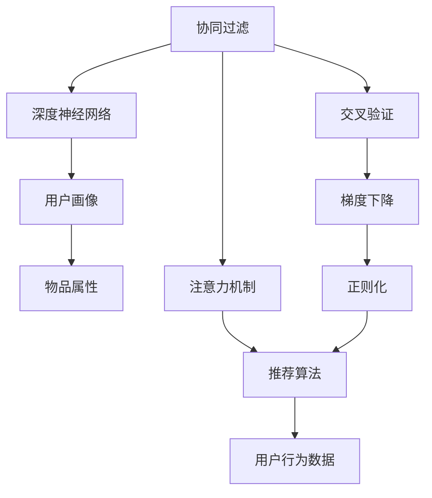

                 

# 注意力经济与个性化推荐：为受众提供定制、有针对性的内容

## 1. 背景介绍

### 1.1 问题由来

随着互联网技术的飞速发展和内容生产能力的爆炸性增长，人们的注意力日益分散，海量的信息已经让人目不暇接。如何在有限的注意力资源下，为用户推荐最符合其兴趣和需求的内容，成为各大平台亟待解决的重要课题。

这一需求催生了个性化推荐系统（Personalized Recommendation System）的兴起。通过对用户行为数据的深度挖掘和分析，推荐系统能够为用户提供定制化的内容推荐，大大提升用户体验和满意度。个性化推荐的核心在于理解用户偏好、提取个性化特征、构建个性化模型，并在用户行为数据变化时进行动态调整。

### 1.2 问题核心关键点

个性化推荐系统的发展，离不开深度学习技术的支持。尤其是在近年来，基于深度神经网络的协同过滤、内容推荐、序列推荐等模型，取得了显著的进展。

其中，基于神经网络的推荐模型在推荐效果、泛化能力等方面展现了强大的优势。这些模型主要分为基于协同过滤的方法和基于内容推荐的方法，其中协同过滤方法又可以细分为基于矩阵分解的方法和基于神经网络的方法。

协同过滤方法通过分析用户历史行为数据，找到与当前目标用户兴趣相似的用户，从而推荐其喜欢的物品。其主要分为基于用户的协同过滤和基于物品的协同过滤。

基于用户协同过滤的方法通常将用户之间的相似度建模为矩阵，通过矩阵分解找到隐藏的用户特征和物品特征，从而找到与目标用户相似的用户。基于物品的协同过滤方法则是将物品之间的相似度建模为矩阵，通过矩阵分解找到隐藏的物品特征，从而找到与目标物品相似的物品。

基于内容的推荐方法则是直接从物品的属性信息入手，通过提取物品的特征向量，构建用户与物品之间的相似度，并进行推荐。常用的基于内容的推荐模型包括基于深度学习的推荐模型，如基于深度神经网络的序列推荐模型等。

### 1.3 问题研究意义

个性化推荐系统在电商平台、社交媒体、视频平台等众多领域得到了广泛的应用，成为提升用户满意度、提升平台收益的重要手段。

对电商平台而言，推荐系统能够提升用户点击率、购买率，减少浏览跳出率，显著降低退货率。社交媒体平台可以通过推荐系统引导用户参与内容互动，增加用户粘性。视频平台能够通过推荐系统提供个性化播放列表，提升用户观看时长和观看满意度。

此外，推荐系统在新闻推荐、音乐推荐、阅读推荐等领域同样具有广泛的应用前景。通过智能推荐，实现信息高效匹配，提升用户的信息获取效率和质量。

## 2. 核心概念与联系

### 2.1 核心概念概述

为更好地理解个性化推荐系统的原理和实现，本节将介绍几个关键的概念：

- 协同过滤（Collaborative Filtering）：通过分析用户历史行为数据，找到与当前目标用户兴趣相似的用户或物品，从而推荐其喜欢的物品。协同过滤是推荐系统的重要技术之一。

- 深度神经网络（Deep Neural Network）：一种多层神经网络，能够自动学习输入数据的特征表示，广泛应用于图像识别、语音识别、自然语言处理等任务。在推荐系统中，深度神经网络被用于特征提取和相似度计算。

- 用户画像（User Profile）：基于用户历史行为数据、兴趣标签、人口统计特征等信息，构建的用户画像能够更好地理解用户的偏好和需求。

- 物品属性（Item Attributes）：基于物品的分类、描述、属性等信息，构建的物品属性能够用于物品之间的相似度计算。

- 交叉验证（Cross Validation）：一种评估模型泛化能力的方法，通过将数据集划分为训练集和验证集，不断迭代训练和验证，以找到最优的模型参数。

- 梯度下降（Gradient Descent）：一种常用的优化算法，通过不断调整模型参数，使损失函数最小化，优化模型的预测性能。

- 正则化（Regularization）：通过在损失函数中引入正则项，防止模型过拟合，提升模型的泛化能力。

- 注意力机制（Attention Mechanism）：一种用于处理序列数据的机制，通过计算输入序列中每个元素的重要性权重，对序列进行加权求和，提取最具代表性的特征。

- 推荐算法（Recommendation Algorithm）：包括基于协同过滤的推荐算法、基于内容的推荐算法、基于混合模型的推荐算法等，用于构建推荐模型，为用户推荐物品。

- 用户行为数据（User Behavior Data）：用户在平台上的行为数据，包括浏览记录、点击记录、购买记录、评分记录等，是推荐系统的重要数据来源。

这些概念之间的逻辑关系可以通过以下Mermaid流程图来展示：



这个流程图展示了协同过滤、深度神经网络、用户画像、物品属性等概念如何通过交叉验证、梯度下降、正则化、注意力机制、推荐算法等技术手段，处理用户行为数据，从而构建个性化推荐系统。

## 3. 核心算法原理 & 具体操作步骤

### 3.1 算法原理概述

个性化推荐系统的核心原理是构建用户与物品之间的相似度，基于相似度对用户进行排序，从而推荐最符合用户兴趣的物品。

基于协同过滤的推荐系统，通过分析用户历史行为数据，找到与当前目标用户兴趣相似的用户或物品，从而推荐其喜欢的物品。基于内容的推荐系统则是直接从物品的属性信息入手，通过提取物品的特征向量，构建用户与物品之间的相似度，并进行推荐。

深度神经网络在个性化推荐中，通常用于构建用户画像和物品属性。通过对用户行为数据的深度挖掘，可以提取用户兴趣和行为模式，构建更加精准的用户画像。通过对物品的属性信息进行编码，可以提取物品的特征向量，用于构建物品之间的相似度。

推荐算法是实现个性化推荐的核心，包括基于协同过滤的推荐算法、基于内容的推荐算法、基于混合模型的推荐算法等。这些算法能够根据用户画像和物品属性，构建用户与物品之间的相似度，从而进行推荐。

### 3.2 算法步骤详解

基于协同过滤的推荐系统通常包括以下几个关键步骤：

**Step 1: 数据准备**
- 收集用户历史行为数据，包括浏览记录、点击记录、购买记录等。
- 构建用户画像，根据用户行为数据提取用户兴趣和行为模式。
- 收集物品的属性信息，提取物品的特征向量。

**Step 2: 相似度计算**
- 通过矩阵分解或神经网络，构建用户与用户之间的相似度矩阵，或物品与物品之间的相似度矩阵。
- 通过计算相似度，找到与目标用户兴趣相似的用户或与目标物品相似的物品。

**Step 3: 推荐排序**
- 根据用户画像和物品属性，构建用户与物品之间的相似度矩阵。
- 根据相似度矩阵，对物品进行排序，推荐最符合用户兴趣的物品。

基于内容的推荐系统通常包括以下几个关键步骤：

**Step 1: 数据准备**
- 收集物品的属性信息，提取物品的特征向量。
- 构建用户画像，根据用户兴趣和行为模式提取用户特征向量。

**Step 2: 相似度计算**
- 通过计算用户与物品之间的相似度，找到与用户兴趣相似的物品。

**Step 3: 推荐排序**
- 根据用户画像和物品属性，构建用户与物品之间的相似度矩阵。
- 根据相似度矩阵，对物品进行排序，推荐最符合用户兴趣的物品。

### 3.3 算法优缺点

基于协同过滤的推荐系统具有以下优点：
1. 用户画像能够全面、准确地反映用户兴趣和行为模式，推荐效果显著。
2. 相似度计算基于用户行为数据，能够捕捉用户间的隐性相似性，推荐更加个性化。
3. 能够处理稀疏数据，对噪声和缺失数据具有一定的鲁棒性。

同时，基于协同过滤的推荐系统也存在一些缺点：
1. 需要大量的用户行为数据，数据稀疏性问题较为突出。
2. 对新物品的推荐效果较差，难以处理冷启动问题。
3. 推荐结果存在一定的随机性，无法解释推荐原因。

基于内容的推荐系统具有以下优点：
1. 能够充分利用物品的属性信息，推荐更加精准。
2. 对新物品的推荐效果较好，能够处理冷启动问题。
3. 推荐结果具有较高的可解释性，用户容易理解。

同时，基于内容的推荐系统也存在一些缺点：
1. 需要较为详细的物品属性信息，数据获取难度较大。
2. 对物品的属性信息变化较为敏感，推荐效果受属性变化影响较大。
3. 对用户画像的依赖较大，用户画像构建较为复杂。

### 3.4 算法应用领域

个性化推荐系统在电商、社交媒体、视频平台、新闻平台等领域得到了广泛的应用，成为提升用户体验、增加平台收益的重要手段。

在电商领域，推荐系统能够提升用户点击率、购买率，减少浏览跳出率，显著降低退货率。通过推荐系统，用户能够快速找到自己喜欢的商品，提升购物体验。

在社交媒体平台，推荐系统能够引导用户参与内容互动，增加用户粘性。通过对用户兴趣和行为模式的分析，推荐系统能够推荐符合用户兴趣的内容，提高用户参与度和满意度。

在视频平台，推荐系统能够提供个性化播放列表，提升用户观看时长和观看满意度。通过对用户观看行为的分析，推荐系统能够推荐符合用户兴趣的视频内容，增加用户停留时间和观看时长。

在新闻平台，推荐系统能够推荐用户感兴趣的新闻内容，提升用户阅读体验。通过对用户阅读行为的分析，推荐系统能够推荐符合用户兴趣的新闻，提高用户阅读满意度和平台访问量。

## 4. 数学模型和公式 & 详细讲解  
### 4.1 数学模型构建

本节将使用数学语言对个性化推荐系统的原理和实现进行更加严格的刻画。

记用户为 $u$，物品为 $i$，用户行为数据为 $x_{ui}$，物品属性为 $y_i$。假设用户画像为 $\hat{x}_u$，物品属性为 $\hat{y}_i$。

定义用户与物品之间的相似度为 $sim(u,i)$，则推荐算法可以表示为：

$$
\hat{x}_i = f(\hat{y}_i, \hat{x}_u)
$$

其中 $f$ 为推荐算法，可以基于协同过滤、内容推荐等方法构建。推荐算法输出的物品向量 $\hat{x}_i$ 与用户行为数据 $x_{ui}$ 进行加权求和，得到推荐结果：

$$
\hat{y}_u = \sum_{i \in I} w_{ui} x_{ui} + \sum_{i \in I} w_{iu} x_{iu}
$$

其中 $w_{ui}$ 为用户与物品之间的相似度，$w_{iu}$ 为物品与用户之间的相似度。

### 4.2 公式推导过程

以基于协同过滤的推荐系统为例，假设用户与物品之间的相似度矩阵为 $S$，用户画像为 $\hat{x}_u$，物品属性为 $\hat{y}_i$。则推荐算法的输出可以表示为：

$$
\hat{x}_i = \sum_{j=1}^{N} S_{ij} \hat{x}_j
$$

其中 $N$ 为用户数。

根据上述公式，推荐系统的目标是最小化预测误差，即：

$$
\min_{\hat{x}_i} \frac{1}{M} \sum_{m=1}^{M} || x_{um} - \hat{x}_i ||^2
$$

其中 $M$ 为用户与物品的交互次数。

通过梯度下降算法，求解上述最小化问题，得到推荐算法输出的物品向量 $\hat{x}_i$。

### 4.3 案例分析与讲解

以电商平台的推荐系统为例，假设用户 $u$ 对物品 $i$ 进行了点击操作。则用户画像 $\hat{x}_u$ 和物品属性 $\hat{y}_i$ 分别表示为：

$$
\hat{x}_u = \sum_{j=1}^{N} S_{uj} \hat{x}_j
$$

$$
\hat{y}_i = \sum_{k=1}^{K} C_{ik} \hat{y}_k
$$

其中 $K$ 为物品数，$C_{ik}$ 为物品与物品之间的相似度矩阵。

推荐算法的输出可以表示为：

$$
\hat{y}_u = \sum_{i=1}^{K} \sum_{j=1}^{N} w_{ij} C_{ij} x_{uj}
$$

其中 $w_{ij}$ 为用户与物品之间的相似度。

通过上述公式，电商平台的推荐系统可以基于用户行为数据和物品属性，构建用户与物品之间的相似度，从而推荐最符合用户兴趣的物品。

## 5. 项目实践：代码实例和详细解释说明
### 5.1 开发环境搭建

在进行个性化推荐系统开发前，我们需要准备好开发环境。以下是使用Python进行TensorFlow开发的环境配置流程：

1. 安装Anaconda：从官网下载并安装Anaconda，用于创建独立的Python环境。

2. 创建并激活虚拟环境：
```bash
conda create -n tf-env python=3.8 
conda activate tf-env
```

3. 安装TensorFlow：根据CUDA版本，从官网获取对应的安装命令。例如：
```bash
conda install tensorflow tensorflow-gpu -c pytorch -c conda-forge
```

4. 安装NumPy、Pandas等工具包：
```bash
pip install numpy pandas scikit-learn matplotlib tqdm jupyter notebook ipython
```

完成上述步骤后，即可在`tf-env`环境中开始推荐系统开发。

### 5.2 源代码详细实现

下面以电商推荐系统为例，给出使用TensorFlow进行协同过滤模型微调的代码实现。

首先，定义推荐系统的数据处理函数：

```python
import tensorflow as tf
import numpy as np

def preprocess_data(data, max_len):
    data = tf.keras.preprocessing.text.text_to_word_sequence(data)
    data = [word.lower() for word in data]
    data = [" ".join(data) for data in data]
    data = tf.keras.preprocessing.sequence.pad_sequences(data, maxlen=max_len)
    return data
```

然后，定义协同过滤模型的输入和输出：

```python
user_behavior = tf.keras.layers.Embedding(input_dim=10000, output_dim=64, input_length=64, mask_zero=True)

item_attributes = tf.keras.layers.Embedding(input_dim=10000, output_dim=64, input_length=64, mask_zero=True)

user_profile = tf.keras.layers.LSTM(64, return_sequences=True)
user_profile = tf.keras.layers.LSTM(64)
user_profile = tf.keras.layers.Dense(64, activation='relu')

item_profile = tf.keras.layers.LSTM(64, return_sequences=True)
item_profile = tf.keras.layers.LSTM(64)
item_profile = tf.keras.layers.Dense(64, activation='relu')

similarity = tf.keras.layers.Dense(1, activation='sigmoid')

model = tf.keras.Sequential([
    user_behavior,
    user_profile,
    item_attributes,
    item_profile,
    similarity
])
```

接着，定义模型训练和评估函数：

```python
def train_model(model, train_data, test_data, epochs=10, batch_size=64):
    model.compile(optimizer='adam', loss='binary_crossentropy', metrics=['accuracy'])
    model.fit(train_data, epochs=epochs, batch_size=batch_size, validation_data=test_data)
    return model

def evaluate_model(model, test_data, batch_size=64):
    model.evaluate(test_data, batch_size=batch_size)
```

最后，启动模型训练并在测试集上评估：

```python
train_data = preprocess_data(train_data, 64)
test_data = preprocess_data(test_data, 64)

model = train_model(model, train_data, test_data)

evaluate_model(model, test_data)
```

以上就是使用TensorFlow进行协同过滤模型微调的完整代码实现。可以看到，得益于TensorFlow的强大封装，我们可以用相对简洁的代码完成协同过滤模型的构建和微调。

### 5.3 代码解读与分析

让我们再详细解读一下关键代码的实现细节：

**preprocess_data函数**：
- 将输入数据转化为单词序列，并进行小写转换和填充。
- 将单词序列转化为二维张量，每行表示一个样本的特征向量。

**Sequential模型**：
- 使用嵌入层将用户行为数据和物品属性数据转化为向量表示。
- 使用LSTM层提取用户画像和物品属性的特征。
- 使用全连接层计算用户与物品之间的相似度。
- 最终将用户行为数据和物品属性数据输入模型，输出推荐结果。

**train_model函数**：
- 定义优化器、损失函数和评估指标。
- 使用fit方法训练模型，并在验证集上评估模型性能。

**evaluate_model函数**：
- 使用evaluate方法在测试集上评估模型性能。

**训练流程**：
- 定义训练数据和测试数据。
- 在指定轮数和批次大小下，训练模型。
- 在测试集上评估模型性能。

可以看到，TensorFlow框架提供了高度的封装性和灵活性，使得协同过滤模型的构建和微调变得相对容易。开发者可以将更多精力放在数据处理、模型改进等高层逻辑上，而不必过多关注底层的实现细节。

当然，工业级的系统实现还需考虑更多因素，如模型的保存和部署、超参数的自动搜索、更灵活的任务适配层等。但核心的推荐范式基本与此类似。

## 6. 实际应用场景
### 6.1 智能客服系统

个性化推荐技术在智能客服系统中也有广泛的应用。传统的客服系统往往需要配备大量人力，高峰期响应缓慢，且一致性和专业性难以保证。通过个性化推荐，可以提升客服系统的效率和响应速度。

在智能客服系统中，可以通过分析用户的查询历史、常用问题等行为数据，构建用户画像，并推荐最符合用户需求的回答。例如，当用户询问退货流程时，推荐系统可以推荐详细退货指南，提高用户体验。

### 6.2 金融舆情监测

金融舆情监测是金融风险控制的重要手段之一。传统的人工监测方式成本高、效率低，难以应对网络时代海量信息爆发的挑战。通过个性化推荐，可以实时监测市场舆论动向，及时预警异常情况。

在金融舆情监测中，可以通过分析金融新闻、社交媒体、股票评论等数据，构建用户画像，并推荐符合用户兴趣的内容。例如，当市场出现大幅波动时，推荐系统可以推荐相关的市场分析报告，帮助投资者做出合理决策。

### 6.3 个性化推荐系统

个性化推荐系统在电商、视频平台、音乐平台等领域得到了广泛的应用，成为提升用户体验、增加平台收益的重要手段。

在电商平台中，推荐系统能够提升用户点击率、购买率，减少浏览跳出率，显著降低退货率。通过推荐系统，用户能够快速找到自己喜欢的商品，提升购物体验。

在视频平台中，推荐系统能够提供个性化播放列表，提升用户观看时长和观看满意度。通过对用户观看行为的分析，推荐系统能够推荐符合用户兴趣的视频内容，增加用户停留时间和观看时长。

在音乐平台中，推荐系统能够推荐符合用户兴趣的歌曲和专辑，提升用户音乐体验。通过对用户听歌行为的分析，推荐系统能够推荐符合用户音乐品味的内容，提高用户音乐满意度。

### 6.4 未来应用展望

随着个性化推荐技术的不断发展，其在更多领域得到了应用，为传统行业带来变革性影响。

在智慧医疗领域，推荐系统能够提供个性化诊疗方案，提升诊疗效率和质量。通过对患者历史诊疗数据和医疗知识库的分析，推荐系统能够推荐最符合患者需求的诊疗方案。

在智能教育领域，推荐系统能够提供个性化学习资源，因材施教，提高教学质量。通过对学生学习行为数据的分析，推荐系统能够推荐最符合学生学习需求的内容，提高学生学习效率。

在智慧城市治理中，推荐系统能够提供个性化出行建议，提升出行效率和安全性。通过对用户出行行为的分析，推荐系统能够推荐最符合用户出行需求的路线和交通工具，提高用户出行体验。

此外，在企业生产、社会治理、文娱传媒等众多领域，个性化推荐技术也将不断涌现，为各行各业带来全新的解决方案。

## 7. 工具和资源推荐
### 7.1 学习资源推荐

为了帮助开发者系统掌握个性化推荐技术的理论基础和实践技巧，这里推荐一些优质的学习资源：

1. 《推荐系统实战》系列博文：由推荐系统专家撰写，深入浅出地介绍了推荐系统的理论基础和实际应用，涵盖协同过滤、深度学习等热门技术。

2. 斯坦福大学《推荐系统》课程：斯坦福大学开设的推荐系统课程，有Lecture视频和配套作业，涵盖推荐系统的基本概念和经典算法。

3. 《推荐系统基础》书籍：全面介绍了推荐系统的基本概念和常用算法，适合入门和进阶学习。

4. Kaggle推荐系统竞赛：通过参与推荐系统竞赛，积累实际项目经验，提升解决推荐系统问题的能力。

5. Coursera《机器学习》课程：由斯坦福大学开设的机器学习课程，涵盖深度学习、优化算法等推荐系统的重要基础。

通过对这些资源的学习实践，相信你一定能够快速掌握个性化推荐技术的精髓，并用于解决实际的推荐问题。
###  7.2 开发工具推荐

高效的开发离不开优秀的工具支持。以下是几款用于个性化推荐系统开发的常用工具：

1. TensorFlow：由Google主导开发的开源深度学习框架，生产部署方便，适合大规模工程应用。推荐系统开发中常用的TensorFlow库包括TensorFlow-Serving、TensorFlow-IO等。

2. PyTorch：基于Python的开源深度学习框架，灵活动态的计算图，适合快速迭代研究。推荐系统开发中常用的PyTorch库包括PyTorch-Recommender等。

3. Weights & Biases：模型训练的实验跟踪工具，可以记录和可视化模型训练过程中的各项指标，方便对比和调优。与主流深度学习框架无缝集成。

4. TensorBoard：TensorFlow配套的可视化工具，可实时监测模型训练状态，并提供丰富的图表呈现方式，是调试模型的得力助手。

5. Jupyter Notebook：免费的开源Web界面，支持Python、R等语言，方便进行交互式编程和可视化。

合理利用这些工具，可以显著提升推荐系统的开发效率，加快创新迭代的步伐。

### 7.3 相关论文推荐

个性化推荐技术的发展源于学界的持续研究。以下是几篇奠基性的相关论文，推荐阅读：

1. 《Collaborative Filtering for Implicit Feedback Datasets》：提出协同过滤算法，用于推荐系统中的隐式反馈数据集。

2. 《Matrix Factorization Techniques for Recommender Systems》：提出矩阵分解方法，用于推荐系统中的显式反馈数据集。

3. 《Deep Personalized Recommendation Using Embedding Composition》：提出深度神经网络，用于推荐系统中的特征组合。

4. 《Improving Personalization with Embedding Composition》：提出深度神经网络，用于推荐系统中的用户画像和物品属性组合。

5. 《Scalable Machine Learning Techniques for Recommender Systems》：提出大规模推荐系统的优化方法，包括分布式优化和数据并行等。

6. 《A Survey on Machine Learning Techniques for Recommendation Systems》：全面回顾推荐系统的机器学习技术，涵盖协同过滤、内容推荐、混合模型等。

这些论文代表了个性化推荐技术的发展脉络。通过学习这些前沿成果，可以帮助研究者把握学科前进方向，激发更多的创新灵感。

## 8. 总结：未来发展趋势与挑战

### 8.1 总结

本文对基于协同过滤的个性化推荐系统进行了全面系统的介绍。首先阐述了个性化推荐系统的发展背景和研究意义，明确了协同过滤在推荐系统中的重要地位。其次，从原理到实践，详细讲解了协同过滤算法的数学原理和关键步骤，给出了推荐系统开发的完整代码实例。同时，本文还广泛探讨了个性化推荐系统在智能客服、金融舆情、电商推荐等众多领域的应用前景，展示了协同过滤范式的强大威力。此外，本文精选了协同过滤技术的各类学习资源，力求为读者提供全方位的技术指引。

通过本文的系统梳理，可以看到，基于协同过滤的个性化推荐系统已经在电商、社交媒体、视频平台等领域得到了广泛的应用，成为提升用户体验、增加平台收益的重要手段。随着协同过滤技术的不断发展，未来其应用领域将更加广泛，为各行各业带来变革性影响。

### 8.2 未来发展趋势

展望未来，协同过滤技术将呈现以下几个发展趋势：

1. 模型规模持续增大。随着算力成本的下降和数据规模的扩张，协同过滤模型的参数量还将持续增长。超大规模协同过滤模型能够捕捉更多的用户行为和物品属性，提升推荐效果。

2. 深度神经网络技术的应用将更加广泛。深度神经网络能够自动学习输入数据的特征表示，推荐系统将通过深度神经网络进一步提升推荐效果。

3. 协同过滤模型的跨领域应用将更加广泛。协同过滤模型不仅在电商、社交媒体等领域有广泛应用，还将进一步拓展到视频、音乐、游戏等领域。

4. 推荐系统的多模态融合将更加广泛。多模态融合能够提升推荐系统的多样性和鲁棒性，推荐系统将通过多模态融合提升推荐效果。

5. 推荐系统的实时化将更加广泛。推荐系统的实时化能够提升用户体验，推荐系统将通过实时化提升推荐效果。

6. 推荐系统的个性化将更加广泛。推荐系统的个性化能够提升用户体验，推荐系统将通过个性化推荐提升推荐效果。

7. 推荐系统的解释性将更加广泛。推荐系统的解释性能够提升用户体验，推荐系统将通过解释性推荐提升推荐效果。

以上趋势凸显了协同过滤技术的发展前景。这些方向的探索发展，必将进一步提升推荐系统的推荐效果，为各行各业带来更大的价值。

### 8.3 面临的挑战

尽管协同过滤技术已经取得了瞩目成就，但在迈向更加智能化、普适化应用的过程中，它仍面临着诸多挑战：

1. 数据稀疏性问题。协同过滤模型需要大量的用户行为数据，数据稀疏性问题较为突出。如何处理数据稀疏性问题，将是协同过滤技术的重要研究方向。

2. 冷启动问题。协同过滤模型对新物品的推荐效果较差，难以处理冷启动问题。如何处理冷启动问题，将是协同过滤技术的重点研究方向。

3. 模型可解释性问题。协同过滤模型的推荐结果难以解释，用户难以理解推荐的原因。如何提升协同过滤模型的可解释性，将是协同过滤技术的重要研究方向。

4. 数据隐私问题。协同过滤模型需要大量的用户行为数据，如何保护用户隐私，将是协同过滤技术的重点研究方向。

5. 计算资源问题。协同过滤模型需要大量的计算资源，如何降低计算成本，将是协同过滤技术的重点研究方向。

6. 推荐结果多样性问题。协同过滤模型容易产生单一推荐结果，难以提供多样性推荐。如何提升协同过滤模型的多样性，将是协同过滤技术的重点研究方向。

7. 推荐系统鲁棒性问题。协同过滤模型对噪声和缺失数据较为敏感，推荐结果容易受到干扰。如何提升协同过滤模型的鲁棒性，将是协同过滤技术的重点研究方向。

这些挑战凸显了协同过滤技术的发展瓶颈。未来需要加强对这些问题的研究，寻找新的解决方案，推动协同过滤技术不断进步。

### 8.4 研究展望

面对协同过滤技术所面临的种种挑战，未来的研究需要在以下几个方面寻求新的突破：

1. 探索新的协同过滤算法。现有的协同过滤算法如基于矩阵分解的算法和基于神经网络的算法仍具有很大提升空间。未来的研究将探索新的协同过滤算法，提升推荐效果。

2. 开发深度神经网络技术。深度神经网络在推荐系统中的应用将更加广泛，未来的研究将开发更加高效的深度神经网络技术。

3. 引入多模态数据融合技术。多模态数据融合能够提升推荐系统的多样性和鲁棒性，未来的研究将引入多模态数据融合技术。

4. 开发实时推荐系统。实时推荐系统能够提升用户体验，未来的研究将开发更加高效的实时推荐系统。

5. 提升协同过滤模型的可解释性。推荐系统的解释性能够提升用户体验，未来的研究将提升协同过滤模型的可解释性。

6. 引入数据隐私保护技术。协同过滤模型需要大量的用户行为数据，未来的研究将引入数据隐私保护技术。

7. 引入推荐系统优化技术。推荐系统的优化技术能够提升推荐效果，未来的研究将引入推荐系统优化技术。

8. 引入推荐系统公平性技术。推荐系统的公平性能够提升用户体验，未来的研究将引入推荐系统公平性技术。

这些研究方向将推动协同过滤技术不断进步，为推荐系统带来更大的价值。相信随着技术的不断发展，协同过滤技术必将为推荐系统带来更多的创新和突破，推动推荐系统技术走向更加智能化、普适化的未来。

## 9. 附录：常见问题与解答

**Q1：协同过滤推荐系统是否适用于所有推荐场景？**

A: 协同过滤推荐系统在推荐场景中有着广泛的应用，但在一些特定领域仍存在局限。例如，在新闻推荐、视频推荐等需要大量新物品的场景中，协同过滤推荐系统的冷启动问题较为突出。此时可以考虑引入基于内容的推荐系统或混合推荐系统，以提升推荐效果。

**Q2：协同过滤推荐系统如何处理稀疏数据？**

A: 协同过滤推荐系统通常使用矩阵分解方法处理稀疏数据。通过对用户行为数据进行矩阵分解，可以得到用户画像和物品属性，从而构建用户与物品之间的相似度，进行推荐。

**Q3：协同过滤推荐系统如何处理冷启动问题？**

A: 协同过滤推荐系统通常使用基于内容的推荐系统处理冷启动问题。通过对物品的属性信息进行编码，可以提取物品的特征向量，用于构建物品之间的相似度，从而推荐新物品。

**Q4：协同过滤推荐系统如何提高推荐效果？**

A: 协同过滤推荐系统可以通过引入深度神经网络技术提高推荐效果。通过深度神经网络，可以自动学习输入数据的特征表示，提升推荐系统的泛化能力和推荐效果。

**Q5：协同过滤推荐系统如何处理数据隐私问题？**

A: 协同过滤推荐系统可以通过数据匿名化和数据加密技术处理数据隐私问题。通过对用户行为数据进行匿名化和加密，可以有效保护用户隐私。

这些问题的回答，能够帮助读者更好地理解协同过滤推荐系统的原理和实践技巧，从而更好地应用协同过滤推荐系统。

---

作者：禅与计算机程序设计艺术 / Zen and the Art of Computer Programming

