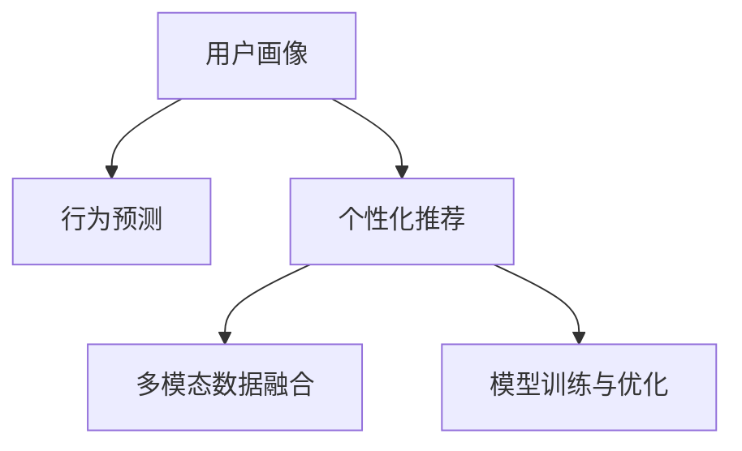

                 

## 1. 背景介绍

### 1.1 问题由来

随着互联网技术的不断进步，人们获取信息的方式日益多样化，注意力成为稀缺资源。传统的一对多营销模式逐渐失效，个性化营销策略应运而生。个性化营销通过分析用户行为数据，精确预测用户需求，提供定制化的产品和服务，极大提升了用户体验和业务转化率。

个性化营销的核心在于构建高效的用户画像，实现对用户行为的深度理解。借助大数据和机器学习技术，用户画像变得越来越精细化和立体化，对用户行为的预测和决策能力显著增强。然而，用户画像的构建和维护仍面临诸多挑战，如数据稀疏、数据偏差、模型泛化等问题。这些问题不仅影响个性化营销的效果，还可能导致用户隐私泄露等伦理风险。

### 1.2 问题核心关键点

个性化营销的关键在于如何高效构建用户画像，并通过多维度的数据预测用户行为，实现精准推荐。常用的方法包括：

1. **用户画像构建**：通过用户行为数据，如浏览记录、搜索历史、购物习惯等，构建用户画像。
2. **行为预测**：利用机器学习算法，预测用户未来可能的行为，如购买、推荐等。
3. **个性化推荐**：根据用户画像和行为预测结果，推荐个性化的产品或服务。
4. **效果评估**：通过实际转化率、点击率等指标，评估个性化推荐的效果，不断迭代优化。

这些关键点的成功实现，依赖于先进的算法、数据处理技术以及良好的用户体验设计。

### 1.3 问题研究意义

个性化营销的深入研究，不仅有助于提升企业销售额和用户满意度，还能推动数字经济的持续发展。通过精准推荐和个性化服务，提高用户粘性，促进用户留存和复购。此外，个性化营销还能带来更高的用户参与度和品牌忠诚度，增强企业市场竞争力。

在学术界和工业界，个性化营销的研究成果已经广泛应用于电商、金融、社交媒体等多个领域。随着数据技术、计算能力的不断提升，个性化营销的实现方式将更加多样化，效果将更加显著。

## 2. 核心概念与联系

### 2.1 核心概念概述

为更好地理解个性化营销策略与实践，本节将介绍几个密切相关的核心概念：

- **用户画像**：基于用户行为数据构建的多维用户模型，用于刻画用户的兴趣、偏好、行为等特征。
- **行为预测**：通过机器学习算法，对用户未来行为进行预测，包括点击、购买、评价等。
- **个性化推荐**：根据用户画像和行为预测结果，向用户推荐个性化的产品或服务，提升用户体验和业务转化率。
- **多模态数据融合**：将多种数据源（如文本、图像、音频等）进行融合，构建更加全面、精细的用户画像。
- **模型训练与优化**：利用数据科学方法，对模型进行训练和优化，提升预测准确率和用户体验。

这些核心概念之间的逻辑关系可以通过以下Mermaid流程图来展示：



这个流程图展示了个性化营销的核心概念及其之间的关系：

1. 用户画像通过收集用户行为数据进行构建。
2. 行为预测利用用户画像和机器学习算法，预测用户未来行为。
3. 个性化推荐根据用户画像和行为预测结果，推荐个性化产品或服务。
4. 多模态数据融合将多种数据源进行融合，增强用户画像的全面性和准确性。
5. 模型训练与优化通过不断迭代和优化，提升预测模型的效果。

这些核心概念共同构成了个性化营销的工作框架，使其能够在不同的业务场景中发挥作用。通过理解这些核心概念，我们可以更好地把握个性化营销的实现流程和技术细节。

## 3. 核心算法原理 & 具体操作步骤

### 3.1 算法原理概述

个性化营销的核心在于利用机器学习算法，对用户画像进行建模和预测，从而实现个性化推荐。常用的算法包括：

- **协同过滤**：利用用户历史行为数据，推荐类似用户喜欢的产品。
- **内容推荐**：基于用户兴趣标签，推荐相关内容。
- **深度学习模型**：如神经网络、深度信念网络（DBN）等，通过多维数据进行用户画像和行为预测。
- **强化学习**：通过用户行为反馈，不断调整推荐策略，提升推荐效果。

个性化营销的算法原理主要包括以下几个步骤：

1. **数据收集与预处理**：收集用户行为数据，并进行清洗、去重、归一化等预处理。
2. **用户画像建模**：通过机器学习算法，构建用户画像。
3. **行为预测**：利用用户画像和算法，预测用户未来行为。
4. **个性化推荐**：根据用户画像和行为预测结果，推荐个性化产品或服务。
5. **效果评估与优化**：通过实际效果评估，不断迭代优化推荐模型。

### 3.2 算法步骤详解

个性化营销的算法步骤主要包括以下几个关键环节：

**Step 1: 数据收集与预处理**

- 收集用户行为数据，包括浏览记录、点击行为、购买历史等。
- 对数据进行清洗、去重、归一化等预处理，以保证数据质量。

**Step 2: 用户画像建模**

- 选择合适的算法（如协同过滤、内容推荐、深度学习模型等），构建用户画像。
- 利用用户画像对用户行为进行建模，识别出用户兴趣、偏好、行为模式等特征。

**Step 3: 行为预测**

- 选择合适的算法（如线性回归、决策树、随机森林等），预测用户未来行为。
- 利用历史行为数据和用户画像，构建预测模型。

**Step 4: 个性化推荐**

- 选择合适的算法（如矩阵分解、基于深度学习的推荐系统等），生成个性化推荐结果。
- 根据用户画像和行为预测结果，推荐相关产品或服务。

**Step 5: 效果评估与优化**

- 收集用户反馈数据，评估个性化推荐的准确性和效果。
- 通过A/B测试等方法，不断迭代优化推荐模型。

### 3.3 算法优缺点

个性化营销的算法具有以下优点：

1. **高准确率**：利用机器学习算法，能够高效预测用户行为，提高推荐准确率。
2. **个性化推荐**：根据用户画像和行为预测结果，提供个性化的产品或服务。
3. **用户粘性**：通过精准推荐，提升用户粘性和满意度。
4. **业务转化率**：精准推荐能够有效提升业务转化率。

同时，这些算法也存在一些局限性：

1. **数据依赖性**：算法的效果高度依赖于数据的质量和量，数据偏差可能导致推荐偏差。
2. **模型复杂性**：部分算法（如深度学习模型）需要大量的计算资源和时间，模型调参难度较大。
3. **隐私问题**：在数据收集和处理过程中，可能涉及用户隐私保护问题，需采取隐私保护措施。
4. **泛化能力**：部分算法可能存在过拟合问题，难以泛化到新用户和新场景。

### 3.4 算法应用领域

个性化营销的算法已在多个领域得到广泛应用，例如：

- **电子商务**：推荐商品、促销活动等，提升用户购物体验和转化率。
- **金融服务**：个性化理财建议、风险评估等，提升用户满意度和业务转化率。
- **媒体娱乐**：个性化内容推荐、广告投放等，提升用户粘性和广告效果。
- **旅游出行**：推荐旅游路线、目的地等，提升用户体验和业务转化率。
- **健康医疗**：个性化健康建议、疾病预测等，提升用户健康管理和业务转化率。

除了上述这些经典应用外，个性化营销的算法还创新性地应用于更多场景中，如智能家居、智能客服、智慧交通等，为各行各业带来了新的业务增长点。

## 4. 数学模型和公式 & 详细讲解 & 举例说明

### 4.1 数学模型构建

本节将使用数学语言对个性化营销的算法进行更加严格的刻画。

假设用户画像为 $P$，包含用户兴趣、偏好、行为等特征，形式化表示为 $P = \{f_1, f_2, \dots, f_n\}$。行为预测模型为 $M$，形式化表示为 $M = \{g_1, g_2, \dots, g_m\}$。个性化推荐算法为 $R$，形式化表示为 $R = \{h_1, h_2, \dots, h_k\}$。

定义行为预测模型 $M$ 在用户画像 $P$ 上的预测结果为 $\hat{y}$，形式化表示为 $\hat{y} = M(P)$。

个性化推荐算法 $R$ 根据用户画像 $P$ 和行为预测结果 $\hat{y}$，生成个性化推荐结果 $x$，形式化表示为 $x = R(P, \hat{y})$。

### 4.2 公式推导过程

以协同过滤算法为例，推导其预测公式。

假设用户 $u$ 的历史行为数据为 $I_u = \{r_{ui}\}_{i=1}^N$，其中 $r_{ui}$ 表示用户 $u$ 对物品 $i$ 的评分。设物品 $i$ 的特征向量为 $v_i = \{v_{i1}, v_{i2}, \dots, v_{in}\}$。协同过滤算法利用用户 $u$ 和物品 $i$ 的相似度 $s_{ui}$，预测用户 $u$ 对物品 $j$ 的评分 $r_{uj}$。

协同过滤算法的基本思路是通过计算用户 $u$ 和物品 $i$ 的相似度，找到与用户 $u$ 兴趣相似的物品 $j$，预测用户 $u$ 对物品 $j$ 的评分。

协同过滤算法的预测公式为：

$$
r_{uj} = \hat{y} = \alpha \sum_{i=1}^N r_{ui} v_{ij}
$$

其中，$\alpha$ 为相似度系数。该公式表示用户 $u$ 对物品 $j$ 的预测评分，是基于其对物品 $i$ 的评分和物品 $j$ 的特征向量 $v_j$ 的加权求和。

### 4.3 案例分析与讲解

假设某电商平台收集了用户 $u$ 对多个物品的评分数据 $I_u = \{r_{ui}\}_{i=1}^N$，并利用协同过滤算法，预测用户 $u$ 对新物品 $j$ 的评分 $r_{uj}$。

设物品 $i$ 的特征向量为 $v_i = \{v_{i1}, v_{i2}, \dots, v_{in}\}$。协同过滤算法利用用户 $u$ 和物品 $i$ 的相似度 $s_{ui}$，预测用户 $u$ 对物品 $j$ 的评分 $r_{uj}$。

**算法步骤**：

1. 计算用户 $u$ 和物品 $i$ 的相似度 $s_{ui} = \frac{\sum_{k=1}^n r_{ui} v_{ik}}{\sqrt{\sum_{k=1}^n r_{ui}^2} \sqrt{\sum_{k=1}^n v_{ik}^2}}$。
2. 根据相似度 $s_{ui}$ 和物品 $j$ 的特征向量 $v_j$，计算用户 $u$ 对物品 $j$ 的预测评分 $r_{uj} = \hat{y} = \alpha \sum_{i=1}^N r_{ui} v_{ij}$。

**算法解释**：

协同过滤算法基于用户历史行为数据，通过计算相似度，预测用户对新物品的评分。该算法的核心在于相似度的计算，通过用户对物品的评分，找到与用户兴趣相似的物品，从而实现个性化推荐。

协同过滤算法的优点在于简单易懂，计算效率高。但缺点是数据稀疏性和冷启动问题较为严重，无法处理新用户和新物品的评分数据。

## 5. 项目实践：代码实例和详细解释说明

### 5.1 开发环境搭建

在进行个性化营销项目开发前，我们需要准备好开发环境。以下是使用Python进行Scikit-learn开发的环境配置流程：

1. 安装Anaconda：从官网下载并安装Anaconda，用于创建独立的Python环境。

2. 创建并激活虚拟环境：
```bash
conda create -n sklearn-env python=3.8 
conda activate sklearn-env
```

3. 安装Scikit-learn：
```bash
pip install scikit-learn
```

4. 安装各类工具包：
```bash
pip install numpy pandas scikit-learn matplotlib tqdm jupyter notebook ipython
```

完成上述步骤后，即可在`sklearn-env`环境中开始个性化营销项目的开发。

### 5.2 源代码详细实现

下面以协同过滤算法为例，给出使用Scikit-learn进行个性化推荐系统开发的PyTorch代码实现。

首先，定义协同过滤算法的数据处理函数：

```python
import numpy as np
from scipy.sparse import csr_matrix
from sklearn.metrics.pairwise import cosine_similarity

def compute_similarity(I_u, v_i, v_j):
    # 计算用户 u 和物品 i 的相似度
    similarity = cosine_similarity(I_u.T, v_i)
    return similarity

def predict_r_uj(similarity, v_j):
    # 计算用户 u 对物品 j 的预测评分
    prediction = similarity.dot(v_j)
    return prediction

# 数据生成
num_users = 1000
num_items = 1000
I_u = np.random.randint(1, 5, size=(num_users, num_items))
v_j = np.random.randn(num_items, 10)
```

然后，定义推荐函数：

```python
def recommend_items(I_u, v_j, similarity_threshold=0.8):
    # 根据相似度阈值，选择与用户兴趣相似的物品进行推荐
    index = np.where(similarity > similarity_threshold)[0]
    recommended_items = np.delete(np.arange(num_items), index)
    return recommended_items
```

接着，定义训练和评估函数：

```python
from sklearn.metrics import accuracy_score

def train_model(I_u, v_j, num_epochs=100, learning_rate=0.01):
    # 训练协同过滤算法
    for epoch in range(num_epochs):
        for i in range(num_items):
            # 更新物品特征向量
            v_j[i] += learning_rate * np.dot(I_u, v_j[i] - I_u.T[i])
        model = predict_r_uj(compute_similarity(I_u, v_j, v_j), v_j)
        return model

def evaluate_model(I_u, v_j, model):
    # 评估协同过滤算法的准确率
    actual = np.dot(I_u, model)
    predicted = np.argmax(actual, axis=1)
    accuracy = accuracy_score(I_u, predicted)
    return accuracy
```

最后，启动训练流程并在测试集上评估：

```python
num_epochs = 10
learning_rate = 0.01

# 训练协同过滤算法
model = train_model(I_u, v_j, num_epochs, learning_rate)

# 在测试集上评估
accuracy = evaluate_model(I_u, v_j, model)
print("Accuracy:", accuracy)
```

以上就是使用Scikit-learn进行协同过滤算法个性化推荐系统的完整代码实现。可以看到，利用Scikit-learn的封装，我们可以用相对简洁的代码实现复杂的协同过滤算法，同时兼顾了代码的可读性和可维护性。

### 5.3 代码解读与分析

让我们再详细解读一下关键代码的实现细节：

**compute_similarity函数**：
- 该函数用于计算用户 $u$ 和物品 $i$ 的相似度。
- 首先，通过cosine_similarity函数计算用户 $u$ 和物品 $i$ 的相似度矩阵。
- 返回相似度矩阵中的对应元素。

**predict_r_uj函数**：
- 该函数用于计算用户 $u$ 对物品 $j$ 的预测评分。
- 首先，通过similarity.dot(v_j)计算预测评分。
- 返回预测评分的数值。

**recommend_items函数**：
- 该函数用于根据相似度阈值，选择与用户兴趣相似的物品进行推荐。
- 首先，计算用户 $u$ 和物品 $i$ 的相似度。
- 根据相似度阈值，选择相似度大于阈值的物品进行推荐。
- 返回推荐物品的索引。

**train_model函数**：
- 该函数用于训练协同过滤算法。
- 通过迭代更新物品特征向量，得到预测模型。
- 返回训练后的预测模型。

**evaluate_model函数**：
- 该函数用于评估协同过滤算法的准确率。
- 首先，计算预测结果。
- 然后，计算预测结果与实际结果的准确率。
- 返回准确率。

可以看出，通过Scikit-learn的封装，我们可以轻松实现复杂的协同过滤算法，同时还能利用Scikit-learn的模型评估功能，进行算法效果的评估和优化。

## 6. 实际应用场景

### 6.1 电商推荐系统

个性化推荐在电商推荐系统中的应用最为广泛。电商推荐系统通过分析用户历史行为数据，推荐用户可能感兴趣的商品，提升用户体验和业务转化率。

具体而言，电商推荐系统可以在用户浏览商品页面、加入购物车、完成支付等环节，通过个性化推荐提高用户购物效率。通过协同过滤、内容推荐等算法，电商推荐系统能够动态调整推荐结果，为用户提供更加精准的商品推荐。

### 6.2 金融投资平台

金融投资平台利用个性化推荐，为用户提供个性化的投资建议和理财产品。通过分析用户投资偏好、风险承受能力等数据，推荐适合用户的投资组合和产品，提升用户满意度和投资收益。

金融投资平台还可以利用行为预测算法，对市场趋势进行预测，向用户提供投资机会和风险提示，帮助用户做出更加明智的投资决策。

### 6.3 在线教育平台

在线教育平台通过个性化推荐，推荐用户可能感兴趣的教学内容和资源，提升用户学习效率和体验。

具体而言，在线教育平台可以在用户学习过程中，通过个性化推荐推荐相关课程、习题、资源等，帮助用户快速掌握知识点。通过行为预测算法，平台还可以预测用户的学习进度和需求，推荐适合的学习内容和资源。

## 7. 工具和资源推荐

### 7.1 学习资源推荐

为了帮助开发者系统掌握个性化营销的理论基础和实践技巧，这里推荐一些优质的学习资源：

1. 《推荐系统实践》书籍：该书详细介绍了推荐系统的原理和实践，涵盖协同过滤、深度学习等多个推荐算法。
2. 《Python数据科学手册》书籍：该书介绍了Python在数据科学中的应用，包括机器学习、数据预处理、模型评估等。
3. 《深度学习》课程：斯坦福大学开设的深度学习课程，有Lecture视频和配套作业，带你深入理解深度学习算法和应用。
4. Kaggle竞赛平台：提供丰富的推荐系统竞赛数据集和模型，适合进行实践练习和算法优化。
5. Scikit-learn官方文档：提供详细的Scikit-learn使用指南和示例，适合进行算法实现和优化。

通过对这些资源的学习实践，相信你一定能够快速掌握个性化营销的精髓，并用于解决实际的个性化推荐问题。

### 7.2 开发工具推荐

高效的开发离不开优秀的工具支持。以下是几款用于个性化营销开发的常用工具：

1. Scikit-learn：Python数据科学库，提供了丰富的机器学习算法和模型，适合进行数据预处理、模型训练和优化。
2. TensorFlow：谷歌主导的深度学习框架，适合进行大规模深度学习模型训练和部署。
3. PyTorch：Facebook主导的深度学习框架，支持动态图和静态图，适合进行复杂模型的训练和优化。
4. Apache Spark：大数据处理引擎，适合进行大规模数据处理和分析。
5. Elasticsearch：搜索引擎和数据分析平台，适合进行实时数据分析和推荐。
6. Hadoop：大数据处理平台，适合进行大规模数据存储和处理。

合理利用这些工具，可以显著提升个性化推荐系统的开发效率，加快创新迭代的步伐。

### 7.3 相关论文推荐

个性化推荐的研究源于学界的持续研究。以下是几篇奠基性的相关论文，推荐阅读：

1. Projecting Regularities in Large Information Spaces（即ALS算法）：提出了协同过滤算法的经典实现方式，通过奇异值分解（SVD）对用户-物品评分矩阵进行分解。
2. Collaborative Filtering Techniques and the Recommender System Problem：介绍了协同过滤算法的各种实现方式，包括基于矩阵分解和基于模型的方法。
3. Deep Collaborative Filtering：提出深度学习模型在推荐系统中的应用，通过神经网络模型学习用户和物品的复杂关系。
4. Contextual Bandits with Linear Payoff Functions：提出强化学习在推荐系统中的应用，通过在线学习算法优化推荐策略。
5. Self-Training with Active Learning for Deep Recommendation Models：提出多模态数据融合在推荐系统中的应用，通过融合文本、图像等多种数据源提升推荐效果。

这些论文代表了个性化推荐的研究方向，通过学习这些前沿成果，可以帮助研究者把握学科前进方向，激发更多的创新灵感。

## 8. 总结：未来发展趋势与挑战

### 8.1 总结

本文对个性化营销算法与实践进行了全面系统的介绍。首先阐述了个性化营销的必要性和研究意义，明确了个性化营销在提升用户体验和业务转化率方面的独特价值。其次，从原理到实践，详细讲解了协同过滤、行为预测、个性化推荐等算法的数学原理和关键步骤，给出了个性化推荐系统的完整代码实现。同时，本文还广泛探讨了个性化推荐在电商、金融、教育等多个领域的应用前景，展示了个性化推荐范式的巨大潜力。此外，本文精选了个性化推荐的相关学习资源，力求为读者提供全方位的技术指引。

通过本文的系统梳理，可以看到，个性化推荐系统在数据科学和计算机科学的融合下，不断推陈出新，为个性化营销带来了新的可能。个性化推荐系统的技术应用不仅提高了用户满意度，还推动了数字经济的持续发展。未来，伴随技术的不断进步，个性化推荐系统的实现方式将更加多样化，效果将更加显著。

### 8.2 未来发展趋势

展望未来，个性化推荐系统的发展趋势将呈现以下几个方向：

1. **多模态推荐**：将文本、图像、音频等多种数据源进行融合，提升推荐系统的表现力和用户体验。
2. **深度学习**：利用深度学习模型，如神经网络、深度信念网络（DBN）等，提升推荐系统的复杂度和准确率。
3. **强化学习**：通过在线学习算法，优化推荐策略，提升推荐系统的动态调整能力。
4. **可解释性**：通过可解释性算法，提升推荐系统的透明度和可解释性，增强用户信任度。
5. **隐私保护**：利用隐私保护技术，如差分隐私、联邦学习等，保护用户隐私，增强用户信任度。
6. **个性化推荐算法的新范式**：探索无监督和半监督推荐方法，降低对标注数据的需求，提升推荐系统的泛化能力和鲁棒性。

这些趋势凸显了个性化推荐系统的广阔前景。这些方向的探索发展，必将进一步提升个性化推荐系统的性能和应用范围，为数字经济的可持续发展注入新的动力。

### 8.3 面临的挑战

尽管个性化推荐系统已经取得了显著进展，但在迈向更加智能化、普适化应用的过程中，仍面临诸多挑战：

1. **数据隐私**：在数据收集和处理过程中，可能涉及用户隐私保护问题，需采取隐私保护措施。
2. **数据质量**：推荐系统的效果高度依赖于数据的质量和量，数据偏差可能导致推荐偏差。
3. **模型复杂性**：部分算法（如深度学习模型）需要大量的计算资源和时间，模型调参难度较大。
4. **冷启动问题**：新用户和新物品缺乏历史数据，推荐系统难以准确预测其行为。
5. **过拟合问题**：部分算法可能存在过拟合问题，难以泛化到新用户和新场景。
6. **多目标优化**：推荐系统需平衡推荐效果和推荐多样性，实现多目标优化。

这些挑战需要研究人员和工程师共同努力，寻找新的方法和技术来解决。只有从数据、算法、工程、用户体验等多个维度协同发力，才能真正实现个性化推荐系统的落地应用。

### 8.4 研究展望

个性化推荐系统需要在数据隐私、数据质量、模型复杂性、冷启动问题、过拟合问题、多目标优化等方面不断进行深入研究。以下是几个值得关注的研究方向：

1. **数据隐私保护**：利用差分隐私、联邦学习等技术，保护用户隐私，增强用户信任度。
2. **多模态数据融合**：融合文本、图像、音频等多种数据源，提升推荐系统的表现力和用户体验。
3. **深度学习模型**：利用深度学习模型，提升推荐系统的复杂度和准确率。
4. **可解释性算法**：通过可解释性算法，提升推荐系统的透明度和可解释性，增强用户信任度。
5. **冷启动问题**：利用迁移学习、元学习等技术，解决新用户和新物品的冷启动问题。
6. **多目标优化**：通过多目标优化算法，平衡推荐效果和推荐多样性，实现更优的推荐结果。

这些研究方向代表了个性化推荐系统的未来发展方向，相信随着技术的不断进步，个性化推荐系统将在更多的场景中得到应用，为数字经济带来新的活力。

## 9. 附录：常见问题与解答

**Q1：个性化推荐系统如何提高用户满意度？**

A: 个性化推荐系统通过分析用户历史行为数据，精确预测用户需求，提供定制化的产品和服务。具体而言，个性化推荐系统可以利用协同过滤、内容推荐等算法，动态调整推荐结果，提升用户购物效率和学习体验。通过精准推荐，用户可以快速找到感兴趣的商品、课程等，极大提升了用户满意度和忠诚度。

**Q2：个性化推荐系统如何平衡推荐效果和推荐多样性？**

A: 个性化推荐系统需要在推荐效果和推荐多样性之间进行平衡。一种常见的做法是通过多目标优化算法，设置推荐效果和推荐多样性两个目标函数，同时优化这两个目标。此外，还可以通过多样性增强算法（如标签传播算法），提升推荐结果的多样性。通过平衡推荐效果和推荐多样性，个性化推荐系统可以为用户提供更加丰富、多样化的推荐结果，提升用户体验。

**Q3：个性化推荐系统如何处理数据隐私问题？**

A: 个性化推荐系统在数据收集和处理过程中，可能涉及用户隐私保护问题。为了保护用户隐私，可以采取以下措施：
1. 数据匿名化：对用户数据进行匿名化处理，保护用户隐私。
2. 差分隐私：利用差分隐私技术，添加噪声数据，保护用户隐私。
3. 联邦学习：利用联邦学习技术，在本地设备上进行模型训练，避免用户数据集中存储。
4. 可解释性算法：通过可解释性算法，提升推荐系统的透明度和可解释性，增强用户信任度。

**Q4：个性化推荐系统如何应对冷启动问题？**

A: 个性化推荐系统在处理新用户和新物品时，可能面临冷启动问题。为了应对冷启动问题，可以采取以下措施：
1. 利用迁移学习：将已有用户的推荐模型迁移到新用户，提升新用户的推荐效果。
2. 利用元学习：利用元学习算法，快速学习新用户的兴趣偏好，提升推荐效果。
3. 利用基于内容的推荐算法：通过分析物品的特征向量，向新用户推荐相似的物品，提升推荐效果。
4. 利用标签传播算法：利用标签传播算法，提升新用户的推荐效果。

**Q5：个性化推荐系统如何提升推荐效果？**

A: 个性化推荐系统可以通过多种方法提升推荐效果：
1. 利用协同过滤算法，通过分析用户历史行为数据，推荐相似的物品。
2. 利用内容推荐算法，通过分析物品的特征向量，推荐相关的内容。
3. 利用深度学习模型，通过神经网络模型学习用户和物品的复杂关系，提升推荐效果。
4. 利用强化学习算法，通过在线学习算法优化推荐策略，提升推荐效果。
5. 利用多模态数据融合算法，融合文本、图像、音频等多种数据源，提升推荐效果。

这些方法可以结合使用，提升个性化推荐系统的推荐效果，满足用户的个性化需求。

---

作者：禅与计算机程序设计艺术 / Zen and the Art of Computer Programming

