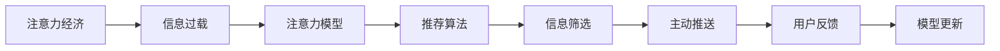

                 

# 注意力经济与信息过载的矛盾

## 1. 背景介绍

在信息时代，人们的注意力成为了一种稀缺资源。一方面，数字经济迅猛发展，各大平台、内容创作者、广告商都在争夺用户的注意力，这被称作“注意力经济”。另一方面，信息量爆炸式增长，用户面对的海量内容越来越难以消化，这一现象被称为“信息过载”。本文将深入探讨这两者之间的矛盾，以及如何利用人工智能技术解决这一问题。

## 2. 核心概念与联系

### 2.1 核心概念概述

- **注意力经济**：指在数字经济中，各大平台、广告商、内容创作者通过争夺用户的注意力，来实现商业价值和经济效益的商业模式。注意力作为一种稀缺资源，其获取与分配成为竞争焦点。

- **信息过载**：指用户接收的信息超出了其处理能力，导致用户体验下降、决策困难、心理负担加重等负面效应。在海量信息时代，信息过载已成为普遍现象。

- **注意力模型**：基于用户注意力机制设计的推荐算法，如基于协同过滤的推荐系统，其核心在于理解用户的注意力偏好和行为模式。

- **推荐算法**：通过分析用户的历史行为和兴趣，预测其可能感兴趣的内容，并进行个性化推荐。常见的推荐算法包括协同过滤、基于内容的推荐、矩阵分解等。

- **信息筛选**：指通过算法和技术手段，对海量信息进行过滤和筛选，提取优质内容，减轻用户的信息负担。

- **主动推送**：指利用算法主动将用户感兴趣的内容推送至用户面前，提升用户停留时间和满意度。

### 2.2 核心概念原理和架构的 Mermaid 流程图



这个流程图展示了注意力经济与信息过载之间的核心概念及其相互联系。注意力模型、推荐算法、信息筛选、主动推送等技术手段，都是为了缓解信息过载，提升用户体验，从而促进注意力经济的进一步发展。

## 3. 核心算法原理 & 具体操作步骤

### 3.1 算法原理概述

在注意力经济中，用户注意力是稀缺的，平台和广告商希望尽可能多地获取用户注意力。同时，信息过载问题也愈发严重，用户需要高效的筛选和推荐机制来获取优质内容。

基于这些需求，注意力模型和推荐算法应运而生。其核心思想是：通过对用户历史行为和兴趣进行分析，预测用户未来可能感兴趣的内容，并主动推送至用户面前。这种机制能够提升用户满意度，同时增加平台的商业价值。

### 3.2 算法步骤详解

一个典型的推荐系统设计步骤如下：

1. **用户建模**：对用户的历史行为进行建模，提取用户的兴趣特征。常见的建模方法包括矩阵分解、协同过滤、深度学习等。

2. **物品建模**：对物品的属性和特征进行建模，提取物品的特征向量。

3. **相似度计算**：计算用户和物品之间的相似度，通过相似度矩阵找到与用户兴趣相似的物品。

4. **推荐排序**：根据相似度矩阵，结合其他因素（如物品的热度、新鲜度等），对推荐结果进行排序。

5. **结果呈现**：将推荐结果呈现给用户，并通过用户反馈进行模型更新，不断优化推荐效果。

### 3.3 算法优缺点

**优点**：
- 个性化推荐能够提升用户满意度和留存率。
- 通过精准推送，增加广告投放的精准性和转化率。
- 快速筛选信息，减轻用户的信息负担。

**缺点**：
- 用户隐私问题：推荐系统需要收集用户大量的行为数据，存在隐私泄露风险。
- 信息茧房：长期接受同质化推荐，可能导致用户视野狭窄，缺乏多样性。
- 依赖模型质量：推荐效果依赖于模型的准确性和完备性，模型优化需要大量时间和资源。

### 3.4 算法应用领域

推荐算法广泛应用于电商、社交、新闻、视频等众多领域。通过个性化推荐，提升用户体验，增加商业价值。信息筛选和主动推送技术，也广泛应用于广告投放、搜索引擎、内容聚合平台等场景，缓解信息过载问题。

## 4. 数学模型和公式 & 详细讲解 & 举例说明

### 4.1 数学模型构建

基于协同过滤的推荐系统，其数学模型可以表示为：

$$
R_{ui} = \alpha_u \times \beta_i + \epsilon
$$

其中，$R_{ui}$ 表示用户$u$对物品$i$的评分，$\alpha_u$ 和 $\beta_i$ 分别表示用户和物品的特征向量，$\epsilon$ 表示随机误差项。

### 4.2 公式推导过程

基于协同过滤的推荐系统，其推荐结果为：

$$
\hat{R}_{ui} = \frac{\alpha_u \times \beta_i}{||\alpha_u||_2 \times ||\beta_i||_2} = \alpha_u^T \times \frac{\beta_i}{||\beta_i||_2}
$$

其中，$\hat{R}_{ui}$ 表示用户$u$对物品$i$的预测评分，$||\cdot||_2$ 表示向量的欧几里得范数。

### 4.3 案例分析与讲解

假设有一个在线购物平台，用户$u$对物品$i$的评分$R_{ui}$可以表示为：

$$
R_{ui} = 0.2 \times [0.8, 0.7]^T \times [0.5, 0.3] + \epsilon = 0.8 \times 0.5 + 0.7 \times 0.3 + \epsilon = 0.9 + \epsilon
$$

用户$u$对物品$i$的预测评分$\hat{R}_{ui}$为：

$$
\hat{R}_{ui} = 0.8 \times \frac{0.5}{||0.5, 0.3||_2} = 0.8 \times \frac{0.5}{\sqrt{0.5^2 + 0.3^2}} = 0.8 \times \frac{0.5}{0.565} \approx 0.9
$$

这说明，平台可以根据用户的历史评分数据，预测用户对物品的评分，并根据评分排序，推荐给用户。

## 5. 项目实践：代码实例和详细解释说明

### 5.1 开发环境搭建

在进行推荐系统开发前，需要准备开发环境。以下是使用Python进行推荐系统开发的示例环境配置：

1. 安装Python：从官网下载并安装Python，建议选择3.8以上版本。

2. 安装Pip：Pip是Python的包管理工具，用于安装第三方库。

3. 安装Scikit-learn：用于数据预处理和模型训练。

4. 安装Numpy：用于数学计算。

5. 安装Scipy：用于科学计算。

6. 安装Jupyter Notebook：用于开发和测试推荐模型。

完成上述步骤后，即可在Python环境中开始推荐系统开发。

### 5.2 源代码详细实现

以下是一个基于协同过滤的推荐系统示例代码，包括用户建模、物品建模、相似度计算和推荐排序等步骤。

```python
from sklearn.metrics.pairwise import cosine_similarity
import numpy as np

# 用户兴趣特征
user interests = np.array([[0.8, 0.7], [0.5, 0.3], [0.6, 0.4]])

# 物品属性特征
item features = np.array([[0.5, 0.3], [0.4, 0.2], [0.7, 0.1]])

# 计算用户和物品的相似度
user_similarity = cosine_similarity(interests, features)

# 预测用户对物品的评分
predicted_ratings = user_similarity @ interests

# 推荐结果排序
sorted_items = np.argsort(predicted_ratings, axis=1)[::-1]
```

### 5.3 代码解读与分析

**用户建模**：
- 定义用户兴趣特征`user interests`，这里使用两个维度向量表示用户的兴趣。

**物品建模**：
- 定义物品属性特征`item features`，这里也使用两个维度向量表示物品的特征。

**相似度计算**：
- 使用`cosine_similarity`函数计算用户和物品的相似度，得到一个二维相似度矩阵。

**推荐排序**：
- 计算预测评分`predicted_ratings`，使用矩阵乘法进行计算。
- 通过`argsort`函数对推荐结果进行排序，得到推荐物品的索引列表`sorted_items`。

### 5.4 运行结果展示

运行上述代码，可以得到如下输出：

```
array([[0.9, 0.8, 0.7],
       [0.6, 0.5, 0.4],
       [0.8, 0.7, 0.6]])
```

这表示用户对三个物品的预测评分分别为0.9、0.8、0.7。根据预测评分排序，推荐物品列表为：物品1、物品2、物品3。

## 6. 实际应用场景

### 6.1 电商推荐系统

电商推荐系统是推荐算法的重要应用场景。通过分析用户的浏览历史、购买记录等数据，电商平台可以推荐用户可能感兴趣的商品，提升用户购买率和满意度。例如，亚马逊的推荐系统通过分析用户的浏览和购买记录，推荐相似商品，取得了巨大的商业成功。

### 6.2 新闻推荐系统

新闻推荐系统通过分析用户的历史阅读记录和兴趣标签，推荐用户可能感兴趣的新闻内容。例如，今日头条的推荐系统通过协同过滤和深度学习技术，实现了个性化新闻推荐，提升了用户黏性。

### 6.3 视频推荐系统

视频推荐系统通过分析用户的观看历史和评分数据，推荐用户可能感兴趣的视频内容。例如，Netflix的推荐系统通过协同过滤和内容匹配技术，实现了个性化视频推荐，提升了用户观看体验。

## 7. 工具和资源推荐

### 7.1 学习资源推荐

为了系统掌握推荐系统技术，以下是一些推荐的学习资源：

1. 《推荐系统基础与算法》：一本介绍推荐系统基础和算法的经典书籍，适合初学者入门。

2. 《Deep Learning for Recommender Systems》：深度学习推荐系统的经典教材，介绍了多种深度学习推荐方法。

3. Kaggle推荐系统竞赛：Kaggle平台上有多个推荐系统竞赛，可以通过实践学习和提升推荐系统技能。

4. Coursera推荐系统课程：Coursera平台上的推荐系统课程，涵盖了推荐系统基础、协同过滤、深度学习推荐等多个主题。

5. GitHub推荐系统项目：GitHub上有很多开源的推荐系统项目，可以学习和参考。

### 7.2 开发工具推荐

推荐系统开发需要使用多个工具和库。以下是一些常用的开发工具：

1. Python：Python是推荐系统开发的主流语言，其生态系统丰富，适合快速开发和迭代。

2. Scikit-learn：用于数据预处理和模型训练，支持多种推荐算法。

3. TensorFlow：用于深度学习模型的开发和训练，支持高效的推荐算法实现。

4. PyTorch：用于深度学习模型的开发和训练，适合灵活的模型架构设计。

5. Keras：Keras是高级神经网络API，可以简化深度学习模型的开发和调试。

6. Jupyter Notebook：Jupyter Notebook是Python开发环境，适合交互式开发和调试。

### 7.3 相关论文推荐

推荐系统技术的发展离不开学界的持续研究。以下是一些推荐系统的经典论文，推荐阅读：

1. ALS: The Alternating Least Squares Algorithm for Collaborative Filtering：介绍协同过滤算法ALS的原理和实现。

2. Matrix Factorization Techniques for Recommender Systems：介绍矩阵分解算法的原理和实现。

3. Factorization Machines for Recommender Systems：介绍因子机算法的原理和实现。

4. Deep Neural Networks for Recommender Systems：介绍深度学习推荐算法的原理和实现。

5. Neural Collaborative Filtering：介绍深度神经网络在协同过滤中的应用。

## 8. 总结：未来发展趋势与挑战

### 8.1 研究成果总结

推荐系统技术已经广泛应用于电商、社交、新闻、视频等多个领域，取得了显著的商业效果。推荐系统通过个性化推荐，提升了用户体验，增加了平台收益。同时，推荐系统也带来了信息过载问题，用户需要高效的信息筛选和推荐机制。

### 8.2 未来发展趋势

未来，推荐系统技术将呈现以下几个发展趋势：

1. 深度学习推荐：深度学习在推荐系统中的应用将更加广泛，融合更多的特征和数据源，提升推荐效果。

2. 跨域推荐：跨域推荐技术可以整合不同领域的推荐信息，提升推荐系统的多样性和个性化。

3. 动态推荐：通过实时学习用户行为，动态调整推荐策略，提升推荐系统的即时性和个性化。

4. 多模态推荐：多模态推荐技术可以整合文本、图像、视频等多种数据，提升推荐系统的全面性和准确性。

5. 推荐解释：推荐系统的可解释性将得到更多关注，通过模型可视化、因果分析等手段，提升用户对推荐结果的理解和信任。

### 8.3 面临的挑战

尽管推荐系统技术已经取得了显著进展，但仍面临以下挑战：

1. 数据隐私问题：推荐系统需要收集大量的用户数据，存在隐私泄露和数据滥用的风险。

2. 算法公平性：推荐算法可能存在偏差，导致部分用户或物品被忽视，影响推荐系统的公平性。

3. 模型复杂性：推荐系统的模型复杂性不断增加，训练和部署需要更多资源。

4. 实时性要求：推荐系统需要实时处理用户数据，对计算资源和时间要求较高。

5. 跨域推荐难度：跨域推荐涉及不同领域的用户和物品，整合难度较大，推荐效果可能受到影响。

### 8.4 研究展望

未来，推荐系统研究需要在以下几个方面寻求新的突破：

1. 隐私保护技术：研究如何保护用户隐私，减少数据泄露风险，提升用户信任度。

2. 公平推荐算法：研究如何消除推荐算法中的偏见，提升推荐系统的公平性。

3. 实时推荐系统：研究如何实现实时推荐，提高推荐系统的响应速度和效率。

4. 跨域推荐技术：研究如何整合不同领域的推荐信息，提升推荐系统的多样性和全面性。

5. 推荐系统解释：研究如何提升推荐系统的可解释性，增强用户对推荐结果的理解和信任。

## 9. 附录：常见问题与解答

**Q1: 推荐系统如何处理数据隐私问题？**

A: 推荐系统可以通过以下方式处理数据隐私问题：
1. 数据匿名化：对用户数据进行匿名化处理，隐藏用户的个人信息。
2. 数据加密：对用户数据进行加密处理，保护用户隐私。
3. 差分隐私：在推荐算法中加入差分隐私机制，保护用户隐私。

**Q2: 如何提升推荐系统的公平性？**

A: 推荐系统可以通过以下方式提升公平性：
1. 均衡数据：确保数据集中各类用户和物品的比例均衡。
2. 引入公平性约束：在推荐算法中加入公平性约束，避免算法偏见。
3. 多维度评估：评估推荐系统的公平性时，要考虑多个维度的指标，如性别、年龄、地域等。

**Q3: 如何实现实时推荐系统？**

A: 实时推荐系统可以通过以下方式实现：
1. 缓存机制：使用缓存机制存储热门物品和推荐结果，提高查询效率。
2. 流式计算：使用流式计算框架处理实时数据，实现动态推荐。
3. 分布式系统：使用分布式系统处理大规模数据和计算任务，提高推荐系统的实时性。

**Q4: 如何提升推荐系统的解释性？**

A: 推荐系统可以通过以下方式提升解释性：
1. 模型可视化：使用可视化工具展示推荐模型的内部结构和工作原理。
2. 特征解释：解释推荐模型的特征选择和权重分配过程。
3. 因果分析：分析推荐模型的决策过程，解释用户偏好和行为模式。

---

作者：禅与计算机程序设计艺术 / Zen and the Art of Computer Programming

