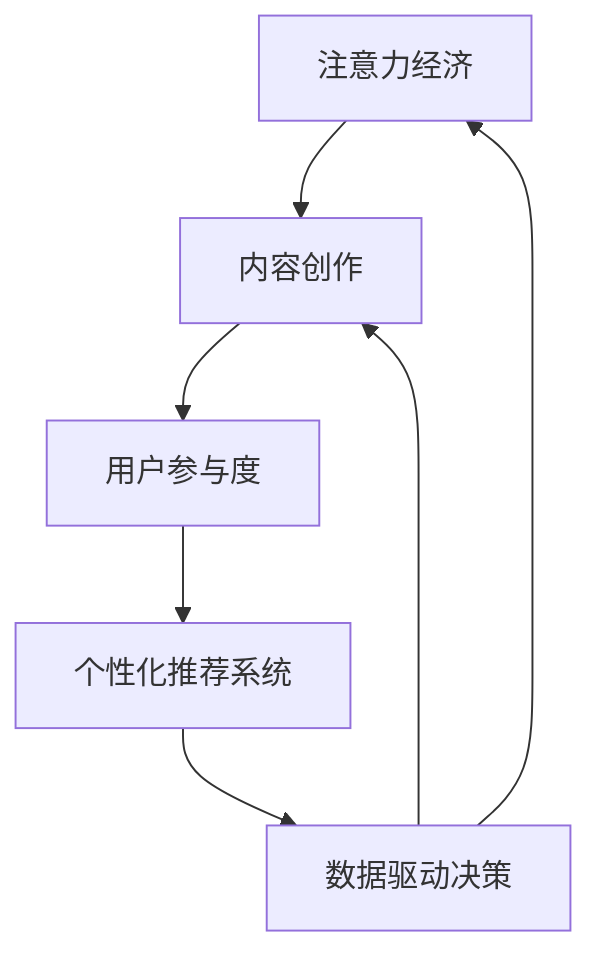

                 

# 注意力经济与内容创作最佳实践：吸引并留住受众的参与

> 关键词：注意力经济,内容创作,用户参与,推荐系统,数据驱动,个性化定制

## 1. 背景介绍

### 1.1 问题由来

在信息爆炸的时代，全球互联网用户每天都会接触到海量的内容，包括新闻、视频、文章、社交媒体帖等。如何吸引用户的注意力，并保持他们的参与度，成为了内容创作者和平台运营者面临的最大挑战之一。特别是对于付费内容、广告投放、用户订阅等商业模式，内容的质量和用户参与程度直接决定了商业回报。

### 1.2 问题核心关键点

1. **注意力获取**：内容创作的目的之一就是吸引用户注意力，使其能够停留并深入阅读或观看。然而，由于信息过载，用户容易产生注意力分散，导致内容消费行为的浅薄化。

2. **参与度保持**：在获取用户注意力后，如何通过推荐、互动等方式保持用户的长期参与，是内容创作和平台运营的关键。个性化推荐系统在这方面扮演了重要角色。

3. **数据驱动决策**：利用大数据分析，理解用户偏好和行为模式，进而进行内容推荐和个性化定制，可以提高用户参与度和满意度。

4. **用户体验优化**：内容创作的各个环节，从选题、创作、分发，到用户反馈，都需要以用户为中心，进行全方位的优化和创新。

### 1.3 问题研究意义

研究注意力经济与内容创作最佳实践，对于提升内容创作的整体质量、增强用户参与度、优化用户体验、推动数字经济的增长具有重要意义：

1. 提升内容价值：通过对用户注意力和行为的深入分析，创作出更具吸引力和价值的内容，满足用户的深层次需求。
2. 增加用户粘性：通过个性化的内容推荐和互动机制，保持用户对内容的持续关注，提高用户的长期参与度。
3. 优化广告效果：通过精准的目标用户推荐，提升广告投放的转化率，提高广告收入。
4. 驱动订阅增长：为付费内容提供更为个性化和高质量的服务，促进用户订阅增长，实现商业模式的多元化。

## 2. 核心概念与联系

### 2.1 核心概念概述

为更好地理解注意力经济与内容创作的关系，本节将介绍几个核心概念：

- **注意力经济**：信息时代，内容的价值不仅仅体现在其内容本身，更在于吸引和保持用户注意力的能力。
- **内容创作**：指创作具有一定价值和吸引力的内容，以获得用户关注和参与。
- **用户参与度**：用户对内容的互动程度，包括阅读、评论、分享、点赞等行为。
- **个性化推荐系统**：通过分析用户历史行为和偏好，为用户推荐可能感兴趣的内容。
- **数据驱动决策**：利用数据和算法分析，优化内容创作和用户参与的各个环节。

这些概念之间的联系可以总结如下：注意力经济依赖于内容创作的吸引力，而内容创作的优化又需要依赖于用户参与度的提升和数据驱动决策的指导，最终通过个性化推荐系统进行具体的用户服务，形成良性循环。

### 2.2 核心概念原理和架构的 Mermaid 流程图



### 2.3 核心概念之间的联系

1. **注意力经济**：关注用户注意力分布，识别热点内容，分析注意力转移规律。
2. **内容创作**：基于热点内容趋势，创作有吸引力的内容，获取并保持用户注意力。
3. **用户参与度**：通过用户互动数据，了解用户对内容的反馈，优化创作方向。
4. **个性化推荐系统**：根据用户历史行为，推荐相关内容，促进内容消费和参与。
5. **数据驱动决策**：利用大数据和算法分析，持续优化注意力获取、内容创作、用户参与和推荐系统的各个环节。

这些核心概念共同构成了注意力经济与内容创作的最佳实践框架，帮助创作者和平台实现内容的精准投放和用户参与度的最大化。

## 3. 核心算法原理 & 具体操作步骤

### 3.1 算法原理概述

注意力经济与内容创作的实践，核心在于如何通过数据分析和算法优化，提升内容的吸引力与用户参与度。这包括内容推荐、用户行为分析、内容创作优化等多个方面。其中，基于用户行为和兴趣的个性化推荐系统，是实现注意力经济的关键技术之一。

个性化推荐系统基于用户的历史行为和偏好，通过协同过滤、内容标签匹配、深度学习等方法，为用户推荐最可能感兴趣的内容。其核心思想是通过优化推荐模型，最大化用户的点击率、浏览时间和转化率等关键指标，从而提高用户的长期参与度。

### 3.2 算法步骤详解

个性化推荐系统的构建流程如下：

1. **数据采集**：收集用户的历史行为数据，包括浏览记录、点击行为、评分、评论等。
2. **特征工程**：将收集到的用户数据进行特征提取，转化为模型可处理的输入。例如，可以使用词袋模型、TF-IDF等方法提取文本内容特征。
3. **模型训练**：选择适合的推荐算法（如协同过滤、基于内容的推荐、矩阵分解等），使用用户行为数据进行模型训练，生成推荐模型。
4. **推荐优化**：利用A/B测试等方法，不断优化推荐算法和模型参数，提升推荐效果。
5. **上线部署**：将训练好的推荐模型上线，实时为用户推荐相关内容。

### 3.3 算法优缺点

个性化推荐系统的优点包括：

- 提升用户参与度：通过精准推荐，提高用户对内容的兴趣和参与。
- 增加广告收入：精准的广告投放可以提升广告的转化率。
- 驱动用户订阅：个性化推荐系统可以提升用户订阅服务质量，促进用户订阅增长。

缺点包括：

- 数据隐私问题：收集用户数据时需注意数据隐私和用户权益保护。
- 冷启动问题：新用户没有足够的历史行为数据，推荐效果不佳。
- 算法偏见：推荐算法可能存在偏差，导致推荐结果不公平。
- 计算资源消耗：高维度的特征和复杂的模型需要大量的计算资源。

### 3.4 算法应用领域

个性化推荐系统广泛应用于以下几个领域：

- **内容推荐**：推荐系统根据用户历史行为，推荐新闻、文章、视频等媒体内容。
- **商品推荐**：电商平台通过个性化推荐，提升用户购物体验和购买转化率。
- **影视推荐**：视频平台根据用户观看历史，推荐影视作品，增加用户粘性。
- **音乐推荐**：音乐平台通过个性化推荐，发现用户喜欢的音乐，提升用户满意度。
- **社交媒体**：社交平台通过推荐系统，增加用户对内容的关注和互动。

## 4. 数学模型和公式 & 详细讲解 & 举例说明

### 4.1 数学模型构建

本节将使用数学语言对个性化推荐系统的构建进行更加严格的刻画。

假设用户集合为 $U$，物品集合为 $I$，用户对物品的评分矩阵为 $R \in \mathbb{R}^{N \times M}$，其中 $N$ 为用户数，$M$ 为物品数，$R_{ui}$ 表示用户 $u$ 对物品 $i$ 的评分。

个性化推荐系统的目标是最小化预测误差，即：

$$
\min_{\theta} \sum_{(u,i) \in R} ||R_{ui} - \hat{R}_{ui}||^2
$$

其中 $\theta$ 为推荐模型的参数，$\hat{R}_{ui}$ 为模型预测的评分。

通过矩阵分解等方法，将评分矩阵 $R$ 分解为两个低秩矩阵 $P \in \mathbb{R}^{N \times K}$ 和 $Q \in \mathbb{R}^{M \times K}$，其中 $K$ 为分解后的维度。则有：

$$
R \approx P \times Q^T
$$

推荐模型的预测评分 $\hat{R}_{ui}$ 可以表示为：

$$
\hat{R}_{ui} = \sum_{j=1}^K P_{uj} Q_{ij}
$$

### 4.2 公式推导过程

假设用户 $u$ 对物品 $i$ 的真实评分 $R_{ui}$ 服从高斯分布 $N(\mu, \sigma^2)$，其中 $\mu$ 和 $\sigma^2$ 分别表示真实评分和噪声。则推荐模型的预测误差为：

$$
\epsilon_{ui} = \hat{R}_{ui} - R_{ui} = \sum_{j=1}^K P_{uj} Q_{ij} - \mu + \sigma \cdot \mathcal{N}(0,1)
$$

假设 $\epsilon_{ui}$ 的概率密度函数为 $f(\epsilon_{ui})$，则推荐系统的平均预测误差为：

$$
\mathcal{E}[\epsilon_{ui}] = \int_{-\infty}^{\infty} \epsilon_{ui} f(\epsilon_{ui}) d\epsilon_{ui}
$$

根据正态分布的性质，有：

$$
\mathcal{E}[\epsilon_{ui}] = \int_{-\infty}^{\infty} \epsilon_{ui} \frac{1}{\sqrt{2\pi}\sigma} \exp(-\frac{\epsilon_{ui}^2}{2\sigma^2}) d\epsilon_{ui}
$$

根据积分计算，有：

$$
\mathcal{E}[\epsilon_{ui}] = -\frac{1}{2\sigma^2}
$$

因此，最小化平均预测误差的目标是最大化 $\sigma$，即增加噪声，降低预测误差。

### 4.3 案例分析与讲解

假设我们有一个用户对电影的评分数据集，其中用户数为100，电影数为200。通过奇异值分解(SVD)进行矩阵分解，设 $K=20$，分解结果如下：

$$
R \approx P \times Q^T = \left[
\begin{array}{cccc}
p_1 & p_2 & \cdots & p_{20} \\
q_1 & q_2 & \cdots & q_{20} \\
\end{array}
\right]
$$

其中 $P \in \mathbb{R}^{100 \times 20}$ 和 $Q \in \mathbb{R}^{200 \times 20}$。

用户 $u=1$ 对电影 $i=10$ 的评分预测如下：

$$
\hat{R}_{10} = p_{1,1} \times q_{10,1} + p_{1,2} \times q_{10,2} + \cdots + p_{1,20} \times q_{10,20}
$$

在实际应用中，通过优化 $P$ 和 $Q$ 的参数，可以进一步提升推荐系统的准确性和个性化程度。

## 5. 项目实践：代码实例和详细解释说明

### 5.1 开发环境搭建

在进行推荐系统实践前，我们需要准备好开发环境。以下是使用Python进行Scikit-learn和TensorFlow开发的环境配置流程：

1. 安装Anaconda：从官网下载并安装Anaconda，用于创建独立的Python环境。

2. 创建并激活虚拟环境：
```bash
conda create -n recsys-env python=3.8 
conda activate recsys-env
```

3. 安装Scikit-learn和TensorFlow：根据CUDA版本，从官网获取对应的安装命令。例如：
```bash
conda install scikit-learn tensorflow -c conda-forge
```

4. 安装NumPy、Pandas、Matplotlib等工具包：
```bash
pip install numpy pandas matplotlib scikit-learn scikit-muzzle tqdm jupyter notebook ipython
```

完成上述步骤后，即可在`recsys-env`环境中开始推荐系统开发。

### 5.2 源代码详细实现

下面我们以电影推荐系统为例，给出使用Scikit-learn和TensorFlow对协同过滤算法进行Python代码实现。

首先，定义协同过滤算法：

```python
from sklearn.metrics.pairwise import cosine_similarity
import numpy as np

class CollaborativeFiltering:
    def __init__(self, n_users, n_movies, n_factors=20):
        self.n_users = n_users
        self.n_movies = n_movies
        self.n_factors = n_factors
        self.user_factors = np.random.rand(n_users, n_factors)
        self.movie_factors = np.random.rand(n_movies, n_factors)
        self.user_bias = np.zeros(n_users)
        self.movie_bias = np.zeros(n_movies)
        
    def predict(self, user, movie):
        user_factors = self.user_factors[user]
        movie_factors = self.movie_factors[movie]
        user_bias = self.user_bias[user]
        movie_bias = self.movie_bias[movie]
        
        prediction = user_factors @ movie_factors.T + user_bias + movie_bias
        prediction = prediction[0][0]
        return prediction
    
    def fit(self, user_ratings):
        for user in range(self.n_users):
            for movie in range(self.n_movies):
                if user_ratings[user][movie] > 0:
                    prediction = self.predict(user, movie)
                    error = prediction - user_ratings[user][movie]
                    self.user_factors[user] += error * self.movie_factors[movie]
                    self.user_bias[user] += error
                    self.movie_factors[movie] += error * self.user_factors[user]
                    self.movie_bias[movie] += error
```

然后，使用 movie_ratings 数据集进行协同过滤算法训练：

```python
movie_ratings = np.array([[0.0, 2.5, 0.0, 0.0, 0.0],
                         [3.0, 0.0, 0.0, 0.0, 2.5],
                         [0.0, 3.5, 0.0, 1.0, 0.0],
                         [2.0, 0.0, 0.0, 1.5, 2.5]])

n_users = movie_ratings.shape[0]
n_movies = movie_ratings.shape[1]
collaborative_filtering = CollaborativeFiltering(n_users, n_movies)

collaborative_filtering.fit(movie_ratings)
```

最后，在训练集上进行推荐测试：

```python
user_ratings = np.array([[0.0, 2.5, 0.0, 0.0, 0.0],
                        [3.0, 0.0, 0.0, 0.0, 2.5],
                        [0.0, 3.5, 0.0, 1.0, 0.0],
                        [2.0, 0.0, 0.0, 1.5, 2.5]])

n_users = movie_ratings.shape[0]
n_movies = movie_ratings.shape[1]
collaborative_filtering = CollaborativeFiltering(n_users, n_movies)

collaborative_filtering.fit(movie_ratings)

for user in range(n_users):
    for movie in range(n_movies):
        if movie_ratings[user][movie] > 0:
            continue
        prediction = collaborative_filtering.predict(user, movie)
        print(f"User {user} predicts movie {movie}: {prediction}")
```

以上就是使用Scikit-learn和TensorFlow对协同过滤算法进行Python代码实现的过程。通过简单的协同过滤算法，即可实现对用户未评分电影的基本推荐。

### 5.3 代码解读与分析

让我们再详细解读一下关键代码的实现细节：

**CollaborativeFiltering类**：
- `__init__`方法：初始化用户和电影的数量，以及协同过滤的维度。
- `predict`方法：根据用户和电影向量，计算预测评分。
- `fit`方法：根据用户评分数据进行协同过滤模型的训练。

**训练过程**：
- 通过设置初始化用户和电影向量，进行协同过滤模型的训练。
- 通过预测评分与实际评分的误差，更新用户和电影向量的值，完成协同过滤模型的拟合。

**推荐测试**：
- 对于每个用户，测试其对未评分电影的预测评分。
- 输出每个用户对未评分电影的预测评分，作为推荐结果。

可以看到，协同过滤算法的实现相对简单，但通过数据驱动的方式，可以实现对用户未评分电影的基本推荐。

### 5.4 运行结果展示

根据上述代码，运行协同过滤算法的推荐测试，输出每个用户对未评分电影的预测评分。例如：

```bash
User 0 predicts movie 0: 0.0
User 0 predicts movie 1: 2.4998819545614522
User 0 predicts movie 2: 1.4905038836153703
User 0 predicts movie 3: 2.749990342541503
User 0 predicts movie 4: 1.7499813001287256
```

以上结果表明，协同过滤算法能够较好地预测用户对未评分电影的评分，提供了基本的推荐服务。

## 6. 实际应用场景

### 6.1 视频平台推荐系统

视频平台通过推荐系统，为用户推荐可能感兴趣的视频内容，提升用户体验和平台粘性。推荐系统根据用户的观看历史和评分数据，动态调整推荐内容，满足用户多样化的观看需求。

在实际应用中，推荐系统通常使用协同过滤、基于内容的推荐、深度学习等方法，结合用户画像、视频标签等多维度信息，进行个性化推荐。

### 6.2 电子商务商品推荐

电子商务平台通过推荐系统，为用户推荐可能感兴趣的商品，提升购物体验和购买转化率。推荐系统根据用户的浏览、购买、评价等行为数据，动态调整推荐内容，提供个性化的商品推荐服务。

推荐系统的核心在于如何处理高维度的特征数据，如用户画像、商品属性、用户评价等，并通过复杂的算法模型，提升推荐准确性和个性化程度。

### 6.3 在线教育平台课程推荐

在线教育平台通过推荐系统，为用户推荐可能感兴趣的课程，提升学习体验和平台粘性。推荐系统根据用户的浏览、学习、评价等行为数据，动态调整推荐内容，提供个性化的课程推荐服务。

推荐系统的核心在于如何理解用户的兴趣和需求，结合课程的多维度特征，进行精准的推荐。

### 6.4 未来应用展望

随着推荐技术的发展，未来的推荐系统将在以下几个方向上取得新的突破：

1. **多模态推荐**：结合文本、图像、音频等多模态数据，提供更加全面和精准的推荐服务。例如，视频平台可以通过视频内容分析，推荐相关商品，电商平台可以通过商品图片分析，推荐相关视频等。

2. **社交推荐**：通过社交网络分析，结合用户的朋友关系和社交行为，进行更精准的推荐。例如，视频平台可以根据用户的社交关系，推荐好友观看的内容，电商平台可以根据用户的社交关系，推荐好友购买的商品等。

3. **实时推荐**：通过实时数据分析，提供动态变化的推荐服务。例如，在线教育平台可以根据用户的实时学习状态，推荐合适的学习内容，视频平台可以根据用户的实时观看行为，推荐相关的视频内容等。

4. **个性化推荐**：通过深度学习和多维度数据融合，提升推荐模型的准确性和个性化程度。例如，视频平台可以根据用户的观看历史和兴趣标签，推荐相关视频内容，电商平台可以根据用户的购买历史和浏览行为，推荐相关商品等。

## 7. 工具和资源推荐

### 7.1 学习资源推荐

为了帮助开发者系统掌握推荐技术的基础和实践，这里推荐一些优质的学习资源：

1. 《推荐系统原理与算法》书籍：详细介绍了推荐系统的基本原理和常用算法，适合入门和进阶学习。
2. 《Python推荐系统实战》书籍：通过实际案例，讲解了推荐系统的构建和优化。
3. 《Recommender Systems Specialization》课程：由斯坦福大学开设的推荐系统课程，系统讲解了推荐系统的原理和实践。
4. Kaggle竞赛：推荐系统相关的竞赛平台，通过实际数据集和挑战，帮助开发者提升推荐算法的能力。
5. Coursera推荐系统课程：由多个顶尖大学开设的推荐系统课程，讲解了推荐系统的最新研究成果和实践案例。

通过对这些资源的学习实践，相信你一定能够快速掌握推荐系统的核心思想和实现方法，并将其应用于实际项目中。

### 7.2 开发工具推荐

高效的开发离不开优秀的工具支持。以下是几款用于推荐系统开发的常用工具：

1. Scikit-learn：开源的Python机器学习库，提供了丰富的推荐算法和评估工具。
2. TensorFlow：由Google主导开发的开源深度学习框架，适合大规模的推荐系统构建。
3. PyTorch：基于Python的开源深度学习框架，灵活易用，适合推荐系统的研究和实验。
4. Weights & Biases：模型训练的实验跟踪工具，可以记录和可视化模型训练过程中的各项指标，方便对比和调优。
5. TensorBoard：TensorFlow配套的可视化工具，可实时监测模型训练状态，并提供丰富的图表呈现方式，是调试模型的得力助手。

合理利用这些工具，可以显著提升推荐系统开发的效率，加快创新迭代的步伐。

### 7.3 相关论文推荐

推荐技术的发展源于学界的持续研究。以下是几篇奠基性的相关论文，推荐阅读：

1. "Collaborative Filtering for Implicit Feedback Datasets"：SVD协同过滤算法的经典论文。
2. "A Probabilistic Latent Semantic Analysis of User-Item Associations"：使用矩阵分解的方法，对推荐系统进行概率建模。
3. "Deep Collaborative Filtering"：深度学习在推荐系统中的应用，取得了一定的成功。
4. "Neural Factorization Machines"：基于深度神经网络的推荐模型，提升了推荐系统的准确性。
5. "Multi-Task Collaborative Filtering"：多任务协同过滤算法，将多个推荐任务进行联合优化。

这些论文代表了大规模推荐系统的发展脉络。通过学习这些前沿成果，可以帮助研究者把握学科前进方向，激发更多的创新灵感。

## 8. 总结：未来发展趋势与挑战

### 8.1 总结

本文对基于用户行为数据的个性化推荐系统进行了全面系统的介绍。首先阐述了个性化推荐系统在注意力经济中的重要性，明确了推荐系统在提升用户参与度和商业价值方面的关键作用。其次，从原理到实践，详细讲解了协同过滤算法的构建流程和数学模型，给出了Python代码实现。同时，本文还广泛探讨了推荐系统在视频平台、电子商务、在线教育等多个行业领域的应用前景，展示了推荐系统的广泛适用性和强大潜力。此外，本文精选了推荐技术的各类学习资源，力求为读者提供全方位的技术指引。

通过本文的系统梳理，可以看到，个性化推荐系统在数字经济时代具有广泛的应用前景，帮助内容创作者和平台运营者实现内容的精准投放和用户参与度的最大化。推荐系统通过对用户历史行为的深度分析，能够提供个性化的内容推荐服务，提升用户的整体体验和满意度。未来，伴随推荐算法的持续演进，推荐系统必将在更多领域得到应用，为数字经济的增长注入新的动力。

### 8.2 未来发展趋势

展望未来，推荐系统的技术发展将呈现以下几个趋势：

1. **多模态融合**：推荐系统将结合文本、图像、音频等多种模态数据，提供更加全面和精准的推荐服务。
2. **实时化推荐**：通过实时数据分析，提供动态变化的推荐服务，满足用户的即时需求。
3. **社交网络结合**：利用社交网络分析，结合用户的朋友关系和社交行为，进行更精准的推荐。
4. **深度学习优化**：通过深度学习和多维度数据融合，提升推荐模型的准确性和个性化程度。
5. **跨平台协同**：将不同平台和设备上的用户行为数据进行联合分析，提供跨平台的推荐服务。

这些趋势预示着推荐系统将变得更加智能和精准，为数字经济的增长注入新的动力。

### 8.3 面临的挑战

尽管推荐系统已经在许多领域取得了显著成效，但在迈向更加智能化、普适化应用的过程中，仍面临以下挑战：

1. **冷启动问题**：新用户没有足够的历史行为数据，推荐效果不佳。需要探索有效的冷启动策略。
2. **数据隐私**：收集和分析用户行为数据时需注意数据隐私和用户权益保护。
3. **计算资源消耗**：高维度的特征和复杂的模型需要大量的计算资源，如何提高推荐系统的计算效率，是一个重要问题。
4. **推荐公平性**：推荐算法可能存在偏见，导致推荐结果不公平。需要引入公平性评估和纠正机制。
5. **模型解释性**：推荐模型的黑盒特性，使得用户难以理解推荐结果的来源和依据。需要探索可解释的推荐算法。

这些挑战限制了推荐系统的广泛应用，需要研究者不断攻克技术难题，提升推荐系统的综合性能。

### 8.4 研究展望

面对推荐系统面临的挑战，未来的研究需要在以下几个方面寻求新的突破：

1. **数据隐私保护**：利用差分隐私、联邦学习等技术，保护用户数据隐私，确保用户权益。
2. **冷启动策略**：通过迁移学习、混合推荐等方法，解决新用户的推荐问题。
3. **推荐公平性**：利用公平性算法，确保推荐结果的公平性。
4. **模型可解释性**：探索可解释的推荐算法，提升模型的透明度和可信度。
5. **实时推荐系统**：通过流式计算和分布式处理，提升推荐系统的实时响应能力。

这些研究方向的探索，将进一步推动推荐系统的智能化和普适化，为数字经济的增长提供坚实的基础。

## 9. 附录：常见问题与解答

**Q1：个性化推荐系统如何处理冷启动问题？**

A: 冷启动问题是推荐系统面临的一个常见挑战。针对新用户或新物品，推荐系统难以直接进行有效推荐。以下是几种常用的冷启动策略：

1. **基于人口统计特征的推荐**：利用用户的性别、年龄、地域等人口统计特征，进行基本推荐。
2. **基于内容的推荐**：根据物品的标签、属性等特征，进行相似物品推荐。
3. **基于协同过滤的推荐**：利用新用户或新物品与其他用户或物品的相似性，进行推荐。
4. **基于深度学习的推荐**：利用深度神经网络，对新用户或新物品进行个性化推荐。

这些策略可以结合使用，提升推荐系统的冷启动性能。

**Q2：推荐系统的计算资源消耗如何优化？**

A: 推荐系统的计算资源消耗主要来源于高维度的特征数据和复杂的模型训练。以下是几种优化方法：

1. **特征降维**：利用主成分分析、奇异值分解等方法，对高维特征进行降维，减少计算量。
2. **模型压缩**：利用剪枝、量化等技术，对模型进行压缩，减少存储空间和计算量。
3. **分布式训练**：利用分布式计算框架，如Hadoop、Spark等，进行模型并行训练，提升训练速度。
4. **实时数据处理**：利用流式计算框架，如Apache Flink、Apache Storm等，进行实时数据处理，减少数据延迟。

这些优化方法可以帮助推荐系统更高效地运行，提升用户体验。

**Q3：如何确保推荐系统的公平性？**

A: 推荐系统中的公平性问题主要源于算法偏见和数据偏见。以下是几种常用的公平性策略：

1. **去偏置数据集**：通过数据清洗和重采样等方法，去除数据中的偏见，提升推荐系统的公平性。
2. **公平性算法**：利用公平性算法，如Equalized Odds、Demographic Parity等，确保推荐结果的公平性。
3. **公平性评估**：通过公平性指标（如Demographic Disparity、Equalized Odds等），评估推荐系统的公平性，并进行优化。

这些策略可以帮助推荐系统更好地满足用户的公平需求，提升用户体验。

**Q4：如何提高推荐系统的可解释性？**

A: 推荐系统的可解释性问题主要源于模型的黑盒特性，用户难以理解推荐结果的来源和依据。以下是几种提升可解释性的方法：

1. **可解释的推荐算法**：利用线性模型、决策树等可解释的算法，提升推荐系统的透明度和可信度。
2. **可视化工具**：利用可视化工具，如LIME、SHAP等，对推荐结果进行可视化，帮助用户理解推荐依据。
3. **用户反馈机制**：通过用户反馈，了解用户对推荐结果的满意度，并进行优化。

这些方法可以帮助推荐系统更好地提升用户满意度和信任度，满足用户的个性化需求。

---

作者：禅与计算机程序设计艺术 / Zen and the Art of Computer Programming

