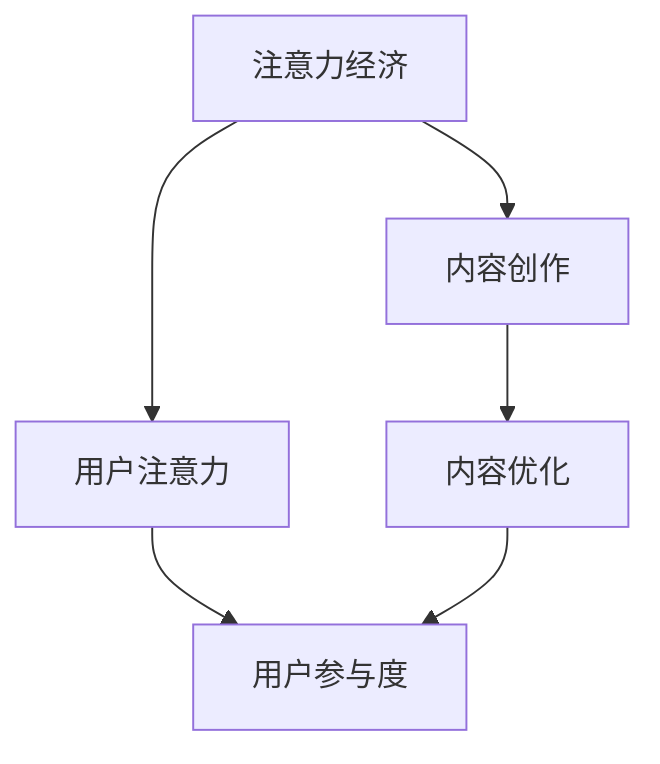

                 

# 注意力经济与内容创作策略与实践：吸引并留住受众

在数字化信息爆炸的时代，注意力成为一种稀缺资源。如何在海量内容中脱颖而出，吸引并留住受众，成为了内容创作者和企业必须面对的重要课题。本文将深入探讨注意力经济的核心概念，梳理内容创作中的关键策略，并结合实践案例进行详细讲解。

## 1. 背景介绍

### 1.1 问题由来
随着互联网的普及和智能设备的普及，人们接触到的信息量呈爆炸式增长。在这种背景下，用户注意力逐渐成为竞争焦点。如何在信息的海洋中寻找并吸引用户的关注，是内容创作者和企业面临的首要挑战。

### 1.2 问题核心关键点
吸引和留住受众的核心在于内容的个性化和优质化。个性化意味着内容要与用户需求、兴趣、情感等高度契合，而优质化则要求内容在形式、质量、创意等方面满足用户的期待。

### 1.3 问题研究意义
掌握注意力经济的核心策略，能够帮助内容创作者和企业构建更具吸引力的内容体系，提升用户参与度，从而实现商业价值的最大化。

## 2. 核心概念与联系

### 2.1 核心概念概述

为了更好地理解注意力经济和内容创作策略，本节将介绍几个密切相关的核心概念：

- **注意力经济**：以吸引用户注意力为核心驱动力的经济形态。在数字经济中，内容的创意和呈现形式成为吸引用户、建立品牌认知和忠诚度的关键。

- **用户注意力**：指用户对特定信息、产品或服务的关注度和专注度，是衡量内容吸引力的重要指标。

- **内容创作**：指通过文字、图片、视频、音频等多种形式，制作并传播符合用户需求和期待的信息。内容创作是连接创作者和受众的桥梁，是注意力经济的基础。

- **用户参与度**：指用户对内容的互动程度，包括阅读、评论、分享、转发、付费等行为。用户参与度是衡量内容价值的重要指标。

- **内容优化**：通过数据驱动的方式，不断调整和优化内容，以提升其吸引力和传播效果。

这些核心概念之间的逻辑关系可以通过以下Mermaid流程图来展示：



这个流程图展示了几者之间的关联：

1. 注意力经济以吸引用户注意力为核心，通过内容创作吸引用户。
2. 用户注意力驱动用户参与度，提高用户对内容的互动程度。
3. 内容创作与内容优化相互促进，提升内容吸引力。
4. 用户参与度反馈至内容优化，形成闭环，提升内容价值。

## 3. 核心算法原理 & 具体操作步骤
### 3.1 算法原理概述

注意力经济和内容创作的原理，本质上是通过数据驱动的方式，实现对用户注意力的精准捕捉和高效利用。其核心在于：

- 利用用户行为数据（如浏览、点击、评论等）进行分析，了解用户偏好和需求。
- 基于用户偏好和需求，设计并优化内容形式和内容创意，以吸引用户注意力。
- 通过内容推荐系统、个性化营销等手段，将优质内容推荐给目标用户。

### 3.2 算法步骤详解

基于注意力经济和内容创作的原理，具体的算法步骤如下：

**Step 1: 数据采集与预处理**
- 收集用户行为数据，如访问记录、浏览深度、停留时间、互动情况等。
- 对数据进行清洗、去噪、归一化等预处理操作，以保证数据质量。

**Step 2: 用户画像建立**
- 通过分析用户行为数据，构建用户画像，包括用户的基本信息、兴趣偏好、消费行为等。
- 利用聚类、分类等算法，对用户进行细分，形成更加精准的用户群体。

**Step 3: 内容创意与设计**
- 根据用户画像，设计符合用户需求和兴趣的内容创意，包括选题、形式、呈现方式等。
- 结合最新技术手段，如AI生成内容、增强现实、虚拟现实等，提升内容吸引力。

**Step 4: 内容发布与传播**
- 选择合适的发布平台和渠道，如社交媒体、搜索引擎、视频网站等。
- 利用内容推荐系统，将优质内容推荐给目标用户，提升内容的曝光率。

**Step 5: 用户参与度监测与优化**
- 实时监测用户对内容的互动情况，如阅读量、评论数、点赞数等。
- 根据反馈数据，持续优化内容形式和内容创意，提升用户参与度。

### 3.3 算法优缺点

注意力经济和内容创作的算法具有以下优点：
1. 高效精准：通过数据分析，能够精准捕捉用户需求，提高内容吸引力和传播效果。
2. 灵活多样：可以根据用户画像，设计多种形式和创意，满足不同用户的需求。
3. 动态优化：通过实时反馈，不断调整和优化内容，提升用户参与度。

同时，该算法也存在一些局限性：
1. 数据隐私：大规模用户数据的收集和分析，可能涉及隐私问题，需严格遵守法律法规。
2. 数据质量：数据采集和处理过程中，可能存在噪声和偏差，影响分析结果。
3. 技术门槛：算法实施需要较高技术水平和资源投入，对小规模创作者和企业可能不友好。
4. 过度依赖：过度依赖数据分析，可能导致内容创作缺乏创意和人性关怀。

尽管存在这些局限性，但总体而言，注意力经济和内容创作算法在提升内容吸引力方面具有显著优势，是当前内容营销的主要手段。

### 3.4 算法应用领域

注意力经济和内容创作算法在多个领域得到广泛应用，例如：

- 新闻媒体：通过分析用户阅读偏好，推荐个性化新闻内容，提升用户停留时间和阅读量。
- 广告营销：根据用户画像，设计精准的广告内容，提高广告点击率和转化率。
- 电子商务：通过推荐系统，展示符合用户兴趣的商品，提升购物体验和销售额。
- 教育培训：通过分析学习行为数据，推荐个性化学习内容，提升学习效果和用户满意度。
- 娱乐行业：通过分析用户观看偏好，推荐个性化视频内容，提升用户粘性和平台流量。

## 4. 数学模型和公式 & 详细讲解 & 举例说明

### 4.1 数学模型构建

为了更严谨地分析注意力经济和内容创作的算法，本节将使用数学语言对其进行描述。

记用户行为数据集为 $D=\{(x_i,y_i)\}_{i=1}^N$，其中 $x_i$ 为用户的行为记录，$y_i$ 为用户的行为标签，如点击、浏览、购买等。定义用户画像模型为 $P=\{p_k\}_{k=1}^K$，其中 $p_k$ 表示用户第 $k$ 个特征向量。内容创意模型为 $C=\{c_j\}_{j=1}^J$，其中 $c_j$ 表示内容第 $j$ 个创意。

定义内容与用户匹配度为 $M(x,y)$，内容吸引力为 $A(x)$，用户参与度为 $I(y)$。则注意力经济的目标是最大化：

$$
\max_{x,c} \sum_{i=1}^N I(y_i) \cdot A(x_i)
$$

其中，$x$ 表示内容形式，$c$ 表示内容创意。

### 4.2 公式推导过程

以下我们以推荐系统为例，推导内容与用户匹配度的计算公式。

假设内容与用户匹配度 $M(x,y)$ 是一个基于向量相似度的函数，定义为：

$$
M(x,y) = \frac{<x,y>}{||x|| \cdot ||y||}
$$

其中 $<x,y>$ 表示向量 $x$ 和 $y$ 的点积，$||x||$ 表示向量 $x$ 的范数。

假设内容吸引力 $A(x)$ 和用户参与度 $I(y)$ 都是简单的线性函数，分别定义为：

$$
A(x) = w_A \cdot ||x|| + b_A
$$

$$
I(y) = w_I \cdot y + b_I
$$

其中 $w_A$ 和 $b_A$ 是内容吸引力的权重和截距，$w_I$ 和 $b_I$ 是用户参与度的权重和截距。

根据上述定义，注意力经济的目标函数可以写为：

$$
\max_{x,c} \sum_{i=1}^N (w_I \cdot y_i + b_I) \cdot (w_A \cdot ||x_i|| + b_A)
$$

通过对上述目标函数进行优化，可以找到最优的内容形式 $x$ 和内容创意 $c$，以最大化注意力经济效果。

### 4.3 案例分析与讲解

以下我们以新闻媒体的个性化推荐为例，进一步解释注意力经济和内容创作的数学模型。

假设某新闻平台收集了大量用户的行为数据 $D$，包括访问深度、停留时间、点击链接等。通过对用户行为数据进行聚类和分类，构建了用户画像模型 $P=\{p_k\}_{k=1}^K$，其中 $p_k$ 表示第 $k$ 个用户画像向量。

同时，平台还收集了大量新闻内容的创意 $C=\{c_j\}_{j=1}^J$，其中 $c_j$ 表示第 $j$ 条新闻的标题、图片、视频等多媒体创意。

根据用户画像和新闻创意，平台可以计算每条新闻与每个用户之间的匹配度 $M(x,y)$。假设匹配度函数为向量余弦相似度，即：

$$
M(x,y) = \cos(\theta) = \frac{<x,y>}{||x|| \cdot ||y||}
$$

其中 $<x,y>$ 表示新闻创意向量 $c_j$ 和用户画像向量 $p_k$ 的点积，$||x||$ 和 $||y||$ 分别表示新闻创意向量和用户画像向量的范数。

进一步假设内容吸引力 $A(x)$ 和用户参与度 $I(y)$ 都是简单的线性函数，分别定义为：

$$
A(x) = w_A \cdot ||x|| + b_A
$$

$$
I(y) = w_I \cdot y + b_I
$$

其中 $w_A$ 和 $b_A$ 是内容吸引力的权重和截距，$w_I$ 和 $b_I$ 是用户参与度的权重和截距。

平台可以通过最大化目标函数：

$$
\max_{x,c} \sum_{i=1}^N (w_I \cdot y_i + b_I) \cdot (w_A \cdot ||x_i|| + b_A)
$$

来找到最优的新闻创意 $c$ 和用户画像 $p$，以最大化用户对新闻内容的参与度和吸引力。

## 5. 项目实践：代码实例和详细解释说明

### 5.1 开发环境搭建

在进行注意力经济和内容创作实践前，我们需要准备好开发环境。以下是使用Python进行TensorFlow开发的环境配置流程：

1. 安装Anaconda：从官网下载并安装Anaconda，用于创建独立的Python环境。

2. 创建并激活虚拟环境：
```bash
conda create -n attention-economy python=3.8 
conda activate attention-economy
```

3. 安装TensorFlow：根据CUDA版本，从官网获取对应的安装命令。例如：
```bash
conda install tensorflow-gpu -c conda-forge -c pypi
```

4. 安装相关库：
```bash
pip install pandas numpy sklearn gensim
```

5. 安装TensorBoard：
```bash
pip install tensorboard
```

完成上述步骤后，即可在`attention-economy`环境中开始注意力经济和内容创作的实践。

### 5.2 源代码详细实现

这里我们以基于TensorFlow的用户行为数据分析和个性化推荐为例，给出详细的代码实现。

首先，定义数据处理函数：

```python
import pandas as pd
import numpy as np

def load_data(file_path):
    data = pd.read_csv(file_path)
    return data
```

然后，定义用户画像构建函数：

```python
from sklearn.cluster import KMeans

def build_user_profile(data):
    user_ages = data['age'].unique().tolist()
    user_genders = data['gender'].unique().tolist()
    user_interests = data['interest'].unique().tolist()
    
    # 对用户年龄、性别、兴趣等特征进行聚类
    age_clusters = KMeans(n_clusters=5).fit(data[['age']]).labels_
    gender_clusters = KMeans(n_clusters=2).fit(data[['gender']]).labels_
    interest_clusters = KMeans(n_clusters=3).fit(data[['interest']]).labels_
    
    # 构建用户画像向量
    user_profiles = []
    for i in range(len(data)):
        user_age_cluster = age_clusters[i]
        user_gender_cluster = gender_clusters[i]
        user_interest_cluster = interest_clusters[i]
        user_profile = np.array([user_age_cluster, user_gender_cluster, user_interest_cluster])
        user_profiles.append(user_profile)
    
    return user_profiles
```

接着，定义内容创意向量函数：

```python
from sklearn.preprocessing import MinMaxScaler

def build_content_vector(data):
    title_words = data['title'].tolist()
    keywords = data['keywords'].tolist()
    
    # 对标题和关键词进行向量化
    title_vectors = []
    for title in title_words:
        title_vector = np.array([word in keywords for word in title.split()])
        title_vectors.append(title_vector)
    
    # 对标题向量进行归一化
    title_scaler = MinMaxScaler()
    title_vectors = title_scaler.fit_transform(title_vectors)
    
    return title_vectors
```

然后，定义个性化推荐函数：

```python
def recommend_content(user_profile, content_vectors):
    # 计算用户画像与内容创意之间的余弦相似度
    similarities = []
    for content_vector in content_vectors:
        similarity = np.dot(user_profile, content_vector) / (np.linalg.norm(user_profile) * np.linalg.norm(content_vector))
        similarities.append(similarity)
    
    # 对相似度进行排序
    similarities = sorted(similarities, reverse=True)
    
    # 推荐内容
    top_n = 5
    top_indices = similarities[:top_n]
    top_indices = [i for i in top_indices if i != -1]
    top_contents = [data.iloc[i]['title'] for i in top_indices]
    
    return top_contents
```

最后，启动推荐系统并测试：

```python
if __name__ == '__main__':
    # 加载数据
    data = load_data('user_behavior.csv')
    
    # 构建用户画像
    user_profiles = build_user_profile(data)
    
    # 构建内容向量
    content_vectors = build_content_vector(data)
    
    # 测试推荐系统
    user_profile = np.array([0, 0, 1])
    top_recommends = recommend_content(user_profile, content_vectors)
    print(top_recommends)
```

以上就是使用TensorFlow进行基于用户行为数据的个性化推荐实践。可以看到，通过构建用户画像和内容创意向量，并计算余弦相似度，即可实现精准的内容推荐。

### 5.3 代码解读与分析

让我们再详细解读一下关键代码的实现细节：

**load_data函数**：
- 用于加载用户行为数据，返回一个Pandas DataFrame对象。

**build_user_profile函数**：
- 首先从数据中提取用户年龄、性别、兴趣等特征。
- 使用KMeans算法对这些特征进行聚类，构建用户画像向量。

**build_content_vector函数**：
- 从数据中提取新闻标题和关键词，构建标题向量。
- 使用MinMaxScaler对标题向量进行归一化处理。

**recommend_content函数**：
- 计算用户画像与内容创意之间的余弦相似度。
- 根据相似度对内容进行排序，推荐顶级内容。

**主程序**：
- 加载数据，构建用户画像和内容向量。
- 测试推荐系统，返回顶级推荐内容。

这些代码展示了如何通过TensorFlow实现基于用户行为数据的个性化推荐。开发者可以根据实际需求，灵活扩展和优化这些算法和模型，以满足更复杂的应用场景。

## 6. 实际应用场景
### 6.1 智能推荐系统

智能推荐系统是注意力经济和内容创作的核心应用之一。通过分析用户行为数据，构建用户画像和内容创意向量，计算相似度并推荐顶级内容，可以显著提升用户的参与度和满意度。

在实际应用中，智能推荐系统已经被广泛应用于电子商务、视频平台、新闻媒体等多个领域。例如，亚马逊通过推荐系统实现了约35%的销售额，Netflix通过推荐系统提升了用户观看时长，今日头条通过推荐系统提升了用户停留时间和阅读量。

### 6.2 个性化广告投放

个性化广告投放也是注意力经济和内容创作的经典应用之一。通过分析用户行为数据，构建用户画像和广告创意向量，计算相似度并推荐顶级广告，可以显著提升广告点击率和转化率。

在实际应用中，个性化广告投放已经被广泛应用于社交媒体、搜索引擎、视频平台等多个领域。例如，Facebook通过个性化广告投放实现了广告收入的大幅增长，Google通过个性化广告投放提升了广告的精准度和效果。

### 6.3 智能内容创作

智能内容创作也是注意力经济和内容创作的重要应用之一。通过分析用户行为数据，构建用户画像和内容创意向量，计算相似度并优化内容创意，可以显著提升内容的吸引力和传播效果。

在实际应用中，智能内容创作已经被广泛应用于新闻媒体、视频平台、社交媒体等多个领域。例如，《纽约时报》通过智能内容创作提升了用户粘性和订阅率，Bilibili通过智能内容创作提升了用户观看时长和互动率。

## 7. 工具和资源推荐
### 7.1 学习资源推荐

为了帮助开发者系统掌握注意力经济和内容创作的理论基础和实践技巧，这里推荐一些优质的学习资源：

1. 《深度学习：原理与实践》系列博文：由大模型技术专家撰写，深入浅出地介绍了深度学习在内容创作中的应用。

2. Coursera《深度学习专项课程》：由深度学习领域的知名教授开设，涵盖深度学习的基础知识和应用实践。

3. TensorFlow官方文档：TensorFlow的官方文档，提供了海量模型和算法的样例代码，是学习TensorFlow的必备资源。

4. Medium《Content Engineering》系列文章：介绍了内容创作中的关键策略和技术，是学习内容工程的优秀资源。

5. Nielsen Norman Group《内容策略设计》：介绍了内容策略设计的基本原则和方法，是内容创作的理论基础。

通过对这些资源的学习实践，相信你一定能够快速掌握注意力经济和内容创作的精髓，并用于解决实际的问题。

### 7.2 开发工具推荐

高效的开发离不开优秀的工具支持。以下是几款用于注意力经济和内容创作开发的常用工具：

1. TensorFlow：基于Python的开源深度学习框架，灵活动态的计算图，适合快速迭代研究。适合用于构建和优化推荐系统、个性化广告投放等应用。

2. PyTorch：基于Python的开源深度学习框架，支持动态图和静态图，灵活高效。适合用于构建和优化智能内容创作、自然语言处理等应用。

3. Scikit-learn：Python的机器学习库，提供了丰富的数据处理和模型优化算法，适合用于用户画像构建、聚类分析等。

4. TensorBoard：TensorFlow配套的可视化工具，可实时监测模型训练状态，提供丰富的图表呈现方式，适合用于模型调优和优化。

5. Weights & Biases：模型训练的实验跟踪工具，可以记录和可视化模型训练过程中的各项指标，适合用于模型评估和调优。

6. Google Colab：谷歌推出的在线Jupyter Notebook环境，免费提供GPU/TPU算力，适合用于快速实验和分享学习笔记。

合理利用这些工具，可以显著提升注意力经济和内容创作的开发效率，加快创新迭代的步伐。

### 7.3 相关论文推荐

注意力经济和内容创作的研究源于学界的持续研究。以下是几篇奠基性的相关论文，推荐阅读：

1. Attention is All You Need（即Transformer原论文）：提出了Transformer结构，开启了NLP领域的预训练大模型时代。

2. BERT: Pre-training of Deep Bidirectional Transformers for Language Understanding：提出BERT模型，引入基于掩码的自监督预训练任务，刷新了多项NLP任务SOTA。

3. Attention Mechanism in Recommender Systems：介绍了注意力机制在推荐系统中的应用，展示了注意力模型在提升推荐效果方面的潜力。

4. Learning from Delayed Feedback：讨论了用户参与度的延迟反馈问题，提出了基于时间序列的优化方法。

5. AI Content Engineering：介绍了内容创作中的关键策略和技术，包括数据采集、用户画像、内容创意、推荐系统等。

这些论文代表了大模型微调技术的发展脉络。通过学习这些前沿成果，可以帮助研究者把握学科前进方向，激发更多的创新灵感。

## 8. 总结：未来发展趋势与挑战

### 8.1 总结

本文对注意力经济和内容创作的理论和实践进行了全面系统的介绍。首先阐述了注意力经济的核心概念和内容创作中的关键策略，明确了内容创作在吸引用户、提升参与度方面的重要作用。其次，从原理到实践，详细讲解了注意力经济和内容创作的数学模型和算法步骤，给出了代码实例的实现。最后，结合实际应用场景，展示了注意力经济和内容创作在推荐系统、广告投放、智能内容创作等多个领域的应用潜力。

通过本文的系统梳理，可以看到，注意力经济和内容创作是当前数字化时代的内容营销核心范式，能够帮助内容创作者和企业构建更具吸引力的内容体系，提升用户参与度，从而实现商业价值的最大化。

### 8.2 未来发展趋势

展望未来，注意力经济和内容创作的趋势将呈现以下几个方向：

1. 数据融合与算法优化：未来的内容创作将更加注重数据融合，通过跨平台、跨领域的数据整合，构建更加全面、精细的用户画像和内容创意库。同时，也将不断优化算法，提升内容的个性化和优质化。

2. 人工智能辅助创作：随着AI技术的不断进步，内容创作将更多地依赖AI辅助，通过自然语言处理、语音识别、图像识别等技术，提升内容创作的效率和质量。

3. 用户情感与心理分析：未来的内容创作将更加注重用户情感和心理分析，通过情感计算、心理建模等手段，构建更加贴合用户需求的内容。

4. 用户互动与反馈循环：未来的内容创作将更加注重用户互动和反馈，通过实时监测和优化，构建良性互动的反馈循环，提升用户粘性和满意度。

5. 内容生态与社区建设：未来的内容创作将更加注重内容生态和社区建设，通过构建互动性强、粘性高的内容社区，形成更加稳定、活跃的内容生态。

这些趋势凸显了注意力经济和内容创作的广阔前景，也为内容创作者和企业带来了新的机遇和挑战。

### 8.3 面临的挑战

尽管注意力经济和内容创作在实践中取得了显著成效，但在迈向更加智能化、普适化应用的过程中，仍面临诸多挑战：

1. 数据隐私与伦理问题：大规模用户数据的收集和分析，可能涉及隐私问题，需严格遵守法律法规。同时，内容创作过程中也需注意伦理和安全问题，避免有害信息的传播。

2. 技术门槛与资源投入：内容创作需要较高的技术水平和资源投入，对于小规模创作者和企业可能不友好。同时，模型训练和优化过程中，也需考虑计算资源和算力成本。

3. 内容质量与创意缺乏：过度依赖数据分析，可能导致内容创作缺乏创意和人性关怀。内容创作过程中，还需注重内容质量的提升，避免低俗、虚假信息的传播。

4. 用户参与度与忠诚度：内容创作过程中，还需注重用户参与度与忠诚度的提升，避免过度商业化导致用户流失。同时，还需注重内容的持续更新和优化，保持用户的新鲜感。

5. 技术融合与协同创新：未来的内容创作将更加注重技术融合，如AI辅助创作、跨领域知识整合等。同时，还需加强各领域的协同创新，推动内容创作向更深度、广度发展。

这些挑战需要内容创作者和企业不断优化策略和技术，持续提升内容创作的质量和效果。

### 8.4 研究展望

面对注意力经济和内容创作所面临的挑战，未来的研究需要在以下几个方面寻求新的突破：

1. 探索更多的数据分析技术：未来的内容创作将更加注重数据分析，探索更多数据分析技术，如时间序列分析、情感分析、话题建模等，提升内容创作的精准性和高效性。

2. 研究更加高效的内容推荐算法：未来的内容推荐将更加注重算法优化，探索更多高效的内容推荐算法，如深度强化学习、多任务学习等，提升内容推荐的个性化和优质化。

3. 开发更加智能的内容创作工具：未来的内容创作将更加注重智能工具的开发，探索更多智能创作工具，如自然语言生成、内容生成对抗网络等，提升内容创作的效率和质量。

4. 注重内容的情感与价值引导：未来的内容创作将更加注重内容的情感与价值引导，探索更多情感计算、价值建模等技术，提升内容的正面影响力和社会价值。

5. 探索内容创作的社会价值：未来的内容创作将更加注重社会价值的引导，探索更多内容创作的社会价值，推动内容创作向更加公益、正能量方向发展。

这些研究方向的探索，将引领注意力经济和内容创作技术迈向更高的台阶，为构建安全、可靠、可解释、可控的智能系统铺平道路。面向未来，内容创作者和企业需要勇于创新、敢于突破，才能不断拓展内容创作的边界，让内容创作技术更好地造福人类社会。

## 9. 附录：常见问题与解答

**Q1：注意力经济和内容创作的核心在于什么？**

A: 注意力经济和内容创作的核心在于通过数据分析和算法优化，构建个性化和优质化的内容，吸引和留住用户，提升用户参与度和满意度。

**Q2：如何进行用户画像的构建？**

A: 用户画像的构建需通过数据分析和聚类算法，提取用户的基本信息、兴趣偏好、消费行为等特征，并进行分类和标签化。常用的聚类算法包括KMeans、层次聚类等。

**Q3：内容创意的来源有哪些？**

A: 内容创意的来源包括但不限于用户行为数据、历史数据、热门话题、专家知识等。可以通过数据分析、社会热点、专家访谈等多种途径，获取有价值的内容创意。

**Q4：注意力经济和内容创作的应用场景有哪些？**

A: 注意力经济和内容创作的应用场景包括但不限于智能推荐系统、个性化广告投放、智能内容创作、用户情感分析、内容生态建设等。

**Q5：如何提升内容创作的效率和质量？**

A: 提升内容创作的效率和质量需要综合运用数据分析、算法优化、智能工具、内容生态建设等多方面技术手段。同时，还需注重内容创作的创新和创意，避免过度商业化。

通过本文的系统梳理，可以看到，注意力经济和内容创作是当前数字化时代的内容营销核心范式，能够帮助内容创作者和企业构建更具吸引力的内容体系，提升用户参与度，从而实现商业价值的最大化。未来，伴随技术的不断进步和应用的不断深化，注意力经济和内容创作必将带来更加广阔的发展空间。

